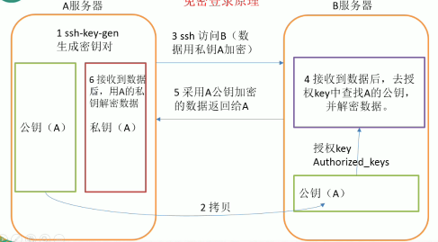

# Hadoop

***

## 一，Hadoop基础

### 1.1，Hadoop是什么？

1. Hadoop是一个由Apache基金会所开发的分布式系统基础架构。
2. 主要解决，海量数据的存储和海量数据的分析计算问题。
3. 广义上来说，HADOOP通常是指一个更广泛的概念——HADOOP生态圈。

### 1.2，Hadoop三大发行版本（Apache、Cloudera、Hortonworks）

1. Apache版本最原始（最基础）的版本，对于入门学习最好。
2. Cloudera在大型互联网企业中用的较多。
3. Hortonworks文档较好。

### 1.3，**Hadoop的优势**

1. 高可靠性：因为Hadoop假设计算元素和存储会出现故障，因为它维护多个工作数据副本，在出现故障时可以对失败的节点重新分布处理。
2. 高扩展性：在集群间分配任务数据，可方便的扩展数以千计的节点。
3.  高效性：在MapReduce的思想下，Hadoop是并行工作的，以加快任务处理速度。
4. 高容错性：自动保存多份副本数据，并且能够自动将失败的任务重新分配。

### 1.4，**Hadoop组成**

1. Hadoop HDFS：一个高可靠、高吞吐量的分布式文件系统。
2. Hadoop MapReduce：一个分布式的离线并行计算框架。
3. Hadoop YARN：作业调度与集群资源管理的框架。
4. Hadoop Common：支持其他模块的工具模块。

- HDFS架构概述：

1. NameNode（nn）：存储文件的元数据，如文件名，文件目录结构，文件属性（生成时间、副本数、文件权限），以及每个文件的块列表和块所在的DataNode等。
2. DataNode(dn)：在本地文件系统存储文件块数据，以及块数据的校验和。
3. Secondary NameNode(2nn)：用来监控HDFS状态的辅助后台程序，每隔一段时间获取HDFS元数据的快照。

- YARN架构概述

1. ResourceManager(rm)：处理客户端请求、启动/监控ApplicationMaster、监控NodeManager、资源分配与调度；
2. NodeManager(nm)：单个节点上的资源管理、处理来自ResourceManager的命令、处理来自ApplicationMaster的命令；
3. ApplicationMaster：数据切分、为应用程序申请资源，并分配给内部任务、任务监控与容错。
4. Container：对任务运行环境的抽象，封装了CPU、内存等多维资源以及环境变量、启动命令等任务运行相关的信息。

- ### MapReduce架构概述

  - MapReduce将计算过程分为两个阶段：Map和Reduce

  1. Map阶段并行处理输入数据
  2. Reduce阶段对Map结果进行汇总

### 1.5，大数据生态体系

1）Sqoop：sqoop是一款开源的工具，主要用于在Hadoop(Hive)与传统的数据库(mysql)间进行数据的传递，可以将一个关系型数据库（例如 ： MySQL ,Oracle 等）中的数据导进到Hadoop的HDFS中，也可以将HDFS的数据导进到关系型数据库中。

2）Flume：Flume是Cloudera提供的一个高可用的，高可靠的，分布式的海量日志采集、聚合和传输的系统，Flume支持在日志系统中定制各类数据发送方，用于收集数据；同时，Flume提供对数据进行简单处理，并写到各种数据接受方（可定制）的能力。

3）Kafka：Kafka是一种高吞吐量的分布式发布订阅消息系统，有如下特性：

（1）通过O(1)的磁盘数据结构提供消息的持久化，这种结构对于即使数以TB的消息存储也能够保持长时间的稳定性能。

（2）高吞吐量：即使是非常普通的硬件Kafka也可以支持每秒数百万的消息

（3）支持通过Kafka服务器和消费机集群来分区消息。

（4）支持Hadoop并行数据加载。

4）Storm：Storm为分布式实时计算提供了一组通用原语，可被用于“流处理”之中，实时处理消息并更新数据库。这是管理队列及工作者集群的另一种方式。 Storm也可被用于“连续计算”（continuous computation），对数据流做连续查询，在计算时就将结果以流的形式输出给用户。

5）Spark：Spark是当前最流行的开源大数据内存计算框架。可以基于Hadoop上存储的大数据进行计算。

6）Oozie：Oozie是一个管理Hdoop作业（job）的工作流程调度管理系统。Oozie协调作业就是通过时间（频率）和有效数据触发当前的Oozie工作流程。

7）Hbase：HBase是一个分布式的、面向列的开源数据库。HBase不同于一般的关系数据库，它是一个适合于非结构化数据存储的数据库。

8）Hive：hive是基于Hadoop的一个数据仓库工具，可以将结构化的数据文件映射为一张数据库表，并提供简单的sql查询功能，可以将sql语句转换为MapReduce任务进行运行。 其优点是学习成本低，可以通过类SQL语句快速实现简单的MapReduce统计，不必开发专门的MapReduce应用，十分适合数据仓库的统计分析。

10）R语言：R是用于统计分析、绘图的语言和操作环境。R是属于GNU系统的一个自由、免费、源代码开放的软件，它是一个用于统计计算和统计制图的优秀工具。

11）Mahout:

Apache Mahout是个可扩展的机器学习和数据挖掘库，当前Mahout支持主要的4个用例：

推荐挖掘：搜集用户动作并以此给用户推荐可能喜欢的事物。

聚集：收集文件并进行相关文件分组。

分类：从现有的分类文档中学习，寻找文档中的相似特征，并为无标签的文档进行正确的归类。

频繁项集挖掘：将一组项分组，并识别哪些个别项会经常一起出现。

12）ZooKeeper：Zookeeper是Google的Chubby一个开源的实现。它是一个针对大型分布式系统的可靠协调系统，提供的功能包括：配置维护、名字服务、 分布式同步、组服务等。ZooKeeper的目标就是封装好复杂易出错的关键服务，将简单易用的接口和性能高效、功能稳定的系统提供给用户。

### 1.6，系统框架

## 二，Hadoop环境搭建

### 2.1，虚拟机的网络模式设置为NAT模式

打开vmware虚拟机找到编辑------->虚拟网络编辑器------->选择NAT模式确定即可。

~~~ java
cync//把内存的文件加载到硬盘
reboot//重新启动虚拟机
~~~

### 2.2，克隆虚拟机修改静态 IP

1. 打开终端输入命令

~~~ java
//如果此时不是root用户的话输入su -切换到root用户下修改，在root用户下输入一下命令
[root@rui ~]# vim /etc/udev/rules.d/70-persistent-net.rules
//删除eth0该行；将eth1修改为eth0，同时复制物理ip地址
NAME="eth1"------>NAME="eth0"
00:0c:29:07:46:a2//这是我的物理地址
//退出保存即可
~~~

2. 修改ip地址：

~~~ java 
//在命令行输入
vim /etc/sysconfig/network-scripts/ifcfg-eth0
//修改刚才复制的物理地址
HWADDR=00:0c:29:07:46:a2
//修改ip地址（修改为你想要的ip地址即可），如果没有ip选项，可以IPADDR=192.168.149.103来添加ip地址
IPADDR=192.168.149.103
//修改以下两项为yes和static
ONBOOT=yes
BOOTPROTO=static
//添加以下内容
DNS1=192.168.1.2
GATEWAY=192.168.1.2
//退出保存即可
note:在克隆虚拟机时解决无法联网问题。

~~~

3. 修改主机名称

~~~ java
//输入：vi /etc/sysconfig/network修改为想要的名称
//通过hostname命令查看主机的名称，修改主机名后必须重启才可以生效
reboot重启
//重启后可以在终端输入ifconfig查看ip
~~~

4. 查看防火墙的状态

~~~ java
//查看防火墙状态
chkconfig iptables --list	
//关闭防火墙
chkconfig iptables off	
~~~

5. 以root权限在opt目录下创建文件夹

~~~ java
mkdir module
mkdir software
//修改权限
chown rui module
chown rui software
//或者一条语句
chown rui:rui /module /software
//两台虚拟机互传文件
scp -r 需要传输的文件名 rui@hadoop02:传输目的地的路径
例如：scp -r rzf.txt rui@hadoop02:/opt/software/
//rui@hadoop02:标示hadoop02主机下面的rui用户
//把安装包解压到module文件夹下面
 tar -zxvf hadoop-2.7.2.tar\ \(2\).gz -C /opt/module/
 tar -zxvf jdk-7u79-linux-x64.gz -C /opt/module/
~~~

### 2.3，配置jdk和hadoop的环境变量

~~~ java
//查看jdk的路径，用pwd命令查看jdk的安装目录
vim /etc/profile //以root用户身份，用命令进入profile配置环境变量
//环境变量如下
#JAVA_HOME
export JAVA_HOME=/opt/module/jdk1.7.0_79
export PATH=$PATH:$JAVA_HOME/bin
//配置hadoop环境变量
#HADOOP
export HADOOP_HOME=/opt/module/hadoop-2.7.2
export PATH=$PATH:$HADOOP_HOME/bin
export PATH=$PATH:$HADOOP_HOME/sbin
//加载配置文件
source  /etc/profile
//最后输入java和hadoop命令查看是否成功
~~~

### 2.4，在三台电脑之间互相传输文件

~~~ java
//rui@192.168.149.103标示本台主机下面的rui用户 
scp -r rui@192.168.149.103:/opt/module/rr.txt/ rui@192.168.149.104:/opt/module/
//把别的机器上的文件拷贝到本机器的当前目录
     scp -r rui@192.168.149.103:/opt/module/rr.txt ./

~~~

### 2.5，ssh集群无密码远程登录配置

~~~ java
//ll详细显示文件列表
//ls仅仅显示文件名
//ls -al显示所有文件，包括隐藏文件
//第一步：生成密钥对
ssh-keygen -t rsa
//第二部：将公钥拷贝到其他主机
ssh-copy-id 192.168.149.103
//现在远程登录192.168.149.103不需要密码
//也要给本主机复制公钥
 ssh-copy-id 192.168.149.102
 //在/etc/hosts文件中修改主机ip地址对应的域名
~~~

### 2.6，rsync命令

- rsync远程同步工具，主要用于备份和镜像。具有速度快、避免复制相同内容和支持符号链接的优点。

~~~ java
//命令的用法
 rsync -rvl sanguo/ rui@192.168.149.104:/opt/module/sanguo/
 rsync -rvl     $pdir/$fname         $user@hadoop$host:$pdir
		命令 命令参数 要拷贝的文件路径/名称   目的用户@主机:目的路径
-r 递归
-v 显示复制过程
-l 拷贝符号连接
~~~

## 三，**编写集群****分发脚本xsync

1. 在在/usr/local/bin目录下创建xsync文件，文件内容如下：

~~~ java
#!/bin/bash
#1 获取输入参数个数，如果没有参数，直接退出
pcount=$#
if((pcount==0)); then
echo no args;
exit;
fi

#2 获取文件名称
p1=$1
fname=`basename $p1`
echo fname=$fname

#3 获取上级目录到绝对路径
pdir=`cd -P $(dirname $p1); pwd`
echo pdir=$pdir

#4 获取当前用户名称
user=`whoami`

#5 循环
for((host=103; host<105; host++)); do
        #echo $pdir/$fname $user@hadoop$host:$pdir
        echo --------------- hadoop$host ----------------
        rsync -rvl $pdir/$fname $user@hadoop$host:$pdir
done
~~~

2. 升级当前脚本权限

~~~ java
chmod 7777 xsync 
xsync 同步的文件名
//即可实现同步,同步的时候一定要在被同步的上一层文件夹
~~~

## 四，编写xcall脚本

- 功能：列出目录列表

1. 在/usr/local/bin目录下创建xcall文件，文件内容如下：

~~~ java
#!/bin/bash
pcount=$#
if((pcount==0));then
        echo no args;
        exit;
fi

echo -------------localhost----------
$@
for((host=101; host<=104; host++)); do//此处修改为104
        echo ----------hadoop$host---------
        ssh hadoop$host $@
done
~~~

2. 升级权限

~~~ java
chmod 7777 xcall
//执行命令
xcall ls /opt/
~~~

## 五，基于伪分布式集群

- 配置分布图

|      | Hadoop101        | hadoop102                  | hadoop103                 |
| ---- | ---------------- | -------------------------- | ------------------------- |
| HDFS | NameNodeDataNode | DataNode                   | SecondaryNameNodeDataNode |
| YARN | NodeManager      | ResourceManagerNodeManager | NodeManager               |

### 5.1，配置core-site.xml文件

~~~ java
<!-- 指定HDFS中NameNode的地址 -->
	<property>
		<name>fs.defaultFS</name>
        <value>hdfs://hadoop102:9000</value>
	</property>
	<!-- 指定hadoop运行时产生文件的存储目录 -->
	<property>
		<name>hadoop.tmp.dir</name>
		<value>/opt/module/hadoop-2.7.2/data/tmp</value>
	</property>
	（2）Hdfs
~~~

- 配置HDFS文件

***

### 5.2，配置hadoop-env.sh

~~~ java
//配置.env一般是配置环境变量
export JAVA_HOME=/opt/module/jdk1.7.0_79
~~~

### 5.3，配置hdfs-site.xml

~~~ java
<configuration>	
	<property>
		<name>dfs.replication</name>
		<value>3</value>
	</property>
	<property>
        <name>dfs.namenode.secondary.http-address</name>
        <value>hadoop104:50090</value>
    </property>
    <configuration>	
~~~

### 5.4，配置slaves

~~~ java
hadoop101
hadoop102
hadoop103
~~~

***

- 配置yarn

***

### 5.5，配置yarn-env.sh

~~~ java
export JAVA_HOME=/opt/module/jdk1.7.0_79
~~~

### 5.6，配置yarn-site.xml

~~~ java
<configuration>
<!-- Site specific YARN configuration properties -->
<!-- reducer获取数据的方式 -->
    <property>
        <name>yarn.nodemanager.aux-services</name>
        <value>mapreduce_shuffle</value>
    </property>
<!-- 指定YARN的resourceManager的地址 -->
	<property>
		<name>yarn.resourcemanager.hostname</name>
		<value>hadoop102</value>
	</property>
<!-- Site specific YARN configuration properties -->
</configuration>
~~~

### 5.7，配置mapred-env.sh

~~~ java
export JAVA_HOME=/opt/module/jdk1.7.0_79
~~~

### 5.8，配置 mapred-site.xml

~~~ java
<configuration>
<!-- 指定mr运行在yarn上 -->
<property>
	<name>mapreduce.framework.name</name>
	<value>yarn</value>
</property>
</configuration>
~~~

### 5.8，把所有配置文件同步到所有主机上面

~~~ java
//同步配置信息
xsync hadoop/
~~~

### 5.9，启动集群

- 在这个过程中，如果有一部出错，就要删除集群文件：data,logs

1. 第一次启动集群，必须格式化~namenode~

~~~ java
 bin/hdfs namenode -format
~~~

2. 启动namenode和datanode

~~~ java
//直接在hadoop101主机执行脚本即可启动datanode和namenode
sbin/start-dfs.sh
//停止节点
sbin/stop-dfs.sh
//删除集群文件 
rm -rf data/ logs/
//注意不能再hadoop101主机里面启动NodeManager和ResourceManager，必须按照配置启动
//在hadoop102主机执行sbin/start-yarn.sh脚本启动NodeManager和ResourceManager
    
~~~

# 