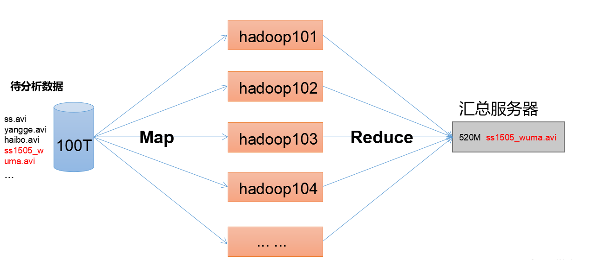
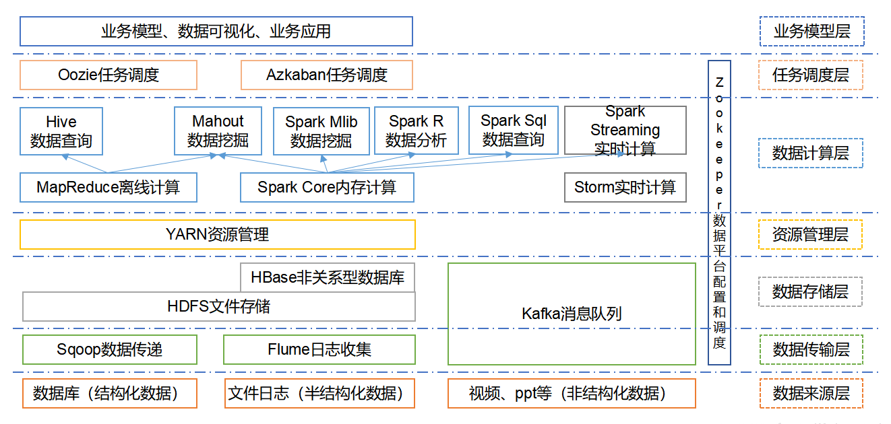

# Hadoop入门介绍

## 一，Hadoop是什么？

1. Hadoop是一个Apache基金会开发的分布式系统的架构。
2. 主要解决海量数据的存储和分析计算问题。
3. 广义上说，Hadoop通常指Hadoop生态圈。

## 二，Hadoop的四大优势

1. 高可靠性，hadoop底层维护了多个数据的副本，所以即使hadoop某个节点的数据出现故障，也不会导致数据的丢失。
2. 高扩展性：在集群之间分配任务，可以很方便扩展大量的节点。‘
3. 高效性：在mapreducer的思想下，hadoop是并行工作的，加快了数据的处理速度。
4. 高容错性：能够自行将失败的任务重新分配。

## 四，Hadoop的组成

- hadoop1和hadoop2的不同之处：

1. Hdfs介绍：
   1. namenode:存储文件的元数据，如文件名，文件属性（文件生成时间，权限等），文件目录结构，以及每个文件块信息和文件块所在的datenode地址。
   2. Datenode:在本地文件系统存储文件块的数据，以及数据块的校验和。
   3. Secondary Namenode:用来监控HDFS状态的辅助后台程序，每隔一段时间获取hdfs的快照。
2. Yarn架构概述：

3. MapReduce架构概述

   MapReduce将计算过程分为两个阶段：Map和Reduce，如图2-25所示

   1）Map阶段并行处理输入数据

   2）Reduce阶段对Map结果进行汇总

## 五，大数据生态体系

1）Sqoop：Sqoop是一款开源的工具，主要用于在Hadoop、Hive与传统的数据库(MySql)间进行数据的传递，可以将一个关系型数据库（例如 ：MySQL，Oracle 等）中的数据导进到Hadoop的HDFS中，也可以将HDFS的数据导进到关系型数据库中。

2）Flume：Flume是Cloudera提供的一个高可用的，高可靠的，分布式的海量日志采集、聚合和传输的系统，Flume支持在日志系统中定制各类数据发送方，用于收集数据；同时，Flume提供对数据进行简单处理，并写到各种数据接受方（可定制）的能力。

3）Kafka：Kafka是一种高吞吐量的分布式发布订阅消息系统，有如下特性：

（1）通过O(1)的磁盘数据结构提供消息的持久化，这种结构对于即使数以TB的消息存储也能够保持长时间的稳定性能。

（2）高吞吐量：即使是非常普通的硬件Kafka也可以支持每秒数百万的消息。

（3）支持通过Kafka服务器和消费机集群来分区消息。

（4）支持Hadoop并行数据加载。

4）Storm：Storm用于“连续计算”，对数据流做连续查询，在计算时就将结果以流的形式输出给用户。

5）Spark：Spark是当前最流行的开源大数据内存计算框架。可以基于Hadoop上存储的大数据进行计算。

6）Oozie：Oozie是一个管理Hdoop作业（job）的工作流程调度管理系统。

7）Hbase：HBase是一个分布式的、面向列的开源数据库。HBase不同于一般的关系数据库，它是一个适合于非结构化数据存储的数据库。

8）Hive：Hive是基于Hadoop的一个数据仓库工具，可以将结构化的数据文件映射为一张数据库表，并提供简单的SQL查询功能，可以将SQL语句转换为MapReduce任务进行运行。 其优点是学习成本低，可以通过类SQL语句快速实现简单的MapReduce统计，不必开发专门的MapReduce应用，十分适合数据仓库的统计分析。

10）R语言：R是用于统计分析、绘图的语言和操作环境。R是属于GNU系统的一个自由、免费、源代码开放的软件，它是一个用于统计计算和统计制图的优秀工具。

11）Mahout：Apache Mahout是个可扩展的机器学习和数据挖掘库。

12）ZooKeeper：Zookeeper是Google的Chubby一个开源的实现。它是一个针对大型分布式系统的可靠协调系统，提供的功能包括：配置维护、名字服务、 分布式同步、组服务等。ZooKeeper的目标就是封装好复杂易出错的关键服务，将简单易用的接口和性能高效、功能稳定的系统提供给用户。

## 六，Hadoop运行模式

Hadoop运行模式包括：本地模式、伪分布式模式以及完全分布式模式。

- 完全分布式模式搭建：

  [完全分布式搭建](Hadoop完全分布式环境搭建.md)

