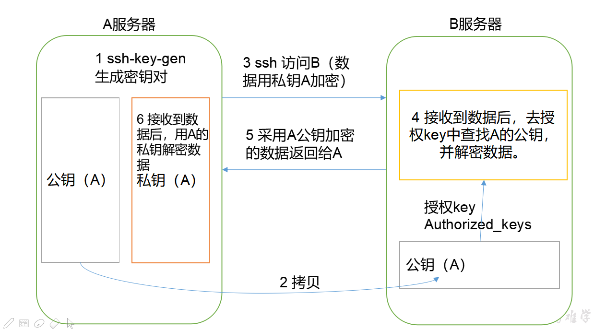
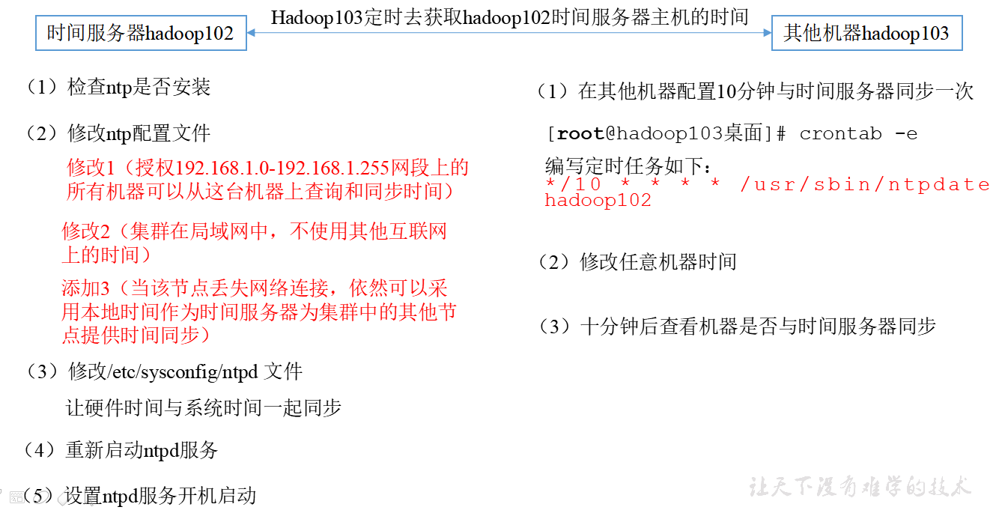

# Hadoop完全分布式环境搭建

## 一，虚拟机环境准备

1. 准备3台客户机（关闭防火墙、静态ip、主机名称）。

~~~ java
//在root权限下打开此配置文件
vim /etc/udev/rules.d/70-persistent-net.rules
//删除eth0该行；将eth1修改为eth0，同时复制物理ip地址
~~~

2. 修改ip地址

~~~ java
//1，打开此配置文件修改静态ip地址
vim /etc/sysconfig/network-scripts/ifcfg-eth0
//2，修改刚才复制的物理地址
//3，修改以下两项为yes和static
ONBOOT=yes
BOOTPROTO=static
//4，修改DNS和网关
DNS1=192.168.1.2
GATEWAY=192.168.1.2
//退出保存即可
~~~

3. 修改主机名称

~~~ java
//在vi /etc/sysconfig/network文件中修改为想要的名称
//通过hostname命令查看主机的名称，修改主机名后必须重启才可以生效
reboot重启
//重启后可以在终端输入ifconfig查看ip
~~~

4. 查看防火墙的状态

~~~ java
//查看防火墙状态
chkconfig iptables --list	
//关闭防火墙
chkconfig iptables off	
~~~

5. 创建自己的用户

~~~ java
useradd rzf
//配置自己的用户具有root权限，在etc/profile文件下修改具有root权限
~~~

6. 在/opt目录下创建文件夹

~~~ java
mkdir module
mkdir software
//修改文件夹所有者
chown rui module
chown rui software
//或者一条语句
chown rui:rui /module /software
~~~

## 二，安装JDK

1. 卸载现有JDK

   1. 查询是否安装Java软件

   ~~~ java
   rpm -qa | grep java
   ~~~

   2. 如果安装的版本低于1.7，卸载该JDK

   ~~~ java
   sudo rpm -e 软件包
   ~~~

   3. 查看JDK安装路径

   ~~~ java
   which java
   ~~~

2. 用SecureCRT工具将JDK导入到opt目录下面的software文件夹下面,并且安装jdk

~~~ java
//解压JDK到/opt/module目录下
tar -zxvf jdk-8u144-linux-x64.tar.gz -C /opt/module/
~~~

3. 配置JDK环境变量

~~~ java
//1，先用pwd命令获取jdk安装目录
//2，打开/etc/profile文件，在profile文件末尾添加JDK路径
#JAVA_HOME
export JAVA_HOME=/opt/module/jdk1.8.0_144
export PATH=$PATH:$JAVA_HOME/bin
//3，让修改后的文件生效
source /etc/profile
//4，此时是否成功
java -version
//如果不可用就重启
sync//标示把内存的文件加载到磁盘
sudo reboot
~~~

## 三，安装Hadoop

1. 下载地址

~~~ java
https://archive.apache.org/dist/hadoop/common/hadoop-2.7.2/
~~~

2. 解压安装文件到/opt/module下面

~~~ java
tar -zxvf hadoop-2.7.2.tar.gz -C /opt/module/
~~~

3. 将Hadoop添加到环境变量

~~~ java
//1，用pwd命令获取安装目录
//2,打开/etc/profile文件,在profile文件末尾添加JDK路径：（shitf+g）
##HADOOP_HOME
export HADOOP_HOME=/opt/module/hadoop-2.7.2
export PATH=$PATH:$HADOOP_HOME/bin
export PATH=$PATH:$HADOOP_HOME/sbin
//3,保存退出，让修改后的文件生效
source /etc/profile
//4,测试是否安装成功
hadoop version
//5，重启(如果Hadoop命令不能用再重启)
sync
sudo reboot
~~~

## 四，Hadoop目录结构分析

（1）bin目录：存放对Hadoop相关服务（HDFS,YARN）进行操作的脚本

（2）etc目录：Hadoop的配置文件目录，存放Hadoop的配置文件

（3）lib目录：存放Hadoop的本地库（对数据进行压缩解压缩功能）

（4）sbin目录：存放启动或停止Hadoop相关服务的脚本

（5）share目录：存放Hadoop的依赖jar包、文档、和官方案例

## 五，ssh集群无密码远程登录配置

- 原理：

| known_hosts     | 记录ssh访问过计算机的公钥(public key) |
| --------------- | ------------------------------------- |
| id_rsa          | 生成的私钥                            |
| id_rsa.pub      | 生成的公钥                            |
| authorized_keys | 存放授权过得无密登录服务器公钥        |

~~~ java
//第一步：在home/.ssh文件夹下执行命令生成密钥对
ssh-keygen -t rsa
//然后敲（三个回车），就会生成两个文件id_rsa（私钥）、id_rsa.pub（公钥）
//第二步：将公钥拷贝到其他主机
ssh-copy-id hadoop101
//注意：
//还需要在hadoop102上采用root账号，配置一下无密登录到hadoop102、hadoop103、hadoop104；
//还需要在hadoop103上采用atguigu账号配置一下无密登录到hadoop102、hadoop103、hadoop104服务器上。
//现在远程登录192.168.149.103不需要密码
ssh hadoop101
//也要给本主机复制公钥
 ssh-copy-id 192.168.149.102
//在/etc/hosts文件中修改主机ip地址对应的域名
//登录另一台电脑语法
    ssh另一台电脑的ip地址
~~~

## 六，编写集群分发脚本xsync

1. 在在/usr/local/bin目录下创建xsync文件，文件内容如下：（也可以在/home/文件夹下创建bin目录存放脚本文件）

~~~ java
#!/bin/bash
#1 获取输入参数个数，如果没有参数，直接退出
pcount=$#
if((pcount==0)); then
echo no args;
exit;
fi

#2 获取文件名称
p1=$1
fname=`basename $p1`
echo fname=$fname

#3 获取上级目录到绝对路径
pdir=`cd -P $(dirname $p1); pwd`
echo pdir=$pdir

#4 获取当前用户名称
user=`whoami`

#5 循环
for((host=103; host<105; host++)); do
        #echo $pdir/$fname $user@hadoop$host:$pdir
        echo --------------- hadoop$host ----------------
        rsync -rvl $pdir/$fname $user@hadoop$host:$pdir
done
~~~

2. 升级脚本权限

~~~ java
chmod 7777 xsync 
xsync 同步的文件名
//即可实现同步,同步的时候一定要在被同步的上一层文件夹
~~~

## 七，基于完全分布式的集群搭建

1. 集群规划

|      | Hadoop101            | Hadoop102                   | Hadoop103                   |
| ---- | -------------------- | --------------------------- | --------------------------- |
| HDFS | NameNode    DataNode | DataNode                    | SecondaryNameNode  DataNode |
| YARN | NodeManager          | ResourceManager NodeManager | NodeManager                 |

2. 集群配置
   1. 核心配置文件：core-site.xml

~~~ java
<!-- 指定HDFS中NameNode的地址 -->
<property>
		<name>fs.defaultFS</name>
      <value>hdfs://hadoop101:9000</value>
</property>

<!-- 指定Hadoop运行时产生文件的存储目录 -->
<property>
		<name>hadoop.tmp.dir</name>
		<value>/opt/module/hadoop-2.7.2/data/tmp</value>
</property>
~~~

​	2. HDFS配置文件:配置hadoop-env.sh

~~~ java
//配置java的环境变量
export JAVA_HOME=/opt/module/jdk1.8.0_144
~~~

​	3. 配置hdfs-site.xml

~~~ java
<property>
		<name>dfs.replication</name>
		<value>3</value>
</property>

<!-- 指定Hadoop辅助名称节点主机配置 -->
<property>
      <name>dfs.namenode.secondary.http-address</name>
      <value>hadoop103:50090</value>
</property>
~~~

​	4. YARN配置文件:配置yarn-env.sh

~~~ java
//配置环境变量
export JAVA_HOME=/opt/module/jdk1.8.0_144
~~~

​	5. 配置yarn-site.xml

~~~ java
<!-- Reducer获取数据的方式 -->
<property>
		<name>yarn.nodemanager.aux-services</name>
		<value>mapreduce_shuffle</value>
</property>

<!-- 指定YARN的ResourceManager的地址 -->
<property>
		<name>yarn.resourcemanager.hostname</name>
		<value>hadoop102</value>
</property>
~~~

​	6. MapReduce配置文件:配置mapred-env.sh

~~~ java
//配置环境变量
export JAVA_HOME=/opt/module/jdk1.8.0_144
~~~

​	7. 配置mapred-site.xml

~~~ java
//(对mapred-site.xml.template重新命名为) mapred-site.xml
<!-- 指定MR运行在Yarn上 -->
<property>
		<name>mapreduce.framework.name</name>
		<value>yarn</value>
</property>
//为了查看程序的历史运行情况，需要配置一下历史服务器。具体配置步骤如下：
<!-- 历史服务器端地址 -->
<property>
<name>mapreduce.jobhistory.address</name>
<value>hadoop101:10020</value>
</property>

<!-- 历史服务器web端地址 -->
<property>
    <name>mapreduce.jobhistory.webapp.address</name>
    <value>hadoop101:19888</value>
</property>
//启动历史服务器
sbin/mr-jobhistory-daemon.sh start historyserver
//查看JobHistory
http://hadoop101:19888/jobhistory
~~~

​	8. 配置salvse文件

~~~ java
//注意：该文件中添加的内容结尾不允许有空格，文件中不允许有空行。
Hadoop101
Hadoop102
Hadoop103
//同步所有节点配置文件
xsync slaves
~~~

​	9. 在集群上分发配置好的Hadoop配置文件

~~~ java
xsync /opt/module/hadoop-2.7.2/
~~~

​	10. 查看文件分发情况

~~~ java
cat /opt/module/hadoop-2.7.2/etc/hadoop/core-site.xml
~~~

 	11. 集群的启动,如果集群是第一次启动，需要格式化NameNode

~~~ java
hadoop namenode -format
//思考：为什么不能一直格式化NameNode，格式化NameNode，要注意什么？
//注意：格式化NameNode，会产生新的集群id,导致NameNode和DataNode的集群id不一致，集群找不到已往数据。所以，格式NameNode时，一定要先删除data数据和log日志，然后再格式化NameNode。
~~~

​	12. 在hadoop101上启动NameNode(以下是单点启动)

~~~ java
hadoop-daemon.sh start namenode
~~~

 	13. 在hadoop102、hadoop103以及hadoop104上分别启动DataNod

~~~ java
hadoop-daemon.sh start datanode
~~~

 	14. 群起集群,应为在上面已经配置过ssh无密码登录和salves文件，所以现在可以群起集群，如果没有配置无密码登录和salves文件，现在需要配置,然后分发文件：xsync slaves。

==尖叫提示：启动前必须保证NameNode和DataNode已经启动==

~~~ java
//如果集群是第一次启动，需要格式化NameNode（注意格式化之前，一定要先停止上次启动的所有namenode和datanode进程，然后再删除data和log数据）
bin/hdfs namenode -format
//启动namenode
sbin/start-dfs.sh
//启动yarn
sbin/start-yarn.sh
//注意：NameNode和ResourceManger如果不是同一台机器，不能在NameNode上启动 YARN，应该在ResouceManager所在的机器上启动YARN。
~~~

 15. 日志聚集概念：应用运行完成以后，将程序运行日志信息上传到HDFS系统上。

     日志聚集功能好处：可以方便的查看到程序运行详情，方便开发调试。

     注意：开启日志聚集功能，需要重新启动NodeManager 、ResourceManager和HistoryManager。

     开启日志聚集功能具体步骤如下：

~~~ java
//1.配置yarn-site.xml
<!-- 日志聚集功能使能 -->
<property>
<name>yarn.log-aggregation-enable</name>
<value>true</value>
</property>

<!-- 日志保留时间设置7天 -->
<property>
<name>yarn.log-aggregation.retain-seconds</name>
<value>604800</value>
</property>
~~~

 	15. 在yarn上面执行wordcount程序

~~~ java
//需要在此目录下新建word文件/user/rzf/input
hadoop jar
 share/hadoop/mapreduce/hadoop-mapreduce-examples-2.7.2.jar wordcount /user/rzf/input /user/rzf/output
~~~

​	16. Web端查看SecondaryNameNode

浏览器中输入：<http://hadoop101:50090/status.html>

​	集群测试：

~~~ java
//（1）上传文件到集群
	  //上传小文件
hdfs dfs -mkdir -p /user/rzf/input
hdfs dfs -put wcinput/wc.input /user/rzf/input
	// 上传大文件
	bin/hadoop fs -put
 /opt/software/hadoop-2.7.2.tar.gz  /user/rzf/input
 //上传文件后查看文件存放在什么位置
 pwd
~~~

 	17. 配置文件说明

Hadoop配置文件分两类：默认配置文件和自定义配置文件，只有用户想修改某一默认配置值时，才需要修改自定义配置文件，更改相应属性值。

（1）默认配置文件：

| 要获取的默认文件     | 文件存放在Hadoop的jar包中的位置                            |
| -------------------- | ---------------------------------------------------------- |
| [core-default.xml]   | hadoop-common-2.7.2.jar/ core-default.xml                  |
| [hdfs-default.xml]   | hadoop-hdfs-2.7.2.jar/ hdfs-default.xml                    |
| [yarn-default.xml]   | hadoop-yarn-common-2.7.2.jar/ yarn-default.xml             |
| [mapred-default.xml] | hadoop-mapreduce-client-core-2.7.2.jar/ mapred-default.xml |

（2）自定义配置文件：

​	core-site.xml、hdfs-site.xml、yarn-site.xml、mapred-site.xml四个配置文件存放在$HADOOP_HOME/etc/hadoop这个路径上，用户可以根据项目需求重新进行修改配置。

 	18. 集群启动,停止方式总结

1.	各个服务组件逐一启动/停止

​	（1）分别启动/停止HDFS组件

​		hadoop-daemon.sh  start / stop  namenode / datanode / secondarynamenode

​	（2）启动/停止YARN

​		yarn-daemon.sh  start / stop  resourcemanager / nodemanager

2.	各个模块分开启动/停止（配置ssh是前提）常用

​	（1）整体启动/停止HDFS

​		start-dfs.sh   /  stop-dfs.sh

​	（2）整体启动/停止YARN

​		start-yarn.sh  /  stop-yarn.sh

 	19. **集群时间同步**

- 时间同步的方式：找一个机器，作为时间服务器，所有的机器与这台集群时间进行定时的同步，比如，每隔十分钟，同步一次时间。

~~~ java
//1.	时间服务器配置（必须root用户）
//（1）检查ntp是否安装
rpm -qa|grep ntp
//（2）修改ntp配置文件
vi /etc/ntp.conf
修改内容如下
a）修改1（授权192.168.1.0-192.168.1.255网段上的所有机器可以从这台机器上查询和同步时间）
#restrict 192.168.1.0 mask 255.255.255.0 nomodify notrap为
restrict 192.168.1.0 mask 255.255.255.0 nomodify notrap
b）修改2（集群在局域网中，不使用其他互联网上的时间）
server 0.centos.pool.ntp.org iburst
server 1.centos.pool.ntp.org iburst
server 2.centos.pool.ntp.org iburst
server 3.centos.pool.ntp.org iburst为
#server 0.centos.pool.ntp.org iburst
#server 1.centos.pool.ntp.org iburst
#server 2.centos.pool.ntp.org iburst
#server 3.centos.pool.ntp.org iburst
c）添加3（当该节点丢失网络连接，依然可以采用本地时间作为时间服务器为集群中的其他节点提供时间同步）
server 127.127.1.0
fudge 127.127.1.0 stratum 10
（3）修改/etc/sysconfig/ntpd 文件
[root@hadoop102 桌面]# vim /etc/sysconfig/ntpd
增加内容如下（让硬件时间与系统时间一起同步）
SYNC_HWCLOCK=yes
（4）重新启动ntpd服务
[root@hadoop102 桌面]# service ntpd status
ntpd 已停
[root@hadoop102 桌面]# service ntpd start
正在启动 ntpd：                                            [确定]
（5）设置ntpd服务开机启动
[root@hadoop102 桌面]# chkconfig ntpd on
2.	其他机器配置（必须root用户）
（1）在其他机器配置10分钟与时间服务器同步一次
[root@hadoop103桌面]# crontab -e
编写定时任务如下：
*/10 * * * * /usr/sbin/ntpdate hadoop102
（2）修改任意机器时间
[root@hadoop103桌面]# date -s "2017-9-11 11:11:11"
（3）十分钟后查看机器是否与时间服务器同步
[root@hadoop103桌面]# date
说明：测试的时候可以将10分钟调整为1分钟，节省时间。
~~~

