# Hive笔记

## 第一章，Hive的基本概念


### 1.1，什么是Hive?

1. Hive：由Facebook开源用于解决海量结构化日志的数据统计。

   Hive是基于Hadoop的一个数据仓库工具，可以将结构化的数据文件映射为一张表，并提供类SQL查询功能。是在hdoop处理结构化数据的仓库

   本质是：==将HQL转化成MapReduce程序==


1）Hive处理的数据存储在HDFS

2）Hive分析数据底层的实现是MapReduce

3）执行程序运行在Yarn上

### 1.2，Hive的优缺点

- 优点

1) 操作接口采用类SQL语法，提供快速开发的能力（简单、容易上手）。

2) 避免了去写MapReduce，减少开发人员的学习成本。

3) Hive的执行延迟比较高，因此Hive常用于数据分析，对实时性要求不高的场合。

4) Hive优势在于处理大数据，对于处理小数据没有优势，因为Hive的执行延迟比较高。

5) Hive支持用户自定义函数，用户可以根据自己的需求来实现自己的函数。

- 缺点

1．Hive的HQL表达能力有限

（1）迭代式算法无法表达

（2）数据挖掘方面不擅长，由于MapReduce数据处理流程的限制，效率更高的算法却无法实现。

2．Hive的效率比较低

（1）Hive自动生成的MapReduce作业，通常情况下不够智能化

（2）Hive调优比较困难，粒度较粗

### 1.3，Hive架构原理


1．用户接口：Client

CLI（command-line interface）、JDBC/ODBC(jdbc访问hive)、WEBUI（浏览器访问hive）

2．元数据：Metastore

元数据包括：表名、表所属的数据库（默认是default）、表的拥有者、列/分区字段、表的类型（是否是外部表）、表的数据所在目录等；

默认存储在自带的derby数据库中，推荐使用MySQL存储Metastore，hive会将元数据信息存储在mysql数据库中。

3．Hadoop

使用HDFS进行存储，使用MapReduce进行计算。

4．驱动器：Driver

（1）解析器（SQL Parser）：将SQL字符串转换成抽象语法树AST，这一步一般都用第三方工具库完成，比如antlr；对AST进行语法分析，比如表是否存在、字段是否存在、SQL语义是否有误。

（2）编译器（Physical Plan）：将AST编译生成逻辑执行计划。

（3）优化器（Query Optimizer）：对逻辑执行计划进行优化。

（4）执行器（Execution）：把逻辑执行计划转换成可以运行的物理计划。对于Hive来说，就是MR/Spark。


Hive通过给用户提供的一系列交互接口，接收到用户的指令(SQL)，使用自己的Driver，结合元数据(MetaStore)，将这些指令翻译成MapReduce，提交到Hadoop中执行，最后，将执行返回的结果输出到用户交互接口。

## 第二章，Hive的安装

### 2.1，安装部署

~~~ java

//想要在hive客户端中使用bell命令，就在命令前面加上！即可
!pwd;
//在hive数据库中
.*标示匹配任意字符串
//（1）把apache-hive-1.2.1-bin.tar.gz上传到linux的/opt/software目录下
//（2）解压apache-hive-1.2.1-bin.tar.gz到/opt/module/目录下面
tar -zxvf hive-0.13.1-cdh5.3.6.tar.gz -C /opt/module/
//(3)重命名配置文件
mv hive-default.xml.template hive-default.xml文件名
mv hive-env.sh.template hive-env.sh
//(4) 配置hive-env.sh文件
JAVA_HOME=/opt/module/jdk1.7.0_79
HADOOP_HOME=/opt/module/ha/hadoop-2.7.2
export HIVE_CONF_DIR=/opt/module/hive-0.13.1-cdh5.3.6/conf
~~~

在linus上面安装mysql（执行一下操作在root权限下）（这里使用的是免安装版本的）

1. 查看是否安装mysql服务

```java
rpm -qa|grep mysql
```

2. 卸载mysql服务

```java
 rpm -e --nodeps mysql-libs-5.1.73-7.el6.x86_64
```

3. 解压mysql-libs.zip文件到指定目录

```java
//下载安装包
http://dev.mysql.com/get/Downloads/MySQL-5.7/mysql-5.7.20-linux-glibc2.12-x86_64.tar.gz
//如果是.zip文件包，用一下命令解压
unzip 文件名
```

4. 创建用户组mysql，创建用户mysql并将其添加到用户组mysql中，并赋予读写权限

```java
groupadd mysql

useradd -r -g mysql mysql

chown -R mysql mysql/

chgrp -R mysql mysql/
```

5. 安装mydql服务器

```java
//在mysql-libs目录下执行
rpm -ivh MySQL-server-5.6.24-1.el6.x86_64.rpm
```

6. 查看产生的随机密码

```java
cat /root/.mysql_secret
```

7. 查看mysql状态

```java
//启动mysql服务
 service mysqld start

service mysqld status
```

------

1. 安装Mysql客户端

```java
rpm -ivh MySQL-client-5.6.24-1.el6.x86_64.rpm
```

2. 连接mysql

```java
mysql -uroot -p生成的随机密码
```

3. 修改密码

```java
mysql>SET PASSWORD=PASSWORD('000000');
//设置开机自启
 chkconfig mysqld on
 //在mysql的user表里面查看用户权限
 use mysql;
desc user;
```

4. 退出

```java
mysql>exit
```

### 2.2，操作数据库表

~~~ java
//查看数据库
show databases
//给101的root用户授权访问数据库
grant all on *.* to root@hadoop101 identified by 'root'；
//然后执行刷新操作
flush privileges;
~~~

### 2.3，修改hive.env.xml围文件

~~~ java
<property>
  <name>javax.jdo.option.ConnectionURL</name>
  <value>jdbc:mysql://hadoop101:3306/metastore?createDatabaseIfNotExist=true</value>
  <description>JDBC connect string for a JDBC metastore</description>
</property>
//修改驱动包
<property>
  <name>javax.jdo.option.ConnectionDriverName</name>
  <value>com.mysql.jdbc.Driver</value>
  <description>Driver class name for a JDBC metastore</description>
</property>
//修改用户名和密码
<property>
  <name>javax.jdo.option.ConnectionUserName</name>
  <value>root</value>
  <description>username to use against metastore database</description>
</property>

<property>
  <name>javax.jdo.option.ConnectionPassword</name>
  <value>root</value>
  <description>password to use against metastore database</description>
</property>
//修改hive存放日志的文件夹，在hive-log4j.properties文件里面
hive.log.dir=/opt/module/hive-0.13.1-cdh5.3.6/logs
//拷贝数据库驱动包到hive根目录下面的lib目录
//在mysql里面创建hive数据库
create database hive2
//初始化hive的元数据到mysql中
bin/schematool -dbType mysql -initSchema
~~~

### 2.4，Hive的基本操作

~~~ java
//启动Hive
 bin/hive
//打开默认数据库
use default;
//显示default中的所有表
show tables;
//创建数据库
create database mydb2;
//查看表的结构
desc student;
//向表中插入数据
insert into student values(1000,"ss");
//删除已经创建的表
drop table student;
//创建student表, 并声明文件分隔符’\t’
hive> create table student(id int, name string) ROW FORMAT DELIMITED FIELDS TERMINATED
 BY '\t';
//加载/opt/module/datas/student.txt 文件到student数据库表中。
hive> load data local inpath '/opt/module/datas/student.txt' into table student;
//退出hive
quit;
说明：（查看hive在hdfs中的结构）
数据库：在hdfs中表现为${hive.metastore.warehouse.dir}目录下一个文件夹
表：在hdfs中表现所属db目录下一个文件夹，文件夹中存放该表中的具体数据
~~~

### 2.5，单用户模式搭建

~~~ java
//mysql服务在hadoop101,hive在hadoop102节点上
//上传压缩包解压到/opt/module文件夹中
//在etc/profile文件下配置环境变量
Hive
export HIVE_HOME=/opt/module/hive-1.2.1
export PATH=$PATH:$HIVE_HOME/bin
source /etc/profile
//修改hive-site.xml文件
<?xml version="1.0"?>  
<?xml-stylesheet type="text/xsl" href="configuration.xsl"?>  
  
<configuration>  
<property>  
  <name>hive.metastore.warehouse.dir</name>  
  <value>/user/hive_remote/warehouse</value>  
</property>  
   
<property>  
  <name>hive.metastore.local</name>  
  <value>false</value>  
</property>  
   
<property>  
  <name>javax.jdo.option.ConnectionURL</name>  
  <value>jdbc:mysql://hadoop101/hive_remote?createDatabaseIfNotExist=true</value>  
</property>  
   
<property>  
  <name>javax.jdo.option.ConnectionDriverName</name>  
  <value>com.mysql.jdbc.Driver</value>  
</property>  
   
<property>  
  <name>javax.jdo.option.ConnectionUserName</name>  
  <value>root</value>  
</property>  
   
<property>  
  <name>javax.jdo.option.ConnectionPassword</name>  
  <value>root</value>  
</property>  
</configuration>  
//导入jap包
~~~

### 2.6，Hive中一次使用的命令

~~~ java
//-e可以一次使用sql查询命令
hive -e "select * from mytable limit 3";
//-S参数可以将查询结果保存在一个文件中
hive -S -e "select * from mytable limit 3" >tmp>my.txt
~~~

### 2.7，从文件中执行hive查询

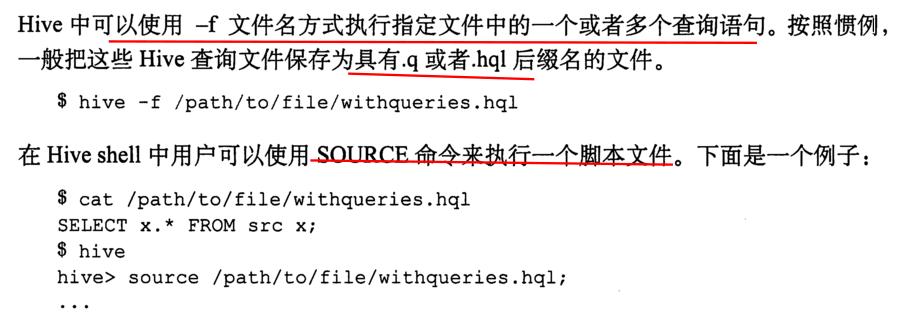

 ### 2.8，在hive中执行shell命令

在需要执行的命令前面添加!以及在，命令末尾添加；即可。

在hive客户端中执行hadoop命令

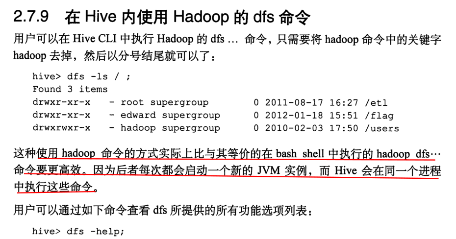

## 第三章，Hive数据类型

### 3.1，基本数据类型

| Hive数据类型 | Java数据类型 | 长度                                                 | 例子                                 |
| ------------ | ------------ | ---------------------------------------------------- | ------------------------------------ |
| TINYINT      | byte         | 1byte有符号整数                                      | 20                                   |
| SMALINT      | short        | 2byte有符号整数                                      | 20                                   |
| INT          | int          | 4byte有符号整数                                      | 20                                   |
| BIGINT       | long         | 8byte有符号整数                                      | 20                                   |
| BOOLEAN      | boolean      | 布尔类型，true或者false                              | TRUE  FALSE                          |
| FLOAT        | float        | 单精度浮点数                                         | 3.14159                              |
| DOUBLE       | double       | 双精度浮点数                                         | 3.14159                              |
| STRING       | string       | 字符系列。可以指定字符集。可以使用单引号或者双引号。 | ‘now is the time’ “for all good men” |
| TIMESTAMP    |              | 时间类型                                             |                                      |
| BINARY       |              | 字节数组                                             |                                      |

对于Hive的String类型相当于数据库的varchar类型，该类型是一个可变的字符串，不过它不能声明其中最多能存储多少个字符，理论上它可以存储2GB的字符数。

### 3.2，集合数据类型

| 数据类型 | 描述                                                         | 语法示例                                       |
| -------- | ------------------------------------------------------------ | ---------------------------------------------- |
| STRUCT   | 和c语言中的struct类似，都可以通过“点”符号访问元素内容。例如，如果某个列的数据类型是STRUCT{first STRING, last STRING},那么第1个元素可以通过字段.first来引用。 | struct()例如struct<street:string, city:string> |
| MAP      | MAP是一组键-值对元组集合，使用数组表示法可以访问数据。例如，如果某个列的数据类型是MAP，其中键->值对是’first’->’John’和’last’->’Doe’，那么可以通过字段名[‘last’]获取最后一个元素 | map()例如map<string, int>                      |
| ARRAY    | 数组是一组具有相同类型和名称的变量的集合。这些变量称为数组的元素，每个数组元素都有一个编号，编号从零开始。例如，数组值为[‘John’, ‘Doe’]，那么第2个元素可以通过数组名[1]进行引用。 | Array()例如array<string>                       |

Hive有三种复杂数据类型ARRAY、MAP 和 STRUCT。ARRAY和MAP与Java中的Array和Map类似，而STRUCT与C语言中的Struct类似，它封装了一个命名字段集合，复杂数据类型允许任意层次的嵌套。

### 3.3，类型转换

Hive的原子数据类型是可以进行隐式转换的，类似于Java的类型转换，例如某表达式使用INT类型，TINYINT会自动转换为INT类型，但是Hive不会进行反向转化，例如，某表达式使用TINYINT类型，INT不会自动转换为TINYINT类型，它会返回错误，除非使用CAST操作。

1．隐式类型转换规则如下

（1）任何整数类型都可以隐式地转换为一个范围更广的类型，如TINYINT可以转换成INT，INT可以转换成BIGINT。

（2）所有整数类型、FLOAT和STRING类型都可以隐式地转换成DOUBLE。

（3）TINYINT、SMALLINT、INT都可以转换为FLOAT。

（4）BOOLEAN类型不可以转换为任何其它的类型。

2．可以使用CAST操作显示进行数据类型转换

例如CAST('1' AS INT)将把字符串'1' 转换成整数1；如果强制类型转换失败，如执行CAST('X' AS INT)，表达式返回空值 NULL。

0: jdbc:hive2://hadoop102:10000> select '1'+2, cast('1'as int) + 2;

+------+------+--+

| _c0  | _c1  |

+------+------+--+

| 3.0  | 3    |

+------+------+--+

hive中并没有键的概念，但是用户可以对表建立索引。

### 3.4，hive小红默认的记录字段分隔符

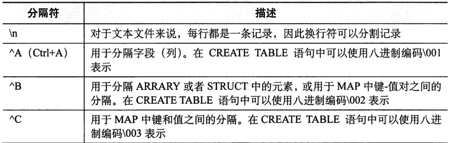

### 3.5，hive读时模式

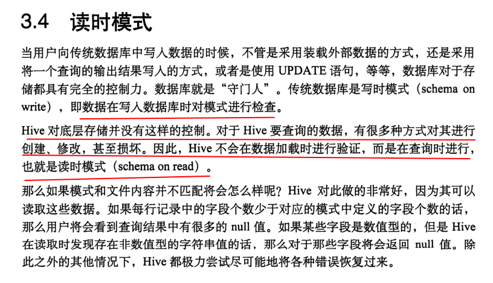

## 第四章，数据定义语言DDL（**Data Definition Language**）

- hive不支持行级插入操作更新操作和删除操作，也不支持事务。

### 4.1，创建数据库

~~~ java
CREATE DATABASE [IF NOT EXISTS] database_name
[COMMENT database_comment]//为数据库添加信息
[LOCATION hdfs_path]//指定在metastore上面的存储路径
[WITH DBPROPERTIES (property_name=property_value, ...)];//设置数据库的属性
//hive会为每一个数据库创建一个目录，数据库中的表将会以这个数据库目录扥子目录形式存储。
~~~

1）创建一个数据库，数据库在HDFS上的默认存储路径是/user/hive/warehouse/*.db。

~~~ java
create database db_hive;
//创建数据库添加注释
create database finance comment 'all people finance record';
//查看注释
describe database finance
//创建带描述信息的数据库
create database finances with dbproperties('creator'='rui','date'='2020-3-20');
//查看详细的描述xinxi
database extended finances;
OK
db_name comment location        owner_name      owner_type      parameters
finances                hdfs://hadoop101:9000/user/hive/warehouse/finances.db   rui     USER{date=2020-3-20, creator=rui}
~~~

2）避免要创建的数据库已经存在错误，增加if not exists判断。（标准写法）

~~~ java
create database if not exists db_hive;
~~~

创建一个数据库，指定数据库在HDFS上存放的位置

~~~ java
reate database db_hive2 location '/db_hive2.db';
~~~

### 4.2，查询数据库

1．显示数据库

~~~ java
show databases
~~~

2．过滤显示查询的数据库

~~~ java
show databases like 'defaul*';//这里通配符代指一个字符
~~~

3．显示数据库信息

~~~ java
desc database default;
~~~

4．显示数据库详细信息，extended

~~~ java
desc database extended db_hive;
//展示更加详细的信息，比用extended关键字展示的信息更加详细
desc database formatted db_hive;
//还可以展示某一列的信息
describe db_hive.mytable.salary;
~~~

5. 切换当前数据库

~~~ java
use default;
~~~

### 4.3，修改数据库

用户可以使用ALTER DATABASE命令为某个数据库的DBPROPERTIES设置键-值对属性值，来描述这个数据库的属性信息。数据库的其他元数据信息都是不可更改的，包括数据库名和数据库所在的目录位置

1. 设置数据库的属性

~~~ java
alter database db_hive set dbproperties('createtime'='20170830');
//设置属性后，修改数据库时数据库名字和位置属性不可以再次修改
//列举出某一个表的所有属性信息
show tblproperties 表名；
~~~

2. 删除数据库

~~~ java
//删除空数据库
drop database db_hive
//删除非空数据库
drop database db_hive cascade;默认字段是(RESTRICT)
//默认情况下，hive是不允许删除带有表的数据库的，用户可以先全部删除表在删除数据库或者用cascade关键字。
~~~

### 4.4，创建表

1. 创建表语法

~~~ java
CREATE [EXTERNAL] TABLE [IF NOT EXISTS] table_name //关键字标示创建外部表

[(col_name data_type [COMMENT col_comment], ...)] 

[COMMENT table_comment] 

[PARTITIONED BY (col_name data_type [COMMENT col_comment], ...)] 

[CLUSTERED BY (col_name, col_name, ...) 

[SORTED BY (col_name [ASC|DESC], ...)] INTO num_buckets BUCKETS] 
[row format delimited fields terminated by '\t'] 
[STORED AS file_format] 
[LOCATION hdfs_path]
[TBLPROPERTIES (property_name=property_value, ...)]
[AS select_statement]
如果用户当前所在位置不是要创建表的数据库的位置，可以在表前面添加数据库名.来引用该表。
~~~

2．字段解释说明 

（1）CREATE TABLE 创建一个指定名字的表。如果相同名字的表已经存在，则抛出异常；用户可以用 IF NOT EXISTS 选项来忽略这个异常。

（2）EXTERNAL关键字可以让用户创建一个外部表，在建表的同时可以指定一个指向实际数据的路径（LOCATION），==在删除表的时候，内部表的元数据和数据会被一起删除，而外部表只删除元数据，不删除数据。==

（3）COMMENT：为表和列添加注释。

（4）PARTITIONED BY创建分区表

（5）CLUSTERED BY创建分桶表

（6）SORTED BY不常用，对桶中的一个或多个列另外排序

（7）ROW FORMAT 

DELIMITED [FIELDS TERMINATED BY char] [COLLECTION ITEMS TERMINATED BY char]

​        [MAP KEYS TERMINATED BY char] [LINES TERMINATED BY char] 

   | SERDE serde_name [WITH SERDEPROPERTIES (property_name=property_value, property_name=property_value, ...)]

用户在建表的时候可以自定义SerDe或者使用自带的SerDe。如果没有指定ROW FORMAT 或者ROW FORMAT DELIMITED，将会使用自带的SerDe。在建表的时候，用户还需要为表指定列，用户在指定表的列的同时也会指定自定义的SerDe，Hive通过SerDe确定表的具体的列的数据。

SerDe是Serialize/Deserilize的简称， hive使用Serde进行行对象的序列与反序列化。

（8）STORED AS指定存储文件类型

常用的存储文件类型：SEQUENCEFILE（二进制序列文件）、TEXTFILE（文本）、RCFILE（列式存储格式文件）

如果文件数据是纯文本，可以使用STORED AS TEXTFILE。如果数据需要压缩，使用 STORED AS SEQUENCEFILE。

（9）LOCATION ：指定表在HDFS上的存储位置。

（10）AS：后跟查询语句，根据查询结果创建表。

（11）LIKE允许用户复制现有的表结构，但是不复制数据。

hive会自动为每张表增加两个属性，last_modify_by:最后修改这个表的用户名，last_modify_time:最后修改这个表的时间,但是在展示表的信息时候并不会自动输出，

### 4.5，管理表

1. 默认创建的表都是所谓的管理表，有时也被称为内部表。因为这种表，Hive会（或多或少地）控制着数据的生命周期。Hive默认情况下会将这些表的数据存储在由配置项hive.metastore.warehouse.dir(例如，/user/hive/warehouse)所定义的目录的子目录下。	当我们删除一个管理表时，Hive也会删除这个表中数据。管理表不适合和其他工具共享数据，什么叫做外部表，外部表就是创建一个表模式指向某一个文件数据，但是外部表对数据文件并没有全部的权限。

~~~ java
//创建表
create table if not exists students(
sname string,
sid int)
row format delimited fields terminated by '\t'
stored as textfile
location '/user/hive_remote/warehouse/db_hive.db/students'
//拷贝一个已经存在的表的模式，并不拷贝表中的数据
create table if not exists finances like salary;
//假如不在某个数据库下面，我们也可以列出其下的表
show tables in default;

~~~

2. 根据查询结果创建表（查询的结果会添加到新创建的表中）

~~~ java
create table if not exists student3 as select id, name from student;
~~~

3. 根据已经存在的表结构创建表

~~~ java
create table if not exists student4 like student;//仅仅复制表的结构，不复制数据
~~~

4. 查询表的类型

~~~ java
desc formatted student2;
~~~

### 4.6，外部表

1. 因为表是外部表，所以Hive并非认为其完全拥有这份数据。删除该表并不会删除掉这份数据，不过描述表的元数据信息会被删除掉。
2. 管理表和外部表的使用场景：
   - 每天将收集到的网站日志定期流入HDFS文本文件。在外部表（原始日志表）的基础上做大量的统计分析，用到的中间表、结果表使用内部表存储，数据通过SELECT+INSERT进入内部表。
3. 存储在hdfs文件系统上的数据可能不属于自己的，但是自己又想使用该表中的数据，那么此时可以创建一个外部表指向该数据，可以读取文件中的数据，但是当自己删除自己的表时，源存储在hdfs上的数据不会被删除，仍然会保留。
4. 以下摘自《hive编程指南》


~~~ java
//如果想在hive客户端使用hdfs的命令，就用dfs +命令
//测试内部表和外部表
//1 在文件系统上创建student文件
dfs -mkdir /student
//2 上传本地syudent文件到hdfs文件系统
 dfs -put /home/rui/data/student.txt /student;
//查看表中的数据
select * from stu_external;
//删除外部表
 drop table stu_external;
//删除外部表但是hdfs上面的数据还在
//但是当我把新建的内部student表删除后，hdfs上面的数据也会删除
//在hdfs文件系统上面的/rui/user路径下存在文件，创建一个数据表指向此文件，可以读取文件内容，此数据表就属于外部表
create external table if not exists myTable(name string,age int,salary double)row format delimited fields terminated by '\t' location '/rui/user'//此时如果想删除该数据，那么元数据不会被删除，但时描述该数据的原信息将会被删除，也就是存储在meatstore上的元数据会被删除
 //对于管理表，hive换可以对表的结构进行复制
    create external table if not exists mytable like student location ''/rui/user'';//location语句可选
//在这里添加一段注释，摘自《hive权威编程指南》
~~~

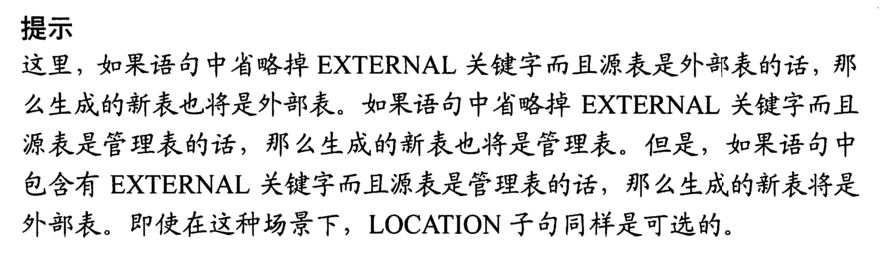

1. 管理表与外部表的相互转化。

~~~ java
//查看外部表信息
describe extended tableName
//查询表的类型
desc formatted test
//修改管理表为外部表
alter table test set tblproperties('external'='true');
//修改外部表为管理表
alter table student set tblproperties('external'='false')
//注意：('EXTERNAL'='TRUE')和('EXTERNAL'='FALSE')为固定写法，区分大小写！
~~~

### 4.7，分区表

1. 分区表实际上就是对应一个HDFS文件系统上的独立的文件夹，该文件夹下是该分区所有的数据文件。Hive中的分区就是分目录，把一个大的数据集根据业务需要分割成小的数据集。在查询时通过WHERE子句中的表达式选择查询所需要的指定的分区，这样的查询效率会提高很多。

note:分区表在表中体现的是多出一个字段，在hdfs文件系统上体现的是多出一个目录。分区表改变了hive对数据的存储组织方式。

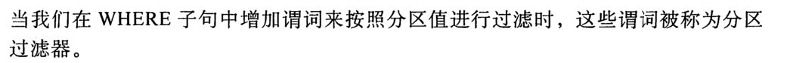

1. 分区表基本操作

~~~ java
//把一张表设置为严格模式是防止hive对每一个记录全面扫描
set.hive.mapred.mode=strict
1．引入分区表（需要根据日期对日志进行管理）
//创建分区表partitioned是关键字
create table dept_partition(deptno int,deptname string,deptloc string)partitioned by (month string) row format delimited fields terminated by '\t';
//注意：分区字段不能是表中已经存在的数据，可以将分区字段看作表的伪列。
//从本地加载文件到db_hive数据库，按照分区存放，partition是关键字
load data local inpath '/home/rui/data/dates.txt' into table db_hive.dept_partition partition(month='20200320');//从浏览器端查看dept_partition表里面有四个分区，每一个分区分别是一个文件夹，文件夹里面存放数据，注意：分区表加载数据时，必须指定分区partition(month="")就指明了按照什么分区
//查询分区表
//1 单分区查询，也就是按照month设置的值来查询，当我们在where子句中增加谓词来按照分区进行查询的时候，这些谓词称为分区过滤器。
select * from dept_partition where month='20200323';
//2 多分区联合查询，用union关键字并操作查询
select * from dept_partition where month='20200323' union select * from dept_partition where month='20200322';
//也可以增加分区
//1 增加单个分区
alter table dept_partition add partition (month='2020822');
//2 也可以同时增加多个分区
alter table dept_partition add partition(month='20209')partition(month='202011') partition(month='202012');//中间不需要逗号隔开
//删除分区
//1 删除单个分区
alter table dept_partition drop partition(month='20209');
//2 删除多个分区
alter table dept_partition drop partition  (month='202011'),  partition(month='20208');
//注意，删除多个分区，分区之间有逗号，而添加多个分区，中间可以没有逗号。
//查看分区表有多少个分区
show partitions dept_partition;
//查看分区表的结构
desc formatted dept_partition;
//如果表中存在很多分区，用户只想查看特定分区数据的话，用户可以在查询语句中增加一个或者多个分区号进行查询
show partitions dept_partition partition(month='20200320');
desc extended dept_partition;//命令会显示出分区键，也就是按照什么进行分区
//在管理表中我们可以通过加载数据的方式创建分区
load data local inpath '/home/rui/data' into table employee partition(country='chinese',city='beijing')//加载数据到表中的时候直接创建二级分区
~~~

2. 二级分区表的操作

~~~ java
//创建二级分区表
create table two_partition(sname string,sage int,sgrade int)partitioned by (month string,day string) row format delimited fields terminated by '\t';//按照month和day两级分区
//加载数据操作
load data local inpath '/home/rui/data/dates.txt' into table db_hive.two_partition partition(month='20203',day='2');//按照二级分区：一级分区是一个目录，二级分区还是一个目录，
//查询分区数据，这里需要按照两级分区来查询
select * from two_partition where month='20205'and day='6';
//把数据直接上传到分区目录上，让分区表和数据产生关联的三种方式
	//第一种上传数据后在修复：先在/user/hive/warehouse/db_hive.db/two_partition/month=20203/day=2目录下创建一个文件夹
 dfs -mkdir -p /user/hive/warehouse/db_hive.db/two_partition/month=20203/day=2
//上传本地文件到文件系统
     dfs -put /home/rui/data/files.txt /user/hive/warehouse/db_hive.db/two_partition/month=20203/day=2;
//执行查询功能，但是报错没有查询成功，
FAILED: SemanticException [Error 10001]: Line 1:14 Table not found 'teo_partition'
//接下来我们执行修复功能
     msck repair table two_partition;
//然后再次查询成功
//方式二：上传数据后添加分区
//创建分区文件夹，注意，此处创建的是多级文件夹
dfs -mkdir -p /user/hive/warehouse/db_hive.db/two_partition/month=20208/day=8;
//上传数据操作，把本地文件上传到刚刚创建的文件夹
dfs -put /home/rui/data/files.txt /user/hive/warehouse/db_hive.db/two_partition/month=20208/day=8;
//执行添加分区，把刚才创建的文件夹添加为分区
alter table two_partition add partition(month='20208',day='8');
//最后执行查询命令即可成功
select * from two_partition where month='20208'and day='8';
//方式三：创建文件夹后load数据到分区
//创建文件夹
 dfs -mkdir -p /user/hive/warehouse/db_hive.db/two_partition/month=202012/day=12;
//加载本地数据到hdfs的文件夹
 load data local inpath '/home/rui/data/files.txt' into table two_partition partition(month='12',day='12');
//最后执行查询操作即可
select * from two_partition where month='202012'and day='12';

~~~

3.外部分区表

外部分区表和分区表一样，当删除表的元数据时，hdfs上面实际存储的数据并不会删除，也可以查询外部分区表的详细信息，但是并不会显示外部分区表的实际数据存储路径，可以通过以下命令查看：

~~~ java
describe external dept_partition partition(month="2020-3-20")
//查询外部表的信息
show partitions log_messages
//查询详细信息,但是并不会输出分区数据的实际存储路径
describe extended log_messages
//显示分区实际的存储路径
describe extended log_messages partitions(year=2020,month=4,day=23);
~~~

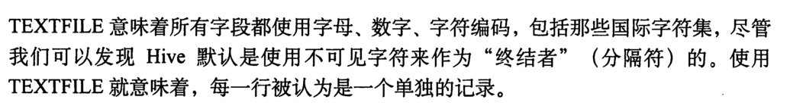

### 4.8，修改表

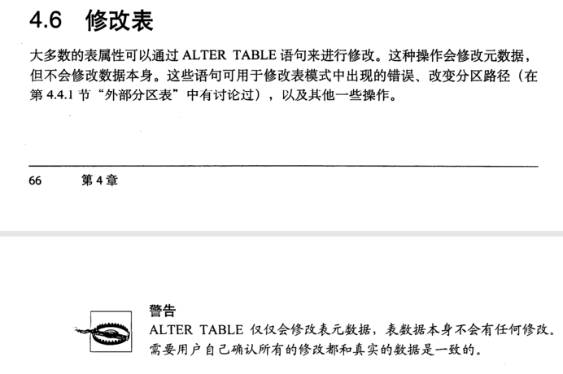

1. 给表重命名

~~~ java
//语法
ALTER TABLE table_name RENAME TO new_table_name
alter table test rename to stu;
~~~

2. 增加、修改、替换列信息

~~~ java
//更新列
ALTER TABLE table_name CHANGE [COLUMN] col_old_name col_new_name column_type [COMMENT col_comment] [FIRST|AFTER column_name]
//增加和替换列
ALTER TABLE table_name ADD|REPLACE COLUMNS (col_name data_type [COMMENT col_comment], ...) 
//ALTER TABLE table_name ADD|REPLACE COLUMNS (col_name data_type [COMMENT col_comment], ...) 
    //查询表结构
    desc stu;
    //给stu表增加一列
     alter table stu add columns(age int);
//更新列，修改age 列名为grade,类型为double
alter table stu change column age grade double;
//替换列
alter table dept_partition replace columns(deptno string, dname
 string, loc string);
//删除表,对于管理表，表和数据全部会被删除，对于外部表，表的元数据信息会被删除，但是表中的数据不会被删除
drop table stu;
~~~

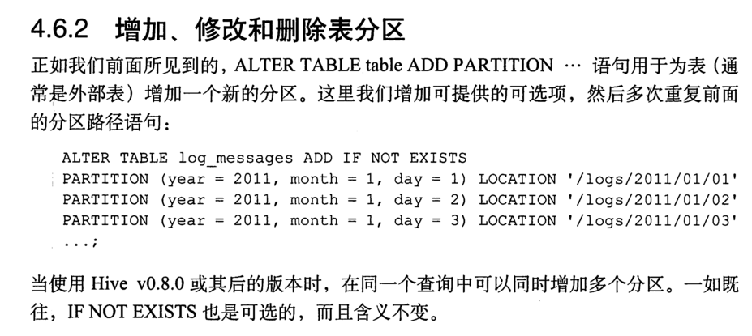

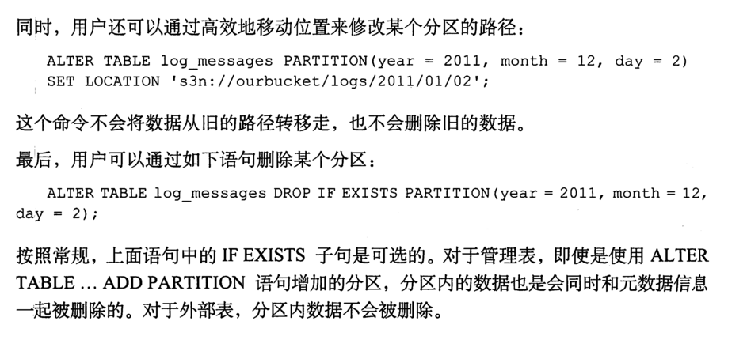

### 4.9，修改列

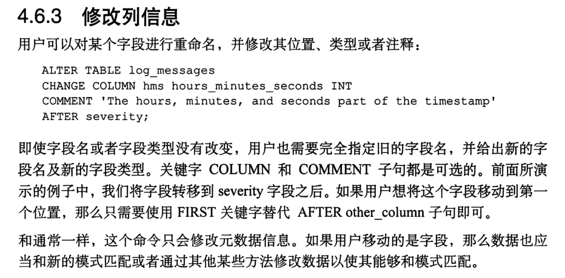

- 增加列

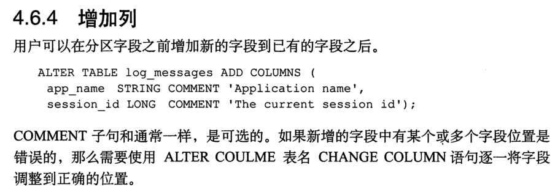

- 替换列

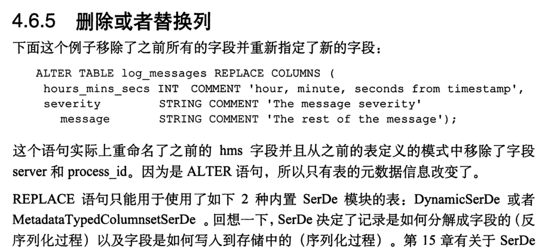

- 修改表属性

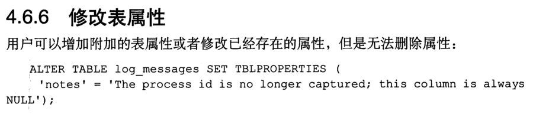

## 第五章，DML数据操作语言（**Data Manipulation Language**）

### 5.1，数据导入

1. 向表中装载数据：

   ~~~ java
   load data [local] inpath '/opt/module/datas/student.txt' [overwrite] into table student [partition (partcol1=val1,…)];
   ~~~

   （1）load data:表示加载数据

   （2）local:表示从本地加载数据到hive表；否则从HDFS加载数据到hive表（不添加local）

   （3）inpath:表示加载数据的路径

   （4）overwrite:表示覆盖表中已有数据，否则表示追加

   （5）into table:表示加载到哪张表

   （6）student:表示具体的表

   （7）partition:表示上传到指定分区

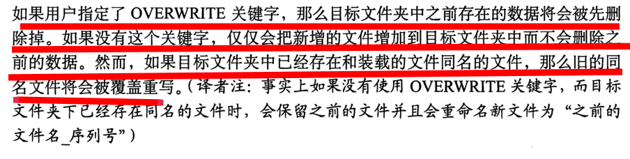

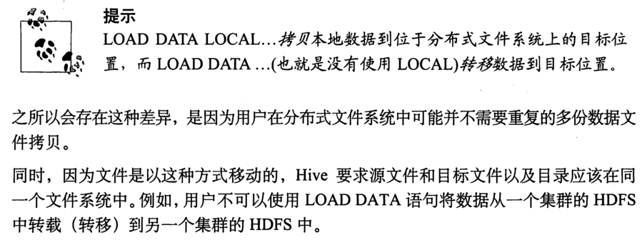

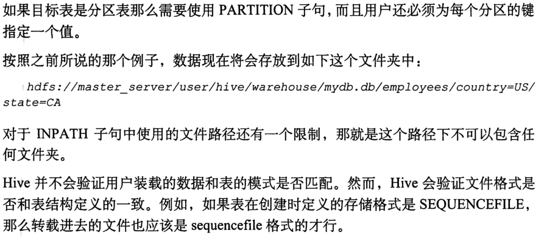

~~~ java
//实例
//1 创建一张表
create table student(name string,age int) row format delimited fields terminated by '\t';
//加载本地数据到数据库,加载本地文件的路径下面最好是一个文件夹，不要弄单个文件，hive会将路径下的全部文件全部拷贝到分区下，并且保持文件名字不改变
load data local inpath '/home/rui/data/stu.txt' into table student partition();
//加载HDFS文件到hive中上传文件到HDFS，这种方式是把数据从hdfs上的一个位置转移到另一个位置
	//1 上传本地文件到hdfs文件系统
	dfs -put /home/rui/data/stu.txt /rui/user
	//2 加载hdfs上的文件到数据库
	load data inpath '/rui/user/stu.txt' into table db_hive.student;
//加载数据覆盖表中已有的数据
	//1 先上传文件到hdfs系统
	dfs -put /home/rui/data/stuinfo.txt /rui/user;
	//2 加载数据覆盖表中已有的数据
	load data inpath '/rui/user/stuinfo.txt' overwrite into table db_hive.student;
	//notes:上面的做法会把数据库student中的表全部删除，用stuinfo.txt代替其他表
//加载数据时如果分区目录不存在的话，hive会自动创建分区目录，如果插入的表不是分区表，那么就不用添加partition关键字
~~~

2. 动态分区插入数据

   静态分区查询时我们都必须指定静态分区的字段值，但是如果使用动态分区，我们不必指出每一个分支的字段值，而是让hive基于查询推断出要创建分区的名称，

~~~ java
insert overwrite table employee
partition(country,ststu)
select .....se.city,se.st
from staged_empoyee se;
//hive会根据select语句最后选择的两列来分区country和statu的值，原表字段值和输出分区值之间的关系是根据位置而不是根据命名来匹配的。
~~~

3. 动态分区和静态分区混合使用

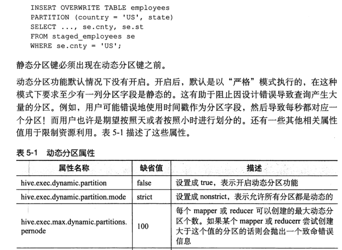

### 5.2，通过查询数据向表中插入数据

1. 创建一张分区表

~~~ java
create table employee(id int,name string)partitioned by(month string) row format delimited fields terminated by '\t';
~~~

2. 用插入语句向表中插入数据

~~~ java
insert into table employee partition (month='20203')values(1,'aa'),(2,'bb'),(3,'cc'),(4,'dd');
~~~

3. 基本插入模式（基本模式插入（根据单张表查询结果））

~~~ java
insert overwrite table employee partition(month='20208')select id,name from employee where month='20203';
/*insert into：以追加数据的方式插入到表或分区，原有数据不会删除
insert overwrite：会覆盖表或分区中已存在的数据
注意：insert不支持插入部分字段
*/
~~~

4. 多表（多分区）插入模式（根据多张表查询结果）

~~~ java
//不理解
from student
              insert overwrite table student partition(month='201707')
              select id, name where month='201709'
              insert overwrite table student partition(month='201706')
              select id, name where month='201709';
~~~

5. 仅仅扫描一次数据，以多种方式进行划分插入到不同的表中

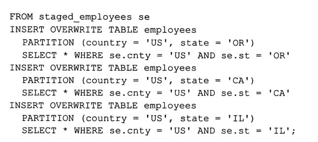

通过这种方式，源表中的数据可能被写入一个表中的多个分区，也可能一个分区都不写入


### 5.3，单个查询语句中创建表并且加载数据（as select）

1. 根据查询结果创建表（查询的结果会添加到新创建的表中）

~~~ java
 create table if not exists doctor as select id,name from db_hive.employee;
//这种用法通常是从一张宽表中选取一些数据集的情况，这个功能不能用于外部表，外部表是可以为外部表引用到一个分区，但是这里并没有进行数据的装载，而是将元数据中指定一个指向数据集的路径。
~~~

### 5.4，创建表时通过Location指定加载数据路径

1. 上传数据到hdfs上

~~~ java
dfs -put /home/rui/data/conf.txt /rui/user;
~~~

2. 创建表，并指定在hdfs上的位置

~~~ java
create table if not exists info(info string,num int) row format delimited fields terminated by '\t' location '/rui/user';
~~~

3. 查询数据

~~~ java
select * from info;
~~~

### 5.5，Import数据到指定Hive表中

~~~ java
//注意：先用export导出后，再将数据导入。
import table student2 partition(month='201709') from
 '/user/hive/warehouse/export/student';
~~~

### 5.6，数据导出

1. insert导出

   1. 将查询的结果导出到本地

   ~~~ java
    insert overwrite local directory '/home/rui/data/ select * from student;//会把data下的文件全部覆盖
   ~~~

2. 将查询结果格式化到本地

~~~ java
insert overwrite local directory '/home/rui/info'row format delimited fields terminated by '\t' select * from doctor;//可以在本地查看到原样格式输出
~~~

3. 将查询的结果导出到HDFS上(没有local)

~~~ java
insert overwrite directory '/rui/user'row format delimited fields terminated by '\t' select * from doctor;//注意会把原目录的文件全部替换掉
~~~

### 5.7，hadoop命令导出到本地

~~~ java
 dfs -get /user/hive/warehouse/db_hive.db/doctor/000000_0  /home/rui/info;//有错误
~~~

### 5.8，Export导出到HDFS上

~~~java
export table db_hive.employee to '/rui/user/tmp';
//export和import主要用于两个Hadoop平台集群之间Hive表迁移。
~~~

### 5.9，清除表中的数据

~~~ java
//注意：Truncate只能删除管理表，不能删除外部表中数据
truncate table student;
~~~

### 5.10，导出（导出到hdfs上面）

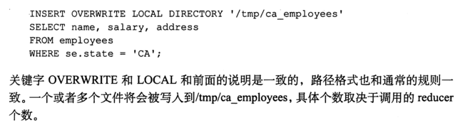

一次查询指定输出到多个文件中去,但是hive中没有临时表这一概念。

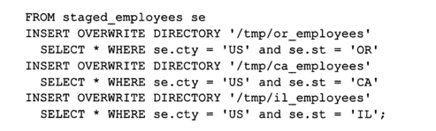

### 5.11，hive命令执行参数

~~~ java
-e 'quoted query string'： 运行引号内sql查询语句 Sql from command line

-f <filename>： 从文件中运行sql语句 Sql from file

linux环境下：

$hive -e "sql语句"  > 1.log 发现执行后会把结果写入1.log中，包括count(*)的结果

$hive -f  某个文件（里面是sql语句） > 2.log 发现执行后会把结果写入2.log中，包括count(*)的结果

$hive -f  某个文件（里面是sql语句）  执行文件里的sql，

hive -f 的某个文件的扩展名可以是.txt  .sql  .log .hql ，
~~~

## 第六章，查询语句

### 6.1，查询基本语法

~~~ java
[WITH CommonTableExpression (, CommonTableExpression)*]    (Note: Only available
 starting with Hive 0.13.0)
SELECT [ALL | DISTINCT] select_expr, select_expr, ...
  FROM table_reference
  [WHERE where_condition]
  [GROUP BY col_list]
  [ORDER BY col_list]
  [CLUSTER BY col_list
    | [DISTRIBUTE BY col_list] [SORT BY col_list]
  ]
 [LIMIT number]
~~~

### 6.2，基本查询select.....from.....

1. 全表和特定表查询

```java
//1 创建表employ
create table if not exists emplyoy(deptno int,dename string,loc int)row format delimited fields terminated by '\t';
//创建雇员表
create table if not exists emp(empo int,ename string,job string,mgr int,hiredate string,sal double,comm double,deptno int)row format delimited fields terminated by '\t';
//加载本地数据到数据库
load data local inpath '/home/rui/date/employ.txt' into table emplyoy;
d statement
hive (db_hive)> load data local inpath '/home/rui/date/emp.txt'into table emp;
load data local inpath '/home/rui/date/emp.txt'into table emp;
//1 全表查询
select * from emp;
// 2 特定字段查询
select deptno ,dename from emplyoy;
/*注意：
（1）SQL 语言大小写不敏感。 
（2）SQL 可以写在一行或者多行
（3）关键字不能被缩写也不能分行
（4）各子句一般要分行写。
（5）使用缩进提高语句的可读性。*/
```

2. 列别名

```java
/*1．重命名一个列
2．便于计算
3．紧跟列名，也可以在列名和别名之间加入关键字‘AS’ */
select ename AS name, deptno dn from emp;
```

3. 算术运算符（算数运算符接收任意的数据类型，如果数据类型不同，那么两个数据类型中数据范围小的将会转换为数据类型范围大的哪一个）

| 运算符 | 描述           |
| ------ | -------------- |
| A+B    | A和B 相加      |
| A-B    | A减去B         |
| A*B    | A和B 相乘      |
| A/B    | A除以B         |
| A%B    | A对B取余       |
| A&B    | A和B按位取与   |
| A\|B   | A和B按位取或   |
| A^B    | A和B按位取异或 |
| ~A     | A按位取反      |

```java
//所有员工薪水+1后输出
select sal +1 from emp;
```

3. 常用函数

   1. 求总行数

   ```java
   select count(*) cnt from emp;
   ```

   2. 求工资的最大值和最小值

   ```java
   select max(sal) max_sal from emp;
   select min(sal) max_sal from emp;
   ```

   3. 求工资的总和

   ```java
   select sum(sal) sum_sal from emp; //并且重命名
   ```

   4. 求工资的平均值

   ```java
   select avg(sal) avg_sal from emp;
   ```

   5. limit语句

   ```java
   //典型的查询会返回多行数据。LIMIT子句用于限制返回的行数。
    select * from emp limit 5;
   ```

   1. where语句

      1．使用WHERE子句，将不满足条件的行过滤掉

      2．WHERE子句紧随FROM子句，但是where字句中不支持列的别名。

      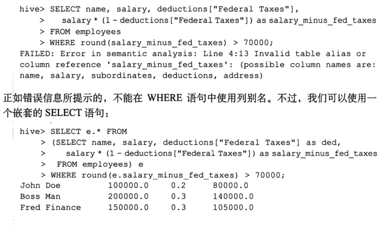

      3．案例实操

      查询出薪水大于1000的所有员工

      hive (default)> select * from emp where sal >1000;

      注意：where子句中不能使用字段别名。

      6. 比较运算符（between/in/is null)

      下面表中描述了谓词操作符，这些操作符同样可以用于JOIN…ON和HAVING语句中。

      | 操作符                  | 支持的数据类型 | 描述                                                         |
      | ----------------------- | -------------- | ------------------------------------------------------------ |
      | A=B                     | 基本数据类型   | 如果A等于B则返回TRUE，反之返回FALSE                          |
      | A<=>B                   | 基本数据类型   | 如果A和B都为NULL，则返回TRUE，其他的和等号（=）操作符的结果一致，如果任一为NULL则结果为NULL |
      | A<>B, A!=B              | 基本数据类型   | A或者B为NULL则返回NULL；如果A不等于B，则返回TRUE，反之返回FALSE |
      | A<B                     | 基本数据类型   | A或者B为NULL，则返回NULL；如果A小于B，则返回TRUE，反之返回FALSE |
      | A<=B                    | 基本数据类型   | A或者B为NULL，则返回NULL；如果A小于等于B，则返回TRUE，反之返回FALSE |
      | A>B                     | 基本数据类型   | A或者B为NULL，则返回NULL；如果A大于B，则返回TRUE，反之返回FALSE |
      | A>=B                    | 基本数据类型   | A或者B为NULL，则返回NULL；如果A大于等于B，则返回TRUE，反之返回FALSE |
      | A [NOT] BETWEEN B AND C | 基本数据类型   | 如果A，B或者C任一为NULL，则结果为NULL。如果A的值大于等于B而且小于或等于C，则结果为TRUE，反之为FALSE。如果使用NOT关键字则可达到相反的效果。 |
      | A IS NULL               | 所有数据类型   | 如果A等于NULL，则返回TRUE，反之返回FALSE                     |
      | A IS NOT NULL           | 所有数据类型   | 如果A不等于NULL，则返回TRUE，反之返回FALSE                   |
      | IN(数值1, 数值2)        | 所有数据类型   | 使用 IN运算显示列表中的值                                    |
      | A [NOT] LIKE B          | STRING 类型    | B是一个SQL下的简单正则表达式，也叫通配符模式，如果A与其匹配的话，则返回TRUE；反之返回FALSE。B的表达式说明如下：‘x%’表示A必须以字母‘x’开头，‘%x’表示A必须以字母’x’结尾，而‘%x%’表示A包含有字母’x’,可以位于开头，结尾或者字符串中间。如果使用NOT关键字则可达到相反的效果。 |
      | A RLIKE B, A REGEXP B   | STRING 类型    | B是基于java的正则表达式，如果A与其匹配，则返回TRUE；反之返回FALSE。匹配使用的是JDK中的正则表达式接口实现的，因为正则也依据其中的规则。例如，正则表达式必须和整个字符串A相匹配，而不是只需与其字符串匹配。 |

      ```java
      //查询出薪水等于5000的所有员工
      select * from emp where sal =5000;
      //查询工资在500到1000的员工信息
      select * from emp where sal between 500 and 1000;
      //查询工资是1500或5000的员工信息
      select * from emp where sal IN (1500, 5000);
      ```

      7. like和Rlike语句

         1）使用LIKE运算选择类似的值

         2）选择条件可以包含字符或数字:

         % 代表零个或多个字符(任意个字符)。

         _ 代表一个字符。

         3）RLIKE子句是Hive中这个功能的一个扩展，其可以通过Java的正则表达式这个更强大的语言来指定匹配条件。(参考正则表达式)

         4 ) *也可以匹配任意字符串。

      ```java
      //查找以2开头薪水的员工信息
      select * from emp where sal LIKE '2%';
      //查找第二个数值为2的薪水的员工信息
      select * from emp where sal LIKE '_2%';
      //查找薪水中含有2的员工信息
      select * from emp where sal RLIKE '[2]';
      
      ```

      8. 逻辑运算符（And/Or/Not）

      | 操作符 | 含义   |
      | ------ | ------ |
      | AND    | 逻辑并 |
      | OR     | 逻辑或 |
      | NOT    | 逻辑否 |

      ```java
      //查询薪水大于1000，部门是30
      select * from emp where sal>1000 and deptno=30;
      //查询薪水大于1000，或者部门是30
      select * from emp where sal>1000 or deptno=30;
      //查询除了20部门和30部门以外的员工信息
      select * from emp where deptno not IN(30, 20);
      6.3，group by 语句
      ```

### 6.3，group by语句

- GROUP BY语句通常会和聚合函数一起使用，按照一个或者多个字段结果进行分组，然后对每个

  组执行聚合操作。

~~~ java
//计算emp表每个部门的平均工资
select t.deptno, avg(t.sal) avg_sal from emp t group by t.deptno;
//计算emp每个部门中每个岗位的最高薪水
select t.deptno, t.job, max(t.sal) max_sal from emp group by
 t.deptno, t.job;
~~~

2. Having 语句

- hiving 语法允许通过一个简单的语法完成原本需要通过子查询才可以对group by语句产生的分组进行条件过滤的任务，

1．having与where不同点

（1）where后面不能写分组函数，而having后面可以使用分组函数。

（2）having只用于group by分组统计语句。

~~~ java
//（1）求每个部门的平均薪水大于2000的部门
	//1 求每个部门的平均工资
select deptno, avg(sal) from emp group by deptno;
	//2 求每个部门的平均薪水大于2000的部门
select deptno, avg(sal) avg_sal from emp group by deptno having
 avg_sal > 2000;

~~~

### 6.4，join查询（仅仅支持等值连接，也不支持在on字句中使用or）

- where语句是在连接条件执行后才执行的，因此where只用于过滤哪些非null值的列值，

1. 等值join

Hive支持通常的SQL JOIN语句，但是只支持等值连接，不支持非等值连接。Hive支持通常的SQL JOIN语句，但是只支持等值连接，不支持非等值连接。

~~~ java
//根据员工表和部门表中的部门编号相等，查询员工编号、员工名称和部门名称；
select e.empno, e.ename, d.deptno, d.dname from emp e join dept d on e.deptno = d.deptno;

~~~

2. 表的别名

1．好处

（1）使用别名可以简化查询。

（2）使用表名前缀可以提高执行效率。

~~~ java
//合并员工表和部门表
select e.empno, e.ename, d.deptno from emp e join dept d on e.deptno
 = d.deptno;
~~~

3. 左外连接

- 左外连接：JOIN操作符左边表中符合WHERE子句的所有记录将会被返回。

~~~ java
select e.empno, e.ename, d.deptno from emp e left join dept d on e.deptno = d.deptno;
~~~

4. 右外连接

- 右外连接：JOIN操作符右边表中符合WHERE子句的所有记录将会被返回。

~~~ java
select e.empno, e.ename, d.deptno from emp e right join dept d on e.deptno = d.deptno;
~~~

5. 满外连接

- 满外连接：将会返回所有表中符合WHERE语句条件的所有记录。如果任一表的指定字段没有符合条件的值的话，那么就使用NULL值替代。

~~~ java
select e.empno, e.ename, d.deptno from emp e full join dept d on e.deptno
 = d.deptno;
~~~

6. 多表连接

- 注意：连接 n个表，至少需要n-1个连接条件。例如：连接三个表，至少需要两个连接条件。

~~~ java
//创建数据表
create table if not exists location(
loc int,
loc_name string
)
row format delimited fields terminated by '\t';
//导入数据
load data local inpath '/opt/module/datas/location.txt' into table location;
//多表连接查询
SELECT e.ename, d.dname, l.loc_name
FROM   emp e 
JOIN   dept d
ON     d.deptno = e.deptno 
JOIN   location l
ON     d.loc = l.loc;
~~~

大多数情况下，Hive会对每对JOIN连接对象启动一个MapReduce任务。本例中会首先启动一个MapReduce job对表e和表d进行连接操作，然后会再启动一个MapReduce job将第一个MapReduce job的输出和表l;进行连接操作。

注意：为什么不是表d和表l先进行连接操作呢？这是因为Hive总是按照从左到右的顺序执行的。

优化：当对3个或者更多表进行join连接时，如果每个on子句都使用相同的连接键的话，那么只会产生一个MapReduce job。

7. 内连接：只有进行连接的两个表中都存在与连接条件相匹配的数据才会被保存下来，也就是两个表中必须有相同的字段。但是等值连接中两个表不一定有相同的字段。内连接也就是取公共部分。
8. 连接优化策略：
   1. 通常都是对连接的表有小到大取排列连接，应为hive会嘉定认为最大的表在最后面，在对每一行连接操作时，会尝试将其他表进行缓存起来，然后扫描最后哪一个表进行计算，因此，在做连接查询的时候，我们尽量保证被连接的表从左向有递增。

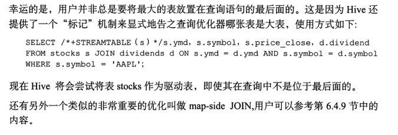

 2. map-side Join优化

    如果所有连接表中有一张是小表，那么可以在最大表进行map的时候将小表放到内存中，hive可以在map端执行连接过程（即map-side Join),这是应为hive可以和内存中的小表进行逐一匹配，从而省略掉常规连接操作需要的reducer过程，

~~~ java
//用法:用户可以设置属性set hive.auto.convert.join=true,这样hive在进行计算时候必要时会启动优化，
//用户也可以配置优化小表时小表的大小：hive.mapjoin.smalltable.filesize=2500000
//但是hive对于右外连接和全外连接不支持这个优化

~~~


	2. 笛卡尔积连接

~~~ java
select * from stocks join dividends;//一般不用，没有实际意义
~~~


### 6.5，排序

1. Order By：==全局排序==，只有一个Reducer，想要对数据进行全局排序，那么数据就不能进行分区，如果分区的话只是局部有序，全局仍然没有序。

   1．使用 ORDER BY 子句排序

   ASC（ascend）: 升序（默认）

   DESC（descend）: 降序

   2．ORDER BY 子句在SELECT语句的结尾

~~~ java
deptno dename form emplyoy order by deptno DESC;
~~~

2. 按照别名排序

~~~ java
//按照员工薪水的2倍排序
select ename, sal*2 twosal from emp order by twosal;
~~~

3. 多个列进行排序

~~~ java
//按照部门和工资升序排序
select ename, deptno, sal from emp order by deptno, sal ;
~~~

4. 每个MapReduce内部排序（Sort By）==局部排序==，对每一个reducer的输出结果进行局部排序

Sort By：对于大规模的数据集order by的效率非常低。在很多情况下，并不需要全局排序，此时可以使用**sort by**。Sort by为每个reducer产生一个排序文件。每个==Reducer==内部进行排序，对全局结果集来说不是排序。这两种排序可以对任意字段进行排序，换可以指定升序或者降序。

~~~ java
//使用sort by 排序的时候，先要设置分区的个数，应为分区的个数会影响reducer的个数
set mapreduce.job.reduces=3;
//查看reducer的个数
set mapreduce.job.reduces;
//根据部门编号降序查看员工信息，注意，这是局部排序
select * from emp sort by deptno desc;
//将查询结果导入到文件中（按照部门编号降序排序）
insert overwrite local directory '/opt/module/datas/sortby-result'
 select * from emp sort by deptno desc;
~~~

5. 分区排序（Distribute By）

Distribute By： 在有些情况下，我们需要控制某个特定行应该到哪个reducer，通常是为了进行后续的聚集操作。**distribute by** 子句可以做这件事。**distribute by**类似MR中partition（自定义分区），进行分区，结合sort by使用。，也就是控制map端的输出到哪一个reducer之中。但是默认情况是根据map端输入的key值计算hash值，然后按照hash值把数据平均分发到各个reducer之中。

对于distribute by进行测试，一定要分配多reduce进行处理，否则无法看到distribute by的效果。

distribute by 和group by在其控制着reducer是如何接收一行行的数据进行处理这方面类似，而sort by控制着reducer内部是如何进行排序的。主要注意：distribute by要写在sort by语句前面。

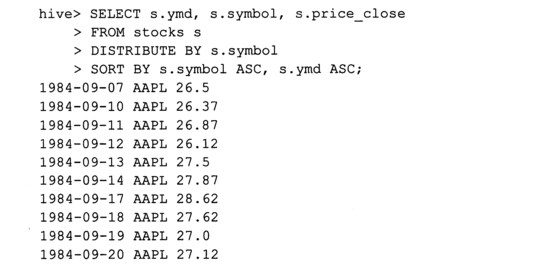

~~~ java
//先按照部门编号分区，再按照员工编号降序排序。
set mapreduce.job.reduces=3;
insert overwrite local directory '/opt/module/datas/distribute-result' select * from emp distribute by deptno sort by empno desc;
/*注意：
1．distribute by的分区规则是根据分区字段的hash码与reduce的个数进行模除后，余数相同的分到一个区。
Hive要求DISTRIBUTE BY语句要写在SORT BY语句之前。*/
~~~

6. cluster by 排序

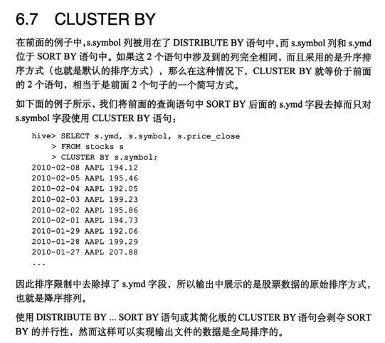

当distribute by和sorts by字段相同时，可以使用cluster by方式。

cluster by除了具有distribute by的功能外还兼具sort by的功能。但是排序只能是升序排序，不能指定排序规则为ASC或者DESC。

~~~ java
//1）以下两种写法等价
select * from emp cluster by deptno;
select * from emp distribute by deptno sort by deptno;
//注意：按照部门编号分区，不一定就是固定死的数值，可以是20号和30号部门分到一个分区里面去。
~~~


### 6.6，常用函数

1. 空字段赋值

说明：NVL：给值为NULL的数据赋值，它的格式是NVL( value，default_value)。它的功能是如果value为NULL，则NVL函数返回default_value的值，否则返回value的值，如果两个参数都为NULL ，则返回NULL。

~~~ java
//如果员工的comm为NULL，则用-1代替
//先建表
create table salary(name string,sal int)row format delimited fields terminated by '\t';
//加载数据
load data local inpath '/home/rui/date/salary.txt'into table salary;
Loading data to table db_hive.salary
//使用NVL( value，default_value)函数，如果员工的salary值为null。就返回-1
select name,NVL(sal,-1) from salary;//如果工资值为空，就返回-1，否则返回正常值

~~~

2. case when then函数

- 此函数和if条件语句类似，用于处理单个列的查询结果。

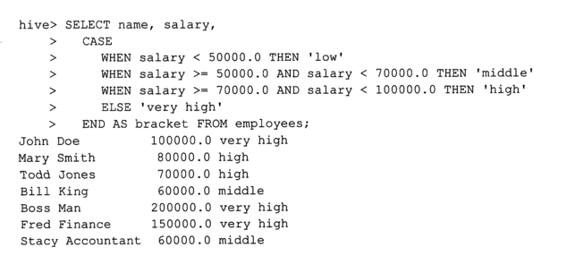

数据：

| name | dept_id | sex  |
| ---- | ------- | ---- |
| 悟空 | A       | 男   |
| 大海 | A       | 男   |
| 宋宋 | B       | 男   |
| 凤姐 | A       | 女   |
| 婷姐 | B       | 女   |
| 婷婷 | B       | 女   |

~~~ java
//创建一张表
create table first(name string,information string,sex string)row format delimited fields terminated by '\t';
//导入信息
load data local inpath '/home/rui/date/info.txt' into table first;
Loading data to table db_hive.first
//转换
select * ,case sex when '男'' then 1 else 0 end from first;//男性用1代替，女性用0代替
//统计不同部门男女各有多少人
  select 
  dept_id,
  sum(case sex when '男' then 1 else 0 end) male_count,
  sum(case sex when '女' then 1 else 0 end) female_count
from 
  emp_sex
group by
  dept_id;
~~~

3. 行转列函数（所谓行转列就是把多行转换成一个集合）

   1．相关函数说明

   CONCAT(string A/col, string B/col…)：返回输入字符串连接后的结果，支持任意个输入字符串;

   CONCAT_WS(separator, str1, str2,...)：它是一个特殊形式的 CONCAT()。第一个参数是剩余参数间的分隔符。分隔符可以是与剩余参数一样的字符串。如果分隔符是 NULL，返回值也将为 NULL。这个函数会跳过分隔符参数后的任何 NULL 和空字符串。分隔符将被加到被连接的字符串之间;

   COLLECT_SET(col)：函数只接受基本数据类型，它的主要作用是将某字段的值进行去重汇总，产生array类型字段。

数据：

| name   | constellation | blood_type |
| ------ | ------------- | ---------- |
| 孙悟空 | 白羊座        | A          |
| 大海   | 射手座        | A          |
| 宋宋   | 白羊座        | B          |
| 猪八戒 | 白羊座        | A          |
| 凤姐   | 射手座        | A          |

~~~ java
//创建一个数据库
create table consetllation(name string,consetll string,num string) row format delimited fields terminated by '\t';
//加载数据
load data local inpath '/home/rui/date/constellation.txt' into table consetllation;
//按照需求查询：把星座和血型一样的人归类到一起
select t1.base,concat_ws('|',collect_set(t1.name))as name1 
from (select name concat(constell,",",num) as base
from constellation) as t1
group by t1.base;
~~~

4. 列转行，把一个集合转成多行

1．函数说明

EXPLODE(col)：将hive一列中复杂的array或者map结构拆分成多行。

LATERAL VIEW

用法：LATERAL VIEW udtf(expression) tableAlias AS columnAlias

其中：tablealias和columnalias是别名

解释：用于和split, explode等UDTF一起使用，它能够将一列数据拆成多行数据，在此基础上可以对拆分后的数据进行聚合。

~~~ java
//创建表
 create table mv(name string,category array<string>)row format delimited fields terminated by '\t'collection items terminated by ',‘；
//导入数据
load data local inpath '/home/rui/date/move.txt' into table mv;
//查询数据
疑犯追踪》    ["悬疑","动作","科幻","剧情"]
《Lie to me》   ["悬疑","警匪","动作","心理","剧情"]
《战狼2》       ["战争","动作","灾难"]
//需求：将电影分类中的数组数据展开
select name,category_name from mv lateral view explode(category) table_tmp as category_name;//对数组的内容展开，
name    category_name
《疑犯追踪》    悬疑
《疑犯追踪》    动作
《疑犯追踪》    科幻
《疑犯追踪》    剧情
《Lie to me》   悬疑
《Lie to me》   警匪
《Lie to me》   动作
《Lie to me》   心理
《Lie to me》   剧情
《战狼2》       战争
《战狼2》       动作
《战狼2》       灾难
//然后在对上面的输出表按照类型输出
select category_name,concat_ws(",",collect_set(name))as movies from(select name,category_name from mv lateral view explode(category) table_tmp as category_name) group by category_name;

~~~

5. 窗口函数（开窗函数）over()实际上就是为了描述窗口的范围，窗口函数在最后执行，如果有order by全局排序，那么窗口函数在全局排序之前执行

1．相关函数说明

OVER()：指定分析函数工作的数据窗口大小，这个数据窗口大小可能会随着行的变而变化。

CURRENT ROW：当前行

n PRECEDING：往前n行数据，向前拖n行数据

n FOLLOWING：往后n行数据，向后拖n行数据

UNBOUNDED：起点，UNBOUNDED PRECEDING 表示从前面的起点， UNBOUNDED FOLLOWING表示到后面的终点

LAG(col,n,default_val)：往前第n行数据

LEAD(col,n, default_val)：往后第n行数据

NTILE(n)：把有序分区中的行分发到指定数据的组中，各个组有编号，编号从1开始，对于每一行，NTILE返回此行所属的组的编号。注意：n必须为int类型。

数据：

jack,2017-01-01,10

tony,2017-01-02,15

jack,2017-02-03,23

tony,2017-01-04,29

jack,2017-01-05,46

jack,2017-04-06,42

tony,2017-01-07,50

jack,2017-01-08,55

mart,2017-04-08,62

mart,2017-04-09,68

neil,2017-05-10,12

mart,2017-04-11,75

neil,2017-06-12,80

mart,2017-04-13,94

~~~ java
//创建数据表
create table business(
              > name string, 
              > orderdate string,
              > cost int
              > ) ROW FORMAT DELIMITED FIELDS TERMINATED BY ',';
//加载数据
load data local inpath '/home/rui/date/order.txt' into table busiinto table business;     
//需求1：（1）查询在2017年4月份购买过的顾客及总人数
select name,count(*) over () 
from business 
where substring(orderdate,1,7) = '2017-04' 
group by name;
//（2）查询顾客的购买明细及月购买总额
select name,orderdate,cost,sum(cost) over(partition by month(orderdate)) from
 business;//此题是按照月份来划分区
~~~

### 6.7，基于集合类型的查询和引用

集合分为三类：array数组，map集合，struct集合。

1. 对于array数组里面数据的引用：

~~~ java
select name ,sunordinates[0]from employee;
//用下表的方式进行引用,对于不存在的值将返回null
~~~

2. 对map集合的查询

~~~ java
//可以使用键值来查询其值，语法是array[键值]
select name,deductions["states Taxes"] from employees;
~~~

3. 对于struct里面的每一个元素，可以使用~表的别名.列名语法引用

~~~ java
select name,address.city from employees;
~~~

### 6.8，常用函数

1. 数学函数

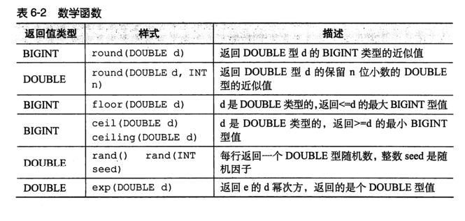

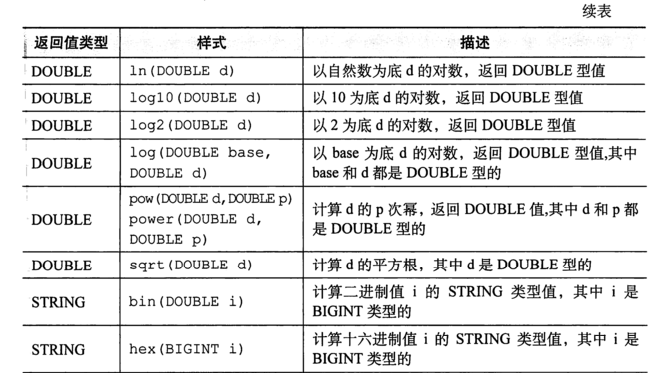

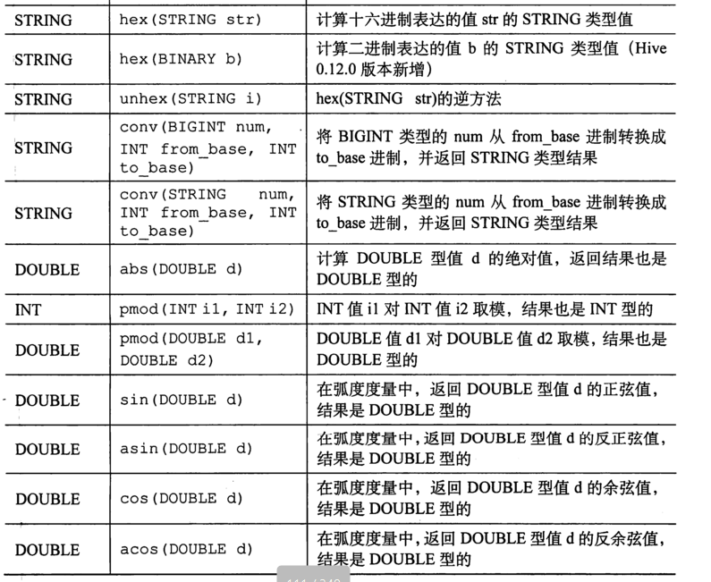

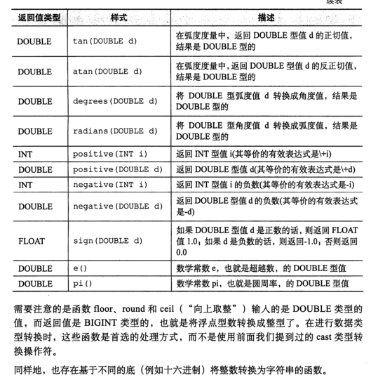

2. 聚合函数

- 简单来说聚合函数是一种一对多的函数，也就是多个输入值，一个输出值。

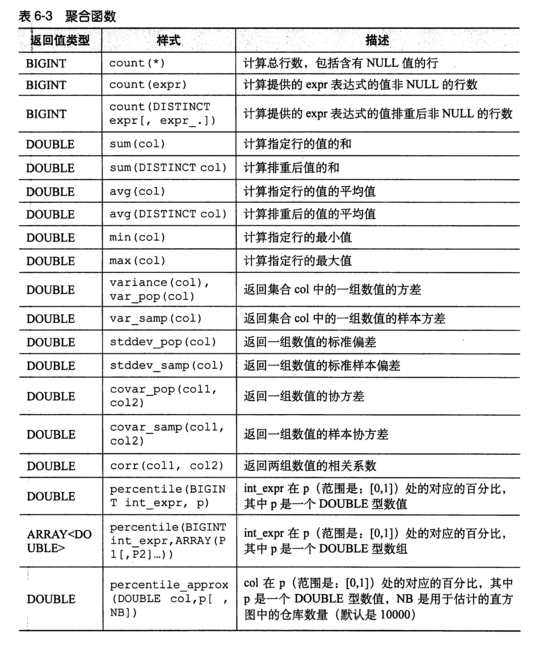

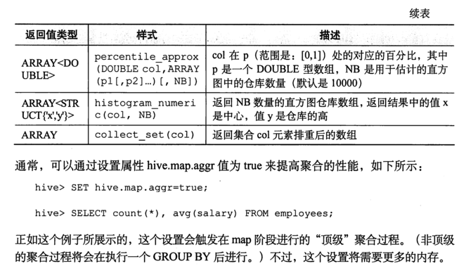

3. 表生成函数

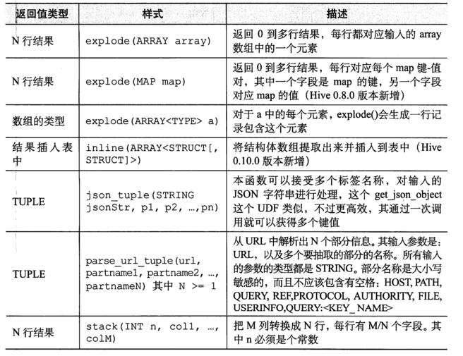

4. 其他内置函数

~~~ java
type cast(<expr> as <type>)//将expr表达式转换成type类型
~~~

### 6.9，limit字句和as

- 简单的limit字句会限制返回的行数。
- as类新的或者旧的字段起别名

### 6.10，避免MapReducer任务

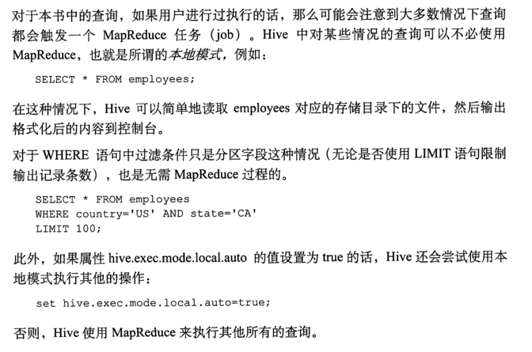

### 6.11，浮点数问题

- 参考hive编程指南p98

### 6.12，类型转换

- cast()函数可以将一种数据类型显示的转换成另一种数据类型，但是一般不推荐使用cast()函数进行转换，而是使用round()和floor()函数进行转换。

### 6.13，抽样查询

- 对于很大的数据集，有时用户需要的是一个具有代表性的数据集而不是全部的数据集，hive中分桶查询可以满足这种情况。

~~~ java
select * from numbers tablesample(bucket 3 out of 10 on read())s;
2
4
//如果我们按照指定的列分桶，而不是按照rand()函数进行分桶，那么同一语句执行多次返回结果相同。其中分子标示桶的个数。
~~~

### 6.14，分桶表输入数据的剪裁

- 简单来说就是对没有分桶的表在随机抽样的时候，hive会扫描整个数据表，但是如果在创建表时候对表进行分桶操作后，然后在导入数据后数据会随机的平均的分配到每一个桶中，然后对数据进行随机抽样的时候hive只会对一个桶进行抽样。

参考《hive编程指南》p115

## 第七章，函数

## 7.1，函数

1.  显示系统函数

~~~ java
show functions;
//显示系统函数的用法
desc function upper;
//详细显示自带函数的用法
desc function extended upper;//upper是函数名
~~~

2. 自定义函数

1）Hive 自带了一些函数，比如：max/min等，但是数量有限，自己可以通过自定义UDF来方便的扩展。

2）当Hive提供的内置函数无法满足你的业务处理需要时，此时就可以考虑使用用户自定义函数（UDF：user-defined function）。

3）根据用户自定义函数类别分为以下三种：

​	（1）UDF（User-Defined-Function）

​		一进一出

​	（2）UDAF（User-Defined Aggregation Function）

​		聚集函数，多进一出

​		类似于：count/max/min

​	（3）UDTF（User-Defined Table-Generating Functions）

​		一进多出

​		如lateral view explore()

4）官方文档地址

https://cwiki.apache.org/confluence/display/Hive/HivePlugins

步骤：

（1）继承org.apache.hadoop.hive.ql.exec.UDF

​	（2）需要实现evaluate函数；evaluate函数支持重载；

​	（3）在hive的命令行窗口创建函数

​		a）添加jar

add jar linux_jar_path

​		b）创建function

create [temporary] function [dbname.]function_name AS class_name;

​	（4）在hive的命令行窗口删除函数

Drop [temporary] function [if exists] [dbname.]function_name;

6）注意事项

​	（1）UDF必须要有返回类型，可以返回null，但是返回类型不能为void；

~~~ java
//创建一个Maven工程Hive
//导入依赖
<dependencies>
		<!-- https://mvnrepository.com/artifact/org.apache.hive/hive-exec -->
		<dependency>
			<groupId>org.apache.hive</groupId>
			<artifactId>hive-exec</artifactId>
			<version>1.2.1</version>
		</dependency>
</dependencies>
//创建一个类
package com.atguigu.hive;
import org.apache.hadoop.hive.ql.exec.UDF;

public class Lower extends UDF {

	public String evaluate (final String s) {
		
		if (s == null) {
			return null;
		}
		
		return s.toLowerCase();
	}
}
//打成jar包上传到服务器/opt/module/jars/udf.jar,也就是放到hive安装目录的lib文件夹内
//将jar包添加到hive的classpath
add jar /opt/module/datas/udf.jar;//此处的地址是jar包存放的地址
//创建临时函数与开发好的java class关联
 create temporary function mylower as "com.atguigu.hive.Lower";//关联class全类名
//即可在hql中使用自定义的函数strip
 select ename, mylower(ename) lowername from emp;
~~~

## 第八章，存储和压缩

### 8.1，**Hadoop源码编译支持Snappy压缩**


**DCL**（**Data Control Language**）**数据库控制语言**  授权，角色控制等

**TCL**（**Transaction Control Language**）**事务控制语言**