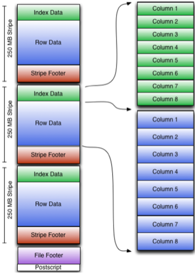
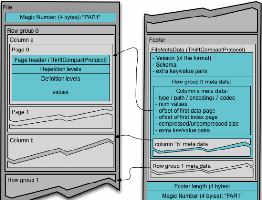
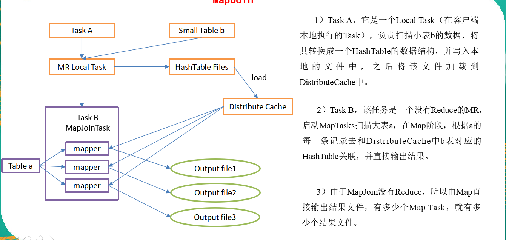

# Hive

## 第八章，压缩和存储

### 8.1，**`Hadoop`源码编译支持`Snappy`压缩**

- 待完善

### 8.2，**`Hadoop`压缩配置**

#### 8.2.1，**`MR`支持的压缩编码**

| 压缩格式 | 工具  | 算法    | 文件扩展名 | 是否可切分 |
| -------- | ----- | ------- | ---------- | ---------- |
| DEFAULT  | 无    | DEFAULT | .deflate   | 否         |
| Gzip     | gzip  | DEFAULT | .gz        | 否         |
| bzip2    | bzip2 | bzip2   | .bz2       | 是         |
| LZO      | lzop  | LZO     | .lzo       | 是         |
| Snappy   | 无    | Snappy  | .snappy    | 否         |

- 为了支持多种压缩/解压缩算法，`Hadoop`引入了编码/解码器，如下表所示：

| 压缩格式 | 对应的编码/解码器                          |
| -------- | ------------------------------------------ |
| DEFLATE  | org.apache.hadoop.io.compress.DefaultCodec |
| gzip     | org.apache.hadoop.io.compress.GzipCodec    |
| bzip2    | org.apache.hadoop.io.compress.BZip2Codec   |
| LZO      | com.hadoop.compression.lzo.LzopCodec       |
| Snappy   | org.apache.hadoop.io.compress.SnappyCodec  |

- 压缩性能的比较：

| 压缩算法 | 原始文件大小 | 压缩文件大小 | 压缩速度 | 解压速度 |
| -------- | ------------ | ------------ | -------- | -------- |
| gzip     | 8.3GB        | 1.8GB        | 17.5MB/s | 58MB/s   |
| bzip2    | 8.3GB        | 1.1GB        | 2.4MB/s  | 9.5MB/s  |
| LZO      | 8.3GB        | 2.9GB        | 49.3MB/s | 74.6MB/s |

#### 8.2.2，压缩参数配置

- 要在`Hadoop`中启用压缩，可以配置如下参数（`mapred-site.xml`文件中）：

| 参数                                              | 默认值                                                       | 阶段        | 建议                                         |
| ------------------------------------------------- | ------------------------------------------------------------ | ----------- | -------------------------------------------- |
| io.compression.codecs   （在core-site.xml中配置） | org.apache.hadoop.io.compress.DefaultCodec, org.apache.hadoop.io.compress.GzipCodec, org.apache.hadoop.io.compress.BZip2Codec,org.apache.hadoop.io.compress.Lz4Codec | 输入压缩    | Hadoop使用文件扩展名判断是否支持某种编解码器 |
| mapreduce.map.output.compress                     | false                                                        | mapper输出  | 这个参数设为true启用压缩                     |
| mapreduce.map.output.compress.codec               | org.apache.hadoop.io.compress.DefaultCodec                   | mapper输出  | 使用LZO、LZ4或snappy编解码器在此阶段压缩数据 |
| mapreduce.output.fileoutputformat.compress        | false                                                        | reducer输出 | 这个参数设为true启用压缩                     |
| mapreduce.output.fileoutputformat.compress.codec  | org.apache.hadoop.io.compress. DefaultCodec                  | reducer输出 | 使用标准工具或者编解码器，如gzip和bzip2      |
| mapreduce.output.fileoutputformat.compress.type   | RECORD                                                       | reducer输出 | SequenceFile输出使用的压缩类型：NONE和BLOCK  |

### 8.3，开启`MAP`输出阶段压缩

- 开启map输出阶段压缩可以减少job中map和Reduce task间数据传输量。具体配置如下
- 配置：
  - 如果集群已经搭建起来，配置支持snappy压缩方法如下：
  - 解压支持`snappy`压缩的`hadoop`安装包，在里面找到`native`文件夹，用此文件夹替换已安装集群上面`hadoop`下面的`native`文件夹即可，`native`安装包在`lib`文件夹下面。

1. 开启`hive`中间传输数据压缩功能(注意：如果不在配置文件中修改，那么仅仅是在这次操作中启动压缩，下次不会启动压缩，在配置文件中修改是全局的)

~~~java
//查看属性设置
set hive.exec.compress.output
set hive.exec.compress.intermediate=true;
~~~

2. 开启mapreduce中map输出压缩功能

~~~java
set mapreduce.map.output.compress=true;
~~~

3. 设置mapreduce中map输出数据的压缩方式

~~~ java
set mapreduce.map.output.compress.codec=
 org.apache.hadoop.io.compress.SnappyCodec;
~~~

4. 设置`mapreducer`最终输出为块压缩，默认方式是行压缩，修改为块压缩效率比较高。

    ~~~ java
   set mapreducer.output.fileoutputformat.compress.type=BLOCK
   ~~~

### 8.4，开启`Reducer`输出阶段的压缩

​	当`Hive`将输出写入到表中时，输出内容同样可以进行压缩。属性`hive.exec.compress.output`控制着这个功能。用户可能需要保持默认设置文件中的默认值`false`，这样默认的输出就是非压缩的纯文本文件了。用户可以通过在查询语句或执行脚本中设置这个值为`true`，来开启输出结果压缩功能。

1. 开启hive最终输出数据压缩功能

~~~ java
set hive.exec.compress.output=true;
~~~

2. 开启mapreduce最终输出数据压缩

~~~ java
set mapreduce.output.fileoutputformat.compress=true;
~~~

3. 设置mapreduce最终数据输出压缩方式

~~~ java
set mapreduce.output.fileoutputformat.compress.codec =
 org.apache.hadoop.io.compress.SnappyCodec;
~~~

4. 设置mapreduce最终数据输出压缩为块压缩

~~~java
set mapreduce.output.fileoutputformat.compress.type=BLOCK;
~~~

5. 测试一下输出结果是否是压缩文件

~~~java
insert overwrite local directory
 '/opt/module/datas/distribute-result' select * from emp distribute by deptno sort by empno desc;
~~~

### 8.5，文件存储格式

`Hive`支持的存储数的格式主要有：`TEXTFILE `(行式存储)、`SEQUENCEFILE`、`ORC`、`PARQUET`。

1. 行式存储和列式存储

   1. 行式存储：

      查询满足条件的一整行数据的时候，列存储则需要去每个聚集的字段找到对应的每个列的值，行存储只需要找到其中一个值，其余的值都在相邻地方，所以此时行存储查询的速度更快。

   2. 列式存储：

      因为每个字段的数据聚集存储，在查询只需要少数几个字段的时候，能大大减少读取的数据量；每个字段的数据类型一定是相同的，列式存储可以针对性的设计更好的设计压缩算法。

- `TEXTFILE`和`SEQUENCEFILE`的存储格式都是基于行存储的；
- `ORC`和`PARQUET`是基于列式存储的。

2. `TextFile`存储格式

   默认格式，数据不做压缩，磁盘开销大，数据解析开销大。可结合`Gzip`、`Bzip2`使用，但使用`Gzip`这种方式，`hive`不会对数据进行切分，从而无法对数据进行并行操作。

3. `Orc`格式

   `Orc (Optimized Row Columnar)`是`Hive 0.11`版里引入的新的存储格式。

   如图6-11所示可以看到每个`Orc`文件由1个或多个`stripe`组成，每个`stripe250MB`大小，这个`Stripe`实际相当于`RowGroup`概念，不过大小由4MB->250MB，这样应该能提升顺序读的吞吐率。每个`Stripe`里有三部分组成，分别是`Index Data`，`Row Data`，`Stripe Footer`：



​	1）`Index Data`：一个轻量级的`index`，默认是每隔`1W行`做一个索引。这里做的索引应该只是记录某行的各字段在Row Data中的offset。

​	 2）`Row Data`：存的是具体的数据，先取部分行，然后对这些行按列进行存储。对每个列进行了编码，分成多个`Stream`来存储。

​	3）`Stripe Footer`：存的是各个`Stream`的类型，长度等信息。

​	每个文件有一个`File Footer`，这里面存的是每个`Stripe`的行数，每个`Column`的数据类型信息等；每个文件的尾部是一个`PostScript`，这里面记录了整个文件的压缩类型以及`FileFooter`的长度信息等。在读取文件时，会`seek`到文件尾部读`PostScript`，从里面解析到`File Footer`长度，再读`FileFooter`，从里面解析到各个`Stripe`信息，再读各个`Stripe`，即从后往前读。

4. `Parquet`格式

   ​	`Parquet`是面向分析型业务的列式存储格式，由`Twitter`和`Cloudera`合作开发，2015年5月从`Apache`的孵化器里毕业成为`Apache`顶级项目。

   ​	`Parquet`文件是以二进制方式存储的，所以是不可以直接读取的，文件中包括该文件的数据和元数据，因此`Parquet`格式文件是自解析的。

   ​	通常情况下，在存储`Parquet`数据的时候会按照`Block`大小设置行组的大小，由于一般情况下每一个`Mapper`任务处理数据的最小单位是一个`Block`，这样可以把每一个行组由一个`Mapper`任务处理，增大任务执行并行度。`Parquet`文件的格式如图6-12所示。



​	上图展示了一个`Parquet`文件的内容，一个文件中可以存储多个行组，文件的首位都是该文件的`Magic Code`，用于校验它是否是一个`Parquet`文件，`Footer length`记录了文件元数据的大小，通过该值和文件长度可以计算出元数据的偏移量，文件的元数据中包括每一个行组的元数据信息和该文件存储数据的`Schema`信息。除了文件中每一个行组的元数据，每一页的开始都会存储该页的元数据，在`Parquet`中，有三种类型的页：数据页、字典页和索引页。数据页用于存储当前行组中该列的值，字典页存储该列值的编码字典，每一个列块中最多包含一个字典页，索引页用来存储当前行组下该列的索引，目前`Parquet`中还不支持索引页。

### 8.6，存储文件格式对比

- 从存储文件的压缩比和查询速度两个角度对比。

1. 创建表

~~~ java
create table log_text (
track_time string,
url string,
session_id string,
referer string,
ip string,
end_user_id string,
city_id string
)
row format delimited fields terminated by '\t'
stored as textfile ;
~~~

2. 向表中加载数据

~~~ java
load data local inpath '/opt/module/myfile/log.txt' into table log_text;
~~~

3. 查看表中数据大小

~~~ java
 dfs -du -h /user/hive/warehouse/mydb.db;
18.1 M  /user/hive/warehouse/mydb.db/log_text
~~~

4. 创建表，存储数据格式为ORC

~~~java
create table log_orc(
track_time string,
url string,
session_id string,
referer string,
ip string,
end_user_id string,
city_id string
)
row format delimited fields terminated by '\t'
stored as orc ;
//加载数据，注意，这里用插入数据方式存储数据，不要用load方式，load方式加载还是textFILE格式，文件大小不变
insert into table log_orc select * from log_text;
hive (mydb)> dfs -du -h /user/hive/warehouse/mydb.db/log_orc;
2.8 M  /user/hive/warehouse/mydb.db/log_orc/000000_0
~~~

5. `parqute`创建表

~~~ java
create table log_parquet(
track_time string,
url string,
session_id string,
referer string,
ip string,
end_user_id string,
city_id string
)
row format delimited fields terminated by '\t'
stored as parquet ;	
//同样插入数据
insert into table log_parquet select * from log_text ;
//查看大小
13.1 M  /user/hive/warehouse/log_parquet/000000_0
~~~

存储文件的压缩比总结：

`ORC `> ` Parquet` > ` textFile`

6. 查询效率比较
   - 存储文件的查询速度总结：查询速度相近。

### 8.7，存储和压缩结合

1. 查看`hadoop`支持的压缩格式

~~~ java
hadoop checknative
~~~

2. 拷贝支持`snappy`压缩的`native`里面的所有内容到开发集群的`/opt/module/hadoop-2.7.2/lib/native`路径上

3. 分发集群。
4. 再次查看hadoop支持的压缩类型，发现现在已经支持`snappy`压缩。
5. 重新启动hadoop集群和hive

6. 在上一节中我们存储的日志文件以`orc`格式存储大小为2.8m,其实`orc`存储中是自带压缩的，现在创建一个`snappy`压缩的`orc`存储

~~~ java
//创建表
create table log_orc_snappy(
track_time string,
url string,
session_id string,
referer string,
ip string,
end_user_id string,
city_id string
)
row format delimited fields terminated by '\t'
stored as orc tblproperties ("orc.compress"="SNAPPY");//按照orc存储，但是压缩按照snappy
//插入数据
insert into table log_orc_snappy select * from log_text;
//查询大小
hive (mydb)> dfs -du -h /user/hive/warehouse/mydb.db/log_orc_snappy;
3.8 M  /user/hive/warehouse/mydb.db/log_orc_snappy/000000_0
2.8 M  /user/hive/warehouse/log_orc/000000_0//orc自带压缩
~~~

比`Snappy`压缩的还小。原因是`orc`存储文件默认采用`ZLIB`压缩。比`snappy`压缩的小。

总结：在实际的项目开发当中，`hive`表的数据存储格式一般选择：`orc`或`parquet`。压缩方式一般选择`snappy，lzo`。

## 第九章，**企业级调优（重点）**

### 9.1，Fetch抓取

​	`Fetch`抓取是指，`Hive`中对某些情况的查询可以不必使用`MapReduce计`算。例如：`SELECT * FROM employees;`在这种情况下，`Hive`可以简单地读取`employee`对应的存储目录下的文件，然后输出查询结果到控制台。

​	在`hive-default.xml.template`文件中`hive.fetch.task.conversion`默认是`more`，老版本`hive`默认是`minimal`，该属性修改为`more`以后，在全局查找、字段查找、`limit`查找等都不走`mapreduce`。

~~~ java
//默认是more
hive (mydb)> set hive.fetch.task.conversion;
hive.fetch.task.conversion=more
~~~

~~~ java
<property>
    <name>hive.fetch.task.conversion</name>
    <value>more</value>
    <description>
      Expects one of [none, minimal, more].
      Some select queries can be converted to single FETCH task minimizing latency.
      Currently the query should be single sourced not having any subquery and should not have
      any aggregations or distincts (which incurs RS), lateral views and joins.
      0. none : disable hive.fetch.task.conversion
      1. minimal : SELECT STAR, FILTER on partition columns, LIMIT only
      2. more  : SELECT, FILTER, LIMIT only (support TABLESAMPLE and virtual columns)
    </description>
  </property>
~~~

1. 把`hive.fetch.task.conversion`设置成`none`，然后执行查询语句，都会执行`mapreduce`程序。

~~~java
hive (default)> set hive.fetch.task.conversion=none;
hive (default)> select * from emp;
hive (default)> select ename from emp;
hive (default)> select ename from emp limit 3;
~~~

2. 把hive.fetch.task.conversion设置成more，然后执行查询语句，不会执行mapreduce程序。

### 9.2，本地模式

​	大多数的Hadoop Job是需要Hadoop提供的完整的可扩展性来处理大数据集的。不过，有时Hive的输入数据量是非常小的。在这种情况下，为查询触发执行任务消耗的时间可能会比实际job的执行时间要多的多。对于大多数这种情况，Hive可以通过本地模式在单台机器上处理所有的任务。对于小数据集，执行时间可以明显被缩短。

​	用户可以通过设置hive.exec.mode.local.auto的值为true，来让Hive在适当的时候自动启动这个优化。

~~~ java
set hive.exec.mode.local.auto=true;  //开启本地mr
//设置local mr的最大输入数据量，当输入数据量小于这个值时采用local  mr的方式，默认为134217728，即128M
set hive.exec.mode.local.auto.inputbytes.max=50000000;
//设置local mr的最大输入文件个数，当输入文件个数小于这个值时采用local mr的方式，默认为4
set hive.exec.mode.local.auto.input.files.max=10;
~~~

~~~ java
//开启本地模式，并执行查询语句
set hive.exec.mode.local.auto=true; 
 select count(*) from log_text;
_c0
100000
Time taken: 15.668 seconds, Fetched: 1 row(s)
//关闭本地模式，并执行查询语句
set hive.exec.mode.local.auto=false; //默认是关闭的
_c0
100000
Time taken: 14.661 seconds, Fetched: 1 row(s)
 //好像花费时间差不多
~~~

### 9.3，表的优化

#### 9.3.1，小表，大表，join

​	将key相对分散，并且数据量小的表放在`join`的左边，这样可以有效减少内存溢出错误发生的几率；再进一步，可以使用`map join`让小的维度表（1000条以下的记录条数）先进内存。在`map`端完成`reduce`。

​	实际测试发现：新版的`hive`已经对小表`JOIN`大表和大表`JOIN`小表进行了优化。小表放在左边和右边已经没有明显区别。我们在写`join`操作时，尽量让小表驱动大表，小表`join`大表。

1. **关闭mapjoin功能（默认是打开的）**

~~~ java
set hive.auto.convert.join = false;//此功能会让小表在map端就直接关闭，所以先暂时改变
~~~

#### 9.3.2，大表`join`大表

1. 空`KEY`过滤

   有时join超时是因为某些key对应的数据太多，而相同key对应的数据都会发送到相同的reducer上，从而导致内存不够。此时我们应该仔细分析这些异常的key，很多情况下，这些key对应的数据是异常数据，我们需要在SQL语句中进行过滤。例如key对应的字段为空，操作如下：

2. 案例：

   （1）配置历史服务器

~~~ java
//配置mapred-site.xml
<property>
<name>mapreduce.jobhistory.address</name>
<value>hadoop101:10020</value>
</property>
<property>
    <name>mapreduce.jobhistory.webapp.address</name>
    <value>hadoop102:19888</value>
</property>
~~~

​	(2)启动历史服务器

~~~ java
sbin/mr-jobhistory-daemon.sh start historyserver
//查看历史服务器
http://hadoop101:19888/jobhistory
~~~

~~~ java
//创建原始表，空的id表，join后的表
// 创建原始表
create table ori(id bigint, time bigint, uid string, keyword string, url_rank int, click_num int, click_url string) row format delimited fields terminated by '\t';
// 创建空id表
create table nullidtable(id bigint, time bigint, uid string, keyword string, url_rank int, click_num int, click_url string) row format delimited fields terminated by '\t';
// 创建join后表的语句
create table jointable(id bigint, time bigint, uid string, keyword string, url_rank int, click_num int, click_url string) row format delimited fields terminated by '\t';
//分别加载原始数据和空id数据到对应表中
hive (default)> load data local inpath '/opt/module/datas/ori' into table ori;
hive (default)> load data local inpath '/opt/module/datas/nullid' into table nullidtable;
//测试不过滤空id
hive (default)> insert overwrite table jointable 
select n.* from nullidtable n left join ori o on n.id = o.id;
Time taken: 42.038 seconds
Time taken: 37.284 seconds
//测试过滤空id
hive (default)> insert overwrite table jointable 
select n.* from (select * from nullidtable where id is not null ) n  left join ori o on n.id = o.id;
Time taken: 31.725 seconds
Time taken: 28.876 seconds
~~~

小结：大表`join`大表，我们先对空的`key`进行一次过滤。

3. 空`key`转换

   有时虽然某个key为空对应的数据很多，但是相应的数据不是异常数据，必须要包含在join的结果中，此时我们可以表a中key为空的字段赋一个随机的值，使得数据随机均匀地分不到不同的reducer上。

#### 9.3.3，MapJoin

​	如果不指定MapJoin或者不符合MapJoin的条件，那么Hive解析器会将Join操作转换成Common Join，即：在Reduce阶段完成join。容易发生数据倾斜。可以用MapJoin把小表全部加载到内存在map端进行join，避免reducer处理。

1．开启MapJoin参数设置

（1）设置自动选择Mapjoin

~~~ java
set hive.auto.convert.join = true; 默认为true
~~~

（2）大表小表的阈值设置（默认25M一下认为是小表）：

~~~ java
set hive.mapjoin.smalltable.filesize=25000000;
//优化：当我们的内存够大的时候，我们可以把这个值调大一点
~~~



#### 9.3.4，Group by

​	默认情况下，`Map`阶段同一`Key`数据分发给一个`reduce`，当一个`key`数据过大时就倾斜了。

​	并不是所有的聚合操作都需要在`Reduce`端完成，很多聚合操作都可以先在`Map`端进行部分聚合，最后在`Reduce`端得出最终结果,就如同`map`端的`combiner`函数功能。

1. 开启`Map`端聚合参数设置

~~~ java
//是否在Map端进行聚合，默认为True
hive.map.aggr = true
//在Map端进行聚合操作的条目数目
hive.groupby.mapaggr.checkinterval = 100000
//有数据倾斜的时候进行负载均衡（默认是false）
hive.groupby.skewindata = true
~~~

​	当选项设定为` true`，生成的查询计划会有两个`MR Job`。第一个`MR Job`中，`Map`的输出结果会随机分布到`Reduce`中，每个`Reduce`做部分聚合操作，并输出结果，这样处理的结果是相同的`Group By Key`有可能被分发到不同的`Reduce`中，从而达到负载均衡的目的；第二个`MR Job`再根据预处理的数据结果按照`Group By Key`分布到`Reduce`中（这个过程可以保证相同的`Group By Key`被分布到同一个`Reduce`中），最后完成最终的聚合操作。

#### 9.3.5，**Count(Distinct) 去重统计**

​	数据量小的时候无所谓，数据量大的情况下，由于`COUNT DISTINCT`操作需要用一个`Reduce Task`来完成，这一个`Reduce`需要处理的数据量太大，就会导致整个`Job`很难完成，一般`COUNT DISTINC`使用先`GROUP BY`再`COUNT`的方式替换：

~~~ java
//一般我们可以自己设定reducer的个数
set mapreduce.job.reduces = 5;
//直接去重，发现这个过程只有一个reducer
select count(distinct id) from bigtable;
Stage-Stage-1: Map: 1  Reduce: 1   Cumulative CPU: 7.12 sec   HDFS Read: 120741990 HDFS Write: 7 SUCCESS
Total MapReduce CPU Time Spent: 7 seconds 120 msec
OK
c0
100001
//用分组函数去重,6个reducer全部用到,用到了两个阶段
select count(id) from (select id from bigtable group by id) a;
Stage-Stage-1: Map: 1  Reduce: 5   Cumulative CPU: 17.53 sec   HDFS Read: 120752703 HDFS Write: 580 SUCCESS
Stage-Stage-2: Map: 1  Reduce: 1   Cumulative CPU: 4.29 sec   HDFS Read: 9409 HDFS Write: 7 SUCCESS
Total MapReduce CPU Time Spent: 21 seconds 820 msec
OK
_c0
100001
Time taken: 50.795 seconds, Fetched: 1 row(s)
//虽然会多用一个Job来完成，但在数据量大的情况下，这个绝对是值得的。
~~~

#### 9.3.6，笛卡尔积

​	尽量避免笛卡尔积，`join`的时候不加`on`条件，或者无效的`on`条件，`Hive`只能使用1个`reducer`来完成笛卡尔积。

#### 9.3.7，**行列过滤**

​	列处理：在`SELECT`中，只拿需要的列，如果有，尽量使用分区过滤，少用`SELECT *`。

​	行处理：在分区剪裁中，当使用外关联时，如果将副表的过滤条件写在`Where`后面，那么就会先全表关联，之后再过滤，所以要先用子查询赛选，在关联两张表，比如：

~~~ java
//测试先关联两张表，再用where条件过滤
select o.id from bigtable b
join ori o on o.id = b.id
where o.id <= 10;
//通过子查询后，再关联表
select b.id from bigtable b
join (select id from ori where id <= 10 ) o on b.id = o.id;
~~~

#### 9.3.8，**动态分区调整**

​	严格模式：在插入数据的时候必须指定一个分区。

​	关系型数据库中，对分区表`Insert`数据时候，数据库自动会根据分区字段的值，将数据插入到相应的分区中，`Hive`中也提供了类似的机制，即动态分区`(Dynamic Partition)`，只不过，使用`Hive`的动态分区，需要进行相应的配置。

1. 开启动态分区参数设置

   1. 开启动态分区功能（默认true，开启）

   ~~~ java
   hive.exec.dynamic.partition=true
   ~~~

   2. 设置为非严格模式（动态分区的模式，默认`strict`，表示必须指定至少一个分区为静态分区，`nonstrict`模式表示允许所有的分区字段都可以使用动态分区。）

   ~~~ java
   hive.exec.dynamic.partition.mode=nonstrict
   ~~~

   3. 在所有执行MR的节点上，最大一共可以创建多少个动态分区。

   ~~~ java
   set hive.exec.max.dynamic.partitions=1000//所有节点最多可以创建1000个动态分区
   ~~~

   4. 在每个执行`MR`的节点上，最大可以创建多少个动态分区。该参数需要根据实际的数据来设定。比如：源数据中包含了一年的数据，即`day`字段有365个值，那么该参数就需要设置成大于365，如果使用默认值100，则会报错。

   ~~~ java
   set hive.exec.max.dynamic.partitions.pernode=100//一般设置和所有节点创建分区个数一样大，但必须大于本节点上实际动态分区的个数
   ~~~

   5. 整个MR Job中，最大可以创建多少个HDFS文件。

   ~~~ java
   set hive.exec.max.created.files=100000
   ~~~

   6. 当有空分区生成时，是否抛出异常。一般不需要设置。

   ~~~ java
   set hive.error.on.empty.partition=false
   ~~~

   7. 动态分区不用重新设置分区的字段，而是根据表中已经有的字段进行建立分区，具体的数据存储到哪一个分区在插入表数据的时候是不知道的。

   ~~~ java
   //数据
   10	小花	100
   20	小明	200
   30	小白	300
   40	小红	400
   50	小蕊	500
   //先创建一张普通表把本地数据导入
   create table info_o(id int,name string,salary int)
   row format delimited fields terminated by '\t';
   //加载数据到普通表
   load data local inpath '/opt/module/myfile/info.txt'into table info_o;
   //创建动态分区表，应为分区字段本身就属于表的一个字段，所以可以把分区字段直接定义在分区中
   create table info(name string,salary int)
   partitioned by(id int)
   row format delimited fields terminated by '\t';
   //从普通表中导入数据，应为是动态分区，创建表的时候我们指定是按照id划分分区，所以现在导入数据时候我们把id作为分区的字段传入
   insert into table info
   partition(id)
   select name,salary,id from info_o;
   //加载完成，可以发现是按照id进行分区，此时查看hdfs上面的info表下面有5个分区，分区名字刚好按照id划分
   Loading data to table mydb.info partition (id=null)
            Time taken for load dynamic partitions : 1659
           Loading partition {id=10}
           Loading partition {id=20}
           Loading partition {id=50}
           Loading partition {id=30}
           Loading partition {id=40}
            Time taken for adding to write entity : 1
   //现在我们清空info表中的数据
   truncate table info;
   //然后删除分区
   alter table info drop partition(id=10), partition(id=20), partition(id=30), partition(id=40), partition(id=50);
   //现在我们再次插入数据,注意和上面的插入语句对比，插入时字段的位置打乱了
   insert into table info
   partition (id)
   select id,name,salary from info_o;
   //结果
   Loading data to table mydb.info partition (id=null)
            Time taken for load dynamic partitions : 501
           Loading partition {id=100}
           Loading partition {id=400}
           Loading partition {id=300}
           Loading partition {id=500}
           Loading partition {id=200}
            Time taken for adding to write entity : 0
   //发现是按照salary的值来进行分区的，上面是按照id的值进行分区的，这说明了分区是按照字段的位置进行的，也就是要根据哪一个字段进行分区，那么哪一个字段就要写在选择语句中选择的全部字段的最后哪一个位置。
   ~~~

   

#### 9.3.9，分桶和分区

参考前面的笔记。

### 9.4，数据倾斜

#### 9.4.1，合理设置`Map`数

**1）通常情况下，作业会通过`input`的目录产生一个或者多个map任务。**

​	主要的决定因素有：`input`的文件总个数，`input`的文件大小，集群设置的文件块大小。

**2）是不是`map`数越多越好？**

​	答案是否定的。如果一个任务有很多小文件（远远小于块大小128m），则每个小文件也会被当做一个块，用一个`map`任务来完成，而一个`map`任务启动和初始化的时间远远大于逻辑处理的时间，就会造成很大的资源浪费。而且，同时可执行的`map`数是受限的。

**3）是不是保证每个`map`处理接近128m的文件块，就高枕无忧了？**

​	答案也是不一定。比如有一个127m的文件，正常会用一个`map`去完成，但这个文件只有一个或者两个小字段，却有几千万的记录，如果`map`处理的逻辑比较复杂，用一个map任务去做，肯定也比较耗时。

​	针对上面的问题2和3，我们需要采取两种方式来解决：即减少`map`数和增加`map`数；

#### 9.4.2，对小文件进行合并

​	在`map`执行前合并小文件，减少`map`数：`CombineHiveInputFormat`具有对小文件进行合并的功能（系统默认的格式）。`HiveInputFormat`没有对小文件合并功能。

~~~ java
set hive.input.format= org.apache.hadoop.hive.ql.io.CombineHiveInputFormat;
~~~

#### 9.4.3，**复杂文件增加Map数**

​	当`input`的文件都很大，任务逻辑复杂，`map`执行非常慢的时候，可以考虑增加`Map`数，来使得每个`map`处理的数据量减少，从而提高任务的执行效率。

增加`map`的方法为：根据

`computeSliteSize(Math.max(minSize,Math.min(maxSize,blocksize)))=blocksize=128M`公式，调整`maxSize`最大值。让`maxSize`最大值低于`blocksize`就可以增加`map`的个数。

- 案例

  1．执行查询

~~~ java
hive (default)> select count(*) from emp;

Hadoop job information for Stage-1: number of mappers: 1; number of reducers: 1
~~~

​	2．设置最大切片值为100个字节

~~~java
hive (default)> set mapreduce.input.fileinputformat.split.maxsize=100;

hive (default)> select count(*) from emp;

Hadoop job information for Stage-1: number of mappers: 6; number of reducers: 1
~~~

#### 9.4.4，**合理设置Reduce数**

1. 调整reduce个数方法一

   1. 每个Reduce处理的数据量默认是256MB

   ```java
   hive.exec.reducers.bytes.per.reducer=256000000
   ```

   2. 每个任务最大的reduce数，默认为1009

   ```java
   hive.exec.reducers.max=1009
   ```

   3. 计算reducer数的公式

   ```java
   N=min(参数2，总输入数据量/参数1)//输入数据的总量是map端输入原始数据的总量，参数一代表每个reducer处理的数据量256m，参数二代表每个任务最大reducer的个数
   ```

2. 调整`reduce`个数方法二

   在`hadoop`的`mapred-default.xml`文件中修改

   设置每个`job`的`Reduce`个数

   ~~~ java
   set mapreduce.job.reduces = 15;
   ~~~

3. `reduce`个数并不是越多越好

   1）过多的启动和初始化`reduce`也会消耗时间和资源；

   2）另外，有多少个`reduce`，就会有多少个输出文件，如果生成了很多个小文件，那么如果这些小文件作为下一个任务的输入，则也会出现小文件过多的问题；

   在设置`reduce`个数的时候也需要考虑这两个原则：处理大数据量利用合适的`reduce`数；使单个`reduce`任务处理数据量大小要合适；

### 9.5，**并行执行**

​	`Hive`会将一个查询转化成一个或者多个阶段。这样的阶段可以是`MapReduce`阶段、抽样阶段、合并阶段、`limit`阶段。或者`Hive`执行过程中可能需要的其他阶段。默认情况下，`Hive`一次只会执行一个阶段。不过，某个特定的`job`可能包含众多的阶段，而这些阶段可能并非完全互相依赖的，也就是说有些阶段是可以并行执行的，这样可能使得整个`job`的执行时间缩短。不过，如果有更多的阶段可以并行执行，那么`job`可能就越快完成。

​	通过设置参数`hive.exec.parallel`值为`true`，就可以开启并发执行。不过，在共享集群中，需要注意下，如果`job`中并行阶段增多，那么集群利用率就会增加。

~~~ java
set hive.exec.parallel=true;              //打开任务并行执行
set hive.exec.parallel.thread.number=16;  //同一个sql允许最大并行度，默认为8。
~~~

当然，得是在系统资源比较空闲的时候才有优势，否则，没资源，并行也起不来。

### 9.6，严格模式

​	`Hive`提供了一个全局严格模式，可以防止用户执行那些可能意想不到的不好的影响的查询。

​	通过设置属性`hive.mapred.mod`值为默认是非严格模式`nonstrict `。开启严格模式需要修改`hive.mapred.mode`值为`strict`，开启严格模式可以禁止3种类型的查询。

~~~ java
<property>
    <name>hive.mapred.mode</name>
    <value>strict</value>
    <description>
      The mode in which the Hive operations are being performed. 
      In strict mode, some risky queries are not allowed to run. They include:
        Cartesian Product.//笛卡尔积
        No partition being picked up for a query.//分区表没有指定分区
        Comparing bigints and strings.//比较bigint和string
        Comparing bigints and doubles.
        Orderby without limit.//写了order by 但是没有写limit语句
</description>
</property>
~~~

​	1) 对于分区表，除非`where`语句中含有分区字段过滤条件来限制范围，否则不允许执行。换句话说，就是用户不允许扫描所有分区。进行这个限制的原因是，通常分区表都拥有非常大的数据集，而且数据增加迅速。没有进行分区限制的查询可能会消耗令人不可接受的巨大资源来处理这个表。

​	2) 对于使用了`order by`语句的查询，要求必须使用`limit`语句。因为`order by`为了执行排序过程会将所有的结果数据分发到同一个`Reducer`中进行处理，强制要求用户增加这个`LIMIT`语句可以防止`Reducer`额外执行很长一段时间。

​	3) 限制笛卡尔积的查询。对关系型数据库非常了解的用户可能期望在执行`JOIN`查询的时候不使用`ON`语句而是使用`where`语句，这样关系数据库的执行优化器就可以高效地将`WHERE`语句转化成那个`ON`语句。不幸的是，`Hive`并不会执行这种优化，因此，如果表足够大，那么这个查询就会出现不可控的情况。

### 9.7，JVM重用

​	`JVM`重用是`Hadoop`调优参数的内容，其对`Hive`的性能具有非常大的影响，特别是对于很难避免小文件的场景或`task`特别多的场景，这类场景大多数执行时间都很短。

​	`Hadoop`的默认配置通常是使用派生`JVM`来执行`map`和`Reduce`任务的。这时`JVM`的启动过程可能会造成相当大的开销，尤其是执行的`job`包含有成百上千`task`任务的情况。`JVM`重用可以使得`JVM`实例在同一个`job`中重新使用`N`次。`N`的值可以在`Hadoop`的`mapred-site.xml`文件中进行配置。通常在10-20之间，具体多少需要根据具体业务场景测试得出。

~~~ java
<property>
  <name>mapreduce.job.jvm.numtasks</name>
  <value>10</value>
  <description>How many tasks to run per jvm. If set to -1, there is
  no limit. 
  </description>
</property>
~~~

​	这个功能的缺点是，开启`JVM`重用将一直占用使用到的`task`插槽，以便进行重用，直到任务完成后才能释放。如果某个“不平衡的”`job`中有某几个`reduce task`执行的时间要比其他`Reduce task`消耗的时间多的多的话，那么保留的插槽就会一直空闲着却无法被其他的`job`使用，直到所有的`task`都结束了才会释放。

### 9.8，推测执行

​	在分布式集群环境下，因为程序`Bug`（包括`Hadoop`本身的`bug`），负载不均衡或者资源分布不均等原因，会造成同一个作业的多个任务之间运行速度不一致，有些任务的运行速度可能明显慢于其他任务（比如一个作业的某个任务进度只有50%，而其他所有任务已经运行完毕），则这些任务会拖慢作业的整体执行进度。为了避免这种情况发生，`Hadoop`采用了推测执行（`Speculative Execution`）机制，它根据一定的法则推测出“拖后腿”的任务，并为这样的任务启动一个备份任务，让该任务与原始任务同时处理同一份数据，并最终选用最先成功运行完成任务的计算结果作为最终结果。

​	设置开启推测执行参数：`Hadoop`的`mapred-site.xml`文件中进行配置

~~~ java
<property>
  <name>mapreduce.map.speculative</name>
  <value>true</value>
  <description>If true, then multiple instances of some map tasks 
               may be executed in parallel.</description>
</property>

<property>
  <name>mapreduce.reduce.speculative</name>
  <value>true</value>
  <description>If true, then multiple instances of some reduce tasks 
               may be executed in parallel.</description>
</property>
//不过hive本身也提供了配置项来控制reduce-side的推测执行：
<property>
    <name>hive.mapred.reduce.tasks.speculative.execution</name>
    <value>true</value>
    <description>Whether speculative execution for reducers should be turned on. </description>
  </property>
~~~

​	关于调优这些推测执行变量，还很难给一个具体的建议。如果用户对于运行时的偏差非常敏感的话，那么可以将这些功能关闭掉。如果用户因为输入数据量很大而需要执行长时间的`map`或者`Reduce task`的话，那么启动推测执行造成的浪费是非常巨大大。

### 9.9，**压缩**

- 参考前面笔记。

### 9.10，执行计划（Explain）

1. 基本语法

   `EXPLAIN [EXTENDED | DEPENDENCY | AUTHORIZATION] query`

~~~ java
//查看下面这条语句的执行计划
explain select deptno, avg(sal) avg_sal from emp group by deptno;
//查看详细执行计划
explain extended select deptno, avg(sal) avg_sal from emp group by deptno;
~~~

