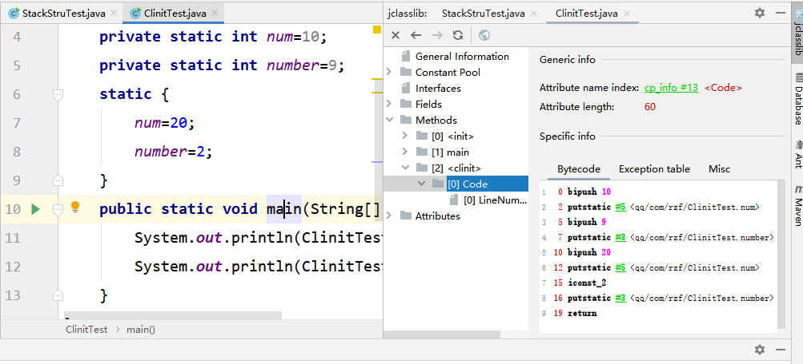
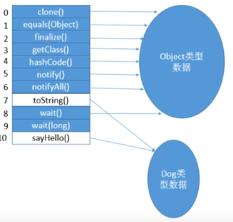

# `JVM`笔记

## 第一章，`JVM`概述

### 1.1，`java`代码的执行流程

1. `java`虚拟机执行的是字节码文件，字节码文件经过虚拟机首先经过类的装载，接着是字节码校验器，然后是字节码解释执行，最后是`jit`编译器进行编译。字节码解释器和`JIT`编译器也是执行引擎，是虚拟机中最重要的一部分，应为对于我们的操作系统，他并不能识别字节码文件，只能识别机器指令，而高级语言翻译成机器指令的过程主要就是由执行引擎来完成的。解释器主要来保证执行时间，即首先加载解释字节码文件，编译器主要负责虚拟机的性能，对于一些热点代码，编译过后直接缓存起来。

2. `JVM`的架构模型

   `java`编译器输入的指令流基本上是*基于栈的指令集架构*，另一种指令集架构是基于*寄存器的指令集架构*。

   - 两种架构之间的区别：
   - 基于栈指令集的架构特点
     - 设计和实现更加简单，适用于资源受限的系统。
     - 避开了寄存器额分配难题，使用零地址指令分配方式。
     - 指令流中的指令大部分是零地址指令，其执行过程依赖于操作栈，指令集更小，编译器更加容易实现。
     - 不需要硬件支持，可移植性好，更好实现跨平台。
   - 基于寄存器指令集的特点
     - 典型的应用是`x86`二进制指令集，比如传统的`pc`以及`android`的`davlik`虚拟机。
     - 指令集架构完全依赖于硬件，可移植性差。
     - 性能优秀和执行更加高效。
     - 花费更少的指令去完成一项任务。
     - 在大部分情况下，基于寄存器的指令集往往都以一地址指令，二地址指令，三地址指令为主，而基于栈结构的指令集则以零地址为主。

### 1.2，查看字节码文件如何生成指令

1. 编写代码直接执行代码，进行反编译操作，

~~~ java
public class StackStruTest {
    public static void main(String[] args) {
        int a=2+3;
    }

}
~~~

2. 进入终端窗口进行反编译操作

~~~ java
//打开terminal窗口，然后进入字节码所在的文件
D:\intellij\ideaWork\jvm\character01\target\classes\qq\com\rzf
//执行反编译指令
javap -v 字节码全名称
javap -v StackStruTest.class
//执行结果
 Last modified 2020-4-15; size 428 bytes
  MD5 checksum 08d420fe2ab1e4819bf15dff33a49f18
  Compiled from "StackStruTest.java"
public class qq.com.rzf.StackStruTest
  minor version: 0
  major version: 49
  flags: ACC_PUBLIC, ACC_SUPER
Constant pool:
   #1 = Methodref          #3.#19         // java/lang/Object."<init>":()V
   #2 = Class              #20            // qq/com/rzf/StackStruTest
   #3 = Class              #21            // java/lang/Object
   #4 = Utf8               <init>
   #5 = Utf8               ()V
   #6 = Utf8               Code
   #7 = Utf8               LineNumberTable
   #8 = Utf8               LocalVariableTable
   #9 = Utf8               this
  #10 = Utf8               Lqq/com/rzf/StackStruTest;
  #11 = Utf8               main
  #12 = Utf8               ([Ljava/lang/String;)V
  #13 = Utf8               args
  #14 = Utf8               [Ljava/lang/String;
  #15 = Utf8               a
  #16 = Utf8               I
  #17 = Utf8               SourceFile
  #18 = Utf8               StackStruTest.java
  #19 = NameAndType        #4:#5          // "<init>":()V
  #20 = Utf8               qq/com/rzf/StackStruTest
  #21 = Utf8               java/lang/Object
{
  public qq.com.rzf.StackStruTest();
    descriptor: ()V
    flags: ACC_PUBLIC
    Code:
      stack=1, locals=1, args_size=1
         0: aload_0
         1: invokespecial #1                  // Method java/lang/Object."<init>":()V
         4: return
      LineNumberTable:
        line 3: 0
      LocalVariableTable:
        Start  Length  Slot  Name   Signature
            0       5     0  this   Lqq/com/rzf/StackStruTest;

  public static void main(java.lang.String[]);
    descriptor: ([Ljava/lang/String;)V
    flags: ACC_PUBLIC, ACC_STATIC
    Code://main方法生成的指令生成三条指令，而同样用寄存器，生成指令比较少
      stack=1, locals=2, args_size=1
         0: iconst_5
         1: istore_1
         2: return
      LineNumberTable:
        line 5: 0
        line 6: 2
      LocalVariableTable:
        Start  Length  Slot  Name   Signature
            0       3     0  args   [Ljava/lang/String;
            2       1     1     a   I
}
SourceFile: "StackStruTest.java"
~~~

### 1.3，`JVM`的生命周期

1. 虚拟机的启动

   `java`虚拟机的启动是通过引导类加载器`bootstrap class loader`创建一个初始类`initail calss`来完成的，这个类是由虚拟机的具体实现指定的。

2. 虚拟机的执行

   1. 一个运行着的`java`虚拟机有着清晰的任务，执行`java`程序
   2. 程序开始执行虚拟机就运行，程序结束虚拟机就结束运行
   3. *执行一个`java`程序的时候，真真正正的在执行的是一个`java`虚拟机进程。*

3. 虚拟机的停止：以下几种情况会退出虚拟机

   1. 程序正常执行结束
   2. 程序在运行过程中遇到错误或者异常而终止执行。
   3. 由于操作系统发故障而导致虚拟机进程终止运行。
   4. 某一个线程调用了`Runtime`类或者`system`类的`exit`方法，或者调用`runtime`类的`halt`方法，并且`java`安全管理器允许执行安全退出的方法。

### 1.4，虚拟机版本

1. `Sun Classic VM`

   早在`java`1.0版本的时候，`sun`公司发布一款名为`sun classic vm`的虚拟机,同时也是世界上第一款商用虚拟机，但是在`jdk 1.4`时候完全被淘汰。

   这一款虚拟机内部只提供了解释器。

   如果使用`jit`编译器，就需要进行外挂，但是一旦使用`jit`编译器，`jit`就会接管虚拟机的执行系统，解释器就不在工作，解释器和编译器不能配合工作。

   现在`hotspoy`内置了此虚拟机。

.......待完成

## 第二章，类加载子系统

### 2.1，内存模型

### 2.2，类加载子系统

#### 2.2.1，类加载子系统模型

- 作用
  - 类加载子系统负责从本地文件或者网络文件中加载`class`文件，`class`文件开头有特定的标识符。‘
  - `classloader`负责`class`文件的加载，至于他是否可以运行，由执行引擎决定`execution engine`.
  - 加载的类信息存放在一块称为方法区的内存空间，除了类的信息外，方法区还会存放运行时常量池信息，可能还包括字符串常量和数字常量（这一部分常量信息是`class`文件中常量池部分的内存映射）。

#### 2.2.2，类加载器`Class Loader`

- 作用
  - `class file`存储于本地磁盘上面，可以理解为设计师画在纸上的模板，而最终这个模板在执行的时候要加载到`jvm`当中，分局这个模板实例化n多个一模一样的实例。
    - `class file`加载到`jvm`当中，b被称为`DNA`元素的模板，存储在方法区。
    - 在`.class`--->`jvm`---->最终成为元数据模板，此过程只要一个运输工具，类装载器`（class loader)`,扮演者一个快递员的角色。
    - 其中`class`文件加载到内存中是以二进制流的方式进行加载，一个对象通过`getclass()`方法还可以获取是哪一个类的对象。

#### 2.2.3，类加载过程

1. *加载`Loading`阶段*
   1. 通过一个类的权限定名，获取定义此类的二进制字节流。
   2. 将这个字节流所代表的静态存储结构转化为方法区的运行时数据结构。
   3. 在内存中生成一个代表这个类的`java.lang.class`对象，作为方法区这个类的各种数据结构的访问入口。
2. 加载`.class`字节码文件的方式
   1. 从本地直通中直接加载。
   2. 通过网络获取从`zip`压缩包中获取，成为以后`jar,war`格式的基础，
   3. 运行时计算生成，使用最多的是：动态代理技术。
   4. 由其他文件生成，典型的是`jsp`文件生成。
   5. 从专有数据库中获取字节码文件。
   6. 从加密文件中获取，典型的防止字节码文件被反编译的保护措施。

3. *连接`Linking`阶段*

   1. `verify`验证过程

      目的在于确保`.class`文件的字节流中包含的信息符合当前的虚拟机的要求，保证被加载的正确性，不会危害虚拟机自身的安全。

      - 主要包括四种验证方式：
        - 文件格式验证
        - 元数据验证
        - 字节码验证
        - 符号引用验证

   2. `prepare`准备阶段

      1. 为类变量设置内存和并且设置该类变量的初始值，即0.
      2. 这里不包含用`final`修饰的`static`,因为`final`修饰的变量在编译阶段就已经分配空间了，准备阶段会显示初始化，
      3. 这里不会为实例变量分配初始化，类变量会分配在方法区中，而实例变量会随着对象一起被分配到`java`的堆中。

   3. `resolve`解析阶段

      1. 将常量池中的符号引用转换为直接引用的过程。
      2. 解析操作往往会伴随着`jvm`在执行完初始化之后再执行。
      3. 符号引用就是一组符号来描述所引用的目标，符号引用的字面量形式明确定义`java`的`class`文件中，直接引用就是直接指向目标的指针，相对偏移量或者一个间接定位到目标的句柄。
      4. 解析动作主要针对类或者接口，字段，类方法，接口方法，方法类型等，对应常量池中的`constant_class_info`,`constant_fieldref_info`,`constant_Methodref_info`等。

4. *初始化`initialize`阶段*

   - 初始化方法`clinit`

   1. 初始化方法就是执行类构造器方法`clinit()`过程
   2. 此方法不需要自己定义，是`javac`编译器中自动收集类中所有的类变量的赋值动作和静态代码块中的语句合并而来的。
   3. 构造方法中的指令按照源文件中出现的顺序执行。
   4. `clinit()`方法不同于类的构造器，构造器是虚拟机视角下的`init()`方法。
   5. 如果该类具有父类，`jvm`会保证子类的`clinit()`方法执行前，父类的`clinit()`方法已经执行完毕。
   6. 虚拟机必须保证一个类的`clinit()`方法在多线程下被同步加锁。
   7. *如果类或者方法中没有给变量赋值或者静态代码块，那么就没有调用此方法*，对每一个类进行反编译都会产生一个`init()`方法，`init（）`方法对应的就是类的构造器的方法

   - 通过反编译，发现有三个初始化方法

~~~ java
public class ClinitTest {
    private static int num=10;
   
    static {
        num=20;
        number=2;
        System.out.println(ClinitTest.number);//报错，非法的前项引用，应为number的定义在调用后面
    }
    private static int number=9;
    public static void main(String[] args) {
        System.out.println(ClinitTest.number);
        System.out.println(ClinitTest.num);
    }

~~~

#### 2.2.4，类加载器的分类

- `java`支持两种类型的类加载器：
  - 引导型类加载器（`bootstrap classloader`)
  - 自定义类加载器（`user-define-classloader`)
    - 自定义类加载器是所有派生于抽象类`classloader`的类加载器。
  - 系统中类加载器的组织架构：

`extension class loader`和`system class loader`都属于用户自定义加载器，应为他们都是继承自`class loader`,也就是只要是继承`class loader`的加载器，都是用户自定义加载器。

~~~ java
public class ClassLoaderTest {
    public static void main(String[] args) {
        //获取系统类加载器
        ClassLoader classLoader=ClassLoader.getSystemClassLoader();
        //打印系统类加载器对象的引用地址：sun.misc.Launcher$AppClassLoader@18b4aac2
        System.out.println(classLoader);
        
        //获取其父类加载器，即扩展类加载器
        ClassLoader parentClassLoader=classLoader.getParent();
        System.out.println(parentClassLoader);

        //获取bootstraploader加载器
        ClassLoader parent = parentClassLoader.getParent();
        System.out.println(parent);
        
        //对用于自定义类来说，是有哪一个加载器加载的呢？
        ClassLoader classLoader1 = ClassLoaderTest.class.getClassLoader();
        System.out.println(classLoader1);
        
         //查看String有那个加载器加载
        ClassLoader classLoader2 = String.class.getClassLoader();
        System.out.println(classLoader2);
    }
}
sun.misc.Launcher$AppClassLoader@18b4aac2//系统类加载器，也叫作应用类加载器
sun.misc.Launcher$ExtClassLoader@4554617c//扩展类加载器
null
sun.misc.Launcher$AppClassLoader@18b4aac2//用户自定义类有系统加载器加载
null//String类目前的加载器为null,所以string也是有获取bootstraploader加载器类加载器进行加载，系统核心的类库全部是由获取bootstraploader核心加载器进行加载
~~~

1. `java`虚拟机自带的加载器

   1. 启动类加载器（引导类加载器 `Bootstrap ClassLoader`）
      - 这个类加载器是由`c&c++`语言实现的，嵌套在`java`虚拟机内部。
      - 此加载器用来加载`java`的核心库（`JAVA_HOME/jre/lib/rt.jar`）下面的内容，用于提供`jvm`自身需要的类，
      - 此加载器并不继承自`java.lang.classloader`,没有父类加载器。
      - 加载扩展类和应用程序类加载器，并指定为他们的父类加载器。
      - 处于安全考虑，`bootstrap`加载器仅仅加载包名为`java,javax,sun`等开头的类。

   2. 扩展类加载器(`extention classloader`)

      1. `java`语言编写的加载器，由`sun.misc.launcher$EXTclassloader`实现。
      2. 派生于`classloader`抽象类。
      3. 父类加载器是启动类加载器。
      4. 从`java.ext.dirs`系统目录下加载类库，或者从`jdk`的安装目录`jre/lib/ext/`子目录下加载类库，如果用户创建的`jar`包放在此目录下面，也会自动有扩展类加载器进行加载。

   3. 应用程序类加载器（系统加载器`appclassloader`)

      1. `java`语言编写的加载器，由`sun.misc.launcher$EXTclassloader`实现。
      2. 派生于`classloader`抽象类。
      3. 父类加载器为扩展类加载器。
      4. 他负责加载环境变量为`classpath`或者系统属性`java.class.path`指定路径下的类库。
      5. 该类加载器是系统中默认的加载器，一般来说`java`应用程序的类都是由系统类加载器完成加载的。
      6. 通过`classloader#getsystemclassloader`方法可以获取到该类加载器。

   4. 用户自定义类加载器

      为什么要自定义类加载器？

      - 隔离加载类
      - 修改类加载方式。
      - 扩展加载源。
      - 防止源码泄露。

      自定义类加载器的步骤：

      - 开发人员可以通过继承`java.lang.classloader`的方式，实现自己的类加载器。
      - 在`jdk1.2`之前，在自定义类加载器时候，总会去继承`classloader`类并且重写`loaderClass()`方法，从而实现自定义类加载器，在`jdk1.2`之后，已不再建议用户去覆盖`loaderClass()`方法，而是把自定义类的加载逻辑写在`findclass()`方法中。
      - 在编写自定义类加载器时候，如果没有太过复杂的要求，可以直接继承`URLclassloader`类，这样可以避免自己去写`findclass()`方法，及其获取字节码流的方式，使自定义类加载器更加方便。

   ~~~ java
   public class BootStrapLoaderTest {
       public static void main(String[] args) {
           //获取bootstarp加载器可以加载api的文件路径
           URL []urls=sun.misc.Launcher.getBootstrapClassPath().getURLs();
           for(URL tmp:urls){
               System.out.println(tmp.toExternalForm());
           }
           //从上面的类中任意选择一个类，查看他的类加载器是哪一个,引导类加载器
           ClassLoader classLoader = Provider.class.getClassLoader();
           System.out.println(classLoader);
   
           //扩展类加载器
           String property = System.getProperty("java.ext.dirs");
           for(String tmp:property.split(";")){
               System.out.println(tmp);
           }
           ClassLoader classLoader1 = CurveDB.class.getClassLoader();
           System.out.println(classLoader1);//扩展类加载器
       }
   }
   file:/C:/Program%20Files/Java/jdk1.8.0_102/jre/lib/resources.jar
   file:/C:/Program%20Files/Java/jdk1.8.0_102/jre/lib/rt.jar
   file:/C:/Program%20Files/Java/jdk1.8.0_102/jre/lib/sunrsasign.jar
   file:/C:/Program%20Files/Java/jdk1.8.0_102/jre/lib/jsse.jar
   file:/C:/Program%20Files/Java/jdk1.8.0_102/jre/lib/jce.jar
   file:/C:/Program%20Files/Java/jdk1.8.0_102/jre/lib/charsets.jar
   file:/C:/Program%20Files/Java/jdk1.8.0_102/jre/lib/jfr.jar
   file:/C:/Program%20Files/Java/jdk1.8.0_102/jre/classes
   null
   C:\Program Files\Java\jdk1.8.0_102\jre\lib\ext
   C:\Windows\Sun\Java\lib\ext
   sun.misc.Launcher$ExtClassLoader@4b67cf4d
   
   ~~~

### 2.3，`ClassLoader`类

#### 2.3.1，关于`class loader`抽象类

`Class loader`是一个抽象类，其后所有的类加载器都继承自`class loader`,(但是不包括启动类加载器)

~~~ java
getParent()//返回该类加载器的超类加载器
loadClass(String name)//加载类名为name的类，返回结果为java.lang.class类的实例
findClass(String name)//查找名称为name的类，返回结果为java.lang.class类的实例
findLocaledClass(String name)//查找名字为name已经被加载过的类，返回结果为java.lang.class类的实例
defineClass(String name,byte []b,int off,int len)//把字节数组中的数据转换为一个java类，返回结果为java.lang.class类的实例
resolveClass(Class<?>c)//连接指定的一个java类
~~~

#### 2.3.2，获取`classloader`的途径

### 2.4，双亲委派机制

- `java`虚拟机对`class`字节码文件采用的是按需加载的方式，也就是说当需要改类的时候才会把该类的字节码文件加载到内存生成`class`对象，而且加载某一个类的`class`对象的时候，`java`虚拟机采用的是双亲委派机制，即把请求交给父类处理，它是一种任务委派模式。

- 什么是双亲委派模型？

1. 如果一个类收到类的加载请求，他并不会自己先去加载，而是把这个请求先委托给自己的父类去执行。
2. 如果父类加载器还存在其父类加载器，则进一步向上委托，依次递归，请求最终会到达最顶层的启动类加载器。
3. 如果父类加载器可以完成加载任务，就成功返回，倘若父类加载器无法完成此类的加载任务，子加载器才会尝试自己去加载，这就是双亲委派模型。

- 双亲委派机制例子：

某一个程序要用到`spi`接口，那么`spi`中一些核心的`jar`包由引导类加载器进行加载，而核心的`jar`包是一些接口，要具体加载一些实现类，并且是第三方的实现类，不属于核心的`api`可以利用反向委派机制，由系统类加载器进行加载第三方的一些类，这里的系统加载器实际上是线程的上下文类加载器。线程上下文加载器实际上是一些系统加载器。

- 双亲委派机制的优势：
  - 避免类的重复加载。
  - 保护程序安全，防止核心`api`被篡改。

### 2.5，沙箱安全机制

1. 自定义`string`类，但是在加载自定义`string`类的时候会率先使用引导类型加载器进行加载，而引导类型加载器在加载的过程中会率先加载`jdk`自带的文件，（`rt.jar`包中的`java/lang/String.jar`），报错提示没有`main`方法，这就是应为加载的是（`rt.jar`包中的`java/lang/String.jar`）下的`string`类，这样可以保证对`java`核心源代码的保护，这就是*沙箱安全机制*。
2. 在`jvm`中标示两个`class`对象是否为同一个类存在两个必要的条件：
   1. 类的完整类名必须完全一致，包括包名。
   2. 加载这个类的`classloader`也必须相同。（指的是`classloader`的实例对象）。
   3. 换句话说，在`jvm`中，即使两个类对象（`class`对象），来源于同一个`class`文件，被同一个虚拟机加载，但是只要加载他们的`classloader`实例对象不同，那么这两个对象也不相等。
3. `jvm`必须知道一个类型是由启动加载器加载的还是由用户类加载器加载的，如果一个类型是由用户类加载器进行加载，那么`jvm`会将这个类的加载器的一个引用作为类型信息的一部分保存在方法区中，当解析一个类型到另一个类型的引用的时候，`jvm`需要保证这两个类型的类加载器是相同的。
4. `java`程序对类的使用方式分为:主动使用和被动使用
   - 主动使用：七中情况
     - 创建类的实例。
     - 访问某一个类或接口的静态变量，或者对该静态变量赋值。
     - 调用类的静态方法。
     - 反射机制（`Class.forname(com.rzf.Test)`）
     - 初始化一个类的子类。
     - `java`虚拟机启动时被标明为启动类的类。
     - `jdk7`开始提供的动态语言支持：
       - `java.lang.invoke.MethodHandle`实例的解析结果。
   - 除了以上七中情况，其他使用`java`类的方式都被看作是类的被动使用，都不会导致类的初始化。

## 第三章，运行时数据区

- 运行时内存结构图

- 本地方法栈区域没有垃圾回收机制，堆和方法区有垃圾回收机制，`pc`寄存器也没有垃圾回收机制

  `Oom`:内存溢出异常，`pc`寄存器没有内存溢出情况，但是虚拟机栈区域和本地方法栈区域可能有内存溢出情况，`heap area`,`method area`也可能发生内存的溢出情况。

### 3.1，运行时数据区介绍

- 内存是非常重要的系统资源，是硬盘和`cpu`的中间仓库及桥梁，承载着操作系统和应用程序的实时运行，`JVM`内存布局规定了`java`在运行过程中内存的申请，分配，管理的策略，保证了`jvm`的高效稳定的运行，*不同的`jvm`对内存的划分和管理机制存在着部分的差异*，上面图是`hotspot`虚拟机内存的划分情况。
- `java`虚拟机定义了若干种程序运行期间会使用到的运行时数据取，其中有一些会随着虚拟机的启动而创建，随着虚拟机的推出而销毁，另外一些区域则是与线程一一对应的，这些与线程对应的数据区域会随着线程的开始和结束而创建和销毁。
- 下图中灰色部分为线程单独所有的数据区域，而红色为多个线程共享的数据区域。
- 线程独有：程序计数器，虚拟机栈，本地方法栈。
- 线程共享：堆，堆外内存（永久带或者元空间，代码缓存）

### 3.2，`Runtime`类

- 一个运行时数据区就相当于一个`runtime()`类的实例对象

### 3.3，线程

1. 线程概念

- 线程是一个程序里面的运行单元，`jvm`允许一个应用程序有多个线程并行执行。
- 在`hotspot`虚拟机里，每一个线程都与操作系统的本地线程直接映射，每当一个`java`线程准备好执行以后，此时一个操作系统的本地线程也同时创建，`java`线程执行终止后，操作系统的本地线程也会被回收。
- 操作系统负责所有线程的安排调度到任何一个可用的`cpu`上，一旦本线程初始化成功，就会调用`java`线程中的`run()`方法。在这里准备工作是准备一个线程所需要的资源，比如本地方法站，程序计数器，虚拟机栈。

2. 线程分类
   - 如果使用`jconsole`或者任何一个调试工具，可以看到后台有许多线程在运行，这些线程不包括调用`public static void main(String []args)`的`main`线程以及所有这个`main`线程自己创建的线程。
   - 这些主要的后台系统线程在`hotspot`虚拟机中是一些几个：
     - 虚拟机线程：这种线程的操作是需要`jvm`达到安全点才会出现，这些操作必须在不同的线程中发生的原因是他们需要`jvm`达到安全点，这样堆才不会变化，这种线程的执行类型不包括`stop-the-world`的垃圾收集，线程栈手机，线程挂起以及偏向锁撤销。
     - 周期任务线程：这种线程是时间周期事件的体现，他们一般用于周期性操作的调度执行。
     - `GC`线程：这种线程对`jvm`里面不同种类的垃圾收集行为提供了支持。
     - 编译线程：这种线程在运行时会将字节码编译成本地代码。
     - 信号调度线程：这种线程接收信号并发送给`jvm`，在他内部通过调用适当的方法进行处理。

### 3.4，程序计数器（`pc`寄存器)

#### 3.4.1，程序寄存器概述

- 寄存器是程序控制流程的指示器，分支，循环，跳转，异常处理，线程回复等基本功能都需要依赖这个寄存器来完成。
- 字节码解释器工作时就是通过改变这个计数器的值来选取下一条需要执行的字节码指令。
- 寄存器是唯一一个在`java`虚拟机规范中没有规定任何`oom`情况的区域。
- 寄存器是一块很小的空间，几乎可以忽略不计，也是运行最快的存储区域。
- 在`jvm`规范中，每一个线程都有自己的程序计数器，是线程私有的，生命周期与线程的生命周期保持一致。
- 任何时间一个线程都只有一个方法在执行，也就是所谓的*当前方法*，程序计数器会存储当前线程正在执行的`java`方法的`jvm`指令地址，或者是在执行`native`方法，则是未指定值（`undefined`）。

- `jvm`中的程序计数寄存器中，`register`的名字源于`cpu`寄存器，寄存器存储指令相关的现场信息，`cpu`只有把数据装在到寄存器才能够运行。
- 在这里并不是广义上的物理寄存器，或许将其翻译成`pc`计数器，（或者指令计数器），`jvm`中的`pc`寄存器是对物理寄存器的一种抽象模拟。

- 寄存器作用：

- `pc`寄存器用来存储指向下一条指令的地址，也即将要执行的指令代码，由执行引擎在寄存器中读取下一条指令地址并且执行指令。
- 在这里，程序计数器每一个线程都有一份，每一个栈帧就对应着一个方法，程序计数器就是记录自己的线程执行到那个位置。

#### 3.4.2，程序寄存器实例

~~~ java
public static void main(String[] args) {
        int i = 10;
        int j = 20;
        int var10000 = i + j;
    }
//反编译结果
 Last modified 2020-4-17; size 463 bytes
  MD5 checksum 3c5ab7cfb1b7a268d1dc49a020b0a7a3
  Compiled from "PcRegister.java"
public class qq.com.rzf.PcRegister
  minor version: 0
  major version: 49
  flags: ACC_PUBLIC, ACC_SUPER
Constant pool://常量池
   #1 = Methodref          #3.#21         // java/lang/Object."<init>":()V
   #2 = Class              #22            // qq/com/rzf/PcRegister
   #3 = Class              #23            // java/lang/Object
   #4 = Utf8               <init>
   #5 = Utf8               ()V
   #6 = Utf8               Code
   #7 = Utf8               LineNumberTable
   #8 = Utf8               LocalVariableTable
   #9 = Utf8               this
  #10 = Utf8               Lqq/com/rzf/PcRegister;
  #11 = Utf8               main
  #12 = Utf8               ([Ljava/lang/String;)V
  #13 = Utf8               args
  #14 = Utf8               [Ljava/lang/String;
  #15 = Utf8               i
  #16 = Utf8               I
  #17 = Utf8               j
  #18 = Utf8               k
  #19 = Utf8               SourceFile
  #20 = Utf8               PcRegister.java
  #21 = NameAndType        #4:#5          // "<init>":()V
  #22 = Utf8               qq/com/rzf/PcRegister
  #23 = Utf8               java/lang/Object
{
  public qq.com.rzf.PcRegister();
    descriptor: ()V
    flags: ACC_PUBLIC
    Code:
      stack=1, locals=1, args_size=1
         0: aload_0
         1: invokespecial #1                  // Method java/lang/Object."<init>":()V
         4: return
      LineNumberTable:
        line 3: 0
      LocalVariableTable:
        Start  Length  Slot  Name   Signature
            0       5     0  this   Lqq/com/rzf/PcRegister;

  public static void main(java.lang.String[]);
    descriptor: ([Ljava/lang/String;)V
    flags: ACC_PUBLIC, ACC_STATIC
    Code://主程序，左边的数字代表指令地址，即pc寄存器中存储的数据，右边的是操作指令，执行引擎会去pc寄存器指定的地方取出指令然后执行
      stack=2, locals=4, args_size=1
         0: bipush        10
         2: istore_1
         3: bipush        20
         5: istore_2
         6: iload_1
         7: iload_2
         8: iadd
         9: istore_3
        10: return
      LineNumberTable:
        line 5: 0
        line 6: 3
        line 7: 6
        line 9: 10
      LocalVariableTable:
        Start  Length  Slot  Name   Signature
            0      11     0  args   [Ljava/lang/String;
            3       8     1     i   I
            6       5     2     j   I
           10       1     3     k   I
}
SourceFile: "PcRegister.java"

~~~

#### 3.4.3，常见问题

1. 使用`pc`寄存器存储字节码指令地址有什么用？

   应为`cpu`需要不停的在各个线程之间进行切换，这个时候切换回来之后，就不知道从程序的哪一个指令开始，`jvm`的字节码解释器就需要通过改变`pc`寄存器的值来明确下一条执行什么样的字节码指令。

2. `pc`寄存器为什么会设定为线程私有的？

   所谓的多线程是在一个特定的时间段内只会执行某一个线程的方法，`cpu`会不停的做任务的切换，这样必然导致经常的中断和恢复，如何保证在这个过程中不出现差错，为了能够准确的记录各个线程正在执行的当前字节码指令的地址，最好办法是为每一个线程都分配一个`pc`寄存器，这样一来各个线程之间便可以进行独立计算，从而不会出现干扰的情况。

   由于`cpu`时间片轮限制，多个线程在执行的过程中，任何一个确定的时刻，一个处理器或者多核处理器中的一个内核，只会执行某一个线程中的一条指令。这样必然导致经常的中断和恢复，如何保证在这个过程中不出现差错，为了能够准确的记录各个线程正在执行的当前字节码指令的地址，最好办法是为每一个线程都分配一个`pc`寄存器，这样一来各个线程之间便可以进行独立计算，从而不会出现干扰的情况。

3. 并行vs串行

   并行，若干个线程同时在执行，在一个时间点上同时执行，串行是若干个线程按照顺序执行

   并发，并发，一个`cpu`快速在各个线程之间进行切换执行.

### 3.5，虚拟机栈结构

#### 3.5.1，虚拟机栈帧概述

1. 概述：

   由于跨平台性设计，`java`的指令都是根据栈设计的，不同平台的`cpu`架构不同，所以不能设计为基于寄存器的。

   **优点是跨平台，指令集比较小，编译器容易实现，缺点是性能下降，实现同样的功能需要更多的指令。**

2. 内存中的栈与堆

   栈是运行时的单位，而堆是存储的单位，*即栈解决的是程序的运行问题，程序如何执行，或者说如何处理数据，堆解决的是如何存储数据，即数据怎么存放，放在哪里。*

3. `java`虚拟机栈是什么？

`java`虚拟机栈，早期也叫做`java`栈，每个线程在创建的时候都会创建一个虚拟机栈，其内部都会保存一个个的栈帧，对应着一次次的方法调用，栈是线程私有的。栈帧是栈的基本单位。

4. 生命周期

栈的生命周期和线程的生命周期一直，随着线程的启动而创建，随着线程的停止而销毁。当主线程结束后，整个的虚拟机的栈就全部销毁掉。

5. 作用

主管`java`程序的运行，他保存方法的局部变量（8种基本数据类型，应用数据类型只能放引用数据对象的地址），部分结果，并且参与方法的调用和结果的返回。

局部变量`vs`属性（成员变量）

基本数据类型变量`vs`引用类型变量（指对象）（类，数组，接口）

6. 栈的特点（优点）

   栈是一种快速有效的分配存储方式，访问速度仅次于程序计数器，

7. `jvm`直接对`java`栈的操作有两个，

   1. 每个方法的执行，伴随着出栈入栈。
   2. 运行结束后出栈工作。

8. 对于栈来说，不存在垃圾回收机制，`Pc`寄存器：既没有垃圾回收，也没有`oom`内存溢出。

   栈：存在`oom`，会栈溢出，但是不存在垃圾回收机制。

9. 栈中可能出现的异常。

   `java`虚拟机规范允许`java`栈的大小是动态变化的或者是固定不变的，

   - 如果是固定大小的虚拟机栈，那么每一个线程的`java`虚拟机栈的大小可以再创建线程的时候独立确定，如果线程请求分配的栈容量大小超过虚拟机栈允许的最大容量，`java`虚拟机将会抛出`StackOverFlowError`异常。
   - 如果`java`虚拟机栈的容量可以进行动态的扩展，并且在扩展的时候无法申请到足够的空间，或者在新创建线程的时候没有足够的内存去创建虚拟机栈，那么`java`虚拟机将会抛出一个`OutOFmemoryError`错误。

10. 设置内存的大小。

    我们可以使用参数`-Xss`来设置线程的最大栈空间容量，栈的大小直接决定了函数调用最大的深度。

#### 3.5.2，栈的存储单位

1. 栈中存储什么？

   - 每一个线程都有自己的栈，栈中的数据都是以栈帧(`satck frame`)的格式存在，可以把每一个栈帧看做是一个方法。
   - 在这个线程上正在执行的每一个方法都对应着一个栈帧。
   - 栈帧是一个内存块，是一个数据集，维系着方法执行过程中的各种数据信息。

   `oop`的基本概念：类，对象。

   类中的基本结构：`field`（属性，字段），`method`。

2. 栈的运行原理。

   - `jvm`对栈的操作有两个，出栈和入栈，遵循“先进后出，后进先出”的原则。
   - 在一条活动的线程中，一个时间点上，只有一个活动的栈帧，即只有当前正在执行的方法的栈帧（栈顶栈帧）是有效的，这个栈帧被称为当前栈帧（`current frame`）,与当前栈帧对应的方法是当前方法（`current method`）,当以这个方法的类就是当前类（`current class`）。
   - 执行引擎运行的所有字节码指令只针对当前当前的栈帧进行操作。
   - 如果在该方法中调用其他方法，对应的新的栈帧会被创建出来，放在栈的顶端，称为新的当前栈帧。
   - 不同的线程所包含的栈帧是不允许相互引用的，即不可能在一个线程的栈帧中引用另外一个线程的栈帧。
   - 如果当前方法调用了其他的方法，方法返回之前，当前栈帧会返回此方法的执行结果给前一个栈帧，接着，虚拟机会丢弃当前栈帧，使得前一个栈帧称为当前的栈帧。
   - `java`方法有两种返回函数的方式，**一种是正常的函数返回，使用`return`命令，另一种是异常的抛出，不管使用哪种方式，都会导致栈帧被弹出。**

2. 栈帧的内部结构

- 每一个栈帧中都存储着：

  **局部变量表（`local variables`）**：变量的声明。

  **操作数栈(`operand stack`)**:表达式栈。

  **方法返回地址(`return address`)**：方法正常退出或者异常退出的定义。

  **动态链接(`dynamic linking`)**：指向运行时常量池的方法引用。

  **一些附加信息。**

- 栈帧的大小决定线程中的栈可以存放几个栈帧，而栈帧的大小又由以上的几部分决定。局部变量表映像最大。

#### 3.5.3，局部变量表(`Local variables`)

- 局部变量表

1. 局部变量表也叫做局部变量数组或者本地变量表。
2. **定义为一个数字数组，主要用于存放参数和定义在方法体中的局部变量**，这些数据类型包括各种基本数据类型（8中基本数据类型），对象的引用(`reference`)，以及`returnaddress`类型。
3. 由于局部变量表是建立在线程的栈上面，是线程的私有数据，**因此不存在数据安全问题**。
4. **局部变量表的大小是在编译器编译期间确定下来的**，并且保存在方法的`code`属性的`maximum local variables`数据项中，在方法运行期间是不会改变局部变量表的大小的。
5. 方法嵌套调用的次数由栈的大小所决定，一般来说，栈越大，方法嵌套调用次数就越多，对于一个函数而言，他的参数或者定义的变量越多，使得局部变量表膨胀，他的栈帧就越大，以满足方法调用所需传递信息增大的需求，进而函数调用会占据更多的栈空间，导致其嵌套调用次数就会减少。
6. 局部变量表只在当前的方法调用中有效，在方法执行的时候，虚拟机会通过使用局部变量表完成参数值到参数变量列表的传递过程，当方法调用结束后，就会随着方法栈的销毁而不存在，局部变量表也会销毁。

- 关于`slot`

  1. 参数值的存放总是在局部变量表数组的`index0`开始，到数组长度-1的索引结束。
  2. 局部变量表，最基本的存储单元是`slot`,(变量槽)。
  3. 局部变量表存储在编译期间可以确定的各种基本数据类型，引用类型，`returnaddress`的返回类型。
  4. 在局部变量表中，32位以内的变量只占用一个`slot`,包括`returnaddress`类型，64位类型（`long,double`）占用两个`slot`。
     - `byte,short,char`在存储前被转换为`int`,`boolean`也被转换为`int`,0标示`false`,非零标示`true`.
     - `long,double`占据两个`slot`。
  5. `jvm`会为局部变量表中的每一个`slot`分配一个索引，通过这个索引可以成功的访问到局部变量表中这个变量的值。
  6. 当一个实例方法被调用的时候，他的方法参数和方法体内部定义的局部变量将会按照顺序复制到局部变量表的每一个`slot`上面。
  7. 如果要访问局部变量表中一个64位的变量的值时，只需要使用前一个索引即可，即开始索引，
  8. 如果当前帧是由实例方法或者构造方法创建的，那么该对象引用`this`将会存放在`index`为0 的`slot`处。其余的参数按照参数顺序进行排列存放。
  9. 局部变量表中也存在`this`变量，在静态的方法中不可以用`this`，应为`this`不存在与当前方法的局部变量表中，构造方法，普通方法可以使用this是应为在他们的局部变量表中有this的声明，`String`也是引用类型，占据一个`slot`。

  - 变量表分析

  ~~~ java
  public static void StackTableTest{        
  StackFrame stackFrame = new StackFrame();       
  int num=10;        
  stackFrame.method1();    
  }
  ~~~

  - 静态方法分析

  

  

  

- 非静态的方法分析

静态方法和非静态方法的在变量方面的区别就是非静态方法中有`this`变量，而今静态方法中没有，并且`this`变量在0的位置。

- `slot`重复利用

  栈中局部变量表中的槽位是可以重复利用的，如果一个变量过了其作用域，那么在其作用域后声明的新的局部变量就很有可能重复用过期的局部变量表中的槽位，从而达到节省资源的目的。

变量`b`在出了大括号就被销毁，但是在数组中开辟的空间还在，因此变量`c`使用的是变量`b`开辟的`slot`位置。因此`c`的`index`和`b`的`index`数值上一样。

- `i++`和`++i`的区别

~~~ java
public static void main(String[] args) {
        //第一类问题
        int i1=10;
        i1++;

        int i2=10;
        ++i2;

        //第二类问题
        int i3=10;
        int i4=i3++;

        int i5=10;
        int i6=++i5;

        //第三类问题
        int i7=10;
        i7=i7++;
         int i8=10;
         i8=++i8;

         //第四类问题
        int i9=10;
        int i10=i9++ + ++i9;
    }
//字节码分析
0 bipush 10
 2 istore_1
 3 iinc 1 by 1
 6 bipush 10
 8 istore_2
 9 iinc 2 by 1
12 bipush 10
14 istore_3
15 iload_3
16 iinc 3 by 1
19 istore 4
21 bipush 10
23 istore 5
25 iinc 5 by 1
28 iload 5
30 istore 6
32 bipush 10
34 istore 7
36 iload 7
38 iinc 7 by 1
41 istore 7
43 bipush 10
45 istore 8
47 iinc 8 by 1
50 iload 8
52 istore 8
54 bipush 10
56 istore 9
58 iload 9
60 iinc 9 by 1
63 iinc 9 by 1
66 iload 9
68 iadd
69 istore 10
71 return
~~~

补充知识：变量的分类

按照数据类型分类：基本数据类型，引用数据类型。

按照在类中声明的位置：

成员变量，在使用前，默认都经历过初始化赋值，成员变量又分为类变量和实例变量。

​	类变量：在`linking`和`prepare`阶段，给变量默认赋值，`initial`阶段：给类变量显示赋值，即静态代码块赋值。

​	实例变量：随着对象的创建，会在堆空间分配实例对象的空间，并进行默认赋值。

局部变量：在使用前，必须进行显示赋值，否则编译不会通过。

- 在栈帧中，与性能调优关系最为密切的部分就是前面提到的局部变量表，在方法执行时，虚拟机就使用局部变量表完成方法的传递。
- 局部变量表中也是最重要的垃圾回收根节点，只要被局部变量表中直接引用或者间接引用的对象都不会被回收。

#### 3.5.4，操作数栈（`Operand Stack`）

1. 概述

- 每一个独立的栈帧中除了包含局部变量表以外，还包括一个后进先出（`last-in-first-out`）的操作数栈，也可以称为表达式栈（`expression stack`）。
- 操作数栈，在方法执行的过程中，根据字节码指令，往栈中写入数据或者是提取数据，即入栈或者出栈。
  - 某一些字节码指令将值压入操作数栈，其余的字节码指令将操作数取出栈，使用他们后再把结果压入栈。

- 默认用数组实现，因此在编译阶段大小已经确定。
- 如果被调用的方法带有返回值的话，其返回值将会被压入当前栈帧的操作数栈中，并且更新`pc`寄存器中吓一跳需要执行的字节码指令。
- **操作数栈中元素的数据类型必须和字节码指令的序列严格匹配，这是由编译器的编译期间进行验证的，同时在类加载的过程中类检验阶段的数据流分析阶段要再次验证。**
- **另外，我们说`java`虚拟机的解析引擎是基于栈的执行引擎，其中的栈指的是操作数栈**。

2,。 作用

- 操作数栈，主要用于保存计算过程中的中间结果，同时作为计算过程中变量的临时存储位置。
- 操作数栈就是`jvm`执行引擎的一个工作区，当一个方法刚开始执行的时候，一个新的栈帧也会随之被创建出来，这个方法的操作数栈是空的。
- 每一个操作数栈都会拥有一个明确的栈深度用于存储数值，其所需要的最大深度在编译期间就定义好，保存在方法的`code`属性中，为`max_stack`的值。
- 栈中的数据类型可以是任何一个`java`数据类型，
  - `32bit`的类型占用一个栈单位深度。
  - `64bit`类型占据两个栈单位的深度。
- 操作数栈并非采用访问索引的方式来进行数据访问的，而只是通过标准的入栈和出栈操作来完成数据的访问，

#### 3.5.5，代码追踪

~~~ java
public class OperantStackTest {
    public static void main(String[] args) {
        byte i=15;
        int j=8;
        int m=i+j;
    }
}
//编译结果
Classfile /D:/intellij/ideaWork/jvm/character01/target/classes/qq/com/rzf/OperantStackTest.class
  Last modified 2020-4-17; size 481 bytes
  MD5 checksum 775fd5fe9a4b1c367860391e1435daef
  Compiled from "OperantStackTest.java"
public class qq.com.rzf.OperantStackTest
  minor version: 0
  major version: 49
  flags: ACC_PUBLIC, ACC_SUPER
Constant pool:
   #1 = Methodref          #3.#21         // java/lang/Object."<init>":()V
   #2 = Class              #22            // qq/com/rzf/OperantStackTest
   #3 = Class              #23            // java/lang/Object
   #4 = Utf8               <init>
   #5 = Utf8               ()V
   #6 = Utf8               Code
   #7 = Utf8               LineNumberTable
   #8 = Utf8               LocalVariableTable
   #9 = Utf8               this
  #10 = Utf8               Lqq/com/rzf/OperantStackTest;
  #11 = Utf8               main
  #12 = Utf8               ([Ljava/lang/String;)V
  #13 = Utf8               args
  #14 = Utf8               [Ljava/lang/String;
  #15 = Utf8               i
  #16 = Utf8               I
  #17 = Utf8               j
  #18 = Utf8               m
  #19 = Utf8               SourceFile
  #20 = Utf8               OperantStackTest.java
  #21 = NameAndType        #4:#5          // "<init>":()V
  #22 = Utf8               qq/com/rzf/OperantStackTest
  #23 = Utf8               java/lang/Object
{
  public qq.com.rzf.OperantStackTest();
    descriptor: ()V
    flags: ACC_PUBLIC
    Code:
      stack=1, locals=1, args_size=1
         0: aload_0
         1: invokespecial #1                  // Method java/lang/Object."<init>":()V
         4: return
      LineNumberTable:
        line 3: 0
      LocalVariableTable:
        Start  Length  Slot  Name   Signature
            0       5     0  this   Lqq/com/rzf/OperantStackTest;

  public static void main(java.lang.String[]);
    descriptor: ([Ljava/lang/String;)V
    flags: ACC_PUBLIC, ACC_STATIC
    Code:
      stack=2, locals=4, args_size=1
         0: bipush        8
         2: istore_1
         3: bipush        9
         5: istore_2
         6: iload_1
         7: iload_2
         8: iadd
         9: istore_3
        10: return
      LineNumberTable:
        line 5: 0
        line 6: 3
        line 7: 6
        line 8: 10
      LocalVariableTable:
        Start  Length  Slot  Name   Signature
            0      11     0  args   [Ljava/lang/String;
            3       8     1     i   I
            6       5     2     j   I
           10       1     3     m   I
}
SourceFile: "OperantStackTest.java"
//byte,short,char,boolean像数组中存放都以int类型保存
~~~

`bipush`:表示存储`byte`类型数据。

#### 3.5.6，栈顶缓存技术（`Top-of-stack Cashing`）

- 基于栈架构的虚拟机所使用的零地址更加紧凑，但是完成一项操作的时候必然需要使用更多的入栈和出栈指令，者同时也就意味着将需要更多的指令分派次数和内存的读写次数。
- 由于操作数是存储在内存当中的，因此频繁的执行内存的读写操作必然会影响执行速度，为了解决这个问题，`hotspot`虚拟机的设计者们提出了栈顶缓存的技术，**将站顶的元素全部缓存在物理的`cpu`寄存器上，以此降低对内存的读写次数，提升执行引擎的执行效率。**

#### 3.5.7，动态链接(`Dynamic Linking`)

1. 概念

   1. 每一个栈帧的内部都包含一个指向运行时常量池中该帧所属方法的引用，包含这个引用的目的就是为了支持当前方法的代码能够实现动态链接，比如`invokedynamic`指令。

   2. 在`java`源文件被编译到字节码文件中时，所有的变量和方法的引用都作为符号引用（`symbolic references`），符号引用即以`#`开头额引用，保存在`class`文件的常量池中，在描述一个方法调用另一个方法的时候，就是通过常量池中指向方法的符号引用来标示的，那么动态链接的作用就是为了将这些符号引用转换为调用方法的直接引用。

   3. 为什么需要常量池呢？

      常量池的作用：就是为了提供一些符号常量，以便于指令的识别，节省存储空间。

2. 代码解析
   - 各个方法中的符号引用就代表指向常量池中方法的引用。

~~~ java
public class DynamicLinking {
    private int num=10;
    public static void main(String[] args) {

    }
    public void methodA(){
        System.out.println("methodA()");
    }
    public void methodB(){
        System.out.println("methodB()");
        methodA();
        num++;
    }
}
//反编译结果
Classfile /D:/intellij/ideaWork/jvm/character01/target/classes/qq/com/rzf/DynamicLinking.class
  Last modified 2020-4-17; size 796 bytes//字节码文件开始信息  
  MD5 checksum 27df0439f1609f367ea5d285f4b09bdd
  Compiled from "DynamicLinking.java"
public class qq.com.rzf.DynamicLinking
  minor version: 0
  major version: 49
  flags: ACC_PUBLIC, ACC_SUPER
Constant pool://常量池，#代表是符号引用
   #1 = Methodref          #9.#27         // java/lang/Object."<init>":()V
   #2 = Fieldref           #8.#28         // qq/com/rzf/DynamicLinking.num:I
   #3 = Fieldref           #29.#30        // java/lang/System.out:Ljava/io/PrintStream;
   #4 = String             #31            // methodA()
   #5 = Methodref          #32.#33        // java/io/PrintStream.println:(Ljava/lang/String;)V
   #6 = String             #34            // methodB()
   #7 = Methodref          #8.#35         // qq/com/rzf/DynamicLinking.methodA:()V
   #8 = Class              #36            // qq/com/rzf/DynamicLinking
   #9 = Class              #37            // java/lang/Object
  #10 = Utf8               num
  #11 = Utf8               I  //代表int类型变量
  #12 = Utf8               <init>
  #13 = Utf8               ()V//代表空参和void返回类型
  #14 = Utf8               Code
  #15 = Utf8               LineNumberTable
  #16 = Utf8               LocalVariableTable
  #17 = Utf8               this
  #18 = Utf8               Lqq/com/rzf/DynamicLinking;
  #19 = Utf8               main
  #20 = Utf8               ([Ljava/lang/String;)V
  #21 = Utf8               args
  #22 = Utf8               [Ljava/lang/String;
  #23 = Utf8               methodA
  #24 = Utf8               methodB
  #25 = Utf8               SourceFile
  #26 = Utf8               DynamicLinking.java
  #27 = NameAndType        #12:#13        // "<init>":()V
  #28 = NameAndType        #10:#11        // num:I
  #29 = Class              #38            // java/lang/System
  #30 = NameAndType        #39:#40        // out:Ljava/io/PrintStream;
  #31 = Utf8               methodA()
  #32 = Class              #41            // java/io/PrintStream
  #33 = NameAndType        #42:#43        // println:(Ljava/lang/String;)V
  #34 = Utf8               methodB()
  #35 = NameAndType        #23:#13        // methodA:()V
  #36 = Utf8               qq/com/rzf/DynamicLinking
  #37 = Utf8               java/lang/Object
  #38 = Utf8               java/lang/System
  #39 = Utf8               out
  #40 = Utf8               Ljava/io/PrintStream;
  #41 = Utf8               java/io/PrintStream
  #42 = Utf8               println
  #43 = Utf8               (Ljava/lang/String;)V
{
  public qq.com.rzf.DynamicLinking();
    descriptor: ()V
    flags: ACC_PUBLIC
    Code:
      stack=2, locals=1, args_size=1
         0: aload_0
         1: invokespecial #1                  // Method java/lang/Object."<init>":()V
         4: aload_0
         5: bipush        10
         7: putfield      #2                  // Field num:I
        10: return
      LineNumberTable:
        line 3: 0
        line 4: 4
      LocalVariableTable:
        Start  Length  Slot  Name   Signature
            0      11     0  this   Lqq/com/rzf/DynamicLinking;

  public static void main(java.lang.String[]);
    descriptor: ([Ljava/lang/String;)V
    flags: ACC_PUBLIC, ACC_STATIC
    Code:
      stack=0, locals=1, args_size=1
         0: return
      LineNumberTable:
        line 7: 0
      LocalVariableTable:
        Start  Length  Slot  Name   Signature
            0       1     0  args   [Ljava/lang/String;

  public void methodA();
    descriptor: ()V
    flags: ACC_PUBLIC
    Code:
      stack=2, locals=1, args_size=1
         0: getstatic     #3                  // Field java/lang/System.out:Ljava/io/PrintStream;
         3: ldc           #4                  // String methodA()
         5: invokevirtual #5                  // Method java/io/PrintStream.println:(Ljava/lang/String;)V
         8: return
      LineNumberTable:
        line 9: 0
        line 10: 8
      LocalVariableTable:
        Start  Length  Slot  Name   Signature
            0       9     0  this   Lqq/com/rzf/DynamicLinking;

  public void methodB();//methodB()方法字节码
    descriptor: ()V
    flags: ACC_PUBLIC
    Code:
      stack=3, locals=1, args_size=1
         0: getstatic     #3                  // Field java/lang/System.out:Ljava/io/PrintStream;
         3: ldc           #6                  // String methodB()
         5: invokevirtual #5                  // Method java/io/PrintStream.println:(Ljava/lang/String;)V
         8: aload_0
         9: invokevirtual #7  //#7代表符号引用                // Method methodA:()V，在这里调用methodA()
        12: aload_0
        13: dup
        14: getfield      #2//调用常量池中#2                  // Field num:I //获取num
        17: iconst_1
        18: iadd
        19: putfield      #2                  // Field num:I
        22: return
      LineNumberTable:
        line 12: 0
        line 13: 8
        line 14: 12
        line 15: 22
      LocalVariableTable:
        Start  Length  Slot  Name   Signature
            0      23     0  this   Lqq/com/rzf/DynamicLinking;
}
SourceFile: "DynamicLinking.java"

~~~

#### 3.5.8，方法的调用，解析与分派

在`jvm`中，将符号引用转为调用方法的直接引用于方法的绑定机制相关。

- 静态链接：

  当一个字节码文件被装载到`jvm`内部的时候，如果被调用的目标方法在编译期间就明确的可以知道，并且在运行期间保持不变，这种情况下将调用方法的符号引用转换为直接引用的过程称为静态链接。

- 动态链接：

  如果被调用的方法在编译期间无法被确定下来，也就是说，只能够在程序的运行期间将调用方法的符号引用转换为直接引用，由于这种引用转换过程是在运行时确定，具备动态性，因此也就称为动态链接。

  - 总结：

    从方法中的符号引用根据符号在常量池中找到具体对应的方法就叫做符号引用到直接引用的转换

    符号引用转换为直接引用：如果在编译期间确定下来，就是静态链接，如果是在运行期间确定下来，就是动态链接

- 方法的绑定：

  对应的方法绑定机制为：早起绑定（`early binding`）和晚期绑定（`late binding`），绑定是一个字段，方法，或者类在符号引用被替换为直接引用的过程，仅仅发生一次。

  - 早期绑定：早期绑定就是指被调用的目标方法如果在编译期间可知，且在运行期间保持不变时，即可以将这个方法与所属的类型进行绑定，这样一来，由于明确了被调用的目标方法究竟是哪一个，因此也就可以使用静态链接的方式将符号引用转换为直接引用。

  - 晚期绑定：如果被调用的方法在编译期间无法被确定下来，只能够在程序运行期间根据实际的类型绑定相关的方法，这种绑定方式就被定义为晚期绑定。

  - 小结

    编译期间决定---->早期绑定

    运行期间决定---->晚期绑定

    晚期绑定体现在多态处。构造器表现为早期绑定。

- 虚方法与非虚方法

  子类对象的多态性的使用前提，类的继承关系，方法的重写。

  - 非虚方法：

    如果方法在编译期间就确定了具体的调用版本，这个版本在运行时是不可以改变的，这样的方法称为非虚方法。

    - 静态方法，私有方法，`final`方法，实例构造器，父类方法都属于非虚方法。
    - 其他的方法称为虚方法。
    - 非虚方法都不能被重写，因此在编译期间就可以被确定，而虚方法可以被重写，因此在运行期间才可以确定。

  - `Java`中如果不想让方法为虚方法，可以用`final`关键字修饰方法

- 虚拟机中提供了一下几条方法调用指令。

  - 普通调用指令。
    - `invokestatic`：调用静态方法，解析阶段确定唯一方法的版本。
    - `invokespecial`：调用`init`方法，私有以及父类方法，解析阶段确定的唯一方法版本。
    - `invokevirtual`：调用所有虚方法。
    - `invokeinterface`：调用接口方法。
  - 动态调用指令：
    - `invokedynamic`：动态解析出需要调用的方法，然后执行。
  - 前面四条指令固化在虚拟机的内部，方法的执行不可以人为的干预，而`invokedynamic`指令则支持用户确定方法的版本，其中`invokestatic`和`invokespecial`指令调用的方法称为非虚方法。其余的称为虚方法（`final`修饰的除外，应为不可以被继承重写）。

- 关于`invokedynamic`指令：

  - `jvm`字节码指令集一直比较稳定，一直到`java7`才增加了一个`invokedynamic`指令，这是`java`为了实现*动态类型语言*支持做的一种改进。
    - 但是在`java7`中并没有提供直接生成`invokedynamic`指令的方法，需要借助底层`ASM`这种底层字节码工具来产生`invokedynamic`指令，直到`java8`的`lambda`表达式出现，`invokedynamic`指令的生成，在`java`中才有了直接生成的方式。
  - 动态类型语言和静态类型的语言
    - 动态类型语言和静态类型语言两者的区别就是在于对类型的检查是在编译期间还是在运行期间，在编译期间就是静态类型语言，运行期间就是动态类型语言。
    - 静态类型语言是判断变量自身的类型信息，动态类型语言是判断变量值的类型信息，变量没有类型信息，变量值才有类型信息，这是动态语言的重要特性。根据变量值来确定类型。

- `java`语言中方法重写的本质。

  - 找到操作数栈顶的第一个元素所执行的对象的实际类型，记为`c`。
  - 如果在类型`c`中找到与常量中描述符合简单名称都相符的方法，则进行访问权限验证，如果通过就返回这个方法的直接引用，查找过程结束，如果不通过，就直接返回`java.lang.illegalaccesserror`异常。
  - 否则，按照继承关系从上往下依次对`c`的各个父类进行第二步的搜索和验证过程。
  - 如果始终没有找到合适的方法，就抛出`java.lang.abstractmethoderror`异常。

- `java.lang.illegalaccesserror`介绍。

  程序试图访问或者修改一个属性或者调用一个方法，这个属性或者方法，你没有访问权限，一般的，这个会引起编译器异常，这个错误如果发生在运行时，就说明这个类发生了不兼容的改变。

- 虚方法表

  - 在面向对象的编程中，会很频繁的使用动态分派，如果每一次动态分派的过程中都需要重新在类的方法元数据中搜索合适的目标的话就很可能影响到执行效率，因此，为了提高性能，`jvm`采用在类的方法区建立一个虚方法表（非虚方法不会出现在表中）来实现，使用索引表来代替查找。
  - 每一个类中都有一个虚方法表，表中存放着各个方法的实际入口。
  - 虚方法表会在类加载的连接阶段被创建并开始初始化，类的变量初始值准备完成之后，`jvm`会把该类的方法表也初始化完毕。

- 虚方法表：`friendly`是一个接口。

`dog`的虚方法表

- 其中`dog`重写了`object`类的`tostring()`和`sayHello()`方法。

具体狗的实现类:具体狗的实现类，没有重写父类`dog`的`tostring()`方法，那么此方法就指向父类的`tostring`方法，实现了父类`sayHello()`和`sayGoodbye`方法，那么这两个方法就指向具体的实现类，如果用其他的方法，都是调用`object()`中的方法。

`cat`实现类:`cat`实现类重写的方法全部指向`cat`类，其余指向`object`类。这就是`cat`的虚方法表。

#### 3.5.9，方法返回地址

- 本质上，方法的退出就是当前栈帧出栈的过程，此时，需要回复上层方法的局部变量表，操作数栈，将返回值压入调用者栈的操作数栈，设置`pc`寄存器值等，让调用者的方法继续执行下去。

- 存放调用该方法的`pc1`寄存器的值。

- 一个方法的结束有两种方式

  - 正常执行完毕，执行`return`语句。
  - 出现未处理的异常，非正常退出。

- 无论通过哪种方式退出，在方法退出后都会返回到该方法被调用的位置，方法正常退出时，调用者的`pc`计数器的值作为返回地址，即调用该方法的指令的下一条指令的地址，而通过异常退出的，返回地址是要通过异常表来确定，栈帧中一般不会保存这部分信息。

- 当一个方法开始执行后，只有两种方式可以退出这个方法：

  - 执行引擎遇到任意一个方法返回的字节码指令(`return`),会有返回值传递给上层的方法调用者，（正常完成的出口）。
    - 一个方法在正常调用完成之后究竟需要使用哪一个返回指令还需要根据方法返回值的实际数据类型而决定。
    - 在字节码指令中，返回指令包含`ireturn`（当返回值是`boolean,byte,char,short ,int`），`lreturn,freturn,dreturn,areturn`另外还有一个`return`指令供声明为`void`的方法，实例初始化方法，类和接口的初始化方法使用。（也就是没有返回类型的函数，在字节码文件中最后用`return`语句返回）。

  - 在方法执行的过程中遇到了异常（`exception`），并且这个异常并没有在这个方法内部进行处理，也就是只要在本地方法的异常表中没有搜索到匹配的异常处理器，就会导致方法退出，（异常完成出口）。
  - 方法执行过程中抛出异常时的异常处理，存储在一个异常处理表中，方便在发生异常的时候找到处理异常的代码。

异常表中的数字表示：从4---16行的异常，在19行进行处理。

`notes`:正常完成出口和异常完成出口的区别在于：通过异常完成的出口退出不会给他的上层调用者产生任何的返回值信息。

#### 3.5.10，栈的存储单位一些附加信息

- 栈帧中还允许携带与`java`虚拟机实现相关的一些附加信息。

#### 3.5.11，栈的存储单位栈相关面试

1. 开发中遇到的异常有哪些？（高级一点的异常：`java`虚拟机中的异常）

   递归函数调用通常易发生栈溢出的情况。

   `stackoverflowerror`,一个一个的添加栈帧，当栈空间不足的时候，会发生栈溢出情况

   ......待补充，内存溢出

2. 调整栈大小，就可以保证不出现溢出情况么？

   不可以，调整栈空间的大小，可以让`stackoverflowerror`出现的时间晚一点，但是不能完全避免。

~~~ java
/**
 * 栈内存溢出
 * 默认不设置栈内存大小：num最大值是9654
 * 设置栈的大小：-Xss256k,num值是：2469
 */
public class StackErrorFlow {
    private static  int num=0;
    public static void main(String[] args) {
        System.out.println(num);
        num++;
        main(args);//主函数递归调用自己
    }
}
~~~

3. 分配栈内存空间越大越好么？

   不一定，应为栈的总容量大小是一定的，如果给某一个线程的栈容量空间分配的很大，会导致其他线程的栈空间容量变小发生溢出情况，对于当前的线程，分配更大的栈内存。可以让`stackoverflowerror`出现的时间晚一点，并不能完全避免。

4. 垃圾回收机制是否会涉及到虚拟机栈？

   不会，

5. 方法中定义的局部变量是否是线程安全的？

   这个问题要具体问题具体分析。线程安全：如果只有一个线程才可以操作此数据，则必定是线程安全的，如果是多个线程操作此数据，则此数据是共享数据，如果不考虑同步机制的话，会存在线程安全问题。

   - 例子

~~~java
 //但是stringBuilder的声明方式是线程安全的
    public static void mothod1(){
        //StringBuilder类本身线程不安全
        StringBuilder stringBuilder = new StringBuilder();
        stringBuilder.append("aa");
        stringBuilder.append("bb");
    }
//因为method1()归某一个栈帧单独所有，其他线程不能够访问，所以是线程安全的，变量多个线程共享的时候存在线程安全问题。
//method2()的stringBuilder声明方式是不安全的,参数是从外面传进来，不归一个线程单独所有，可能多个线程共享，所以不安全
    public static void mothod2( StringBuilder stringBuilder){
        //StringBuilder类本身线程不安全
        stringBuilder.append("aa");
        stringBuilder.append("bb");
    }
//method3()的stringBuilder声明方式是不安全的，虽然stringBuilder是在方法里面创建的，但是有返回值，可能被其他线程所调用修改，所以不安全。
    public static StringBuilder mothod3(){
        //StringBuilder类本身线程不安全
        StringBuilder stringBuilder = new StringBuilder();
        stringBuilder.append("aa");
        stringBuilder.append("bb");
        return stringBuilder;
    }
//method4()的stringBuilder声明方式是安全的，Method3不安全，应为直接将stringBuilder进行返回，但是method4是安全的，应为在方法里面，stringBuilder已经不存在了，在这里stringBuilder安全，但是string可能不安全，应为tostring()方法有创建一个方法返回，可能多个线程共享string
    public static String mothod4(){
        //StringBuilder类本身线程不安全
        StringBuilder stringBuilder = new StringBuilder();
        stringBuilder.append("aa");
        stringBuilder.append("bb");
        return stringBuilder.toString();
    }
~~~

- 总结：

  对象如果内部产生，内部消亡，就是安全的。不是内部产生的，或者内部产生，但又返回生命周期没有结束就是不安全的。

