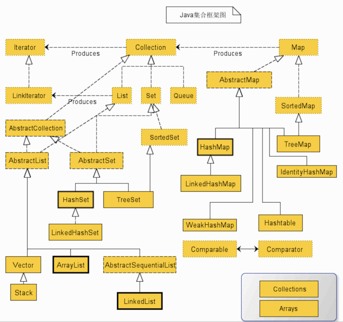
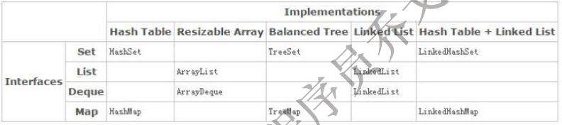
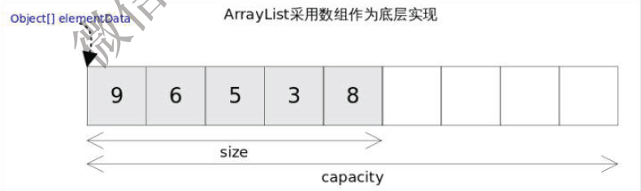
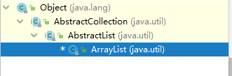
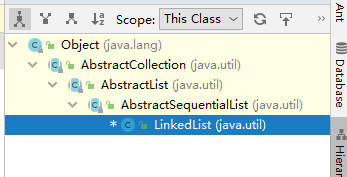

# `Java`集合整理

- 写在前面，先看一张集合的大图

## 1，接口

1. 常见接口

   - `Map` 接口和`Collection` 接口是所有集合框架的父接口；

2. `Collection`接口和`Map`的子接口

   - `Collection `接口的子接口包括：`Set `接口、`List `接口和`Queue` 接口；
   - `Map` 接口的实现类主要有： `HashMap` 、`TreeMap` 、`LinkedHashMap` 、`Hashtable` 、
     `ConcurrentHashMap `以及`Properties` 等；

3. `Set,List,Queue`接口的子接口

   - `Set` 接口的实现类主要有：`HashSet`、`TreeSet`、`LinkedHashSet` 等；
   - `List` 接口的实现类主要有：`ArrayList`、`LinkedList`、`Stack `、`Vector `以及`CopyOnWriteArrayList`等；
   - `Queue `接口的主要实现类有：`ArrayDeque`、`ArrayBlockingQueue`、`LinkedBlockingQueue`、`
     PriorityQueue `等；

4. 各种集合实现的数据结构

   

5. `List` 接口和`Set `接口的区别
   - `List` 元素是有序的，可以重复；`Set `元素是无序的，不可以重复。
6. 队列、`Set`、`Map` 区别
   1. `List` 有序列表
   2. `Set` 无序集合
   3. `Map` 键值对的集合
   4. `Queue` 队列`FlFO`.

## 2，`List`介绍

1. 特点：

   有顺序，可重复

### 2.1，`ArrayList`介绍

1. 特点

   1. 基于数组实现，无容量的限制。
   2. 在执行插入元素时可能要扩容，在删除元素时并不会减小数组的容量，在查找元素时要遍历数组，对于非null 的元素采取equals 的方式寻找。
   3. 是**非线程安全**的。

2. 注意点：

   1. `ArrayList `随机元素时间复杂度`O(1)`,应为是基于数组的实现，插入删除操作需大量移动元素，效率较低

   2. 为了节约内存，当新建容器为空时，会共享`Object[] EMPTY_ELEMENTDATA = {}`和
      `Object[] DEFAULTCAPACITY_EMPTY_ELEMENTDATA = {}`空数组

   3. 容器底层采用数组存储，每次扩容为***1.5*** 倍

   4. `ArrayList` 的实现中大量地调用了`Arrays.copyof()`和`System.arraycopy()`方法，其实`Arrays.copyof()`内部也是调用`System.arraycopy()`。`System.arraycopy()`为`Native` 方法

   5. 两个`ToArray `方法
      `Object[] toArray()`方法。该方法有可能会抛出`java.lang.ClassCastException `异常
      `<T> T[] toArray(T[] a)`方法。该方法可以直接将`ArrayList `转换得到的`Array `进行整体向下转
      型

   6. `ArrayList` 可以存储`null `值

   7. `ArrayList `每次修改（增加、删除）容器时，都是修改自身的`modCount`；在生成迭代
      器时，迭代器会保存该`modCount` 值，迭代器每次获取元素时，会比较自身的`modCount`
      与`ArrayList `的`modCount `是否相等，来判断容器是否已经被修改，如果被修改了则抛出异
      常（`fast-fail` 机制）。

      

3. `ArrayList`继承结构

   

4. 源代码解读

   1. 成员变量

      ~~~ java
      //序列号
      private static final long serialVersionUID = 8683452581122892189L;
      //默认容量
      private static final int DEFAULT_CAPACITY = 10;
      //一个空数组，当用户指定该 ArrayList 容量为 0 时，返回该空数组
      //Shared empty array instance used for empty instances.
      private static final Object[] EMPTY_ELEMENTDATA = {};
      
      /**
      * Shared empty array instance used for default sized empty instances. We
      * distinguish this from EMPTY_ELEMENTDATA to know how much to inflate when
      * first element is added.
        一个空数组实例
      * - 当用户没有指定 ArrayList 的容量时(即调用无参构造函数)，返回的是该数组==>刚创建一个 			ArrayList 时，其内数据量为 0。
      * - 当用户第一次添加元素时，该数组将会扩容，变成默认容量为 10(DEFAULT_CAPACITY) 的一个数组		===>通过  ensureCapacityInternal() 实现
      * 它与 EMPTY_ELEMENTDATA 的区别就是：该数组是默认返回的，而后者是在用户指定容量为 0 时返回
      */
      private static final Object[] DEFAULTCAPACITY_EMPTY_ELEMENTDATA = {};
      
          /**
           * The array buffer into which the elements of the ArrayList are stored.
           * The capacity of the ArrayList is the length of this array buffer. Any
           * empty ArrayList with elementData == DEFAULTCAPACITY_EMPTY_ELEMENTDATA
           * will be expanded to DEFAULT_CAPACITY when the first element is added.
           ArrayList基于数组实现，用该数组保存数据, ArrayList 的容量就是该数组的长度
           * - 该值为 DEFAULTCAPACITY_EMPTY_ELEMENTDATA 时，当第一次添加元素进入 ArrayList 中			时，数组将扩容值 DEFAULT_CAPACITY(10)
           */
          transient Object[] elementData; // non-private to simplify nested class access
      
          /**
           * The size of the ArrayList (the number of elements it contains).
           *ArrayList实际存储的数据数量
           * @serial
           */
          private int size;
      ~~~

   2. 方法解读

      1. 构造器

         ~~~ java
         /**
              * Constructs an empty list with the specified initial capacity.
              *
              * @param  initialCapacity  初始容量
              * @throws IllegalArgumentException if the specified initial capacity
              *         is negative
             	 IllegalArgumentException 当初试容量值非法(小于0)时抛出
              */
         public ArrayList(int initialCapacity) {
                 if (initialCapacity > 0) {
                     this.elementData = new Object[initialCapacity];
                 } else if (initialCapacity == 0) {
                     this.elementData = EMPTY_ELEMENTDATA;
                 } else {
                     throw new IllegalArgumentException("Illegal Capacity: "+
                                                        initialCapacity);
                 }
             }
          /**
              * Constructs an empty list with an initial capacity of ten.
              空构造器
              - 创建一个 空的 ArrayList，此时其内数组缓冲区 elementData = {}, 长度为 0
              * - 当元素第一次被加入时，扩容至默认容量 10
              */
             public ArrayList() {
                 this.elementData = DEFAULTCAPACITY_EMPTY_ELEMENTDATA;
             }
         ~~~

      2. `ArrayList()`方法

         ~~~ java
         /**
              * 创建一个包含collection的ArrayList
              * @param c 要放入 ArrayList 中的集合，其内元素将会全部添加到新建的 ArrayList 实例中
              * @throws NullPointerException 当参数 c 为 null 时抛出异常
              */
             public ArrayList(Collection<? extends E> c) {
                 //将集合转化成Object[]数组
                 elementData = c.toArray();
                 //把转化后的Object[]数组长度赋值给当前ArrayList的size，并判断是否为0
                 if ((size = elementData.length) != 0) {
                     // c.toArray might (incorrectly) not return Object[] (see 6260652)
                     // 这句话意思是：c.toArray 可能不会返回 Object[]，可以查看 java 官方编号为 6260652 的 bug
                     if (elementData.getClass() != Object[].class)
                         // 若 c.toArray() 返回的数组类型不是 Object[]，则利用 Arrays.copyOf(); 来构造一个大小为 size 的 Object[] 数组
                         elementData = Arrays.copyOf(elementData, size, Object[].class);
                 } else {
                     // 替换空数组
                     this.elementData = EMPTY_ELEMENTDATA;
                 }
             }
         ~~~

      3. `ensureCapacity(int minCapacity)`方法

         ~~~java
          /**
              * 指定 ArrayList 的容量
              * @param   minCapacity   指定的最小容量
              */
             public void ensureCapacity(int minCapacity) {
                 // 最小扩充容量，默认是 10
                 //这句就是：判断是不是空的ArrayList,如果不是，那么最小扩充容量10，否则最小扩充量为0
                 //上面无参构造函数创建后，当元素第一次被加入时，扩容至默认容量 10,就是靠这句代码
                 int minExpand = (elementData != DEFAULTCAPACITY_EMPTY_ELEMENTDATA)
                         ? 0
                         : DEFAULT_CAPACITY;
                 // 若用户指定的最小容量 > 最小扩充容量，则以用户指定的为准，否则还是 10
                 if (minCapacity > minExpand) {
                     ensureExplicitCapacity(minCapacity);
                 }
             }
         ~~~

      4. `ensureCapacityInternal(int minCapacity) `方法

         ~~~ java
          /**
              * 私有方法：明确 ArrayList 的容量，提供给本类使用的方法
              * - 用于内部优化，保证空间资源不被浪费：尤其在 add() 方法添加时起效
              * @param minCapacity    指定的最小容量
              */
             private void ensureCapacityInternal(int minCapacity) {
                 // 若 elementData == {}，则取 minCapacity 为 默认容量和参数 minCapacity 之间的最大值
                 // 注：ensureCapacity() 是提供给用户使用的方法，在 ArrayList 的实现中并没有使用
                 if (elementData == DEFAULTCAPACITY_EMPTY_ELEMENTDATA) {
                     minCapacity= Math.max(DEFAULT_CAPACITY, minCapacity);
                 }
                 ensureExplicitCapacity(minCapacity);
             }
         ~~~

      5. `ensureExplicitCapacity(int minCapacity) `方法

         ~~~ java
         /**
              * 私有方法：明确 ArrayList 的容量
              * - 用于内部优化，保证空间资源不被浪费：尤其在 add() 方法添加时起效
              * @param minCapacity    指定的最小容量
              */
             private void ensureExplicitCapacity(int minCapacity) {
                 // 将“修改统计数”+1，该变量主要是用来实现fail-fast机制的
                 modCount++;
                 // 防止溢出代码：确保指定的最小容量 > 数组缓冲区当前的长度
                 // overflow-conscious code
                 if (minCapacity - elementData.length > 0)
                     grow(minCapacity);
             }
         /**
              * 数组缓冲区最大存储容量
              * - 一些 VM 会在一个数组中存储某些数据--->为什么要减去 8 的原因
              * - 尝试分配这个最大存储容量，可能会导致 OutOfMemoryError(当该值 > VM 的限制时)
              */
             private static final int MAX_ARRAY_SIZE = Integer.MAX_VALUE - 8;
         ~~~

      6. `grow(int minCapacity)`方法

         ~~~java
         /**
              * 私有方法：扩容，以确保 ArrayList 至少能存储 minCapacity 个元素
              * - 扩容计算：newCapacity = oldCapacity + (oldCapacity >> 1);  扩充当前容量的1.5倍
              * @param minCapacity    指定的最小容量
              */
             private void grow(int minCapacity) {
                 // 防止溢出代码
                 int oldCapacity = elementData.length;
                 // 运算符 >> 是带符号右移. 如 oldCapacity = 10,则 newCapacity = 10 + (10 >> 1) = 10 + 5 = 15
                 int newCapacity = oldCapacity + (oldCapacity >> 1);
                 if (newCapacity - minCapacity < 0)  // 若 newCapacity 依旧小于 minCapacity
                     newCapacity = minCapacity;
                 if (newCapacity - MAX_ARRAY_SIZE > 0)   // 若 newCapacity 大于最大存储容量，则进行大容量分配
                     newCapacity = hugeCapacity(minCapacity);
                 // minCapacity is usually close to size, so this is a win:
                 elementData = Arrays.copyOf(elementData, newCapacity);
             }
         ~~~

      7. ` hugeCapacity(int minCapacity)`方法

         ~~~ java
         /**
              * 私有方法：大容量分配，最大分配 Integer.MAX_VALUE
              * @param minCapacity
              */
             private static int hugeCapacity(int minCapacity) {
                 if (minCapacity < 0) // overflow
                     throw new OutOfMemoryError();
                 return (minCapacity > MAX_ARRAY_SIZE) ?
                         Integer.MAX_VALUE :
                         MAX_ARRAY_SIZE;
             }
         ~~~

      8. `size()`

         ~~~ java
          /**
              * 返回ArrayList实际存储的元素数量
              */
             public int size() {
                 return size;
             }
         ~~~

      9. `isEmpty()`

         ~~~ java
         /**
              * ArrayList是否有元素
              */
             public boolean isEmpty() {
                 return size == 0;
             }
         ~~~

      10. `contains(Object o) `

          ~~~ java
           /**
               * 是否包含o元素
               */
              public boolean contains(Object o) {
                  // 根据 indexOf() 的值(索引值)来判断，大于等于 0 就包含
                  // 注意：等于 0 的情况不能漏，因为索引号是从 0 开始计数的
                  return indexOf(o) >= 0;
              }
          ~~~

      11. `indexOf(Object o)`

          ~~~ java
          /**
               * 顺序查找，返回元素的最低索引值(最首先出现的索引位置)
               * @return 存在？最低索引值：-1
               */
              public int indexOf(Object o) {
                  if (o == null) {
                      for (int i = 0; i < size; i++)
                          if (elementData[i]==null)
                              return i;
                  } else {
                      for (int i = 0; i < size; i++)
                          if (o.equals(elementData[i]))
                              return i;
                  }
                  return -1;
              }
          
          ~~~

      12. `lastIndexOf(Object o)`

          ~~~ java
          /**
               * 逆序查找，返回元素的最低索引值(最首先出现的索引位置)
               * @return 存在？最低索引值：-1
               */
              public int lastIndexOf(Object o) {
                  if (o == null) {
                      for (int i = size-1; i >= 0; i--)
                          if (elementData[i]==null)
                              return i;
                  } else {
                      for (int i = size-1; i >= 0; i--)
                          if (o.equals(elementData[i]))
                              return i;
                  }
                  return -1;
              }
          ~~~

      13. `clone()`

          ~~~java
          /**
               * 实现的有Cloneable接口，深度复制：对拷贝出来的 ArrayList 对象的操作，不会影响原来的 ArrayList
               * @return 一个克隆的 ArrayList 实例(深度复制的结果)
               */
              public Object clone() {
                  try {
                      // Object 的克隆方法：会复制本对象及其内所有基本类型成员和 String 类型成员，但不会复制对象成员、引用对象
                      ArrayList<?> v = (ArrayList<?>) super.clone();
                      // 对需要进行复制的引用变量，进行独立的拷贝：将存储的元素移入新的 ArrayList 中
                      v.elementData = Arrays.copyOf(elementData, size);
                      v.modCount = 0;
                      return v;
                  } catch (CloneNotSupportedException e) {
                      // this shouldn't happen, since we are Cloneable
                      throw new InternalError(e);
                  }
              }
          ~~~

      14. `toArray()`

          ~~~java
           /**
               * 返回 ArrayList 的 Object 数组
               * - 包含 ArrayList 的所有储存元素
               * - 对返回的该数组进行操作，不会影响该 ArrayList（相当于分配了一个新的数组）==>该操作是安全的
               * - 元素存储顺序与 ArrayList 中的一致
               */
              public Object[] toArray() {
                  return Arrays.copyOf(elementData, size);
              }
          ~~~

      15. `toArray(T[] a)`

          ~~~ java
          /**
               * 返回 ArrayList 元素组成的数组
               * @param a 需要存储 list 中元素的数组
               * 若 a.length >= list.size，则将 list 中的元素按顺序存入 a 中，然后 a[list.size] = null, a[list.size + 1] 及其后的元素依旧是 a 的元素
               * 否则，将返回包含list 所有元素且数组长度等于 list 中元素个数的数组
               * 注意：若 a 中本来存储有元素，则 a 会被 list 的元素覆盖，且 a[list.size] = null
               * @return
               * @throws ArrayStoreException 当 a.getClass() != list 中存储元素的类型时
               * @throws NullPointerException 当 a 为 null 时
               */
              @SuppressWarnings("unchecked")
              public <T> T[] toArray(T[] a) {
                  // 若数组a的大小 < ArrayList的元素个数,则新建一个T[]数组，
                  // 数组大小是"ArrayList的元素个数",并将“ArrayList”全部拷贝到新数组中
                  if (a.length < size)
                      // Make a new array of a's runtime type, but my contents:
                      return (T[]) Arrays.copyOf(elementData, size, a.getClass());
                  // 若数组a的大小 >= ArrayList的元素个数,则将ArrayList的全部元素都拷贝到数组a中。
                  System.arraycopy(elementData, 0, a, 0, size);
                  if (a.length > size)
                      a[size] = null;
                  return a;
              }
              /**
          ~~~

      16. `get(int index)`

          ~~~ java
          /**
               * 获取指定位置上的元素，从0开始
               */
              public E get(int index) {
                  rangeCheck(index);//检查是否越界
                  return elementData(index);
              }
          ~~~

      17. `rangeCheck(int index)`

          ~~~ java
           /**
               * 检查数组是否在界线内
               */
              private void rangeCheck(int index) {
                  if (index >= size)
                      throw new IndexOutOfBoundsException(outOfBoundsMsg(index));
              }
          ~~~

      18. `elementData(int index)`

          ~~~ java
          /**
               * 返回在索引为 index 的元素：数组的随机访问
               * - 默认包访问权限
               *
               * 封装粒度很强，连数组随机取值都封装为一个方法。
               * 主要是避免每次取值都要强转===>设置值就没有封装成一个方法，因为设置值不需要强转
               * @param index
               * @return
               */
              @SuppressWarnings("unchecked")
              E elementData(int index) {
                  return (E) elementData[index];
              }
          ~~~

      19. `set(int index, E element)`

          ~~~ java
           /**
               * 设置 index 位置元素的值
               * @param index 索引值
               * @param element 需要存储在 index 位置的元素值
               * @return 替换前在 index 位置的元素值
               * @throws IndexOutOfBoundsException {@inheritDoc}
               */
              public E set(int index, E element) {
                  rangeCheck(index);//越界检查
          
                  E oldValue = elementData(index);//获取旧数值
                  elementData[index] = element;
                  return oldValue;
              }
          ~~~

      20. `boolean add(E e)`

          ~~~ java
          /**
               *增加指定的元素到ArrayList的最后位置
               * @param e 要添加的元素
               * @return
               */
              public boolean add(E e) {
                  // 确定ArrayList的容量大小---严谨
                  // 注意：size + 1，保证资源空间不被浪费，
                  // ☆☆☆按当前情况，保证要存多少个元素，就只分配多少空间资源
                  ensureCapacityInternal(size + 1);  // Increments modCount!!
                  elementData[size++] = e;
                  return true;
              }
          
          ~~~

      21. `add(int index, E element)`

          ~~~ java
            /**
               *
               *在这个ArrayList中的指定位置插入指定的元素，
               *  - 在指定位置插入新元素，原先在 index 位置的值往后移动一位
               * @param index 指定位置
               * @param element 指定元素
               * @throws IndexOutOfBoundsException
               */
              public void add(int index, E element) {
                  rangeCheckForAdd(index);//判断角标是否越界
                  //看上面的，size+1，保证资源空间不浪费，按当前情况，保证要存多少元素，就只分配多少空间资源
                  ensureCapacityInternal(size + 1);  // Increments modCount!!
                  //第一个是要复制的数组，第二个是从要复制的数组的第几个开始，
                  // 第三个是复制到那，四个是复制到的数组第几个开始，最后一个是复制长度
                  System.arraycopy(elementData, index, elementData, index + 1,
                          size - index);
                  elementData[index] = element;
                  size++;
              }
          ~~~

      22. `remove(int index)`

          ~~~ java
          /**
               * 移除指定位置的元素
               * index 之后的所有元素依次左移一位
               * @param index 指定位置
               * @return 被移除的元素
               * @throws IndexOutOfBoundsException
               */
              public E remove(int index) {
                  rangeCheck(index);
          
                  modCount++;
                  E oldValue = elementData(index);
          
                  int numMoved = size - index - 1;//要移动的长度
                  if (numMoved > 0)
                      System.arraycopy(elementData, index+1, elementData, index,
                              numMoved);
                  // 将最后一个元素置空
                  elementData[--size] = null;
          
                  return oldValue;
              }
          ~~~

      23. `remove(Object o)`

          ~~~ java
          /**
               * 移除list中指定的第一个元素(符合条件索引最低的)
               * 如果list中不包含这个元素，这个list不会改变
               * 如果包含这个元素，index 之后的所有元素依次左移一位
               * @param o 这个list中要被移除的元素
               * @return
               */
              public boolean remove(Object o) {
                  if (o == null) {
                      for (int index = 0; index < size; index++)
                          if (elementData[index] == null) {
                              fastRemove(index);
                              return true;
                          }
                  } else {
                      for (int index = 0; index < size; index++)
                          if (o.equals(elementData[index])) {
                              fastRemove(index);
                              return true;
                          }
                  }
                  return false;
              }
          ~~~

      24. `fastRemove(int index)`

          ~~~ java
           /**
               * 快速删除第 index 个元素
               * 和public E remove(int index)相比
               * 私有方法，跳过检查，不返回被删除的值
               * @param index 要删除的脚标
               */
              private void fastRemove(int index) {
                  modCount++;//这个地方改变了modCount的值了
                  int numMoved = size - index - 1;//移动的个数
                  if (numMoved > 0)
                      System.arraycopy(elementData, index+1, elementData, index,
                              numMoved);
                  elementData[--size] = null; //将最后一个元素清除
              }
          
          ~~~

      25. ` clear()`

          ~~~ java
          
              /**
               * 移除list中的所有元素，这个list表将在调用之后置空
               * - 它会将数组缓冲区所以元素置为 null
               * - 清空后，我们直接打印 list，却只会看见一个 [], 而不是 [null, null, ….] ==> toString() 和 迭代器进行了处理
               */
              public void clear() {
                  modCount++;
          
                  // clear to let GC do its work
                  for (int i = 0; i < size; i++)
                      elementData[i] = null;
          
                  size = 0;
              }
          ~~~

      26. `addAll(Collection<? extends E> c) `

          ~~~ java
            /**
               * 将一个集合的所有元素顺序添加（追加）到 lits 末尾
               * - ArrayList 是线程不安全的。
               * - 该方法没有加锁，当一个线程正在将 c 中的元素加入 list 中，但同时有另一个线程在更改 c 中的元素，可能会有问题
               * @param c  要追加的集合
               * @return <tt>true</tt> ？ list 元素个数有改变时，成功：失败
               * @throws NullPointerException 当 c 为 null 时
               */
              public boolean addAll(Collection<? extends E> c) {
                  Object[] a = c.toArray();
                  int numNew = a.length;//要添加元素的个数
                  ensureCapacityInternal(size + numNew);  //扩容
                  System.arraycopy(a, 0, elementData, size, numNew);
                  size += numNew;
                  return numNew != 0;
              }
          ~~~

      27. `addAll(int index, Collection<? extends E> c)`

          ~~~ java
          /**
               * 从 List 中指定位置开始插入指定集合的所有元素,
               * -list中原来位置的元素向后移
               * - 并不会覆盖掉在 index 位置原有的值
               * - 类似于 insert 操作，在 index 处插入 c.length 个元素（原来在此处的 n 个元素依次右移）
               * @param index 插入指定集合的索引
               * @param c 要添加的集合
               * @return ？ list 元素个数有改变时，成功：失败
               * @throws IndexOutOfBoundsException {@inheritDoc}
               * @throws NullPointerException if the specified collection is null
               */
              public boolean addAll(int index, Collection<? extends E> c) {
                  rangeCheckForAdd(index);
          
                  Object[] a = c.toArray();//是将list直接转为Object[] 数组
                  int numNew = a.length;  //要添加集合的元素数量
                  ensureCapacityInternal(size + numNew);  // 扩容
          
                  int numMoved = size - index;//list中要移动的数量
                  if (numMoved > 0)
                      System.arraycopy(elementData, index, elementData, index + numNew,
                              numMoved);
          
                  System.arraycopy(a, 0, elementData, index, numNew);
                  size += numNew;
                  return numNew != 0;
              }
          ~~~

      28. `removeRange(int fromIndex, int toIndex)`

          ~~~ java
           /**
               * 移除list中 [fromIndex,toIndex) 的元素
               * - 从toIndex之后(包括toIndex)的元素向前移动(toIndex-fromIndex)个元素
               * -如果(toIndex==fromIndex)这个操作没有影响
               * @throws IndexOutOfBoundsException if {@code fromIndex} or
               *         {@code toIndex} is out of range
               *         ({@code fromIndex < 0 ||
               *          fromIndex >= size() ||
               *          toIndex > size() ||
               *          toIndex < fromIndex})
               */
              protected void removeRange(int fromIndex, int toIndex) {
                  modCount++;
                  int numMoved = size - toIndex;//要移动的数量
                  System.arraycopy(elementData, toIndex, elementData, fromIndex,
                          numMoved);
          
                  // 删除后，list 的长度
                  int newSize = size - (toIndex-fromIndex);
                  //将失效元素置空
                  for (int i = newSize; i < size; i++) {
                      elementData[i] = null;
                  }
                  size = newSize;
              }
          ~~~

      29. `rangeCheckForAdd(int index) `

          ~~~ java
          /**
               * 添加时检查索引是否越界
               */
              private void rangeCheckForAdd(int index) {
                  if (index > size || index < 0)
                      throw new IndexOutOfBoundsException(outOfBoundsMsg(index));
              }
          
          ~~~

      30. `outOfBoundsMsg(int index)`

          ~~~ java
          /**
               * 构建IndexOutOfBoundsException详细消息
               */
              private String outOfBoundsMsg(int index) {
                  return "Index: "+index+", Size: "+size;
              }
          ~~~

      31. `removeAll(Collection<?> c)`

          ~~~ java
          /**
               * 移除list中指定集合包含的所有元素
               * @param c 要从list中移除的指定集合
               * @return {@code true} if this list changed as a result of the call
               * @throws ClassCastException 如果list中的一个元素的类和指定集合不兼容
               * (<a href="Collection.html#optional-restrictions">optional</a>)
               * @throws NullPointerException  如果list中包含一个空元素，而指定集合中不允许有空元素
               */
              public boolean removeAll(Collection<?> c) {
                  Objects.requireNonNull(c);//判断集合是否为空，如果为空报NullPointerException
                  //批量移除c集合的元素，第二个参数：是否采补集
                  return batchRemove(c, false);
              }
          ~~~

      32. `retainAll(Collection<?> c)`

          ~~~ java
          /**
               * Retains only the elements in this list that are contained in the
               * specified collection.  In other words, removes from this list all
               * of its elements that are not contained in the specified collection.
               *
               * @param c collection containing elements to be retained in this list
               * @return {@code true} if this list changed as a result of the call
               * @throws ClassCastException if the class of an element of this list
               *         is incompatible with the specified collection
               * (<a href="Collection.html#optional-restrictions">optional</a>)
               * @throws NullPointerException if this list contains a null element and the
               *         specified collection does not permit null elements
               * (<a href="Collection.html#optional-restrictions">optional</a>),
               *         or if the specified collection is null
               * @see Collection#contains(Object)
               */
              public boolean retainAll(Collection<?> c) {
                  Objects.requireNonNull(c);
                  return batchRemove(c, true);
              }
          ~~~

      33. `batchRemove(Collection<?> c, boolean complement)`

          ~~~ java
          /**
               * 批处理移除
               * @param c 要移除的集合
               * @param complement 是否是补集
               *                   如果true：移除list中除了c集合中的所有元素
               *                   如果false：移除list中 c集合中的元素
               */
              private boolean batchRemove(Collection<?> c, boolean complement) {
                  final Object[] elementData = this.elementData;
                  int r = 0, w = 0;
                  boolean modified = false;
                  try {
                      //遍历数组，并检查这个集合是否对应值，移动要保留的值到数组前面，w最后值为要保留的值得数量
                      //如果保留：将相同元素移动到前段，如果不保留：将不同的元素移动到前段
                      for (; r < size; r++)
                          if (c.contains(elementData[r]) == complement)
                              elementData[w++] = elementData[r];
                  } finally {
                      //最后 r=size 注意for循环中最后的r++
                      //     w=保留元素的大小
                      // Preserve behavioral compatibility with AbstractCollection,
                      // even if c.contains() throws.
                      //r!=size表示可能出错了，
                      if (r != size) {
                          System.arraycopy(elementData, r,
                                  elementData, w,
                                  size - r);
                          w += size - r;
                      }
                      //如果w==size：表示全部元素都保留了，所以也就没有删除操作发生，所以会返回false；反之，返回true，并更改数组
                      //而 w!=size;即使try抛出异常，也能正常处理异常抛出前的操作，因为w始终要为保留的前半部分，数组也不会因此乱序
                      if (w != size) {
                          // clear to let GC do its work
                          for (int i = w; i < size; i++)
                              elementData[i] = null;
                          modCount += size - w;
                          size = w;
                          modified = true;
                      }
                  }
                  return modified;
              }
          ~~~

      34. `writeObject(java.io.ObjectOutputStream s)`

          ~~~ java
          /**
               *  私有方法
               *  将ArrayList实例序列化
               */
              private void writeObject(java.io.ObjectOutputStream s)
                      throws java.io.IOException{
                  // 写入所有元素数量的任何隐藏的东西
                  int expectedModCount = modCount;
                  s.defaultWriteObject();
          
                  //写入clone行为的容量大小
                  s.writeInt(size);
          
                  //以合适的顺序写入所有的元素
                  for (int i=0; i<size; i++) {
                      s.writeObject(elementData[i]);
                  }
          
                  if (modCount != expectedModCount) {
                      throw new ConcurrentModificationException();
                  }
              }
          
          ~~~

      35. `readObject(java.io.ObjectInputStream s)`

          ~~~ java
           /**
               * 私有方法
               * 从反序列化中重构ArrayList实例
               */
              private void readObject(java.io.ObjectInputStream s)
                      throws java.io.IOException, ClassNotFoundException {
                  elementData = EMPTY_ELEMENTDATA;
          
                  //读出大小和隐藏的东西
                  s.defaultReadObject();
          
                  // 从输入流中读取ArrayList的size
                  s.readInt(); // ignored
          
                  if (size > 0) {
                      ensureCapacityInternal(size);
          
                      Object[] a = elementData;
                      // 从输入流中将“所有的元素值”读出
                      for (int i=0; i<size; i++) {
                          a[i] = s.readObject();
                      }
                  }
              }
          
          ~~~

      36. `listIterator(int index)`

          ~~~ java
          /**
               * 返回从指定索引开始到结束的带有元素的list迭代器
               */
              public ListIterator<E> listIterator(int index) {
                  if (index < 0 || index > size)
                      throw new IndexOutOfBoundsException("Index: "+index);
                  return new ListItr(index);
              }
          ~~~

      37. `listIterator()`

          ~~~ java
          /**
               * 返回从0索引开始到结束的带有元素的list迭代器
               */
              public ListIterator<E> listIterator() {
                  return new ListItr(0);
              }
          ~~~

      38. `iterator() `

          ~~~ java
           /**
               * 以一种合适的排序返回一个iterator到元素的结尾
               */
              public Iterator<E> iterator() {
                  return new Itr();
              }
          ~~~

### 2.2，`LinkedList`

1. 特点

   - 基于双向链表机制
   - 在插入元素时，须创建一个新的Entry 对象，并切换相应元素的前后元素的引用；在查找元
     素时，须遍历链表；在删除元素时，须遍历链表，找到要删除的元素，然后从链表上将此元
     素删除即可。
   - 是非线程安全的。

2. 注意：

   1. `LinkedList` 有两个构造参数，一个为无參构造，只是新建一个空对象，第二个为有参构
      造，新建一个空对象，然后把所有元素添加进去。
   2. `LinkedList `的存储单元为一个名为`Node `的内部类，包含`pre` 指针，`next` 指针，和`item`
      元素，实现为双向链表
   3. `LinkedList` 的删除、添加操作时间复杂度为`O(1)`，查找时间复杂度为`O(n)`，查找函数
      有一定优化，容器会先判断查找的元素是离头部较近，还是尾部较近，来决定从头部开始遍
      历还是尾部开始遍历
   4. `LinkedList` 实现了`Deque `接口，因此也可以作为栈、队列和双端队列来使用。
   5. `LinkedList `可以存储`null` 值

3. 继承结构

   

4. 源代码解读

   1. 属性

   ~~~ java
   transient int size;//链表的大小
   transient LinkedList.Node<E> first;//头结点
   transient LinkedList.Node<E> last;//尾结点
   private static final long serialVersionUID = 876323262645176354L;
   ~~~

   2. 方法解读
      1. 

