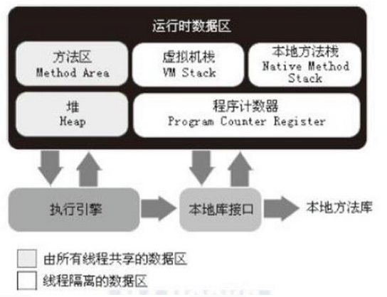
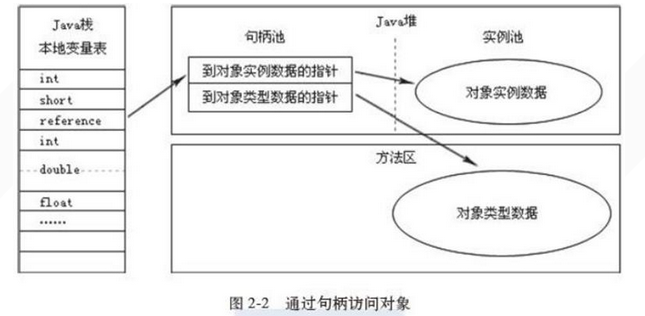
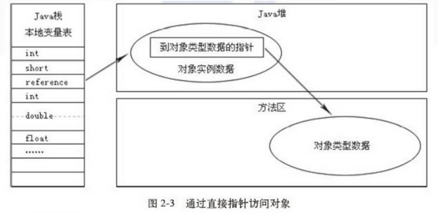
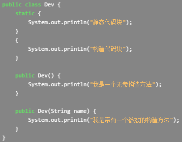
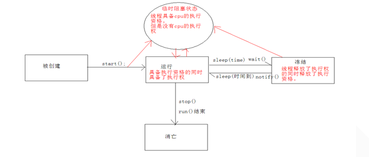
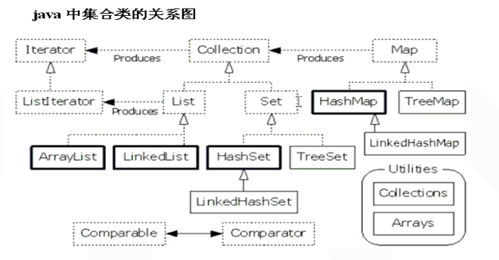
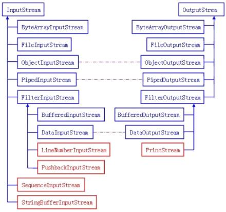
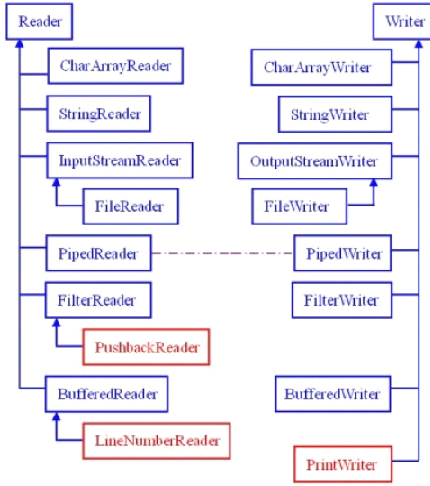

# ```Java`基础总结

### 1，`java`语言有哪些特点？

（1）简单易学、有丰富的类库

（2）面向对象（`Java`最重要的特性，让程序耦合度更低，内聚性更高）

（3）与平台无关性（`JVM`是`Java`跨平台使用的根本）

（4）可靠安全

（5）支持多线程

面向对象和面向过程的区别

**面向过程**：是分析解决问题的步骤，然后用函数把这些步骤一步一步地实现，然后在使用的时候一一调用则可。性能较高，所以单片机、嵌入式开发等一般采用面向过程开发

**面向对象**：是把构成问题的事务分解成各个对象，而建立对象的目的也不是为了完成一个个步骤，而是为了描述某个事物在解决整个问题的过程中所发生的行为。面向对象有**封装、继承、多态**的特性，所以易维护、易复用、易扩展。可以设计出低耦合的系统。但是性能上来说，比面向过程要低。

### 2，八种基本数据类型的大小，以及他们的封装类基本类型 大小（字节） 默认值 封装类

| 基本类型 | 大小（字节） | 默认值   | 封装类    |
| -------- | ------------ | -------- | --------- |
| byte     | 1            | (byte)0  | Byte      |
| short    | 2            | (short)0 | Short     |
| int      | 4            | 0        | Integer   |
| long     | 8            | 0L       | Long      |
| float    | 4            | 0.0f     | Float     |
| double   | 8            | 0.0d     | Double    |
| boolean  | -            | false    | Boolean   |
| char     | 2            | null     | Character |

​	注：

1. `int`**是基本数据类型**，`Integer`是`int`的封装类，**是引用类型**。`int`默认值是0，而`Integer`默认值是`null`，所以`Integer`能区分出`0`和`null`的情况。一旦`java`看到`null`，就知道这个引用还没有指向某个对象，

2. **基本数据类型在声明时系统会自动给它分配空间，而引用类型声明时只是分配了引用空间，必须通过实例化开辟数据空间之后才可以赋值。**数组对象也是一个引用对象，将一个数组赋值给另一个数组时只是复制了一个引用，所以通过某一个数组所做的修改在另一个数组中也看的见。

3. 虽然定义了`boolean`这种数据类型，但是只对它提供了非常有限的支持。在`Java`虚拟机中没有任何供`boolean`值专用的字节码指令，`Java`语言表达式所操作的`boolean`值，在编译之后都使用`Java`虚拟机中的`int`数据类型来代替，而`boolean`数组将会被编码成`Java`虚拟机的`byte`数组，每个元素`boolean`元素占8位。这样我们可以得出`boolean`类型占了单独使用是4个字节，在数组中又是1个字节。使用`int`的原因是，对于当下32位的处理器（`CPU`）来说，一次处理数据是32位（这里不是指的是32/64位系统，而是指`CPU`硬件层面），具有高效存取的特点。

### 3，标识符命名规则

1. 标识符的命名规则。

- **标识符的含义：**

​	是指在程序中，我们自己定义的内容，譬如，类的名字，方法名称以及变量名称等等，都是标识符。

- **命名规则：（硬性要求）**

​	标识符可以包含英文字母，0-9的数字，$以及_

​	标识符不能以数字开头

​	标识符不是关键字

- **命名规范：（非硬性要求）**

​	类名规范：首字符大写，后面每个单词首字母大写（大驼峰式）。

​	变量名规范：首字母小写，后面每个单词首字母大写（小驼峰式）。

​	方法名规范：同变量名。

### 4，运算符

1. 逻辑运算符。

   ~~~ java
   & | ^ ! && ||
   //逻辑运算符除了 ! 外都是用于连接两个boolean类型表达式。
   &&: 只有两边都为true结果是true。否则就是false。
   
   ||:只要两边都为false结果是false，否则就是true
   
   ^:异或：和或有点不一样。
   
   	两边结果一样，就为false。
   
   	两边结果不一样，就为true.
   
   & 和 &&区别： 
   	& ：无论左边结果是什么，右边都参与运算。
   
   	&&:短路与，如果左边为false，那么右边不参数与运算。
   
   | 和|| 区别：
   	|：两边都运算。
   
   	||：短路或，如果左边为true，那么右边不参与运算。
   ~~~

2. 位运算符

   - 首先，在程序中，位运算符的优先级很低！且位运算是只针对整型（是的这里指所有整型）数据的，无论正负，先搞清楚这两点，我们继续说。

   - `Java `中的位运算共有 与(&)、或(|)、非(~)、异或(^)、左移(<<)、右移(>>)、无符号右移(>>>) 这7种，概览见下表：

     | 符号 | 含义       | 详解                                                         |
     | ---- | ---------- | ------------------------------------------------------------ |
     | &    | 位与       | 两个比特位都为 1 时，结果才为 1，否则为 0 （位与操作满足交换律和结合律，甚至分配律） |
     | \|   | 位或       | 两个比特位都为 0 时，结果才为 0，否则为 1 （位或操作满足交换律和结合律，甚至分配律） |
     | ~    | 位非       | 即按位取反，1 变 0，0 变 1                                   |
     | ^    | 异或       | 两个比特位相同时（都为 0 或都为 1）为 0，相异为 1（异或操作满足交换律和结合律，甚至分配律。任何整数和自己异或的结果为 0，任何整数与 0 异或值不变） |
     | <<   | 左移       | 将所有的二进制位按值向←左移动若干位，左移操作与正负数无关，它只是傻傻地将所有位按值向左移动，高位舍弃，低位补 0 |
     | >>   | 右移       | 将所有的二进制位按值向右→移动若干位，低位直接舍弃，跟正负无关，而高位补 0 还是补 1 则跟被操作整数的正负相关，正数补 0 ，负数补 1 |
     | >>>  | 无符号右移 | 将所有的二进制位按值向右→移动若干位，低位直接舍弃，跟正负无关，高位补 0 ，也跟正负无关 |

     - 注意：这七个位运算符，只有取反(~)运算符是单目运算符，其他均为双目运算符！

   - 小试牛刀

     ~~~ java
     //对两个变量的数据进行互换。不需要第三方变量。
     int a = 3,b = 5;-->b = 3,a = 5;
     
             方法一：
     
                 a = a + b; a = 8;
     
                 b = a - b; b = 3;
     
                 a = a - b; a = 5;
     
             方法二：
     
                 a = a ^ b;//
     
                 b = a ^ b;//b = a ^ b ^ b = a
     
                 a = a ^ b;//a = a ^ b ^ a = b;
     
     //练习：高效的算出 2*8 = 2<<3;
     //左移相当于乘法，右移相当于除法。
     ~~~

### 5，**运行时数据区域**

- **运行时数据区域**

Java虚拟机在执行Java程序的过程中会把它所管理的内存划分为若干个不同的数据区域。这些区域都有各自的用途，以及创建和销毁的时间，有的区域随着虚拟机进程的启动而存在，有些区域则是依赖用户线程的启动和结束而建立和销毁。根据《Java虚拟机规范（第2版）》的规定，Java虚拟机所管理的内存将会包括以下几个运行时数据区域，如下图所示：



1. **程序计数器**　

   程序计数器（`Program Counter Register`）是一块较小的内存空间，它的作用可以看做是当前线程所执行的字节码的行号指示器。在虚拟机的概念模型里（仅是概念模型，各种虚拟机可能会通过一些更高效的方式去实现），字节码解释器工作时就是通过改变这个计数器的值来选取下一条需要执行的字节码指令，分支、循环、跳转、异常处理、线程恢复等基础功能都需要依赖这个计数器来完成。 **由于`Java`虚拟机的多线程是通过线程轮流切换并分配处理器执行时间的方式来实现的，在任何一个确定的时刻，一个处理器（对于多核处理器来说是一个内核）只会执行一条线程中的指令。因此，为了线程切换后能恢复到正确的执行位置，每条线程都需要有一个独立的程序计数器，各条线程之间的计数器互不影响，独立存储，我们称这类内存区域为"线程私有"的内存。** 如果线程正在执行的是一个`Java`方法，这个计数器记录的是正在执行的虚拟机字节码指令的地址；如果正在执行的是`Natvie`方法，这个计数器值则为空`（Undefined）`。**此内存区域是唯一一个在**`Java`**虚拟机规范中没有规定任何`OutOfMemoryError`情况的区域。**

2. **`Java`虚拟机栈**

   - 与程序计数器一样，`Java`虚拟机栈（`Java Virtual Machine Stacks`）也是**线程私有**的，它的生命周期与线程相同。虚拟机栈描述的是`Java`方法执行的内存模型：每个方法被执行的时候都会同时创建一个栈帧（`Stack Frame`）**用于存储局部变量表、操作栈、动态链接、方法出口等**信息。**每一个方法被调用直至执行完成的过程，就对应着一个栈帧在虚拟机栈中从入栈到出栈的过程。**

   - 经常有人把`Java`内存区分为堆内存`（Heap）`和栈内存`（Stack）`，这种分法比较粗糙，`Java`内存区域的划分实际上远比这复杂。这种划分方式的流行只能说明大多数程序员最关注的、与对象内存分配关系最密切的内存区域是这两块。其中所指的"堆"在后面会专门讲述，而所指的"栈"就是现在讲的虚拟机栈，或者说是虚拟机栈中的局部变量表部分。

   - 局部变量表存放了编译期可知的各种基本数据类型`（boolean、byte、char、short、int、float、long、double）`、对象引用（`reference`类型），它不等同于对象本身，根据不同的虚拟机实现，它可能是一个指向对象起始地址的引用指针，也可能指向一个代表对象的句柄或者其他与此对象相关的位置）和`returnAddress`类型（指向了一条字节码指令的地址）。

   - **其中64位长度的`long`和`double`类型的数据会占用2**个局部变量空间**（`Slot`），其余的数据类型只占用1个。**局部变量表所需的内存空间在**编译期间**完成分配，当进入一个方法时，这个方法需要在帧中分配多大的局部变量空间是完全确定的，在方法运行期间不会改变局部变量表的大小。 在`Java`虚拟机规范中，对这个区域规定了两种异常状况：如果线程请求的栈深度大于虚拟机所允许的深度，将抛出`StackOverflowError`异常；如果虚拟机栈可以动态扩展（当前大部分的`Java`虚拟机都可动态扩展，只不过`Java`虚拟机规范中也允许固定长度的虚拟机栈），当扩展时无法申请到足够的内存时会抛出`OutOfMemoryError`异常。

3. **本地方法栈**

   - **本地方法栈（`Native Method Stacks`）与虚拟机栈所发挥的作用是非常相似的，其区别不过是虚拟机栈为虚拟机执行`Java`方法（也就是字节码）服务，而本地方法栈则是为虚拟机使用到的`Native`方法服务。**虚拟机规范中对本地方法栈中的方法使用的语言、使用方式与数据结构并没有强制规定，因此具体的虚拟机可以自由实现它。甚至有的虚拟机（譬如`SunHotSpot`虚拟机）直接就把本地方法栈和虚拟机栈合二为一。与虚拟机栈一样，本地方法栈区域也会抛出`StackOverflowError`和`OutOfMemoryError`异常。

4. **Java堆**

   - 对于大多数应用来说，`Java`堆（`Java Heap`）是`Java`虚拟机所管理的内存中最大的一块。`Java`堆是被所有线程共享的一块内存区域，在虚拟机启动时创建。**此内存区域的唯一目的就是存放对象实例**，几乎所有的对象实例都在这里分配内存。这一点在`Java`虚拟机规范中的描述是：所有的对象实例以及数组都要在堆上分配，但是随着`JIT`编译器的发展与逃逸分析技术的逐渐成熟，栈上分配、标量替换优化技术将会导致一些微妙的变化发生，所有的对象都分配在堆上也渐渐变得不是那么"绝对"了。

   - `Java`堆是**垃圾收集器**管理的主要区域，因此很多时候也被称做`"GC`堆"（`Garbage Collected Heap`，幸好国内没翻译成"垃圾堆"）。如果从内存回收的角度看，由于现在收集器基本都是采用的**分代收集算法**，所以`Java`堆中还可以细分为：新生代和老年代；再细致一点的有`Eden`空间、`From Survivor`空间、`To Survivor`空间等。如果**从内存分配的角度看，线程共享的**`Java`堆中可能划分出多个线程私有的分配缓冲区`（Thread  Local Allocation  Buffer，TLAB）`。不过，无论如何划分，都与存放内容无关，无论哪个区域，存储的都仍然是对象实例，进一步划分的目的是为了更好地回收内存，或者更快地分配内存。在本章中，我们仅仅针对内存区域的作用进行讨论，`Java`堆中的上述各个区域的分配和回收等细节将会是下一章的主题。

   - 根据`Java`虚拟机规范的规定，`Java`堆可以处于物理上不连续的内存空间中，只要逻辑上是连续的即可，就像我们的磁盘空间一样。在实现时，既可以实现成固定大小的，也可以是可扩展的，不过当前主流的虚拟机都是按照可扩展来实现的（通过-`Xmx`和-`Xms`控制）。如果在堆中没有内存完成实例分配，并且堆也无法再扩展时，将会抛出`OutOfMemoryError`异常。

5. **方法区**

   - 方法区（`Method Area`）与`Java`堆一样，是各个线程共享的内存区域，它**用于存储已被虚拟机加载的类信息、常量、静态变量、即时编译器编译后的代码等数据**。虽然`Java`虚拟机规范把方法区描述为堆的一个逻辑部分，但是它却有一个别名叫做`Non-Heap`（非堆），目的应该是与`Java`堆区分开来。

   - 对于习惯在`HotSpot`虚拟机上开发和部署程序的开发者来说，很多人愿意把方法区称为"永久代"`Permanent  Generation`），本质上两者并不等价，仅仅是因为`HotSpot`虚拟机的设计团队选择把`GC`分代收集扩展至方法区，或者说使用永久代来实现方法区而已。对于其他虚拟机（如`BEA` ` JRockit`、`IBM`  `J9`等）来说是不存在永久代的概念的。即使是`HotSpot`虚拟机本身，根据官方发布的路线图信息，现在也有放弃永久代并"搬家"至`Native  Memory`来实现方法区的规划了。

   - `Java`虚拟机规范对这个区域的限制非常宽松，除了和`Java`堆一样不需要连续的内存和可以选择固定大小或者可扩展外，还可以选择不实现垃圾收集。相对而言，垃圾收集行为在这个区域是比较少出现的，但并非数据进入了方法区就如永久代的名字一样"永久"存在了。这个区域的内存回收目标主要是针对常量池的回收和对类型的卸载，一般来说这个区域的回收"成绩"比较难以令人满意，尤其是类型的卸载，条件相当苛刻，但是这部分区域的回收确实是有必要的。在`Sun`公司的`BUG`列表中,曾出现过的若干个严重的`BUG`就是由于低版本的`HotSpot`虚拟机对此区域未完全回收而导致内存泄漏。根据`Java`虚拟机规范的规定，当方法区无法满足内存分配需求时，将抛出`OutOfMemoryError`异常。

6. **运行时常量池**

   - **运行时常量池（**`Runtime Constant Pool`）是**方法区**的一部分**。`Class`文件中除了有类的版本、字段、方法、接口等描述等信息外，还有一项信息是常量池（`Constant Pool Table`），**用于存放编译期生成的各种字面量和符号引用，这部分内容将在类加载后存放到方法区的运行时常量池中。` Java`虚拟机对`Class`文件的每一部分（自然也包括常量池）的格式都有严格的规定，每一个字节用于存储哪种数据都必须符合规范上的要求，这样才会被虚拟机认可、装载和执行。但对于运行时常量池，`Java`虚拟机规范没有做任何细节的要求，不同的提供商实现的虚拟机可以按照自己的需要来实现这个内存区域。不过，一般来说，除了保存`Class`文件中描述的符号引用外，还会把翻译出来的直接引用也存储在运行时常量池中。运行时常量池相对于`Class`文件常量池的另外一个重要特征是具备动态性，`Java`语言并不要求常量一定只能在编译期产生，也就是并非预置入`Class`文件中常量池的内容才能进入方法区运行时常量池，运行期间也可能将新的常量放入池中，这种特性被开发人员利用得比较多的便是`String`类的`intern()`方法。既然运行时常量池是方法区的一部分，自然会受到方法区内存的限制，当常量池无法再申请到内存时会抛出`OutOfMemoryError`异常。

7. **对象访问**

   - 介绍完`Java`虚拟机的运行时数据区之后，我们就可以来探讨一个问题：在`Java`语言中，对象访问是如何进行的？对象访问在`Java`语言中无处不在，是最普通的程序行为，但即使是最简单的访问，也会却涉及`Java`栈、`Java`堆、方法区这三个最重要内存区域之间的关联关系，如下面的这句代码：

     ~~~ java
     　Object obj = new Object();
     ~~~

   - 假设这句代码出现在方法体中，那"`Object obj`"这部分的语义将会反映到`Java`栈的本地变量表中，作为一个`reference`类型数据出现。而"`new Object()`"这部分的语义将会反映到`Java`堆中，形成一块存储了`Object`类型所有实例数据值（`Instance Data`，对象中各个实例字段的数据）的结构化内存，根据具体类型以及虚拟机实现的对象内存布局（`Object Memory Layout`）的不同，这块内存的长度是不固定的。另外，在`Java`堆中还必须包含能查找到此对象类型数据（如对象类型、父类、实现的接口、方法等）的地址信息，这些类型数据则存储在方法区中。

   - **由于**`reference`类型在`Java`虚拟机规范里面只规定了一个指向对象的引用，并没有定义这个引用应该通过哪种方式去定位，以及访问到`Java`堆中的对象的具体位置，因此不同虚拟机实现的对象访问方式会有所不同，主流的访问方式有两种：使用句柄和直接指针。***如果使用句柄访问方式，`Java`堆中将会划分出一块内存来作为句柄池，`reference`***中存储的就是对象的句柄地址，而句柄中包含了对象实例数据和类型数据各自的具体地址信息，如下图所示：

     

     **如果使用的是直接指针访问方式，**`Java` **堆对象的布局中就必须考虑如何放置访问类型数据的相关信息，`reference`中直接存储的就是对象地址，如下图所示：

     

   - **这两种对象的访问方式各有优势，使用句柄访问方式的最大好处就是**`reference`中存储的是稳定的句柄地址，在对象被移动（垃圾收集时移动对象是非常普遍的行为）时只会改变句柄中的实例数据指针，而`reference`本身不需要被修改。使用直接指针访问方式的最大好处就是速度更快，它节省了一次指针定位的时间开销，由于对象的访问在`Java`中非常频繁，因此这类开销积少成多后也是一项非常可观的执行成本。就本书讨论的主要虚拟机`Sun HotSpot`而言，它是使用第二种方式进行对象访问的，但从整个软件开发的范围来看，各种语言和框架使用句柄来访问的情况也十分常见。

### 6，面向对象

#### 6.1，类

1. **匿名对象使用场景**：

   1**：**当对方法只进行一次调用的时候，可以使用匿名对象。

   2**：**当对象对成员进行多次调用时，不能使用匿名对象。必须给对象起名字。

2. 类中怎么没有定义主函数呢？

   **注意：主函数的存在，仅为该类是否需要独立运行，如果不需要，主函数是不用定义的。**

   **主函数的解释：**保证所在类的独立运行，是程序的入口，被`jvm`调用。

3. **成员变量和局部变量的区别：**

   1. **成员变量直接定义在类中。**局部变量定义在方法中，参数上，语句中。

   2. **成员变量在这个类中有效。**局部变量只在自己所属的大括号内有效，大括号结束，局部变量失去作用域。

   3. **成员变量存在于堆内存中，随着对象的产生而存在，消失而消失。**局部变量存在于栈内存中，随着所属区域的运行而存在，结束而释放。

4. **构造函数**：用于给对象进行初始化，是给与之对应的对象进行初始化，它具有针对性，函数中的一种。

   - **特点**：
     - 该函数的名称和所在类的名称相同。
     - 不需要定义返回值类型。
     - 该函数没有具体的返回值。

   **记住：所有对象创建时，都需要初始化才可以使用。**

   **注意事项：**一个类在定义时，如果没有定义过构造函数，那么该类中会自动生成一个空参数的构造函数，为了方便该类创建对象，完成初始化。如果在类中自定义了构造函数，那么默认的构造函数就没有了。

   一个类中，可以有多个构造函数，因为它们的函数名称都相同，所以只能通过参数列表来区分。所以，**一个类中如果出现多个构造函数。它们的存在是以重载体现的。**

5. **构造代码块和构造函数有什么区别？**

   - 构造代码块：是给所有的对象进行初始化，也就是说，所有的对象都会调用一个代码块。只要对象一建立。就会调用这个代码块。

   - 构造函数：是给与之对应的对象进行初始化。它具有针对性。

     

   - 执行顺序：（优先级从高到低。）静态代码块>`mian`方法>构造代码块>构造方法。其中静态代码块只执行一次。构造代码块在每次创建对象是都会执行。

   - 静态代码块的作用：比如我们在调用`C`语言的动态库时会可把`.so`文件放在此处。 

   - 构造代码块的功能：（可以把不同构造方法中相同的共性的东西写在它里面）。例如：比如不论任何机型的电脑都有开机这个功能，此时我们就可以把这个功能定义在构造代码块内。

6. **创建一个对象都在内存中做了什么事情？**

   ~~~ java
   Person p = new Person();
   ~~~

   1**：**先将硬盘上指定位置的`Person.class`文件加载进内存。

   2**：**执行`main`方法时，在栈内存中开辟了`main`方法的空间(压栈-进栈)，然后在`main`方法的栈区分配了一个变量`p`。

   3**：**在堆内存中开辟一个实体空间，分配了一个内存首地址值。

   4**：**在该实体空间中进行属性的空间分配，并进行了**默认初始化。**

   5**：**对空间中的属性进行**显示初始化。**

   6**：**进行实体的**构造代码块初始化。**

   7**：**调用该实体对应的**构造函数，**进行构造函数初始化。

   8**：**将首地址赋值给`p` ，`p`变量就引用了该实体。(指向了该对象)

7. `this`对象说明

   - **this:代表对象。就是所在函数所属对象的引用。**

   - this到底代表什么呢？

     - **哪个对象调用了this所在的函数，this就代表哪个对象，就是哪个对象的引用。**

   - 开发时，什么时候使用this呢？

     -  在定义功能时，如果该功能内部使用到了调用该功能的对象，这时就用this来表示这个对象。

   - this 还可以用于构造函数间的调用。

     - **调用格式：this(实际参数)；**
     - this对象后面跟上 **.** 调用的是成员属性和成员方法(一般方法)；
     - this对象后面跟上 () 调用的是本类中的对应参数的构造函数。

     **注意：用this调用构造函数，必须定义在构造函数的第一行。因为构造函数是用于初始化的，所以初始化动作一定要执行。否则编译失败。**

8. `static`关键字，**是一个修饰符，用于修饰成员(成员变量和成员函数)。**

   1. static变量

      按照是否静态的对类成员变量进行分类可分两种：一种是被`static`修饰的变量，叫静态变量或类变量；另一种是没有被`static`修饰的变量，叫实例变量。两者的区别是：

      - 对于静态变量在内存中只有一个拷贝（节省内存），`JVM`只为静态分配一次内存，在加载类的过程中完成静态变量的内存分配，可用类名直接访问（方便），当然也可以通过对象来访问（但是这是不推荐的）。

      - 对于实例变量，没创建一个实例，就会为实例变量分配一次内存，实例变量可以在内存中有多个拷贝，互不影响（灵活）。

   2. 静态方法

      - 静态方法可以直接通过**类名**调用，任何的实例也都可以调用，因此静态方法中不能用`this`和`super`关键字，**不能直接访问所属类的实例变量和实例方法(就是不带`static`的成员变量和成员成员方法)，只能访问所属类的静态成员变量和成员方法。**因为实例成员与特定的对象关联！这个需要去理解，想明白其中的道理，不是记忆！！！

      - 因为`static`方法独立于任何实例，因此`static`方法必须被实现，而不能是抽象的`abstract`。

   3. `static`代码块

      `static`代码块也叫静态代码块，是在类中独立于类成员的`static`语句块，可以有多个，位置可以随便放，它不在任何的方法体内，`JVM`加载类时会执行这些静态的代码块，如果`static`代码块有多个，`JVM`将按照它们在类中出现的先后顺序依次执行它们，每个代码块只会被执行一次。

   4. `static`和`final`一块用表示什么

      `static final`用来修饰**成员变量和成员方法**，**可简单理解为"全局常量"！**

      *对于变量，表示一旦给值就不可修改，并且通过类名可以访问*。

      *对于方法，表示不可覆盖，并且可以通过类名直接访问。*

   5. 说明：

      1. 有些数据是对象特有的数据，是不可以被静态修饰的。因为那样的话，特有数据会变成对象的共享数据。这样对事物的描述就出了问题。所以，在定义静态时，必须要明确，这个数据是否是被对象所共享的。

      2. **静态方法只能访问静态成员，不可以访问非静态成员。**

         这句话是针对同一个类环境下的，比如说，一个类有多个成员（属性，方法，字段），静态方法`A`，那么可以访问同类名下其他静态成员，你如果访问非静态成员就不行,因为静态方法加载时，优先于对象存在，所以没有办法访问对象中的成员。

      3. **静态方法中不能使用`this`，`super`关键字。**

         因为**`this`代表对象**，而静态在时，有可能没有对象，所以`this`无法使用。

      4. 主函数是静态的。

      5. **成员变量和静态变量的区别：**

         1. 成员变量所属于对象。所以也称为实例变量，静态变量所属于类。所以也称为类变量。
         2. 成员变量存在于堆内存中。静态变量存在于方法区中。
         3. 成员变量随着对象创建而存在。随着对象被回收而消失。静态变量随着类的加载而存在。随着类的消失而消失。
         4. 成员变量只能被对象所调用 。静态变量可以被对象调用，也可以被类名调用。
         5. **所以，成员变量可以称为对象的特有数据，静态变量称为对象的共享数据。**

      6. **静态代码块：**就是一个有静态关键字标示的一个代码块区域。定义在类中。

         **作用：可以完成类的初始化。静态代码块随着类的加载而执行，而且只执行一次（`new `多个对象就只执行一次）。如果和主函数在同一类中，优先于主函数执行。**

9. **`final`**关键字

   - 根据程序上下文环境，`Java`关键字`final`有"这是无法改变的"或者"终态的"含义，**它可以修饰非抽象类、非抽象类成员方法和变量。你可能出于两种理解而需要阻止改变、设计或效率。**
     - **`final`类不能被继承，没有子类，`final`类中的方法默认是`final`的。**

     - `final`方法不能被子类的方法覆盖，但可以被继承。

     - `final`成员变量表示常量，只能被赋值一次，赋值后值不再改变。

     - `final`不能用于修饰构造方法。

       注意：父类的`private`成员方法是不能被子类方法覆盖的，因此`private`类型的方法默认是`final`类型的。

   1. `final`类

      `final`类不能被继承，因此`final`类的成员方法没有机会被覆盖，默认都是`final`的。在设计类时候，如果这个类不需要有子类，类的实现细节不允许改变，并且确信这个类不会载被扩展，那么就设计为`final`类。

   2. `final`方法

      - 如果一个类不允许其子类覆盖某个方法，则可以把这个方法声明为`final`方法。

      - 使用`final`方法的原因有二：
        - 第一、把方法锁定，防止任何继承类修改它的意义和实现。
        - 第二、高效。编译器在遇到调用`final`方法时候会转入内嵌机制，大大提高执行效率。

   3. `final`变量（常量）

      - 用`final`修饰的成员变量表示常量，值一旦给定就无法改变！

      - `final`修饰的变量有三种：**静态变量、实例变量和局部变量，分别表示三种类型的常量。**

      - 一旦给`final`变量初值后，值就不能再改变了。

      - 另外，`final`变量定义的时候，可以先声明，而不给初值，这种变量也称为`final`空白，无论什么情况，编译器都确保空白`final`在使用之前必须被初始化。但是，`final`空白在`final`关键字`final`的使用上提供了更大的灵活性，为此，一个类中的`final`数据成员就可以实现依对象而有所不同，却有保持其恒定不变的特征。

        - `final`参数

          当函数参数为`final`类型时，你可以读取使用该参数，但是无法改变该参数的值。

          ~~~ java
              public void test(final int a){
                  //不能对final修饰的形参进行赋值操作
                  //a=5;
              }
          ~~~

        - `final`成员变量

          `final`指定的成员变量必须由程序员显式的进行指定初始值。必须在非静态初始化块，声明该实例变量或者构造器中指定初始化，必须是其中的一个

        - `final`修饰类变量（即`stataic`变量）

          必须再静态初始化中指定初始值或声明该类变量的时候指定初始值，而且必须是其中的一种。、

          ~~~ java
          package rzf.qq.com.java;
          
          public class ConstructDemo01 {
              public static void main(String[] args) {
                  People people = new People();
                  System.out.println(people.a);
                  System.out.println(people.c);
                  System.out.println(people.ch);
                  System.out.println(people.str);
                  System.out.println(people.d);
          
          
              }
          }
          class People{
              final int a=6;
              final String str;
              final int c;
              final static double d;
              final char ch;
              //普通变量初始化块,对str进行初始化
              //有如果在初始化之前访问由final修饰的变量，显然这是不可能的，但是Java提供方法对他可以进行访问
              {
                 // System.out.println(str);报错Variable 'str' might not have been initialized
                  str="hello";
                  //下面语句运行会发生错误，final修饰变量不可以改变
                  //a=9;
                  //初始化str之后可以显示访问
                  System.out.println(str);
              }
              //静态变量初始化块，初始化静态变量
              static {
                  d=5.6;
              }
              //在构造器中初始化变量c和ch
              public People(){
                 c=10;
                 ch='a';
              }
              public void modify(){
                  //在方法中对final变量进行修改
                 // a=20;报错，Cannot assign a value to final variable 'a'
              }
          
          }
          
          ~~~

        - `final`修饰基本类型变量和引用类型变量的区别

          - `final`修饰基本类型变量时，如果该变量已经进行了初始化，则该变量的值不能再改变

          - `final`修饰引用类型变量的时候，引用指向的时某个对象的地址，所以该地址不能改变，但是对象可以发生变化（他一直在那，但是他变了，哈哈）

            ~~~ java
            import java.lang.reflect.Array;
            import java.util.Arrays;
             
            public class Person {
                private int age;
                //构造一个无参的构造器
                public Person(){};
                //重载构造器
                public Person(int age){
                    this.age=age;
                }
                public void setAge(int age){
                    this.age=age;
                }
                public int getAge(){
                    return age;
                }
             
                public static void main(String[] args) {
                    //设置一个final修饰的数组
                    final int[] iArr={5,6,12,9};
                    //输出这个数组
                    System.out.println(Arrays.toString(iArr));
                    //对数组进行排序
                    Arrays.sort(iArr);
                    //排序后输出
                    System.out.println(Arrays.toString(iArr));
                    //改变数组中的只的置的值，这个可以做到，原因是final修饰不能改变的是他的地址，但是它引用的对象则可以进行改变
                    iArr[2]=-8;
                    System.out.println(Arrays.toString(iArr));
                    //下面这句话就会出现运行错误，因为地址发生了变动
                    //iArr=null;
                    //下面的原因与上面类似
                    final Person p=new Person(45);
                    p.setAge(23);
                    System.out.println(p.getAge());
                    //p=null;
                    //进行宏替换的final变量
                    final int a=5;
                    //这里再运行过程中直接将a转化成5，这就是“宏变量”，必须再定义是才有效果
                    System.out.println(a);
                }
            }
            ~~~

      - “宏替换”的`final`

        - 如果一个`final`满足这三个条件，那么他就相当于一个直接量

          1. 使用`final`进行修饰
          2. 在定义`final`变量的时候进行了初始化。
          3. 该初始值在编译的时候就可以确定下来。

        - 是不是看出来一个很重要的点，那就是在定义时就进行初始化。

          ~~~ java
          //进行宏替换的final变量
                  final int a=5;
                  //这里再运行过程中直接将a转化成5，这就是“宏变量”，必须再定义是才有效果
                  System.out.println(a);
          //系统在接下来的就直接在能用到a的地方进行替换
          ~~~

      - `final`方法

        - `final`修饰的方法不能被重写，如果父类的方法不想被子类所重写，可以使用final进行修饰

          ~~~ java
          //则下面的代码运行会发生错误
          public class FinalMethod(){
                  public void test(){}
              }
               
              class sub extends FinalMethod(){
                  public void test(){}
              }
          //错误原因：因为重写了父类的final方法引发错误
          ~~~

        - 重点来了，对于一个`private`修饰的方法，因为本身就不能被子类访问，所以子类无法进行重写，在加上`final`之后，如果子类“重写”这个方法的时候相当于重新定义一个方法，跟父类没有关系。

#### 6.2，继 承（面向对象特征之一）

- `java`中对于继承，`java`只支持单继承。`java`虽然不直接支持多继承，但是可实现多接口。

1. **成员变量**

   - 当子父类中出现一样的属性时，子类类型的对象，调用该属性，值是子类的属性值。

   -  如果想要调用父类中的属性值，需要使用一个关键字：**`super`**

   - **`This`：**代表是本类类型的对象引用。

   - **`Super`：代表是子类所属的父类中的内存空间引用。**

     注意：子父类中通常是不会出现同名成员变量的，因为父类中只要定义了，子类就不用在定义了，直接继承过来用就可以了。

2. **成员函数。**

   当子父类中出现了一模一样的方法时，建立子类对象会运行子类中的方法。好像父类中的方法被覆盖掉一样。所以这种情况，是函数的另一个特性：**重写**

3. **构造函数。**

   - 发现子类构造函数运行时，先运行了父类的构造函数。为什么呢?

     原因：子类的**所有构造函数中的第一行**，其实都有一条隐身的语句super();

   - **`super()`:** 表示父类的构造函数，并会调用于参数相对应的父类中的构造函数。而`super()`:是在调用父类中空参数的构造函数。

   - 为什么子类对象初始化时，都需要调用父类中的函数？为什么要在子类构造函数的第一行加入这个`super()`?

     因为子类继承父类，会继承到父类中的数据，所以必须要看父类是如何对自己的数据进行初始化的。所以子类在进行对象初始化时，先调用父类的构造函数，这就是**子类的实例化过程**。

   - **注意：**

     - **子类中所有的构造函数都会默认访问父类中的空参数的构造函数，因为每一个子类构造内第一行都有默认的语句`super()`;**

     - **如果父类中没有空参数的构造函数，那么子类的构造函数内，必须通过super语句指定要访问的父类中的构造函数。**

     - **如果子类构造函数中用`this`来指定调用子类自己的构造函数，那么被调用的构造函数也一样会访问父类中的构造函数。**

     - **`super()`和`this()`是否可以同时出现的构造函数中？**

       两个语句只能有一个定义在第一行，所以只能出现其中一个。

     - `super()`或者`this()`:为什么一定要定义在第一行？

       因为`super()`或者`this()`都是调用构造函数，构造函数用于初始化，所以初始化的动作要先完成。

   - **在方法覆盖时，注意两点：**

     1：子类覆盖父类时，必须要保证，子类方法的权限必须大于等于父类方法权限可以实现继承。否则，编译失败。（举个例子，在父类中是`public`的方法，如果子类中将其降低访问权限为`private`，那么子类中重写以后的方法对于外部对象就不可访问了，这个就破坏了继承的含义）

     2：覆盖时，要么都静态，要么都不静态。 (静态只能覆盖静态，或者被静态覆盖)

   - 继承的一个弊端：打破了封装性。对于一些类，或者类中功能，是需要被继承，或者复写的。

     这时如何解决问题呢？介绍一个关键字，**`final`**。

     **`final`特点：（详细解释见前面）**

     **1：这个关键字是一个修饰符，可以修饰类，方法，变量。**

     **2：被`final`修饰的类是一个最终类，不可以被继承。**

     **3：被`final`修饰的方法是一个最终方法，不可以被覆盖。**

     **4：被`final`修饰的变量是一个常量，只能赋值一次。**

#### 6.3，**抽象类: `abstract`**

- **抽象类的特点：**
  - **抽象方法只能定义在抽象类中，抽象类和抽象方法必须由`abstract`关键字修饰（可以描述类和方法，不可以描述变量）。**
  - **抽象方法只定义方法声明，并不定义方法实现。**
  - **抽象类不可以被创建对象(实例化)。**
  - **只有通过子类继承抽象类并覆盖了抽象类中的所有抽象方法后，该子类才可以实例化。否则，该子类还是一个抽象类。**

- **抽象类的细节：**

  **1：抽象类中是否有构造函数？有，用于给子类对象进行初始化。**

  **2：抽象类中是否可以定义非抽象方法？**

  - 可以。其实，抽象类和一般类没有太大的区别，都是在描述事物，只不过抽象类在描述事物时，有些功能不具体。所以抽象类和一般类在定义上，都是需要定义属性和行为的。只不过，比一般类多了一个抽象函数。而且比一般类少了一个创建对象的部分。

  **3：抽象关键字`abstract`和哪些不可以共存？`final `,   ` private` ,` static`**

  **4：抽象类中可不可以不定义抽象方法？**

  - **可以。抽象方法目的仅仅为了不让该类创建对象。**

#### 6.4，接 口

1. 是用关键字**`interface`**定义的。

2. 接口中包含的成员，最常见的有全局常量、抽象方法。

   注意：接口中的成员都有固定的修饰符。

   ~~~ java
   成员变量：public static final
   
   成员方法：public abstract
   interface Inter{
   
       public static final int x = 3;
   
       public abstract void show();
   
   }
   ~~~

3. 接口中有抽象方法，说明**接口不可以实例化**。**接口的子类必须实现了接口中所有的抽象方法后，该子类才可以实例化。否则，该子类还是一个抽象类。**

4. 类与类之间存在着继承关系，类与接口中间存在的是**实现**关系。

   ​    **继承用`extends `；实现用`implements` ；**

5. 接口和类不一样的地方，就是，**接口可以被多实现**，这就是多继承改良后的结果。`java`将多继承机制通过多现实来体现。

6. 一个类在继承另一个类的同时，还可以实现多个接口。所以**接口的出现避免了单继承的局限性**。还可以将类进行功能的扩展。

7. 其实`java`中是有多继承的。接口与接口之间存在着继承关系，**接口可以多继承接口**。

   ~~~ java
   java类是单继承的。classB Extends classA
   
   java接口可以多继承。Interface3 Extends Interface0, Interface1, interface……
   //不允许类多重继承的主要原因是，如果A同时继承B和C，而b和c同时有一个D方法，A如何决定该继承那一个呢？
   
   //但接口不存在这样的问题，接口全都是抽象方法继承谁都无所谓，所以接口可以继承多个接口。
   ~~~

8. 抽象与接口的区别

   **抽象类：**一般用于描述一个体系单元，将一组共性内容进行抽取，特点：可以在类中定义抽象内容让子类实现，可以定义非抽象内容让子类直接使用。它里面定义的都是一些体系中的**基本内容**。

   **接口：**一般用于定义对象的**扩展功能**，是在继承之外还需这个对象具备的一些功能。

   **抽象类和接口的共性：**都是不断向上抽取的结果。

   - **抽象类和接口的区别：**
     - **抽象类只能被继承，而且只能单继承。**接口需要被实现，而且可以多实现。
     - **抽象类中可以定义非抽象方法，子类可以直接继承使用。**接口中都是抽象方法，需要子类去实现。
     - **抽象类使用的是`is a` 关系。**接口使用的` like a `关系。
     - **抽象类的成员修饰符可以自定义。**接口中的成员修饰符是固定的。全都是`public`的。

     #### 6.5，多 态

- 函数本身就具备多态性，某一种事物有不同的具体的体现。

- **体现：父类引用或者接口的引用指向了自己的子类对象。**`Animal a = new Cat()`;父类可以调用子类中覆写过的（父类中有的方法）

- **多态的好处：提高了程序的扩展性。继承的父类或接口一般是类库中的东西，（如果要修改某个方法的具体实现方式）只有通过子类去覆写要改变的某一个方法，这样在通过将父类的应用指向子类的实例去调用覆写过的方法就行了！**

- **多态的弊端：当父类引用指向子类对象时，虽然提高了扩展性，但是只能访问父类中具备的方法，不可以访问子类中特有的方法。(**前期不能使用后期产生的功能，即访问的局限性**)**

- **多态的前提：**

  ​    **1：必须要有关系，比如继承、或者实现。**

  ​    **2：通常会有覆盖操作。**

- **如果想用子类对象的特有方法，如何判断对象是哪个具体的子类类型呢？**

  可以可以通过一个关键字 **`instanceof` ;//判断对象是否实现了指定的接口或继承了指定的类**

  ~~~ java
  格式：<对象 instanceof 类型> ，判断一个对象是否所属于指定的类型。
  
  Student instanceof Person = true;//student继承了person类
  ~~~

- **`Object`：**所有类的直接或者间接父类，`Java`认为所有的对象都具备一些基本的共性内容，这些内容可以不断的向上抽取，最终就抽取到了一个最顶层的类中的，该类中定义的就是所有对象都具备的功能。在`java.lang;`包中。

  - **具体方法：**

    ~~~java
    boolean equals(Object obj)：//用于比较两个对象是否相等，其实内部比较的就是两个对象地址。
     public boolean equals(Object obj) {
            return (this == obj);
        }
    String toString()：//将对象变成字符串；默认返回的格式：类名@哈希值 = getClass().getName() + '@' + Integer.toHexString(hashCode())
    //为了对象对应的字符串内容有意义，可以通过复写，建立该类对象自己特有的字符串表现形式。
    Class getClass()：//获取任意对象运行时的所属字节码文件对象。
    int hashCode()：//返回该对象的哈希码值。支持此方法是为了提高哈希表的性能。将该对象的内部地址转换成一个整数来实现的。
    //通常equals，toString，hashCode，在应用中都会被复写，建立具体对象的特有的内容。
    
    ~~~

####  6.6，内部类

- 如果`A`类需要直接访问`B`类中的成员，而`B`类又需要建立`A`类的对象。这时,为了方便设计和访问，直接将`A`类定义在`B`类中。就可以了。`A`类就称为**内部类**。内部类可以直接访问外部类中的私有成员。而外部类想要访问内部类，必须要建立内部类的对象。   

  ~~~ java
  package rzf.qq.com.java;
  
  public class InnerClass {
      public static void main(String[] args) {
          Outer outer = new Outer();
          outer.method();
          Outer.Inner inner = new Outer().new Inner();
          inner.show();
      }
  }
  class Outer{
  
      int num = 4;
  
      class Inner {
  
          void show(){
              //内部类直接访问外部类成员，用自己的实例对象；
              System.out.println("inner show run "+num);
  
          }
  
      }
  
      public void method(){
  
          Inner in = new Inner();//创建内部类的对象。
  
          in.show();//调用内部类的方法。
  
      }                                        //外部类访问内部类要定义内部类的对象；
  
  }
  ~~~

- **当内部类定义在外部类中的成员位置上，可以使用一些成员修饰符修饰 `private`、`static`。**

  1. 默认修饰符。

     **直接访问内部类格式：外部类名.内部类名 变量名 = 外部类对象.内部类对象;**

     ~~~ java
     Outer.Inner in = new Outer.new Inner();//这种形式很少用。
     ~~~

     但是这种应用不多见，因为内部类之所以定义在内部就是为了封装。**想要获取内部类对象通常都通过外部类的方法来获取。这样可以对内部类对象进行控制。**

  2. 私有修饰符。

     通常内部类被封装，都会被私有化，因为封装性不让其他程序直接访问。

  3. 静态修饰符。

     **如果内部类被静态修饰，相当于外部类**，会出现访问局限性，只能访问外部类中的静态成员。

      注意；**如果内部类中定义了静态成员，那么该内部类必须是静态的。**

     **内部类编译后的文件名为："外部类名$内部类名.`java`"；**

  4. **为什么内部类可以直接访问外部类中的成员呢？**

     那是因为内部中都持有一个外部类的引用。这个是引用是 **外部类名`.this`**

     内部类可以定义在外部类中的成员位置上，也可以定义在外部类中的局部位置上。

     **当内部类被定义在局部位置上，只能访问局部中被`final`修饰的局部变量。**

  5. **匿名内部类（对象）：**没有名字的内部类。就是内部类的简化形式。一般只用一次就可以用这种形式。匿名内部类其实就是一个**匿名子类对象**。**想要定义匿名内部类：需要前提，内部类必须继承一个类或者实现接口。**

     **匿名内部类的格式：**`new `父类名&接口名(){ 定义子类成员或者覆盖父类方法 }.方法。

     **匿名内部类的使用场景：**

     当函数的参数是接口类型引用时，如果接口中的方法不超过3个。可以通过匿名内部类来完成参数的传递。

     其实就是在创建匿名内部类时，该类中的封装的方法不要过多，最好两个或者两个以内。

     ~~~ java
     //面试
     
             //1
     
             new Object(){
     
                 void show(){
     
                     System.out.println("show run");                
     
                 }
     
             }.show();                                    //写法和编译都没问题
     
             //2
     
             Object obj = new Object(){
     
                 void show(){
     
                     System.out.println("show run");
     
                 }
     
             };
     
             obj.show();                                //写法正确，编译会报错
     
             
     
             1和2的写法正确吗？有区别吗？说出原因。
     
             写法是正确，1和2都是在通过匿名内部类建立一个Object类的子类对象。
     
             区别：
     
             第一个可是编译通过，并运行。
     
             第二个编译失败，因为匿名内部类是一个子类对象，当用Object的obj引用指向时，就被提升为了Object类型，而编译时会检查Object类中是否有show方法，此时编译失败。
     ~~~

#### 6.7，异 常：

`--java.lang.Throwable：`

1. **`Throwable`：**可抛出的。

   ​    **`Error`：**错误，一般情况下，不编写针对性的代码进行处理，通常是`jvm`发生的，需要对程序进行修正。

   ​    **`Exception`：**异常，可以有针对性的处理方式

2. **这个体系中的所有类和对象都具备一个独有的特点；就是可抛性。**

   **可抛性的体现：**就是这个体系中的类和对象都可以被`throws`和`throw`两个关键字所操作。

3. **`throw`与`throws`区别：**

   `throws`是用来声明一个方法可能抛出的所有异常信息，而`throw`则是指抛出的一个具体的异常类型。此外`throws`是将异常声明但是不处理，而是将异常往上传，谁调用我就交给谁处理。

   `throw`用于抛出异常对象，后面跟的是异常对象；`throw`用在函数**内**。

   `throws`用于抛出异常类，后面跟的异常类名，可以跟多个，用逗号隔开。`throws`用在函数**上**。

   `throws`格式：方法名（参数）`throws` 异常类1，异常类2，.....

   `throw`：就是自己进行异常处理，处理的时候有两种方式，要么自己捕获异常（也就是`try catch`进行捕捉），要么声明抛出一个异常（就是`throws `异常~~）。

4. **处理方式有两种：1、捕捉；2、抛出。**

   1. 对于捕捉：`java`有针对性的语句块进行处理。

      ~~~ java
      try {
      
          需要被检测的代码；
      
      }
      
      catch(异常类 变量名){
      
          异常处理代码；
      
      }
      
      fianlly{
      
          一定会执行的代码；
      
      }
      ~~~

5. **定义异常处理时，什么时候定义`try`，什么时候定义`throws`呢？**

   - **功能内部如果出现异常，如果内部可以处理，就用`try`；**

   - **如果功能内部处理不了，就必须声明出来，让调用者处理。使用`throws`抛出，交给调用者处理。谁调用了这个功能谁就是调用者；**

6. **自定义异常的步骤：**

   1：定义一个子类继承`Exception`或`RuntimeException`，让该类具备可抛性(既可以使用`throw`和`throws`去调用此类)。

   2：通过`throw` 或者`throws`进行操作。

   **异常的转换思想：**当出现的异常是调用者处理不了的，就需要将此异常转换为一个调用者可以处理的异常抛出。

7. **`try catch finally`的几种结合方式：**

   ~~~java
   try catch 
   try catch finally//这种情况，如果出现异常，并不处理，但是资源一定关闭，所以try finally集合只为关闭资源。
   ~~~

   - 说明：

     `finally`很有用，主要用户关闭资源。无论是否发生异常，资源都必须进行关闭。

     **`System.exit(0);`** //退出`jvm`，只有这种情况`finally`不执行。

     **如果父类或者接口中的方法没有抛出过异常，那么子类是不可以抛出异常的，如果子类的覆盖的方法中出现了异常，只能`try`不能`throws`。**

     **如果这个异常子类无法处理，已经影响了子类方法的具体运算，这时可以在子类方法中，通过`throw`抛出`RuntimeException`异常或者其子类，这样，子类的方法上是不需要`throws`声明的。**

#### 6.8，多线程

1. 返回当前线程的名称：**`Thread.currentThread().getName()`**

2. 线程的名称是由：`Thread-`编号定义的。编号从0开始。

3. 线程要运行的代码都统一存放在了**`run`方法**中。

4. 线程要运行必须要通过类中指定的方法开启。**`start`方法**。（启动后，就多了一条执行路径）

   **`start`方法：**1）、启动了线程；2）、让`jvm`调用了`run`方法。

5. **`Thread`类中`run()`和`start()`方法的区别：**

   `start()`：用`start`方法来启动线程，真正实现了多线程运行，这时无需等待`run`方法体代码执行完毕而直接继续执行下面的代码。通过调用`Thread`类的`start()`方法来启动一个线程，这时此线程处于就绪（可运行）状态，并没有运行，一旦得到`cpu`时间片，就开始执行`run()`方法，这里方法`run()`称为线程体，它包含了要执行的这个线程的内容，`Run`方法运行结束，此线程随即终止。

   `run()`：`run()`方法只是类的一个普通方法而已，如果直接调用`Run`方法，程序中依然只有主线程这一个线程，其程序执行路径还是只有一条，还是要顺序执行，还是要等待`run`方法体执行完毕后才可继续执行下面的代码，这样就没有达到写线程的目的。

   总结：`start()`方法最本质的功能是从`CPU`中申请另一个线程空间来执行 ` run()`方法中的代码,它和当前的线程是两条线,在相对独立的线程空间运行,也就是说,如果你直接调用线程对象的`run()`方法,当然也会执行,但那是   在当前线程中执行,`run()`方法执行完成后继续执行下面的代码.而调用`start()`方法后,`run()`方法的代码会和当前线程并发(单`CPU`)或并行  (多`CPU`)执行。所以请记住一句话：调用线程对象的`run`方法不会产生一个新的线程，虽然可以达到相同的执行结果,但执行过程和执行效率不同

6. **创建线程的第一种方式：继承`Thread` ，由子类复写`run`方法。**

   - 步骤:

     1，定义类继承`Thread`类；

     2，目的是复写`run`方法，将要让线程运行的代码都存储到`run`方法中；

     3，通过创建`Thread`类的子类对象，创建线程对象；

     4，调用线程的`start`方法，开启线程，并执行`run`方法。

   - **线程状态：**

     **被创建：**`start()`

     **运行：**具备执行资格，同时具备执行权；

     **冻结：**`sleep(time),wait()—notify()`唤醒；线程释放了执行权，同时释放执行资格；

     **临时阻塞状态：**线程具备`cpu`的执行资格，没有`cpu`的执行权；

     **消亡：**`stop()`

     

7. **创建线程的第二种方式：实现一个接口`Runnable`。**

   - 步骤：

     1，定义类实现`Runnable`接口。

     2，覆盖接口中的`run`方法（用于封装线程要运行的代码）。

     3，通过`Thread`类创建线程对象；

     4，**将实现了`Runnable`接口的子类对象作为实际参数传递给`Thread`类中的构造函数。**

     为什么要传递呢？因为要让线程对象明确要运行的`run`方法所属的对象。

     5，调用`Thread`对象的`start`方法。开启线程，并运行`Runnable`接口子类中的`run`方法。

     ~~~ java
     Ticket t = new Ticket();
     
             /*
     
             直接创建Ticket对象，并不是创建线程对象。
     
             因为创建对象只能通过new Thread类，或者new Thread类的子类才可以。
     
             所以最终想要创建线程。既然没有了Thread类的子类，就只能用Thread类。
     
             */
     
             Thread t1 = new Thread(t); //创建线程。
     
             /*
     
             只要将t作为Thread类的构造函数的实际参数传入即可完成线程对象和t之间的关联
     
             为什么要将t传给Thread类的构造函数呢？其实就是为了明确线程要运行的代码run方法。
     
             */
     
             t1.start();
     ~~~

8. **为什么要有`Runnable`接口的出现？**

   1. 通过继承`Thread`类的方式，可以完成多线程的建立。但是这种方式有一个局限性，如果一个类已经有了自己的父类，就不可以继承`Thread`类，因为**`java`单继承**的局限性。

      可是该类中的还有部分代码需要被多个线程同时执行。这时怎么办呢？

      只有对该类进行额外的功能扩展，`java`就提供了一个接口`Runnable`。这个接口中定义了`run`方法，其实`run`方法的定义就是为了存储多线程要运行的代码。

      所以，通常创建线程都用第二种方式。

      **因为实现`Runnable`接口可以避免单继承的局限性。**

   2. 其实是将不同类中需要被多线程执行的代码进行抽取。将多线程要运行的代码的位置单独定义到接口中。为其他类进行功能扩展提供了前提。

      所以`Thread`类在描述线程时，内部定义的`run`方法，也来自于`Runnable`接口。

      **实现`Runnable`接口可以避免单继承的局限性。**而且，继承`Thread`，是可以对`Thread`类中的方法，进行子类复写的。但是不需要做这个复写动作的话，只为定义线程代码存放位置，实现`Runnable`接口更方便一些。所以**`Runnable`接口将线程要执行的任务封装成了对象**。

      ~~~ java
      new Thread(new Runnable(){ //匿名
      
                  public void run(){
      
                      System.out.println("runnable run");    
      
                  }
      
              })
      
       
      
              {
      
                  public void run(){
      
                      System.out.println("subthread run");
      
                  }
      
              }.start(); //结果：subthread run
      ~~~

9. **synchroni**zed关键字

   - （一）

     一、当两个并发线程访问同一个对象`object`中的这个`synchronized(this)`同步代码块时，一个时间内只能有一个线程得到执行。另一个线程必须等待当前线程执行完这个代码块以后才能执行该代码块。

     二、然而，当一个线程访问`object`的一个`synchronized(this)`同步代码块时，另一个线程仍然可以访问该`object`中的非`synchronized(this)`同步代码块。

     三、尤其关键的是，当一个线程访问`object`的一个`synchronized(this)`同步代码块时，其他线程对`object`中所有其它`synchronized(this)`同步代码块的访问将被阻塞。

     四、第三个例子同样适用其它同步代码块。也就是说，当一个线程访问`object`的一个`synchronized(this)`同步代码块时，它就获得了这个`object`的对象锁。结果，其它线程对该`object`对象所有同步代码部分的访问都被暂时阻塞。

     五、以上规则对其它对象锁同样适用.

     ~~~ java
     package ths;
     
     public class Thread1 implements Runnable {
     
     public void run() {
     
     synchronized(this) {
     
     for (int i = 0; i < 5; i++) {
     
     System.out.println(Thread.currentThread().getName()+"synchronized loop " + i);
     
     }
     
     }
     
     }
     
     }
     ~~~

   - **（二）**

     `synchronized `关键字，它包括两种用法：`synchronized` 方法和 `synchronized` 块。

     1. `synchronized `方法：通过在方法声明中加入 `synchronized`关键字来声明` synchronized` 方法。如：`public synchronized void accessVal(int newVal);``synchronized` 方法控制对类成员变量的访问：每个类实例对应一把锁，每个` synchronized ` 方法都必须获得调用该方法的类实例的锁方能执行，否则所属线程阻塞，方法一旦执行，就独占该锁，直到从该方法返回时才将锁释放，此后被阻塞的线程方能获得该锁，重新进入可执行状态。这种机制确保了同一时刻对于每一个类实例，其所有声明为  `synchronized`  的成员函数中至多只有一个处于可执行状态（因为至多只有一个能够获得该类实例对应的锁），从而有效避免了类成员变量的访问冲突（只要所有可能访问类成员变量的方法均被声明为 ` synchronized`）。

        在` Java` 中，不光是类实例，每一个类也对应一把锁，这样我们也可将类的静态成员函数声明为 `synchronized` ，以控制其对类的静态成员变量的访问。

        `synchronized `方法的缺陷：若将一个大的方法声明为`synchronized `将会大大影响效率，典型地，若将线程类的方法  `run() `声明为`synchronized `，由于在线程的整个生命期内它一直在运行，因此将导致它对本类任何` synchronized ` 方法的调用都永远不会成功。当然我们可以通过将访问类成员变量的代码放到专门的方法中，将其声明为` synchronized ` ，并在主方法中调用来解决这一问题，但是` Java `为我们提供了更好的解决办法，那就是` synchronized` 块。

     2. `synchronized` 块：通过` synchronized`关键字来声明`synchronized `块。语法如下：

        ~~~ java
        synchronized(syncObject) {
        
        //允许访问控制的代码
        
        }
        ~~~

        `synchronized `块是这样一个代码块，其中的代码必须获得对象` syncObject `（如前所述，可以是类实例或类）的锁方能执行，具体机制同前所述。由于可以针对任意代码块，且可任意指定上锁的对象，故灵活性较高。

        对`synchronized(this)`的一些理解

        ​	一、当两个并发线程访问同一个对象`object`中的这个`synchronized(this)`同步代码块时，一个时间内只能有一个线程得到执行。另一个线程必须等待当前线程执行完这个代码块以后才能执行该代码块。

        ​	二、然而，当一个线程访问`object`的一个`synchronized(this)`同步代码块时，另一个线程仍然可以访问该`object`中的非`synchronized(this)`同步代码块。

        ​	三、尤其关键的是，当一个线程访问`object`的一个`synchronized(this)`同步代码块时，其他线程对`object`中所有其它`synchronized(this)`同步代码块的访问将被阻塞。

        ​	四、第三个例子同样适用其它同步代码块。也就是说，当一个线程访问`object`的一个`synchronized(this)`同步代码块时，它就获得了这个`object`的对象锁。结果，其它线程对该`object`对象所有同步代码部分的访问都被暂时阻塞。

        ​	五、以上规则对其它对象锁同样适用。

   - **解决安全问题的原理**：

     - 只要将操作共享数据的语句在某一时段让一个线程执行完，在执行过程中，其他线程不能进来执行就可以解决这个问题。

       如何保障共享数据的线程安全呢？

       **`java`中提供了一个解决方式：就是同步代码块。**

       ~~~ java
       //格式：
       
       synchronized(对象) { //任意对象都可以。这个对象就是共享数据。
       
           需要被同步的代码；
       
       }
       ~~~

     - **同步**

       **好处：**解决了线程安全问题。Synchronized

       **弊端**：相对降低性能，因为判断锁需要消耗资源，产生了死锁。

       同步的第二种表现形式：        **//对共享资源的方法定义同步**

       **同步函数**：其实就是将同步关键字定义在函数上，让函数具备了同步性。

       **同步函数是用的哪个锁呢？        //synchronized(this)用以定义需要进行同步的某一部分代码块**

       通过验证，函数都有自己所属的对象`this`，所以同步函数所使用的锁就是`this`锁。**`This.`方法名**

       **当同步函数被`static`修饰时，这时的同步用的是哪个锁呢？**

       静态函数在加载时所属于类，这时有可能还没有该类产生的对象，但是该类的字节码文件加载进内存就已经被封装成了对象，这个对象就是**该类的字节码文件对象**。

       所以静态加载时，只有一个对象存在，那么静态同步函数就使用的这个对象。

       这个对象就是 **类名`.class`**

        **同步代码块和同步函数的区别？**

       同步代码块使用的锁可以是任意对象。

       **同步函数使用的锁是`this`，静态同步函数的锁是该类的字节码文件对象**。

        

       **在一个类中只有一个同步的话，可以使用同步函数。如果有多同步，必须使用同步代码块，来确定不同的锁。所以同步代码块相对灵活一些。**

     - **等待唤醒机制：**涉及的方法：

       **`wait`:**将同步中的线程处于冻结状态。释放了执行权，释放了资格。同时将线程对象存储到线程池中。

       **`notify`：**唤醒线程池中某一个等待线程。

       **`notifyAll`:**唤醒的是线程池中的所有线程。

       注意：

       1：**这些方法都需要定义在同步中**。

       2：因为这些方法必须要标示所属的锁。

       ​    你要知道 `A`锁上的线程被`wait`了,那这个线程就相当于处于`A`锁的线程池中，只能`A`锁的`notify`唤醒。

       3：这三个方法都定义在`Object`类中。为什么操作线程的方法定义在`Object`类中？

       ​    因为这三个方法都需要定义同步内，并标示所属的同步锁，既然被锁调用，而锁又可以是任意对象，那么能被任意对象调用的方法一定定义在`Object`类中。

       **`wait`和`sleep`区别：** 分析这两个方法：从执行权和锁上来分析：

       `wait`：可以指定时间也可以不指定时间。不指定时间，只能由对应的`notify`或者`notifyAll`来唤醒。

       `sleep`：必须指定时间，时间到自动从冻结状态转成运行状态(临时阻塞状态)。

       **`wait`：线程会释放执行权，而且线程会释放锁。**

       **`sleep`：线程会释放执行权，但不是不释放锁。**

       **线程的停止**：通过`stop`方法就可以停止线程。但是这个方式过时了。

       停止线程：原理就是：让线程运行的代码结束，也就是结束`run`方法。

       怎么结束`run`方法？一般`run`方法里肯定定义循环。所以只要结束循环即可。

       第一种方式：**定义循环的结束标记。**

       第二种方式：如果线程处于了冻结状态，是不可能读到标记的，这时就需要**通过`Thread`类中的`interrupt`方法，将其冻结状态强制清除**。让线程恢复具备执行资格的状态，让线程可以读到标记，并结束。

       ~~~ java
       ---------< java.lang.Thread >----------
       
       interrupt()：中断线程。
       
       setPriority(int newPriority)：更改线程的优先级。
       
       getPriority()：返回线程的优先级。
       
       toString()：返回该线程的字符串表示形式，包括线程名称、优先级和线程组。
       
       Thread.yield()：暂停当前正在执行的线程对象，并执行其他线程。
       
       setDaemon(true)：将该线程标记为守护线程或用户线程。将该线程标记为守护线程或用户线程。当正在运行的线程都是守护线程时，Java 虚拟机退出。该方法必须在启动线程前调用。
       
       join：临时加入一个线程的时候可以使用join方法。
       
       //当A线程执行到了B线程的join方式。A线程处于冻结状态，释放了执行权，B开始执行。A什么时候执行呢？只有当B线程运行结束后，A才从冻结状态恢复运行状态执行。
       ~~~

     - `Lock`锁

       **LOCK的出现替代了同步：lock.lock();………lock.unlock();**

       **Lock接口：多线程在JDK1.5版本升级时，推出一个接口Lock接口。**

       解决线程安全问题使用同步的形式，(同步代码块，要么同步函数)其实最终使用的都是锁机制。

        

       到了后期版本，直接将锁封装成了对象。线程进入同步就是具备了锁，执行完，离开同步，就是释放了锁。

       在后期对锁的分析过程中，发现，获取锁，或者释放锁的动作应该是锁这个事物更清楚。所以将这些动作定义在了锁当中，并把锁定义成对象。

        

       所以**同步是隐示的锁操作，而Lock对象是显示的锁操作**，它的出现就替代了同步。

        

       在之前的版本中使用Object类中wait、notify、notifyAll的方式来完成的。那是因为同步中的锁是任意对象，所以操作锁的等待唤醒的方法都定义在Object类中。

        

       而现在锁是指定对象Lock。所以查找等待唤醒机制方式需要通过Lock接口来完成。而Lock接口中并没有直接操作等待唤醒的方法，而是将这些方式又单独封装到了一个对象中。这个对象就是**Condition**，将Object中的三个方法进行单独的封装。并提供了功能一致的方法**await()、signal()、signalAll()**体现新版本对象的好处。

       < java.util.concurrent.locks > Condition接口：await()、signal()、signalAll()；

#### 6.9，集合



1. **`--< java.util >-- List`接口：**

   `List`本身是`Collection`接口的子接口，具备了`Collection`的所有方法。现在学习`List`体系特有的共性方法，查阅方法发现`List`的特有方法都有索引，这是该集合最大的特点。

   **`List`：有序(元素存入集合的顺序和取出的顺序一致)，元素都有索引。元素可以重复。**

   ​    **`ArrayList`：底层的数据结构是数组,线程不同步，`ArrayList`替代了`Vector`，查询元素的速度非常快。**

   ​    **`LinkedList`：底层的数据结构是链表，线程不同步，增删元素的速度非常快。**

   ​    **`Vector`：底层的数据结构就是数组，线程同步的，`Vector`无论查询和增删都巨慢。**

   **可变长度数组的原理：**

   当元素超出数组长度，会产生一个新数组，将原数组的数据复制到新数组中，再将新的元素添加到新数组中。

   `ArrayList`：是按照原数组的50%延长。构造一个初始容量为 10 的空列表。

   `Vecto`r：是按照原数组的100%延长。

2. **`--< java.util >-- Set`接口**：

   数据结构：数据的存储方式；

   `Set`接口中的方法和`Collection`中方法一致的。`Set`接口取出方式只有一种，**迭代器**。

   **`HashSet`：**底层数据结构是哈希表，线程**是不同步的**。**无序，高效；**

   ​        **`HashSet`集合保证元素唯一性**：通过元素的`hashCode`方法，和`equals`方法完成的。

   ​        当元素的`hashCode`值相同时，才继续判断元素的`equals`是否为`true`。

   ​        如果为`true`，那么视为相同元素，不存。如果为`false`，那么存储。

   ​        如果`hashCode`值不同，那么不判断`equals`，从而提高对象比较的速度。

   **`LinkedHashSet`：有序，`hashset`的子类**

   **`TreeSet`：**对`Set`集合中的元素的进行指定顺序的排序。**不同步**。`TreeSet`底层的数据结构就是二叉树。

   **对于`ArrayList`集合，判断元素是否存在，或者删元素底层依据都是`equals`方法。**

   **对于`HashSet`集合，判断元素是否存在，或者删除元素，底层依据的是`hashCode`方法和`equals`方法。**

3. **`Map`集合：**

   - **`Hashtable`：**底层是哈希表数据结构，是**线程同步**的。不可以存储`null`键，`null`值。

   - **`HashMap`：**底层是哈希表数据结构，是**线程不同步**的。可以存储`null`键，`null`值。替代了`Hashtable`.

   - **`TreeMap`：**底层是二叉树结构，可以对`map`集合中的键进行指定顺序的排序。
   - `map`和`collection`的区别
     - `Map`集合存储和`Collection`有着很大不同：
     - `Collection`一次存一个元素；`Map`一次存一对元素。
     - `Collection`是单列集合；`Map`是双列集合。
     - `Map`中的存储的一对元素：一个是键，一个是值，**键与值之间有对应(映射)关系。**
     - **特点：要保证`map`集合中键的唯一性。**

   - **想要获取`map`中的所有元素：**
     - **原理：**map中是没有迭代器的，collection具备迭代器，只要将map集合转成Set集合，可以使用迭代器了。之所以转成set，是因为map集合具备着键的唯一性，其实set集合就来自于map，set集合底层其实用的就是map的方法。

     - **把map集合转成set的方法：**

       ~~~ java
       Set keySet();
       
       Set entrySet();//取的是键和值的映射关系。
       ~~~

       `Entry`就是`Map`接口中的内部接口；

       为什么要定义在`map`内部呢？`entry`是访问键值关系的入口，是`map`的入口，访问的是`map`中的键值对。

       - **取出map集合中所有元素的方式一：keySet()方法。**

         可以将`map`集合中的键都取出存放到`set`集合中。对`set`集合进行迭代。迭代完成，再通过`get`方法对获取到的键进行值的获取。

         ~~~ java
          Set keySet = map.keySet();
         
         Iterator it = keySet.iterator();
         
         while(it.hasNext()) {
         
         Object key = it.next();
         
         Object value = map.get(key);
         
         System.out.println(key+":"+value);
         
         }
         ~~~

       - **取出map集合中所有元素的方式二：entrySet()方法。**

         ~~~ java
         Set entrySet = map.entrySet();
         
         Iterator it = entrySet.iterator();
         
         while(it.hasNext()) {
         
         Map.Entry me = (Map.Entry)it.next();
         
         System.out.println(me.getKey()+"::::"+me.getValue());
         
         }
         ~~~

4. **将非同步集合转成同步集合的方法：Collections中的** XXX synchronizedXXX(XXX);

   ~~~ java
   List synchronizedList(list);
   
   Map synchronizedMap(map);
   
   public static <K,V> Map<K,V> synchronizedMap(Map<K,V> m) {
   
   return new SynchronizedMap<K,V>(m);
   
   }
   ~~~

   **原理：定义一个类，将集合所有的方法加同一把锁后返回。**

   ~~~ java
   List list = Collections.synchronizedList(new ArrayList());
   
   Map<String,String> synmap = Collections.synchronizedMap(map);
   ~~~

5. **`Collection` 和` Collections`的区别：**

   `Collections`是个`java.util`下的类，是针对集合类的一个工具类,提供一系列静态方法,实现对集合的查找、排序、替换、线程安全化（将非同步的集合转换成同步的）等操作。

   `Collection`是个`java.util`下的接口，它是各种集合结构的父接口，继承于它的接口主要有`Set`和`List`,提供了关于集合的一些操作,如插入、删除、判断一个元素是否其成员、遍历等。

6. **自动拆装箱：**`java`中数据类型分为两种 ： 基本数据类型 引用数据类型(对象)

   ~~~ java
   //在 java程序中所有的数据都需要当做对象来处理，针对8种基本数据类型提供了包装类，如下：
   
   int --> Integer
   
   byte --> Byte
   
   short --> Short
   
   long --> Long
   
   char --> Character
   
   double --> Double
   
   float --> Float
   
   boolean --> Boolean
   ~~~

   - `jdk5`以前基本数据类型和包装类之间需要互转：

     ~~~ java
     基本---引用 Integer x = new Integer(x);
     
     引用---基本 int num = x.intValue();
     ~~~

#### 6.10，反射技术

- **反射技术：**其实就是动态加载一个指定的类，并获取该类中的所有的内容。并将字节码文件中的内容都封装成对象，这样便于操作这些成员。简单说：**反射技术可以对一个类进行解剖。**
- *反射的好处：**大大的增强了程序的扩展性。


​	

​      


​        


​       


1. `instanceof` 关键字的作用

   `instanceof `严格来说是`Java`中的一个双目运算符，用来测试一个对象是否为一个类的实例，用法为：

   ~~~ java
   Boolean result = obj instanceof Class
   ~~~

   其中 `obj `为一个对象，`Class `表示一个类或者一个接口，当 `obj` 为` Class` 的对象，或者是其直接或间接子类，或者是其接口的实现类，结果`result `都返回` true`，否则返回`false`。

   注意：编译器会检查` obj` 是否能转换成右边的`class`类型，如果不能转换则直接报错，如果不能确定类型，则通过编译，具体看运行时定。

   ~~~ java
   int i = 0;
   System.out.println(i instanceof Integer);//编译不通过 i必须是引用类型，不能是基本类型
   System.out.println(i instanceof Object);//编译不通过
   Integer integer = new Integer(1);
   System.out.println(integer instanceof Integer);//true
   //false ,在 JavaSE规范 中对 instanceof 运算符的规定就是：如果 obj 为 null，那么将返回
   false。
   ~~~

   6. `Java`自动装箱与拆箱

      **装箱就是自动将基本数据类型转换为包装器类型`（int-->Integer）`；调用方法：`Integer`的`valueOf(int) `方法**

      **拆箱就是自动将包装器类型转换为基本数据类型`（Integer-->int）`。调用方法：`Integer`的`intValue`方法**

      在`Java SE5`之前，如果要生成一个数值为`10`的`Integer`对象，必须这样进行：

      ~~~ java
      Integer i = new Integer(10);
      ~~~

      而在从`Java SE5`开始就提供了自动装箱的特性，如果要生成一个数值为`10`的`Integer`对象，只需要这样就可以了：

      ~~~ java
      Integer i = 10;
      ~~~

      7. 重载和重写的区别

         **重写`(Override)`**

         ​	从字面上看，重写就是 重新写一遍的意思。其实就是在子类中把父类本身有的方法重新写一遍。子类继承了父类原有的方法，但有时子类并不想原封不动的继承父类中的某个方法，所以在方法名，参数列表，返回类型(除过子类中方法的返回值是父类中方法返回值的子类时)都相同的情况下， 对方法体进行修改或重写，这就是重写。但要注意子类函数的访问修饰权限不能少于父类的。

         ~~~ java
         public class Father {
         	public static void main(String[] args) {
         		// TODO Auto-generated method stub
         		Son s = new Son();
         		s.sayHello();
         	}
         	public void sayHello() {
         		System.out.println("Hello");
         	}
         }
         class Son extends Father{
         	@Override
         	public void sayHello() {
         		// TODO Auto-generated method stub
         		System.out.println("hello by ");
         	}
         }
         ~~~

         **重写 总结：**

         （1）发生在父类与子类之间

         （2）方法名，参数列表，返回类型（除过子类中方法的返回类型是父类中返回类型的子类）必须相同

         （3）访问修饰符的限制一定要大于被重写方法的访问修饰符`（public>protected>default>private)`

         （4）重写方法一定不能抛出新的检查异常或者比被重写方法申明更加宽泛的检查型异常

         **重载（`Overload`）**

         ​	在一个类中，同名的方法如果有不同的参数列表（**参数类型不同、参数个数不同甚至是参数顺序不同**）则视为重载。同时，重载对返回类型没有要求，可以相同也可以不同，但**不能通过返回类型是否相同来**

         **判断重载**。

         ~~~ java
         public static void main(String[] args) {
         	// TODO Auto-generated method stub
         	Father s = new Father();
         	s.sayHello();
         	s.sayHello("wintershii");
         }
         public void sayHello() {
         	System.out.println("Hello");
         }
         public void sayHello(String name) {
         	System.out.println("Hello" + " " + name);
         }
         }
         ~~~

         **重载 总结：**

         （1）重载`Overload`是一个类中多态性的一种表现

         （2）重载要求同名方法的参数列表不同(参数类型，参数个数甚至是参数顺序)

         （3）重载的时候，返回值类型可以相同也可以不相同。无法以返回型别作为重载函数的区分标准

      8. `equals`与==的区别

         **`==` ：**

         `== `比较的是变量(栈)内存中存放的对象的(堆)内存地址，用来判断两个对象的地址是否相同，即是否是指相同一个对象。比较的是真正意义上的**指针操作**。

         （1）比较的是操作符两端的操作数是否是同一个对象。

         （2）两边的操作数必须是同一类型的（可以是父子类之间）才能编译通过。

         （3）**比较的是地址，如果是具体的阿拉伯数字的比较，值相等则为`true`，如：**

         `int a=10` 与` long b=10L` 与 `double c=10.0`都是相同的`（为true）`，因为他们都指向地址为`10`的堆。

         **`equals`**：

         `equals`用来比较的是两个对象的**内容**是否相等，由于所有的类都是继承自`java.lang.Object`类的，所以适用于所有对象，如果没有对该方法进行覆盖的话，调用的仍然是`Object`类中的方法，而`Object`中的`equals`方法返回的却是`==`的判断。

         总结：

         ​	所有比较是否**相等**时，都是用`equals `并且在对常量相比较时，把常量写在前面，因为使用`object`的`equals object`可能为`null `则空指针在阿里的代码规范中只使用`equals` ，阿里插件默认会识别，并可以快速修改，推荐安装阿里插件来排查老代码使用`“==”`，替换成`equals`。

      9. `Hashcode`的作用

         ​	`java`的集合有两类，一类是`List`，还有一类是`Set`。前者有序可重复，后者无序不重复。当我们在`set`中插入的时候怎么判断是否已经存在该元素呢，可以通过`equals`方法。但是如果元素太多，用这样的方法就会比较满。

         ​	于是有人发明了哈希算法来提高集合中查找元素的效率。这种方式将集合分成若干个存储区域，每个对象可以计算出一个哈希码，可以将哈希码分组，每组分别对应某个存储区域，根据一个对象的哈希码就可以确定该对象应该存储的那个区域。

         ​	`hashCode`方法可以这样理解：它返回的就是根据对象的内存地址换算出的一个值。这样一来，当集合要添加新的元素时，先调用这个元素的`hashCode`方法，就一下子能定位到它应该放置的物理位置上。如果这个位置上没有元素，它就可以直接存储在这个位置上，不用再进行任何比较了；如果这个位置上已经有元素了，就调用它的`equals`方法与新元素进行比较，相同的话就不存了，不相同就散列其它的地址。这样一来实际调用`equals`方法的次数就大大降低了，几乎只需要一两次。

      10. `String`、`StringBuffer` 和` StringBuilder `的区别是什么?

          `String`是**只读字符串**，**它并不是基本数据类型**，**而是一个对象**。从底层源码来看是一个`final`类型的字符数组，所引用的字符串不能被改变，一经定义，无法再增删改。每次对`String`的操作都会生成新的`String`对象。

          ~~~ java
          private final char value[];
          ~~~

          每次+操作 ：隐式在堆上`new`了一个跟原字符串相同的`StringBuilder`对象，再调用`append`方法 拼接+后面的字符。

          `StringBuffer`和`StringBuilder`他们两都继承了`AbstractStringBuilder`抽象类，从`AbstractStringBuilder`抽象类中我们可以看到

          ~~~ java
          **
          * The value is used for character storage.
          */
          char[] value;
          ~~~

          他们的底层都是可变的字符数组，所以在进行频繁的字符串操作时，建议使用`StringBuffer`和`StringBuilder`来进行操作。另外`StringBuffer `**对方法加了同步锁或者对调用的方法加了同步锁，所以是线程安全的。**`StringBuilder` 并没有对方法进行加同步锁，所以是非线程安全的。

      11. `ArrayList`和`linkedList`的区别

          **Array（数组）是基于索引(`index`)的数据结构，它使用索引在数组中搜索和读取数据是很快的。**

          `Array`获取数据的时间复杂度是`O(1)`,但是要删除数据却是开销很大，因为这需要重排数组中的所有数据,(因为删除数据以后, 需要把后面所有的数据前移)

          **缺点:** 数组初始化必须指定初始化的长度, 否则报错

          例如:

          ~~~ java
          int[] a = new int[4];
          //推介使用int[] 这种方式初始化
          int c[] = {23,43,56,78};
          //长度：4，索引范围：[0,3]
          ~~~

          **`List`—是一个有序的集合，可以包含重复的元素，提供了按索引访问的方式，它继承`Collection`。**

          **`List`有两个重要的实现类：`ArrayList`和`LinkedList`**

          **`ArrayList`: 可以看作是能够自动增长容量的数组**

          **`ArrayList`的`toArray`方法返回一个数组**

          **`ArrayList`的`asList`方法返回一个列表**

          **`ArrayList`底层的实现是`Array`, 数组扩容实现**

          **`LinkList`是一个双链表,在添加和删除元素时具有比`ArrayList`更好的性能.但在`get`与`set`方面弱于**

          **`ArrayList`.当然,这些对比都是指数据量很大或者操作很频繁。**

      12. `HashMap`和`HashTable`的区别

          **（1）两者父类不同**

          `HashMap`是继承自`AbstractMap`类，而`Hashtable`是继承自`Dictionary`类。不过它们都实现了同时实现了`map`、`Cloneable`（可复制）、`Serializable`（可序列化）这三个接口。

          **（2）对外提供的接口不同**

          `Hashtable`比`HashMap`多提供了`elments()` 和`contains() `两个方法。

          `elments() `方法继承自`Hashtable`的父类`Dictionnary`。`elements() `方法用于返回此`Hashtable`中的`value`的枚举。

          `contains()`方法判断该`Hashtable`是否包含传入的`value`。它的作用与`containsValue()`一致。事实上，`contansValue() `就只是调用了一下`contains() `方法。

          **（3）对null的支持不同**

          `Hashtable`：`key`和`value`都不能为`null`。

          `HashMap`：`key`可以为`null`，但是这样的`key`只能有一个，因为必须保证`key`的唯一性；可以有多个`key`值对应的`value`为`null`。

          **（4）安全性不同**

          `HashMap`是线程不安全的，在多线程并发的环境下，可能会产生死锁等问题，因此需要开发人员自己处理多线程的安全问题。

          `Hashtable`是线程安全的，它的每个方法上都有`synchronized `关键字，因此可直接用于多线程中。虽然`HashMap`是线程不安全的，但是它的效率远远高于`Hashtable`，这样设计是合理的，因为大部分的使用场景都是单线程。当需要多线程操作的时候可以使用线程安全的`ConcurrentHashMap`。

          `ConcurrentHashMap`虽然也是线程安全的，但是它的效率比`Hashtable`要高好多倍。因为

          `ConcurrentHashMap`使用了分段锁，并不对整个数据进行锁定。

          **（5）计算`hash`值的方法不同**

      13. `Collection`包结构，与`Collections`的区别

          `Collection`是集合类的上级接口，子接口有 `Set`、`List`、`LinkedList`、`ArrayList`、`Vector`、`Stack`、`Set`；`Collections`是集合类的一个帮助类， 它包含有各种有关集合操作的静态多态方法，用于实现对各种集合的搜索、排序、线程安全化等操作。此类不能实例化，就像一个工具类，服务于`Java`的`Collection`框架。

      14. `Java`的四种引用，强弱软虚

          **强引用**

          强引用是平常中使用最多的引用，强引用在程序内存不足`（OOM）`的时候也不会被回收，使用方式：

          ~~~ java
          String str = new String("str");
          ~~~

          **软引用**

          软引用在程序内存不足时，会被回收，使用方式：

          ~~~ java
          // 注意：wrf这个引用也是强引用，它是指向SoftReference这个对象的，
          // 这里的软引用指的是指向new String("str")的引用，也就是SoftReference类中T
          SoftReference<String> wrf = new SoftReference<String>(new String("str"));
          ~~~

          // 注意：`wrf`这个引用也是强引用，它是指向`SoftReference`这个对象的，
          // 这里的软引用指的是指向`new String("str")`的引用，也就是`SoftReference`类中`T`
          `SoftReference<String> wrf = new SoftReference<String>(new String("str"));`

          ~~~ java
          WeakReference<String> wrf = new WeakReference<String>(str);
          ~~~

          **可用场景：**`Java`源码中的` java.util.WeakHashMap`中的 `key`就是使用弱引用，我的理解就是，一旦我不需要某个引用，`JVM`会自动帮我处理它，这样我就不需要做其它操作。

          **虚引用**

          虚引用的回收机制跟弱引用差不多，但是它被回收之前，会被放入 `ReferenceQueue`中。注意哦，其它引用是被`JVM`回收后才被传入 `ReferenceQueue`中的。由于这个机制，所以虚引用大多被用于引用销毁前的处理工作。还有就是，虚引用创建的时候，必须带有` ReferenceQueue`，使用

          例子：

          ~~~ java
          PhantomReference<String> prf = new PhantomReference<String>(new
          String("str"), new ReferenceQueue<>());
          ~~~

          可用场景：对象销毁前的一些操作，比如说资源释放等。` Object.finalize()`虽然也可以做这类动作，但是这个方式即不安全又低效

      15. 泛型常用特点 （待补充）

          泛型是`Java SE 1.5`之后的特性， 《Java 核心技术》中对泛型的定义是：

          “泛型” 意味着编写的代码可以被不同类型的对象所重用。

          “泛型”，顾名思义，“泛指的类型”。我们提供了泛指的概念，但具体执行的时候却可以有具体的规则来约束，比如我们用的非常多的`ArrayList`就是个泛型类，`ArrayList`作为集合可以存放各种元素，如`Integer`, `String`，自定义的各种类型等，但在我们使用的时候通过具体的规则来约束，如我们可以约束集合中只存放`Integer`类型的元素，如

      ~~~ java
      List<Integer> iniData = new ArrayList<>()
      ~~~

      ​	使用泛型的好处？

      ​	以集合来举例，使用泛型的好处是我们不必因为添加元素类型的不同而定义不同类型的集合，如整型集合类，浮点型集合类，字符串集合类，我们可以定义一个集合来存放整型、浮点型，字符串型数据，而这并不是最重要的，因为我们只要把底层存储设置了`Object`即可，添加的数据全部都可向上转型为`Object`。更重要的是我们可以通过规则按照自己的想法控制存储的数据类型。

      16. `Java`创建对象有几种方式？

          `java`中提供了以下四种创建对象的方式:

          （1）`new`创建新对象

          （2）通过反射机制

          （3）采用`clone`机制

          （4）通过序列化机制

      17. 有没有可能两个不相等的对象有相同的`hashcode`

          有可能.在产生`hash`冲突时,两个不相等的对象就会有相同的 `hashcode `值.当`hash`冲突产生时,一般有以下几种方式来处理:

          （1）拉链法:每个哈希表节点都有一个`next`指针,多个哈希表节点可以用`next`指针构成一个单向链表，被分配到同一个索引上的多个节点可以用这个单向链表进行存储.

          （2）开放定址法:一旦发生了冲突,就去寻找下一个空的散列地址,只要散列表足够大,空的散列地址总能找到,并将记录存入

          （3）再哈希:又叫双哈希法,有多个不同的`Hash`函数.当发生冲突时,使用第二个,第三个….等哈希函数计算地址,直到无冲突.

      18. 深拷贝和浅拷贝的区别是什么?

          **浅拷贝:**被复制对象的所有变量都含有与原来的对象相同的值,而所有的对其他对象的引用仍然指向原来的对象.换言之,浅拷贝仅仅复制所考虑的对象,而不复制它所引用的对象.

          **深拷贝:**被复制对象的所有变量都含有与原来的对象相同的值.而那些引用其他对象的变量将指向被复制过的新对象.而不再是原有的那些被引用的对象.换言之.深拷贝把要复制的对象所引用的对象都

      19. **final有哪些用法?**

          `final`也是很多面试喜欢问的地方,但我觉得这个问题很无聊,通常能回答下以下5点就不错了:

          （1）被`final`修饰的类不可以被继承

          （2）被`final`修饰的方法不可以被重写

          （3）被`final`修饰的变量不可以被改变.如果修饰引用,那么表示引用不可变,引用指向的内容可变.

          （4）被`final`修饰的方法,`JVM`会尝试将其内联,以提高运行效率

          （5）被`final`修饰的常量,在编译阶段会存入常量池中.

          除此之外,编译器对`final`域要遵守的两个重排序规则更好:

          在构造函数内对一个`final`域的写入,与随后把这个被构造对象的引用赋值给一个引用变量,这两个操作之间不能重排序

          初次读一个包含`final`域的对象的引用,与随后初次读这个`final`域,这两个操作之间不能重排序.

      20. `static`都有哪些用法?

          所有的人都知道`static`关键字这两个基本的用法:静态变量和静态方法.也就是被`static`所修饰的变量/方法都属于类的静态资源,类实例所共享.

          除了静态变量和静态方法之外,`static`也用于静态块,多用于初始化操作:

      ~~~ java
      public calss PreCache{
      	static{
      		//执行相关操作
      	}
      }
      ~~~

      ​	此外`static`也多用于修饰内部类,此时称之为静态内部类.

      ​	最后一种用法就是静态导包,即 `import static.import static`是在`JDK 1.5`之后引入的新特性,可以用来指定导入某个类中的静态资源,并且不需要使用类名,可以直接使用资源名,比如:

      ~~~ java
      import static java.lang.Math.*;
      public class Test{
      	public static void main(String[] args){
      		//System.out.println(Math.sin(20));传统做法
      		System.out.println(sin(20));
      	}
      }
      ~~~

      21. 3*0.1 0.3返回值是什么

      ~~~java
      false//,因为有些浮点数不能完全精确的表示出来.
      ~~~

      22. `a=a+b`与`a+=b`有什么区别？

          操作符会进行隐式自动类型转换,此处a+=b隐式的将加操作的结果类型强制转换为持有结果的类型,

      ~~~ java
      byte a = 127;
      byte b = 127;
      b = a + b;
      // 报编译错误:cannot convert from int to byte
      b += a;//正确，应为b是byte类型，此处+=会自动将将相加的结果转换为int类型
      //以下代码是否有错,有的话怎么改？
      short s1= 1;
      s1 = s1 + 1;
      //有错误.short类型在进行运算时会自动提升为int类型,也就是说 s1+1的运算结果是int类型,而s1是short类型,此时编译器会报错.
      //正确写法
      short s1= 1;
      s1 += 1;
      //+=操作符会对右边的表达式结果强转匹配左边的数据类型,所以没错.
      ~~~

      23. `try catch finally `,`try`中有`return`语句的话，`finally`语句还会执行么？

          执行，并且`finally`的执行早于`try`里面的`return`

          结论：

          （1）不管有木有出现异常，`finally`块中代码都会执行；

          （2）当`try`和`catch`中有`return`时，`finally`仍然会执行；

          （3）`finally`是在`return`后面的表达式运算后执行的（此时并没有返回运算后的值，而是先把要返回的值保存起来，管`finally`中的代码怎么样，返回的值都不会改变，任然是之前保存的值），所以函数返回值是在`finally`执行前确定的；

          （4）`finally`中最好不要包含`return`，否则程序会提前退出，返回值不是`try`或`catch`中保存的返回值。

      24. `exception`和`error`包结构？

          `Java`可抛出(`Throwable`)的结构分为三种类型：被检查的异常(`CheckedException`)，运行时异常(`RuntimeException`)，错误(`Error`)。

          **运行时异常**

          定义:`RuntimeException及`其子类都被称为运行时异常。

          特点:`Java`编译器不会检查它。也就是说，当程序中可能出现这类异常时，倘若既"没有通过`throws`声明抛出它"，也"没有用`try-catch`语句捕获它"，还是会编译通过。例如，除数为零时产生的`ArithmeticException`异常，数组越界时产生的`IndexOutOfBoundsException`异常，`fail-fast`机制产生的`ConcurrentModificationException`异常（`java.util`包下面的所有的集合类都是快速失败的，“快速失败”也就是`fail-fast`，它是`Java`集合的一种错误检测机制。当多个线程对集合进行结构上的改变的操作时，有可能会产生`fail-fast`机制。记住是有可能，而不是一定。例如：假设存在两个线程（线程1、线程2），线程1通过`Iterator`在遍历集合`A`中的元素，在某个时候线程2修改了集合A的结构（是结构上面的`ConcurrentModificationException   `异常，从而产生`fail-fast`机制，这个错叫并发修改异常。`Fail-safe`，`java.util.concurrent`包下面的所有的类都是安全失败的，在遍历过程中，如果已经遍历的数组上的内容变化了，迭代器不会抛出`ConcurrentModificationException`异常。如果未遍历的数组上的内容发生了变化，则有可能反映到迭代过程中。这就是`ConcurrentHashMap`迭代器弱一致的表现。`ConcurrentHashMap`的弱一致性主要是为了提升效率，是一致性与效率之间的一种权衡。要成为强一致性，就得到处使用锁，甚至是全局锁，这就与`Hashtable`和同步的`HashMap`一样了。）等，都属于运行时异常。

          常见的五种运行时异常：

          （1）`ClassCastException`（类转换异常）

          （2）`IndexOutOfBoundsException`（数组越界）

          （3）`NullPointerException`（空指针异常）

          （4）`ArrayStoreException`（数据存储异常，操作数组是类型不一致）

          （5）`BufferOverflowException`

          **被检查异常**

          定义:`Exception`类本身，以及`Exception`的子类中除了"运行时异常"之外的其它子类都属于被检查异常。

          特点  : ` Java`编译器会检查它。此类异常，要么通过`throws`进行声明抛出，要么通过`try-catch`进行捕获处理，否则不能通过编译。例如，`CloneNotSupportedException`就属于被检查异常。当通过`clone()`接口去克隆一个对象，而该对象对应的类没有实现`Cloneable`接口，就会抛出`CloneNotSupportedException`异常。被检查异常通常都是可以恢复的。

          如：

          ~~~ java
          IOException
          
          FileNotFoundException
          
          SQLException
          ~~~

          被检查的异常适用于那些不是因程序引起的错误情况，比如：读取文件时文件不存在引发的

          `FileNotFoundException `。然而，不被检查的异常通常都是由于糟糕的编程引起的，比如：在对象引

          用时没有确保对象非空而引起的 `NullPointerException `。

          **错误**

          定义 : `Error`类及其子类。

          特点 : 和运行时异常一样，编译器也不会对错误进行检查。

          当资源不足、约束失败、或是其它程序无法继续运行的条件发生时，就产生错误。程序本身无法修复这些错误的。例如，`VirtualMachineError`就属于错误。出现这种错误会导致程序终止运行。`OutOfMemoryError`、`ThreadDeath`。

          `Java`虚拟机规范规定`JVM`的内存分为了好几块，比如堆，栈，程序计数器，方法区等

      25. `OOM`和`SOF`遇到哪些情况？

          （1）OutOfMemoryError异常

          Java Heap 溢出：

          一般的异常信息：java.lang.OutOfMemoryError:Java heap spacess。

          java堆用于存储对象实例，我们只要不断的创建对象，并且保证GC Roots到对象之间有可达路径来避免垃圾回收机制清除这些对象，就会在对象数量达到最大堆容量限制后产生内存溢出异常。

          出现这种异常，一般手段是先通过内存映像分析工具(如Eclipse  Memory Analyzer)对dump出来的堆转存快照进行分析，重点是确认内存中的对象是否是必要的，先分清是因为内存泄漏(Memory  Leak)还是内存溢出(Memory Overflow)。

          如果是内存泄漏，可进一步通过工具查看泄漏对象到GCRoots的引用链。于是就能找到泄漏对象是通过怎样的路径与GC Roots相关联并导致垃圾收集器无法自动回收。

          如果不存在泄漏，那就应该检查虚拟机的参数(-Xmx与-Xms)的设置是否适当。

          （2）虚拟机栈和本地方法栈溢出

          如果线程请求的栈深度大于虚拟机所允许的最大深度，将抛出StackOverflowError异常。

          如果虚拟机在扩展栈时无法申请到足够的内存空间，则抛出OutOfMemoryError异常

          这里需要注意当栈的大小越大可分配的线程数就越少。

          （3）运行时常量池溢出

          异常信息：java.lang.OutOfMemoryError:PermGenspace

          如果要向运行时常量池中添加内容，最简单的做法就是使用String.intern()这个Native方法。该方法的作用是：如果池中已经包含一个等于此String的字符串，则返回代表池中这个字符串的String对象；否则，将此String对象包含的字符串添加到常量池中，并且返回此String对象的引用。由于常量池分配在方法区内，我们可以通过-XX:PermSize和-XX:MaxPermSize限制方法区的大小，从而间接限制其中常量池的容量。

          （4）方法区溢出

          方法区用于存放Class的相关信息，如类名、访问修饰符、常量池、字段描述、方法描述等。也有可能是方法区中保存的class对象没有被及时回收掉或者class信息占用的内存超过了我们配置。

          异常信息：java.lang.OutOfMemoryError:PermGenspace

          方法区溢出也是一种常见的内存溢出异常，一个类如果要被垃圾收集器回收，判定条件是很苛刻的。在经常动态生成大量Class的应用中，要特别注意这点。

          **SOF（堆栈溢出StackOverflow）：**

          StackOverflowError 的定义：当应用程序递归太深而发生堆栈溢出时，抛出该错误。

          因为栈一般默认为1-2m，一旦出现死循环或者是大量的递归调用，在不断的压栈过程中，造成栈容量超过1m而导致溢出。

          栈溢出的原因：递归调用，大量循环或死循环，全局变量是否过多，数组、List、map数据过大。

      23. 简述线程、程序、进程的基本概念。以及他们之间关系是什么?

          线程**与进程相似，但线程是一个比进程更小的执行单位。一个进程在其执行的过程中可以产生多个线程。与进程不同的是同类的多个线程共享同一块内存空间和一组系统资源，所以系统在产生一个线程，或是在各个线程之间作切换工作时，负担要比进程小得多，也正因为如此，线程也被称为轻量级进程。**程序**是含有指令和数据的文件，被存储在磁盘或其他的数据存储设备中，也就是说程序是静态的代码。

          **进程**是程序的一次执行过程，是系统运行程序的基本单位，因此进程是动态的。系统运行一个程序即是一个进程从创建，运行到消亡的过程。简单来说，一个进程就是一个执行中的程序，它在计算机中一个指令接着一个指令地执行着，同时，每个进程还占有某些系统资源如  CPU  时间，内存空间，文件，输入输出设备的使用权等等。换句话说，当程序在执行时，将会被操作系统载入内存中。线程是进程划分成的更小的运行单位。线程和进程最大的不同在于基本上各进程是独立的，而各线程则不一定，因为同一进程中的线程极有可能会相互影响。从另一角度来说，进程属于操作系统的范畴，主要是同一段时间内，可以同时执行一个以上的程序，而线程则是在同一程序内几乎同时执行一个以上的程序段。

      24. Java 序列化中如果有些字段不想进行序列化，怎么办？

          对于不想进行序列化的变量，使用 transient 关键字修饰。

          transient 关键字的作用是：阻止实例中那些用此关键字修饰的的变量序列化；当对象被反序列化时，被 transient 修饰的变量值不会被持久化和恢复。transient 只能修饰变量，不能修饰类和方法。

      25. `Java` 中` IO `流

          （1）按照流的流向分，可以分为输入流和输出流；

          （2）按照操作单元划分，可以划分为字节流和字符流；

          （3）按照流的角色划分为节点流和处理流。

          `Java Io` 流共涉及 40 多个类，这些类看上去很杂乱，但实际上很有规则，而且彼此之间存在非常紧密的联系， `Java I0 `流的 40 多个类都是从如下 4 个抽象类基类中派生出来的。

          `InputStream/Reader`: 所有的输入流的基类，前者是字节输入流，后者是字符输入流。

          `OutputStream/Writer`: 所有输出流的基类，前者是字节输出流，后者是字符输出流。

          | 类               | 说明           |
          | ---------------- | -------------- |
          | File             | 文件类         |
          | RandomAccessFile | 随机存取文件类 |
          | InputStream      | 字节输入流     |
          | OutputStream     | 字节输出流     |
          | Reader           | 字符输入流     |
          | Writer           | 字符输出流     |

      

      1. 字符流和字节流

      ​	字符流的由来： 因为数据编码的不同，而有了对字符进行高效操作的流对象。本质其实就是基于字节流读取时，去查了指定的码表。 字节流和字符流的区别：

      - 读写单位不同：字节流以字节（8bit）为单位，字符流以字符为单位，根据码表映射字符，一次可能读多个字节。
      - 处理对象不同：字节流能处理所有类型的数据（如图片、avi等），而字符流只能处理字符类型的数据。

      结论：只要是处理纯文本数据，就优先考虑使用字符流。 除此之外都使用字节流。

      2. 输入流和输出流

         对输入流只能进行读操作，对输出流只能进行写操作，程序中需要根据待传输数据的不同特性而使用不同的流。

      3. **输入字节流`InputStream`**

         IO 中输入字节流的继承图可见上图，可以看出：

         1. `InputStream `是所有的输入字节流的父类，它是一个抽象类。
         2. `ByteArrayInputStream`、`StringBufferInputStream`、`FileInputStream  `是三种基本的介质流，它们分别从`Byte `数组、`StringBuffer`、和本地文件中读取数据。`PipedInputStream ` 是从与其它线程共用的管道中读取数据，与`Piped `相关的知识后续单独介绍。
         3. `ObjectInputStream `和所有`FilterInputStream` 的子类都是装饰流（装饰器模式的主角）。

      4. 输出字节流`OutputStream`

         `IO `中输出字节流的继承图可见上图，可以看出：

         1. `OutputStream` 是所有的输出字节流的父类，它是一个抽象类。
         2. `ByteArrayOutputStream`、`FileOutputStream` 是两种基本的介质流，它们分别向`Byte `数组、和本地文件中写入数据。`PipedOutputStream `是向与其它线程共用的管道中写入数据，
         3. `ObjectOutputStream `和所有`FilterOutputStream` 的子类都是装饰流。

         字节流的输入输出对应关系

         

         ​	图中蓝色的为主要的对应部分，红色的部分就是不对应部分。*紫色的虚线部分代表这些流一般要搭配使用*。从上面的图中可以看出`Java IO `中的字节流是极其对称的。“存在及合理”我们看看这些字节流中不太对称的几个类吧！

         1. `LineNumberInputStream ` 主要完成从流中读取数据时，会得到相应的行号，至于什么时候分行、在哪里分行是由该类主动确定的，并不是在原始中有这样一个行号。在输出部分没有对应的部分，我们完全可以自己建立一个`LineNumberOutputStream`，在最初写入时会有一个基准的行号，以后每次遇到换行时会在下一行添加一个行号，看起来也是可以的。好像更不入流了。
         2. `PushbackInputStream `的功能是查看最后一个字节，不满意就放入缓冲区。主要用在编译器的语法、词法分析部分。输出部分的`BufferedOutputStream `几乎实现相近的功能。
         3. `StringBufferInputStream `已经被`Deprecated`，本身就不应该出现在`InputStream`  部分，主要因为`String `应该属于字符流的范围。已经被废弃了，当然输出部分也没有必要需要它了！还允许它存在只是为了保持版本的向下兼容而已。
         4. `SequenceInputStream `可以认为是一个工具类，将两个或者多个输入流当成一个输入流依次读取。完全可以从IO 包中去除，还完全不影响IO 包的结构，却让其更“纯洁”――纯洁的`Decorator `模式。
         5. `PrintStream` 也可以认为是一个辅助工具。主要可以向其他输出流，或者`FileInputStream  `写入数据，本身内部实现还是带缓冲的。本质上是对其它流的综合运用的一个工具而已。一样可以踢出IO 包！`System.out` 和`System.out  `就是`PrintStream `的实例！

      5. 字符输入流Reader

         在上面的继承关系图中可以看出：

         1. `Reader` 是所有的输入字符流的父类，它是一个抽象类。
         2. `CharReader`、`StringReader` 是两种基本的介质流，它们分别将`Char` 数组、`String`中读取数据。`PipedReader` 是从与其它线程共用的管道中读取数据。
         3. `BufferedReader `很明显就是一个装饰器，它和其子类负责装饰其它`Reader `对象。
         4. `FilterReader `是所有自定义具体装饰流的父类，其子类`PushbackReader `对`Reader `对象进行装饰，会增加一个行号。
         5. `InputStreamReader` 是一个连接字节流和字符流的桥梁，它将字节流转变为字符流。`FileReader  `可以说是一个达到此功能、常用的工具类，在其源代码中明显使用了将`FileInputStream `转变为`Reader ` 的方法。我们可以从这个类中得到一定的技巧。`Reader `中各个类的用途和使用方法基本和`InputStream  `中的类使用一致。后面会有`Reader` 与`InputStream` 的对应关系.

      6. 字符输入流`writer`

         在上面的关系图中可以看出：

         1. `Writer `是所有的输出字符流的父类，它是一个抽象类。
         2. `CharArrayWriter`、`StringWriter `是两种基本的介质流，它们分别向`Char` 数组、`String `中写入数据。`PipedWriter `是向与其它线程共用的管道中写入数据，
         3. `BufferedWriter `是一个装饰器为`Writer` 提供缓冲功能。
         4. `PrintWriter` 和`PrintStream `极其类似，功能和使用也非常相似。
         5. `OutputStreamWriter` 是`OutputStream` 到`Writer `转换的桥梁，它的子类`FileWriter`  其实就是一个实现此功能的具体类（具体可以研究一`SourceCode`）。功能和使用和`OutputStream `极其类似，后面会有它们的对应图。

      

      - 字符流与字节流的转换

      7. 转换流的特点：

         1. 其是字符流和字节流之间的桥梁
         2. 可对读取到的字节数据经过指定编码转换成字符
         3. 可对读取到的字符数据经过指定编码转换成字节

         何时使用转换流？

         1. 当字节和字符之间有转换动作时；
         2. 流操作的数据需要编码或解码时。

         具体的对象体现：

         1. `InputStreamReader`:*字节到字符的桥梁*
         2. `OutputStreamWriter`:*字符到字节的桥梁*

         这两个流对象是字符体系中的成员，它们有转换作用，本身又是字符流，所以在构造的时候需要传入字节流对象进来。

      8. `File`类

         `File`类是对文件系统中文件以及文件夹进行封装的对象，可以通过对象的思想来操作文件和文件夹。 
         `File`类保存文件或目录的各种元数据信息，包括文件名、文件长度、最后修改时间、是否可读、获取当前文件的路径名，判断指定文件是否存在、获得当前目录中的文件列表，创建、删除文件和目录等方法。

      9. `RandomAccessFile`类

         该对象并不是流体系中的一员，其封装了字节流，同时还封装了一个缓冲区（字符数组），通过内部的指针来操作字符数组中的数据。 该对象特点：

         1. 该对象只能操作文件，所以构造函数接收两种类型的参数：a.字符串文件路径；b.File对象。
         2. 该对象既可以对文件进行读操作，也能进行写操作，在进行对象实例化时可指定操作模式(r,rw)

         **注意：该对象在实例化时，如果要操作的文件不存在，会自动创建；如果文件存在，写数据未指定位置，会从头开始写，即覆盖原有的内容。** 可以用于多线程下载或多个线程同时写数据到文件。

         27. `Java`反射机制原理

         23. （1）定义：

             反射机制是在运行时，对于任意一个类，都能够知道这个类的所有属性和方法；对于任意个对象，都能够调用它的任意一个方法。在`java`中，只要给定类的名字，就可以通过反射机制来获得类的所有信息。

             **这种动态获取的信息以及动态调用对象的方法的功能称为`Java`语言的反射机制。**

             **（2）哪里会用到反射机制？**

             `jdbc`就是典型的反射

         ```java
         Class.forName('com.mysql.jdbc.Driver.class');
         //加载MySQL的驱动类
         ```

         这就是反射。如`hibernate`，`struts`等框架使用反射实现的。

         第一步：获取`Class`对象，有4中方法：

         1）`Class.forName(“类的路径”)`；

         2）`类名.class`

         3）对象名.`getClass()`

         4）基本类型的包装类，可以调用包装类的`Type`属性来获得该包装类的`Class`对象

         **（3）实现`Java`反射的类：**

         1）`Class`：表示正在运行的`Java`应用程序中的类和接口

         注意：所有获取对象的信息都需要`Class`类来实现。

         2）`Field`：提供有关类和接口的属性信息，以及对它的动态访问权限。

         3）`Constructor`：提供关于类的单个构造方法的信息以及它的访问权限

         4）`Method`：提供类或接口中某个方法的信息

         **（4）反射机制的优缺点：**

         **优点：**

         1）能够运行时动态获取类的实例，提高灵活性；

         2）与动态编译结合

         **缺点：**

         1）使用反射性能较低，需要解析字节码，将内存中的对象进行解析。

         解决方案：

         1、通过`setAccessible(true)`关闭`JDK`的安全检查来提升反射速度；

         2、多次创建一个类的实例时，有缓存会快很多

         3、`ReflectASM`工具类，通过字节码生成的方式加快反射速度

         2）相对不安全，破坏了封装性（因为通过反射可以获得私有方法和属性）

      10. 说`List,Set,Map`三者的区别？

          `List`(对付顺序的好帮手)：`List`接口存储一组不唯一（可以有多个元素引用相同的对象），有序的对象

          `Set`(注重独一无二的性质): 不允许重复的集合。不会有多个元素引用相同的对象。

          `Map`(用`Key`来搜索的专家): 使用键值对存储。`Map`会维护与`Key`有关联的值。两个`Key`可以引用相同的对象，但`Key`不能重复，典型的`Key`是`String`类型，但也可以是任何对象。