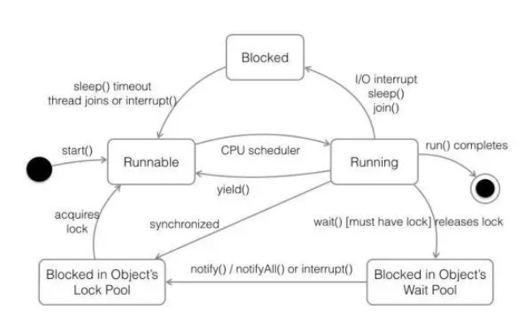
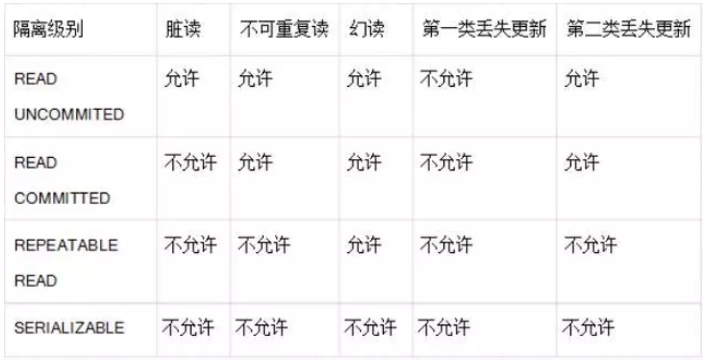

# Java面试问题总结

### 1，面向对象的特征有哪些方面？

面向对象的特征主要有以下几个方面：

**抽象：**抽象是将一类对象的共同特征总结出来构造类的过程，包括数据抽象和行为抽象两方面。抽象只关注对象有哪些属性和行为，并不关注这些行为的细节是什么。

**继承：**继承是从已有类得到继承信息创建新类的过程。提供继承信息的类被称为父类（超类、基类）；得到继承信息的类被称为子类（派生类）。继承让变化中的软件系统有了一定的延续性，同时继承也是封装程序中可变因素的重要手段（如果不能理解请阅读阎宏博士的《`Java`  与模式》或《设计模式精解》中关于桥梁模式的部分）。

**封装：**通常认为封装是把数据和操作数据的方法绑定起来，对数据的访问只能通过已定义的接口。面向对象的本质就是将现实世界描绘成一系列完全自治、封闭的对象。我们在类中编写的方法就是对实现细节的一种封装；我们编写一个类就是对数据和数据操作的封装。可以说，封装就是隐藏一切可隐藏的东西，只向外界提供最简单的编程接口（可以想想普通洗衣机和全自动洗衣机的差别，明显全自动洗衣机封装更好因此操作起来更简单；我们现在使用的智能手机也是封装得足够好的，因为几个按键就搞定了所有的事情）。

**多态性：**多态性是指允许不同子类型的对象对同一消息作出不同的响应。简单的说就是用同样的对象引用调用同样的方法但是做了不同的事情。**多态性分为编译时的多态性和运行时的多态性**。如果将对象的方法视为对象向外界提供的服务，那么运行时的多态性可以解释为：当  `A` 系统访问` B` 系统提供的服务时，`B`系统有多种提供服务的方式，但一切对` A `系统来说都是透明的（就像电动剃须刀是 A 系统，它的供电系统是 B  系统，B 系统可以使用电池供电或者用交流电，甚至还有可能是太阳能，A 系统只会通过 B  类对象调用供电的方法，但并不知道供电系统的底层实现是什么，究竟通过何种方式获得了动力）。**方法重载（`overload`）实现的是编译时的多态性（也称为前绑定），而方法重写（`override`）实现的是运行时的多态性（也称为后绑定）。运行时的多态是面向对象最精髓的东西，要实现多态需要做两件事：**

1). 方法重写（子类继承父类并重写父类中已有的或抽象的方法）；

2). 对象造型（用父类型引用引用子类型对象，这样同样的引用调用同样的方法就会根据子类对象的不同而表现出不同的行为）。

### 2，访问修饰符` public,private,protected`,以及不写（默认）时的区别？

| 修饰符    | 当前类 | 同包 | 子类 | 其他包 |
| --------- | ------ | ---- | ---- | ------ |
| public    | T      | T    | T    | T      |
| protected | T      | T    | T    | F      |
| default   | T      | T    | F    | F      |
| private   | T      | F    | F    | F      |

​	类的成员不写访问修饰时默认为 `default`。默认对于同一个包中的其他类相当于公开`（public）`，对于不是同一个包中的其他类相当于私有（`private`）。受保护`（protected）`对子类相当于公开，对不是同一包中的没有父子关系的类相当于私有。`Java`中，外部类的修饰符只能是 `public `或默认，类的成员（包括内部类）的修饰符可以是以上四种

### 3，`String` 是最基本的数据类型吗？

不是。Java 中的基本数据类型只有 8 个 ：`byte、short、int、long、float、double、char、boolean`；除了基本类型`（primitive type）`，剩下的都是引用类型`（reference type`），`Java 5 `以后引入的枚举类型也算是一种比较特殊的引用类型。

### 4，`float f=3.4`;是否正确？

​	不正确。`3.4` 是双精度数，将双精度型`（double）`赋值给浮点型（`float`）属于下转型`（down-casting，也称为窄化）`会造成精度损失，因此需要强制类型转换`float f =(float)3.4`; 或者写成` float f =3.4F`;。

### 5，`Java` 有没有 `goto？

`goto` 是 `Java `中的保留字，在目前版本的` Java `中没有使用。（根据 `James Gosling（Java 之父）`编写的`《The Java Programming Language》`一书的附录中给出了一个 `Java `关键字列表，其中有`goto `和 `const`，但是这两个是目前无法使用的关键字，因此有些地方将其称之为保留字，其实保留字这个词应该有更广泛的意义，因为熟悉 C 语言的程序员都知道，在系统类库中使用过的有特殊意义的但词或单词的组合都被视为保留字）。

### 6，&和&&的区别

`&`运算符有两种用法：(1)按位与；(2)逻辑与。`&&`运算符是短路与运算。逻辑与跟短路与的差别是非常巨大的，虽然二者都要求运算符左右两端的布尔值都是`true`整个表达式的值才是` true`。`&&`之所以称为短路运算是因为，如果`&&`左边的表达式的值是 `false`，右边的表达式会被直接短路掉，不会进行运算。很多时候我们可能都需要用`&&`而不是`&`，例如在验证用户登录时判定用户名不是`null `而且不是空字符串，应当写为：`username != null &&!username.equals(“”)`，二者的顺序不能交换，更不能用`&`运算符，因为第一个条件如果不成立，根本不能进行字符串的`equals `比较，否则会生` NullPointerException `异常。注意：逻辑或运算符（|）和短路或运算符（||）的差别也是如此。

### 7，解释内存中的栈`(stack)`、堆`(heap)`和方法区`(method area)`的用法。

​	通常我们定义一个基本数据类型的变量，一个对象的引用，还有就是函数调用的现场保存都使用`JVM` 中的栈空间；而通过 `new `关键字和构造器创建的对象则放在*堆空间*，堆是垃圾收集器管理的主要区域，由于现在的垃圾收集器都采用分代收集算法，所以堆空间还可以细分为新生代和老生代，再具体一点可以分为`Eden`、`Survivor`（又可分为` From Survivor` 和 `To Survivor`）、`Tenured`；方法区和堆都是各个线程共享的内存区域，用于存储已经被` JVM` 加载的类信息、常量、静态变量、`JIT` 编译器编译后的代码等数据；程序中的字面量（`literal`）如直接书写的 100、`”hello”`和常量都是放在常量池中，常量池是方法区的一部分，。栈空间操作起来最快但是栈很小，通常大量的对象都是放在堆空间，栈和堆的大小都可以通过`JVM`的启动参数来进行调整，栈空间用光了会引发 `StackOverflowError`，而堆和常量池空间不足则会引发` OutOfMemoryError`。

~~~ java
String str = new String("hello");//str是一个对象的引用操作
~~~

上面的语句中变量` str` 放在栈上，用 `new `创建出来的字符串对象放在堆上，而`”hello”`这个字面量是放在方法区的。

**补充 1**：较新版本的 `Java（`从 Java 6 的某个更新开始）中，由于` JIT `编译器的发展和”逃逸分析”技术的逐渐成熟，栈上分配、标量替换等优化技术使得对象一定分配在堆上这件事情已经变得不那么绝对了。

**补充 2：**运行时常量池相当于 `Class `文件常量池具有动态性，`Java `语言并不要求常量一定只有编译期间才能产生，运行期间也可以将新的常量放入池中，`String`类的` intern()`方法就是这样的。

看看下面代码的执行结果是什么并且比较一下 `Java 7` 以前和以后的运行结果是否一致。

~~~ java
String s1 = new StringBuilder("go")
s1.append("od").toString();
System.out.println(s1.intern() == s1);
String s2 = new StringBuilder("ja")
s2.append("va").toString();
System.out.println(s2.intern() == s2);
~~~

### 8，`Math.round(11.5) `等于多少？`Math.round(-11.5)`等于多少？

`Math.round(11.5)`的返回值是 12，`Math.round(-11.5)`的返回值是-11。四舍五入的原理是在参数上加 0.5 然后进行下取整。

### 9，`switch `是否能作用在 `byte `上，是否能作用在 `long `上，是否能作用在` String `上？

在` Java 5` 以前，`switch(expr)`中，`expr `只能是` byte`、`short`、`char`、`int`。从` Java5 `开始，`Java` 中引入了枚举类型，`expr` 也可以是 `enum `类型，从 `Java 7 `开始，`expr `还可以是字符串`（String）`，但是长整型`（long）`在目前所有的版本中都是不可以的。

### 10，在 `Java` 中，如何跳出当前的多重嵌套循环？

在最外层循环前加一个标记如 `A`，然后用` break A`;可以跳出多重循环。（`Java `中支持带标签的` break `和 `continue` 语句，作用有点类似于 C 和 C++中的 `goto` 语句，但是就像要避免使用 `goto `一样，应该避免使用带标签的 `break` 和` continue`，因为它不会让你的程序变得更优雅，很多时候甚至有相反的作用，所以这种语法其实不知道更好）

### 11，构造器`（constructor）`是否可被重写`（override）`？

构造器不能被继承，因此不能被重写，但可以被重载。

### 12，两个对象值相同`(x.equals(y) == true)`，但却可有不同的`hash code`，这句话对不对？

不对，如果两个对象 `x` 和` y `满足 `x.equals(y) == true`，它们的哈希码`（hash code）`应当相同。`Java` 对于 `eqauls `方法和` hashCode `方法是这样规定的：

(1)如果两个对象相同（`equals` 方法返回 `true`），那么它们的` hashCode` 值一定要相同；

(2)如果两个对象的 ` hashCode` 相同，它们并不一定相同。当然，你未必要按照要求去做，但是如果你违背了上述原则就会发现在使用容器时，相同的对象可以出现在 ` Set `集合中，同时增加新元素的效率会大大下降（对于使用哈希存储的系统，如果哈希码频繁的冲突将会造成存取性能急剧下降）。

**补充：**关于`  equals` 和` hashCode `方法，很多 Java 程序都知道，但很多人也就是仅仅知道而已，在 Joshua Bloch  的大作《Effective Java》（很多软件公司，《Effective Java》、《Java 编程思想》以及《重构：改善既有代码质量》是  Java程序员必看书籍，如果你还没看过，那就赶紧去买一本吧）中是这样介绍`equals `方法的：首先 `equals  `方法必须满足自反性（x.equals(x)必须返回 true）、

对称性（`x.equals(y)`返回 ` true` 时，`y.equals(x)`也必须返回` true`）、传递性（`x.equals(y)`和 `y.equals(z)`都返回` true`  时，`x.equals(z)`也必须返回 `true`）和一致性（当` x` 和` y `引用的对象信息没有被修改时，多次调用 ` x.equals(y)`应该得到同样的返回值），而且对于任何非` null `值的引用 `x`，`x.equals(null)`必须返回 `false`。

实现高质量的` equals` 方法的诀窍包括：

(1) 使用`==`操作符检查”参数是否为这个对象的引用”；

(2) 使用` instanceof `操作符检查”参数是否为正确的类型”；

(3) 对于类中的关键属性，检查参数传入对象的属性是否与之相匹配；

(4) 编写完 `equals`方法后，问自己它是否满足对称性、传递性、一致性；

(5) 重写 `equals` 时总是要重写 `hashCode`；

(6)  不要将` equals` 方法参数中的` Object `对象替换为其他的类型，在重写时不要忘掉`@Override` 注解。

### 13，是否可以继承 `String` 类？

`String` 类是` final `类，不可以被继承。

**补充：**继承 `String` 本身就是一个错误的行为，对 `String `类型最好的重用方式是关联关系`（Has-A）`和依赖关系`（Use-A）`而不是继承关系（`Is-A`）。

### 14，`==`和`equal`详解

- 学完`jvm`**再来回顾**

​	1）对于==，比较的是值是否相等

​		如果作用于基本数据类型的变量，则直接比较其存储的 “值”是否相等；

　　　　如果作用于引用类型的变量，则比较的是所指向的对象的地址

　　2）对于`equals`方法，注意：`equals`方法不能作用于基本数据类型的变量，`equals`继承`Object`类，比较的是是否是同一个对象

　　　　如果没有对`equals`方法进行重写，则比较的是引用类型的变量所指向的**对象的地址；**默认情况下，`equals()`方法比较的是对象与自身是否一致。当对象与自身一致时，`equals()`方法与`== `是一样的。

　　　　诸如`String`、`Date`等类对`equals`方法进行了重写的话，比较的是所指向的对象的内容。

​		重写`equals()`方法，`equals()`方法是可以比较对象属性内容是否一致的。

~~~ java
 String s1 = "Programming";
        String s2 = new String("Programming");
        String s3 = "Program";
        String s4 = "ming";
        String s5 = "Program" + "ming";
        String s6 = s3 + s4;
        System.out.println(s1 == s2);
        System.out.println(s1 == s5);
        System.out.println(s1 == s6);
        System.out.println(s1 == s6.intern());
        System.out.println(s2 == s2.intern());
    }

false
true
false
true
false
~~~

### 15，当一个对象被当作参数传递到一个方法后，此方法可改变这个对象的属性，并可返回变化后的结果，那么这里到底是值传递还是引用传递？

是值传递。`Java` 语言的方法调用只支持参数的值传递。当一个对象实例作为一个参数被传递到方法中时，参数的值就是对该对象的引用。对象的属性可以在被调用过程中被改变，但对对象引用的改变是不会影响到调用者的。

### 16，描述一下 `JVM `加载 `class `文件的原理机制？

`JVM` 中类的装载是由类加载器`（ClassLoader）`和它的子类来实现的，`Java` 中的类加载器是一个重要的 `Java `运行时系统组件，它负责在运行时查找和装入类文件中的类。

由于  `Java` 的跨平台性，经过编译的` Java `源程序并不是一个可执行程序，而是一个或多个类文件。当 `Java` 程序需要使用某个类时，`JVM ` 会确保这个类已经被加载、链接（验证、准备和解析）和初始化。类的加载是指把类的`.class`  文件中的数据读入到内存中，通常是创建一个字节数组读入`.class` 文件，然后产生与所加载类对应的 `Class `对象。加载完成后，`Class  `对象还不完整，所以此时的类还不可用。当类被加载后就进入链接阶段，这一阶段包括验证、准备（为静态变量分配内存并设置默认的初始值）和解析（将符号引用替换为直接引用）三个步骤。最后`  JVM ` 对类进行初始化，包括：

​	1)如果类存在直接的父类并且这个类还没有被初始化，那么就先初始化父类；

​	2)如果类中存在初始化语句，就依次执行这些初始化语句。

类的加载是由类加载器完成的，类加载器包括：根加载器`（BootStrap）`、扩展加载器`（Extension`）、系统加载器`（System）`和用户自定义类加载器`（java.lang.ClassLoader`  的子类）。从` Java 2（JDK 1.2）`开始，类加载过程采取了父亲委托机制`（PDM）`。`PDM  `更好的保证了` Java `平台的安全性，在该机制中，`JVM `自带的 `Bootstrap`  是根加载器，其他的加载器都有且仅有一个父类加载器。类的加载首先请求父类加载器加载，父类加载器无能为力时才由其子类加载器自行加载。`JVM `不会向 ` Java` 程序提供对` Bootstrap` 的引用。下面是关于几个类加载器的说明：

（1）` Bootstrap`：一般用本地代码实现，负责加载` JVM` 基础核心类库`（rt.jar`）；

（2） `Extension`：从` java.ext.dirs `系统属性所指定的目录中加载类库，它的父加载器是 `Bootstrap`；

（3） `System`：又叫应用类加载器，其父类是` Extension`。它是应用最广泛的类加载器。它从环境变量 `classpath `或者系统属性` java.class.path `所指定的目录中记载类，是用户自定义加载器的默认父加载器。

### 17，**`char` 型变量中能不能存贮一个中文汉字，为什么？**

`char` 类型可以存储一个中文汉字，因为` Java` 中使用的编码是 `Unicode`（不选择任何特定的编码，直接使用字符在字符集中的编号，这是统一的唯一方法），一个` char` 类型占 2 个字节（16 比特），所以放一个中文是没问题的。

**补充：**使用`  Unicode `意味着字符在 `JVM `内部和外部有不同的表现形式，在 `JVM`内部都是` Unicode`，当这个字符被从 `JVM`  内部转移到外部时（例如存入文件系统中），需要进行编码转换。所以` Java `中有字节流和字符流，以及在字符流和字节流之间进行转换的转换流，如`  InputStreamReader` 和` OutputStreamReader`，这两个类是字节流和字符流之间的适配器类，承担了编码转换的任务；对于 ` C` 程序员来说，要完成这样的编码转换恐怕要依赖于 `union`（联合体/共用体）共享内存的特征来实现了。

### 18，抽象类（`abstract class`）和接口（`interface`）有什么异同？

**抽象类和接口都不能够实例化，但可以定义抽象类和接口类型的引用**。一个类如果继承了某个抽象类或者实现了某个接口都需要对其中的**抽象方法**全部进行实现，否则该类仍然需要被声明为抽象类。接口比抽象类更加抽象，因为抽象类中可以定义构造器，可以有抽象方法和具体方法，而接口中不能定义构造器而且其中的方法全部都是抽象方法。抽象类中的成员可以是`private`、默认、`protected`、`public `的，而接口中的成员全都是` public `
的。抽象类中可以定义**成员变量**，而接口中定义的成员变量实际上都是**常量**。**有抽象方法的类必须被声明为抽象类，而抽象类未必要有抽象方法。**

### 19，静态嵌套类(`Static Nested Class`)和内部类（`Inner Class`）的不同？

`Static Nested Class `是被声明为静态（`static`）的内部类，它可以不依赖于外部类实例被实例化。而通常的内部类需要在外部类实例化后才能实例化，其语法看起来挺诡异的，如下所示。

~~~ java
public class Poker {
	private static String[] suites = {"黑桃", "红桃", "草花", "方块"};
	private static int[] faces = {1, 2, 3, 4, 5, 6, 7, 8, 9, 10, 11, 12, 13};
	private Card[] cards;
	/**
* 构造器
*
*/
	public Poker() {
		cards = new Card[52];
		for (int i = 0; i < suites.length; i++) {
			for (int j = 0; j < faces.length; j++) {
				cards[i * 13 + j] = new Card(suites[i], faces[j]);
			}
		}
	}
	/**
* 洗牌 （随机乱序）
*
*/
	public void shuffle() {
		for (int i = 0, len = cards.length; i < len; i++) {
			int index = (int) (Math.random() * len);
			Card temp = cards[index];
			cards[index] = cards[i];
			cards[i] = temp;
		}
	}
	/**
* 发牌
* @param index 发牌的位置
*
*/
	public Card deal(int index) {
		return cards[index];
	}
	/**
* 卡片类（一张扑克）
* [内部类]
*
*/
	public class Card {
		private String suite;
		// 花色
		private int face;
		// 点数
		public Card(String suite, int face) {
			this.suite = suite;
			this.face = face;
		}
		@Override
		public String toString() {
			String faceStr = "";
			switch(face) {
				case 1: faceStr = "A";
				break;
				case 11: faceStr = "J";
				break;
				case 12: faceStr = "Q";
				break;
				case 13: faceStr = "K";
				break;
				default: faceStr = String.valueOf(face);
			}
			return suite + faceStr;
		}
	}
}
测试代码：
class PokerTest {
	public static void main(String[] args) {
		Poker poker = new Poker();
		poker.shuffle();
		// 洗牌
		Poker.Card c1 = poker.deal(0);
		// 发第一张牌
		// 对于非静态内部类 Card
		// 只有通过其外部类 Poker 对象才能创建 Card 对象
		Poker.Card c2 = poker.new Card("红心", 1);
		// 自己创建一张牌
		System.out.println(c1);
		// 洗牌后的第一张
		System.out.println(c2);
		// 打印: 红心 A
	}
}
//也就是内部类对象的创建依赖外部类对象的创建，没有外部类对象就没有内部类对象
class Outer {
//内部类
	class Inner {
	}
	//静态方法
	public static void foo() {
		new Inner();
	}
	public void bar() {
		new Inner();
	}
	//静态方法
	public static void main(String[] args) {
		new Inner();
	}
}
//注意：Java 中非静态内部类对象的创建要依赖其外部类对象，上面的面试题中 foo和 main 方法都是静态方法，静态方法中没有 this，也就是说没有所谓的外部类对象，因此无法创建内部类对象，如果要在静态方法中创建内部类对象，可以这样做：
new Outer().new Inner();
~~~

### 20，抽象的（`abstract`）方法是否可同时是静态的（`static`）,是否可同时是本地方法（`native`），是否可同时被` synchronized`修饰？

都不能。**抽象方法需要子类重写，而静态的方法是无法被重写的，因此二者是矛盾的。本地方法是由本地代码（如 `C `代码）实现的方法，而抽象方法是没有实现的，也是矛盾的。`synchronized`和方法的实现细节有关，抽象方法不涉及实现细节，因此也是相互矛盾的。**

### 21，阐述静态变量和实例变量的区别。

静态变量是被 ` static  `修饰符修饰的变量，也称为类变量，它属于类，不属于类的任何一个对象，一个类不管创建多少个对象，静态变量在内存中有且仅有一个拷贝；实例变量必须依存于某一实例，需要先创建对象然后通过对象才能访问到它。静态变量可以实现让多个对象共享内存。

**补充：**在 `Java` 开发中，上下文类和工具类中通常会有大量的静态成员。

### 22，是否可以从一个静态`（static）`方法内部发出对非静态`（non-static）`方法的调用？

不可以，静态方法只能访问静态成员，因为非静态方法的调用要先创建对象，在调用静态方法时可能对象并没有被初始化。

### 23，如何实现对象克隆？

有两种方式：

1). 实现 `Cloneable `接口并重写` Object `类中的` clone()`方法；

2). 实现 `Serializable `接口，通过对象的序列化和反序列化实现克隆，可以实现真正的深度克隆，代码如下。

~~~ java
import java.io.ByteArrayInputStream;
import java.io.ByteArrayOutputStream;
import java.io.ObjectInputStream;
import java.io.ObjectOutputStream;
import java.io.Serializable;
public class MyUtil {
	private MyUtil() {
		throw new AssertionError();
	}
	@SuppressWarnings("unchecked")
	public static <T extends Serializable> T clone(T obj) throws
	Exception {
		ByteArrayOutputStream bout = new ByteArrayOutputStream();
		ObjectOutputStream oos = new ObjectOutputStream(bout);
		oos.writeObject(obj);
		ByteArrayInputStream bin = new
		ByteArrayInputStream(bout.toByteArray());
		ObjectInputStream ois = new ObjectInputStream(bin);
		return (T) ois.readObject();
		// 说明：调用 ByteArrayInputStream 或 ByteArrayOutputStream
		对象的 close 方法没有任何意义
		// 这两个基于内存的流只要垃圾回收器清理对象就能够释放资源，这
		一点不同于对外部资源（如文件流）的释放
	}
}
//测试
//人类
class Person implements Serializable {
	private static final long serialVersionUID = -9102017020286042305L;
	private String name;
	// 姓名
	private int age;
	// 年龄
	private Car car;
	// 座驾
	public Person(String name, int age, Car car) {
		this.name = name;
		this.age = age;
		this.car = car;
	}
	public String getName() {
		return name;
	}
	public void setName(String name) {
		this.name = name;
	}
	public int getAge() {
		return age;
	}
	public void setAge(int age) {
		this.age = age;
	}
	public Car getCar() {
		return car;
	}
	public void setCar(Car car) {
		this.car = car;
	}
	@Override
	public String toString() {
		return "Person [name=" + name + ", age=" + age + ", car=" +
		car + "]";
	}
}
/**
* 小汽车类
*
*/
class Car implements Serializable {
	private static final long serialVersionUID = -5713945027627603702L;
	private String brand;
	// 品牌
	private int maxSpeed;
	// 最高时速
	public Car(String brand, int maxSpeed) {
		this.brand = brand;
		this.maxSpeed = maxSpeed;
	}
	public String getBrand() {
		return brand;
	}
	public void setBrand(String brand) {
		this.brand = brand;
	}
	public int getMaxSpeed() {
		return maxSpeed;
	}
	public void setMaxSpeed(int maxSpeed) {
		this.maxSpeed = maxSpeed;
	}
	@Override
	public String toString() {
		return "Car [brand=" + brand + ", maxSpeed=" + maxSpeed +
		"]";
	}
}
class CloneTest {
	public static void main(String[] args) {
		try {
			Person p1 = new Person("Hao LUO", 33, new Car("Benz",
			300));
			Person p2 = MyUtil.clone(p1);
			// 深度克隆
			p2.getCar().setBrand("BYD");
			// 修改克隆的 Person 对象 p2 关联的汽车对象的品牌属性
			// 原来的 Person 对象 p1 关联的汽车不会受到任何影响
			// 因为在克隆 Person 对象时其关联的汽车对象也被克隆了
			System.out.println(p1);
		}
		catch (Exception e) {
			e.printStackTrace();
		}
	}
}
~~~

**注意：**基于序列化和反序列化实现的克隆不仅仅是深度克隆，更重要的是通过泛型限定，可以检查出要克隆的对象是否支持序列化，这项检查是编译器完成的，不是在运行时抛出异常，这种是方案明显优于使用`Object `类的` clone` 方法克隆对象。让问题在编译的时候暴露出来总是好过把问题留到运行时。

### 24，`GC` 是什么？为什么要有` GC`？

`GC  `是垃圾收集的意思，内存处理是编程人员容易出现问题的地方，忘记或者错误的内存回收会导致程序或系统的不稳定甚至崩溃，`Java `提供的` GC  `功能可以自动监测对象是否超过作用域从而达到自动回收内存的目的，`Java` 语言没有提供释放已分配内存的显示操作方法。`Java ` 程序员不用担心内存管理，因为垃圾收集器会自动进行管理。要请求垃圾收集，可以调用下面的方法之一：`System.gc() ` 或`Runtime.getRuntime().gc() `，但 `JVM  `可以屏蔽掉显示的垃圾回收调用。垃圾回收可以有效的防止内存泄露，有效的使用可以使用的内存。垃圾回收器通常是作为一个单独的低优先级的线程运行，不可预知的情况下对内存堆中已经死亡的或者长时间没有使用的对象进行清除和回收，程序员不能实时的调用垃圾回收器对某个对象或所有对象进行垃圾回收。在`  Java` 诞生初期，垃圾回收是` Java`最大的亮点之一，因为服务器端的编程需要有效的防止内存泄露问题，然而时过境迁，如今` Java  `的垃圾回收机制已经成为被诟病的东西。移动智能终端用户通常觉得` iOS` 的系统比` Android `系统有更好的用户体验，其中一个深层次的原因就在于  `Android` 系统中垃圾回收的不可预知性。

**补充：**垃圾回收机制有很多种，包括：分代复制垃圾回收、标记垃圾回收、增量垃圾回收等方式。标准的`  Java` 进程既有栈又有堆。栈保存了原始型局部变量，堆保存了要创建的对象。`Java `平台对堆内存回收和再利用的基本算法被称为标记和清除，但是`  Java `对其进行了改进，采用“分代式垃圾收集”。这种方法会跟 ` Java`对象的生命周期将堆内存划分为不同的区域，在垃圾收集过程中，可能会将对象移动到不同区域：

（1）伊甸园（`Eden`）：这是对象最初诞生的区域，并且对大多数对象来说，这里是它们唯一存在过的区域。

（2）幸存者乐园（`Survivor`）：从伊甸园幸存下来的对象会被挪到这里。

（3）终身颐养园（`Tenured`）：这是足够老的幸存对象的归宿。年轻代收集（`Minor-GC`）过程是不会触及这个地方的。当年轻代收集不能把对象放进终身颐养园时，就会触发一次完全收集（`Major-GC`），这里可能还会牵扯到压缩，以便为大对象腾出足够的空间。

与垃圾回收相关的` JVM` 参数：

~~~ java
-Xms / -Xmx — 堆的初始大小 / 堆的最大大小
 -Xmn — 堆中年轻代的大小
 -XX:-DisableExplicitGC — 让 System.gc()不产生任何作用
 -XX:+PrintGCDetails — 打印 GC 的细节
 -XX:+PrintGCDateStamps — 打印 GC 操作的时间戳
 -XX:NewSize / XX:MaxNewSize — 设置新生代大小/新生代最大大小
 -XX:NewRatio — 可以设置老生代和新生代的比例
 -XX:PrintTenuringDistribution — 设置每次新生代 GC 后输出幸存者
乐园中对象年龄的分布
 -XX:InitialTenuringThreshold / -XX:MaxTenuringThreshold：设置老
年代阀值的初始值和最大值
 -XX:TargetSurvivorRatio：设置幸存区的目标使用率
~~~

### 25，**`String s = new String(“xyz”)`;创建了几个字符串对象？**

两个对象，一个是静态区的`”xyz”`，一个是用` new` 创建在堆上的对象。

### 26，接口是否可继承（`extends`）接口？抽象类是否可实现（`implements`）接口？抽象类是否可继承具体类（`concreteclass`）？

接口可以继承接口，而且支持多重继承。抽象类可以实现(`implements`)接口，抽象类可继承具体类也可以继承抽象类。

### 27，一个`”.java”`源文件中是否可以包含多个类（不是内部类）？有什么限制？

可以，但一个源文件中最多只能有一个公开类（`public class`）而且文件名必须和公开类的类名完全保持一致。

### 28，内部类可以引用它的包含类（外部类）的成员吗？有没有什么限制？

一个内部类对象可以访问创建它的外部类对象的成员，包括私有成员。

### 29，`Java` 中的` final `关键字有哪些用法？

(1)修饰类：表示该类不能被继承；

(2)修饰方法：表示方法不能被重写；

(3)修饰变量：表示变量只能一次赋值以后值不能被修改（常量）。

### 30，指出下面程序的运行结果

~~~ java
class A {
    //静态代码块
	static {
		System.out.print("1");
	}
	public A() {
		System.out.print("2");
	}
}
class B extends A{
     //静态代码块
	static {
		System.out.print("a");
	}
	public B() {
		System.out.print("b");
	}
}
public class Hello {
	public static void main(String[] args) {
		A ab = new B();
		ab = new B();
	}
}
~~~

**执行结果：**`1a2b2b`。创建对象时构造器的调用顺序是：**先初始化静态成员，然后调用父类构造器，再初始化非静态成员，最后调用自身构造器。**

**提示：**如果不能给出此题的正确答案，说明之前第 16题 Java 类加载机制还没有完全理解。

### 31，数据类型之间的转换：

（1） 如何将字符串转换为基本数据类型？

（2） 如何将基本数据类型转换为字符串？

答：

（1）调用基本数据类型对应的包装类中的方法 `parseXXX(String)`或`valueOf(String)`即可返回相应基本类型；

（2）一种方法是将基本数据类型与空字符串`（”“）`连接`（+）`即可获得其所对应的字符串；另一种方法是调用 `String `类中的 `valueOf()`方法返回相应字符串。

## 32、如何实现字符串的反转及替换？

方法很多，可以自己写实现也可以使用 `String` 或 `StringBuffer/StringBuilder `中的方法。有一道很常见的面试题是用递归实现字符串反转，代码如下所示：

~~~ java
public static String reverse(String originStr) {
	if(originStr == null || originStr.length() <= 1)
	return originStr;
	return reverse(originStr.substring(1)) + originStr.charAt(0);
}
~~~

### 33，日期和时间：

（1）如何取得年月日、小时分钟秒？

（2） 如何取得从 `1970 年 1 月 1 日 0 时 0 分 0 `秒到现在的毫秒数？

（3） 如何取得某月的最后一天？

（4）如何格式化日期？

**答：**

**问题 1**：创建` java.util.Calendar` 实例，调用其 `get()`方法传入不同的参数即可获得参数所对应的值。`Java 8 `中可以使用` java.time.LocalDateTimel `来获取，代码如下所示。

~~~ java
public class DateTimeTest {
	public static void main(String[] args) {
		Calendar cal = Calendar.getInstance();
		System.out.println(cal.get(Calendar.YEAR));
		System.out.println(cal.get(Calendar.MONTH));
		// 0 - 11
		System.out.println(cal.get(Calendar.DATE));
		System.out.println(cal.get(Calendar.HOUR_OF_DAY));
		System.out.println(cal.get(Calendar.MINUTE));
		System.out.println(cal.get(Calendar.SECOND));
		// Java 8
		LocalDateTime dt = LocalDateTime.now();
		System.out.println(dt.getYear());
		System.out.println(dt.getMonthValue());
		// 1 - 12
		System.out.println(dt.getDayOfMonth());
		System.out.println(dt.getHour());
		System.out.println(dt.getMinute());
		System.out.println(dt.getSecond());
	}
}
~~~

**问题 2：**以下方法均可获得该毫秒数。

~~~ java
Calendar.getInstance().getTimeInMillis();
System.currentTimeMillis();
Clock.systemDefaultZone().millis();
// Java 8
~~~

**问题 3：**代码如下所示。

~~~ java
Calendar time = Calendar.getInstance();
time.getActualMaximum(Calendar.DAY_OF_MONTH)
~~~

**问题 4：**利用
`java.text.DataFormat` 的子类（如` SimpleDateFormat `类）中的`format(Date)`方法可将日期格式化。`Java 8 `中可以用`java.time.format.DateTimeFormatter `来格式化时间日期，代码如下所示。

~~~java
import java.text.SimpleDateFormat;
import java.time.LocalDate;
import java.time.format.DateTimeFormatter;
import java.util.Date;
class DateFormatTest {
	public static void main(String[] args) {
		SimpleDateFormat oldFormatter = new
		SimpleDateFormat("yyyy/MM/dd");
		Date date1 = new Date();
		System.out.println(oldFormatter.format(date1));
		// Java 8
		DateTimeFormatter newFormatter =
		DateTimeFormatter.ofPattern("yyyy/MM/dd");
		LocalDate date2 = LocalDate.now();
		System.out.println(date2.format(newFormatter));
	}
}
~~~

**补充：**`Java`的时间日期` API `一直以来都是被诟病的东西，为了解决这一问题，`Java8 `中引入了新的时间日期 `API`，其中包括 `LocalDate`、`LocalTime`、`LocalDateTime`、`Clock`、`Instant` 等类，这些的类的设计都使用了不变模式，因此是线程安全的设计。

## 34、打印昨天的当前时刻

~~~java
import java.util.Calendar;
class YesterdayCurrent {
	public static void main(String[] args){
		Calendar cal = Calendar.getInstance();
		cal.add(Calendar.DATE, -1);
		System.out.println(cal.getTime());
	}
}
//在 Java 8 中，可以用下面的代码实现相同的功能。
import java.time.LocalDateTime;
class YesterdayCurrent {
	public static void main(String[] args) {
		LocalDateTime today = LocalDateTime.now();
		LocalDateTime yesterday = today.minusDays(1);
		System.out.println(yesterday);
	}
}
~~~

## 35、`Error` 和`Exception `有什么区别？

`Error` 表示系统级的错误和程序不必处理的异常，是恢复不是不可能但很困难的情况下的一种严重问题；比如内存溢出，不可能指望程序能处理这样的情况；

`Exception` 表示需要捕捉或者需要程序进行处理的异常，是一种设计或实现问题；也就是说，它表示如果程序运行正常，从不会发生的情况。

## 36、`try{}`里有一个 `return` 语句，那么紧跟在这个 `try `后的`finally{}`里的代码会不会被执行，什么时候被执行，在 `return`前还是后?

**会执行，在方法返回调用者前执行。**

**注意：**在  `finally` 中改变返回值的做法是不好的，因为如果存在 `finally `代码块，`try`中的` return ` 语句不会立马返回调用者，而是记录下返回值待 `finally `代码块执行完毕之后再向调用者返回其值，然后如果在 `finally ` 中修改了返回值，就会返回修改后的值。显然，在` finally  `中返回或者修改返回值会对程序造成很大的困扰，`C#`中直接用编译错误的方式来阻止程序员干这种龌龊的事情，`Java  `中也可以通过提升编译器的语法检查级别来产生警告或错误。

## 37、`Java `语言如何进行异常处理，关键字：`throws`、`throw`、`try`、`catch`、`finally `分别如何使用？

`Java ` 通过面向对象的方法进行异常处理，把各种不同的异常进行分类，并提供了良好的接口。在` Java` 中，每个异常都是一个对象，它是` Throwable  ` 类或其子类的实例。当一个方法出现异常后便抛出一个异常对象，该对象中包含有异常信息，调用这个对象的方法可以捕获到这个异常并可以对其进行处理。`Java`  的异常处理是通过 5 个关键词来实现的：`try、catch、throw、throws` 和 `finally`。一般情况下是用 `try  `来执行一段程序，如果系统会抛出`（throw）`一个异常对象，可以通过它的类型来捕获`（catch）`它，或通过总是执行代码块`（finally）`来处理；`try`  用来指定一块预防所有异常的程序；`catch` 子句紧跟在` try` 块后面，用来指定你想要捕获的异常的类型；`throw`  语句用来明确地抛出一个异常；`throws `用来声明一个方法可能抛出的各种异常（当然声明异常时允许无病呻吟）；`finally`  为确保一段代码不管发生什么异常状况都要被执行；`try `语句可以嵌套，每当遇到一个` try `语句，异常的结构就会被放入异常栈中，直到所有的` try ` 语句都完成。如果下一级的`try `语句没有对某种异常进行处理，异常栈就会执行出栈操作，直到遇到有处理这种异常的 `try `语句或者最终将异常抛给 ` JVM`。

## 38、运行时异常与受检异常有何异同？

异常表示程序运行过程中可能出现的非正常状态，运行时异常表示虚拟机的通常操作中可能遇到的异常，是一种常见运行错误，只要程序设计得没有问题通常就不会发生。受检异常跟程序运行的上下文环境有关，即使程序设计无误，仍然可能因使用的问题而引发。`Java `  编译器要求方法必须声明抛出可能发生的受检异常，但是并不要求必须声明抛出未被捕获的运行时异常。异常和继承一样，是面向对象程序设计中经常被滥用的东西，在 ` Effective Java` 中对异常的使用给出了以下指导原则：

（1）不要将异常处理用于正常的控制流（设计良好的 API 不应该强迫它的调用者为了正常的控制流而使用异常）

（2）对可以恢复的情况使用受检异常，对编程错误使用运行时异常

（3）避免不必要的使用受检异常（可以通过一些状态检测手段来避免异常的发生）

（4）优先使用标准的异常

（5）每个方法抛出的异常都要有文档

（6）保持异常的原子性

（7）不要在` catch` 中忽略掉捕获到的异常

## 39、列出一些你常见的运行时异常？

（1）`ArithmeticException`（算术异常）

（2） `ClassCastException `（类转换异常）

（3）` IllegalArgumentException` （非法参数异常）

（4） `IndexOutOfBoundsException `（下标越界异常）

（5）` NullPointerException `（空指针异常）

（6） `SecurityException `（安全异常）

## 40、阐述` final`、`finally`、`finalize` 的区别。

（1）  `final`：修饰符（关键字）有三种用法：如果一个类被声明为 `final`，意味着它不能再派生出新的子类，即不能被继承，因此它和 `abstract  `是反义词。将变量声明为 `final`，可以保证它们在使用中不被改变，被声明为 `final ` 的变量必须在声明时给定初值，而在以后的引用中只能读取不可修改。被声明为 `final `的方法也同样只能使用，不能在子类中被重写。

（2）`finally`：通常放在` try…catch…`的后面构造总是执行代码块，这就意味着程序无论正常执行还是发生异常，这里的代码只要` JVM `不关闭都能执行，可以将释放外部资源的代码写在` finally `块中.

（3）`finalize`：`Object`  类中定义的方法，`Java `中允许使用  `finalize()`方法在垃圾收集器将对象从内存中清除出去之前做必要的清理工作。这个方法是由垃圾收集器在销毁对象时调用的，通过重写  `finalize()`方法可以整理系统资源或者执行其他清理工作。

## 41、类 `ExampleA `继承` Exception`，类` ExampleB `继承`ExampleA`。

**有如下代码片断：**

~~~java
try {
	throw new ExampleB("b")
}catch（ExampleA e）{
	System.out.println("ExampleA");
}catch（Exception e）{
	System.out.println("Exception");
}
~~~

**请问执行此段代码的输出是什么？**

答：

输出：`ExampleA`。（根据里氏代换原则[能使用父类型的地方一定能使用子类型]，抓取 `ExampleA` 类型异常的` catch` 块能够抓住` try` 块中抛出的` ExampleB` 类型的异常）

面试题 - 说出下面代码的运行结果。（此题的出处是《Java 编程思想》一书）

~~~java
class Annoyance extends Exception {}
class Sneeze extends Annoyance {}
class Human {
	public static void main(String[] args)
	throws Exception {
		try {
			try {
				throw new Sneeze();
			}
			catch ( Annoyance a ) {
				System.out.println("Caught Annoyance");
				throw a;
			}
		}
		catch ( Sneeze s ) {
			System.out.println("Caught Sneeze");
			return ;
		}
		finally {
			System.out.println("Hello World!");
		}
	} 
}
~~~

## 42、List、Set、Map 是否继承自 Collection 接口？

`List`、`Set `是 ，`Map `不是。`Map` 是键值对映射容器，与 `List` 和` Set` 有明显的区别，而 `Set` 存储的零散的元素且不允许有重复元素（数学中的集合也是如此），`List`是线性结构的容器，适用于按数值索引访问元素的情形。

## 43、阐述 `ArrayList`、`Vector`、`LinkedList` 的存储性能和特性。

`ArrayList ` 和 `Vector`  都是使用数组方式存储数据，此数组元素数大于实际存储的数据以便增加和插入元素，它们都允许直接按序号索引元素，但是插入元素要涉及数组元素移动等内存操作，所以索引数据快而插入数据慢，`Vector`  中的方法由于添加了` synchronized `修饰，因此 `Vector` 是线程安全的容器，但性能上较`ArrayList `差，因此已经是 ` Java `中的遗留容器。`LinkedList ` 使用双向链表实现存储（将内存中零散的内存单元通过附加的引用关联起来，形成一个可以按序号索引的线性结构，这种链式存储方式与数组的连续存储方式相比，内存的利用率更高），按序号索引数据需要进行前向或后向遍历，但是插入数据时只需要记录本项的前后项即可，所以插入速度较快。`Vector  `属于遗留容器（`Java ` 早期的版本中提供的容器，除此之外，`Hashtable`、`Dictionary`、`BitSet`、`Stack`、`Properties`都是遗留容器），已经不推荐使用，但是由于  `ArrayList` 和` LinkedListed  `都是非线程安全的，如果遇到多个线程操作同一个容器的场景，则可以通过工具类`Collections` 中的` synchronizedList  `方法将其转换成线程安全的容器后再使用（这是对装潢模式的应用，将已有对象传入另一个类的构造器中创建新的对象来增强实现）。

**补充：**遗留容器中的  `Properties `类和 `Stack ` 类在设计上有严重的问题，`Properties`是一个键和值都是字符串的特殊的键值对映射，在设计上应该是关联一个`Hashtable ` 并将其两个泛型参数设置为 `String `类型，但是 `Java API` 中的`Properties` 直接继承了  `Hashtable`，这很明显是对继承的滥用。这里复用代码的方式应该是 `Has-A `关系而不是` Is-A ` 关系，另一方面容器都属于工具类，继承工具类本身就是一个错误的做法，使用工具类最好的方式是` Has-A `关系（关联）或`Use-A  `关系（依赖）。同理，`Stack `类继承` Vector `也是不正确的。`Sun` 公司的工程师们也会犯这种低级错误，让人唏嘘不已。

## 44、`Collection `和 `Collections` 的区别？

`Collection` 是一个接口，它是` Set`、`List `等容器的父接口；`Collections` 是个一个工具类，提供了一系列的静态方法来辅助容器操作，这些方法包括对容器的搜索、排序、线程安全化等等。

## 45、`List`、`Map`、`Set `三个接口存取元素时，各有什么特点？

`List`  以特定**索引**来存取元素，可以有重复元素。`Set` 不能存放重复元素（用对象的`equals()`方法来区分元素是否重复）。`Map`  保存键值对`（key-value pair）`映射，映射关系可以是一对一或多对一。`Set `和 `Map ` 容器都有基于哈希存储和排序树的两种实现版本，基于哈希存储的版本理论存取时间复杂度为`  O(1)`，而基于排序树版本的实现在插入或删除元素时会按照元素或元素的键（`key`）构成排序树从而达到排序和去重的效果。

## 46、`TreeMap` 和 `TreeSet `在排序时如何比较元素？`Collections `工具类中的` sort()`方法如何比较元素？

`TreeSet  `要求存放的对象所属的类必须实现` Comparable` 接口，该接口提供了比较元素的  `compareTo()`方法，当插入元素时会回调该方法比较元素的大小。`TreeMap` 要求存放的键值对映射的键必须实现 `Comparable  `接口从而根据键对元素进 行排 序。`Collections `工具类的` sort`  方法有两种重载的形式，第一种要求传入的待排序容器中存放的对象比较实现 `Comparable ` 接口以实现元素的比较；第二种不强制性的要求容器中的元素必须可比较，但是要求传入第二个参数，参数是`Comparator `接口的子类型（需要重写  `compare `方法实现元素的比较），相当于一个临时定义的排序规则，其实就是通过接口注入比较元素大小的算法，也是对回调模式的应用（Java  中对函数式编程的支持）。

## 47、`Thread` 类的 `sleep()`方法和对象的 `wait()`方法都可以让线程暂停执行，它们有什么区别?

`sleep()`方法（休眠）是线程类`（Thread）`的**静态方法**，调用此方法会让当前线程暂停执行指定的时间，将执行机会`（CPU）`让给其他线程，但是对象的锁依然保持，因此休眠时间结束后会自动恢复（线程回到就绪状态，请参考第  66 题中的线程状态转换图）。`wait()`是` Object `类的方法，调用对象的  `wait()`方法导致当前线程放弃对象的锁（线程暂停执行），进入对象的等待池`（wait pool`，只有调用对象的` notify()`方法（或  `notifyAll()`方法）时才能唤醒等待池中的线程进入等锁池（`lock pool`），如果线程重新获得对象的锁就可以进入就绪状态。

**补充：**可能不少人对什么是进程，什么是线程还比较模糊，对于为什么需要多线程编程也不是特别理解。简单的说：进程是具有一定独立功能的程序关于某个数据集合上的一次运行活动，是操作系统进行资源分配和调度的一个独立单位；线程是进程的一个实体，是`  CPU ` 调度和分派的基本单位，是比进程更小的能独立运行的基本单位。线程的划分尺度小于进程，这使得多线程程序的并发性高；进程在执行时通常拥有独立的内存单元，而线程之间可以共享内存。使用多线程的编程通常能够带来更好的性能和用户体验，但是多线程的程序对于其他程序是不友好的，因为它可能占用了更多的  `CPU `资源。当然，也不是线程越多，程序的性能就越好，因为线程之间的调度和切换也会浪费 `CPU `时间。时下很时髦的` Node.js`就采用了单线程异步 `I/O `的工作模式。

## 48、线程的 `sleep()`方法和 `yield()`方法有什么区别？

（1）` sleep()`方法给其他线程运行机会时不考虑线程的优先级，因此会给低优先级的线程以运行的机会；`yield()`方法只会给相同优先级或更高优先级的线程以运行的机会；

（2） 线程执行 `sleep()`方法后转入阻塞（`blocked`）状态，而执行` yield()`方法后转入就绪`（ready）`状态；

（3）`sleep()`方法声明抛出 `InterruptedException`，而` yield()`方法没有声明任何异常；

（4）`sleep()`方法比` yield()`方法（跟操作系统 CPU 调度相关）具有更好的可移植性。

## 49、当一个线程进入一个对象的 `synchronized `方法 A 之后，其它线程是否可进入此对象的` synchronized` 方法 B？

不能。其它线程只能访问该对象的非同步方法，同步方法则不能进入。因为非静态方法上的`  synchronized `修饰符要求执行方法时要获得对象的锁，如果已经进入`A `方法说明对象锁已经被取走，那么试图进入` B ` 方法的线程就只能在等锁池（注意不是等待池哦）中等待对象的锁。

## 50、请说出与线程同步以及线程调度相关的方法。

（1）` wait()`：使一个线程处于等待（阻塞）状态，并且释放所持有的对象的锁；

（2）`sleep()`：使一个正在运行的线程处于睡眠状态，是一个静态方法，调用此方法要处理 `InterruptedException` 异常；

（3）`notify()`：唤醒一个处于等待状态的线程，当然在调用此方法的时候，并不能确切的唤醒某一个等待状态的线程，而是由` JVM `确定唤醒哪个线程，而且与优先级无关；

（4）`notityAll()`：唤醒所有处于等待状态的线程，该方法并不是将对象的锁给所有线程，而是让它们竞争，只有获得锁的线程才能进入就绪状态；

**补充：**`Java  5` 通过 `Lock `接口提供了显式的锁机制`（explicit lock）`，增强了灵活性以及对线程的协调。`Lock  `接口中定义了加锁`（lock()）`和解锁`（unlock()`的方法，同时还提供了 `newCondition()`方法来产生用于线程之间通信的  `Condition `对象；此外，`Java 5  `还提供了信号量机制`（semaphore）`，信号量可以用来限制对某个共享资源进行访问的线程的数量。在对资源进行访问之前，线程必须得到信号量的许可（调用 ` Semaphore` 对象的 `acquire()`方法）；在完成对资源的访问后，线程必须向信号量归还许可（调用` Semaphore `对象的`  release()`方法）。

## 51、编写多线程程序有几种实现方式？

`Java  5` 以前实现多线程有两种实现方法：一种是继承` Thread `类；另一种是实现`Runnable `接口。两种方式都要通过重写 ` run()`方法来定义线程的行为，推荐使用后者，因为` Java `中的继承是单继承，一个类有一个父类，如果继承了` Thread  `类就无法再继承其他类了，显然使用 `Runnable `接口更为灵活。

**补充：**`Java 5 `以后创建线程还有第三种方式：实现` Callable` 接口，该接口中的 `call`方法可以在线程执行结束时产生一个返回值。

## 52、`synchronized` 关键字的用法？

`synchronized`  **关键字可以将对象或者方法标记为同步**，以实现对对象和方法的**互斥访问**，可以用 `synchronized(对象) { …  }`定义同步代码块，或者在声明方法时将` synchronized `作为方法的修饰符。在第 50 题的例子中已经展示了synchronized  关键字的用法。

## 53、举例说明同步和异步。

如果系统中存在临界资源（资源数量少于竞争资源的线程数量的资源），例如正在写的数据以后可能被另一个线程读到，或者正在读的数据可能已经被另一个线程写过了，那么这些数据就必须进行同步存取（数据库操作中的排他锁就是最好的例子）。当应用程序在对象上调用了一个需要花费很长时间来执行的方法，并且不希望让程序等待方法的返回时，就应该使用异步编程，在很多情况下采用异步途径往往更有效率。事实上，所谓的同步就是指阻塞式操作，而异步就是非阻塞式操作。

## 54、启动一个线程是调用` run()`还是` start()`方法？

启动一个线程是调用 `start()`方法，使线程所代表的虚拟处理机处于可运行状态，这意味着它可以由`JVM` 调度并执行，这并不意味着线程就会立即运行。`run()`方法是线程启动后要进行回调`（callback）`的方法。

## 55、什么是线程池`（thread pool）`？

在面向对象编程中，创建和销毁对象是很费时间的，因为创建一个对象要获取内存资源或者其它更多资源。在  `Java ` 中更是如此，虚拟机将试图跟踪每一个对象，以便能够在对象销毁后进行垃圾回收。所以提高服务程序效率的一个手段就是尽可能减少创建和销毁对象的次数，特别是一些很耗资源的对象创建和销毁，这就是”池化资源”技术产生的原因。线程池顾名思义就是事先创建若干个可执行的线程放入一个池（容器）中，需要的时候从池中获取线程不用自行创建，使用完毕不需要销毁线程而是放回池中，从而减少创建和销毁线程对象的开销。`Java  5+`中的` Executor` 接口定义一个执行线程的工具。它的子类型即线程池接口是  `ExecutorService`。要配置一个线程池是比较复杂的，尤其是对于线程池的原理不是很清楚的情况下，因此在工具类` Executors  `提供了一些静态工厂方法，生成一些常用的线程池，如下所示：

（1）`newSingleThreadExecutor`：创建一个单线程的线程池。这个线程池只有一个线程在工作，也就是相当于单线程串行执行所有任务。如果这个唯一的线程因为异常结束，那么会有一个新的线程来替代它。此线程池保证所有任务的执行顺序按照任务的提交顺序执行。

（2）`newFixedThreadPool`：创建固定大小的线程池。每次提交一个任务就创建一个线程，直到线程达到线程池的最大大小。线程池的大小一旦达到最大值就会保持不变，如果某个线程因为执行异常而结束，那么线程池会补充一个新线程。

（3）`  newCachedThreadPool`：创建一个可缓存的线程池。如果线程池的大小超过了处理任务所需要的线程，那么就会回收部分空闲（60  秒不执行任务）的线程，当任务数增加时，此线程池又可以智能的添加新线程来处理任务。此线程池不会对线程池大小做限制，线程池大小完全依赖于操作系统（或者说  JVM）能够创建的最大线程大小。

（4）`newScheduledThreadPool`：创建一个大小无限的线程池。此线程池支持定时以及周期性执行任务的需求。

（5）`newSingleThreadExecutor`：创建一个单线程的线程池。此线程池支持定时以及周期性执行任务的需求。

第 50 题的例子中演示了通过` Executors` 工具类创建线程池并使用线程池执行线程的代码。如果希望在服务器上使用线程池，强烈建议使用` newFixedThreadPool`方法来创建线程池，这样能获得更好的性能。

## 56、线程的基本状态以及状态之间的关系？



说明：其中  `Running `表示运行状态，`Runnable `表示就绪状态（万事俱备，只欠`CPU`），`Blocked`  表示阻塞状态，阻塞状态又有多种情况，可能是因为调用 `wait()`方法进入等待池，也可能是执行同步方法或同步代码块进入等锁池，或者是调用了  `sleep()`方法或` join()`法等待休眠或其他线程结束，或是因为发生了` I/O` 中断。

## 57、简述 `synchronized` 和 `java.util.concurrent.locks.Lock`的异同？

`Lock ` 是` Java 5 `以后引入的新的` API`，和关键字 `synchronized `相比主要相同点：`Lock` 能完成 `synchronized  `所实现的所有功能；主要不同点：`Lock` 有比`synchronized ` 更精确的线程语义和更好的性能，而且不强制性的要求一定要获得锁。`synchronized `会自动释放锁，而` Lock ` 一定要求程序员手工释放，并且最好在` finally `块中释放（这是释放外部资源的最好的地方）。

## 58、`Java `中如何实现序列化，有什么意义？

序列化就是一种用来处理对象流的机制，所谓对象流也就是将对象的内容进行流化。可以对流化后的对象进行读写操作，也可将流化后的对象传输于网络之间。序列化是为了解决对象流读写操作时可能引发的问题（如果不进行序列化可能会存在数据乱序的问题）。要实现序列化，需要让一个类实现 ` Serializable` 接口，该接口是一个标识性接口，标注该类对象是可被序列化的，然后使用一个输出流来构造一个对象输出流并通过  `writeObject(Object)`方法就可以将实现对象写出（即保存其状态）；如果需要反序列化则可以用一个输入流建立对象输入流，然后通过  `readObject `方法从流中读取对象。序列化除了能够实现对象的持久化之外，还能够用于对象的深度克隆.

## 59、`Java `中有几种类型的流？

字节流和字符流。字节流继承于 ` InputStream`、`OutputStream`，字符流继承于`Reader`、`Writer`。在 `java.io  `包中还有许多其他的流，主要是为了提高性能和使用方便。关于` Java `的` I/O  `需要注意的有两点：一是两种对称性（输入和输出的对称性，字节和字符的对称性）；二是两种设计模式（适配器模式和装潢模式）。另外` Java `中的流不于` C#`的是它只有一个维度一个方向。

## 60、写一个方法，输入一个文件名和一个字符串，统计这个字符串在这个文件中出现的次数。

代码如下：

~~~java
import java.io.BufferedReader;import java.io.FileReader;public final class MyUtil {
	// 工具类中的方法都是静态方式访问的因此将构造器私有不允许创建对象
	(绝对好习惯)
	private MyUtil() {
		throw new AssertionError();
	}
	/**
* 统计给定文件中给定字符串的出现次数
*
* @param filename 文件名
* @param word 字符串
* @return 字符串在文件中出现的次数
*/
	public static int countWordInFile(String filename, String word) {
		int counter = 0;
		try (FileReader fr = new FileReader(filename)) {
			try (BufferedReader br = new BufferedReader(fr)) {
				String line = null;
				while ((line = br.readLine()) != null) {
					int index = -1;
					while (line.length() >= word.length() && (index =
					line.indexOf(word)) >= 0) {
						counter++;
						line = line.substring(index + word.length());
					}
				}
			}
		}
		catch (Exception ex) {
			ex.printStackTrace();
		}
		return counter;
	}}
~~~

## 61、如何用 `Java` 代码列出一个目录下所有的文件？

如果只要求列出当前文件夹下的文件，代码如下所示：

~~~ java
import java.io.File;class Test12 {
	public static void main(String[] args) {
		File f = new File("/Users/Hao/Downloads");
		for (File temp : f.listFiles()) {
			if(temp.isFile()) {
				System.out.println(temp.getName());
			}
		}
	}}
//如果需要对文件夹继续展开，代码如下所示：
import java.io.File;class Test12 {
	public static void main(String[] args) {
		showDirectory(new File("/Users/Hao/Downloads"));
	}
	public static void showDirectory(File f) {
		_walkDirectory(f, 0);
	}
	private static void _walkDirectory(File f, int level) {
		if(f.isDirectory()) {
			for (File temp : f.listFiles()) {
				_walkDirectory(temp, level + 1);
			}
		} else {
			for (int i = 0; i < level - 1; i++) {
				System.out.print("t");}
System.out.println(f.getName());}}}
//在 Java 7 中可以使用 NIO.2 的 API 来做同样的事情，代码如下所示：
class ShowFileTest {
	public static void main(String[] args) throws IOException {
		Path initPath = Paths.get("/Users/Hao/Downloads");
		Files.walkFileTree(initPath, new SimpleFileVisitor<Path>() {
			@Override
			public FileVisitResult visitFile(Path file, BasicFileAttributes
			attrs)
			throws IOException {
				System.out.println(file.getFileName().toString());
				return FileVisitResult.CONTINUE;
			}
		}
		);
	}}
~~~

## 62、阐述` JDBC` 操作数据库的步骤。

下面的代码以连接本机的` Oracle `数据库为例，演示` JDBC `操作数据库的步骤。

（1） 加载驱动。

```
Class.forName("oracle.jdbc.driver.OracleDriver");
```

（2） 创建连接。

```
Connection con =
DriverManager.getConnection("jdbc:oracle:thin:@localhost:1521:orcl","scott", "tiger");
```

（3） 创建语句。

```
PreparedStatement ps = con.prepareStatement("select * from emp
where sal between ? and ?");
ps.setint(1, 1000);
ps.setint(2, 3000);
```

（4）执行语句。

```
ResultSet rs = ps.executeQuery();
```

（5）处理结果。

```
while(rs.next()) {
	System.out.println(rs.getint("empno") + " - " +
	rs.getString("ename"));}
```

（6） 关闭资源。

```
finally {
	if(con != null) {
		try {
			con.close();
		}
		catch (SQLException e) {
			e.printStackTrace();
		}
	}}
```

**提示：**关闭外部资源的顺序应该和打开的顺序相反，也就是说先关闭 ` ResultSet`、再关闭` Statement`、在关闭` Connection`。上面的代码只关闭了 ` Connection`（连接），虽然通常情况下在关闭连接时，连接上创建的语句和打开的游标也会关闭，但不能保证总是如此，因此应该按照刚才说的顺序分别关闭。此外，第一步加载驱动在`  JDBC 4.0` 中是可以省略的（自动从类路径中加载驱动），但是我们建议保留。

## 63、`Statement `和 `PreparedStatement `有什么区别？哪个性能更好？

与  `Statement` 相比，①`PreparedStatement `接口代表预编译的语句，它主要的优势在于可以减少` SQL` 的编译错误并增加 ` SQL `的安全性（减少 `SQL `注射攻击的可能性）；②`PreparedStatement` 中的` SQL ` 语句是可以带参数的，避免了用字符串连接拼接 `SQL` 语句的麻烦和不安全；③当批量处理 `SQL ` 或频繁执行相同的查询时，`PreparedStatement `有明显的性能上的优势，由于数据库可以将编译优化后的`SQL`  语句缓存起来，下次执行相同结构的语句时就会很快（不用再次编译和生成执行计划）。

**补充：**为了提供对存储过程的调用，`JDBC  API `中还提供了` CallableStatement `接口。存储过程（`Stored Procedure`）是数据库中一组为了完成特定功能的 ` SQL ` 语句的集合，经编译后存储在数据库中，用户通过指定存储过程的名字并给出参数（如果该存储过程带有参数）来执行它。虽然调用存储过程会在网络开销、安全性、性能上获得很多好处，但是存在如果底层数据库发生迁移时就会有很多麻烦，因为每种数据库的存储过程在书写上存在不少的差别。

## 64、使用` JDBC` 操作数据库时，如何提升读取数据的性能？如何提升更新数据的性能？

要提升读取数据的性能，可以指定通过结果集（`ResultSet`）对象的  `setFetchSize()`方法指定每次抓取的记录数（典型的空间换时间策略）；要提升更新数据的性能可以使用 `PreparedStatement  `语句构建批处理，将若干 `SQL` 语句置于一个批处理中执行。

## 65、在进行数据库编程时，连接池有什么作用？

由于创建连接和释放连接都有很大的开销（尤其是数据库服务器不在本地时，每次建立连接都需要进行  `TCP` 的三次握手，释放连接需要进行` TCP ` 四次握手，造成的开销是不可忽视的），为了提升系统访问数据库的性能，可以事先创建若干连接置于连接池中，需要时直接从连接池获取，使用结束时归还连接池而不必关闭连接，从而避免频繁创建和释放连接所造成的开销，这是典型的用空间换取时间的策略（浪费了空间存储连接，但节省了创建和释放连接的时间）。池化技术在`Java`  开发中是很常见的，在使用线程时创建线程池的道理与此相同。基于` Java `的开源数据库连接池主要有：`C3P0、Proxool、DBCP、BoneCP、Druid `等。

**补充：**在计算机系统中时间和空间是不可调和的矛盾，理解这一点对设计满足性能要求的算法是至关重要的。大型网站性能优化的一个关键就是使用缓存，而缓存跟上面讲的连接池道理非常类似，也是使用空间换时间的策略。可以将热点数据置于缓存中，当用户查询这些数据时可以直接从缓存中得到，这无论如何也快过去数据库中查询。当然，缓存的置换策略等也会对系统性能产生重要影响，对于这个问题的讨论已经超出了这里要阐述的范围。

## 66、什么是` DAO `模式？

`DAO（Data  Access  Object）`顾名思义是一个为数据库或其他持久化机制提供了抽象接口的对象，在不暴露底层持久化方案实现细节的前提下提供了各种数据访问操作。在实际的开发中，应该将所有对数据源的访问操作进行抽象化后封装在一个公共 ` API ` 中。用程序设计语言来说，就是建立一个接口，接口中定义了此应用程序中将会用到的所有事务方法。在这个应用程序中，当需要和数据源进行交互的时候则使用这个接口，并且编写一个单独的类来实现这个接口，在逻辑上该类对应一个特定的数据存储。`DAO  `模式实际上包含了两个模式，一是 `DataAccessor`（数据访问器），二是 `Data  Object`（数据对象），前者要解决如何访问数据的问题，而后者要解决的是如何用对象封装数据。

## 67、事务的 `ACID` 是指什么？

（1）原子性(`Atomic`)：事务中各项操作，要么全做要么全不做，任何一项操作的失败都会导致整个事务的失败；

（2）一致性(`Consistent`)：事务结束后系统状态是一致的；

（3）隔离性(`Isolated`)：并发执行的事务彼此无法看到对方的中间状态；

（4）持久性(`Durable`)：事务完成后所做的改动都会被持久化，即使发生灾难性的失败。通过日志和同步备份可以在故障发生后重建数据。

**补充：**关于事务，在面试中被问到的概率是很高的，可以问的问题也是很多的。首先需要知道的是，只有存在并发数据访问时才需要事务。当多个事务访问同一数据时，可能会存在  5 类问题，包括 3 类数据读取问题（脏读、不可重复读和幻读）和 2 类数据更新问题（第 1 类丢失更新和第 2 类丢失更新）。

**脏读（`Dirty Read`）：**A 事务读取 B 事务尚未提交的数据并在此基础上操作，而 B事务执行回滚，那么 A 读取到的数据就是脏数据。

**不可重复读（`Unrepeatable Read`）：**事务 A 重新读取前面读取过的数据，发现该数据已经被另一个已提交的事务 B 修改过了。

**幻读（`Phantom Read`）：**事务 A 重新执行一个查询，返回一系列符合查询条件的行，发现其中插入了被事务 B 提交的行。

​	第 1 类丢失更新：事务 A 撤销时，把已经提交的事务 B 的更新数据覆盖了。

​	第 2 类丢失更新：事务 A 覆盖事务 B 已经提交的数据，造成事务 B 所做的操作丢失。

数据并发访问所产生的问题，在有些场景下可能是允许的，但是有些场景下可能就是致命的，**数据库通常会通过锁机制来解决数据并发访问问题**，按锁定对象不同可以分为**表级锁和行级锁**；**按并发事务锁定关系可以分为共享锁和独占锁**，具体的内容大家可以自行查阅资料进行了解。直接使用锁是非常麻烦的，为此数据库为用户提供了自动锁机制，只要用户指定会话的事务隔离级别，数据库就会通过分析`SQL` 语句然后为事务访问的资源加上合适的锁，此外，数据库还会维护这些锁通过各种手段提高系统的性能，这些对用户来说都是透明的（就是说你不用理解，事实上我确实也不知道）。`ANSI/ISOSQL92 `标准定义了 4 个等级的事务隔离级别，如下表所示：



需要说明的是，事务隔离级别和数据访问的并发性是对立的，事务隔离级别越高并发性就越差。所以要根据具体的应用来确定合适的事务隔离级别，这个地方没有万能的原则。

## 68、`JDBC `中如何进行事务处理？

`Connection`  提供了事务处理的方法，通过调用` setAutoCommit(false)`可以设置手动提交事务；当事务完成后用 ` commit()`显式提交事务；如果在事务处理过程中发生异常则通过 `rollback()`进行事务回滚。除此之外，从` JDBC 3.0  `中还引入了`Savepoint`（保存点）的概念，允许通过代码设置保存点并让事务回滚到指定的保存点。

## 69、`JDBC` 能否处理 `Blob` 和`Clob`？

`Blob`  是指二进制大对象`（Binary Large Object）`，而` Clob` 是指大字符对象`（Character Large  Objec）`，因此其中 `Blob `是为存储大的二进制数据而设计的，而 `Clob `是为存储大的文本数据而设计的。`JDBC` 的  `PreparedStatement `和`ResultSet `都提供了相应的方法来支持` Blob `和` Clob` 操作。

## 70、简述正则表达式及其用途。

在编写处理字符串的程序时，经常会有查找符合某些复杂规则的字符串的需要。正则表达式就是用于描述这些规则的工具。换句话说，正则表达式就是记录文本规则的代码。

**说明：**计算机诞生初期处理的信息几乎都是数值，但是时过境迁，今天我们使用计算机处理的信息更多的时候不是数值而是字符串，正则表达式就是在进行字符串匹配和处理的时候最为强大的工具，绝大多数语言都提供了对正则表达式的支持。

## 71、`Java` 中是如何支持正则表达式操作的？

`Java`  中的` String`  类提供了支持正则表达式操作的方法，包括：`matches()`、`replaceAll()`、`replaceFirst()`、`split()`。此外，`Java ` 中可以用 `Pattern `类表示正则表达式对象，它提供了丰富的` API` 进行各种正则表达式操作。

面试题：- 如果要从字符串中截取第一个英文左括号之前的字符串，例如：北京市(朝阳区)(西城区)(海淀区)，截取结果为：北京市，那么正则表达式怎么写？

~~~java
import java.util.regex.Matcher;import java.util.regex.Pattern;class RegExpTest {
	public static void main(String[] args) {
		String str = "北京市(朝阳区)(西城区)(海淀区)";
		Pattern p = Pattern.compile(".*?(?=\()");
		Matcher m = p.matcher(str);
		if(m.find()) {
			System.out.println(m.group());
		}
	}}


~~~

## 72、获得一个类的类对象有哪些方式？

（1）方法 1：类型`.class`，例如：`String.class`

（2）方法 2：对象`.getClass()`，例如：`”hello”.getClass()`

（3）方法 3：`Class.forName()`，例如：`Class.forName(“java.lang.String”)`

## 73、如何通过反射创建对象？

**方法 1**：通过类对象调用 `newInstance()`方法，例如：`String.class.newInstance()`

**方法 2**：通过类对象的 ` getConstructor()`或` getDeclaredConstructor()`方法获得构造器`（Constructor）`对象并调用其  `newInstance()`方法创建对象，例如：`String.class.getConstructor(String.class).newInstance(“Hello”)`;

## 74、如何通过反射获取和设置对象私有字段的值？

可以通过类对象的  `getDeclaredField()`方法字段`（Field）`对象，然后再通过字段对象的 ` setAccessible(true)`将其设置为可以访问，接下来就可以通过` get/set ` 方法来获取/设置字段的值了。

## 75、如何通过反射调用对象的方法？

请看下面的代码：

~~~ java
import java.lang.reflect.Method;class MethodInvokeTest {
	public static void main(String[] args) throws Exception {
		String str = "hello";
		Method m = str.getClass().getMethod("toUpperCase");
		System.out.println(m.invoke(str));
		// HELLO
	}}
~~~

## 76、存在两个类，B 继承 A，C 继承 B，我们能将 B 转换为C 么？如 C = (C) B；

**这属于强制类型转换，如果被转换的B实例不是C类型，会有异常**

比如你的`ABC`分别对应动物，猫，黑猫。

向上转型就是比如

`C c = new C();`

`B b = c;`

你把`c`转型为`B`，黑猫是猫吗？是啊，所以这是`ok`的。

但是反过来

`B b = new B();`

`C c = (C)b;`

这就不`ok`了，只知道这个`b`是一只猫，他不一定是黑猫。

但如果这个`b`已经确定是一只黑猫了，那就可以转型了

`B b = new C();`

`C c = (C)b;`

这里的`b`本来就是黑猫啊。

## 77、哪个类包含` clone` 方法？是 `Cloneable` 还是 `Object`？

`java.lang.Cloneable` 是一个标示性接口，不包含任何方法，`clone `方法在`object` 类中定义。并且需要知道` clone() `方法是一个本地方法，这意味着它是由c 或 c++ 或 其他本地语言实现的。

## 78、`Java` 中` ++ `操作符是线程安全的吗？

不是线程安全的操作。它涉及到多个指令，如读取变量值，增加，然后存储回内存，这个过程可能会出现多个线程交差。

## 79、`a = a + b `与 `a += b `的区别

**+= 隐式的将加操作的结果类型强制转换为持有结果的类型**。如果两这个整型相加，如` byte`、`short `或者 `int`，首先会将它们提升到` int `类型，然后在执行加法操作。如果加法操作的结果比` a `的最大值要大，则` a+b `会出现编译错误，但是

```
byte a = 127;byte b = 127;
b = a + b;// error : cannot convert from int to byte
b += a;// ok
```

（译者注：这个地方应该表述的有误，其实无论 a+b 的值为多少，编译器都会报错，因为 a+b 操作会将 a、b 提升为 int 类型，所以将 int 类型赋值给 byte就会编译出错）

## 80、我能在不进行强制转换的情况下将一个 `double `值赋值给`long `类型的变量吗？

不行，你不能在没有强制类型转换的前提下将一个` double` 值赋值给 `long `类型的变量，因为` double` 类型的范围比` long `类型更广，所以必须要进行强制转换。

## 81、`3*0.1 == 0.3 `将会返回什么？`true` 还是 `false`？

`false`，因为有些浮点数不能完全精确的表示出来。

## 82、`int` 和 `Integer `哪个会占用更多的内存？

`Integer `对象会占用更多的内存。`Integer` 是一个对象，需要存储对象的元数据。但是` int `是一个原始类型的数据，所以占用的空间更少。

## 83、为什么 `Java `中的 `String `是不可变的`（Immutable）`？

`Java` 中的 `String `不可变是因为` Java `的设计者认为字符串使用非常频繁，将字符串设置为不可变可以允许多个客户端之间共享相同的字符串。

## 84、我们能在` Switch` 中使用` String` 吗？

从` Java 7` 开始，我们可以在` switch case` 中使用字符串，但这仅仅是一个语法糖。内部实现在` switch `中使用字符串的` hash code`。

## 85、`Java `中的构造器链是什么？

当你从一个构造器中调用另一个构造器，就是` Java` 中的构造器链。这种情况只在重载了类的构造器的时候才会出现。

## 86、64 位 `JVM` 中，`int` 的长度是多数？

`Java `中，`int `类型变量的长度是一个固定值，与平台无关，都是` 32 `位。意思就是说，在`32`位和`64`位的`java`虚拟机中，`int` 类型的长度是相同的。

## 87、`Serial `与 `Parallel GC `之间的不同之处？

`Serial `与 `Parallel `在` GC `执行的时候都会引起` stop-the-world`。它们之间主要不同 `serial `收集器是默认的复制收集器，执行` GC `的时候只有一个线程，而`parallel `收集器使用多个 `GC `线程来执行。

## 88、32 位和 64 位的` JVM`，`int `类型变量的长度是多数？

`32` 位和 `64 `位的` JVM `中，`int` 类型变量的长度是相同的，都是 32 位或者 4个字节。

## 89、`Java `中` WeakReference `与 `SoftReference `的区别？

虽然` WeakReference `与` SoftReference `都有利于提高 `GC` 和 内存的效率，但是` WeakReference `，一旦失去最后一个强引用，就会被` GC `回收，而软引用虽然不能阻止被回收，但是可以延迟到` JVM `内存不足的时候。

## 90、`WeakHashMap` 是怎么工作的？

`WeakHashMap `的工作与正常的` HashMap `类似，但是使用弱引用作为` key`，意思就是当 `key `对象没有任何引用时，`key/value` 将会被回收。

## 91、`JVM` 选项 `-XX:+UseCompressedOops `有什么作用？为什么要使用？

当你将你的应用从` 32` 位的` JVM `迁移到 64 位的` JVM `时，由于对象的指针从32 位增加到了 64 位，因此堆内存会突然增加，差不多要翻倍。这也会对`  CPU`缓存（容量比内存小很多）的数据产生不利的影响。因为，迁移到 64 位的 `JVM`主要动机在于可以指定最大堆大小，通过压缩` OOP`  可以节省一定的内存。通过`-XX:+UseCompressedOops `选项，`JVM `会使用 32 位的` OOP`，而不是 64 位的 `OOP`。

## 92、怎样通过` Java` 程序来判断` JVM `是 32 位 还是 64位？

你可以检查某些系统属性如 `sun.arch.data.model `或` os.arch `来获取该信息。

## 93、32 位` JVM` 和 64 位` JVM `的最大堆内存分别是多数？

理论上说上  32 位的` JVM `堆内存可以到达` 2^32`，即 `4GB`，但实际上会比这个小很多。不同操作系统之间不同，如` Windows` 系统大约` 1.5  GB`，`Solaris `大约`3GB`。64 位` JVM` 允许指定最大的堆内存，理论上可以达到 ` 2^64`，这是一个非常大的数字，实际上你可以指定堆内存大小到` 100GB`。甚至有的 `JVM`如` Azul`，堆内存到` 1000G` 都是可能的。

## 94、`JRE`、`JDK`、`JVM `及 `JIT `之间有什么不同？

`JRE `代表 `Java` 运行 时`（Java run-time）`，是 运 行 `Java` 引用所必须的。`JDK `代表` Java `开发工具`（Java  development kit）`，是` Java` 程序的开发工具，如` Java`编译器，它也包含` JRE`。`JVM `代表` Java `虚拟机`（Java  virtual machine）`，它的责任是运行` Java `应用。`JIT `代表即时编译`（Just In Time  compilation）`，当代码执行的次数超过一定的阈值时，会将` Java  `字节码转换为本地代码，如，主要的热点代码会被准换为本地代码，这样有利大幅度提高 `Java `应用的性能。

## 95、解释 `Java` 堆空间及` GC`？

当通过` Java `命令启动` Java `进程的时候，会为它分配内存。内存的一部分用于创建堆空间，当程序中创建对象的时候，就从对空间中分配内存。`GC `是` JVM `内部的一个进程，回收无效对象的内存用于将来的分配。

## 96、你能保证 `GC `执行吗？

不能，虽然你可以调用 `System.gc()` 或者`Runtime.gc()`，但是没有办法保证 `GC`的执行。

## 97、怎么获取 `Java` 程序使用的内存？堆使用的百分比？

可以通过 ` java.lang.Runtime`  类中与内存相关方法来获取剩余的内存，总内存及最大堆内存。通过这些方法你也可以获取到堆使用的百分比及堆内存的剩余空间。`Runtime.freeMemory()  `方法返回剩余空间的字节数，`Runtime.totalMemory()`方法总内存的字节数，`Runtime.maxMemory() ` 返回最大内存的字节数。

## 98、`Java `中堆和栈有什么区别？

`JVM `中堆和栈属于不同的内存区域，使用目的也不同。栈常用于保存方法帧和局部变量，而对象总是在堆上分配。栈通常都比堆小，也不会在多个线程之间共享，而堆被整个` JVM `的所有线程共享。

## 99、`“a==b”`和`”a.equals(b)”`有什么区别？

如果  a 和 b 都是对象，则 `a==b `是比较两个对象的引用，只有当 a 和 b 指向的是堆中的同一个对象才会返回 `true`，而`  a.equals(b) `是进行逻辑比较，所以通常需要重写该方法来提供逻辑一致性的比较。例如，`String `类重写 `equals()  `方法，所以可以用于两个不同对象，但是包含的字母相同的比较。

## 100、`a.hashCode()` 有什么用？与 `a.equals(b) `有什么关系？

`hashCode() ` 方法是相应对象整型的` hash `值。它常用于基于` hash `的集合类，如 `Hashtable`、`HashMap`、`LinkedHashMap  `等等。它与` equals()` 方法关系特别紧密。根据 `Java`规范，两个使用 `equal() `方法来判断相等的对象，必须具有相同的` hash  code`。

## 101、Java 中的编译期常量是什么？使用它又什么风险？

公共静态不可变`（public  static final ）`变量也就是我们所说的编译期常量，这里的` public  `可选的。实际上这些变量在编译时会被替换掉，因为编译器知道这些变量的值，并且知道这些变量在运行时不能改变。这种方式存在的一个问题是你使用了一个内部的或第三方库中的公有编译时常量，但是这个值后面被其他人改变了，但是你的客户端仍然在使用老的值，甚至你已经部署了一个新的  jar。为了避免这种情况，当你在更新依赖` JAR `文件时，确保重新编译你的程序。

## 102、`List`、`Set`、`Map `和 `Queue` 之间的区别(答案)

`List` 是一个有序集合，允许元素重复。它的某些实现可以提供基于下标值的常量访问时间，但是这不是 `List` 接口保证的。`Set` 是一个无序集合。

## 103、`poll()` 方法和 `remove()` 方法的区别？

`poll()` 和 `remove() `都是从队列中取出一个元素，但是 `poll() `在获取元素失败的时候会返回空，但是 `remove() `失败的时候会抛出异常。

## 104、`Java `中` LinkedHashMap `和` PriorityQueue` 的区别是什么？

`PriorityQueue  `保证最高或者最低优先级的的元素总是在队列头部，但是`LinkedHashMap` 维持的顺序是元素插入的顺序。当遍历一个`  PriorityQueue`时，没有任何顺序保证，但是` LinkedHashMap `课保证遍历顺序是元素插入的顺序。

## 105、`ArrayList` 与` LinkedList `的不区别？

最明显的区别是` ArrrayList `底层的数据结构是数组，支持随机访问，而`LinkedList `的底层数据结构书链表，不支持随机访问。使用下标访问一个元素，`ArrayList `的时间复杂度是 `O(1)`，而` LinkedList `是` O(n`。

## 106、用哪两种方式来实现集合的排序？

你可以使用有序集合，如` TreeSet` 或` TreeMap`，你也可以使用有顺序的的集合，如 `list`，然后通过 `Collections.sort() `来排序。

## 107、`Java` 中怎么打印数组？

你可以使用  `Arrays.toString() `和` Arrays.deepToString() `方法来打印数组。由于数组没有实现 `toString()  `方法，所以如果将数组传递给 `System.out.println()`方法，将无法打印出数组的内容，但是 `Arrays.toString()  `可以打印每个元素。

## 108、`Java` 中的` LinkedList` 是单向链表还是双向链表？

是双向链表，你可以检查` JDK `的源码。在` Eclipse`，你可以使用快捷键 `Ctrl + T`，直接在编辑器中打开该类。

## 109、`Java` 中的 `TreeMap `是采用什么树实现的？

`Java` 中的 `TreeMap `是使用红黑树实现的。

## 110、`Hashtable `与` HashMap `有什么不同之处？

这两个类有许多不同的地方，下面列出了一部分：

a) `Hashtable `是` JDK 1 `遗留下来的类，而` HashMap` 是后来增加的。

b）`Hashtable `是同步的，比较慢，但` HashMap` 没有同步策略，所以会更快。

c）`Hashtable` 不允许有个空的` key`，但是` HashMap` 允许出现一个 `null key`。

## 111、`Java` 中的 `HashSet`，内部是如何工作的？

`HashSet ` 的内部采用` HashMap` 来实现。由于` Map `需要 `key `和` value`，所以所有 `key` 的都有一个默认 `value`。类似于`  HashMap`，`HashSet `不允许重复的`key`，只允许有一个 `null key`，意思就是` HashSet` 中只允许存储一个` null `对象。

## 112、写一段代码在遍历`ArrayList `时移除一个元素？

该问题的关键在于面试者使用的是 `ArrayList `的` remove() `还是` Iterator `的`remove()`方法。这有一段示例代码，是使用正确的方式来实现在遍历的过程中移除元素，而不会出现 `ConcurrentModificationException `异常的示例代码。

## 112、我们能自己写一个容器类，然后使用 `for-each `循环码？

可以，你可以写一个自己的容器类。如果你想使用` Java `中增强的循环来遍历，你只需要实现` Iterable` 接口。如果你实现 `Collection `接口，默认就具有该属性。

## 113、`ArrayList` 和` HashMap `的默认大小是多数？

在` Java 7 `中，`ArrayList `的默认大小是 `10 `个元素，`HashMap` 的默认大小是`16 `个元素（必须是 2 的幂）。这就是` Java 7 `中` ArrayList `和 `HashMap `类的代码片段：

```
// from ArrayList.java JDK 1.7private static final int DEFAULT_CAPACITY = 10;//from HashMap.java JDK 7static final int DEFAULT_INITIAL_CAPACITY = 1 << 4;// aka 1
```

## 114、有没有可能两个不相等的对象有有相同的` hashcode`？

有可能，两个不相等的对象可能会有相同的 `hashcode `值，这就是为什么在`hashmap `中会有冲突。相等 `hashcode `值的规定只是说如果两个对象相等，必须有相同的` hashcode `值，但是没有关于不相等对象的任何规定。

## 115、两个相同的对象会有不同的的 `hash code` 吗？

不能，根据 `hash code `的规定，这是不可能的。

## 116、我们可以在` hashcode() `中使用随机数字吗？

不行，因为对象的 `hashcode` 值必须是相同的。参见答案获取更多关于 Java 中重写 hashCode() 方法的知识。

## 117、`Java `中，`Comparator `与` Comparable `有什么不同？

`Comparable` 接口用于定义对象的自然顺序，而 `comparator` 通常用于定义用户定制的顺序。`Comparable `总是只有一个，但是可以有多个` comparator `来定义对象的顺序。

## 118、为什么在重写 `equals `方法的时候需要重写 `hashCode `方法？

因为有强制的规范指定需要同时重写` hashcode` 与 `equal `是方法，许多容器类，如` HashMap`、`HashSet `都依赖于` hashcode `与` equals `的规定。

## 119、在我 `Java` 程序中，我有三个 `socket`，我需要多少个线程来处理？

这个需要看你是并行处理还是串行处理了。

## 120、`Java` 中怎么创建` ByteBuffer`？

```
byte[] bytes = new byte[10];
ByteBuffer buf = ByteBuffer.wrap(bytes);
```

## 121、`Java` 中，编写多线程程序的时候你会遵循哪些最佳实践？

a）给线程命名，这样可以帮助调试。

b）最小化同步的范围，而不是将整个方法同步，只对关键部分做同步。

c）如果可以，更偏向于使用 volatile 而不是 synchronized。

d）使用更高层次的并发工具，而不是使用 wait() 和 notify() 来实现线程间通信，如 BlockingQueue，CountDownLatch 及 Semeaphore。

e）优先使用并发集合，而不是对集合进行同步。并发集合提供更好的可扩展性。

## 122、说出几点 `Java` 中使用` Collections `的最佳实践

a）使用正确的集合类，例如，如果不需要同步列表，使用 ArrayList 而不是Vector。

b）优先使用并发集合，而不是对集合进行同步。并发集合提供更好的可扩展性。

c）使用接口代表和访问集合，如使用 List 存储 ArrayList，使用 Map 存储HashMap 等等。

d）使用迭代器来循环集合。

e）使用集合的时候使用泛型。

## 123、说出至少 5 点在 Java 中使用线程的最佳实践。

这个问题与之前的问题类似，你可以使用上面的答案。对线程来说，你应该：

a）对线程命名

b）将线程和任务分离，使用线程池执行器来执行 Runnable 或 Callable。

c）使用线程池

## 124、说出 5 条 IO 的最佳实践

IO 对 Java 应用的性能非常重要。理想情况下，你不应该在你应用的关键路径上避免 IO 操作。下面是一些你应该遵循的 Java IO 最佳实践：

a）使用有缓冲区的 IO 类，而不要单独读取字节或字符。

b）使用 NIO 和 NIO2

c）在 finally 块中关闭流，或者使用 try-with-resource 语句。

d）使用内存映射文件获取更快的 IO。

## 125、列出 5 个应该遵循的 JDBC 最佳实践

有很多的最佳实践，你可以根据你的喜好来例举。下面是一些更通用的原则：

a）使用批量的操作来插入和更新数据

b）使用 PreparedStatement 来避免 SQL 异常，并提高性能。

c）使用数据库连接池

d）通过列名来获取结果集，不要使用列的下标来获取。


## 126、说出几条 Java 中方法重载的最佳实践？

下面有几条可以遵循的方法重载的最佳实践来避免造成自动装箱的混乱。

a）不要重载这样的方法：一个方法接收 int 参数，而另个方法接收 Integer 参数。

b）不要重载参数数量一致，而只是参数顺序不同的方法。

c）如果重载的方法参数个数多于 5 个，采用可变参数。

## 127、在多线程环境下，`SimpleDateFormat` 是线程安全的吗？

不是，非常不幸，DateFormat  的所有实现，包括 SimpleDateFormat 都不是线程安全的，因此你不应该在多线程序中使用，除非是在对外线程安全的环境中使用，如 将  SimpleDateFormat 限制在ThreadLocal  中。如果你不这么做，在解析或者格式化日期的时候，可能会获取到一个不正确的结果。因此，从日期、时间处理的所有实践来说，我强力推荐  joda-time 库。

## 128、Java 中如何格式化一个日期？如格式化为 `ddMMyyyy`的形式？

Java  中，可以使用 SimpleDateFormat 类或者 joda-time 库来格式日期。DateFormat  类允许你使用多种流行的格式来格式化日期。参见答案中的示例代码，代码中演示了将日期格式化成不同的格式，如 dd-MM-yyyy 或  ddMMyyyy。

## 129、`Java` 中，怎么在格式化的日期中显示时区？

使用SimpleDateFormat来实现格式化日期，但是DateFormat  的所有实现，包括 SimpleDateFormat  都不是线程安全的，因此你不应该在多线程序中使用，除非是在对外线程安全的环境中使用，如将SimpleDateFormat 限制在  ThreadLocal  中。如果你不这么做，在解析或者格式化日期的时候，可能会获取到一个不正确的结果。因此，从日期、时间处理的所有实践来说，强力推荐 joda-time  库。

## 130、怎么检查一个字符串只包含数字？解决方案

用Java自带的函数、用正则表达式、用ascii码判断

## 131、`Java` 中，怎么获取一个文件中单词出现的最高频率？

这是一道算法面试题，Java中文的比较多。

1、将文件内容存入String字符串中。2、利用split()函数分割字符串，因为直接替换英文空格或者,逗号分隔就可以了，中文类似，分隔得到一个数组。3、遍历数组中所有的单词，统计结果Map   中,key=单词，value=单词出现的次数。4、使用TreeSet类型，对Map中的结果进行排序，依据统计次数。5、输出最高的排序的前N名结果

## 132、如何检查出两个给定的字符串是反序的？

思路主要是，从开始字符，和另外一个从末尾字符比较，先判断长度是否相同，不同直接不可能反文。然后再比较。

## 133、`Java `中如何将字符串转换为整数？

String s="123";

int i;

第一种方法：i=Integer.parseInt(s);

第二种方法：i=Integer.valueOf(s).intValue();

## 134、在没有使用临时变量的情况如何交换两个整数变量的值？

加减法、乘除法、**异或法**

## 135、接口是什么？为什么要使用接口而不是直接使用具体类？

接口用于定义  API。它定义了类必须得遵循的规则。同时，它提供了一种抽象，因为客户端只使用接口，这样可以有多重实现，如 List  接口，你可以使用可随机访问的 ArrayList，也可以使用方便插入和删除的 LinkedList。接口中不允许写代码，以此来保证抽象，但是  Java 8 中你可以在接口声明静态的默认方法，这种方法是具体的。

## 136、Java 中，抽象类与接口之间有什么不同？

Java 中，抽象类和接口有很多不同之处，但是最重要的一个是 Java 中限制一个类只能继承一个类，但是可以实现多个接口。抽象类可以很好的定义一个家族类的默认行为，而接口能更好的定义类型，有助于后面实现多态机制。

## 137、抽象类是什么？它与接口有什么区别？你为什么要使用过抽象类？

a.接口用于规范，抽象类用于共性.

b.声明方法的存在而不去实现它的类被叫做抽象类

c.接口（interface）是抽象类的变体。在接口中，所有方法都是抽象的。

## 138、接口是什么？为什么要使用接口而不是直接使用具体类？

接口用于定义  API。它定义了类必须得遵循的规则。同时，它提供了一种抽象，因为客户端只使用接口，这样可以有多重实现，如 List  接口，你可以使用可随机访问的 ArrayList，也可以使用方便插入和删除的 LinkedList。接口中不允许写代码，以此来保证抽象，但是  Java 8 中你可以在接口声明静态的默认方法，这种方法是具体的。

## 139、Java 中，抽象类与接口之间有什么不同？

Java 中，抽象类和接口有很多不同之处，但是最重要的一个是 Java 中限制一个类只能继承一个类，但是可以实现多个接口。抽象类可以很好的定义一个家族类的默认行为，而接口能更好的定义类型，有助于后面实现多态机制。

## 140、抽象类是什么？它与接口有什么区别？你为什么要使用过抽象类？

a.接口用于规范，抽象类用于共性.

b.声明方法的存在而不去实现它的类被叫做抽象类

c.接口（interface）是抽象类的变体。在接口中，所有方法都是抽象的。