# Kafka

## 第一章，Kafka概述

### 1.1，什么是Kafka

​	Kafka是一个分布式的基于发布/订阅模式的消息队列（Message   Queue），主要应用于

大数据实时处理领域。

​	在流式计算中，Kafka一般用来缓存数据，Storm通过消费Kafka的数据进行计算。

1）Apache Kafka是一个开源**消息**系统，由Scala写成。是由Apache软件基金会开发的一个开源消息系统项目。

2）Kafka最初是由LinkedIn公司开发，并于2011年初开源。2012年10月从Apache Incubator毕业。该项目的目标是为处理实时数据提供一个统一、高通量、低等待的平台。

3）**Kafka是一个分布式消息队列。**Kafka对消息保存时根据Topic进行归类，发送消息者称为Producer，消息接受者称为Consumer，此外kafka集群有多个kafka实例组成，每个实例(server)称为broker。

4）无论是kafka集群，还是consumer都依赖于**zookeeper**集群保存一些meta信息，来保证系统可用性。

### 1.2，消息队列

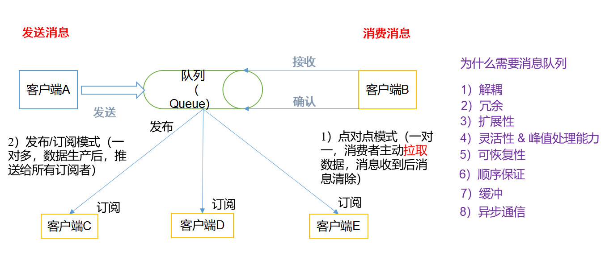

（1）点对点模式（一对一，消费者主动拉取数据，消息收到后消息清除）

点对点模型通常是一个基于拉取或者轮询的消息传送模型，这种模型从队列中请求信息，而不是将消息推送到客户端。这个模型的特点是发送到队列的消息被一个且只有一个接收者接收处理，即使有多个消息监听者也是如此。

（2）发布/订阅模式（一对多，数据生产后，推送给所有订阅者）

发布订阅模型则是一个基于推送的消息传送模型。发布订阅模型可以有多种不同的订阅者，临时订阅者只在主动监听主题时才接收消息，而持久订阅者则监听主题的所有消息，即使当前订阅者不可用，处于离线状态。

使用消息队列的好处

1）解耦

允许你独立的扩展或修改两边的处理过程，只要确保它们遵守同样的接口约束。

2）可恢复性

系统的一部分组件失效时，不会影响到整个系统。消息队列降低了进程间的耦合度，所

以即使一个处理消息的进程挂掉，加入队列中的消息仍然可以在系统恢复后被处理。

3）缓冲

有助于控制和优化数据流经过系统的速度，解决生产消息和消费消息的处理速度不一致

的情况。

4）灵活性  &峰值处理能力

在访问量剧增的情况下，应用仍然需要继续发挥作用，但是这样的突发流量并不常见。

如果为以能处理这类峰值访问为标准来投入资源随时待命无疑是巨大的浪费。使用消息队列

能够使关键组件顶住突发的访问压力，而不会因为突发的超负荷的请求而完全崩溃。

5）异步通信

很多时候，用户不想也不需要立即处理消息。消息队列提供了异步处理机制，允许用户

把一个消息放入队列，但并不立即处理它。想向队列中放入多少消息就放多少，然后在需要

的时候再去处理它们。

### 1.3，kafka架构

1. 整体架构

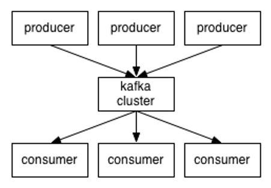

2. 局部架构

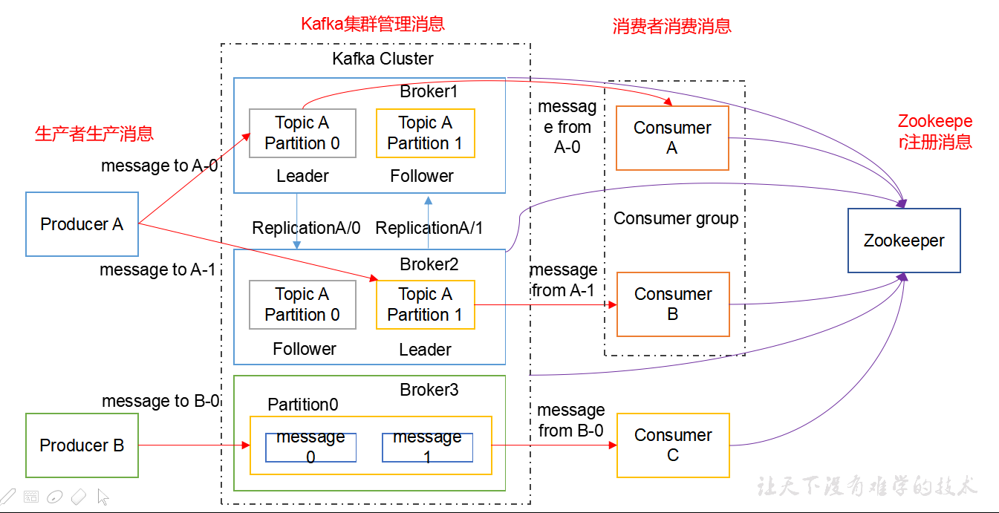

1）Producer ：消息生产者，就是向kafka broker发消息的客户端；

2）Consumer ：消息消费者，向kafka broker取消息的客户端；

3）Topic ：可以理解为一个队列,把各种各样的消息进行分类存放。

4） Consumer Group （CG）：消费者组，这是kafka用来实现一个topic消息的广播（发给所有的consumer）和单播（发给任意一个consumer）的手段。一个topic可以有多个CG。topic的消息会复制（不是真的复制，是概念上的）到所有的CG，但每个partion只会把消息发给该CG中的一个consumer。如果需要实现广播，只要每个consumer有一个独立的CG就可以了。要实现单播只要所有的consumer在同一个CG。用CG还可以将consumer进行自由的分组而不需要多次发送消息到不同的topic，消费者组，由多个   consumer组成。消费者组内每个消费者负责消费不同分区的数据，一个分区只能由一个组内消费者消费；消费者组之间互不影响。所有的消费者都属于某个消费者组，即消费者组是逻辑上的一个订阅者。

5）Broker ：一台kafka服务器就是一个broker。一个集群由多个broker组成。一个broker可以容纳多个topic；

6）Partition：为了实现扩展性，一个非常大的topic可以分布到多个broker（即服务器）上，一个topic可以分为多个partition，每个partition是一个有序的队列。partition中的每条消息都会被分配一个有序的id（offset）。kafka只保证按一个partition中的顺序将消息发给consumer，不保证一个topic的整体（多个partition间）的顺序；提高读写并发度和负载均衡能力。

7）Offset：kafka的存储文件都是按照offset.kafka来命名，用offset做名字的好处是方便查找。例如你想找位于2049的位置，只要找到2048.kafka的文件即可。当然the first offset就是00000000000.kafka。

8），副本，做数据的备份，但是要保证一致性。

9）0.9版本之前消费者连接在zookeeper集群上，但是在0.9版本之后消费者连接在kafka集群本地。

**10）Replica**：副本，为保证集群中的某个节点发生故障时，该节点上的 partition数据不丢失，且 kafka仍然能够继续工作，kafka提供了副本机制，一个  topic的每个分区都有若干个副本，一个 **leader**和若干个  **follower**。

11）**leader**：每个分区多个副本的“主”，生产者发送数据的对象，以及消费者消费数据的对象都是 leader。

12）**follower**：每个分区多个副本中的“从”，实时从 leader中同步数据，保持和  leader数据的同步。leader发生故障时，某个  follower会成为新的  leader。

## 第二章，kafka部署

### 2.1，集群搭建

1. 集群规划

hadoop102					hadoop103				hadoop104

zk							zk						zk

kafka						kafka					kafka

2. 解压安装包

~~~ java
tar -zxvf kafka_2.11-0.11.0.0.tgz -C /opt/module/
~~~

3. 修改文件名

~~~ java
mv kafka_2.11-0.11.0.0/ kafka
~~~

4. 在/opt/module/kafka目录下创建logs文件夹

~~~ java
mkdir logs//此目录存放logs日志和kafka的缓存数据文件
~~~

5. 修改配置文件

~~~ java
#broker的全局唯一编号，不能重复
broker.id=0
#删除topic功能使能
delete.topic.enable=true
#处理网络请求的线程数量
num.network.threads=3
#用来处理磁盘IO的现成数量
num.io.threads=8
#发送套接字的缓冲区大小
socket.send.buffer.bytes=102400
#接收套接字的缓冲区大小
socket.receive.buffer.bytes=102400
#请求套接字的缓冲区大小
socket.request.max.bytes=104857600
#kafka运行日志存放的路径	
log.dirs=/opt/module/kafka/logs
#topic在当前broker上的分区个数
num.partitions=1
#用来恢复和清理data下数据的线程数量
num.recovery.threads.per.data.dir=1
#segment文件保留的最长时间，超时将被删除
log.retention.hours=168
#配置连接Zookeeper集群地址
zookeeper.connect=hadoop102:2181,hadoop103:2181,hadoop104:2181
~~~

6. 配置环境变量

~~~ java
#KAFKA_HOME
export KAFKA_HOME=/opt/module/kafka
export PATH=$PATH:$KAFKA_HOME/bin
~~~

7. 分发安装包

~~~ java
xsync
//注意：分发之后记得配置其他机器的环境变量
~~~

8. 分别在hadoop103和hadoop104上修改配置文件/opt/module/kafka/config/server.properties中的broker.id=1、broker.id=2

   ​	注：broker.id不得重复

9. 启动集群

~~~ java
bin/kafka-server-start.sh config/server.properties &//&标示启动为后台程序
~~~

10. 关闭集群

~~~ java
bin/kafka-server-stop.sh stop
//每一台机器都要单独关闭集群，可以写脚本控制关闭集群
~~~

### 2.3，Kafka命令行控制

1. 查看当前服务器中的所有topic

~~~ java
bin/kafka-topics.sh --list --zookeeper hadoop101:2181//我们要连接zookeeper从zookeeper获取所有的topic
~~~

2. 创建topic

   选项说明：

   --topic 定义topic名

   --replication-factor  定义副本数

   --partitions  定义分区数

~~~ java
bin/kafka-topics.sh --create --zookeeper hadoop101:2181 --topic first --partitions 2 --replication-factor 2
//kafka依赖于zookeeper，所以创建topic时候要写入zookeeper，--topic标示创建topic的名字，--partition标示创建分区个数，--replication-factor 标示创建副本个数,此处的副本数目要小于节点个数
~~~

3. 删除topic

~~~ java
 bin/kafka-topics.sh --delete --zookeeper hadoop101:2181 --topic first
Topic first is marked for deletion.
Note: This will have no impact if delete.topic.enable is not set to true.
//需要server.properties中设置delete.topic.enable=true否则只是标记删除或者直接重启。
~~~

4. 查看topic的描述信息

~~~java
bin/kafka-topics.sh --describe --topic first --zookeeper hadoop101:2181
//查看所有的topic
bin/kafka-topics.sh --list --zookeeper hadoop101:2181//我们要连接zookeeper从zookeeper获取所有的topic
~~~

5. 控制台模拟生产者和消费者

~~~ java
//开启生产者
[rzf@hadoop101 kafka]$ bin/kafka-console-producer.sh --topic first --broker-list hadoop101:9092
//在其他主机用过时的消费者连接kafka可以接受数据，老版本的消费者集成在zookeeper中，而新版本集成在本地
    bin/kafka-console-consumer.sh --topic first --zookeeper hadoop101:2181
Using the ConsoleConsumer with old consumer is deprecated and will be removed in a future major release. Consider using the new consumer by passing [bootstrap-server] instead of [zookeeper].
//在hadoop103主机上面启动消费者，但是需要添加--from-beginning参数
bin/kafka-console-consumer.sh --topic first --zookeeper hadoop101:2181 --from-beginning
Using the ConsoleConsumer with old consumer is deprecated and will be removed in a future major release. Consider using the new consumer by passing [bootstrap-server] instead of [zookeeper].
rzf
//用新的api消费数据，即本地集群，--bootstrap-server标示本地集群9092端口，如果不添加-from-beginning的话不会消费集群启动以前的数据，
bin/kafka-console-consumer.sh --topic first --bootstrap-server hadoop101:9092

~~~

6. 数据和日志分离

~~~ java
//关闭zookeeper集群和kafka集群
//删除zookeeper集群里面的内容
bin/zkCli.sh//登录zookeeper客户端
ls /   //查看节点内容
//删除没有用的内容
[zk: localhost:2181(CONNECTED) 1] ls /
[cluster, controller_epoch, brokers, zookeeper, kafka-manager, admin, isr_change_notification, consumers, latest_producer_id_block, config]
//这里面除了zookeeper外，全部是kafka产生的内容
rmr /cluster删除命令
//修改kafka配置文件中数据的存放目录
log.dirs=/opt/module/kaf/kafka/data  //每一个节点全部要修改
//现在重新启动zookeeeper和kafka，应为没有创建主题，所以data目录下面没有主题文件夹
//现在重新创建一个topic
[rzf@hadoop101 kafka]$ bin/kafka-topics.sh --create --zookeeper hadoop101:2181 --topic first --partitions 2 --replication-factor 3
Created topic "first".
//发现logs文件夹内没有topic文件夹
//在data文件夹内发现两个副本，00000000000000000000.log是实际存放kafka产生数据的地方
~~~

## 第三章，Kafka工作机制

### 3.1，**Kafka**工作流程及文件存储机制

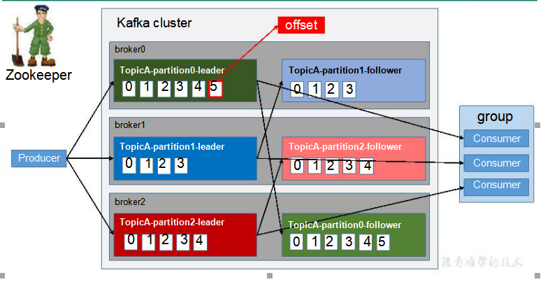

Kafka中消息是以  **topic**进行分类的，生产者生产消息，消费者消费消息，都是面向   topic

的。topic是==逻辑上的概念==，==而partition是物理上的概念==，每个 partition对应于一个 log文

件，该 log文件中存储的就是  producer生产的数据。Producer生产的数据会被不断追加到该

log文件末端，且每条数据都有自己的  offset。消费者组中的每个消费者，都会实时记录自己

消费到了哪个 offset，以便出错恢复时，从上次的位置继续消费。

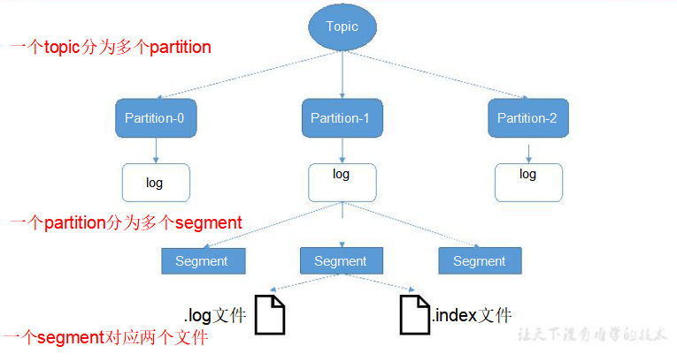

由于生产者生产的消息会不断追加到 log文件末尾，为防止  log文件过大导致数据定位

效率低下，Kafka采取了分片和索引机制，将每个  partition分为多个  segment。每个  segment

对应两个文件——“.index”文件和“.log”文件。这些文件位于一个文件夹下，该文件夹的命名

规则为：topic名称+分区序号。例如，first这个   topic有三个分区，则其对应的文件夹为   first-

0,first-1,first-2。

~~~ java
00000000000000000000.index
00000000000000000000.log
00000000000000170410.index
00000000000000170410.log
00000000000000239430.index
00000000000000239430.log
~~~

index和  log文件以当前   segment的第一条消息的  offset命名。下图为   index文件和   log

文件的结构示意图

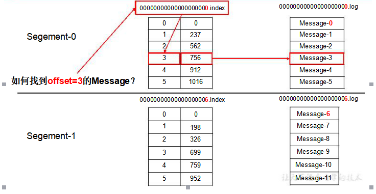

上面kafka再查找偏移量的时候是以二分查找法进行查找的。查找原理是：文件头的偏移量和文件大小快速定位。“.index”文件存储大量的索引信息，“.log”文件存储大量的数据，索引文件中的元数据指向对应数据文件中 message的物理偏移地址。

### 3.2，Kafka生产者写入数据

0. 副本

   同一个partition可能会有多个replication（对应 server.properties 配置中default.replication.factor=N）没有replication的情况下，一旦broker 宕机，其上所有 patition 的数据都不可被消费，同时producer也不能再将数据存于其上的patition。引入replication之后，同一个partition可能会有多个replication，而这时需要在这些replication之间选出一个leader，producer和consumer只与这个leader交互，其它replication的follower从leader 中复制数据。

1. 写入方式：

   producer采用推（push）模式将消息发布到broker，每条消息都被追加（append）到分区（patition）中，属于顺序写磁盘（顺序写磁盘效率比随机写内存要高，保障kafka吞吐率）。

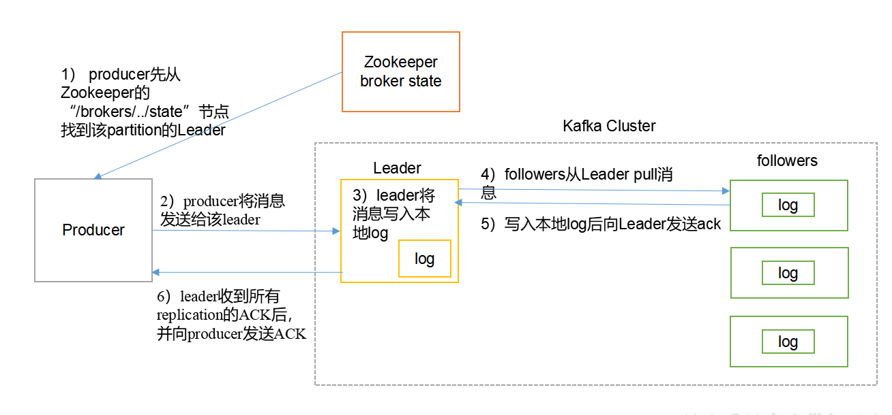

​	1）producer先从zookeeper的 "/brokers/.../state"节点找到该partition的leader

​	2）producer将消息发送给该leader

​	3）leader将消息写入本地log

​	4）followers从leader pull消息，写入本地log后向leader发送ACK

​	5）leader收到所有ISR中的replication的ACK后，增加HW（high watermark，最后commit 的offset）并向		producer发送ACK

- broker写入消息
  - 存储方式：物理上把topic分成一个或多个patition（对应 server.properties 中的num.partitions=3配置），每个patition物理上对应一个文件夹（该文件夹存储该patition的所有消息和索引文件），如下：

~~~ java
first-0
first-1
first-2
//每一个副本里面的内容
00000000000000000000.index
00000000000000000000.log
00000000000000000000.timeindex
leader-epoch-checkpoint
~~~

- 存储策略

  无论消息是否被消费，kafka都会保留所有消息。有两种策略可以删除旧数据：

  1）基于时间：log.retention.hours=168

  2）基于大小：log.retention.bytes=1073741824

  需要注意的是，因为Kafka读取特定消息的时间复杂度为O(1)，即与文件大小无关，所以这里删除过期文件与提高 Kafka 性能无关

- zookeeper的存储结构

注意：producer不在zk中注册，消费者在zk中注册。

2. 分区（partition）

   消息发送时都被发送到一个topic，其本质就是一个目录，而topic是由一些Partition Logs(分区日志)组成，其组织结构如下图所示：

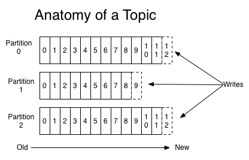

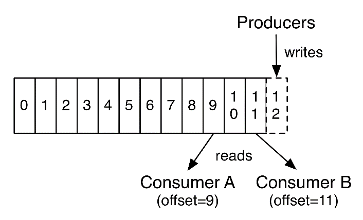

我们可以看到，每个Partition中的消息都是有序的，生产的消息被不断追加到Partition log上，其中的每一个消息都被赋予了一个唯一的offset值。

1）分区的原因

（1）方便在集群中扩展，每个Partition可以通过调整以适应它所在的机器，而一个topic又可以有多个Partition组成，因此整个集群就可以适应任意大小的数据了；

（2）可以提高并发，因为可以以Partition为单位读写了。

2）分区的原则

（1）指定了patition，则直接使用；

（2）未指定patition但指定key，通过对key的value进行hash出一个patition；

（3）既没有  partition值又没有    key值的情况下，第一次调用时随机生成一个整数（后面每次调用在这个整数上自增），将这个值与  topic可用的    partition总数取余得到    partition值，也就是常说的  round-robin算法。.

我们需要将 producer发送的数据封装成一个  **ProducerRecord**对象

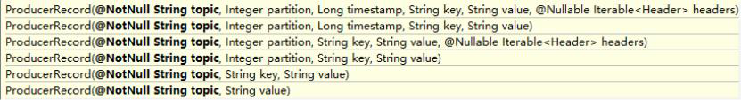

3. 数据写入的可靠性保证。

   为保证 producer发送的数据，能可靠的发送到指定的  topic，topic的每个  partition收到

   producer发送的数据后，都需要向   producer发送   ack（acknowledgement确认收到），如果

   producer收到  ack，就会进行下一轮的发送，否则重新发送数据。

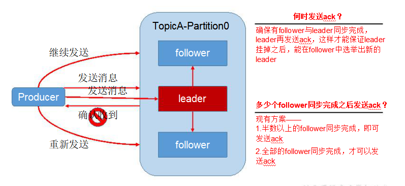

- 副本数据同步策略

| 方案                            | 优点                                             | 缺点                                            |
| ------------------------------- | ------------------------------------------------ | ----------------------------------------------- |
| 半数以上同步完成，发送ack确认   | 延迟低                                           | 选举新的节点时，容忍n个节点故障，需要2n+1个副本 |
| 全部同步完成以后，才发送ack确认 | 选举新的leader时，容忍n台节点故障，需要n+1个副本 | 延迟低                                          |

Kafka选择了第二种方案，原因如下：

- 同样为了容忍 n台节点的故障，第一种方案需要   2n+1个副本，而第二种方案只需要    n+1个副本，而 Kafka的每个分区都有大量的数据，第一种方案会造成大量数据的冗余。

- 虽然第二种方案的网络延迟会比较高，但网络延迟对 Kafka的影响较小。

4. ISR:

   采用第二种方案之后，设想以下情景：leader收到数据，所有  follower都开始同步数据，

   但有一个 follower，因为某种故障，迟迟不能与 leader进行同步，那  leader就要一直等下去，

   直到它完成同步，才能发送 ack。这个问题怎么解决呢？

   - Leader维护了一个动态的  in-sync replica set (ISR)，意为和 leader保持同步的 follower集

   合。当 ISR中的  follower完成数据的同步之后，leader就会给   follower发送  ack。如果  follower

   长时间未向leader同步数据，则该follower将被踢出ISR，该时间阈值由**replica.lag.time.max.ms**参数设定。Leader发生故障之后，就会从ISR中选举新的leader。

5. **ack**应答机制

   ​	对于某些不太重要的数据，对数据的可靠性要求不是很高，能够容忍数据的少量丢失，

   所以没必要等 ISR中的  follower全部接收成功。

   ​	所以 Kafka为用户提供了三种可靠性级别，用户根据对可靠性和延迟的要求进行权衡，

   选择以下的配置。

   ACKS参数配置：

   - 0：producer不等待  broker的  ack，这一操作提供了一个最低的延迟，broker一接收到还没有写入磁盘就已经返回，当 broker故障时有可能丢失数据；
   - 1：producer等待  broker的ack，partition的  leader落盘成功后返回  ack，如果在  follower同步成功之前 leader故障，那么将会丢失数据；
   - -1（all）：producer等待  broker的  ack，partition的  leader和  follower全部落盘成功后才返回 ack。但是如果在 follower同步完成后，broker发送   ack之前，leader发生故障，那么会造成数据重复。

6. 故障处理细节

​	**LEO**：指的是每个副本最大的 **offset**；

​	**HW**：指的是消费者能见到的最大的 **offset**，**ISR**队列中最小的  **LEO**。

1. **follower**故障

   follower发生故障后会被临时踢出  ISR，待该 follower恢复后，follower会读取本地磁盘记录的上次的 HW，并将 log文件高于  HW的部分截取掉，从  HW开始向  leader进行同步。等该 **follower**的  **LEO**大于等于该  **Partition**的  **HW**，即 follower追上  leader之后，就可以重新加入 ISR了。

2. **leader**故障

   leader发生故障之后，会从  ISR中选出一个新的  leader，之后，为保证多个副本之间的数据一致性，其余的 follower会先将各自的  log文件高于  HW的部分截掉，然后从新的   leader同步数据。

注意：这只能保证副本之间的数据一致性，并不能保证数据不丢失或者不重复。

7. **Exactly Once**语义

   将服务器的 ACK级别设置为-1，可以保证  Producer到  Server之间不会丢失数据，即   At

   Least Once语义。相对的，将服务器   ACK级别设置为   0，可以保证生产者每条消息只会被

   发送一次，即 At Most Once语义。

   At Least Once可以保证数据不丢失，但是不能保证数据不重复；相对的，At Least Once

   可以保证数据不重复，但是不能保证数据不丢失。但是，对于一些非常重要的信息，比如说

   交易数据，下游数据消费者要求数据既不重复也不丢失，即 Exactly  Once语义。在  0.11版

   本以前的 Kafka，对此是无能为力的，只能保证数据不丢失，再在下游消费者对数据做全局

   去重。对于多个下游应用的情况，每个都需要单独做全局去重，这就对性能造成了很大影响。

   0.11版本的  Kafka，引入了一项重大特性：幂等性。所谓的幂等性就是指 Producer不论

   向 Server发送多少次重复数据，Server端都只会持久化一条。幂等性结合   At  Least Once语

   义，就构成了 Kafka的  Exactly Once语义。即：

   ​	At Least Once +幂等性    = Exactly Once

   要启用幂等性，只需要将 Producer的参数中  enable.idompotence设置为  true即可。Kafka

   的幂等性实现其实就是将原来下游需要做的去重放在了数据上游。开启幂等性的 Producer在

   初始化的时候会被分配一个  PID，发往同一  Partition的消息会附带    Sequence Number。而

   Broker端会对<PID,  Partition, SeqNumber>做缓存，当具有相同主键的消息提交时，Broker只

   会持久化一条。

   但是 PID重启就会变化，同时不同的  Partition也具有不同主键，所以幂等性无法保证跨

   分区跨会话的 Exactly Once。

### 3.3，**Kafka**消费者

1. 消费方式

   - consumer采用  pull（拉）模式从 broker中读取数据。

   - push（推）模式很难适应消费速率不同的消费者，因为消息发送速率是由 broker决定的。

     它的目标是尽可能以最快速度传递消息，但是这样很容易造成 consumer来不及处理消息，典型的表现就是拒绝服务以及网络拥塞。而 pull模式则可以根据  consumer的消费能力以适当的速率消费消息。对于Kafka而言，pull模式更合适，它可简化broker的设计，consumer可自主控制消费消息的速率，同时consumer可以自己控制消费方式——即可批量消费也可逐条消费，同时还能选择不同的提交方式从而实现不同的传输语义

   - pull模式不足之处是，如果  kafka没有数据，消费者可能会陷入循环中，一直返回空数

     据。针对这一点，Kafka的消费者在消费数据时会传入一个时长参数  timeout，如果当前没有

     数据可供消费，consumer会等待一段时间之后再返回，这段时长即为  timeout。

2. 分区分配策略

   一个 consumer group中有多个  consumer，一个  topic有多个  partition，所以必然会涉及

   到 partition的分配问题，即确定那个  partition由哪个  consumer来消费。

   Kafka有两种分配策略，一是  RoundRobin（按照组分配），一是 Range（按照主题分配）。

   - **RoundRobin**（按照组分配）
   -  Range（按照主题分配）

3. **offset**的维护

   由于 consumer在消费过程中可能会出现断电宕机等故障，consumer恢复后，需要从故

   障前的位置的继续消费，所以 consumer需要实时记录自己消费到了哪个  offset，以便故障恢

   复后继续消费。

   

   Kafka 0.9版本之前，consumer默认将     offset保存在   Zookeeper中，从  0.9版本开始，consumer默认将  offset保存在  Kafka一个内置的  topic中，该  topic为**__consumer_offsets**。

   修改配置文件  consumer.properties

   ~~~ java
   exclude.internal.topics=false
   ~~~

   读取  offset

   ​	0.11.0.0之前版本:

   ~~~ java
   bin/kafka-console-consumer.sh   --topic    __consumer_offsets   --
   zookeeper
   hadoop102:2181
   --formatter
   "kafka.coordinator.GroupMetadataManager\$OffsetsMessageFormatter"
   --consumer.config config/consumer.properties --from-beginning
   ~~~

   ​	0.11.0.0之后版本(含):

   ~~~ java
   bin/kafka-console-consumer.sh   --topic    __consumer_offsets   --
   zookeeper
   hadoop102:2181
   --formatter
   "kafka.coordinator.group.GroupMetadataManager\$OffsetsMessageForm
   atter"   --consumer.config    config/consumer.properties   --from-
   beginning
   ~~~

   4. Kafka高效读写数据

      - 顺序写磁盘

        Kafka的  producer生产数据，要写入到  log文件中，写的过程是一直追加到文件末端，为顺序写。官网有数据表明，同样的磁盘，顺序写能到 600M/s，而随机写只有 100K/s。这与磁盘的机械机构有关，顺序写之所以快，是因为其省去了大量磁头寻址的时间。

      - 零复制技术

   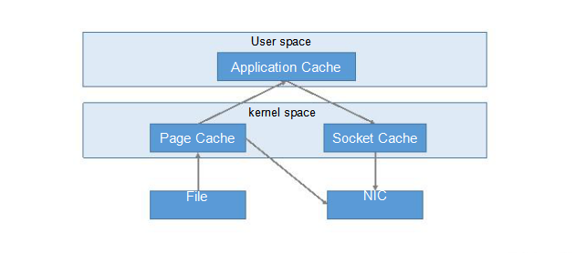

   5. zookeeper在kafka中的作用

      Kafka集群中有一个  broker会被选举为   Controller，负责管理集群 broker的上下线，所有 topic的分区副本分配和  leader选举等工作。

      Controller的管理工作都是依赖于  Zookeeper的。

   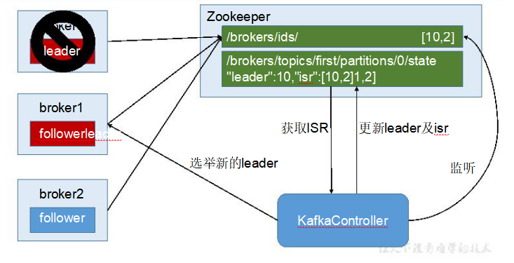

   

   6. Kafka事务

      Kafka从  0.11版本开始引入了事务支持。事务可以保证  Kafka在  Exactly Once语义的基础上，生产和消费可以跨分区和会话，要么全部成功，要么全部失败。

      - **Producer**事务

        为了实现跨分区跨会话的事务，需要引入一个全局唯一的 Transaction ID，并将  Producer

        获得的 PID和 Transaction ID绑定。这样当 Producer重启后就可以通过正在进行的   Transaction

        ID获得原来的  PID。

        为了管理 Transaction，Kafka引入了一个新的组件  Transaction Coordinator。Producer就

        是通过和   Transaction Coordinator交互获得     Transaction  ID对应的任务状态。   Transaction

        Coordinator还负责将事务所有写入  Kafka的一个内部  Topic，这样即使整个服务重启，由于

        事务状态得到保存，进行中的事务状态可以得到恢复，从而继续进行。

      - **Consumer**事务

        上述事务机制主要是从 Producer方面考虑，对于  Consumer而言，事务的保证就会相对

        较弱，尤其时无法保证 Commit的信息被精确消费。这是由于   Consumer可以通过  offset访

        问任意信息，而且不同的 Segment File生命周期不同，同一事务的消息可能会出现重启后被

        删除的情况。

## 第四章，KafkaApi操作

1. 生产者