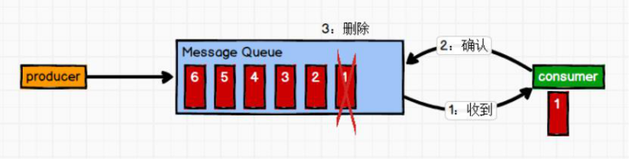
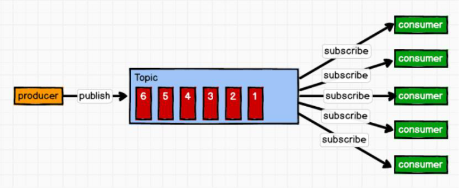
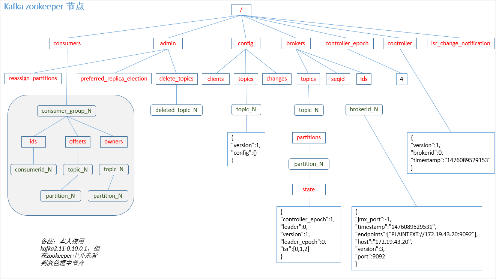
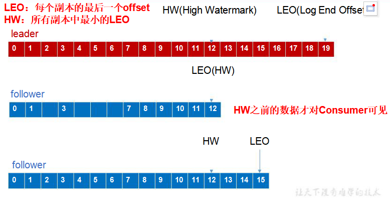

# Kafka

## 第一章，Kafka概述

### 1.1，什么是Kafka

1. `Kafka`是一个分布式的基于发布/订阅模式的消息队列`（Message   Queue）`，主要应用于

大数据实时处理领域。

2. 在流式计算中，`Kafka`一般用来缓存数据，`Storm`通过消费Kafka的数据进行计算。

​	1）`Apache Kafka`是一个开源**消息**系统，由`Scala`写成。是由`Apache`软件基金会开发的一个开源消息系统项目。

​	2）`Kafka`最初是由`LinkedIn`公司开发，并于2011年初开源。2012年10月从`Apache Incubator`毕业。该项目的目标是为处理实时数据提供一个统一、高通量、低等待的平台。

​	3）**`Kafka`是一个分布式消息队列。**`Kafka`对消息保存时根据`Topic`进行归类，发送消息者称为`Producer`，消息接受者称为`Consumer`，此外`kafka`集群有多个`kafka`实例组成，每个实例(`server`)称为`broker`。

​	4）无论是`kafka`集群，还是`consumer`都依赖于**`zookeeper`**集群保存一些`meta`信息，来保证系统可用性。

### 1.2，消息队列

- **消息队列的两种方式**

  （1）点对点模式（一对一，消费者主动拉取数据，消息收到后消息清除）

  ​	点对点模型通常是一个基于拉取或者轮询的消息传送模型，这种模型从队列中请求信息，而不是将消息推送到客户端。这个模型的特点是发送到队列的消息被一个且只有一个接收者接收处理，即使有多个消息监听者也是如此。消息生产者生产消息发送到` Queue`中，然后消息消费者从` Queue`中取出并且消费消息。消息被消费以后，`queue`中不再有存储，所以消息消费者不可能消费到已经被消费的消息。`Queue`支持存在多个消费者，但是对一个消息而言，只会有一个消费者可以消费。

​	（2）发布/订阅模式（一对多，数据生产后，推送给所有订阅者）

​		发布订阅模型则是一个基于推送的消息传送模型。发布订阅模型可以有多种不同的订阅者，临时订阅者只在主动监听主题时才接收消息，而持久订阅者则监听主题的所有消息，即使当前订阅者不可用，处于离线状态。消息生产者（发布）将消息发布到` topic`中，同时有多个消息消费者（订阅）消费该消息。*和点对点方式不同，发布到 topic`的消息会被所有订阅者消费。*

- **使用消息队列的好处**

​	1）解耦

​	允许你独立的扩展或修改两边的处理过程，只要确保它们遵守同样的接口约束。

​	2）可恢复性

​	系统的一部分组件失效时，不会影响到整个系统。消息队列降低了进程间的耦合度，所以即使一个处理消息的进程挂掉，加入队列中的消息仍然可以在系统恢复后被处理。

​	3）缓冲

​	有助于控制和优化数据流经过系统的速度，解决生产消息和消费消息的处理速度不一致的情况。

​	4）灵活性  &峰值处理能力

​	在访问量剧增的情况下，应用仍然需要继续发挥作用，但是这样的突发流量并不常见。如果为以能处理这类峰值访问为标准来投入资源随时待命无疑是巨大的浪费。使用消息队列能够使关键组件顶住突发的访问压力，而不会因为突发的超负荷的请求而完全崩溃。

​	5）异步通信

​	很多时候，用户不想也不需要立即处理消息。消息队列提供了异步处理机制，允许用户把一个消息放入队列，但并不立即处理它。想向队列中放入多少消息就放多少，然后在需要的时候再去处理它们。

### 1.3，kafka架构

1. 整体架构

2. 局部架构

​	1）`Producer` ：消息生产者，就是向`kafka broker`发消息的客户端；

​	2）`Consumer` ：消息消费者，向`kafka broker`取消息的客户端；

​	3）`Topic` ：可以理解为一个队列,把各种各样的消息进行分类存放，并且每一个主题都有分区，分区还有副本。

​	4） `Consumer Group （CG`）：消费者组，这是`kafka`用来实现一个`topic`消息的广播（发给所有的`consumer`）和单播（发给任意一个`consumer`）的手段。一个`topic`可以有多个`CG`。`topic`的消息会复制（不是真的复制，是概念上的）到所有的`CG`，但每个`partion`只会把消息发给该`CG`中的一个`consumer`。如果需要实现广播，只要每个`consumer`有一个独立的`CG`就可以了。要实现单播只要所有的`consumer`在同一个`CG`。用`CG`还可以将`consumer`进行自由的分组而不需要多次发送消息到不同的`topic`，消费者组，由多个 `  consumer`组成。**消费者组内每个消费者负责消费不同分区的数据，一个分区只能由一个组内消费者消费；消费者组之间互不影响。**所有的消费者都属于某个消费者组，即消费者组是逻辑上的一个订阅者。并发度最好的时候是消费者组里面的消费者和生产者个数相等的时候。

​	5）`Broker` ：一台`kafka`服务器就是一个`broker`。一个集群由多个`broker`组成。一个`broker`可以容纳多个`topic`；

​	6）`Partition`：为了实现扩展性，一个非常大的`topic`可以分布到多个`broker`（即服务器）上，一个`topic`可以分为多个`partition`，每个`partition`是一个有序的队列。`partition`中的每条消息都会被分配一个有序的`id（offset）`。`kafka`只保证按一个`partition`中的顺序将消息发给`consumer`，不保证一个`topic`的整体（多个`partition`间）的顺序；提高读写并发度和负载均衡能力。

​	7）`Offset`：`kafka`的存储文件都是按照`offset.kafka`来命名，用`offset`做名字的好处是方便查找。例如你想找位于2049的位置，只要找到`2048.kafka`的文件即可。当然`the first offset`就是`00000000000.kafka`。

​	8）0.9版本之前**消费者**连接在`zookeeper`集群上，但是在0.9版本之后消费者连接在`kafka`集群本地的一个`topic`上面。

​	9）`Replica`**：副本，为保证集群中的某个节点发生故障时，该节点上的 `partition`数据不丢失，且 `kafka`仍然能够继续工作，`kafka`提供了副本机制，一个`  topic`的每个分区都有若干个副本，一个 **`leader`**和若干个  **`follower`。

​	10）**`leader`**：每个分区多个副本的“主”，生产者发送数据的对象，以及消费者消费数据的对象都是 `leader`。

​	11）**`follower`**：每个分区多个副本中的“从”，实时从` leader`中同步数据，保持和`  leader`数据的同步。`leader`发生故障时，某个  `follower`会成为新的 ` leader`。

## 第二章，kafka部署

### 2.1，集群搭建

1. 集群规划

   | hadoop101 | hadoop102 | hadoop103 |
   | --------- | --------- | --------- |
   | zk        | zk        | zk        |
   | kafka     | kafka     | kafka     |

2. 解压安装包

~~~ java
tar -zxvf kafka_2.11-0.11.0.0.tgz -C /opt/module/
~~~

3. 修改文件名

~~~ java
mv kafka_2.11-0.11.0.0/ kafka
~~~

4. 在`/opt/module/kafka`目录下创建`logs`文件夹

~~~ java
mkdir logs//此目录存放logs日志和kafka的缓存数据文件
~~~

5. 修改配置文件

~~~ java
//broker的全局唯一编号，不能重复
broker.id=0
//删除topic功能使能
delete.topic.enable=true
//处理网络请求的线程数量
num.network.threads=3
//用来处理磁盘IO的现成数量
num.io.threads=8
//发送套接字的缓冲区大小
socket.send.buffer.bytes=102400
//接收套接字的缓冲区大小
socket.receive.buffer.bytes=102400
 //请求套接字的缓冲区大小
socket.request.max.bytes=104857600
//kafka运行日志存放的路径	
log.dirs=/opt/module/kafka/logs
//topic在当前broker上的分区个数
num.partitions=1
//用来恢复和清理data下数据的线程数量
num.recovery.threads.per.data.dir=1
//segment文件保留的最长时间，超时将被删除
log.retention.hours=168
//配置连接Zookeeper集群地址
zookeeper.connect=hadoop101:2181,hadoop102:2181,hadoop103:2181
~~~

6. 配置环境变量

~~~ java
#KAFKA_HOME
export KAFKA_HOME=/opt/module/kafka
export PATH=$PATH:$KAFKA_HOME/bin
~~~

7. 分发安装包

~~~ java
xsync
//注意：分发之后记得配置其他机器的环境变量
~~~

8. 分别在`hadoop102`和`hadoop103`上修改配置文件`/opt/module/kafka/config/server.properties`中的`broker.id=1、broker.id=2`

   注：`broker.id`不得重复

9. 启动集群

~~~ java
bin/kafka-server-start.sh config/server.properties &//&标示启动为后台程序
~~~

10. 关闭集群

~~~ java
bin/kafka-server-stop.sh stop
//每一台机器都要单独关闭集群，可以写脚本控制关闭集群
~~~

### 2.3，Kafka命令行控制

1. 查看当前服务器中的所有`topic`

~~~ java
bin/kafka-topics.sh --list --zookeeper hadoop101:2181//我们要连接zookeeper从zookeeper获取所有的topic
~~~

2. 创建`topic`

   - 选项说明：

   `--topic`: 定义`topic`名。

   `--replication-factor`:  定义副本数。

   `--partitions `： 定义分区数。

~~~ java
bin/kafka-topics.sh --create --zookeeper hadoop101:2181 --topic first --partitions 2 --replication-factor 2
//kafka依赖于zookeeper，所以创建topic时候要写入zookeeper，--topic标示创建topic的名字，--partition标示创建分区个数，--replication-factor 标示创建副本个数,此处的副本数目要小于节点个数
~~~

3. 删除`topic`

~~~ java
 bin/kafka-topics.sh --delete --zookeeper hadoop101:2181 --topic first
Topic first is marked for deletion.
Note: This will have no impact if delete.topic.enable is not set to true.
//需要server.properties中设置delete.topic.enable=true否则只是标记删除或者直接重启。
~~~

4. 查看`topic`的描述信息

~~~java
bin/kafka-topics.sh --describe --topic first --zookeeper hadoop101:2181
//查看所有的topic
bin/kafka-topics.sh --list --zookeeper hadoop101:2181//我们要连接zookeeper从zookeeper获取所有的topic
~~~

5. 控制台模拟生产者和消费者

~~~ java
//开启生产者
[rzf@hadoop101 kafka]$ bin/kafka-console-producer.sh --topic first --broker-list hadoop101:9092
//在其他主机用过时的消费者连接kafka可以接受数据，老版本的消费者集成在zookeeper中，而新版本集成在本地的topic中
bin/kafka-console-consumer.sh --topic first --zookeeper hadoop101:2181
Using the ConsoleConsumer with old consumer is deprecated and will be removed in a future major release. Consider using the new consumer by passing [bootstrap-server] instead of [zookeeper].
//在hadoop103主机上面启动消费者，但是需要添加--from-beginning参数
bin/kafka-console-consumer.sh --topic first --zookeeper hadoop101:2181 --from-beginning
Using the ConsoleConsumer with old consumer is deprecated and will be removed in a future major release. Consider using the new consumer by passing [bootstrap-server] instead of [zookeeper].
rzf
//用新的api消费数据，即本地集群，--bootstrap-server标示本地集群9092端口，如果不添加-from-beginning的话不会消费集群启动以前的数据，
bin/kafka-console-consumer.sh --topic first --bootstrap-server hadoop101:9092
//修改分区数
bin/kafka-topics.sh    --zookeeper hadoop101:2181 --alter --topic first --partitions 6
~~~

6. 数据和日志分离

~~~ java
//关闭zookeeper集群和kafka集群
//删除zookeeper集群里面的内容
bin/zkCli.sh//登录zookeeper客户端
ls /   //查看节点内容
//删除没有用的内容
[zk: localhost:2181(CONNECTED) 1] ls /
[cluster, controller_epoch, brokers, zookeeper, kafka-manager, admin, isr_change_notification, consumers, latest_producer_id_block, config]
//这里面除了zookeeper外，全部是kafka产生的内容
rmr /cluster删除命令
//修改kafka配置文件中数据的存放目录
log.dirs=/opt/module/kaf/kafka/data  //每一个节点全部要修改
//现在重新启动zookeeeper和kafka，应为没有创建主题，所以data目录下面没有主题文件夹
//现在重新创建一个topic
[rzf@hadoop101 kafka]$ bin/kafka-topics.sh --create --zookeeper hadoop101:2181 --topic first --partitions 2 --replication-factor 3
Created topic "first".
//发现logs文件夹内没有topic文件夹
//在data文件夹内发现两个副本，00000000000000000000.log是实际存放kafka产生数据的地方
~~~

## 第三章，Kafka工作机制

### 3.1，**Kafka**工作流程及文件存储机制

- 上图表示`kafka`集群有一个`topic A`,并且有三个分区，分布在三个节点上面，注意点：每个分区有两个副本，两个副本分别是`leader,follower`,并且每一个副本一定不和自己的`leader`分布在一个节点上面。`Kafka`中消息是以  **`topic`**进行分类的，生产者生产消息，消费者消费消息，都是面向  `topic`的。`topic`是==逻辑上的概念==，==而`partition`是物理上的概念==，每个` partition`对应于一个` log`文件，该` log`文件中存储的就是  `producer`生产的数据。`Producer`生产的数据会被不断追加到该`log`文件末端，且每条数据都有自己的  `offset`。消费者组中的每个消费者，都会实时记录自己消费到了哪个 `offset`，以便出错恢复时，从上次的位置继续消费。
- `kafka`文件存储机制

由于生产者生产的消息会不断追加到` log`文件末尾，为防止`  log`文件过大导致数据定位效率低下，`Kafka`采取了**分片和索引机制**，将每个  `partition`分为多个 ` segment`。每个  `segment`对应两个文件`“.index”`文件和`“.log”`文件。这些文件位于一个文件夹下，该文件夹的命名规则为：`topic名称+分区序号`。例如，`first`这个  ` topic`有三个分区，则其对应的文件夹为  :

`first-0,first-1,first-2`。

~~~ java
00000000000000000000.index
00000000000000000000.log
00000000000000170410.index
00000000000000170410.log
00000000000000239430.index
00000000000000239430.log
~~~

`index`和 ` log`文件以当前   `segment`的**第一条消息的  `offset`命名**。下图为   `index`文件和   `log`文件的结构示意图

​	上面`kafka`再查找偏移量的时候是以**二分查找法进行查找的**。查找原理是：文件头的偏移量和文件大小快速定位。`“.index”`文件存储大量的索引信息，在查找`index`的时候使用的是二分查找法，`“.log”`文件存储大量的数据，索引文件中的元数据指向对应数据文件中 `message`的物理偏移地址。

### 3.2，Kafka生产者写入数据

1. 副本

​	同一个`partition`可能会有多个`replication`（对应` server.properties ``配置中default.replication.factor=N`）没有`replication`的情况下，一旦`broker` 宕机，其上所有` patition` 的数据都不可被消费，同时producer也不能再将数据存于其上的`patition`。引入`replication`之后，同一个`partition`可能会有多个`replication`，而这时需要在这些`replication`之间选出一个`leader`，`producer`和`consumer`只与这个`leader`交互，其它`replication`的`follower`从`leader `中复制数据,保证数据的一致性。

2. 写入方式：

​	`producer`采用推`（push）`模式将消息发布到`broker`，每条消息都被追加`（append）`到分区`（patition）`中，属于**顺序写磁盘**（顺序写磁盘效率比随机写内存要高，保障`kafka`吞吐率）。

​	1）`producer`先从`zookeeper`的 `"/brokers/.../state"`节点找到该`partition`的`leader`

​	2）`producer`将消息发送给该`leader`

​	3）`leader`将消息写入本地`log`

​	4）`followers`从`leader pull`消息，写入本地`log`后向`leader`发送`ACK`

​	5）`leader`收到所有`ISR`中的`replication`的`ACK`后，增加`HW（high watermark，最后commit 的offset）`并向`producer`发送`ACK`

- `broker`保存消息
  - 存储方式：物理上把`topic`分成一个或多个`patition`（对应 `server.properties` 中的`num.partitions=3`配置），每个`patition`物理上对应一个文件夹（该文件夹存储该`patition`的所有消息和索引文件），如下：

~~~ java
first-0
first-1
first-2
//每一个副本里面的内容
00000000000000000000.index
00000000000000000000.log
00000000000000000000.timeindex
leader-epoch-checkpoint
~~~

- 存储策略

  无论消息是否被消费，`kafka`都会保留所有消息。有两种策略可以删除旧数据：

  1）基于时间：`log.retention.hours=168`

  2）基于大小：`log.retention.bytes=1073741824`

  需要注意的是，因为`Kafka`读取特定消息的时间复杂度为`O(1)`，即与文件大小无关，所以这里删除过期文件与提高` Kafka `性能无关

- `zookeeper`的存储结构

注意：`producer`不在`zk`中注册，消费者在`zk`中注册。

3. 分区`（partition）`

   消息发送时都被发送到一个`topic`，其本质就是一个目录，而`topic`是由一些`Partition Logs`(分区日志)组成，其组织结构如下图所示：

我们可以看到，每个`Partition`中的消息都是有序的，生产的消息被不断追加到`Partition log`上，其中的每一个消息都被赋予了一个唯一的`offset`值。

1）分区的原因

（1）方便在集群中扩展，每个`Partition`可以通过调整以适应它所在的机器，而一个`topic`又可以有多个`Partition`组成，因此整个集群就可以适应任意大小的数据了；

（2）可以提高并发，因为可以以`Partition`为单位读写了。

2）分区的原则

（1）指定了`patition`，则直接使用；

（2）未指定`patition`但指定`key`，通过对`key`的`value`进行`hash`出一个`patition`；

（3）既没有`  partition`值又没有    `key`值的情况下，第一次调用时随机生成一个整数（后面每次调用在这个整数上自增），将这个值与 ` topic`可用的   ` partition`总数取余得到    `partition`值，也就是常说的 ` round-robin`算法（轮询算法）。.

我们需要将` producer`发送的数据封装成一个  **`ProducerRecord`**对象

4. 数据写入的可靠性保证。

   为保证 `producer`发送的数据，能可靠的发送到指定的  `topic`，`topic`的每个`  partition`收到

`producer`发送的数据后，都需要向`   producer`发送 `  ack（acknowledgement确认收到）`，如果

`producer`收到 ` ack`，就会进行下一轮的发送，否则重新发送数据。

- 副本数据同步策略

| 方案                              | 优点                                                   | 缺点                                                |
| --------------------------------- | ------------------------------------------------------ | --------------------------------------------------- |
| 半数以上同步完成，发送`ack`确认   | 延迟低                                                 | 选举新的节点时，容忍`n`个节点故障，需要`2n+1`个副本 |
| 全部同步完成以后，才发送`ack`确认 | 选举新的`leader`时，容忍`n`台节点故障，需要`n+1`个副本 | 延迟低                                              |

`Kafka`选择了第二种方案，原因如下：

- 同样为了容忍 `n`台节点的故障，第一种方案需要`2n+1`个副本，而第二种方案只需要`n+1`个副本，而 `Kafka`的每个分区都有大量的数据，第一种方案会造成大量数据的冗余。

- 虽然第二种方案的网络延迟会比较高，但网络延迟对` Kafka`的影响较小。

5. ISR:

   采用第二种方案之后，设想以下情景：`leader`收到数据，所有`follower`都开始同步数据，但有一个 `follower`，因为某种故障，迟迟不能与` leader`进行同步，那  `leader`就要一直等下去，直到它完成同步，才能发送 `ack`。这个问题怎么解决呢？

- `Leader`维护了一个动态的 ` in-sync replica set (ISR)`，意为和 `leader`保持同步的 `follower`集

合。当 `ISR`中的 ` follower`完成数据的同步之后，`leader`就会给 `follower`发送  `ack`。如果  `follower`

长时间未向`leader`同步数据，则该`follower`将被踢出`ISR`，该时间阈值由**`replica.lag.time.max.ms`**参数设定。`Leader`发生故障之后，就会从`ISR`中选举新的`leader`。

1. **`ack`**应答机制

   ​	对于某些不太重要的数据，对数据的可靠性要求不是很高，能够容忍数据的少量丢失，所以没必要等` ISR`中的`follower`全部接收成功。

   ​	所以` Kafka`为用户提供了三种可靠性级别，用户根据对可靠性和延迟的要求进行权衡，选择以下的配置。

   `ACKS`参数配置：

   - 0：`producer`不等待  `broker`的`ack`,这一操作提供了一个最低的延迟，`broker`一接收到还没有写入磁盘就已经返回，**当 `broker`故障时有可能丢失数据；**
   - 1：`producer`等待  `broker`的`ack`，`partition`的  `leader`落盘成功后返回`ack`，如果在`follower`同步成功之前 `leader`故障，那么将会丢失数据；
   - -1（all）：`producer`等待  `broker`的`ack`，`partition`的`leader`和`follower`全部落盘成功后才返回 `ack`。但是如果在 `follower`同步完成后，`broker`发送`ack`之前，`leader`发生故障，那么会造成数据重复。

2. 故障处理细节

​	**`LEO`**：指的是每个副本最大的 **`offset`**；

​	**`HW`**：指的是消费者能见到的最大的 **`offset`**，**`ISR`**队列中最小的  **`LEO`**。

1. **`follower`**故障

   `follower`发生故障后会被临时踢出 ` ISR`，待该` follower`恢复后，`follower`会读取本地磁盘记录的上次的 `HW`，并将 `log`文件高于 ` HW`的部分截取掉，从  `HW`开始向`  leader`进行同步。等该 **`follower`**的  **`LEO`**大于等于该  **`Partition`**的  **`HW`**，即` follower`追上 ` leader`之后，就可以重新加入` ISR`了。

2. **`leader`**故障

   `leader`发生故障之后，会从 `ISR`中选出一个新的  `leader`，之后，为保证多个副本之间的数据一致性，其余的 `follower`会先将各自的`  log`文件高于  `HW`的部分截掉，然后从新的 `leader`同步数据。

   **注意：这只能保证副本之间的数据一致性，并不能保证数据不丢失或者不重复,`ack`确认机制可以保证数据的不丢失和不重复，`LEO`和`hw`可以保证数据的一致性问题**

3. **`Exactly Once`**语义

   ​	将服务器的 `ACK`级别设置为`-1`，可以保证`Producer`到`Server`之间不会丢失数据，即`At Least Once`语义。相对的，将服务器`ACK`级别设置为`0`,可以保证生产者每条消息只会被发送一次，即 `At Most Once`语义。`At Least Once`可以保证数据不丢失，但是不能保证数据不重复；相对的，`At Most Once`可以保证数据不重复，但是不能保证数据不丢失。但是，对于一些非常重要的信息，比如说交易数据，下游数据消费者要求数据既不重复也不丢失，即` Exactly  Once`语义。在  `0.11`版本以前的` Kafka`，对此是无能为力的，只能保证数据不丢失，再在下游消费者对数据做全局去重。对于多个下游应用的情况，每个都需要单独做全局去重，这就对性能造成了很大影响。`0.11`版本的  `Kafka`，引入了一项重大特性：幂等性。所谓的幂等性就是指 `Producer`不论向` Server`发送多少次重复数据，`Server`端都只会持久化一条。幂等性结合`At  Least Once`语义，就构成了 `Kafka`的 ` Exactly Once`语义。即：`At Least Once +幂等性= Exactly Once`要启用幂等性，只需要将 `Producer`的参数中  `enable.idompotence`设置为`true`即可。`Kafka`的幂等性实现其实就是将原来下游需要做的去重放在了数据上游。开启幂等性的` Producer`在初始化的时候会被分配一个  `PID`，发往同一  `Partition`的消息会附带`Sequence Number`。而`Broker`端会对`<PID,  Partition, SeqNumber>`做缓存，当具有相同主键的消息提交时，`Broker`只会持久化一条。但是 `PID`重启就会变化，同时不同的 ` Partition`也具有不同主键，所以幂等性无法保证跨分区跨会话的 `Exactly Once`。即只能保证单次会话不重复问题。幂等性只能解决但回话单分区的问题。

### 3.3，**`Kafka`**消费者

1. 消费方式

   - `consumer`采用 ` pull`（拉）模式从 `broker`中读取数据。

   - `push`（推）模式很难适应消费速率不同的消费者，因为消息发送速率是由 broker决定的。它的目标是尽可能以最快速度传递消息，但是这样很容易造成 `consumer`来不及处理消息，典型的表现就是拒绝服务以及网络拥塞。而` pull`模式则可以根据  `consumer`的消费能力以适当的速率消费消息。对于`Kafka`而言，`pull`模式更合适，它可简化`broker`的设计，`consumer`可自主控制消费消息的速率，同时`consumer`可以自己控制消费方式——即可批量消费也可逐条消费，同时还能选择不同的提交方式从而实现不同的传输语义

   - `pull`模式不足之处是，如果 ` kafka`没有数据，消费者可能会陷入循环中，一直返回空数据。针对这一点，`Kafka`的消费者在消费数据时会传入一个时长参数 ` timeout`，如果当前没有数据可供消费，`consumer`会等待一段时间之后再返回，这段时长即为  `timeout`。

2. 分区分配策略

   ​	一个` consumer group`中有多个`consumer`，一个  `topic`有多个  `partition`，所以必然会涉及

   到 `partition`的分配问题，即确定那个`partition`由哪个`consumer`来消费。`Kafka`有两种分配策略，一是  `RoundRobin`（按照组分配），一是 `Range`（按照主题分配）。

   - **`RoundRobin`**（按照组轮询分配）
   - **`Range`**（按照主题分配）
   - 当消费者组中的消费者个数发生变化时，增加或者减少都会触发重新分配策略。轮询方式避免了多个消费者消费数据不均衡问题。但是`range`方式可能会带来不均衡问题，轮询方式中，每次都是把消息轮换的发送给每一个消费者，所以没有分配不均衡问题的存在，但是按照主题分配就不一定能避免分配不均衡问题，应为是按照主题进行分配的。

3. **offset**的维护

   ​	由于`consumer`在消费过程中可能会出现断电宕机等故障，`consumer`恢复后，需要从故障前的位置的继续消费，所以` consumer`需要实时记录自己消费到了哪个  `offset`，以便故障恢复后继续消费。

   

   `Kafka 0.9`版本之前，`consumer`默认将`offset`保存在`Zookeeper`中，从  `0.9`版本开始，`onsumer`默认将 ` offset`保存在 ` Kafka`一个内置的  `topic`中，该  `topic`为**`__consumer_offsets`**。`

   修改配置文件  `consumer.properties`

   ~~~ java
   exclude.internal.topics=false
   ~~~

   读取 ` offset`,`0.11.0.0`之前版本:

   ~~~ java
   bin/kafka-console-consumer.sh   --topic    __consumer_offsets   --zookeeper
   hadoop101:2181 --formatter
   "kafka.coordinator.GroupMetadataManager\$OffsetsMessageFormatter"
   --consumer.config config/consumer.properties --from-beginning
   ~~~

   ​	`0.11.0.0`之后版本(含):

   ~~~ java
   bin/kafka-console-consumer.sh   --topic    __consumer_offsets   --
   zookeeper
   hadoop102:2181
   --formatter
   "kafka.coordinator.group.GroupMetadataManager\$OffsetsMessageForm
   atter"   --consumer.config    config/consumer.properties   --from-
   beginning
   ~~~

   4. `Kafka`高效读写数据

      - 顺序写磁盘

        `Kafka`的 ` producer`生产数据，要写入到`  log`文件中，写的过程是一直追加到文件末端，为顺序写。官网有数据表明，同样的磁盘，顺序写能到 `600M/s`，而随机写只有` 100K/s`。这与磁盘的机械机构有关，顺序写之所以快，是因为其省去了大量磁头寻址的时间。

      - 零复制技术

   

   5. `zookeeper`在`kafka`中的作用

      `Kafka`集群中有一个 ` broker`会被选举为 `  Controller`，负责管理集群` broker`的上下线，所有` topic`的分区副本分配和`  leader`选举等工作。

      `Controller`的管理工作都是依赖于 ` Zookeeper`的。

   

   

   6. `Kafka`事务

      `Kafka`从  `0.11`版本开始引入了事务支持。事务可以保证 ` Kafka`在 ` Exactly Once`语义的基础上，**生产和消费可以跨分区和会话，要么全部成功，要么全部失败。**

      - **`Producer`**事务

        为了实现跨分区跨会话的事务，需要引入一个全局唯一的 `Transaction ID`，并将 ` Producer`

        获得的 `PID`和` Transaction ID`绑定。这样当 `Producer`重启后就可以通过正在进行的   `Transaction ID`获得原来的  `PID`。为了管理 `Transaction`，`Kafka`引入了一个新的组件  `Transaction Coordinator`。`Producer`就是通过和  ` Transaction Coordinator`交互获得    ` Transaction  ID`对应的任务状态,`Transaction Coordinator`还负责将事务所有写入`  Kafka`的一个内部  `Topic`，这样即使整个服务重启，由于事务状态得到保存，进行中的事务状态可以得到恢复，从而继续进行。

      - **`Consumer`**事务

        上述事务机制主要是从 `Producer`方面考虑，对于 ` Consumer`而言，事务的保证就会相对

        较弱，尤其时无法保证` Commit`的信息被精确消费。这是由于`Consumer`可以通过`  offset`访

        问任意信息，而且不同的` Segment File`生命周期不同，同一事务的消息可能会出现重启后被

        删除的情况。

## 第四章，KafkaApi操作

1. 生产者