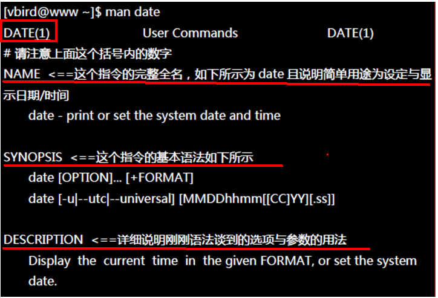
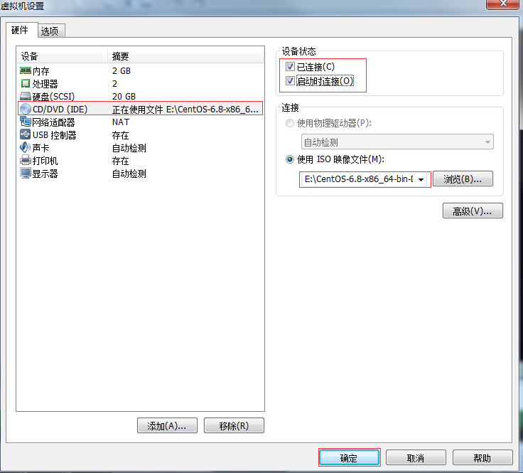
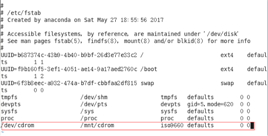

# Linux

***

## 一，命令学习

### 1.1，基础命令

拷贝文件命令：cp 拷贝文件的目录 拷贝到的文件路径

==cp  etc/hadoop/*.xml input/==:把 etc/hadoop/*.xml路径下所有xml结尾的文件拷贝到input/目录下面

ifconfig:查看ip地址

service iptables status：查看防火墙的状态

service iptables stop：关闭防火墙

查看防火墙开机启动状态：chkconfig iptables --list

关闭所有防火墙的状态：chkconfig iptables off

打开所有防火墙的状态：chkconfig iptables on

关机：halt

重启：reboot

把内存里面的内容加载到硬盘：sync

shutdown[选项]（时间）：-h：关机，-r:重启

主机用户名：localhost.localdomain

切换用户：su 用户名

cat 文件名：查看文件内容

删除文件夹：rm -rf 文件夹名

==允许普通用户具有root权限==

编辑配置文件：vi /etc/sudoers

找到 %wheel        ALL=(ALL)       ALL

==rzf  ALL=(ALL)       ALL即让rzf用户具有root权限==

修改文件所属的用户：chown 用户名 文件名

chown -R 用户名：用户权限 文件名

例如：chown -R rui:rui hadoop

ls -al:查看文件所属的用户

在普通用户下创建机油root权限的文件：sudo mkdir  文件名

修改创建文件的账户和拥有者：sudo chown 账户名：拥有者 文件名

rzf root：表名rzf用户有root权限

root root:root用户有root权限

克隆虚拟机配置

1. 输入ifconfig查看克隆出来的虚拟机的各种配置
2. su root，转换到root用户
3. vi  /etc/sysconfig/network-scripts/ifcfg-eth0:修改网络配置信息
4. vi /etc/sysconfig/network：修改主机名称

在opt目录下面创建文件夹

查看java进程：jps

修改文件名：mv mapred-site.xml.template mapred-site.xml

创建多级目录：mkdir -p /user/rzf/input

hadoop fs -ls -R /:递归列出目录

上传文件：hadoop fs -put 上传文件路径 上传地方的路径

例如：hadoop fs -put wcinput/wc,input /user/rzf/input

查看浏览器文件内容：hadoop fs -cat /user/rzf/output/part*

删除网页文件：hadoop fs -rmr /user/rzf/output，r代表递归

查看网页文件下的目录：hadoop fs -lsr /

cd ../..:标示返回两级目录

重启网卡： service network restart

退出集群：

- yarn-daemon.sh stop nodemanager
- hadoop-daemon.sh stop namenode

shift+g到文件末尾

最后使配置的环境变量生效： source/etc/profile

打印JAVA_HOME环境变量：echo $JAVA_HOME

在配置环境变量中：export标示是全局变量。

### 1.2，关机

在linux领域内大多用在服务器上，很少遇到关机的操作。毕竟服务器上跑一个服务是永无止境的，除非特殊情况下，不得已才会关机 。

正确的关机流程为：sync > shutdown > reboot > halt

1）基本语法：

​	（1）sync  			（功能描述：将数据由内存同步到硬盘中）

​	（2）shutdown [选项] 时间	

​			选项：

​			-h：关机

​			-r：重启

（3）halt 			（功能描述：关闭系统，等同于shutdown –h now 和 poweroff）

（4）reboot 			（功能描述：就是重启，等同于 shutdown –r now）

~~~ java
//将数据由内存同步到硬盘中
sync  
//计算机将在10分钟后关机，并且会显示在登录用户的当前屏幕中
shutdown –h 10 ‘This server will shutdown after 10 mins’
//立马关机
shutdown –h now 
//系统立马重启
shutdown –r now
//重启（等同于 shutdown –r now）
reboot 
//关机（等同于shutdown –h now 和 poweroff）
halt 
//注意：不管是重启系统还是关闭系统，首先要运行sync命令，把内存中的数据写到磁盘中。
~~~

### 1.3，**帮助**命令

 1. man获取帮助信息

    1）基本语法：

    ​	man [命令或配置文件]		（功能描述：获得帮助信息）

    ​	（1）显示说明



NAME  命令的名称和单行描述

SYNOPSIS 怎样使用命令

DESCRIPTION 命令功能的深入讨论

EXAMPLES  怎样使用命令的例子

SEE ALSO  相关主题（通常是手册页）

​	（2）数字说明q

1.用户在shell环境中可以操作的命令或是可执行的文件

2.系统内核(kernel)可以调用的函数

3.常用的函数or函数库

4.设备配置文件

5.配置文件的格式

6.游戏相关

7.linux网络协议和文件系统

8.系统管理员可以用的命令

9.跟内核有关系的文件

### 1.4，**help** **获得**shell内置命令的帮助信息

​	1）基本语法：

​	help 命令	（功能描述：获得shell内置命令的帮助信息）

## 三，常用基本命令

### 3.1，用户管理

1. 用户管理命令

~~~ java
//添加新用户，useradd ss
useradd 添加新用户
//设置密码，passwd ss
passwd
//判断用户是否存在,id ss,查看用户信息
id
//切换用户su ss,切换普通用户，切换root用户：su -
su 切换用户
//删除用户exit到root用户后在执行删除userdel ss
//删除用户但是保留用户主目录
	userdel 用户名
//删除用户，用户和用户主目录全部删除
	userdel -r 用户名
//查看用户登录信息
who：//三种用法
	whoimi//显示自身用户名称
	who im i//显示登录用户的用户名
	who//查看当前有哪些用户登录本台机器
//设置普通用户具有root权限
/*在etc/sudoers/文件夹下面找到root那一行，在下面添加即可*/
root ALL=(ALL) ALL
rr ALL=(ALL) ALL
//然后用sudo命令加上操作即可，sodu标示提升权限

~~~

### 3.2，常用快捷键

~~~ java
1）ctrl + c：停止进程
2）ctrl+l：清屏
3）ctrl + q：退出
4）善于用tab键
5）上下键：查找执行过的命令
6）ctrl +alt：linux和Windows之间切换
~~~

### 3.3，文件目录类操作

1. pwd 显示当前工作目录的绝对路径
   1）基本语法：
   	pwd		（功能描述：显示当前工作目录的==绝对路径==）

~~~ java
pwd
./  //标示当前目录
~~~

2. ls 列出目录内容：

- 基本语法：

  ls [选项] [目录或是文件]

  选项：

  -a ：全部的文件，连同隐藏档( 开头为 . 的文件) 一起列出来(常用)

  -d：仅仅显示目录本身，而不是列出目录内的文件数据

  -l ：长数据串列出，包含文件的属性与权限等等数据；(常用)

  -al：列出所有文件，包括隐藏文件的全部详细信息

   每行列出的信息依次是： 文件类型与权限 链接数 文件属主 文件属组 文件大小用byte来表示 建立或最近修改的时间 名字 

3. mkdir 创建一个新的文件夹

   1）基本语法：

   ​	mkdir [-p] 要创建的目录

   ​	选项：

   -p：创建多层目录

4. rmdir：删除一个空的文件夹

   1）基本语法：

   ​	rmdir 要删除的空目录

5. touch：创建空文件

   ​	1）基本语法：

   ​	touch 文件名称

6. cd :切换目录

   1）基本语法：

   ​	（1）cd 绝对路径

   ​	（2）cd 相对路径

   ​	（3）cd ~或者cd		（功能描述：回到自己的家目录，即主目录）

   ​	（4）cd -			（功能描述：回到上一次所在目录）

   ​	（5）cd ..			（功能描述：回到当前目录的上一级目录）

   ​	（6）cd -P 			（功能描述：跳转到实际物理路径，而非快捷方式路径）

7. cp：文件的复制

   1）基本语法：

   （1）cp source dest 				（功能描述：复制source文件到dest）

   （2）cp -r sourceFolder targetFolder	（功能描述：递归复制整个文件夹）

8. rm:移除文件或者目录

   1）基本语法

   ​	（1）rmdir deleteEmptyFolder	（功能描述：删除空目录）

   （2）rm -rf deleteFile			（功能描述：递归删除目录中所有内容）

9. mv:移动文件与目录或者重命名

   1）基本语法：

   ​	（1）mv oldNameFile newNameFile	（功能描述：重命名）

   ​	（2）mv /temp/movefile /targetFolder	（功能描述：移动文件）

10. cat:查看文件内容

    查看文件内容，从第一行开始显示。

    1）基本语法

    ​	cat  [选项] 要查看的文件

    选项：

    -A ：相当于 -vET 的整合选项，可列出一些特殊字符而不是空白而已；

    -b ：列出行号，仅针对非空白行做行号显示，空白行不标行号！

    -E ：将结尾的断行字节 $ 显示出来；

    -n ：列出行号，连同空白行也会有行号，与 -b 的选项不同；

    -T ：将 [tab] 按键以 ^I 显示出来；

    -v ：列出一些看不出来的特殊字符

11. tac:查看文件内容

    查看文件内容，从最后一行开始显示，可以看出 tac 是 cat 的倒著写。

    1）基本语法：

    ​	tac  [选项参数] 要查看的文件

12. more:查看文件内容

    查看文件内容，一页一页的显示文件内容。

    1）基本语法：

    ​	more 要查看的文件

    2）功能使用说明

    空白键 (space)：代表向下翻一页；

    Enter:代表向下翻『一行』；

    q:代表立刻离开 more ，不再显示该文件内容。

    Ctrl+F 向下滚动一屏

    Ctrl+B 返回上一屏

    = 输出当前行的行号

    :f 输出文件名和当前行的行号

13. less:查看文件内容

    查看文件内容，一页一页的显示文件内容。

    1）基本语法：

    ​	more 要查看的文件

    2）功能使用说明

    空白键 (space)：代表向下翻一页；

    Enter:代表向下翻『一行』；

    q:代表立刻离开 more ，不再显示该文件内容。

    Ctrl+F 向下滚动一屏

    Ctrl+B 返回上一屏

    = 输出当前行的行号

    :f 输出文件名和当前行的行号

14. head:查看文件内容：

    查看文件内容，只看头几行。

    1）基本语法

    head -n 10 文件      （功能描述：查看文件头10行内容，10可以是任意行数）

15. tail:查看文件内容：

    查看文件内容，只看尾巴几行。

    1）基本语法

    （1）tail  -n 10 文件 		（功能描述：查看文件头10行内容，10可以是任意行数）

    （2）tail  –f  文件		（功能描述：实时追踪该文档的所有更新）

16. 重定向命令

1）基本语法：（也就是把查询到的内容写到文件中）

（1）ls –l >文件		（功能描述：列表的内容写入文件a.txt中（覆盖写））

（2）ls –al >>文件	（功能描述：列表的内容追加到文件aa.txt的末尾）

17. echo:

    1）基本语法：

    （1）echo 要显示的==内容 >> 存储==内容的的文件	（功能描述：将要显示的内容，存储到文件中追加写)

    （2）echo 要显示的==内容 >存储==内容的的文件	（功能描述：将要显示的内容，存储到文件中覆盖写),

    （2）echo 变量		（功能描述：显示变量的值）

18. ln：软连接

    1）基本语法：

    ln –s [原文件] [目标文件]		（功能描述：给原文件创建一个软链接，软链接存放在目标文件目录）

    2）案例：

    [root@hadoop101 module]# ln -s /opt/module/test.txt /opt/t.txt

    [root@hadoop101 opt]# ll

    lrwxrwxrwx. 1 root    root      20 6月  17 12:56 t.txt -> /opt/module/test.txt

    相当于t.txt的实际路径是->后面的路径。

    cd -P 文件夹名字，指向的是实际的物理地址。，不加-P指向的是虚的地址。

~~~ java
创建一个软链接
[atguigu@hadoop103 opt]$ ln -s /opt/module/hadoop-2.7.2/ /opt/software/hadoop
cd不加参数进入是软链接的地址
[atguigu@hadoop103 software]$ cd hadoop
[atguigu@hadoop103 hadoop]$ pwd
/opt/software/hadoop

cd加参数进入是实际的物理地址
[atguigu@hadoop103 software]$ cd -P hadoop
[atguigu@hadoop103 hadoop-2.7.2]$ pwd
/opt/module/hadoop-2.7.2
~~~

19. history:查看所敲的命令历史

history

### 3.5，时间日期类

1）基本语法

date [OPTION]... [+FORMAT]

1. date:显示当前日期：

   1）基本语法：

   ​	（1）date								（功能描述：显示当前时间）

   ​	（2）date +%Y							（功能描述：显示当前年份）

   （3）date +%m							（功能描述：显示当前月份）

   （4）date +%d							（功能描述：显示当前是哪一天）

   （5）date +%Y%m%d   date +%Y/%m/%d …	（功能描述：显示当前年月日各种格式 ）

   （6）date "+%Y-%m-%d %H:%M:%S"		（功能描述：显示年月日时分秒）

date "+%Y-%m-%d-%H-%M-%s"//显示年月日时分秒

2. date显示非当前时间

   1）基本语法：

   （1）date -d '1 days ago'			（功能描述：显示前一天日期）

   （2）date -d yesterday +%Y%m%d	（同上）

   （3）date -d next-day +%Y%m%d	（功能描述：显示明天日期）

   （4）date -d 'next monday'			（功能描述：显示下周一时间）

   （5）date -d "next day"   //显示下一天时间

3. date设置系统当前时间

   1）基本语法：

   ​	date -s 字符串时间

4. cal:查看日历

   1）基本语法：

   cal [选项]			（功能描述：不加选项，显示本月日历）

   选项：

   -3 ，显示系统前一个月，当前月，下一个月的日历

   cal 2020：具体某一年，显示这一年的日历。

### 3.6，用户组命令

- 每个用户都有一个用户组，系统可以对一个用户组中的所有用户进行集中管理。不同Linux 系统对用户组的规定有所不同，

  如Linux下的用户属于与它同名的用户组，这个用户组在创建用户时同时创建。

  用户组的管理涉及用户组的添加、删除和修改。组的增加、删除和修改实际上就是对/etc/group文件的更新。

1. groupadd:新增用户组

   1）基本语法

   groupadd 组名

2. 查看用户组

cat /etc/group

3. groupdel:删除用户组

   1）基本语法：

   groupdel 组名

   node:

   ~~~ java
   [root@hadoop101 rr]# groupdel rr
   groupdel：不能移除用户“rr”的主组
   [root@hadoop101 rr]# rserdel -r rr
   -bash: rserdel: command not found
   [root@hadoop101 rr]# userdel -r rr
   //在删除用户组的时候不能删除时，先删除用户即可
   -rw-r--r-- 1 root root    0 3月  19 2020 rzf.txt
   第一个root标示文件的创建者
   第二个root标示文件创建者属于哪一个组
   ~~~

   4. groupmod:修改用户组

      1）基本语法：

      groupmod -n 新组名 老组名：groupmod -n bb aa：给组aa重新命名为bb

      创建一个用户并且属于一个组：usermod -g 组名 用户名:usermod -g bb cc:将用户cc分到bb用户组里面

    usermod -g cc cc：重新修改cc用户为cc组里面。

### 3.7，文件权限


1. 文件属性

Linux系统是一种典型的多用户系统，不同的用户处于不同的地位，拥有不同的权限。为了保护系统的安全性，Linux系统对不同的用户访问同一文件（包括目录文件）的权限做了不同的规定。在Linux中我们可以使用ll或者ls –l命令来显示一个文件的属性以及文件所属的用户和组。

1）从左到右的10个字符表示：

如果没有权限，就会出现减号[ - ]而已。从左至右用0-9这些数字来表示:

（1）0首位表示类型

在Linux中第一个字符代表这个文件是目录、文件或链接文件等等

\- 代表文件

 d 代表目录

 c 字符流，装置文件里面的串行端口设备，例如键盘、鼠标(一次性读取装置)

 s socket

 p 管道

 l 链接文档(link file)；

 b 设备文件，装置文件里面的可供储存的接口设备(可随机存取装置)

（2）第1-3位确定属主（该文件的所有者）拥有该文件的权限。---User

（3）第4-6位确定属组（所有者的同组用户）拥有该文件的权限，---Group

（4）第7-9位确定其他用户拥有该文件的权限 ---Other

| 文件类型 | 属主权限     | 属组权限     | 其他用户权限 |
| -------- | ------------ | ------------ | ------------ |
| 0        | 1    2   3   | 4   5   6    | 7   8   9    |
| d        | R   w   x    | R   -   x    | R   -   x    |
| 目录文件 | 读  写  执行 | 读  写  执行 | 读  写  执行 |

2）rxw作用文件和目录的不同解释

（1）作用到文件：

[ r ]代表可读(read): 可以读取，查看

[ w ]代表可写(write): 可以修改，但是不代表可以删除该文件,删除一个文件的前提条件是对该文件所在的目录有写权限，才能删除该文件.

[ x ]代表可执行(execute):可以被系统执行

（2）作用到目录：

[ r ]代表可读(read): 可以读取，ls查看目录内容

[ w ]代表可写(write): 可以修改，目录内创建+删除+重命名目录

[ x ]代表可执行(execute):可以进入该目录


### 3.8，chomd修改文件权限

1. 基本语法：

​	chmod  [{ugoa}{+-=}{rwx}] [文件或目录] [mode=421 ]  [文件或目录] 

2）功能描述

u代表用户，g代表组，o代表其他，a代表all所有人，增加权限用+，减少权限用-

改变文件或者目录权限

文件: r-查看；w-修改；x-执行文件

目录: r-列出目录内容；w-在目录中创建和删除；x-进入目录

删除一个文件的前提条件:该文件所在的目录有写权限，你才能删除该文件。

 chmod u+x aa.txt //对aa文件修改有x可执行权限

chmod g-w aa.txt：//对组收回w写权限

2. 改变文件拥有者

1）基本语法：

chown [最终用户] [文件或目录]		（功能描述：改变文件或者目录的所有者）

chown 文件所属用户：文件所属组 文件名

3. chgrp：改变组所属

   1）基本语法：

   ​	chgrp [最终用户组] [文件或目录]	（功能描述：改变文件或者目录的所属组）

### 3.9，磁盘分区类

1. 查看分区情况

   1）基本语法：

   ​	fdisk –l			（功能描述：查看磁盘分区详情）

   ​	注意：在root用户下才能使用

2）功能说明：

​	（1）Linux分区

这个硬盘是20G的，有255个磁面；63个扇区；2610个磁柱；每个 cylinder（磁柱）的容量是 8225280 bytes=8225.280 K（约为）=8.225280M（约为）；

| Device   | Boot | Start       | End         | Blocks | Id         | System   |
| -------- | ---- | ----------- | ----------- | ------ | ---------- | -------- |
| 分区序列 | 引导 | 从X磁柱开始 | 到Y磁柱结束 | 容量   | 分区类型ID | 分区类型 |

2. df查看硬盘

   1）基本语法：

   ​	df  参数		（功能描述：列出文件系统的整体磁盘使用量，检查文件系统的磁盘空间占用情况）

   参数：

   -a ：列出所有的文件系统，包括系统特有的 /proc 等文件系统；

   -k ：以 KBytes 的容量显示各文件系统；

   -m ：以 MBytes 的容量显示各文件系统；

   -h ：以人们较易阅读的 GBytes, MBytes, KBytes 等格式自行显示；

   -H ：以 M=1000K 取代 M=1024K 的进位方式；

   -T ：显示文件系统类型，连同该 partition 的 filesystem 名称 (例如 ext3) 也列出；

   -i ：不用硬盘容量，而以 inode 的数量来显示

### 3.10，搜索查找类

1. find查找文件或者目录

   1）基本语法：

   ​	find [搜索范围] [匹配条件]

   - find /home/ -name "*.txt"//在/home/目录下面按照名字查找.txt的文件，-name标示根据文件名称查找

   find /home/rzf/ -name "*.txt"

   -  find /home/rui/ -user rui//在此目录下根据文件拥有者查找文件拥有者为rui的文件

   （1）按文件名：根据名称查找/目录下的filename.txt文件。

   [root@hadoop106 ~]# find /opt/ -name *.txt

   （2）按拥有者：查找/opt目录下，用户名称为-user的文件

   [root@hadoop106 ~]# find /opt/ -user atguigu

   ​	（3）按文件大小：在/home目录下查找大于200m的文件（+n 大于  -n小于   n等于）

   [root@hadoop106 ~]find /home –size +204800

### 3.11，grep在文件内搜索字符匹配的行并且输出

1）基本语法，相当于二次检索

grep+参数+查找内容+源文件

参数：

－c：只输出匹配行的计数。

－I：不区分大小写(只适用于单字符)。

－h：查询多文件时不显示文件名。

－l：查询多文件时只输出包含匹配字符的文件名。

－n：显示匹配行及行号。

－s：不显示不存在或无匹配文本的错误信息。

－v：显示不包含匹配文本的所有行。

 ls -l |grep aa.txt//ls -l查看目录下面文件，| grep对文件进行过滤，过滤出aa.txt文件

 ls -l |grep -n aa.txt
2:-rwxr--r-- 1 rui rui 0 3月  19 00:58 aa.txt//-n表示把匹配的行号输出，隐藏文件也算

2. which文件搜索命令

   1）基本语法：

   ​	which 命令		（功能描述：搜索命令所在目录及别名信息）

    which ls
   alias ls='ls --color=auto'
           /bin/ls      //标示搜索到ls可执行文件放在那里

### 3.12，进程线程类

- 进程是正在执行的一个程序或命令，每一个进程都是一个运行的实体，都有自己的地址空间，并占用一定的系统资源

1. ps查看系统中的所有进程

   1）基本语法：

   ​	ps –aux		（功能描述：查看系统中所有进程）

   ps -aux |grep 10216//查看某一个进程相信情况

   2）功能说明

   ​	USER：该进程是由哪个用户产生的

   ​	PID：进程的ID号

   %CPU：该进程占用CPU资源的百分比，占用越高，进程越耗费资源；

   %MEM：该进程占用物理内存的百分比，占用越高，进程越耗费资源；

   VSZ：该进程占用虚拟内存的大小，单位KB；

   RSS：该进程占用实际物理内存的大小，单位KB；

   TTY：该进程是在哪个终端中运行的。其中tty1-tty7代表本地控制台终端，tty1-tty6是本地的字符界面终端，tty7是图形终端。pts/0-255代表虚拟终端。

   STAT：进程状态。常见的状态有：R：运行、S：睡眠、T：停止状态、s：包含子进程、+：位于后台

   START：该进程的启动时间

   TIME：该进程占用CPU的运算时间，注意不是系统时间

   COMMAND：产生此进程的命令名

2. top：查看系统健康状态

   1）基本命令

   ​	top [选项]	

   ​	（1）选项：

   top –d 1//设置1秒刷新一次

   -d 秒数：指定top命令每隔几秒更新。默认是3秒在top命令的交互模式当中可以执行的命令：

   -i：使top不显示任何闲置或者僵死进程。

   -p：通过指定监控进程ID来仅仅监控某个进程的状态。

   -s ： 使top命令在安全模式中运行。这将去除交互命令所带来的潜在危险。

   ​	（2）操作选项：

   P：		以CPU使用率排序，默认就是此项 

   M：		以内存的使用率排序 

   N：		以PID排序 

   q：		退出top

   ​	（3）查询结果字段解释

   第一行信息为任务队列信息

   | 内容                             | 说明                                                         |
   | -------------------------------- | ------------------------------------------------------------ |
   | 12:26:46                         | 系统当前时间                                                 |
   | up 1 day, 13:32                  | 系统的运行时间，本机已经运行1天13小时32分钟                  |
   | 2 users                          | 当前登录了两个用户                                           |
   | load  average:  0.00, 0.00, 0.00 | 系统在之前1分钟，5分钟，15分钟的平均负载。一般认为小于1时，负载较小。如果大于1，系统已经超出负荷。 |

   第二行为进程信息

   | Tasks:  95 total | 系统中的进程总数                          |
   | ---------------- | ----------------------------------------- |
   | 1 running        | 正在运行的进程数                          |
   | 94 sleeping      | 睡眠的进程                                |
   | 0 stopped        | 正在停止的进程                            |
   | 0 zombie         | 僵尸进程。如果不是0，需要手工检查僵尸进程 |

   第三行为CPU信息

   | Cpu(s):  0.1%us | 用户模式占用的CPU百分比                                      |
   | --------------- | ------------------------------------------------------------ |
   | 0.1%sy          | 系统模式占用的CPU百分比                                      |
   | 0.0%ni          | 改变过优先级的用户进程占用的CPU百分比                        |
   | 99.7%id         | 空闲CPU的CPU百分比                                           |
   | 0.1%wa          | 等待输入/输出的进程的占用CPU百分比                           |
   | 0.0%hi          | 硬中断请求服务占用的CPU百分比                                |
   | 0.1%si          | 软中断请求服务占用的CPU百分比                                |
   | 0.0%st          | st（Steal  time）虚拟时间百分比。就是当有虚拟机时，虚拟CPU等待实际CPU的时间百分比。 |

   第四行为物理内存信息

   | Mem:    625344k total | 物理内存的总量，单位KB                                       |
   | --------------------- | ------------------------------------------------------------ |
   | 571504k used          | 已经使用的物理内存数量                                       |
   | 53840k free           | 空闲的物理内存数量，我们使用的是虚拟机，总共只分配了628MB内存，所以只有53MB的空闲内存了 |
   | 65800k buffers        | 作为缓冲的内存数量                                           |

   第五行为交换分区（swap）信息

   | Swap:   524280k total | 交换分区（虚拟内存）的总大小 |
   | --------------------- | ---------------------------- |
   | 0k used               | 已经使用的交互分区的大小     |
   | 524280k free          | 空闲交换分区的大小           |
   | 409280k cached        | 作为缓存的交互分区的大小     |

退出操作：q或者ctrl+c或者ctrl+z或者esc

3. pstree：查看进程树

   1）基本语法：

   ​	pstree [选项]

   ​	选项

     -p：  显示进程的PID 

     -u：  显示进程的所属用户

4. kill:杀死进程

   1）基本语法：

   ​	kill -9 pid进程号

   ​	选项

   ​	-9 表示强迫进程立即停止

5. netstat:显示网络统计信息情况

   1）基本语法：

   ​	netstat –anp		（功能描述：此命令用来显示整个系统目前的网络情况。例如目前的连接、数据包传递数据、或是路由表内容）

   ​	选项：

   ​	-an 按一定顺序排列输出

   ​	-p  表示显示哪个进程在调用

   ​	-nltp 查看tcp协议进程端口号

### 3.13，解压类

1. gzip/gunzip压缩

   1）基本语法：

   gzip+文件		（功能描述：压缩文件，只能将文件压缩为*.gz文件）

   gunzip+文件.gz	（功能描述：解压缩文件命令）

   2）特点：

   （1）只能压缩文件不能压缩目录

   （2）不保留原来的文件

2. zip/unzip压缩

1）基本语法：

zip + 参数 + XXX.zip + 将要压缩的内容 （功能描述：压缩文件和目录的命令，window/linux通用且可以压缩目录且保留源文件）

参数：

-r 压缩目录

zip ys aa.txt bb.txt //两个文件压缩在一起

3. tar打包

   1）基本语法：

   tar + 参数 + XXX.tar.gz + 将要打包进去的内容		（功能描述：打包目录，压缩后的文件格式.tar.gz）

   参数：

   -c 产生.tar打包文件

   -v 显示详细信息

   -f 指定压缩后的文件名

   -z 打包同时压缩

   -x 解包.tar文件

（1）压缩：tar -zcvf  XXX.tar.gz   n1.txt    n2.txt

​	压缩多个文件

（2）解压：tar -zxvf  XXX.tar.gz

​	解压到当前目录

解压到/opt目录： tar -zxvf test.tar.gz –C /opt

### 3.14，后台服务管理

1. service后台服务管理

   1）service network status   查看指定服务的状态

   2）service network stop    停止指定服务

   3）service network start    启动指定服务

   4）service network restart   重启指定服务

   5）service --status-all      查看系统中所有的后台服务

2. chkconfig:设置后台服务自启配置

   1）chkconfig   			查看所有服务器自启配置

   2）chkconfig iptables off   关掉指定服务的自动启动

   3）chkconfig iptables on   开启指定服务的自动启动

3. 功能描述：netstat命令是一个监控TCP/IP网络的非常有用的工具，它可以显示路由表、实际的网络连接以及每一个网络接口设备的状态信息。 

   基本语法：netstat [选项]

   选项参数：

   ​	-t或--tcp：显示TCP传输协议的连线状况； 

   -u或--udp：显示UDP传输协议的连线状况；

   ​	-n或--numeric：直接使用ip地址，而不通过域名服务器； 

   ​	-l或--listening：显示监控中的服务器的Socket； 

   ​	-p或--programs：显示正在使用Socket的程序识别码（PID）和程序名称；

4. crond系统定时服务

   1. crond服务管理：service crond restart 			（重新启动服务）

   2. crontab定时任务设置

      1）基本语法

      crontab [选项]

      选项： 

        -e：    编辑crontab定时任务 

        -l：    查询crontab任务 

        -r：    删除当前用户所有的crontab任务

   （1）进入crontab编辑界面。会打开vim编辑你的工作。

   \* * * * * 执行的任务

   | 项目      | 含义                 | 范围                    |
   | --------- | -------------------- | ----------------------- |
   | 第一个“*” | 一小时当中的第几分钟 | 0-59                    |
   | 第二个“*” | 一天当中的第几小时   | 0-23                    |
   | 第三个“*” | 一个月当中的第几天   | 1-31                    |
   | 第四个“*” | 一年当中的第几月     | 1-12                    |
   | 第五个“*” | 一周当中的星期几     | 0-7（0和7都代表星期日） |

   （2）特殊符号

   | 特殊符号 | 含义                                                         |
   | -------- | ------------------------------------------------------------ |
   | *        | 代表任何时间。比如第一个“*”就代表一小时中每分钟都执行一次的意思。 |
   | ，       | 代表不连续的时间。比如“0 8,12,16 * * * 命令”，就代表在每天的8点0分，12点0分，16点0分都执行一次命令 |
   | -        | 代表连续的时间范围。比如“0 5  *  *  1-6命令”，代表在周一到周六的凌晨5点0分执行命令 |
   | */n      | 代表每隔多久执行一次。比如“*/10  *  *  *  *  命令”，代表每隔10分钟就执行一遍命令 |

   （3）特定时间执行命令

   | 时间              | 含义                                                         |
   | ----------------- | ------------------------------------------------------------ |
   | 45 22 * * * 命令  | 在22点45分执行命令                                           |
   | 0 17 * * 1 命令   | 每周1 的17点0分执行命令                                      |
   | 0 5 1,15 * * 命令 | 每月1号和15号的凌晨5点0分执行命令                            |
   | 40 4 * * 1-5 命令 | 每周一到周五的凌晨4点40分执行命令                            |
   | */10 4 * * * 命令 | 每天的凌晨4点，每隔10分钟执行一次命令                        |
   | 0 0 1,15 * 1 命令 | 每月1号和15号，每周1的0点0分都会执行命令。注意：星期几和几号最好不要同时出现，因为他们定义的都是天。非常容易让管理员混乱。 |

   3）案例：

   */5 * * * * /bin/echo ”11” >> /tmp/test

### 3.4，vim编辑器

1. 一般模式

以 vi 打开一个档案就直接进入一般模式了(这是默认的模式)。在这个模式中， 你可以使用『上下左右』按键来移动光标，你可以使用『删除字符』或『删除整行』来处理档案内容， 也可以使用『复制、贴上』来处理你的文件数据。

**常用语法**

1）yy	（功能描述：复制光标当前一行）

   y数字y	（功能描述：复制一段(从第几行到第几行)）

2）p		（功能描述：箭头移动到目的行粘贴）

3）u		（功能描述：撤销上一步）

4）dd		（功能描述：删除光标当前行）

d数字d	（功能描述：删除光标(含)后多少行）

5）x		（功能描述：删除一个字母，相当于del）

   X		（功能描述：删除一个字母，相当于Backspace）

 

6）yw		（功能描述：复制一个词）

7）dw		（功能描述：删除一个词）

8）shift+^	（功能描述：移动到行头）

9）shift+$	（功能描述：移动到行尾）

10）1+shift+g			（功能描述：移动到页头，数字）

11）shift+g			（功能描述：移动到页尾）

12）数字N+shift+g	（功能描述：移动到目标行）

2. 编辑模式

在一般模式中可以进行删除、复制、贴上等等的动作，但是却无法编辑文件内容的！ 要等到你按下『i, I, o, O, a, A, r, R』等任何一个字母之后才会进入编辑模式。

注意了！通常在 Linux 中，按下这些按键时，在画面的左下方会出现『INSERT 或 REPLACE 』的字样，此时才可以进行编辑。而如果要回到一般模式时， 则必须要按下『Esc』这个按键即可退出编辑模式。

**常用****语法**

1）进入编辑模式

（1）i    当前光标前

（2）a    当前光标后

（3）o    当前光标行的下一行

2）退出编辑模式

按『Esc』键

3. 指令模式

在一般模式当中，输入『 : / ?』3个中的任何一个按钮，就可以将光标移动到最底下那一行。

在这个模式当中， 可以提供你『搜寻资料』的动作，而读取、存盘、大量取代字符、离开 vi 、显示行号等动作是在此模式中达成的！

**常用****语法**

1）基本语法

（1）: 选项

​	选项：

  w	保存

  q	退出

  ！  感叹号强制执行

（2）/  查找，/被查找词，n是查找下一个，shift+n是往上查找

（3）?  查找，?被查找词，n是查找上一个，shift+n是往下查找

2）案例

:wq!		强制保存退出

## 四，**软件包管理**

### 1，RPM概述

​	RPM（RedHat Package Manager），RedHat软件包管理工具，类似windows里面的setup.exe

 是Linux这系列操作系统里面的打包安装工具，它虽然是RedHat的标志，但理念是通用的。

RPM包的名称格式

Apache-1.3.23-11.i386.rpm

\- “apache” 软件名称

\- “1.3.23-11”软件的版本号，主版本和此版本

\- “i386”是软件所运行的硬件平台，Intel 32位微处理器的统称

\- “rpm”文件扩展名，代表RPM包

### 2，RPM查询命令（rpm -qa）

1．基本语法

rpm -qa				（功能描述：查询所安装的所有rpm软件包）

2．经验技巧

由于软件包比较多，一般都会采取过滤。rpm -qa | grep rpm软件包

~~~ java
rpm -qa |grep firefox 
~~~

### 3，**RPM卸载命令（rpm -e）**

1．基本语法

（1）rpm -e RPM软件包   

（2） rpm -e --nodeps 软件包  

2．选项说明

表1-50

| 选项     | 功能                                                         |
| -------- | ------------------------------------------------------------ |
| -e       | 卸载软件包                                                   |
| --nodeps | 卸载软件时，不检查依赖。这样的话，那些使用该软件包的软件在此之后可能就不能正常工作了。 |

3．案例实操

​	（1）卸载firefox软件

~~~ java
 rpm -e firefox
~~~

### 4，**RPM安装命令（rpm -ivh）**

1．基本语法

​	rpm -ivh RPM包全名

2．选项说明

表1-51

| 选项     | 功能                     |
| -------- | ------------------------ |
| -i       | -i=install，安装         |
| -v       | -v=verbose，显示详细信息 |
| -h       | -h=hash，进度条          |
| --nodeps | --nodeps，不检测依赖进度 |

~~~ java
 rpm -ivh firefox-45.0.1-1.el6.centos.x86_64.rpm 
~~~

## 五，shell编程

### 一，概述

​	Shell是一个命令行解释器，它为用户提供了一个向Linux内核发送请求以便运行程序的界面系统级程序，用户可以用Shell来启动、挂起、停止甚至是编写一些程序。Shell还是一个功能相当强大的编程语言，易编写、易调试、灵活性强。Shell是解释执行的脚本语言，在Shell中可以调用Linux系统命令。

### 二，shell脚本的执行方式

1）echo输出命令

​	（1）基本语法：

​		echo [选项] [输出内容]

选项： 

  -e：  支持反斜线控制的字符转换

| 控制字符 | 作        用                                                 |
| -------- | ------------------------------------------------------------ |
| \\       | 输出\本身                                                    |
| \a       | 输出警告音                                                   |
| \b       | 退格键，也就是向左删除键                                     |
| \c       | 取消输出行末的换行符。和“-n”选项一致                         |
| \e       | ESCAPE键                                                     |
| \f       | 换页符                                                       |
| \n       | 换行符                                                       |
| \r       | 回车键                                                       |
| \t       | 制表符，也就是Tab键                                          |
| \v       | 垂直制表符                                                   |
| \0nnn    | 按照八进制ASCII码表输出字符。其中0为数字零，nnn是三位八进制数 |
| \xhh     | 按照十六进制ASCII码表输出字符。其中hh是两位十六进制数        |

~~~ jva
echo -e "hello\tword"//单引号也可以
hello   word
~~~

2. 第一个Shell脚本

~~~ java
//在etc目录下面创建helloword.sh脚本，
//在里面输入echo "helloword"
//升级权限
chmod 777 helloword.sh
//执行脚本
./helloword.sh//./标示在当前目录执行
//也可以用绝对路径执行
//也可以用命令执行
[root@hadoop101 sh]# sh ./helloword.sh 
helloword
[root@hadoop101 sh]# bash ./helloword.sh //也可以添加绝对路径
helloword
~~~

脚本的常用执行方式

第一种：输入脚本的绝对路径或相对路径

（1）首先要赋予helloworld.sh 脚本的+x权限

[atguigu@hadoop102 datas]$ chmod 777 helloworld.sh

（2）执行脚本

​	/root/helloWorld.sh

​	./helloWorld.sh

第二种：bash或sh+脚本（不用赋予脚本+x权限）

​	sh /root/helloWorld.sh

​	sh helloWorld.sh

3. ##  **shell**中的变量

   1. Linux Shell中的变量分为“系统变量”和“用户自定义变量”，可以通过set命令查看系统变量。

   2）系统变量：$HOME、$PWD、$SHELL、$USER等等

   3）显示当前shell中所有变量：set

~~~ java
//获取当前用户的家目录
[root@hadoop101 sh]# echo $HOME
/root
//获取并打印当前的绝对路径值
[root@hadoop101 sh]# echo $PWD
/etc/sh
//获取shell语言脚本的启动命令
[root@hadoop101 sh]# echo $SHELL
/bin/bash
//获取当前登录的用户
[root@hadoop101 sh]# echo $USER
root
~~~

2. 定义变量

1）基本语法：

​	变量=值，注意，等号两边没有空格

2）变量定义规则

​	（1）变量名称可以由字母、数字和下划线组成，但是不能以数字开头。

​	（2）等号两侧不能有空格

​	（3）变量名称一般习惯为大写

​	（4）双引号和单引号有区别，双引号仅将空格脱意，单引号会将所有特殊字符脱意

~~~ java
//（1）定义变量并且打印变量值
[root@hadoop101 sh]# ss=8
[root@hadoop101 sh]# echo $ss
8
//撤销变量
unset ss     
//（3）声明静态的变量B=2，不能unset,只可以读取，不允许修改
readonly B=2  
//（4）可把变量提升为全局环境变量，可供其他shell程序使用
export 变量名  
~~~

3. 单引号和双引号的区别

~~~ java
//双引号仅仅将空格脱意，而单引号将所有特殊字符脱意
//如果加上-e,单双引号都脱意
[root@hadoop101 sh]# ss="xxx\tsss"
[root@hadoop101 sh]# echo -e $ss
xxx     sss
[root@hadoop101 sh]# ss="xxx xxx"
[root@hadoop101 sh]# echo $ss
xxx xxx
//如果不添加-e，两者都会原样输出
~~~

4. 将命令的返回值赋给变量

~~~ java
//A=`ls -la` 反引号，运行里面的命令，并把结果返回给变量A
//A=$(ls -la) 等价于反引号
[root@hadoop101 sh]# a=`ll`
[root@hadoop101 sh]# echo $a
总用量 4 -rwxrwxrwx. 1 root root 29 4月 4 16:26 helloword.sh
//第二种用法
[root@hadoop101 sh]# a=$(ll)
[root@hadoop101 sh]# echo $a
总用量 4 -rwxrwxrwx. 1 root root 29 4月 4 16:26 helloword.sh
~~~

5. 设置环境变量

~~~ java
（1）export 变量名=变量值	（功能描述：设置环境变量的值）
（2）echo $变量名			（功能描述：查询环境变量的值）
（3）source 配置文件			（功能描述：让修改后的配置信息立即生效）
~~~

6. 位置参数变量

   1）基本语法

   ​	$n	（功能描述：n为数字，$0代表命令本身，$1-$9代表第一到第九个参数，十以上的参数，十以上的参数需要用大括号包含，如${10}）

   ​	$*	（功能描述：这个变量代表命令行中所有的参数，$*把所有的参数看成一个整体）

   ​	$@	（功能描述：这个变量也代表命令行中所有的参数，不过$@把每个参数区分对待）

   ​	$#	（功能描述：这个变量代表命令行中所有参数的个数）

~~~ java
echo "$1"//输出第一个参数
echo "$2"//输出第二个参数
echo "$*"//输出所有参数
echo "$#"//输出参数的个数
//$*和$@的区别
#!/bin/bash

for i in "$*"
do
        echo "$i"
done

for i in "$@"
do
        echo "$i"
done
~           
[root@hadoop101 sh]# ./fo.sh 2 4 6 8
2 4 6 8
2
4
6
8
//$*标示把参数全部一次性输出，而$@标示把参数一次一个的输出。
~~~

7. 预定义变量

   1）基本语法：

   ​	$？		（功能描述：最后一次执行的命令的返回状态。如果这个变量的值为0，证明上一个命令正确执行；如果这个变量的值为非0（具体是哪个数，由命令自己来决定），则证明上一个命令执行不正确了。）

   $$		（功能描述：当前进程的进程号（PID））

   $!		（功能描述：后台运行的最后一个进程的进程号（PID））

~~~ java
echo "$$" //打印当前的进程号
./helloword.sh & //调用别的脚本，并且变成后台运行程序
 echo "$!" //打印后台运行程序最有一个进程号
~~~

8. 运算符

   1）基本语法：

   （1）“$((运算式))”或“$[运算式]”

   （2）expr m + n 

   注意expr运算符间要有空格

~~~ java
[root@hadoop101 sh]# a=$((2+3))
[root@hadoop101 sh]# echo $a
5
[root@hadoop101 sh]# a=$[5*8]
[root@hadoop101 sh]# echo $a
40
[root@hadoop101 sh]# expr 2 + 3
5//注意加号两端有空格
    [root@hadoop101 sh]# a=$[(2+3)*4]
[root@hadoop101 sh]# echo $a
20//不需要空格
//expr分布计算
S=`expr 2 + 3`
expr $S \* 4
//expr一步完成计算
expr `expr 2 + 3` \* 4
echo `expr \`expr 2 + 3\`\*4`
~~~

8. 条件判断

   基本语法：

   [ condition ]（注意condition前后要有空格）

   \#非空返回true，可使用$?验证（0为true，>1为false）

9. 常用判断谈条件

   1）两个整数之间比较

   = 字符串比较

   -lt 小于

   -le 小于等于

   -eq 等于

   -gt 大于

   -ge 大于等于

   -ne 不等于

   2）按照文件权限进行判断

   -r 有读的权限

   -w 有写的权限

   -x 有执行的权限

   3）按照文件类型进行判断

   -f 文件存在并且是一个常规的文件

   -e 文件存在

   -d 文件存在并是一个目录

~~~ java
//23是否大于等于22
[ 23 -ge 22 ]
//student.txt是否具有写权限
[ -w student.txt ]
//root/install.log目录中的文件是否存在
 [ -e /root/install.log ]
~~~

10. if判断

    1）基本语法：

    if [ 条件判断式 ];then 

      程序 

    fi 

    或者 

    if [ 条件判断式 ] 

      then 

    ​    程序 

    fi

    ​	注意事项：（1）[ 条件判断式 ]，中括号和条件判断式之间必须有空格

~~~ java
#!/bin/bash


if [ $1 -eq "123" ]//if和条件表达之间有空格
        then
        echo "123"
elif [ $1 -eq "456" ]
        then
        echo "456"
fi
~            
~~~

11. case语句

    1）基本语法：

    case $变量名 in 

      "值1"） 

    ​    如果变量的值等于值1，则执行程序1 

    ​    ;; 

      "值2"） 

    ​    如果变量的值等于值2，则执行程序2 

    ​    ;; 

      …省略其他分支… 

      *） 

    ​    如果变量的值都不是以上的值，则执行此程序 

    ​    ;; 

    esac

12. for循环

    1）基本语法1：

    for 变量 in 值1 值2 值3… 

      do 

    ​    程序 

      done

~~~ java
//计算100累加和
sum=0
for((i=1; i<="$1"; i++))
do
        sum=$[$sum+$i]
done
echo "$sum"//只要用变量的地方就要添加$,并且在使用变量前要进行定义
~~~

13. while循环

    1）基本语法：

    while [ 条件判断式 ] 

      do 

    ​    程序 

      done

~~~ JAVA
sum=0
i=0
while [ $i -le "$1" ]
do
        sum=$[$sum+$i]
        i=$[$i+1]
done
echo "$sum"
~~~

14. read读取控制台输入

    1）基本语法：

    ​	read(选项)(参数)

    ​	选项：

    -p：指定读取值时的提示符；

    -t：指定读取值时等待的时间（秒）。

    参数	

    ​	变量：指定读取值的变量名

~~~ java
 read -p "please input your name:" NAME
please input your name:rzf
[root@hadoop101 sh]# echo $NAME
rzf
//提示在3秒内输入内容，没输入的话是空值
[root@hadoop101 sh]# read -t 3 -p "please input your name:" NAME
~~~

15. 系统函数

    1）basename基本语法

    basename [pathname] [suffix]		

    basename [string] [suffix]  	（功能描述：basename命令会删掉所有的前缀包括最后一个（‘/’）字符，然后将字符串显示出来。

    选项：

    suffix为后缀，如果suffix被指定了，basename会将pathname或string中的suffix去掉。

~~~ java
//没有指定suffix
[root@hadoop101 sh]# basename /etc/sh/while.sh 
while.sh
//指定后缀sh
[root@hadoop101 sh]# basename /etc/sh/while.sh sh
while.
~~~

​	dirname基本语法

​	dirname 文件绝对路径		（功能描述：从给定的包含绝对路径的文件名中去除文件名（非目录的部分），然后返回剩下的路径（目录的部分））

~~~ java
[root@hadoop101 sh]# dirname  /etc/sh/while.sh          
/etc/sh
~~~

16. 自定义函数

~~~ java
[ function ] funname[()]
	{
		Action;
		[return int;]
	}
	
	function start() / function start / start()
~~~

注意：

​	（1）必须在调用函数地方之前，先声明函数，shell脚本是逐行运行。不会像其它语言一样先编译。

​	（2）函数返回值，只能通过$?系统变量获得，可以显示加：return返回，如果不加，将以最后一条命令运行结果，作为返回值。return后跟数值n(0-255)

~~~ java
//打印比你输入小的所有数字
i=0
while [ $i -le "$1" ]
do
        echo "$i"
        i=$[ $i+1 ]
        sleep 1
done
//求两个数的和
function getSum()
{
        sum=0
        sum=$[ $1+$2 ]
        echo "$sum"

}

read -p "Please input number1:" NUM1
read -p "please input number2:" NUM2
getSum $NUM1 $NUM2;
~~~

### 三，**yum仓库配置**

1. 概述

   YUM（全称为 Yellow dog Updater, Modified）是一个在Fedora和RedHat以及CentOS中的Shell前端软件包管理器。基于RPM包管理，能够从指定的服务器自动下载RPM包并且安装，可以自动处理依赖性关系，并且一次安装所有依赖的软件包，无须繁琐地一次次下载、安装。

   在Linux上使用源码的方式安装软件非常满分，使用yum可以简化安装的过程

2. 常用命令：

   1）基本语法：

   yum install -y httpd			（功能描述：安装httpd并确认安装）

   yum list					（功能描述：列出所有可用的package和package组）

   yum clean all				（功能描述：清除所有缓冲数据）

   yum deplist httpd			（功能描述：列出一个包所有依赖的包）

   yum remove httpd			（功能描述：删除httpd）

   2）案例实操

   ​	yum install -y tree

3. 制作网络版yum源。

   （1）前提条件linux系统必须可以联网

   （2）在Linux环境环境中访问该网络地址：<http://mirrors.163.com/.help/centos.html>，在使用说明中点击CentOS6->再点击保存

   （3）**在打开的终端中输入如下命令，就可以找到文件的保存位置。**

   （4）替换本地yum文件

   1. 把下载的文件移动到/etc/yum.repos.d/目录

   ```java
   sudo cp CentOS6-Base-163.repo /etc/yum.repos.d/
   ```

   2. 进入到/etc/yum.repos.d/目录,用CentOS6-Base-163.repo替换CentOS-Base.rep

   （5）安装命令

   ```java
   [root@hadoop101 yum.repos.d]# yum clean all
   [root@hadoop101 yum.repos.d]# yum makecache
   //安装tree插件试试
   yum install -y tree
   //tree插件可以把目录文件以树形结构显示出来
   ```

   4. 制作本地yum源

      1）为什么要制作本地YUM源

      YUM源虽然可以简化我们在Linux上安装软件的过程，但是生成环境通常无法上网，不能连接外网的YUM源，说以接就无法使用yum命令安装软件了。为了在内网中也可以使用yum安装相关的软件，就要配置yum源。

      YUM源其实就是一个保存了多个RPM包的服务器，可以通过http的方式来检索、下载并安装相关的RPM包

   

   2）制作本地YUM源

   （1）准备一台Linux服务器，版本CentOS-6.8-x86_64-bin-DVD1.iso

   （2）配置好这台服务器的IP地址

   （3）将CentOS-6.8-x86_64-bin-DVD1.iso镜像挂载到/mnt/cdrom目录

   ==应为镜像文件中包含了很多各种各样的安装包==

   ```java
   //建立挂载目录
   mkdir /mnt/cdrom
   //挂载
    mount -t iso9660 /dev/cdrom /mnt/cdrom
   ```

   （4）修改本机上的YUM源配置文件，将源指向自己

   备份原有的YUM源的配置文件

   ~~~ java
   cd /etc/yum.repos.d/
   cp CentOS-Base.repo  CentOS-Base.repo.bak
   //进行备份
   cp -r CentOS-Base.repo.bak CentOS-Base.repo
   //修改内容如下
   name=CentOS-Local
   baseurl=file:///var/iso
   gpgcheck=1
   enabled=1   #增加改行，使能
   gpgkey=file:///etc/pki/rpm-gpg/RPM-GPG-KEY-CentOS-6
   //清除YUM缓冲
   yum clean all
   //列出可用的YUM源
   yum repolist
   //安装相应的软件
   yum install -y httpd//httpd类似于http协议
   //开启httpd使用浏览器访问http://hadoop101:80（如果访问不通，检查防火墙是否开启了80端口或关闭防火墙）
   //如果访问不到就执行：service httpd start
   //将YUM源配置到httpd（Apache Server）中，其他的服务器即可通过网络访问这个内网中的YUM源了
   cp -r /mnt/cdrom/ /var/www/html/CentOS
   //取消先前挂载的镜像
   umount /mnt/cdrom
   //在浏览器中访问http://192.168.11.101/CentOS/
   //让其他需要安装RPM包的服务器指向这个YUM源，准备一台新的服务器，备份或删除原有的YUM源配置文件
   备份原有的YUM源的配置文件
   cd /etc/yum.repos.d/
   cp CentOS-Base.repo  CentOS-Base.repo.bak
   //编辑CentOS-Base.repo文件
   [base]
   name=CentOS-hadoop101
   baseurl=http://192.168.11.101/CentOS
   gpgcheck=1
   gpgkey=file:///etc/pki/rpm-gpg/RPM-GPG-KEY-CentOS-6
   //在这台新的服务器上执行YUM的命令
   yum clean all
   yum repolist
   ~~~

   

   

   

   


### 四， **mount/umount**挂载/卸载

​	对于Linux用户来讲，不论有几个分区，分别分给哪一个目录使用，它总归就是一个根目录、一个独立且唯一的文件结构

Linux中每个分区都是用来组成整个文件系统的一部分，她在用一种叫做“挂载”的处理方法，它整个文件系统中包含了一整套的文件和目录，并将一个分区和一个目录联系起来，要载入的那个分区将使它的存储空间在这个目录下获得。

**0）**挂载前准备（必须要有光盘或者已经连接镜像文件）



**1）挂载**光盘语法：

mount [-t vfstype] [-o options] device dir

（1）-t vfstype 指定文件系统的类型，通常不必指定。mount 会自动选择正确的类型。

常用类型有：

光盘或光盘镜像：iso9660

DOS fat16文件系统：msdos

[Windows](http://blog.csdn.net/hancunai0017/article/details/6995284) 9x fat32文件系统：vfat

Windows NT ntfs文件系统：ntfs

Mount Windows文件[网络](http://blog.csdn.net/hancunai0017/article/details/6995284)共享：smbfs

[UNIX](http://blog.csdn.net/hancunai0017/article/details/6995284)(LINUX) 文件网络共享：nfs

（2）-o options 主要用来描述设备或档案的挂接方式。常用的参数有：

loop：用来把一个文件当成硬盘分区挂接上系统

　　ro：采用只读方式挂接设备

　　rw：采用读写方式挂接设备

　　iocharset：指定访问文件系统所用字符集

（3）device 要挂接(mount)的设备

（4）dir设备在系统上的挂接点(mount point)

~~~ java
//建立挂载点
 mkdir /mnt/cdrom/
//设备/dev/cdrom挂载到 挂载点 ：  /mnt/cdrom中
mount -t iso9660 /dev/cdrom /mnt/cdrom/	
ll /mnt/cdrom/
//3）卸载光盘语法：
umount 设备文件名或挂载点:umount /mnt/cdrom
//开机自动挂载语法：
vi /etc/fstab
添加红框中内容，保存退出。
~~~




