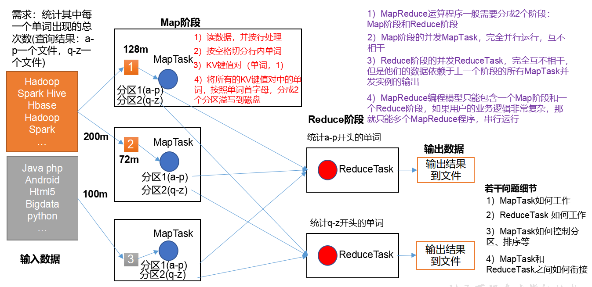
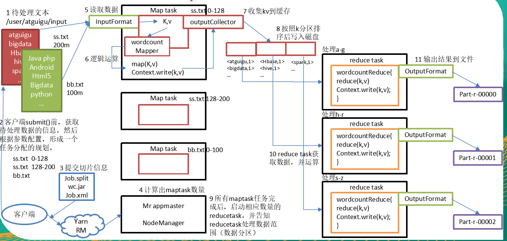
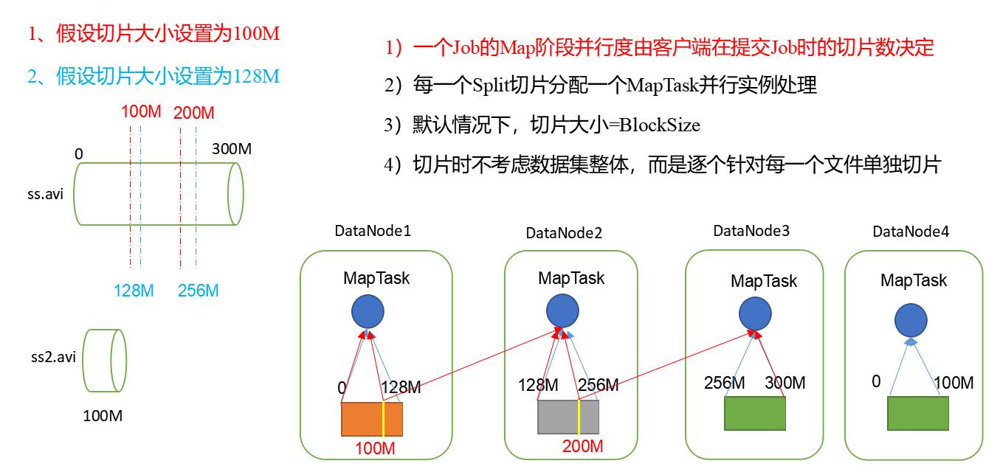
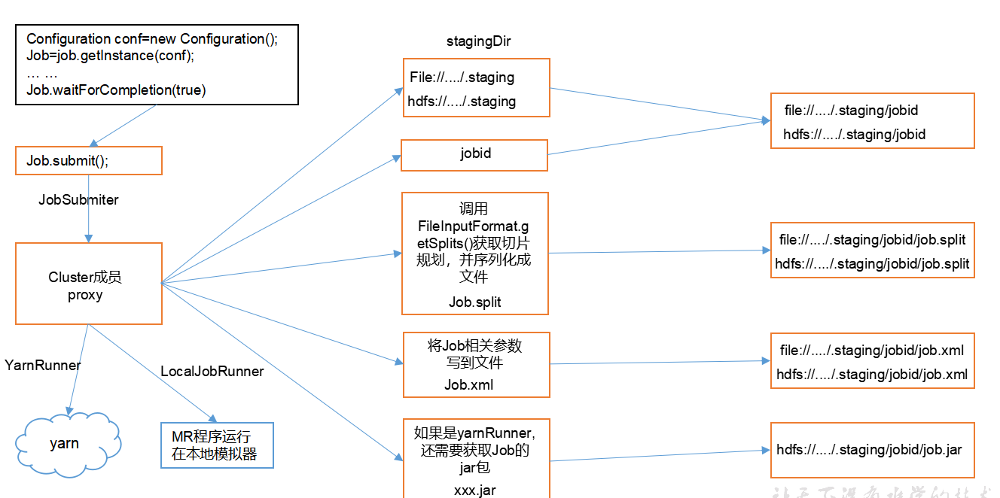

# MapReduce

## 第一章，mapreducer概念

### 1.1，什么是mapreducer。

​	Mapreduce是一个分布式运算程序的编程框架，是用户开发“基于hadoop的数据分析应用”的核心框架；

Mapreduce核心功能是将用户编写的业务逻辑代码和自带默认组件整合成一个完整的分布式运算程序，并发运行在一个hadoop集群上。

​	MapReduce处理过程分为两个阶段：Map和Reduce。
​		Map负责把一个任务分解成多个任务；
​		Reduce负责把分解后多任务处理的结果汇总。

### 1.2，为什么要MapReduce？

1）海量数据在单机上处理因为硬件资源限制，无法胜任

2）而一旦将单机版程序扩展到集群来分布式运行，将极大增加程序的复杂度和开发难度

3）引入mapreduce框架后，开发人员可以将绝大部分工作集中在业务逻辑的开发上，而将分布式计算中的复杂性交由框架来处理。

4）mapreduce分布式方案考虑的问题

（1）运算逻辑要不要先分后合？ 

（2）程序如何分配运算任务（切片）？

（3）两阶段的程序如何启动？如何协调？

（4）整个程序运行过程中的监控？容错？重试？

分布式方案需要考虑很多问题，但是我们可以将分布式程序中的公共功能封装成框架，让开发人员将精力集中于业务逻辑上。而mapreduce就是这样一个分布式程序的通用框架。

### 1.3，MapReduce优缺点

- 优点：

  1. MapReduce 易于编程

     它简单的实现一些接口，就可以完成一个分布式程序，这个分布式程序可以分布到大量廉价的PC机器上运行。也就是说你写一个分布式程序，跟写一个简单的串行程序是一模一样的。就是因为这个特点使得MapReduce编程变得非常流行。

  2. 良好的扩展性

     当你的计算资源不能得到满足的时候，你可以通过简单的增加机器来扩展它的计算能力。

  3. 高容错性

     MapReduce设计的初衷就是使程序能够部署在廉价的PC机器上，这就要求它具有很高的容错性。比如其中一台机器挂了，它可以把上面的计算任务转移到另外一个节点上运行，不至于这个任务运行失败，而且这个过程不需要人工参与，而完全是由Hadoop内部完成的。

  4. 适合PB级以上海量数据的离线处理

     可以实现上千台服务器集群并发工作，提供数据处理能力。

- 缺点：

1. 不擅长实时计算

   MapReduce无法像MySQL一样，在毫秒或者秒级内返回结果。

2. 不擅长流式计算

   流式计算的输入数据是动态的，而MapReduce的输入数据集是静态的，不能动态变化。这是因为MapReduce自身的设计特点决定了数据源必须是静态的.

3. 不擅长DAG（有向图）计算

   多个应用程序存在依赖关系，后一个应用程序的输入为前一个的输出。在这种情况下，MapReduce并不是不能做，而是使用后，每个MapReduce作业的输出结果都会写入到磁盘，会造成大量的磁盘IO，导致性能非常的低下。

### 1.4，mapreducer工作机制

1）分布式的运算程序往往需要分成至少2个阶段。

2）第一个阶段的MapTask并发实例，完全并行运行，互不相干。

3）第二个阶段的ReduceTask并发实例互不相干，但是他们的数据依赖于上一个阶段的所有MapTask并发实例的输出。

4）MapReduce编程模型只能包含一个Map阶段和一个Reduce阶段，如果用户的业务逻辑非常复杂，那就只能多个MapReduce程序，串行运行。

总结：分析WordCount数据流走向深入理解MapReduce核心思想。

### 1.5，**M**apReduce进程

​	一个完整的mapreduce程序在分布式运行时有三类实例进程：

​		1）MrAppMaster：负责整个程序的过程调度及状态协调

​		2）MapTask：负责map阶段的整个数据处理流程

​		3）ReduceTask：负责reduce阶段的整个数据处理流程

### 1.6，MapReduce编程规范

​	用户编写的程序分成三个部分：Mapper，Reducer，Driver(提交运行mr程序的客户端)

1）Mapper阶段

​	（1）用户自定义的Mapper要继承自己的父类

​	（2）Mapper的输入数据是KV对的形式（KV的类型可自定义）

​	（3）Mapper中的业务逻辑写在map()方法中

​	（4）Mapper的输出数据是KV对的形式（KV的类型可自定义）

​	（5）map()方法（maptask进程）对每一个<K,V>调用一次

2）Reducer阶段

​	（1）用户自定义的Reducer要继承自己的父类

​	（2）Reducer的输入数据类型对应Mapper的输出数据类型，也是KV

​	（3）Reducer的业务逻辑写在reduce()方法中

​	（4）Reducetask进程对每一组相同k的<k,v>组调用一次reduce()方法

3）Driver阶段

整个程序需要一个Drvier来进行提交，提交的是一个描述了各种必要信息的job对象

1）在MapReduce程序读取文件的输入目录上存放相应的文件。

2）客户端程序在submit()方法执行前，获取待处理的数据信息，然后根据集群中参数的配置形成一个任务分配规划。

3）客户端提交job.split、jar包、job.xml等文件给yarn，yarn中的resourcemanager启动MRAppMaster。

4）MRAppMaster启动后根据本次job的描述信息，计算出需要的maptask实例数量，然后向集群申请机器启动相应数量的maptask进程。

5）maptask利用客户指定的inputformat来读取数据，形成输入KV对。

6）maptask将输入KV对传递给客户定义的map()方法，做逻辑运算

7）map()运算完毕后将KV对收集到maptask缓存。

8）maptask缓存中的KV对按照K分区排序后不断写到磁盘文件

9）MRAppMaster监控到所有maptask进程任务完成之后，会根据客户指定的参数启动相应数量的reducetask进程，并告知reducetask进程要处理的数据分区。

10）Reducetask进程启动之后，根据MRAppMaster告知的待处理数据所在位置，从若干台maptask运行所在机器上获取到若干个maptask输出结果文件，并在本地进行重新归并排序，然后按照相同key的KV为一个组，调用客户定义的reduce()方法进行逻辑运算。

11）Reducetask运算完毕后，调用客户指定的outputformat将结果数据输出到外部存储。

## 第二章，**MapReduce**理论篇

### 2.1，**Writable**序列化

​	序列化就是把内存中的对象，转换成字节序列（或其他数据传输协议）以便于存储（持久化）和网络传输。 

​	反序列化就是将收到字节序列（或其他数据传输协议）或者是硬盘的持久化数据，转换成内存中的对象。

​	Java的序列化是一个重量级序列化框架（Serializable），一个对象被序列化后，会附带很多额外的信息（各种校验信息，header，继承体系等），不便于在网络中高效传输。所以，hadoop自己开发了一套序列化机制（Writable），精简、高效。

- 为什么要序列化？

  一般来说，“活的”对象只生存在内存里，关机断电就没有了。而且“活的”对象只能由本地的进程使用，不能被发送到网络上的另外一台计算机。 然而序列化可以存储“活的”对象，可以将“活的”对象发送到远程计算机。

### 2.2，**常用数据**序列化类型

| **Java类型** | **H**adoop**Writable类型** |
| ------------ | -------------------------- |
| boolean      | BooleanWritable            |
| byte         | ByteWritable               |
| int          | IntWritable                |
| float        | FloatWritable              |
| long         | LongWritable               |
| double       | DoubleWritable             |
| string       | Text                       |
| map          | MapWritable                |
| array        | ArrayWritable              |

### 2.3，自定义bean对象实现序列化接口（Writable）

1）自定义bean对象要想序列化传输，必须实现序列化接口，需要注意以下7项。

（1）必须实现Writable接口

（2）反序列化时，需要反射调用空参构造函数，所以必须有空参构造

（3）重写序列化方法

（4）重写反序列化方法

（5）注意反序列化的顺序和序列化的顺序完全一致

（6）要想把结果显示在文件中，需要重写toString()，且用”\t”分开，方便后续用

（7）如果需要将自定义的bean放在key中传输，则还需要实现comparable接口，因为mapreduce框中的shuffle过程一定会对key进行排序

~~~ java
// 1 必须实现Writable接口
public class FlowBean implements Writable {

	private long upFlow;
	private long downFlow;
	private long sumFlow;

	//2 反序列化时，需要反射调用空参构造函数，所以必须有
	public FlowBean() {
		super();
	}

	/**
	 * 3重写序列化方法
	 * 
	 * @param out
	 * @throws IOException
	 */
	@Override
	public void write(DataOutput out) throws IOException {
		out.writeLong(upFlow);
		out.writeLong(downFlow);
		out.writeLong(sumFlow);
	}

	/**
	 * 4 重写反序列化方法 
5 注意反序列化的顺序和序列化的顺序完全一致
	 * 
	 * @param in
	 * @throws IOException
	 */
	@Override
	public void readFields(DataInput in) throws IOException {
		upFlow = in.readLong();
		downFlow = in.readLong();
		sumFlow = in.readLong();
	}

    // 6要想把结果显示在文件中，需要重写toString()，且用”\t”分开，方便后续用
	@Override
	public String toString() {
		return upFlow + "\t" + downFlow + "\t" + sumFlow;
	}

    //7 如果需要将自定义的bean放在key中传输，则还需要实现comparable接口，因为mapreduce框中的shuffle过程一定会对key进行排序
	@Override
	public int compareTo(FlowBean o) {
		// 倒序排列，从大到小
		return this.sumFlow > o.getSumFlow() ? -1 : 1;
	}
}
~~~

## 第三章，MapReduce框架原理

### 3.1，InputFormat数据输入，切片与MapTask并行度决定机制。

1. 问题引出：

   MapTask的并行度决定Map阶段的任务处理并发度，进而影响到整个Job的处理速度。

   思考：1G的数据，启动8个MapTask，可以提高集群的并发处理能力。那么1K的数据，也启动8个MapTask，会提高集群性能吗？MapTask并行任务是否越多越好呢？哪些因素影响了MapTask并行度？

2. MapTask并行度决定机制

   数据块：Block是HDFS物理上把数据分成一块一块。

   数据切片：数据切片只是在逻辑上对输入进行分片，并不会在磁盘上将其切分成片进行存储。

### 3.2，**J**ob提交流程源码和切片源码详解

~~~ java
waitForCompletion()

submit();

// 1建立连接
	connect();	
		// 1）创建提交Job的代理
		new Cluster(getConfiguration());
			// （1）判断是本地yarn还是远程
			initialize(jobTrackAddr, conf); 

// 2 提交job
submitter.submitJobInternal(Job.this, cluster)
	// 1）创建给集群提交数据的Stag路径
	Path jobStagingArea = JobSubmissionFiles.getStagingDir(cluster, conf);

	// 2）获取jobid ，并创建Job路径
	JobID jobId = submitClient.getNewJobID();

	// 3）拷贝jar包到集群
copyAndConfigureFiles(job, submitJobDir);	
	rUploader.uploadFiles(job, jobSubmitDir);

// 4）计算切片，生成切片规划文件
writeSplits(job, submitJobDir);
		maps = writeNewSplits(job, jobSubmitDir);
		input.getSplits(job);

// 5）向Stag路径写XML配置文件
writeConf(conf, submitJobFile);
	conf.writeXml(out);

// 6）提交Job,返回提交状态
status = submitClient.submitJob(jobId, submitJobDir.toString(), job.getCredentials());
~~~

### 3.3，**FileInputFormat切片机制**

1. 处理流程

   FileInputFormat源码解析(input.getSplits(job))

（1）找到你数据存储的目录。

​	（2）开始遍历处理（规划切片）目录下的每一个文件

​	（3）遍历第一个文件ss.txt

​		a）获取文件大小fs.sizeOf(ss.txt);

​		b）计算切片大小computeSliteSize(Math.max(minSize,Math.max(maxSize,blocksize)))=blocksize=128M

c）默认情况下，切片大小=blocksize

​		d）开始切，形成第1个切片：ss.txt—0:128M 第2个切片ss.txt—128:256M 第3个切片ss.txt—256M:300M（每次切片时，都要判断切完剩下的部分是否大于块的1.1倍，不大于1.1倍就划分一块切片）

​		e）将切片信息写到一个切片规划文件中

​		f）整个切片的核心过程在==getSplit()==方法中完成。

g）数据切片只是在逻辑上对输入数据进行分片，并不会再磁盘上将其切分成分片进行存储。InputSplit只记录了分片的元数据信息，比如起始位置、长度以及所在的节点列表等。

h）注意：block是HDFS上物理上存储的存储的数据，切片是对数据逻辑上的划分。

​	（4）提交切片规划文件到yarn上，yarn上的MrAppMaster就可以根据切片规划文件计算开启maptask个数。

2. FileInputFormat中默认的切片机制：

   （1）简单地按照文件的内容长度进行切片

   （2）切片大小，默认等于block大小

   （3）切片时不考虑数据集整体，而是逐个针对每一个文件单独切片

~~~ java
//例子：
file1.txt    320M
file2.txt    10M
//经过FileInputFormat的切片机制运算后，形成的切片信息如下：
file1.txt.split1--  0~128
file1.txt.split2--  128~256
file1.txt.split3--  256~320
file2.txt.split1--  0~10M
~~~

3. FileInputFormat切片大小的参数配置

   （1）通过分析源码，在FileInputFormat中，计算切片大小的逻辑：Math.max(minSize, Math.min(maxSize, blockSize));  

   切片主要由这几个值来运算决定

   mapreduce.input.fileinputformat.split.minsize=1 默认值为1

   mapreduce.input.fileinputformat.split.maxsize= Long.MAXValue 默认值Long.MAXValue

   因此，默认情况下，切片大小=blocksize。

   maxsize（切片最大值）：参数如果调得比blocksize小，则会让切片变小，而且就等于配置的这个参数的值。

   minsize （切片最小值）：参数调的比blockSize大，则可以让切片变得比blocksize还大。

4. 获取切片信息API

~~~ java
// 根据文件类型获取切片信息
FileSplit inputSplit = (FileSplit) context.getInputSplit();
// 获取切片的文件名称
String name = inputSplit.getPath().getName();
~~~

### 3.4，CombineTextInputFormat切片机制

1. 框架默认的TextInputFormat切片机制是对任务按文件规划切片，不管文件多小，都会是一个单独的切片，都会交给一个MapTask，这样如果有大量小文件，就会产生大量的MapTask，处理效率极其低下。

2. 优化策略：

   （1）最好的办法，在数据处理系统的最前端（预处理/采集），将小文件先合并成大文件，再上传到HDFS做后续分析。

   （2）补救措施：如果已经是大量小文件在HDFS中了，可以使用另一种InputFormat来做切片（CombineTextInputFormat），它的切片逻辑跟TextFileInputFormat不同：它可以将多个小文件从逻辑上规划到一个切片中，这样，多个小文件就可以交给一个maptask。

3. 应用场景：

   **CombineTextInputFormat**用于小文件过多的场景，它可以将多个小文件从逻辑上规划到一个切片中，这样，多个小文件就可以交给一个MapTask处理。

4. 优先满足最小切片大小，不超过最大切片大小

~~~ java
CombineTextInputFormat.*setMaxInputSplitSize*(job, 4194304);// 4m
CombineTextInputFormat.*setMinInputSplitSize*(job, 2097152);// 2m
//举例：0.5m+1m+0.3m+5m=2m + 4.8m=2m + 4m + 0.8m
// 9 如果不设置InputFormat,它默认用的是TextInputFormat.class
job.setInputFormatClass(CombineTextInputFormat.class)
CombineTextInputFormat.setMaxInputSplitSize(job, 4194304);// 4m
CombineTextInputFormat.setMinInputSplitSize(job, 2097152);// 2m
~~~

5. 生成切片过程包括：虚拟存储过程和切片过程二部分。

   （1）虚拟存储过程：

   将输入目录下所有文件大小，依次和设置的setMaxInputSplitSize值比较，如果不大于设置的最大值，逻辑上划分一个块。如果输入文件大于设置的最大值且大于两倍，那么以最大值切割一块；当剩余数据大小超过设置的最大值且不大于最大值2倍，此时将文件均分成2个虚拟存储块（防止出现太小切片）。

   例如setMaxInputSplitSize值为4M，输入文件大小为8.02M，则先逻辑上分成一个4M。剩余的大小为4.02M，如果按照4M逻辑划分，就会出现0.02M的小的虚拟存储文件，所以将剩余的4.02M文件切分成（2.01M和2.01M）两个文件。

   （2）切片过程：

   （a）判断虚拟存储的文件大小是否大于setMaxInputSplitSize值，大于等于则单独形成一个切片。

   （b）如果不大于则跟下一个虚拟存储文件进行合并，共同形成一个切片。

   （c）测试举例：有4个小文件大小分别为1.7M、5.1M、3.4M以及6.8M这四个小文件，则虚拟存储之后形成6个文件块，大小分别为：

   1.7M，（2.55M、2.55M），3.4M以及（3.4M、3.4M）

   最终会形成3个切片，大小分别为：

   （1.7+2.55）M，（2.55+3.4）M，（3.4+3.4）M

### 3.5，**FileInputFormat实现**类

1. 思考：在运行MapReduce程序时，输入的文件格式包括：基于行的日志文件、二进制格式文件、数据库表等。那么，针对不同的数据类型，MapReduce是如何读取这些数据的呢？
2. FileInputFormat常见的接口实现类包括：TextInputFormat、KeyValueTextInputFormat、NLineInputFormat、CombineTextInputFormat和自定义InputFormat等。

~~~ java
TextInputFormat
//TextInputFormat是默认的FileInputFormat实现类。按行读取每条记录。键是存储该行在整个文件中的起始字节偏移量， LongWritable类型。值是这行的内容，不包括任何行终止符（换行符和回车符），Text类型。
//以下是一个示例，比如，一个分片包含了如下4条文本记录。
Rich learning form
Intelligent learning engine
Learning more convenient
From the real demand for more close to the enterprise
//每条记录表示为以下键/值对：
(0,Rich learning form)
(19,Intelligent learning engine)
(47,Learning more convenient)
(72,From the real demand for more close to the enterprise)
KeyValueTextInputFormat
//每一行均为一条记录，被分隔符分割为key，value。可以通过在驱动类中设置conf.set(KeyValueLineRecordReader.KEY_VALUE_SEPERATOR, "\t");来设定分隔符。默认分隔符是tab（\t）。
//以下是一个示例，输入是一个包含4条记录的分片。其中——>表示一个（水平方向的）制表符。
line1 ——>Rich learning form
line2 ——>Intelligent learning engine
line3 ——>Learning more convenient
line4 ——>From the real demand for more close to the enterprise
//每条记录表示为以下键/值对：
(line1,Rich learning form)
(line2,Intelligent learning engine)
(line3,Learning more convenient)
(line4,From the real demand for more close to the enterprise)
//此时的键是每行排在制表符之前的Text序列。
NLineInputFormat
//如果使用NlineInputFormat，代表每个map进程处理的InputSplit不再按Block块去划分，而是按NlineInputFormat指定的行数N来划分。即输入文件的总行数/N=切片数，如果不整除，切片数=商+1
//以下是一个示例，仍然以上面的4行输入为例。
Rich learning form
Intelligent learning engine
Learning more convenient
From the real demand for more close to the enterprise
//例如，如果N是2，则每个输入分片包含两行。开启2个MapTask。
(0,Rich learning form)
(19,Intelligent learning engine)
//另一个 mapper 则收到后两行：
(47,Learning more convenient)
(72,From the real demand for more close to the enterprise)
//这里的键和值与TextInputFormat生成的一样。
~~~

### 3.6，自定义InputFormat

- 在企业开发中，Hadoop框架自带的InputFormat类型不能满足所有应用场景，需要自定义InputFormat来解决实际问题。
- 自定义InputFormat步骤如下：
  - 自定义一个类继承FileInputFormat。
  - 改写RecordReader，实现一次读取一个完整文件封装为KV。
  - 在输出时使用SequenceFileOutPutFormat输出合并文件。

​	