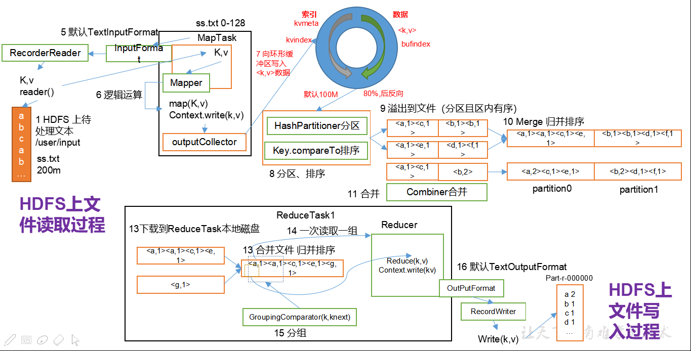

# MapReduce

## 第一章，mapreducer概念

### 1.1，什么是mapreducer。

​	Mapreduce是一个分布式运算程序的编程框架，是用户开发“基于hadoop的数据分析应用”的核心框架；

Mapreduce核心功能是将用户编写的业务逻辑代码和自带默认组件整合成一个完整的分布式运算程序，并发运行在一个hadoop集群上。

​	MapReduce处理过程分为两个阶段：Map和Reduce。
​		Map负责把一个任务分解成多个任务；
​		Reduce负责把分解后多任务处理的结果汇总。

### 1.2，为什么要MapReduce？

1）海量数据在单机上处理因为硬件资源限制，无法胜任

2）而一旦将单机版程序扩展到集群来分布式运行，将极大增加程序的复杂度和开发难度

3）引入mapreduce框架后，开发人员可以将绝大部分工作集中在业务逻辑的开发上，而将分布式计算中的复杂性交由框架来处理。

4）mapreduce分布式方案考虑的问题

（1）运算逻辑要不要先分后合？ 

（2）程序如何分配运算任务（切片）？

（3）两阶段的程序如何启动？如何协调？

（4）整个程序运行过程中的监控？容错？重试？

分布式方案需要考虑很多问题，但是我们可以将分布式程序中的公共功能封装成框架，让开发人员将精力集中于业务逻辑上。而mapreduce就是这样一个分布式程序的通用框架。

### 1.3，MapReduce优缺点

- 优点：

  1. MapReduce 易于编程

     它简单的实现一些接口，就可以完成一个分布式程序，这个分布式程序可以分布到大量廉价的PC机器上运行。也就是说你写一个分布式程序，跟写一个简单的串行程序是一模一样的。就是因为这个特点使得MapReduce编程变得非常流行。

  2. 良好的扩展性

     当你的计算资源不能得到满足的时候，你可以通过简单的增加机器来扩展它的计算能力。

  3. 高容错性

     MapReduce设计的初衷就是使程序能够部署在廉价的PC机器上，这就要求它具有很高的容错性。比如其中一台机器挂了，它可以把上面的计算任务转移到另外一个节点上运行，不至于这个任务运行失败，而且这个过程不需要人工参与，而完全是由Hadoop内部完成的。

  4. 适合PB级以上海量数据的离线处理

     可以实现上千台服务器集群并发工作，提供数据处理能力。

- 缺点：

1. 不擅长实时计算

   MapReduce无法像MySQL一样，在毫秒或者秒级内返回结果。

2. 不擅长流式计算

   流式计算的输入数据是动态的，而MapReduce的输入数据集是静态的，不能动态变化。这是因为MapReduce自身的设计特点决定了数据源必须是静态的.

3. 不擅长DAG（有向图）计算

   多个应用程序存在依赖关系，后一个应用程序的输入为前一个的输出。在这种情况下，MapReduce并不是不能做，而是使用后，每个MapReduce作业的输出结果都会写入到磁盘，会造成大量的磁盘IO，导致性能非常的低下。

### 1.4，mapreducer工作机制

1）分布式的运算程序往往需要分成至少2个阶段。

2）第一个阶段的MapTask并发实例，完全并行运行，互不相干。

3）第二个阶段的ReduceTask并发实例互不相干，但是他们的数据依赖于上一个阶段的所有MapTask并发实例的输出。

4）MapReduce编程模型只能包含一个Map阶段和一个Reduce阶段，如果用户的业务逻辑非常复杂，那就只能多个MapReduce程序，串行运行。

总结：分析WordCount数据流走向深入理解MapReduce核心思想。

### 1.5，**M**apReduce进程

​	一个完整的mapreduce程序在分布式运行时有三类实例进程：

​		1）MrAppMaster：负责整个程序的过程调度及状态协调

​		2）MapTask：负责map阶段的整个数据处理流程

​		3）ReduceTask：负责reduce阶段的整个数据处理流程

### 1.6，MapReduce编程规范

​	用户编写的程序分成三个部分：Mapper，Reducer，Driver(提交运行mr程序的客户端)

1）Mapper阶段

​	（1）用户自定义的Mapper要继承自己的父类

​	（2）Mapper的输入数据是KV对的形式（KV的类型可自定义）

​	（3）Mapper中的业务逻辑写在map()方法中

​	（4）Mapper的输出数据是KV对的形式（KV的类型可自定义）

​	（5）map()方法（maptask进程）对每一个<K,V>调用一次

2）Reducer阶段

​	（1）用户自定义的Reducer要继承自己的父类

​	（2）Reducer的输入数据类型对应Mapper的输出数据类型，也是KV

​	（3）Reducer的业务逻辑写在reduce()方法中

​	（4）Reducetask进程对每一组相同k的<k,v>组调用一次reduce()方法

3）Driver阶段

整个程序需要一个Drvier来进行提交，提交的是一个描述了各种必要信息的job对象

1）在MapReduce程序读取文件的输入目录上存放相应的文件。

2）客户端程序在submit()方法执行前，获取待处理的数据信息，然后根据集群中参数的配置形成一个任务分配规划。

3）客户端提交job.split、jar包、job.xml等文件给yarn，yarn中的resourcemanager启动MRAppMaster。

4）MRAppMaster启动后根据本次job的描述信息，计算出需要的maptask实例数量，然后向集群申请机器启动相应数量的maptask进程。

5）maptask利用客户指定的inputformat来读取数据，形成输入KV对。

6）maptask将输入KV对传递给客户定义的map()方法，做逻辑运算

7）map()运算完毕后将KV对收集到maptask缓存。

8）maptask缓存中的KV对按照K分区排序后不断写到磁盘文件

9）MRAppMaster监控到所有maptask进程任务完成之后，会根据客户指定的参数启动相应数量的reducetask进程，并告知reducetask进程要处理的数据分区。

10）Reducetask进程启动之后，根据MRAppMaster告知的待处理数据所在位置，从若干台maptask运行所在机器上获取到若干个maptask输出结果文件，并在本地进行重新归并排序，然后按照相同key的KV为一个组，调用客户定义的reduce()方法进行逻辑运算。

11）Reducetask运算完毕后，调用客户指定的outputformat将结果数据输出到外部存储。

## 第二章，**MapReduce**理论篇

### 2.1，**Writable**序列化

​	序列化就是把内存中的对象，转换成字节序列（或其他数据传输协议）以便于存储（持久化）和网络传输。 

​	反序列化就是将收到字节序列（或其他数据传输协议）或者是硬盘的持久化数据，转换成内存中的对象。

​	Java的序列化是一个重量级序列化框架（Serializable），一个对象被序列化后，会附带很多额外的信息（各种校验信息，header，继承体系等），不便于在网络中高效传输。所以，hadoop自己开发了一套序列化机制（Writable），精简、高效。

- 为什么要序列化？

  一般来说，“活的”对象只生存在内存里，关机断电就没有了。而且“活的”对象只能由本地的进程使用，不能被发送到网络上的另外一台计算机。 然而序列化可以存储“活的”对象，可以将“活的”对象发送到远程计算机。

### 2.2，**常用数据**序列化类型

| **Java类型** | **H**adoop**Writable类型** |
| ------------ | -------------------------- |
| boolean      | BooleanWritable            |
| byte         | ByteWritable               |
| int          | IntWritable                |
| float        | FloatWritable              |
| long         | LongWritable               |
| double       | DoubleWritable             |
| string       | Text                       |
| map          | MapWritable                |
| array        | ArrayWritable              |

### 2.3，自定义bean对象实现序列化接口（Writable）

1）自定义bean对象要想序列化传输，必须实现序列化接口，需要注意以下7项。

（1）必须实现Writable接口

（2）反序列化时，需要反射调用空参构造函数，所以必须有空参构造

（3）重写序列化方法

（4）重写反序列化方法

（5）注意反序列化的顺序和序列化的顺序完全一致

（6）要想把结果显示在文件中，需要重写toString()，且用”\t”分开，方便后续用

（7）如果需要将自定义的bean放在key中传输，则还需要实现comparable接口，因为mapreduce框中的shuffle过程一定会对key进行排序

~~~ java
// 1 必须实现Writable接口
public class FlowBean implements Writable {

	private long upFlow;
	private long downFlow;
	private long sumFlow;

	//2 反序列化时，需要反射调用空参构造函数，所以必须有
	public FlowBean() {
		super();
	}

	/**
	 * 3重写序列化方法
	 * 
	 * @param out
	 * @throws IOException
	 */
	@Override
	public void write(DataOutput out) throws IOException {
		out.writeLong(upFlow);
		out.writeLong(downFlow);
		out.writeLong(sumFlow);
	}

	/**
	 * 4 重写反序列化方法 
5 注意反序列化的顺序和序列化的顺序完全一致
	 * 
	 * @param in
	 * @throws IOException
	 */
	@Override
	public void readFields(DataInput in) throws IOException {
		upFlow = in.readLong();
		downFlow = in.readLong();
		sumFlow = in.readLong();
	}

    // 6要想把结果显示在文件中，需要重写toString()，且用”\t”分开，方便后续用
	@Override
	public String toString() {
		return upFlow + "\t" + downFlow + "\t" + sumFlow;
	}

    //7 如果需要将自定义的bean放在key中传输，则还需要实现comparable接口，因为mapreduce框中的shuffle过程一定会对key进行排序
	@Override
	public int compareTo(FlowBean o) {
		// 倒序排列，从大到小
		return this.sumFlow > o.getSumFlow() ? -1 : 1;
	}
}
~~~

## 第三章，MapReduce框架原理

### 3.1，InputFormat数据输入，切片与MapTask并行度决定机制。

1. 问题引出：

   MapTask的并行度决定Map阶段的任务处理并发度，进而影响到整个Job的处理速度。

   思考：1G的数据，启动8个MapTask，可以提高集群的并发处理能力。那么1K的数据，也启动8个MapTask，会提高集群性能吗？MapTask并行任务是否越多越好呢？哪些因素影响了MapTask并行度？

2. MapTask并行度决定机制

   数据块：Block是HDFS物理上把数据分成一块一块。

   数据切片：数据切片只是在逻辑上对输入进行分片，并不会在磁盘上将其切分成片进行存储。

3. maptask的并行度决定map阶段的任务处理并发度，进而影响到整个job的处理速度。那么，mapTask并行任务是否越多越好呢？ 

   MapTask并行度决定机制

   ​	一个job的map阶段MapTask并行度（个数），由客户端提交job时的切片个数决定。

### 3.2，**J**ob提交流程源码和切片源码详解

~~~ java
waitForCompletion()

submit();

// 1建立连接
	connect();	
		// 1）创建提交Job的代理
		new Cluster(getConfiguration());
			// （1）判断是本地yarn还是远程
			initialize(jobTrackAddr, conf); 

// 2 提交job
submitter.submitJobInternal(Job.this, cluster)
	// 1）创建给集群提交数据的Stag路径
	Path jobStagingArea = JobSubmissionFiles.getStagingDir(cluster, conf);

	// 2）获取jobid ，并创建Job路径
	JobID jobId = submitClient.getNewJobID();

	// 3）拷贝jar包到集群
copyAndConfigureFiles(job, submitJobDir);	
	rUploader.uploadFiles(job, jobSubmitDir);

// 4）计算切片，生成切片规划文件
writeSplits(job, submitJobDir);
		maps = writeNewSplits(job, jobSubmitDir);
		input.getSplits(job);

// 5）向Stag路径写XML配置文件
writeConf(conf, submitJobFile);
	conf.writeXml(out);

// 6）提交Job,返回提交状态
status = submitClient.submitJob(jobId, submitJobDir.toString(), job.getCredentials());
~~~

### 3.3，**FileInputFormat切片机制**

1. 处理流程

   FileInputFormat源码解析(input.getSplits(job))

（1）找到你数据存储的目录。

​	（2）开始遍历处理（规划切片）目录下的每一个文件

​	（3）遍历第一个文件ss.txt

​		a）获取文件大小fs.sizeOf(ss.txt);

​		b）计算切片大小computeSliteSize(Math.max(minSize,Math.max(maxSize,blocksize)))=blocksize=128M

c）默认情况下，切片大小=blocksize

​		d）开始切，形成第1个切片：ss.txt—0:128M 第2个切片ss.txt—128:256M 第3个切片ss.txt—256M:300M（每次切片时，都要判断切完剩下的部分是否大于块的1.1倍，不大于1.1倍就划分一块切片）

​		e）将切片信息写到一个切片规划文件中

​		f）整个切片的核心过程在==getSplit()==方法中完成。

g）数据切片只是在逻辑上对输入数据进行分片，并不会再磁盘上将其切分成分片进行存储。InputSplit只记录了分片的元数据信息，比如起始位置、长度以及所在的节点列表等。

h）注意：block是HDFS上物理上存储的存储的数据，切片是对数据逻辑上的划分。

​	（4）提交切片规划文件到yarn上，yarn上的MrAppMaster就可以根据切片规划文件计算开启maptask个数。

2. FileInputFormat中默认的切片机制：

   （1）简单地按照文件的内容长度进行切片

   （2）切片大小，默认等于block大小

   （3）切片时不考虑数据集整体，而是逐个针对每一个文件单独切片

~~~ java
//例子：
file1.txt    320M
file2.txt    10M
//经过FileInputFormat的切片机制运算后，形成的切片信息如下：
file1.txt.split1--  0~128
file1.txt.split2--  128~256
file1.txt.split3--  256~320
file2.txt.split1--  0~10M
~~~

3. FileInputFormat切片大小的参数配置

   （1）通过分析源码，在FileInputFormat中，计算切片大小的逻辑：Math.max(minSize, Math.min(maxSize, blockSize));  

   切片主要由这几个值来运算决定

   mapreduce.input.fileinputformat.split.minsize=1 默认值为1

   mapreduce.input.fileinputformat.split.maxsize= Long.MAXValue 默认值Long.MAXValue

   因此，默认情况下，切片大小=blocksize。

   maxsize（切片最大值）：参数如果调得比blocksize小，则会让切片变小，而且就等于配置的这个参数的值。

   minsize （切片最小值）：参数调的比blockSize大，则可以让切片变得比blocksize还大。

4. 获取切片信息API

~~~ java
// 根据文件类型获取切片信息
FileSplit inputSplit = (FileSplit) context.getInputSplit();
// 获取切片的文件名称
String name = inputSplit.getPath().getName();
~~~

### 3.4，CombineTextInputFormat切片机制

1. 框架默认的TextInputFormat切片机制是对任务按文件规划切片，不管文件多小，都会是一个单独的切片，都会交给一个MapTask，这样如果有大量小文件，就会产生大量的MapTask，处理效率极其低下。

2. 优化策略：

   （1）最好的办法，在数据处理系统的最前端（预处理/采集），将小文件先合并成大文件，再上传到HDFS做后续分析。

   （2）补救措施：如果已经是大量小文件在HDFS中了，可以使用另一种InputFormat来做切片（CombineTextInputFormat），它的切片逻辑跟TextFileInputFormat不同：它可以将多个小文件从逻辑上规划到一个切片中，这样，多个小文件就可以交给一个maptask。

3. 应用场景：

   **CombineTextInputFormat**用于小文件过多的场景，它可以将多个小文件从逻辑上规划到一个切片中，这样，多个小文件就可以交给一个MapTask处理。

4. 优先满足最小切片大小，不超过最大切片大小

~~~ java
CombineTextInputFormat.*setMaxInputSplitSize*(job, 4194304);// 4m
CombineTextInputFormat.*setMinInputSplitSize*(job, 2097152);// 2m
//举例：0.5m+1m+0.3m+5m=2m + 4.8m=2m + 4m + 0.8m
// 9 如果不设置InputFormat,它默认用的是TextInputFormat.class
job.setInputFormatClass(CombineTextInputFormat.class)
CombineTextInputFormat.setMaxInputSplitSize(job, 4194304);// 4m
CombineTextInputFormat.setMinInputSplitSize(job, 2097152);// 2m
~~~

5. 生成切片过程包括：虚拟存储过程和切片过程二部分。

   （1）虚拟存储过程：

   将输入目录下所有文件大小，依次和设置的setMaxInputSplitSize值比较，如果不大于设置的最大值，逻辑上划分一个块。如果输入文件大于设置的最大值且大于两倍，那么以最大值切割一块；当剩余数据大小超过设置的最大值且不大于最大值2倍，此时将文件均分成2个虚拟存储块（防止出现太小切片）。

   例如setMaxInputSplitSize值为4M，输入文件大小为8.02M，则先逻辑上分成一个4M。剩余的大小为4.02M，如果按照4M逻辑划分，就会出现0.02M的小的虚拟存储文件，所以将剩余的4.02M文件切分成（2.01M和2.01M）两个文件。

   （2）切片过程：

   （a）判断虚拟存储的文件大小是否大于setMaxInputSplitSize值，大于等于则单独形成一个切片。

   （b）如果不大于则跟下一个虚拟存储文件进行合并，共同形成一个切片。

   （c）测试举例：有4个小文件大小分别为1.7M、5.1M、3.4M以及6.8M这四个小文件，则虚拟存储之后形成6个文件块，大小分别为：

   1.7M，（2.55M、2.55M），3.4M以及（3.4M、3.4M）

   最终会形成3个切片，大小分别为：

   （1.7+2.55）M，（2.55+3.4）M，（3.4+3.4）M

### 3.5，**FileInputFormat实现**类

1. 思考：在运行MapReduce程序时，输入的文件格式包括：基于行的日志文件、二进制格式文件、数据库表等。那么，针对不同的数据类型，MapReduce是如何读取这些数据的呢？
2. FileInputFormat常见的接口实现类包括：TextInputFormat、KeyValueTextInputFormat、NLineInputFormat、CombineTextInputFormat和自定义InputFormat等。

~~~ java
TextInputFormat
//TextInputFormat是默认的FileInputFormat实现类。按行读取每条记录。键是存储该行在整个文件中的起始字节偏移量， LongWritable类型。值是这行的内容，不包括任何行终止符（换行符和回车符），Text类型。
//以下是一个示例，比如，一个分片包含了如下4条文本记录。
Rich learning form
Intelligent learning engine
Learning more convenient
From the real demand for more close to the enterprise
//每条记录表示为以下键/值对：
(0,Rich learning form)
(19,Intelligent learning engine)
(47,Learning more convenient)
(72,From the real demand for more close to the enterprise)
KeyValueTextInputFormat
//每一行均为一条记录，被分隔符分割为key，value。可以通过在驱动类中设置conf.set(KeyValueLineRecordReader.KEY_VALUE_SEPERATOR, "\t");来设定分隔符。默认分隔符是tab（\t）。
//以下是一个示例，输入是一个包含4条记录的分片。其中——>表示一个（水平方向的）制表符。
line1 ——>Rich learning form
line2 ——>Intelligent learning engine
line3 ——>Learning more convenient
line4 ——>From the real demand for more close to the enterprise
//每条记录表示为以下键/值对：
(line1,Rich learning form)
(line2,Intelligent learning engine)
(line3,Learning more convenient)
(line4,From the real demand for more close to the enterprise)
//此时的键是每行排在制表符之前的Text序列。
NLineInputFormat
//如果使用NlineInputFormat，代表每个map进程处理的InputSplit不再按Block块去划分，而是按NlineInputFormat指定的行数N来划分。即输入文件的总行数/N=切片数，如果不整除，切片数=商+1
//以下是一个示例，仍然以上面的4行输入为例。
Rich learning form
Intelligent learning engine
Learning more convenient
From the real demand for more close to the enterprise
//例如，如果N是2，则每个输入分片包含两行。开启2个MapTask。
(0,Rich learning form)
(19,Intelligent learning engine)
//另一个 mapper 则收到后两行：
(47,Learning more convenient)
(72,From the real demand for more close to the enterprise)
//这里的键和值与TextInputFormat生成的一样。
~~~

### 3.6，自定义InputFormat

- 在企业开发中，Hadoop框架自带的InputFormat类型不能满足所有应用场景，需要自定义InputFormat来解决实际问题。

- 自定义InputFormat步骤如下：
  - 自定义一个类继承FileInputFormat。
  - 改写RecordReader，实现一次读取一个完整文件封装为KV。
  - 在输出时使用SequenceFileOutPutFormat输出合并文件。

- 案例：

  将多个小文件合并成一个SequenceFile文件（SequenceFile文件是Hadoop用来存储二进制形式的key-value对的文件格式），SequenceFile里面存储着多个文件，存储的形式为文件路径+名称为key，文件内容为value。

~~~ java
//1、自定义一个类继承FileInputFormat
//（1）重写isSplitable()方法，返回false不可切割
//（2）重写createRecordReader()，创建自定义的RecordReader对象，并初始化
//2、改写RecordReader，实现一次读取一个完整文件封装为KV
//（1）采用IO流一次读取一个文件输出到value中，因为设置了不可切片，最终把所有文件都封装到了value中
//（2）获取文件路径信息+名称，并设置key
//3、设置Driver
// （1）设置输入的inputFormat
job.setInputFormatClass(WholeFileInputformat.class);
// （2）设置输出的outputFormat
job.setOutputFormatClass(SequenceFileOutputFormat.class);
//案例地址
https://github.com/justdoitMr/BigData_doc/tree/master/codes/hadoop/FileInputFormat/src/com/qq/rzf/FileInputFormat
~~~

### 3.7，**MapReduce**工作流程

上面的流程是整个MapReduce最全工作流程，但是Shuffle过程只是从第7步开始到第16步结束，具体Shuffle过程详解，如下：

1）MapTask收集我们的map()方法输出的kv对，放到内存缓冲区中

2）从内存缓冲区不断溢出本地磁盘文件，可能会溢出多个文件

3）多个溢出文件会被合并成大的溢出文件

4）在溢出过程及合并的过程中，都要调用Partitioner进行分区和针对key进行排序

5）ReduceTask根据自己的分区号，去各个MapTask机器上取相应的结果分区数据

6）ReduceTask会取到同一个分区的来自不同MapTask的结果文件，ReduceTask会将这些文件再进行合并（归并排序）

7）合并成大文件后，Shuffle的过程也就结束了，后面进入ReduceTask的逻辑运算过程（从文件中取出一个一个的键值对Group，调用用户自定义的reduce()方法）

3．注意

Shuffle中的缓冲区大小会影响到MapReduce程序的执行效率，原则上说，缓冲区越大，磁盘io的次数越少，执行速度就越快。

缓冲区的大小可以通过参数调整，参数：io.sort.mb默认100M。

4．源码解析流程

### 3.8，**S**huffle机制

- Mapreduce确保每个reducer的输入都是按键排序的。系统执行排序的过程（即将map输出作为输入传给reducer）称为shuffle，Map方法之后，Reduce方法之前的数据处理过程称之为Shuffle。

1. mapreducer工作流

   1. MapTask工作机制

   ​	（1）Read阶段：Map Task通过用户编写的RecordReader，从输入InputSplit中解析出一个个key/value。

   ​	（2）Map阶段：该节点主要是将解析出的key/value交给用户编写map()函数处理，并产生一系列新的key/value。

   ​	（3）Collect阶段：在用户编写map()函数中，当数据处理完成后，一般会调用OutputCollector.collect()输出结果。在该函数内部，它会将生成的key/value分区（调用Partitioner），并写入一个环形内存缓冲区中。

   ​	（4）Spill阶段：即“溢写”，当环形缓冲区满后，MapReduce会将数据写到本地磁盘上，生成一个临时文件。需要注意的是，将数据写入本地磁盘之前，先要对数据进行一次本地排序，并在必要时对数据进行合并、压缩等操作。

   ​	溢写阶段详情：

   ​	步骤1：利用快速排序算法对缓存区内的数据进行排序，排序方式是，先按照分区编号partition进行排序，然后按照key进行排序。这样，经过排序后，数据以分区为单位聚集在一起，且同一分区内所有数据按照key有序。

   ​	步骤2：按照分区编号由小到大依次将每个分区中的数据写入任务工作目录下的临时文件output/spillN.out（N表示当前溢写次数）中。如果用户设置了Combiner，则写入文件之前，对每个分区中的数据进行一次聚集操作。

   ​	步骤3：将分区数据的元信息写到内存索引数据结构SpillRecord中，其中每个分区的元信息包括在临时文件中的偏移量、压缩前数据大小和压缩后数据大小。如果当期内存索引大小超过1MB，则将内存索引写到文件output/spillN.out.index中。

   ​	（5）Combine阶段：当所有数据处理完成后，MapTask对所有临时文件进行一次合并，以确保最终只会生成一个数据文件。

   ​	当所有数据处理完后，MapTask会将所有临时文件合并成一个大文件，并保存到文件output/file.out中，同时生成相应的索引文件output/file.out.index。

   ​	在进行文件合并过程中，MapTask以分区为单位进行合并。对于某个分区，它将采用多轮递归合并的方式。每轮合并io.sort.factor（默认100）个文件，并将产生的文件重新加入待合并列表中，对文件排序后，重复以上过程，直到最终得到一个大文件。

   ​	让每个MapTask最终只生成一个数据文件，可避免同时打开大量文件和同时读取大量小文件产生的随机读取带来的开销。

### 3.9，**partition**分区

- 问题引出：要求将统计结果按照条件输出到不同文件中（分区）。比如：将统计结果按照手机归属地不同省份输出到不同文件中（分区）
- 默认partition分区

~~~ java
public class HashPartitioner<K, V> extends Partitioner<K, V> {
  /** Use {@link Object#hashCode()} to partition. */
  public int getPartition(K key, V value, int numReduceTasks) {
    return (key.hashCode() & Integer.MAX_VALUE) % numReduceTasks;
  }
}
//默认分区是根据key的hashCode对reduceTasks个数取模得到的。用户没法控制哪个key存储到哪个分区
~~~

1. 自定义Partitioner步骤:
   1. 自定义类继承Partitioner，重新getPartition()方法

~~~ java
public class ProvincePartitioner extends Partitioner<Text, FlowBean> {
	@Override
	public int getPartition(Text key, FlowBean value, int numPartitions) {
// 1 获取电话号码的前三位
		String preNum = key.toString().substring(0, 3);
		
		int partition = 4;
		
		// 2 判断是哪个省
		if ("136".equals(preNum)) {
			partition = 0;
		}else if ("137".equals(preNum)) {
			partition = 1;
		}else if ("138".equals(preNum)) {
			partition = 2;
		}else if ("139".equals(preNum)) {
			partition = 3;
		}
		return partition;
	}
}
~~~

  		2. 在job驱动中，设置自定义partitioner： 

~~~ java
job.setPartitionerClass(CustomPartitioner.class)
~~~

 	3. 自定义partition后，要根据自定义partitioner的逻辑设置相应数量的reduce task

~~~ java
job.setNumReduceTasks(5);
//注意：
如果reduceTask的数量> getPartition的结果数，则会多产生几个空的输出文件part-r-000xx；
如果1<reduceTask的数量<getPartition的结果数，则有一部分分区数据无处安放，会Exception；
如果reduceTask的数量=1，则不管mapTask端输出多少个分区文件，最终结果都交给这一个reduceTask，最终也就只会产生一个结果文件 part-r-00000；
~~~

### 3.10，**排序**

1. 排序是MapReduce框架中最重要的操作之一。Map Task和Reduce Task均会对数据（按照key）进行排序。该操作属于Hadoop的默认行为。任何应用程序中的数据均会被排序，而不管逻辑上是否需要。默认排序是按照字典顺序排序，且实现该排序的方法是快速排序

   ​	对于Map Task，它会将处理的结果暂时放到一个缓冲区中，当缓冲区使用率达到一定阈值后，再对缓冲区中的数据进行一次快速排序，并将这些有序数据写到磁盘上，而当数据处理完毕后，它会对磁盘上所有文件进行归并排序。，以将这些文件合并成一个大的有序文件。

   ​	对于Reduce Task，它从每个Map Task上远程拷贝相应的数据文件，如果文件大小超过一定阈值，则放到磁盘上，否则放到内存中。如果磁盘上文件数目达到一定阈值，则进行一次合并以生成一个更大文件；如果内存中文件大小或者数目超过一定阈值，则进行一次合并后将数据写到磁盘上。当所有数据拷贝完毕后，Reduce Task统一对内存和磁盘上的所有数据进行一次合并。

2. 每个阶段的默认排序

   （1）部分排序：

   MapReduce根据输入记录的键对数据集排序。保证输出的每个文件内部排序。

   （2）全排序：

   如何用Hadoop产生一个全局排序的文件？最简单的方法是使用一个分区。但该方法在处理大型文件时效率极低，因为一台机器必须处理所有输出文件，从而完全丧失了MapReduce所提供的并行架构。

   ​	替代方案：首先创建一系列排好序的文件；其次，串联这些文件；最后，生成一个全局排序的文件。主要思路是使用一个分区来描述输出的全局排序。例如：可以为上述文件创建3个分区，在第一分区中，记录的单词首字母a-g，第二分区记录单词首字母h-n, 第三分区记录单词首字母o-z。

   （3）辅助排序：（GroupingComparator分组）

   ​	Mapreduce框架在记录到达reducer之前按键对记录排序，但键所对应的值并没有被排序。甚至在不同的执行轮次中，这些值的排序也不固定，因为它们来自不同的map任务且这些map任务在不同轮次中完成时间各不相同。一般来说，大多数MapReduce程序会避免让reduce函数依赖于值的排序。但是，有时也需要通过特定的方法对键进行排序和分组等以实现对值的排序。

3. 自定义排序WritableComparable

~~~ java
//bean对象实现WritableComparable接口重写compareTo方法，就可以实现排序
@Override
public int compareTo(FlowBean o) {
	// 倒序排列，从大到小
	return this.sumFlow > o.getSumFlow() ? -1 : 1;
}
~~~

### 3.11，**Combiner合并**

​	（1）Combiner是MR程序中Mapper和Reducer之外的一种组件。

​	（2）Combiner组件的父类就是Reducer。

​	（3）Combiner和Reducer的区别在于运行的位置

​		Combiner是在每一个MapTask所在的节点运行;

​		Reducer是接收全局所有Mapper的输出结果；

​	（4）Combiner的意义就是对每一个MapTask的输出进行局部汇总，以减小网络传输量。

​	（5）Combiner能够应用的前提是不能影响最终的业务逻辑，而且，Combiner的输出kv应该跟Reducer的输入kv类型要对应起来。

1.  自定义Combiner实现步骤
   1. 自定义一个Combiner继承Reducer，重写Reduce方法

~~~ java
public class WordcountCombiner extends Reducer<Text, IntWritable, Text, IntWritable>{
	
	IntWritable v = new IntWritable();
	
	@Override
	protected void reduce(Text key, Iterable<IntWritable> values,
			Reducer<Text, IntWritable, Text, IntWritable>.Context context) throws IOException, InterruptedException {
		
		int sum = 0;
		
		// 1 汇总操作
		for (IntWritable value : values) {
			sum += value.get();
		}
		
		v.set(sum);
		
		// 2 写出
		context.write(key, v);
	}
}
~~~

 	2. 在Job驱动类中设置：

~~~ java
job.setCombinerClass(WordcountCombiner.class);
~~~

### 3.12，**GroupingComparator分组（辅助**排序）

​	对Reduce阶段的数据根据某一个或几个字段进行分组。

分组排序步骤：

（1）自定义类继承WritableComparator

（2）重写compare()方法

~~~ java
@Override
public int compare(WritableComparable a, WritableComparable b) {
		// 比较的业务逻辑
		… …

		return result;
}
~~~

​	（3）创建一个构造将比较对象的类传给父类

~~~ java
protected OrderGroupingComparator() {
		super(OrderBean.class, true);
}
~~~

### 3.13，**MapTask工作**机制

（1）Read阶段：MapTask通过用户编写的RecordReader，从输入InputSplit中解析出一个个key/value。

​	（2）Map阶段：该节点主要是将解析出的key/value交给用户编写map()函数处理，并产生一系列新的key/value。

​	（3）Collect收集阶段：在用户编写map()函数中，当数据处理完成后，一般会调用OutputCollector.collect()输出结果。在该函数内部，它会将生成的key/value分区（调用Partitioner），并写入一个环形内存缓冲区中。

​	（4）Spill阶段：即“溢写”，当环形缓冲区满后，MapReduce会将数据写到本地磁盘上，生成一个临时文件。需要注意的是，将数据写入本地磁盘之前，先要对数据进行一次本地排序，并在必要时对数据进行合并、压缩等操作。

​	溢写阶段详情：

​	步骤1：利用快速排序算法对缓存区内的数据进行排序，排序方式是，先按照分区编号Partition进行排序，然后按照key进行排序。这样，经过排序后，数据以分区为单位聚集在一起，且同一分区内所有数据按照key有序。

​	步骤2：按照分区编号由小到大依次将每个分区中的数据写入任务工作目录下的临时文件output/spillN.out（N表示当前溢写次数）中。如果用户设置了Combiner，则写入文件之前，对每个分区中的数据进行一次聚集操作。

​	步骤3：将分区数据的元信息写到内存索引数据结构SpillRecord中，其中每个分区的元信息包括在临时文件中的偏移量、压缩前数据大小和压缩后数据大小。如果当前内存索引大小超过1MB，则将内存索引写到文件output/spillN.out.index中。

​	（5）Combine阶段：当所有数据处理完成后，MapTask对所有临时文件进行一次合并，以确保最终只会生成一个数据文件。

​	当所有数据处理完后，MapTask会将所有临时文件合并成一个大文件，并保存到文件output/file.out中，同时生成相应的索引文件output/file.out.index。

​	在进行文件合并过程中，MapTask以分区为单位进行合并。对于某个分区，它将采用多轮递归合并的方式。每轮合并io.sort.factor（默认10）个文件，并将产生的文件重新加入待合并列表中，对文件排序后，重复以上过程，直到最终得到一个大文件。

​	让每个MapTask最终只生成一个数据文件，可避免同时打开大量文件和同时读取大量小文件产生的随机读取带来的开销。

### 3.14，**ReduceTask工作机制**

​		

（1）Copy阶段：ReduceTask从各个MapTask上远程拷贝一片数据，并针对某一片数据，如果其大小超过一定阈值，则写到磁盘上，否则直接放到内存中。

（2）Merge阶段：在远程拷贝数据的同时，ReduceTask启动了两个后台线程对内存和磁盘上的文件进行合并，以防止内存使用过多或磁盘上文件过多。

（3）Sort阶段：按照MapReduce语义，用户编写reduce()函数输入数据是按key进行聚集的一组数据。为了将key相同的数据聚在一起，Hadoop采用了基于排序的策略。由于各个MapTask已经实现对自己的处理结果进行了局部排序，因此，ReduceTask只需对所有数据进行一次归并排序即可。

（4）Reduce阶段：reduce()函数将计算结果写到HDFS上

1. 设置ReduceTask并行度（个数）

   ReduceTask的并行度同样影响整个Job的执行并发度和执行效率，但与MapTask的并发数由切片数决定不同，ReduceTask数量的决定是可以直接手动设置：

~~~ java
// 默认值是1，手动设置为4
job.setNumReduceTasks(4);
~~~

2. 注意事项
   1. ReduceTask=0，表示没有Reduce阶段，输出文件个数和Map个数一致。
   2. ReduceTask默认值就是1，所以输出文件个数为一个。
   3. 如果数据分布不均匀，就有可能在Reduce阶段产生数据倾斜
   4. ReduceTask数量并不是任意设置，还要考虑业务逻辑需求，有些情况下，需要计算全局汇总结果，就只能有1个ReduceTask。
   5. 具体多少个ReduceTask，需要根据集群性能而定。
   6. 如果分区数不是1，但是ReduceTask为1，是否执行分区过程。答案是：不执行分区过程。因为在MapTask的源码中，执行分区的前提是先判断ReduceNum个数是否大于1。不大于1肯定不执行。

### 3.15，**O**utputFormat数据输出

1.   OutputFormat是MapReduce输出的基类，所有实现MapReduce输出都实现了 OutputFormat接口。下面我们介绍几种常见的OutputFormat实现类。

   1. 文本输出TextOutputFormat

      默认的输出格式是TextOutputFormat，它把每条记录写为文本行。它的键和值可以是任意类型，因为TextOutputFormat调用toString()方法把它们转换为字符串。

   2. SequenceFileOutputFormat

       将SequenceFileOutputFormat输出作为后续 MapReduce任务的输入，这便是一种好的输出格式，因为它的格式紧凑，很容易被压缩。

   3. 自定义OutputFormat

      根据用户需求，自定义实现输出。

### 3.16，**自定义Out**putFormat

 1. 使用场景：

    为了实现控制最终文件的输出路径和输出格式，可以自定义OutputFormat。例如：要在一个MapReduce程序中根据数据的不同输出两类结果到不同目录，这类灵活的输出需求可以通过自定义OutputFormat来实现。

2. 自定义OutputFormat步骤
   1. 自定义一个类继承FileOutputFormat。
   2. 改写RecordWriter，具体改写输出数据的方法write()。

### 3.17，**M**apReduce开发总结

1. 输入数据接口：InputFormat
   1. 1）默认使用的实现类是：TextInputFormat 
   2. TextInputFormat的功能逻辑是：一次读一行文本，然后将该行的起始偏移量作为key，行内容作为value返回。
   3. KeyValueTextInputFormat每一行均为一条记录，被分隔符分割为key，value。默认分隔符是tab（\t）。
   4. NlineInputFormat按照指定的行数N来划分切片。
   5. CombineTextInputFormat可以把多个小文件合并成一个切片处理，提高处理效率。
   6. 用户还可以自定义InputFormat。
2. 逻辑处理接口：Mapper 
   1. 用户根据业务需求实现其中三个方法：map()   setup()   cleanup () 
3. Partitioner分区
   1. 有默认实现 HashPartitioner，逻辑是根据key的哈希值和numReduces来返回一个分区号；key.hashCode()&Integer.MAXVALUE % numReduces
   2. 如果业务上有特别的需求，可以自定义分区。
4. Comparable排序
   1. 当我们用自定义的对象作为key来输出时，就必须要实现WritableComparable接口，重写其中的compareTo()方法。
   2. 部分排序：对最终输出的每一个文件进行内部排序。
   3. 全排序：对所有数据进行排序，通常只有一个Reduce。
   4. 二次排序：排序的条件有两个。
5. Combiner合并
   1. Combiner合并可以提高程序执行效率，减少IO传输。但是使用时必须不能影响原有的业务处理结果。
6. Reduce端分组：GroupingComparator，对最终结果进行分组。
   1.  在Reduce端对key进行分组。应用于：在接收的key为bean对象时，想让一个或几个字段相同（全部字段比较不相同）的key进入到同一个reduce方法时，可以采用分组排序。
7. 逻辑处理接口：Reducer
   1. 用户根据业务需求实现其中三个方法：reduce()   setup()   cleanup () 
8. 输出数据接口：OutputFormat
   1. 默认实现类是TextOutputFormat，功能逻辑是：将每一个KV对，向目标文本文件输出一行。
   2. 将SequenceFileOutputFormat输出作为后续 MapReduce任务的输入，这便是一种好的输出格式，因为它的格式紧凑，很容易被压缩。
   3. 用户还可以自定义OutputFormat。

## 第四章，**M**apReduce数据压缩

### 4.1，压缩概述

​	压缩技术能够有效减少底层存储系统（HDFS）读写字节数。压缩提高了网络带宽和磁盘空间的效率。在Hadood下，尤其是数据规模很大和工作负载密集的情况下，使用数据压缩显得非常重要。在这种情况下，I/O操作和网络数据传输要花大量的时间。还有，Shuffle与Merge过程同样也面临着巨大的I/O压力。

​	鉴于磁盘I/O和网络带宽是Hadoop的宝贵资源，数据压缩对于节省资源、最小化磁盘I/O和网络传输非常有帮助。不过，尽管压缩与解压操作的CPU开销不高，其性能的提升和资源的节省并非没有代价。

​	如果磁盘I/O和网络带宽影响了MapReduce作业性能，在任意MapReduce阶段启用压缩都可以改善端到端处理时间并减少I/O和网络流量。

压缩**mapreduce的一种优化策略：通过压缩编码对mapper或者reducer的输出进行压缩，以减少磁盘IO，**提高MR程序运行速度（但相应增加了cpu运算负担）

注意：压缩特性运用得当能提高性能，但运用不当也可能降低性能

基本原则：

（1）运算密集型的job，少用压缩

（2）IO密集型的job，多用压缩

### 4.2，**MR支持的压缩编码**

| 压缩格式 | hadoop自带？ | 算法    | 文件扩展名 | 是否可切分 | 换成压缩格式后，原来的程序是否需要修改 |
| -------- | ------------ | ------- | ---------- | ---------- | -------------------------------------- |
| DEFLATE  | 是，直接使用 | DEFLATE | .deflate   | 否         | 和文本处理一样，不需要修改             |
| Gzip     | 是，直接使用 | DEFLATE | .gz        | 否         | 和文本处理一样，不需要修改             |
| bzip2    | 是，直接使用 | bzip2   | .bz2       | 是         | 和文本处理一样，不需要修改             |
| LZO      | 否，需要安装 | LZO     | .lzo       | 是         | 需要建索引，还需要指定输入格式         |
| Snappy   | 否，需要安装 | Snappy  | .snappy    | 否         | 和文本处理一样，不需要修改             |

- 为了支持多种压缩/解压缩算法，Hadoop引入了编码/解码器，如下表所示。

| 压缩格式 | 对应的编码/解码器                          |
| -------- | ------------------------------------------ |
| DEFLATE  | org.apache.hadoop.io.compress.DefaultCodec |
| gzip     | org.apache.hadoop.io.compress.GzipCodec    |
| bzip2    | org.apache.hadoop.io.compress.BZip2Codec   |
| LZO      | com.hadoop.compression.lzo.LzopCodec       |
| Snappy   | org.apache.hadoop.io.compress.SnappyCodec  |

| 压缩算法 | 原始文件大小 | 压缩文件大小 | 压缩速度 | 解压速度 |
| -------- | ------------ | ------------ | -------- | -------- |
| gzip     | 8.3GB        | 1.8GB        | 17.5MB/s | 58MB/s   |
| bzip2    | 8.3GB        | 1.1GB        | 2.4MB/s  | 9.5MB/s  |
| LZO      | 8.3GB        | 2.9GB        | 49.3MB/s | 74.6MB/s |

### 4.3，**压缩**方式选择

1. Gzip压缩

   优点：压缩率比较高，而且压缩/解压速度也比较快；Hadoop本身支持，在应用中处理Gzip格式的文件就和直接处理文本一样；大部分Linux系统都自带Gzip命令，使用方便。

   缺点：不支持Split。

   应用场景：当每个文件压缩之后在130M以内的（1个块大小内），都可以考虑用Gzip压缩格式。例如说一天或者一个小时的日志压缩成一个Gzip文件

2. bzip2压缩

   优点：支持Split；具有很高的压缩率，比Gzip压缩率都高；Hadoop本身自带，使用方便。

   缺点：压缩/解压速度慢。

   应用场景：适合对速度要求不高，但需要较高的压缩率的时候；或者输出之后的数据比较大，处理之后的数据需要压缩存档减少磁盘空间并且以后数据用得比较少的情况；或者对单个很大的文本文件想压缩减少存储空间，同时又需要支持Split，而且兼容之前的应用程序的情况。

3. Lzo压缩

   优点：压缩/解压速度也比较快，合理的压缩率；支持Split，是Hadoop中最流行的压缩格式；可以在Linux系统下安装lzop命令，使用方便

   缺点：压缩率比Gzip要低一些；Hadoop本身不支持，需要安装；在应用中对Lzo格式的文件需要做一些特殊处理（为了支持Split需要建索引，还需要指定InputFormat为Lzo格式）。

   应用场景：一个很大的文本文件，压缩之后还大于200M以上的可以考虑，而且单个文件越大，Lzo优点越越明显。

4. Snappy压缩

   优点：高速压缩速度和合理的压缩率。

   缺点：不支持Split；压缩率比Gzip要低；Hadoop本身不支持，需要安装。

   应用场景：当MapReduce作业的Map输出的数据比较大的时候，作为Map到Reduce的中间数据的压缩格式；或者作为一个MapReduce作业的输出和另外一个MapReduce作业的输入。

### 4.4，**压缩位置选择**

- 压缩可以在MapReduce作用的任意阶段启用

### 4.5，压缩参数配置

| 参数                                                         | 默认值                                                       | 阶段        | 建议                                          |
| ------------------------------------------------------------ | ------------------------------------------------------------ | ----------- | --------------------------------------------- |
| io.compression.codecs   （在core-site.xml中配置）            | org.apache.hadoop.io.compress.DefaultCodec, org.apache.hadoop.io.compress.GzipCodec, org.apache.hadoop.io.compress.BZip2Codec | 输入压缩    | Hadoop使用文件扩展名判断是否支持某种编解码器  |
| mapreduce.map.output.compress（在mapred-site.xml中配置）     | false                                                        | mapper输出  | 这个参数设为true启用压缩                      |
| mapreduce.map.output.compress.codec（在mapred-site.xml中配置） | org.apache.hadoop.io.compress.DefaultCodec                   | mapper输出  | 企业多使用LZO或Snappy编解码器在此阶段压缩数据 |
| mapreduce.output.fileoutputformat.compress（在mapred-site.xml中配置） | false                                                        | reducer输出 | 这个参数设为true启用压缩                      |
| mapreduce.output.fileoutputformat.compress.codec（在mapred-site.xml中配置） | org.apache.hadoop.io.compress. DefaultCodec                  | reducer输出 | 使用标准工具或者编解码器，如gzip和bzip2       |
| mapreduce.output.fileoutputformat.compress.type（在mapred-site.xml中配置） | RECORD                                                       | reducer输出 | SequenceFile输出使用的压缩类型：NONE和BLOCK   |

## 第五章，**MapReduce与**Yarn

### 5.1，**Y**arn概述

Yarn是一个资源调度平台，负责为运算程序提供服务器运算资源，相当于一个分布式的操作系统平台，而mapreduce等运算程序则相当于运行于操作系统之上的应用程序

### 5.2，**Y**arn的重要概念

1）Yarn并不清楚用户提交的程序的运行机制

2）Yarn只提供运算资源的调度（用户程序向Yarn申请资源，Yarn就负责分配资源）

3）Yarn中的主管角色叫ResourceManager

4）Yarn中具体提供运算资源的角色叫NodeManager

5）这样一来，Yarn其实就与运行的用户程序完全解耦，就意味着Yarn上可以运行各种类型的分布式运算程序（mapreduce只是其中的一种），比如mapreduce、storm程序，spark程序……

6）所以，spark、storm等运算框架都可以整合在Yarn上运行，只要他们各自的框架中有符合Yarn规范的资源请求机制即可

7）Yarn就成为一个通用的资源调度平台，从此，企业中以前存在的各种运算集群都可以整合在一个物理集群上，提高资源利用率，方便数据共享

### 5.3，**Y**arn基本架构

YARN主要由ResourceManager、NodeManager、ApplicationMaster和Container等组件构成

### 5.4，yarn工作机制

（1）MR程序提交到客户端所在的节点。

​	（2）YarnRunner向ResourceManager申请一个Application。

​	（3）RM将该应用程序的资源路径返回给YarnRunner。

​	（4）该程序将运行所需资源提交到HDFS上。

​	（5）程序资源提交完毕后，申请运行mrAppMaster。

​	（6）RM将用户的请求初始化成一个Task。

​	（7）其中一个NodeManager领取到Task任务。

​	（8）该NodeManager创建容器Container，并产生MRAppmaster。

​	（9）Container从HDFS上拷贝资源到本地。

​	（10）MRAppmaster向RM 申请运行MapTask资源。

​	（11）RM将运行MapTask任务分配给另外两个NodeManager，另两个NodeManager分别领取任务并创建容器。

​	（12）MR向两个接收到任务的NodeManager发送程序启动脚本，这两个NodeManager分别启动MapTask，MapTask对数据分区排序。

​	（13）MrAppMaster等待所有MapTask运行完毕后，向RM申请容器，运行ReduceTask。

​	（14）ReduceTask向MapTask获取相应分区的数据。

​	（15）程序运行完毕后，MR会向RM申请注销自己。

### 5.5，作业提交全过程

客户端要想运行一个作业，首先联系资源管理器（resourcemanager),资源管理器找到一个能够在容器中启动application master的节点管理器（图中的2a和2b步骤），application master运行起来可以做什么依赖于应用本身，可能是简单的运行一个计算任务，也可能是向resources manager请求更多的容器资源（步骤三）来运行一个分布式计算任务（步骤4a和4b）。

作业提交全过程详解

（1）作业提交

第1步：Client调用job.waitForCompletion方法，向整个集群提交MapReduce作业。

第2步：Client向RM申请一个作业id。

第3步：RM给Client返回该job资源的提交路径和作业id。

第4步：Client提交jar包、切片信息和配置文件到指定的资源提交路径。

第5步：Client提交完资源后，向RM申请运行MrAppMaster。

（2）作业初始化

第6步：当RM收到Client的请求后，将该job添加到容量调度器中。

第7步：某一个空闲的NM领取到该Job。

第8步：该NM创建Container，并产生MRAppmaster。

第9步：下载Client提交的资源到本地。

（3）任务分配

第10步：MrAppMaster向RM申请运行多个MapTask任务资源。

第11步：RM将运行MapTask任务分配给另外两个NodeManager，另两个NodeManager分别领取任务并创建容器。

（4）任务运行

第12步：MR向两个接收到任务的NodeManager发送程序启动脚本，这两个NodeManager分别启动MapTask，MapTask对数据分区排序。

第13步：MrAppMaster等待所有MapTask运行完毕后，向RM申请容器，运行ReduceTask。

第14步：ReduceTask向MapTask获取相应分区的数据。

第15步：程序运行完毕后，MR会向RM申请注销自己。

（5）进度和状态更新

YARN中的任务将其进度和状态(包括counter)返回给应用管理器, 客户端每秒(通过mapreduce.client.progressmonitor.pollinterval设置)向应用管理器请求进度更新, 展示给用户。

（6）作业完成

除了向应用管理器请求作业进度外, 客户端每5秒都会通过调用waitForCompletion()来检查作业是否完成。时间间隔可以通过mapreduce.client.completion.pollinterval来设置。作业完成之后, 应用管理器和Container会清理工作状态。作业的信息会被作业历史服务器存储以备之后用户核查。

- 作业提交过程之MapReduce

- 

- 

- 

