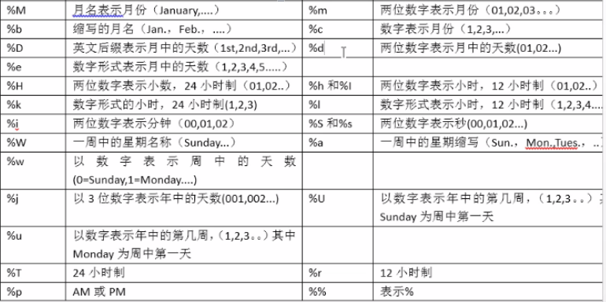

``数据库基础

***

## 第一章    绪论

### 一，数据库系统概述

#### 1，基本概念

1. 数据：描述事物的符号称为数据，数据的含义称为数据的定义，数据和其定义不可分割。
2. 数据库：数据库是长期存储在计算机内部，有组织，可以共享的大量数据的集合，数据库中的数据按照一定的数据模式组织，描述和存储，具有较小的冗余度，较高的数据独立性，易扩展性并且可以为用户共享，概括起来三个特点：永久存储，有组织和可以共享。
3. 数据库管理系统（`DBMS`）:数据库管理系统是位于操作系统和用户之间的一组数据管理软件，有几大功能：
   1. 数据定义功能（`DDL`），对数据库对象及组织进行定义。
   2. 数据组织存储和管理。
   3. 数据操纵功能（`DML`），实现对数据库的基本操纵。
   4. 数据库的事物管理以及运行管理。
   5. 数据库的建立和维护功能。
4. 数据库系统：数据库系统是由数据库，数据库管理系统，应用程序和数据库管理员（DBA）组成的存储，管理，处理，和维护数据的系统。

#### 2，数据库发展阶段

1. 数据管理技术的三个发展阶段
   1. 人工管理阶段
   2. 文件系统阶段
   3. 数据库系统阶段
      1. 数据结构化，这是数据库系统的主要特征之一，也是数据库系统和文件系统本质区别。
      2. 数据共享度高，冗余度低并且容易扩充。
      3. 数据独立性高。
         1. 物理独立性：指用户的应用程序与数据库中的数据的物理存储是相互独立的。
         2. 逻辑独立性：指用户的应用程序与数据库的逻辑结构是相互独立的。
      4. 数据由数据库管理系统统一管理和控制。 
         1. 数据的拿权型保护。
         2. 数据的完整性检查。
         3. 并发控制。
         4. 数据库的恢复技术。

#### 3，模型

数据模型：数据模型是一种模型，他是对现实世界数据特征的抽象，数据模型是用来描述数据，组织数据，和对数据进行操纵的，==数据模型是数据库系统的核心和基础ER图==。

1. 概念模型：也称为信息模型，是按照用户的观点对数据和信息进行建模，主要用于数据库的设计。
2. 逻辑模型：层次模型，网状模型，关系模型，面向对象关系数据模型，对象关系数据模型，==主要用于数据库的实现==。
3. 物理模型：他描述数据在系统内部的具体实现和标示方式。
   - 概念模型：实体，属性，码，实体型，实体集，实体之间的对应关系有一对一，一对多，多对多。
   - 概念模型的标示法：实体联系法。
4. 数据模型的组成要素：数据结构，数据操作，数据完整性约束。

2.关系模型==重点==

- 关系：一个关系通常对应一张表。
- 元组：表格中的一行对应一个元组。
- 属性：表中的一列即为一个属性。
- 码：表格中的某一个属性组可以唯一的标示一个元组。
- 域：域是一组具有相同数据类型的值得集合，属性的取值范围来自于某一个域。
- 分量：元组中的某一个属性值。
- 关系模式：对关系的一般描述为：关系名（属性一，属性二........）,关系模式一般就是我们所说的表头。
- 关系模式的每一个分量必须是不可在分割的数据项。
- 关系模式的三种约束：实体完整性，参照完整性，用户定义完整性。
- 关系模型中的操作为集合操作，操作对象和操作结果都是关系。

#### 4，数据库系统的结构

1. 数据库系统中有==型==和==值==得概念，型是指对某一类的数据的结构和属性的说明，值是型的具体说明。==模式==是数据库中全体数据的逻辑结构和特征的描述（==即表格中的表头==），他仅仅涉及型的描述不涉及具体的值描述，模式的一个具体的值是==实例==，同一个模式可以有多个实例，模式是相对稳定的，实例是相对变化的。

2. 数据库的三级模式结构：

   

   - 模式：模式也称为逻辑模式，是数据库中全体数据的逻辑结构和特征的描述，是所有用户的公共数据视图，模式实际上是数据库数据在逻辑级上的视图，一个数据库只有一个模式，定义模式时候不仅要定义逻辑结构（属性，类型的定义），而且要定义数据之间的联系，定义与数据有关的安全性完整性要求。
   - 外模式：外模式也称为子模式和用户模式，是数据库用户能够看见和使用的局部数据的逻辑结构和特征的描述，是数据库用户的数据视图，是与某一应用有关的数据的逻辑标示，外模式通常是模式的子集，一个数据库可以有多个外模式，同一个外模式也可以为摸一个用户的多个应用系统所使用，但是一个应用系统程序只允许使用一个外模式，数据库管理系统提供外模式数据定义语言（DDL）严格定义外模式。
   - 内模式：内模式也称为存储模式，一个数据库只有一个内模式，它是数据物理结构和存储方式的描述，是数据在数据库内部的存储于组织方式。

3. 数据库的二级映像功能与数据的独立性（==外模式/模式映像和模式/内模式映像==）保证逻辑和物理独立性

   - 外模式/模式映像
     - 外模式描述数据的全局逻辑结构特征，外模式描述数据的局部逻辑结构特征。一个内模式可以有多个外模式，对于每一个外模式，数据库都要有一个外模式/模式映像，==当模式发生改变时候（增肌新的属性，改变类型），可以对外模式/模式映像做相应的改变，他可以是外模式保持不变，相应的应用程序也不需要改变，这就保证了数据和应用程序的逻辑独立性==。
     - 模式/内模式映像
       - 数据库只有一个模式和内模式，所以模式/内模式也是唯一的，他定义了数据全局逻辑结构特征和存储结构之间的对应关系，==当数据库的物理存储结构改变的时候，可以对模式/内模式做相应的改变，可以使模式保持不变，从而应用程序也不需要改变，这就保证了数据与程序的物理独立性==。
     - 在数据库的三级模式映像中，数据库模式（全局逻辑结构）是数据库的中心和关键，他独立于数据库的其他层次，因此设计数据库首先设计数据库的逻辑结构模式。数据库的内模式依赖于他的全局逻辑结构，但是独立于数据库的用户视图（外模式），也独立于具体的存储设备，它是将全局逻辑结构中所定义的数据结构和联系按照一定的物理存储策略进行组织，已达到较好的时间和空间效率。
     - 数据库的外模式是面向具体的应用程序的，他定义在逻辑模式之上，但是独立于存储模式和存储设备，特定的应用程序是在外模式描述的数据结构上编制的，依赖于特定的外模式，与数据库的模式和存储模式独立，不同的应用程序可以使用同一个外模式，数据库的二级模式映像保证了数据库外模式的稳定性，从而保证了应用程序的稳定性。

#### 5，数据库系统的组成

- 硬件平台及数据库

- 软件

- 人员：数据库管理员，系统分析员，数据库设计人员，应用程序员，最终用户。

  

#### 6,数据库存储数据特点

1. 数据存放在表中，表存放在库中。
2. 每一个库有多张表，每一张表都有自己的标示。
3. 一张表的设计，类似于`java`中类的设计。
4. 表中字段的设计，类似于类中属性的设计。
5. 表中的单条记录，类似于一个对象。
6. 表中的所有记录。类似于一个集合。

## 第二章  关系数据库

### 一，关系数据结构以及形式化定义

1. 关系（二维表格）
   - 域：域是一组有相同数据类型的值得集合。
   - 笛卡尔积：


## 第三章 关系数据库标准语言`SQL`（结构化查询）

1. 一些常用命令的使用。

~~~ java
show databases//显示当前连接的所有数据库
show tables//显示当前库中的所有表
show tables from 库名//显示指定库中的所有表
show columns from 表名//显示表中的所有列
use 库名//使用或者打开某一个数据库
~~~

2. 语法规范

   1. 不区分大小写，每一条`sql`命令建议用分号结尾。

   2. 注释：

      1. 单行注释

         ~~~ java
         #注释
         --注释
         ~~~

      2. 多行注释

         ~~~ java
         /*多行注释*/
         ~~~

#### 1，`SQL`概述

1. 特点：

- 提供模式数据定义语言（`DDL`）,用来定义数据库的对象，库，表列等(`create,alter,drop`)。
- 提供外模式数据定义语言（`DDL`）
- 数据存储语言描述（`DSDL`）
- 数据控制语言（`DCL`），用来定义访问权限和安全级别（`Transaction,control,Languate`）。
- 数据查询语言（`DQL`），数据查询语言，用来查询数据（`select`）。
- 数据操纵语言（`DML`）：数据操纵语言，用来定义数据库记录，（`insert,update,delete`）
- 高度非过程化
- 面向集合的操作方式。
- 以同一种语法结构提供多种使用方式。

| `SQL`功能 | 动词                   |
| --------- | ---------------------- |
| 数据查询  | `select`               |
| 数据定义  | `create,drop,alter`    |
| 数据操纵  | `insert,update,delete` |
| 数据控制  | `grant,revoke`         |

!["sql对关系数据库的支持"的图片搜索结果](data:image/png;base64,iVBORw0KGgoAAAANSUhEUgAAASoAAACpCAMAAACrt4DfAAABvFBMVEX///+bm5vv7++3t7fn5+fIyMjg4OC/v7+lpaX39/d5eXn09PT8/Px8fHzExMQAAACxsbFjY2OVlZWsrKxycnLR0dFvb2/Pz8/k5OTY2NhpaWm6urrr6+ienp6Kior6//////jw/P+EhISPj49pQijm9fwUAAAXFxfL3vT//e0yAAD89e22zdtaKh/e6O9LS0s7FwBzgpqIn7nOvKbLxLrj18QxLirH1+RiWULDua7r7vK/yuGBna5ZWEyvxNyYgGJQXm1PPizaybkdGCGXjoQVDyFKCwA+AAB9gY8bQmSypJBrc3r17dsyMU0fAAB4bF5DV3IAHUUuMDcyPk1WKQCJfnbi29JIKAgAACkaJC9bSz7FtJ4ADh8pAACzvcsAEDkXJz59ZE4kNkaliHVXboAAEy09ZHpEJhQXEw43MS+TiH+koZY1UGRpdIMpGAMrMjtgSyxVTlpWbouYq8EHHRsAADorHx8yJhksPmi3noIhESRwW0xJQjCVe2lNVVJ7kaJDO0pYRUNLNBEmRFRzbFZbSDR3ZEFEYHFQTUYtJTdXVGtnUicAHSkAA0VCOjxETlZlSUJQX4N2YV9WSVkifmwhAAAVfUlEQVR4nO2di0PbRp7Hx2/Jkh+S5fcTeylhxdoFbFyTkDgOvaPGrVMovgOybhOSNoSQtPFdUpYASdt0s7c9vM39w/ebkQ2O8UOSzSNU3zbWoMf8Zj6aGY2k34wQ0qRJkyZNmjRp0qTpoog2ffBizwiV0eUzf9Dy6eizQmU/I0OnJteZobKckaFTk4ZKtjRUsqWhkq1LgMod9MOvaLEzCPmjp2XlMqC6kaduTqHCLd38p1n0b6OnZAVdBlT/PorEBXQzi9D0Z+gvGqoeKt5aNKDS5zj4RVRD1VP6dPm2hOojDVUvlb5EKLY0CxWQz91Gfxk5HStYHzwqtLfMz02izFjipuMa+mpRCCRPydCHjwr5TaSzYHKHVkbNfr+fOSU7lwDVWUlDJVsaKtnSUMmWhkq2zg6V9hRUroxOvfFY+tY/lEn9kf0i7h2zPnxWqGhLi+y2gNNuUSN7OJAwqTqyX8TOgK1Pks7qjc17cgrWuLqeotlqFbxDTg0RHbEKrtOIeDCFBSvIqOJIrwcO9JzCFUJvg4iF8PAjHkhswgOoBMFjVnyoJSAIcGTAOew0mT0CTpMncS6VrKtMTkNQZw0aDE6l7aTRCQd5XPCjnHJP0RBx0KYLGpwX7zptsqk9kuX0w0xIi+IXDxOWXTUqmlPTxslR/GJ2kjVUsqWhki0NlWxpqGRLQyVbGirZ0vpVTfl5HcgA92x4qYPTZSIBE9yb4GU4EkcGHOD9CLlIAPrfFAlAoSH78oCERMPTiJUCCDG8TuBxQE/WwD2bjwSopk245XGTQLBpEwDYm8aDJBo33K83jUs2fXBfGrZGwsc2mWaARXTTuGRTB3cNTZtmEnC1ZpiXsjA8aaVKtrS2SrY0VLKloZItDZVsaahkS0MlW+pRIa2zIEdGgby/sAoe/3CTw0akiK0Bw3AjHoJUliq9jWRJ8A05OdA1JxF7LmDBUlsBGXL6T6MKUh4g5T6FiAeV+raKFyKn80LcIFiH/B5oOOqLyi7dmp5QWBfhw5036WS1M5EuB8MtfKJLxJHTupDIUl9UBhXv6WW9G9Ypj9cut2lMexGKUcRtV3RFUcWA0tXmtoormlbl/twflYozee6o/mMSGH0xgYOZ/2TC5dXw2s+6rLRt/Y7+rwfKbV9SVJmxpVSq+jFGRae/rghzS/G1e9YJ0WkwGIKPVqt732SVG7+cqO7ec209lFBtOGYc1fm6vbydRRnHGGhpZmzm+X3lxi8lqmlHDWXumL+7D00SXXyQLN5LxBNr3za2ZhxXlFsm1pWimo/G/H6/D+nJ6HR/x8SrQVWqohBETKPGuPfZTomVhSrjqFPRjXvMdw9XoZ7tztwvjh0epjbvI5FyuVxU2jEhJ5YO1hWict+9Vsi7Hk2iGwvUocu19RjWJdqHSapAJeaWsnsHrjdXxp9SK9suV7mKtriFtiuVPFSxgOnJ05mD2J+rbxxXMreebs4sUxS1+y0qHR4CtOrHNTmxnJRSVGn7zeDUXmUSbSTXl+e/RHkk7t4bBipD8dmeeXLjyvh9tLZQnpq+Pn07ujPZlli5V8DYzTuj4p8nYovoO+5LbzCycmsxggGJT64i9P0zmbG0SXEFzExmpvb8gMp18E6oAaqcfX8IqBDaS0K0gGrxEbX4w8h0NZREhbZMyUZVdEwhQAWhsvfrXGqfm9nfT9UkVPTGg2hFzUgppagqT7YLU2VcqsLWuovj83AKh4Jq478m9rxTgIrj57a3uBXoMpa+aLumy0VVdABjCRXK/LfZsPV8bOwgmGWN6Rfcyx9Ljus7n8mL6H3rylDF3gV0uuoP3im0kWXSgex4HqHxYaAqLG4neOdkESogHdpaQOtVlPlbe+9HZlu168B9gSNU+tyL5dDuam224HCkAuEs9CVeTvaJo5MUV8C9K6iwWRNHNpI5IVKFCjikUiVCQbg7M2Ievx9bsfKz09XSgyzTdlMls1QVSbst/lVC9XXl1sEILmkTscawO3Ft9SwqIDQphXvpg53rO9cslvCrdB5QCcNBFds72Eu+Gq9b7M6V7UcTxVQqpbZZJ2KI5y1LI8kDt/UxiKpHIopRbfkWR0WeH1l32u0mU7rj3ZQqVLXpGkpHqrG4CUe81enWQxmqYesy9tZPSRoq+dY1VLKta6hkW9dQybZ+bg+MmzvJuHCzjQE3pguOSkd1lsvp6rKFkoXKKsUSFpzdomnKGYlI+8RP69W/LKl/uUV5+C5blAy6ogRrv4FjTFwQ4mc1sLSHVKMKC1Zh8JFoZEBi7xekZICgNX6u77WIVKJiyfvyQU82HWkMK+zx2t0nkEGLnlN4569Q6lAx8QBkQPB4hIFaDz/cwbgEr8lk6V5mTCaTN5Hwnv4cs7Qei2kJMO8FmKCtsQbKB1nq2e4B1AxAbD5zwOszMwzb3HQUOGmzzTjdDLB4mmAPyzC9bdLhME0eMpww1c+4ErpmA5YJTiAJeJsBP0JevAzq4shE1kD5tuOlE8pJkATAMNniBMNOEoCbdCkAKTEYPK4gBPRkjUEaeWowWKDKNG2a37cJLZL7PeMGaM9NYSFIjFuaxg1N402byBCJBA1OlgxBJcaZpk3JeLBp3N5m3DnUBm4Qv/WhXLrdgf77UNQwLA2qc3dwlIMqrKHC0lDJloZKtj4MVPh9t9PmM5v9anqSfyhURg/0Ia0eD6fKm/cPhQrfiOJbMJOqg4eEyv+BdBboiKDem3dwF3+v0xAkXdDufUUWtgZxFxR3NM9VLK9i7hzoE9ts8bg1Dv8GcvFndQEyf0+gx9nS26TbZdv5P1pQlwJ9XBq1MOjtvkvoO1AAl3yrEDmzmYe6eFQTp+ouSkgZ6OyMHebJU6Qu7tgtl4nGfWw3MZTH6vEzbSubkBp/40d7vaM51uCPAFU88/dKdavbs3U42V3rRMsDY7fO0FMWZ9wefH9VMNI4lnI29tHpLL1jOZJr8Am11KCSGrGub2zYcNcXFK2o+jZmJ2tWM7Eqrnv0hUTVQ4pQndQRKuXtE6OhkisNlWy1oIrZaSRaUOVomslQcCQkY8RIKyqxilBB8sVKN11z0id9szqgyo00McTCDZ+qWKcG5UKgKjmSuUcOQ/mes5HJjCP5sQxvvRZUG3N1m22tTg7aIf5t81zgZT3AVVEs3kL9BKoKt7lota4GsOXYPknNfoBbCgTyo6iY2m45tCOqmHuv5ve/9pKT8iv5dETIGJpLGo34OXorlZOoRDjOn877sTP7+N/xGtZozHyrN7bfW7Wi+jR5N7XEvX2aqsVMXlDRUS3e6T9ipLVUleo63Rx2fue4sVvc/jMUs9jLB3YLyizN9EKF0N4CP38bimSKezlT51JZVLGk63ZLEq0/Q9Mt3sCdUTnLCy7nK5c/5vX6v59we2fFBM9vJvhIMra2+LLFmfwkqpDzNeXayjtnQ15v5rHf6x2pRPhHP+t47AmX+e041ceo1h2bjmrulX/+vh8KGNHmRw7HPYWoeH6O0J3e567DQgya9g7sdkSjT1q+E9IJVTyRuE1C7/a38aKJqphFmZZhK10q4M5COLwcRWLY9cute04qi9LW+FubrYrWD5D4qhcqhO7y4Xk4GRXK+dPzvCucRFu2leW4FbIhpvY7oWLW72TXH9g81rWfG21FyXH1yPuhh1pQwdlxUeUDKopK+WL1XRLF3lnnDutW2wLqjari2uVd4WVc9TcsAezauO6xLR0uWoUJSMdmS9HuhmoxElkmIe6XOOwORcT9EuoGVElfsaUV6YgqHlkhu5SsiwFAUzF5C4/dJu8s2k3OdUKFNsbup29xHPf2cZS1W+wWS+VhFclQC6rK3alcrZj3I/FwdP26WIeEVlIj70ZWkn1Q0bllv838pjaLIF/7aANYxR7VClMZYJxbbr0udERVEuYW4/FN6xSUzolfR1+PAnvnc8+2IQHUcuUWp9KTqHK2TVt85dA6gWKH4t8rebgOObce7F5zJkY3rqO5Y7fdY1SlFzMzh0suiir/HI3dnBmbmal9J2sY4DGqWDkizNUFXT703Bl4Ww8Ylnxv31bh8oCR90RVyK9YD62RldrO5HxgiVu4USvWP4fz/TiKCo9HWnvdnUtV+mlyJbk3OYv2JvXfZ+EvVJmrxn7I5VEOYKWOTZ9ExRZvhxZ9azVWfF0tPZ4t3h9B6cNkZvJRbXwmbttcPCpWx6j26v8IUh7P87pnAef6J2gLf72tDBUUXVPxwGRKolnJw5tGs4Xtldp0HdJb7tWsi3aTN2UymaL6hq86q0f/on5gdq9Fd/Y5ruWUdS5VC25qTletTE1fK/AvEweVg/WFd6NM7gEmPZtryUaHUlXLUT9Q2Vz1xkRxfpmvrlf3+P9B+hvP8Htq8e1xiW5BZf+bKWC1zSzaPPiKgVEVH4yKnQaEdUflxBMQS52N3FUpJWFcC9t8gE6gisFRQafThYt7LEIKfSxugVv5E47TnUtVMZ54G4/YyNn4p1SG7u7nRwtPJ1A6zrecpJOoxuORRCoSJykcfyytesJto408pmToVAHp0qduHR4xsh2uIjr003b5y9JHtekHfTuhF6G3Lj0lMZL8NwZau/FJFtu7vx2adeORAwP0wsmamBc/b6m05by1X3UnWdm9495drdLQWVg6hCvt3Xtz/evgRUAlW8PqrXsduNAVHQfIYiZPQcQ1GcMm/4CooCWVnhK1ZqB/U/VHRKVWGirF1vvJnDgKNlEN5ozdEZWr91xefVHpI90SNQRU8X4Oz5JntEsQIk3f6EgD1WDO2J1QQc+w5/vsfg+MjVah2xxHQ3hgLM9B2oQ/IyL3Yy3ynLHN7S98wjrynQyh65siMmkskb3jVoq8VxMinSNQ96ZcsSweMn2XvI+1qHbGlubyElS/W/dLx5/rxE2mCM9HBB7UvyVX7YzNUgmet8V5PqGyqpghlQmcysQ5e2f7OVm7DeiMzQ/Youi5U3jX3M8Z+9gxmjhjM6ZAH8foxjvcgZyxWd5JdzDe2eZJ4xiVr83mGThjE39oEiDO2EHKYzh9Z2yzzuk+YbyHM7YUaHHG1gecks0zdcZuk8wKiDWAM/bgFfACjE5yy0c1gCva4KhO6zvFCqShki0NlWxpqGRLQyVbCq6Af2RURp/PaA/ofT6zrISoQ8WawUqCAlsq7+EgfUZ3wA8RnKMfrVEISB7/Mj8kqs4Z28J5PPiWqJdXcS/RjXuqwCnNoCxPDY9/GWMjBnHGdnsGnH5culM/5w/DsglB5kznRps0Nb2aWmSGrA7khU4J5/K54abDc0MRj6FtTWcxZjKBfLsbtSwxbo9gPrprl5+24wh0Hqqb4VOslRbqPWdmi6XNM7qbgpaIcMKNWqaCTStHbted1XTGPqHuqRyCM3Z3VKprQg9nbNnq/XbkfJyxu8pyrtOs9EE12MstkWq8IK2YiNdr7uiFf9qOVHyz/RKjKjgafkg7P4rUzbrz422qseLutwWH8mnELymq+UgkUl5agN8sYou/Z7jDuvC8zo1WLHa73bT72P0mL+Od/Pu6pKj+tMxxL5c4jnNcRV/9NvObv7ztXrs2izaI/+zqDPwonvRZGapSw434HaRofsQ9go7cXXcmvBXlnxGQhyoj+YnG8GeAVpA3CumQfKzQjaw/Q7LcnGz1CNU1hPZ+RGgcUDF3b9O7+bgt8t21RsQ7/6s4pUgZqpXAcy4QCOSjpfvr9+ffcj8jZ9DyyYElGESxw9hnkCMW5Z4q+USFDFSxlcCLRbC6Hc1MFifnN7nbMehtvAGrVRT7XLyduQZWN+prEs4WVOKLsRpBBYFqeSmVSs3UUIX0P3IONd/RUFSqSnWz2+9Poo1ayK1/tFJDwd0Di6U8aUc7U4U6V/fUCvH9IaMCq7dDYHUW3aiG3KGVlVrM8knNYvnloArpmK7P1QPV0mcIfUWa7BZUe6txRw2jKt5KzcwsUpTrpxoqLM2MHS4ZVE3krwjVbjbtcn5UKz1cKFdzb7bDIygDNXJ3FGWe1N6MZKbwPnNDR/Umm3a6HBOlh/zcxNbLBTimAEXo9Qh29X0dxRVQzCLxb8TL8RgV9kDbcFgcV0tfcM8sYdvcpzYr9kMrPBhFJeUNFVKGau8bwHB3AsWK1ena/JIV+yTfnViHJqqSnvL6c9t+P4oNG1Ws/A38/iuL6OL19eojyeputgjnpZKrmfzrB2AVVV5I7nhHqAJf4DEIb/iHV8fzxd+LXGBuyRNIZSVU6E/PkPK5JRSgilk8QS6w6eGuTNema+UaaW1jN4nTfmYqR83nKSo6dFSiJZDmAksebmT9+rqrXC3gsiveJANtCrUc9QiqFppuus0flyqSLxZXQOgsVFwrY2PfUFSS1a+vWmem1u+M/lPxPOKKKuA7OCG7UNCnq4XV+YUtfMUr5ssHUYwK/uG/h44KEQ/+/4MloLrHH2yBpdj8YhlfzQpQj3AFLDkm3N62Coh/K64tQIWKv8e2XuQrT+omtOO4k+LCyfEn+0+uK0gnkUJUouEVRlVbr03nVyZjW4fYHTx1LYpLmHRNN7TPKN5LslCtRcXc57AsXocqmC9PifP42wXFV9BIAxC4AiIxHA7z7c06qDS2WR/FqIqruEUr30nC5YhsL7x4rCSdRIpQmaJiEN8Q4E8rVJKiP2YhFV60E4dqUfljPlmoIPagn1hlsdWsaCe5FC0olGx35W6ieu/xDk2zEpeWlbTy7u0l7a2fhjRUsqWhki0NlWxpqGQreK4T+HxQD4zd3X2iz0C9YXR2xu6tM3LGPnd1m6kHdfgUTW9J3SZpf/wlG4ZhaYYmQVrainc4s4mehq8QkrL3PhKcMYbFDUXHdpVuA4xZSNBDbKixoJkQ0tMsQ0M8rD4EhrCLbegC+NOoVQhyZGQQE2KZEPxj9JBNkm0GsaEQDTnE+WQYQkDPMDQNudYzIWmFD7s7wwo4hsYR6H3I14gWx4B3hM2+EOykRzT83/6dqg9JIfIfHskH9yKQM6kWEVqwjmxlIaOkHOESA8UFyglDDiJHhxg9jbdiDvpQAxULpVGPPycVMgI1Rs/oWR9GpdeHzjGvA4rUjAYZyDMsaVKoMDKoPLhUQfWCYoNnlgjhqqdHUtHCtQ4WNCMdjR+2AxMJoQ+o+oAXi8sVLZU8hAsi897V309GAxkQ8pLrgwVueZsXCgte8l48NgsH4IbURQJmuEqTALQMZF88joREw8OpkQJgphnQk0AYUsQ3rmmSTbhqu0kg2LRpb17TwHiQHO1GyNk0jm0mcAAO4nneyKIICQE6Mk1dAipmhA/DphBYwDEnEGvm8b46CCTgbzDOgs0EybApwYcjRoSpSpeFRnveWNB4cQFcuoegHhcnVkEOWVrFIwRNmjSdmf4f81AMSQ9FrnMAAAAASUVORK5CYII=)

#### 2，**（`date define language`）数据定义语言：主要用来操作数据库，操作数据表。**

~~~ java
//修改表语句
 ALTER TABLE 表名 ADD|MODIFY|CHANGE|DROP| COLUMN 字段名 字段类型 字段约束;
~~~

| 操作对象 | 创建          | 删除        | 修改        |
| -------- | ------------- | ----------- | ----------- |
| 模式     | create scheme | drop scheme |             |
| 表       | create table  | drop table  | alter table |
| 视图     | create view   | drop view   |             |
| 索引     | create index  | drop index  | alterindex  |

##### 2.1，模式定义删除

1. 模式的定义和删除

   ~~~ java
   create scheme<模式名>authorization<用户名>
   ~~~

2. 在创建模式的时候可以创建表，视图，定义授权

   ~~~ java
   create scheme<模式名>authorization<用户名>[表定义子句|视图定义字句|权限定义子句]
   ~~~

3. 删除模式
   ~~~ java
   - drop scheme <模式名>cascade|restrict
   //选择cascade级联标示删除模式的时候把与该模式所有有关的数据库对象全部删除，选择restrict标示拒绝执行删除操作。
   ~~~

##### 2.2，表的定义删除

1. 定义基本表（定义基本表还可以定义完整性约束，完整性约束可以再列上和表上）

   ```java
   创建表：
   create table if not exists表名(
   字段名	字段类型	[字段约束]
   字段名	字段类型	[字段约束]
   字段名	字段类型	[字段约束]
   字段名	字段类型	[字段约束]
   字段名	字段类型	[字段约束]
   字段名	字段类型	[字段约束]
   );
   //加上约束：
   CREATE TABLE stuinfo(
   	stuName VARCHAR(10) UNIQUE,#添加非空约束
   	stuId INT PRIMARY KEY,#添加主键约束
   	stuEmail VARCHAR(10)
   	gender CHAR(1) DEFAULT '男' NOT NULL;#添加默认约束,约束还可以叠加
   	age INT CHECK(age BETWEEN 1 AND 100);#age添加约束，但是mysql不支持
   	#添加外键约束
   	majorid INT ,
   	CONSTRAINT fk_stuinfo_major FOREIGN KEY (majorid) REFERENCES major(id);
   );
   create table student
   (
   	sno varchar(10) primary key,
   ​	sname varchar(10) not null
   ​	)
     //完整性约束定义在列的级别上面。  
   ```

   ```java
   create table course
   (
   	cno varchar(10) primary key,
   ​	cname varchar(10) not null,//属性级别
   ​	foreign key(cpno) references course(con)//表级别上的约束
   ​	);
   //cno 和cname是属性级别的约束，而外码cpno是表级别的约束，此例子说明表级别的约束还可以在同一个表上面。
   ```

2. 查看表的结构：`desc `表名

##### 2.3，数据类型

~~~ java
char(n) character(n)//长度为n的定长字符串
varchar(n)//最大长度为n的变长字符串
clob//字符串大对象
blob//二进制大对象
int integer//长整形（4个字节）
smallint//短整形（2字节）
bigint//大整形（8字节）
numeric(p,d)//定点数，由p位数字组成（不包含符号和小数点），小数点后d位数字
decimal(p,d),DEC(p,d)//同numeric
double //双精度浮点数
real//单精度浮点数
float(n)//可选精度浮点数
boolean//布尔变量
date//日期格式为YYYY-MM--DD
time//时间HH-MM-SS
timestamp//时间戳类型
interval//时间间隔类型
~~~

##### 2.4，模式与表

- 每一个基本表都属于一个模式，一个模式有多个基本表，定义一个基本表后，有三种方法定义其基本模式

  1. 在表的名称中显示给出模式名

     ~~~ java
     create table "S-T".student(表的定义)//S-T是模式名称
     ~~~

  2. 在创建表的时候给出模式名

     ~~~ java
     create scheme "S-T" authorization "rzf" 
     create table student(表的定义)
     ~~~

  3.  设置所属的模式，这样在创建表的时候不必显式指出模式名

     ~~~ java
     set search_path to "S-T",public 
     create table student()
     //设置模式以后，在创建表的时候系统按照路径搜索一组模式列表，系统先把模式列表中第一个模式作为数据库对象的模式名，如果搜索路径中模式名都不存在，系统报错。
     ~~~

##### 2.5，修改基本表

~~~ java
alter table <表名>
[add [column]<新列名><数据类型>[完整性约束]]
[add<表级别的完整性约束>]
[drop [column]<列名>[cascade|restrict]]
[drop constraint<完整性约束>[cascade|restrict]]
[alter column<列名><数据类型>]
~~~

##### 2.6，删除基本表

~~~ java 
drop table <表名>[cascade|restrict]
~~~

##### 2.7，索引的建立与查询

~~~ java
create [unique][cluster] index <索引名>
on <表名>(<列名>[次序]，<列名>[次序].....)
//unique表名此索引的每一个索引值只对应唯一一条记录，cluster标示是聚簇索引。次序可选为DESC和ASC。
//例如
create unique index stusno on student(sno)
//修改索引
alter index <旧索引名> rename to<新索引名>；
//删除索引
drop index <索引名>
~~~

##### 2.8，常用数据类型

~~~ java
int：整型
double/float：浮点型，例如double(5,2)表示最多5位，其中必须有2位小数，即最大值为999.99；
decimal：浮点型，在表示钱方面使用该类型，因为不会出现精度缺失问题；
数据类型精度：decimal>double>float
char：固定长度字符串类型；char(4) 范围是0-255
varchar：可变长度字符串类型；
text：字符串类型；表示存储较长文本
blob：字节类型；//jpg mp3 avi
date：日期类型，格式为：yyyy-MM-dd；
time：时间类型，格式为：hh:mm:ss
timestamp/datetime：时间戳类型；日期+时间 yyyyMMdd hhmmss
~~~

1. `char`和`varchar`对比

|         | **意思**     | **格式**   | **n的解释**                 | **特点**                            | **效率** |
| ------- | ------------ | ---------- | --------------------------- | ----------------------------------- | -------- |
| Char    | 固定长度字符 | Char(n)    | 最大的字符个数，可选默认：1 | 不管实际存储，开辟的空间都是n个字符 | 高       |
| Varchar | 可变长度字符 | Varchar(n) | 最大的字符个数，必选        | 根据实际存储决定开辟的空间          | 低       |

2. `Datetime`和`Timestamp`对比

   |           | 保存范围            | 所占字节 |
   | --------- | ------------------- | -------- |
   | Datetime  | 1900-1-1~xxxx年     | 8        |
   | Timestamp | 1970-1-1~2038-12-31 | 4        |

3. 类型总结

   ~~~ java
   #数据类型
   #整形：
   TINYINT(一个字节) SMALLINT（二个字节） INT（四个字节） BIGINT（八个字节）
   #浮点型(m,n)可选
   FLOAT(m,n) 
   DOUBLE(m,n)
   DECIMAL(m,n)
   #字符型
   CHAR(n)
   VARCHAR(n)
   TEXT
   #日期型
   DATA TIME DATETIME TIMESTAMP
   #二进制型,存储图像数据
   BLOB
   ~~~

4. 整数数值类型范围

   ~~~ java
   bigint
   
   从 -2^63 -1(-9223372036854775808) 到 2^63-1 (9223372036854775807) 的整型数据（所有数字），无符号的范围是0到
   
   18446744073709551615（2^64 - 1）。一位为 8 个字节。
   
   int
   
   一个正常大小整数。有符号的范围是-2^31-1 (-2,147,483,648) 到 2^31 - 1 (2,147,483,647) 的整型数据（所有数字），无符号的范围是0到4294967295（2^32 - 1）。一位大小为 4 个字节。
   int 的 SQL-92 同义词为 integer。
   
   mediumint
   一个中等大小整数，有符号的范围是（-2^23-1）-8388608到到 2^23-1 8388607， 无符号的范围是0到16777215（2^24 - 1）。 一位大小为3个字节。
   
   smallint
   
   一个小整数。有符号的范围是-2^15-1(-32,768) 到 2^15 - 1 (32,767) 的整型数据，无符号的范围是0到65535（2^16 - 1） 。一位大小为 2 个字节。MySQL提供的功能已经绰绰有余，而且由于MySQL是开放源码软件，因此可以大大降低总体拥有成本。
   
   tinyint
   
   有符号的范围是-128 - 127（-2^7 -1，2^7 -1），无符号的范围是 从 0 到 255（2^8 -1） 的整型数据。一位大小为 1 字节。
   ~~~

   ##### 2.9，修改表名

   ```java
   ALTER TABLE 表名 RENAME TO 新表名;
   ```

   ##### 2.10，添加新的字段

   ```java
   ALTER TABLE 表名 ADD COLUMN 新字段名 字段类型 字段约束;
   ALTER TABLE student ADD COLUMN borndate DATETIME NOT NULL;
   ```

   ##### 2.11，修改字段的名字

   ```java
   ALTER TABLE 表名 CHANGE COLUMN 旧字段名 新字段名 新字段类型 【新字段约束】;
   ALTER TABLE student CHANGE COLUMN borndate(旧字段名) birthdate（新字段名） TIMESTAMP NOT NULL;
   ```

   ##### 2.12，修改字段的类型

   ```java
   ALTER TABLE 表名 MODIFY COLUMN 字段名 新字段类型 【新字段约束】; 
   ALTER TABLE student COLUMN MODIFY birthdate DATETIME;
   ```

   ##### 2.13，删除字段

   ```java
   ALTER TABLE 表名 DROP COLUMN 字段名字;
   ALTER TABLE student DROP COLUMN birthdate;
   ```

   ##### 2.14，**复制新表,仅仅复制表的结构**

   ```java
   CREATE TABLE newTable LIKE 要复制的表;
   ```

   ##### 2.15，复制表的结构和数据

   ```java
   CREATE TABLE newTable SELECT * FROM 复制的数据来源;
   ```

   ##### 2.16，如果只复制表的一部分结构，并且不复制表的内容

   ```java
   CREATE TABLE newTable 
    SELECT 要复制的字段名字
    FROM 库名.表名
    WHERE 条件
   ```

#### 3，数据查询

~~~ java
select [all|distinct]<目标列表达式><目标列表达式>.....//查询的内容
from [<表名或者视图名> <表名或者视图名>.......|<select 语句>[as]<别名>//从哪里查询，表，视图，临时表
[where <条件表达式>] //查询条件
[group by <列名1>[having <条件表达式>]]//分组并且进行赛选
[order by <列名二>[asc][desc]];//排序
//语句执行顺序
where---->from---->select---->group by---->having---->order by
~~~

- 说明：

  - 查询的结果集是一个虚拟的表。
  - 查询目标列表达式可以是单个字段，多个字段，常量，表达式，函数，也可以是以上的组合。

- `+`的作用：

  - 加法运算，如果两个操作数都是数值型，就直接做加法运算。

  - 如果其中一个是非数值型，就做强制转换，如果转换失败，那么就当做0处理。

    ~~~ java
    "123"+4=127
    "abc"+4=4
    ~~~

  - 如果其中一个为`null`,那么结果就是`null`.

##### 3.1， 单表查询

~~~ java
select <查询列表达式> from <表名>
~~~

##### 3.2，消除重复列

~~~ java 
select [distinct]<查询列表达式> from <表名>
select [all]<查询列表达式> from <表名>==select <查询列表达式> from <表名>
~~~

##### 3.3， 条件查询

~~~ java
//比较
=，>,>=,<,<=,!=,<>,!>,!<,not+上述运算符
//确定范围
between and,not between and
//确定集合
in ,not in
//字符匹配
like,not like
//空值
is null,is not null
//逻辑运算
and，or,not
//通配符
%：代表任意长度
_:代表单个任意字符
//转义字符
escape '\'
select [all]<查询列表达式> from <表名>==select <查询列表达式> from <表名>
where <条件表达式>
~~~

##### 3.4，空值处理

~~~ java
select [all]<查询列表达式> from <表名>==select <查询列表达式> from <表名>
where <条件表达式> is null;
//这里的is不可以换成==，null是不确定的意思
~~~

##### 3.5，聚集函数


~~~ java
count(*)//统计元组的个数
count([distinct|all]<列名>)//统计一列中值得个数
sum([distinct|all]<列名>)//统计一列中值的总和
avg([distinct|all]<列名>)//统计一列中值得平均值
max([distinct|all]<列名>)//统计一列中最大值
max([distinct|all]<列名>)//统计一列中最小值
~~~

`note`:聚集函数只能用于`select`子句和`group by`子句中的`having`子句中。

- `group by`子句：`group by`子句将查询结果按照一列或者多列进行分组，值相等的为一组，对查询结果进行分组是为了细化聚集函数的作用对象，如果未分组，那么聚集函数将对整个查询结果起作用，如果进行分组，那么聚集函数将作用于每一个分组，如果分组以后还要进行赛选，用`having`子句，`where`子句作用于基本表或者视图，从中选择满足条件的元组，`having`作用于组，从中选择满足条件的组。

##### 3.6，连接查询

- 当查询中涉及多个字段的时候，那么需要通过多表连接

  ~~~ java
  (1)Select 查询列表
  (2)From 表1 别名1，表二 别明二
  (3)Where 连接条件 
  (4)and 筛选条件
  (5)Group by分组列表
  (6)Having 分组后的筛选
  (7)Order by  排序列表；
  //执行顺序：2-3-4-5-6-1-7
  ~~~

- 同时涉及两个或者两个以上的表查询称为连接查询。

  ###### 等值与非等值连接查询

  - 连接查询的`where`子句中用来连接两个表的条件称为连接条件或者连接谓词
    - 格式为：[表名1]<列名1><比较运算符>[表名1]<列名1>
    - 条件表达式：`=,<,>,<=,>=,!=`
    - 逻辑表达式：`and,or,not`
    - 模糊查询：`like`,一般和通配符一起使用：_或者%
    - 连接谓词符号为`“=”`时是等值连接，使用其他符号为非等值连接。
    - 如果在等值连接中把重复的属性列去掉就是**自然连接**。
    - 一条`sql`语句同时完成连接查询和选择，这时`where`子句是由连接谓词和选择谓词组成的复合条件。
    - `Between and`:用于判断是否在区间。
    - `Not between and`:用于判断不在某个区间。
    - `In`:用于判断某字段是否在指定列表。
    - `Is null`:判断`null`值。

  ###### 自身连接

  - 在做自身连接时候，要为两个表起别名。

    ~~~ java
    select first.cno,second.cpno
    from course first,course second
    where first.cpno=second.cpno
    //查询每一门课程的间接先修课
    ~~~

  ###### 外连接

  - 查询结果为主表中所有的记录，如果从表中有与之相匹配的记录，那么显示匹配记录，如果从表中没有匹配记录，那么显示为null.

  - 一般用于主表中有，从表中没有的记录。
    - 特点：外连接分主从表，顺序不能交换。
    - 左连接：左边的是主表。
    - 右连接：右边为主表。

  - 左外连接列出左边所有的悬浮列

  - 右外连接列出右边所有的悬浮列

    ~~~ java
    Select 查询列表
    From 表一 别名一
    Left/right /full outer join 表二 别名二
    Where 筛选条件
    Group by 分组列表
    Having 筛选条件
    Order by 排序列表；
    full代表全外连接
    ~~~

  ###### 多表连接

  - 两个以上表进行连接。

  ###### 内连接

  ~~~ java
  1)Select 筛选条件
  2)From 表一  别名一 
  3)Inner join 表二 别名二 On 连接条件
  Inner join 表二 别名二 On 连接条件
  Inner join 表二 别名二 On 连接条件
  ...........//在这可以添加多个表的连接
  4)Where 筛选条件一
  5)Group by 分组列表
  6)Having 分组后的筛选条件
  7)Order by 排序列表
  //执行顺序：2-3-4-5-6-7-1
  ~~~

  - 小结：

    

  - 总结：

    1. 连接

    ~~~ java
    外连接
    SELECT 查询列表
    FROM 表名一 别名一
    LEFT|RIGHT|FULL [OUTER] JOIN 表二 别名二
    ON 连接条件
    WHERE 筛选条件
    GROUP BY 分组列表
    HAVING 分组后的查询列表
    ORDER BY 排序列表
    LIMIT 查询条目
    #特点：
    外连接的查询结果=内连接的查询结果+主表有但从表没有的记录
    外连接区分主表从表
    外连接一般用来查主表有但从表没有的记录。
    ~~~

##### 3.7，嵌套查询（相关子查询和不相管子查询）

- 一个`select-from-where`语句称为一个查询块，将一个查询快嵌套在另一个查询的`where`或者`having`子句中的查询称为嵌套查询。

- 子查询的`select`语句中不能使用`order by`子句，`order by`子句只能对最终的结果进行排序。

- **带有`exists`谓词的子查询，不返回任何查询结果，只返回逻辑真或者假。**

  分类

  1. 带有`in`谓词的相关子查询，通常根据某个属性在子查询中查询。

  2. 带有比较运算符的子查询。

  3. 带有`any(some)`或`all`谓词的子查询

     - 在子查询返回**单值**时用比较运算符，返回多值得时候用`any(some,all)`

       ```java
       >any//大于子查询结果中的某一个值，用聚集函数也就是大于最小值
       >all//大于子查询结果中的所有值，聚集函数中大于最大值。
       <any//小于子查询结果中的某一个值，用聚集函数也就是小于最大值
       <all//小于子查询结果中的所有值，聚集函数中大于最小值。
       >=any//大于等于子查询结果中的某一个值，用聚集函数也就是大于等于最小值
       >=all//大于等于子查询结果中的所有值，聚集函数中大于等于最大值。
       <=any//小于等于子查询结果中的某一个值，用聚集函数也就是小于等于最大值
       <=all//小于等于子查询结果中的所有值，聚集函数中大于等于最小值。
       =any//等于子查询结果中的某个值，in谓词一样
       !=all//不等于子查询结果中的某个值，not in谓词一样 
       ```

     |      | =    | !=     | <    | <=    | >    | >=    |
     | ---- | ---- | ------ | ---- | ----- | ---- | ----- |
     | any  | in   | --     | <max | <=max | >min | >=min |
     | all  | --   | not in | <min | <=min | >max | >=max |

- 带有in谓词的子查询：子查询的结果往往是一个集合

  ~~~ java
  select * 
  from stu
  where sdept
  in (
  select sdept 
  from stu 
  where sname='liuchen'
  );
  ~~~

  - 说明：在这里可以用=代替in来查询，应为子查询返回的是一个单值，但是如果刘晨有重名，就会报错，也就是返回不是单值得时候用=会报错。

- 相关子查询：如果子查询的查询条件依赖于父查询，这类查询称为相关子查询，如果不依赖于父查询，那么称为不相管查询。带有比较符的查询是指父查询与子查询之间用比较运算符进行连接。

- **当用户确切知道内层查询返回单个值时候，可以用>,>=,<,<=,!=或者<>等运算符进行运算。**

  ~~~ java
  //找出每个学生超过他自己选修课程平均成绩的课程号
  select sno,cno 
  from sc x
  where grade>(
  select avg(grade)
  from sc y
  where x.sno=y.`sno
  );
  ~~~

- 带有`any,some,all,`的谓词查询。

  **当内层查询返回单值得时候，用比较运算符，但是当内层查询返回多值集合时候，要用any,some,all等谓词配合运算符进行运算。**

  ~~~ java
  >any:大于子查询结构中的某一个值。（最小值）
  >all:大于子查询结果中的所有值。（大于最大值）
  <any:小于子查询结果中的某个值，（小于最大）
  <all:小于子查询结果中的所有值。（小于最小）
  >=any
  >=all
  <=any
  <=all
  =any:等于子查询结果中的某个值。（=in）
  ！=all:不等于子查询结果中的任何一个值。（not in）
  =any等价于in谓词，<any等价于<max,<>all等价于not in谓词，<all等价于<min谓词。
  ~~~

- 带有`exists`谓词的子查询

  - 带有`exists`的子查询不返回任何数据，只产生逻辑真`true`或者逻辑假`false`。可以利用`exists`来判断`x`属于`S`。

##### 3.8，集合查询

- 集合查询包括：并：`union`,交：`intersect`,差:`except`

- 参加集合操作的各个查询结果的列数必须相同，对应列的数据类型也必须相同。

- `union` 联合:语法

  ~~~ java
  SELECT 查询列表 FROM 表1 UNION 
  SELECT 查询列表 FROM 表1 UNION 
  SELECT 查询列表 FROM 表1 UNION 
  SELECT 查询列表 FROM 表1 UNION 
  SELECT 查询列表 FROM 表1 UNION 
  SELECT 查询列表 FROM 表1 UNION 
  ~~~

  - 说名

    默认去重。

    多条待查询的语句列数必须一致。

##### 3.9，基于派生表的查询

- 基于派生表的查询：子查询不仅可以出现在`where`子句中，还可以出现在`from`子句中，这时子查询生成的派生表成为主查询的查询对象。

- 子查询不仅可以出现在`where`子句中，还可以出现在`from`子句中，这时称为派生表查询。

- 对于派生表，要为其指定一个别名。

  ~~~java
  //Select子句的一般格式：
  Select [all|distinct]<目标列表达式>[别名].......
  From <表明或者视图名>[别名]...........（select 语句）as 别名
  where <条件表达式>
  Group by <列名1....> having<条件表达式>
  Order by <列明1......>[asc|desc]
  ~~~

  

##### 3.10，select语句格式说明

~~~ java
select [all|distinct]<目标列表达式><目标列表达式>.....//查询的内容
from [<表名或者视图名> <表名或者视图名>.......|<select 语句>[as]<别名>//从哪里查询，表，视图，临时表
[where <条件表达式>] //查询条件
[group by <列名1>[having <条件表达式>]]//分组并且进行赛选
[order by <列名二>[asc][desc]];//排序
//语句执行顺序
where---->from---->select---->group by---->having---->order by
~~~

~~~ java
//目标列表达式
1.*
2.<表名>*
3.count([distinct|all]*)
4.[表名].<列属性>
//聚集函数的一般格式
count
sum
avg     +([distinct|all]<列名>)
max
min
//where子句条件表达式
				<属性列名>
<属性列名><运算符> <常量>
				[all|any](select 语句)
						<属性列名>				<属性列名>
    <属性列名>[not]between	<常量>		and		<常量>
    					(select 语句)				(select 语句)
    					<值1>
    <属性列名>[not] in 
    					(select 语句)	
<属性列名>[not] like<匹配串>
<属性列名>is [not] not
[not] exists (select 语句)	
~~~

说明：

- []标示其中的内容可以根据需要进行省略。
- |标示二选一操作。
- `select`标示指定输出的内容。
- `from`字句标示用于指定检索数据的来源表。
- `where`字句称为“行条件字句”用于指定对元组的选取条件。
- `group by`字句称为“分组字句”，作用是指定对元组进行分类后再进行检索。
- `having`子句称为“组条件字句”，作用是对指定元组分类后在进行检索。
- `order by`字句，称为“排序字句”，作用是对检索到的元组进行排序。
- `limit`字句，是对最后输出元组个数进行限制。
- 整个语句的执行过程。
  - 读取`from`字句中的基本表，视图的数据，执行笛卡尔积操作。
  - 选取满足`where`字句中给出的条件表达式的元组。
  - 按照`group by`字句中指定的列值进行分组操作，同时提取出满足`having` 字句中组条件表达式的那些组。
  - 按照`select` 字句中给出的列名或者列表达式求值输出。
  - `order by`字句对输出的目标进行排序操作，按照升序或者降序。
  - `limit`字句对最终的元组输出的行数进行限制输出即可。

##### 3.11，排序查询

~~~ java
select 查询列表from 表名 where 查询条件 order by 排序依据(sec，desc).
~~~

- 排序字段可以是：单个字段，多个字段，表达式，函数，列的索引，别名，以及以上的组合。
- `Note`:`order by`子句只能对最终的查询结果进行排序，不可以用在`select`的子查询中。

##### 3.12，分组查询

~~~ java
Select 分组函数，分组的字段
From 表名
Where 分组前的筛选条件
Group by 分组列表
Having 分组后的筛选条件
Order by 排序列表
~~~

- 说明：

  - 分组列表可以是单个字段和多个字段

  - 筛选条件分为两类:
    分组后的筛选。先分组，后筛选，

    如果条件放在where子句中，就是分组前的筛选，筛选是基于原始表筛选

    如果条件放在having子句中，那么就是分组后的筛选，筛选是基于分组后的筛选

  ​					筛选的基表		使用关键词		关键词位置

  分组前的筛选		原始表			where子句		group by前面

  分组后的筛选		分组后的表		having 子句		group by 后面

##### 3.13，子查询

- 子查询不一定必须出现在`select`语句中，只是出现在`select`语句中的情况较多。

- 分类：按照子查询出现的位置进行分类

  - 子查询出现在`select `后面，**要求：子查询的结果为单行单列（标量子查询）。**

  - `from `后面，**子查询结果可以为多行多列（子表的形式）。**

  - `where`或者`having `，**子查询必须为单列。**
  - 单列：单行子查询（单行单列），多行子查询（多行单列）

  - `exists`后面，子查询结果必须是单列（相关子查询）

- 特点：

  - 子查询放在条件中，必须放在条件的右侧。
  - 子查询一般放在小括号中。
  - 子查询的执行优先于主查询。
  - 单行子查询对应了单行操作符：>,<,<=,>=,<>
  - 多行子查询对应多行操作符：any some all in 

- 多行子查询：`in all any`

  - `In`:判断某字段的值是否在指定的列表里面。`X in(30,50,90)`

  - `Any/some`：判断某字段的值是否满足其中任何一个。

    ~~~ java
    X>any(30,50,90)==x>min(30,50,90)
    X=any(30,50,90)==x in(30,50,90)
    ~~~

  - `All`:判断某字段的值是否满足里面所有的。例如：`x>all(30,50,90)==x>max(30,50,90).`

- 小结：

  ~~~ java
  嵌套查询：在select语句中又嵌套了另一个select语句查询，里面的
  #查询成为子查询或者内查询，外面的查询成为主查询或者外查询。
  分类：select后，where或者having后，from 后，exists后。
  ~~~

  

##### 3.14，分页查询

~~~java
SELECT 查询列表
FROM 表名
WHERE 筛选条件
LIMIT 起始索引,查询条目数;
~~~

- 说明：

  - 表中条目索引默认从0开始
  - 如果limit子句中起始条目为0，那么可以省略不写
  - 显示第page页，每页size条：`limit (page-1)*size,size;`

#### 3.15，`Select`语句的使用技术

`Select`语句有三种写法，连接查询，嵌套查询，和带存在量词的嵌套查询，下面举个例子说明。

~~~ java
//表的定义
CREATE TABLE IF NOT EXISTS T(//教师表
Tid CHAR(4) NOT NULL,
Tname CHAR(8) NOT NULL,
Title CHAR(8) 
PRIMARY KEY(Tid)
)
CREATE TABLE IF NOT EXISTS C(//课程表
Cid CHAR(4) NOT NULL,
Cname CHAR (10) NOT NULL,
Tid CHAR (4),
PRIMARY KEY(Cid),
FOREIGN KEY (Tid)REFERENCES T(Tid)
)
CREATE TABLE IF NOT EXISTS S(//学生表
Sid CHAR (4) NOT NULL,
Sname CHAR(8) NOT NULL,
age SMALLINT,
sex CHAR(2),
PRIMARY KEY(Sid)
)
CREATE TABLE IF NOT EXISTS SC(//学生课程表
Sid CHAR(4),
Cid CHAR (4),
score SMALLINT,
PRIMARY KEY (Sid,Cid),
FOREIGN KEY Sid REFERENCES S (Sid),
FOREIGN KEY Cid REFERENCES C (Cid)
)
//检索学习课程号为c2课程的学生学号和姓名成绩。
//第一种方法，使用连接查询
select S.Sid,S.Sname,score
from S,SC
where S.Sid=SC.Sid and SC.Cid='C2';
//使用嵌套查询
SELECT Sid,Sname
FROM S 
WHERE Sid
IN(
	SELECT Sid 
	FROM SC
	WHERE Cid = 'C2'
)
//使用存在量词查询，并且是相关子查询
SELECT Sid,Sname
FROM S
WHERE EXISTS(
	SELECT * 
	FROM SC
	WHERE S.Sid=SC.Sid AND SC.Cid= 'C2');
~~~


#### 4，数据更新（**`DML`语言：数据操纵语言，`insert update delete`**）

- 说明

  ~~~ java
  //单条数据的插入
  Insert into 表名（字段名1，字段名2.....）values(值1，值2........)
  ~~~

  - `Note`:字段和值列表一一对应，包含类型，约束必须匹配。

    数值类型的值不用单引号，非数值类型的值，必须用单引号。

- 批量数据插入

  ~~~ java
  Insert into 表名（字段名1，字段名2.....）
  values(值1，值2........)，(值1，值2........)，(值1，值2........)........;
  //如果用value只能插入单行数据;
  ~~~

##### 4.1，插入数据

~~~ java
//一次插入多个元组
insert into <表名>[<属性列>，<属性列>，<属性列>......]
values (元组1)， (元组2)， (元组3).....;
~~~

- 插入子查询

  ~~~ java
  insert into <表名>[<属性列>，<属性列>，<属性列>......]
  子查询；
  ~~~


##### 4.2，修改数据

- `Update` 语句用于修改表中的数据。

  语法：`UPDATE` 表名称` SET `列名称 = 新值` WHERE` 列名称 = 某值

- 更新某一行中的若干列

  `UPDATE `表名`SET` 字段名= 新值, 字段名= 新值

  `WHERE` 筛选条件；

~~~ java
update <表名>
set<列名>=<表达式>，<列名>=<表达式>.....
[where <条件>]
//带子查询的修改
update <表名>
set<列名>=<表达式>，<列名>=<表达式>.....
[where <条件> in （子查询）]
~~~

##### 4.3，删除数据

~~~ java
delete from <表名>
[where<条件>]
//delete删除的是表中的数据而不是表的定义
//带子查询的删除语句
delete from <表名>
where <条件> in
(子查询)
~~~

##### 4.4，空值的处理

- **数据库中的空值`null`代表“不知道”，“不存在”，不确定的意思。**
- 空值的判断：`is null`,`is not null`。
- 空值得约束条件：`not null`约束条件不允许取空值，`unique`约束唯一，码属性不能取空值。
- 空值与另一个空值的算数运算为空值。
- 空值与另一个值（包括空值）的比较运算为`unknow`.
- 在查询语句中，只有`where`和`having`子句中的选择条件为`true`时才会被选择出来。

##### 4.5，设置自增长

~~~ java
Create table stu(
Stu_id int primary key auto_increment,
Stu_name char(10) not null
);
~~~

- 说明：

  -  自增长列必须要求设置在一个键上，比如主键或者唯一键。

  - 自增长列数据类型为数值型。

  - 一个表最多有一个自增长列。

##### 4.6，删除操作：`delete`,`truncate`语句两种方式

- `delete`删除语句

  - `delect`的功能是从指定的列表中删除满足`where`子句的所有元祖，如果省略`where`子句，那么就删除表中所有的元祖，但是表的定义仍然在，

  - 删除数据，有条件删除：`where`中也可以带子查询

    ~~~ java
    Delete from 表名  where 筛选条件。
    ~~~

- `truncate`删除

  - 删除表中所有数据，但是不影响表中的结构：

    ~~~ java
    Truncate table 表名。
    ~~~

- 两者的区别：

  1. `Delete`:支持`where`语句，是局部有条件删除,`Truncate` ：不支持`where`语句，一次全部清除所有数据，但是表的结构不变化，效率高。.
  2. 两种方式执行原理不一样，`Truncate `会删除原有的表，在建立一个新的表结构。`Delete`会逐行进行判断。
  3. 如果删除带自增长列的数据表：
     1. 使用`delete`删除，如果再次插入数据，会从断点出开始。
     2. 使用`Truncate` 删除，如果再次插入数据，会从1开始。
  4. `Delete`删除会返回受影响的行数，但`Truncate `删除不会返回受影响的行数。
  5. `Delete`删除数据支持事物回滚（数据还原），但`Truncate `删除不支持数据的还原。

##### 4.7，改变字符编码集

~~~ java
ALTER TABLE stu_info DEFAULT CHARSET utf8;
~~~

#### 5，视图

- 视图是从一个表或者几个表中导出来的表，是一个虚表，数据字典中只存储视图的定义，而不存储视图实际对应的数据。

##### 5.1，视图定义

~~~ java
create view <视图名> [<列名1><列名2><列名3>.....]
as <子查询>
[with check option]
//with check option]标示对视图进行update,insert,delete时要保证满足视图定义中的谓词条件。
CREATE VIEW cs_stu
AS
(SELECT sno,sname,sage,sdept
FROM stu
WHERE sdept='cs'
)[with check option];
//创建视图并且起别名
CREATE VIEW cs_student
AS
(SELECT sno cs_sno,sname cs_sname,sage cs_sage,sdept cs_sdept
FROM stu
WHERE sdept='cs'
);
~~~

- 视图的查询，删除操作基本与基本表操作一样，但是视图的更新操作会把更新操作会转化为在基本表上的更新操作，并不是所有的视图都可以更新，只有行列子集视图是可以更新的，

- `note`:从单个表中导出来，并且只是去掉了基本表的某些行和某些列，但是保留了主码，则称这类视图为行列子集视图。

- `with check option`标示对视图进行`update,insert,delete`操作的时候要满足视图定义中的谓词条件（即子查询中的条件表达式）即此语句是对`where`中条件的限制

- 组成视图中的列名要不全写。要不全不写：

  - 某个目标列不是单纯的属性名而是聚集函数或者列表达式

  - 多表连接时选出几个同名列名作为视图列明的字段。

  - 需要在视图中为某一个列用新的更合适的名字。

    以上几种情况需要为列起一个新的列明。

- 当视图使用单个表中去掉某些行或者列导出来的时候视图保留基本表的主键。

- 视图可以建立在多个基本表上，也可以建立在一个或者多个已定义好的视图上或者建立在基本表与视图上面。

- 带虚拟列的视图也称为带表达式的视图

  ~~~ java
  CREATE VIEW stu_date(sno,sname,sbirth)
  AS
  SELECT sno,sname,2014-sage
  FROM stu;
  ~~~

- 分组视图，带有`group by` 子句的视图是分组视图

  ~~~ java
  create view stu_avg(sno,sname,savg)
  as
  select stu.sno,sname,savg
  from stu,sc
  where
  stu.`sno`=sc.`sno`
  group by stu_sno;
  ~~~

- 删除视图：

  ~~~ java
  Drop view <视图名>[cascade],cascade//关键字标示删除与本视图所有有关的视图或者表。
  ~~~

- 查询视图过程：

  - 从数据字典中取出视图的定义，把定义中的子查询和用户的查询结合起来，转换成等价的对基本表的查询，然后在执行修正了的查询此过程称为视图的消解。

- 视图查询和派生表查询的区别：

  - 视图一旦定义，就永久保存在数据字典中，之后所有的查询都可以引用该视图，而派生表只是在语句执行的时候临时定义的，语句执行完成后该定义就会被删除。

- 对视图的更新操作过程：

  - 所有对视图的更新操作全部会被转换成对基本表的更新操作。

- `Note`:

  - 行列子集视图可以更新。行列子集视图的查询可以进行正确的转换。
  - 那些视图不允许更新？
    - 如果视图是从两个基本表中导出的，则视图不允许更新
    - 如果视图的字段来自字段表达式或者常数，那么不允许对此视图进行`insert`和`update`操作，但可以`delete`操作。
    - 如果视图的字段来自聚集函数，那么此视图不允许更新操作。
    - 如果视图中含有`group by`字句，则视图不允许更新。
    - 如果视图中含有`distinct`短语，则视图不允许更新。
    -  如果视图中有嵌套语句，并且内层查询的`from`子句中涉及的表也是导出该视图的基本表，则此视图不允许更新。
    - 一个不允许更新的视图上面定义的视图也不允许更新。

##### 5.2，视图的作用

1. 视图可以简化用户操作。
2. 视图可以使用户以多种角度看待同一数据。
3. 视图对于重构数据库提供了一定程度的逻辑独立性。
4. 视图能够对机密数据提供安全保护。
5. 适当利用视图可以更加清晰表达查询。

#### 6，数据库的权限管理

- 自主存取控制：通过`grant`和`revoke`来实现
- 自主存取控制：用户可以自主的将数据的存储权限授予任何人，决定是否也将“授权”的权限授予别人，所以这样的存取控制是自主存取控制。

##### 6.1，`Grant`授权语句

~~~ java
grant <权限>,<权限>.....
on <对象类型><对象名>,<对象类型><对象名>....
to <用户>,<用户>....
[with grant option]
//[with grant option]语句标示被授权的用户还可以把权力授权给其他的用户
grant all privileges 
on table student
to u1;
//把student表的所有权限授予u1用户
GRANT ALL PRIVILEGES ON TABLE class,students TO U1;
//授权用户u2对学生表有查看权限，对家庭住址有更新权限
grant select,update(location) on table students to U2;
//在授权更新权限的时候要指出是那一列更新。
~~~

##### 6.2，收回权限`REVOKE`

~~~ java
revoke <权限>,<权限>.....
on <对象类型><对象名>,<对象类型><对象名>....
from <用户>,<用户>....
[cascade|restrict]
//[cascade|restrict]标示收回用户的权限后把此用户授予别的用户权限也收回，否则拒绝执行
//收回角色R1的查看学生表的权限
REVOKE SELECT ON TABLE students FROM R1;
~~~

##### 6.3，数据库的角色

- 数据库的角色：数据库的角色是被命名的一组与数据库操作相关的权限，角色是权限的集合。因此可以以一组具有相同权限的用户创建一组角色，使用角色来管理数据库的权限。

~~~ java
//角色的创建
create role <角色名>；
//给角色授权
grant <权限><权限>....
on <对象类型>对象名
to <角色1><角色2>....
//将一个角色授权其他的角色和用户
grant <角色1><角色2>....
to <角色><用户>....
[with admin option]
//[with admin option]标示获得权限的角色或者用户还可以把权限授予别的用户
//角色权限的收回
Revoke <权限1><权限2>.....
On<对象类型><对象名>....
From <角色1><角色2>.......
~~~

##### 6.4，如何通过角色把一组权限授予一个用户？

1. 创建一个角色`R1`

   ~~~ java
   Create Rule R1;
   ~~~

2. 授予角色`R1`需要的权限

   ~~~ java
   Grant select,update(location) on table students toR1;
   ~~~

3. 将这个角色授予需要的用户

   ~~~ java
   Grant R1 to xxxxx;
   ~~~

4. 收回用户的角色

   ~~~ java
   Revoke R1 from xxx;
   ~~~

5. 角色权限的修改：增加角色`R1`的权限

   ~~~ java
   Grant delete on table students to R1;//增加删除权限
   ~~~

6. 减少角色`R1`的权限

   ~~~java
   Revoke select on table students  from R1;
   ~~~

#### 7，数据库的完整性

- 数据库的完整性是指数据的正确性，和相容性，数据的完整性是指为了防止数据库中存在不符合语义的数据，也就是防止数据库中存在不正确的数据，数据库的安全性是保护数据方式恶意破坏和非法存取，完整性检查和控制的防范对象是不合语义的，不正确的数据，防止他们进入数据库，安全性控制是防范非法用户和非法操作。

- 六大约束：用于限制表中表中的字段的，从而进一步保证表中的数据是一致的，准确的。

  ~~~ java
   NOT NULL;非空约束：用于限制该字段为比填写项
   DEFAULT ;默认约束：用于限制如果该字段没有显示插入值，则显示为默认值。
   PRIMARY KEY;主键约束：用于限制该字段的值不可以重复，该字段默认不可以为空。
   一个表只有一个主键，但主键可以是组合的主键。
   UNIQUE; 唯一约束：用于限制该字段的值不能重复。
  		字段是否可以为空		一个表中有几个
  	主键		不可以				1个
  	唯一		可以				n个
   CHECK;检查约束：用于限制该字段的值必须满足指定的条件。
   CHECK(age BETWEEN 10 AND 100);
   FOREIGN KEY;外键约束:用于限制两个表之间的关系，要求外键的关系列的值必须来自于主
  ~~~

- 表的关系列。

  - 列级别的约束：`not null,unique,check,primary key,default`

  - 表级别的约束: `unique,primary key,foreign key`

    ~~~ java
    //列级别的约束
    CREATE TABLE IF NOT EXISTS stuInfo
    (
    id INT PRIMARY KEY,
    NAME VARCHAR(20) UNIQUE,
    gender CHAR DEFAULT '男',
    age INT CHECK(age>=1 AND age<=100),
    email VARCHAR(20) NOT NULL
    )
    //表级别的约束
    CREATE TABLE IF NOT EXISTS stuInfo
    (
    id INT ,
    NAME VARCHAR(20) ,
    gender CHAR DEFAULT '男',
    age INT CHECK(age>=1 AND age<=100),
    email VARCHAR(20) NOT NULL,
    majorid INT
    PRIMARY KEY(id) #添加主键
    CONSTRAINT uq UNIQUE(NAME) #添加唯一键约束
    CONSTRAINT fk FOREIGN KEY(majorid) REFERENCES major(id)#添加外键约束
    )
    ~~~

    - 要求：

       主表的关系列和从表的关系列的类型必须一致，意思一样，名称无要求

       从表的关联列要求必须是主键。

##### 7.1，实体完整性

- 关系模型的实体完整性在`create table`中用`primary key `定义，对单属性构成的码有两种说明方法，**一种是定义列级别的属性，一种是定义表级别的属性，对多个属性定义的码，只能进行表级别说明。**

~~~ java
//列级别的是完整性
create table student
(
sno varchar(10) primary key,
sname varchar(10) not null
)
//表级别的实体完整性
create table sc
(
sno char(9) not null,
cno char(9) not null
primary key(sno,cno)
);
~~~

##### 7.2,参照完整性

- 关系模型的参照完整性在`create table`中用`foreign key`短语定义在哪些列为外码，用`references`短语指明这些外码参照哪些表的主码。

~~~ java
create table sc
(
sno char(9) not null,
cno char(9) not null,
primary key(sno,cno),
foreign key (sno) references student(sno),
foreign key (cno) references course(cno)//在表级别定义参照完整性8
)
~~~

- 参照完整性的违约处理
  - 拒绝`（no action`）,不允许该操作执行，该策略一般设置为默认策略。
  - 级联`（cascade）`操作，当删除或者修改被参照表的一个元组导致与参照表发生不一致的时候，删除或者修改参照表中所有导致不一致的元组。
  - 设置为空值，当删除或者修改被参照表的一个元组导致与参照表发生不一致的时候，则将参照表中所有导致不一致的元组属性设置为空值。
  - 在定义表的外码时，不仅要设置其参照型关系，还要设置其值是否可以非空。

~~~ java
create table sc
(
sno char(9),
cno char(4),
grade smallint,
primary key(sno,cno),//在表级别定义实体完整性
foreign key (sno) references student(sno)//在表的级别定义参照完整性
on delete cascade//当删除student表中的元组时，级联删除表sc中相应的元组
on update cascade//等更新表student中的sno时，级联更新sc表中相应的元组
foreign key (cno) references course(cno)//在表级别定义完整性
on delete no action//当删除course表中的元组造成与sc表不一致时，就拒绝删除
on update cascade//当更新course表中的cno时，级联更新sc表中的相应元组
);
~~~

##### 7.3，用户定义完整性

- 列值非空`（not null)`
- 列值唯一`（unique）`
- 检查列值是否满足一个表达式（`check `短语）

~~~ java
//使用check短语
sex char(2) check（sex in('男'，'女')）
grade smallint check(grade>=0 and grade<=100)
~~~

##### 7.4，元组上的约束条件

- 与属性约束条件的定义类似，`create table `语句可以用`check`语句定义元组上的约束条件，即元组级的限制，同属性限制相比，元组级别的限制可以设置不同属性之间的取值的相互约束条件。

~~~ java
create table student
(
sno char(9),
sname char(10) not null,
ssex char(2),
sage smallint,
sdept char(20),
primary key(sno),
check (ssex='女'or sname not like 'Ms.%')//定义了sname和ssex两个属性值之间的约束条件
)
//女性的元组都可以通过检查，应为ssex='女'都成立，当性别是男性时，要通过检查名字以Ms.大头时才可以通过检查。
~~~

#### 8，**事务**

1. **什么是事务？为什么要用事务？**

   - **一个事务是由一条`sql`或者多条`sql`语句组成，这一条或者多条`sql`语句要么全部执行成功，要么全部执行失败。（原子操作）**

2. **事务的四大特性（`ACID`）**

   **原子性，隔离性，持久性，一致性。**

3. **演示事务的执行**

   ~~~ java
   //取消事务的自动开启
   SET autocommit =0;
   //开启事务
   START TRANSACTION;
   //编写事务的sql语句
   UPDATE stu_info SET stu_score=900 WHERE stu_id=1;
   UPDATE stu_info SET stu_score=900 WHERE stu_id=2;
   //结束事务
   #提交，没有异常发生
   #commit;
   //回滚事务，有异常发生
   ROLLBACK;
   ~~~

#### 9，**`JDBC`**概述

- **概念：`java Database connectivity` ,`java`和数据库的连接技术。**

- **规范：抽象类或者接口。**

- **数据库存储技术分类：`JDBC`直接访问数据库，`JDO`技术`（java data object）`,第三方的`o/r`工具，例如`mybatis`等。`JDBC`是`java`访问数据库的基石，`jdo`只是更好的封装了`JDBC`.**

- **`Java`程序连接数据库：**

  ~~~ java
  旧方法
  //加载驱动
  		DriverManager.registerDriver(new Driver());
  //获取连接
  		Connection connection=DriverManager.getConnection("jdbc:mysql://localhost:3306/stu","root","root");
  //编写sql语句
  		//String sql="delete from stu_info where stu_id=2";
  		//String sql1="update stu_info set stu_score=1000 where stu_id=1";
  		String sql2="insert into stu_info (stu_id,stu_name,stu_age,stu_score) value (2,\"xiaorui\",24,100)";
  		//获取执行sql语句的命令对象
  		java.sql.Statement statement=connection.createStatement();
  		//执行命令
  		int update=statement.executeUpdate(sql2);
  		System.out.println(update>0?"success!":"failure!");
  		
  		//关闭连接
  		statement.close();
  		connection.close();
  //新方法：
  //第一步：加载类
  Class.forName("com.mysql.jdbc.Driver");
  //获取配置对象
  properties.load(new FileInputStream("src\\jdbcproperties"));
  //第三步：获取连接资源
  String user=properties.getProperty("user");
  String password=properties.getProperty("password");
  String url=properties.getProperty("url");
  String driver=properties.getProperty("driver");
  //第四步：获取连接
  Connection connection=DriverManager.getConnection(url, user, password);
  connection.close();
  ~~~

  待完成.....................

## 第四章，常见函数介绍

- `Sql`中的函数分为单行函数和分组函数

- 调用方法：`select` 函数名(实参列表).
- `note`:`sql`中的函数都有返回值。

#### 4.1，字符串函数


1. `CONCAT` 拼接字符

   ~~~ java
   SELECT CONCAT('hello,',first_name,last_name)  备注 FROM employees;
   ~~~

2. `LENGTH `获取字节长度

   ~~~ java
   SELECT LENGTH('hello,郭襄');
   ~~~

3. `CHAR_LENGTH` 获取字符个数

   ~~~ java
   SELECT CHAR_LENGTH('hello,郭襄');
   ~~~

4. `SUBSTRING` 截取子串

   ~~~ java
   SELECT SUBSTR('张三丰爱上了郭襄',1,3);
   SELECT SUBSTR('张三丰爱上了郭襄',7);
   /*注意：起始索引从1开始！！！
   substr(str,起始索引，截取的字符长度)
   substr(str,起始索引)*/
   ~~~

5. `INSTR`获取字符第一次出现的索引

   ~~~ java
   SELECT INSTR('三打白骨精aaa白骨精bb白骨精','白骨精');
   ~~~

6. `TRIM`去前后指定的字符，默认是去空格

   ~~~ java
   SELECT TRIM(' 虚  竹    ')  AS a;
   SELECT TRIM('x' FROM 'xxxxxx虚xxx竹xxxxxxxxxxxxxxxxxx')  AS a;
   ~~~

7. `LPAD/RPAD ` 左填充/右填充

   ~~~java
   SELECT LPAD('木婉清',10,'a');
   SELECT RPAD('木婉清',10,'a');
   ~~~

8. `UPPER/LOWER ` 变大写/变小写

   ~~~ java
   //案例：查询员工表的姓名，要求格式：姓首字符大写，其他字符小写，名所有字符大写，且姓和名之间用_分割，最后起别名“OUTPUT”
   SELECT UPPER(SUBSTR(first_name,1,1)),first_name FROM employees;
   SELECT LOWER(SUBSTR(first_name,2)),first_name FROM employees;
   SELECT UPPER(last_name) FROM employees;
   
   SELECT CONCAT(UPPER(SUBSTR(first_name,1,1)),LOWER(SUBSTR(first_name,2)),'_',UPPER(last_name)) "OUTPUT"
   FROM employees;
   ~~~

9. `STRCMP` 比较两个字符大小

   ~~~ java
   SELECT STRCMP('aec','aec');
   ~~~

10. `LEFT/RIGHT ` 截取子串

    ~~~ java
    SELECT LEFT('鸠摩智',1);
    SELECT RIGHT('鸠摩智',1);
    ~~~

#### 4.2，数学函数


1. `ABS` 绝对值

   ~~~ java
   SELECT ABS(-2.4);
   ~~~

2. **`CEIL` 向上取整  返回>=该参数的最小整数**

   ~~~ java
   SELECT CEIL(-1.09);
   SELECT CEIL(0.09);
   SELECT CEIL(1.00);
   ~~~

3. `FLOOR` 向下取整，返回<=该参数的最大整数

   ~~~ java
   SELECT FLOOR(-1.09);
   SELECT FLOOR(0.09);
   SELECT FLOOR(1.00);
   ~~~

4. `ROUND` 四舍五入

   ~~~ java
   SELECT ROUND(1.8712345);
   SELECT ROUND(1.8712345,2);
   ~~~

5. `TRUNCATE` 截断

   ~~~ java
   SELECT TRUNCATE(1.8712345,1);
   ~~~

6. `MOD` 取余

   ~~~ java
   SELECT MOD(-10,3);
   a%b = a-(INT)a/b*b
   -10%3 = -10 - (-10)/3*3   = -1
   SELECT -10%3;
   SELECT 10%3;
   SELECT -10%-3;
   SELECT 10%-3;
   ~~~

#### 4.2，日期函数




1. `NOW`

   ~~~  java
   SELECT NOW();
   ~~~

2. `CURDATE`

   ~~~ java
   SELECT CURDATE();
   ~~~

3. `CURTIME`查询当前时间

   ~~~ java
   SELECT CURTIME();
   ~~~

4. `DATEDIFF`

   ~~~ java
   SELECT DATEDIFF('1998-7-16','2019-7-13');
   ~~~

5. `DATE_FORMAT`

   ~~~ java
   SELECT DATE_FORMAT('1998-7-16','%Y年%M月%d日 %H小时%i分钟%s秒') 出生日期;
   SELECT DATE_FORMAT(hiredate,'%Y年%M月%d日 %H小时%i分钟%s秒')入职日期 
   FROM employees;
   ~~~

6. `STR_TO_DATE` 按指定格式解析字符串为日期类型

   ~~~ java
   SELECT * FROM employees
   WHERE hiredate<STR_TO_DATE('3/15 1998','%m/%d %Y');
   ~~~

#### 4.3，流程控制函数

1. `IF`函数

   ~~~ java
   SELECT IF(100>9,'好','坏');
   //需求：如果有奖金，则显示最终奖金，如果没有，则显示0
   SELECT IF(commission_pct IS NULL,0,salary*12*commission_pct)  奖金,commission_pct
   FROM employees;
   ~~~

2. `CASE`函数

   ~~~ java
   //情况1 ：类似于switch语句，可以实现等值判断
   /*CASE 表达式
   WHEN 值1 THEN 结果1
   WHEN 值2 THEN 结果2
   ...
   ELSE 结果n
   END*/
   //案例：
   /*部门编号是30，工资显示为2倍
   部门编号是50，工资显示为3倍
   部门编号是60，工资显示为4倍
   否则不变
   显示 部门编号，新工资，旧工资*/
   SELECT department_id,salary,
   CASE department_id
   WHEN 30 THEN salary*2
   WHEN 50 THEN salary*3
   WHEN 60 THEN salary*4
   ELSE salary
   END  newSalary
   FROM employees;
   /*情况2：类似于多重IF语句，实现区间判断
   CASE 
   WHEN 条件1 THEN 结果1
   WHEN 条件2 THEN 结果2
   ...
   
   ELSE 结果n
   
   END*/
   如果工资>20000,显示级别A
         工资>15000,显示级别B
         工资>10000,显示级别C
         否则，显示D
    SELECT salary,
    CASE 
    WHEN salary>20000 THEN 'A'
    WHEN salary>15000 THEN 'B'
    WHEN salary>10000 THEN 'C'
    ELSE 'D'
    END
    AS  a
    FROM employees;  
   ~~~

   - 基础部分，会在学习过程中不断查漏补缺。


 


​	


