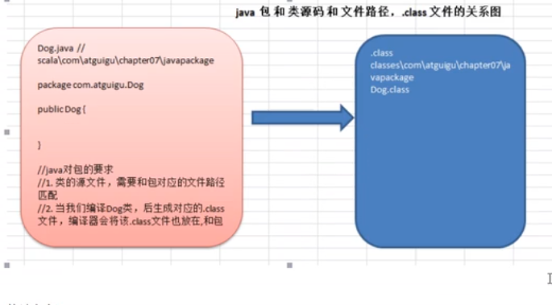
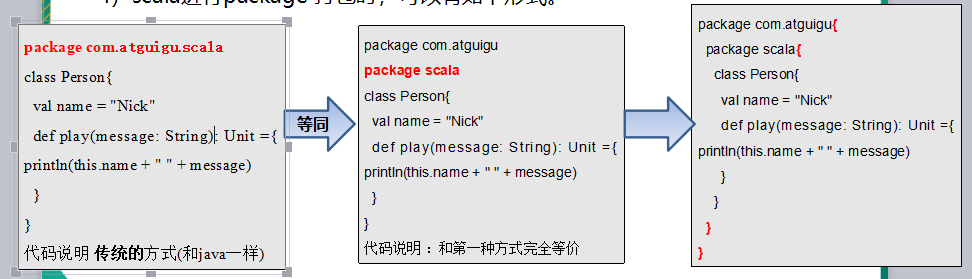
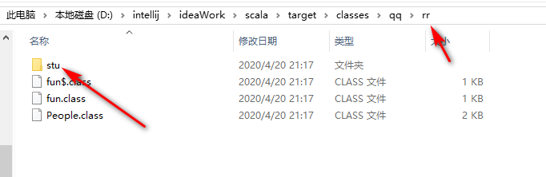
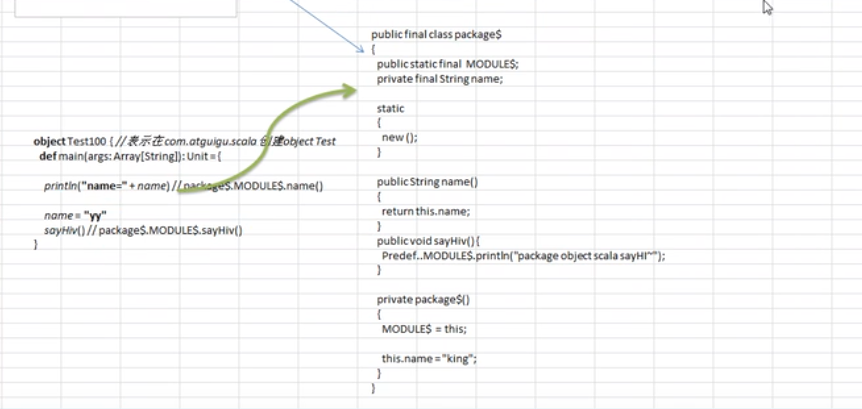
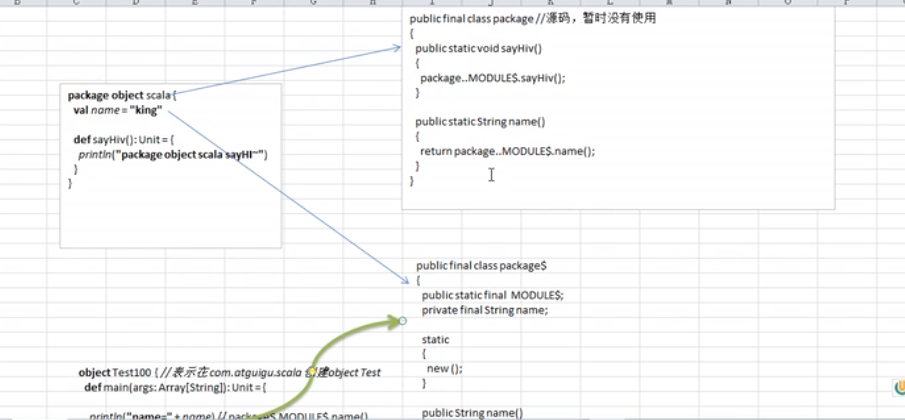
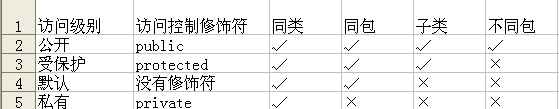

# `Scala`中级部分

## 第三章，包

### 3.1，`Java`包

1. 包的作用

   - 区分相同名字的类
   - 当类很多时,可以很好的管理类
   - 控制访问范围

2. 打包命令

   ~~~ java
   package com.atguigu;
   ~~~

3. 打包的本质分析

   - 实际上就是创建不同的文件夹来保存类文件

     

4. Java如何引入包

   ~~~java
   import  包;
   比如 import java.awt.*;
   我们引入一个包的主要目的是要使用该包下的类
   比如 import java.util.Scanner;  就只是引入一个类Scanner。
   ~~~

   - java中包名和源码所在的系统文件目录结构要一致，并且编译后的字节码文件路径也和包名保持一致。

### 3.2，`Scala`包

- **和Java一样，Scala中管理项目可以使用包，但Scala中的包的功能更加强大，使用也相对复杂些，下面我们学习Scala包的使用和注意事项。**

#### 3.2.1，快速入门

- 在两个包下面创建两个`Tiger`类，分别在主函数中使用类

~~~ java
object Test {
  def main(args: Array[String]): Unit = {
    var tiger1=new qq.com.rzf.xh.Tiger
    var tiger2=new qq.com.rzf.xm.Tiger
    println(tiger1)
    println(tiger2)
  }
}
//输出
qq.com.rzf.xh.Tiger@ea4a92b
qq.com.rzf.xm.Tiger@3c5a99da
~~~

#### 3.2.2，Scala包的特点概述

~~~ java
基本语法package 包名
~~~

1. `scala`包的作用

   1. Scala包的三大作用(和Java一样)， 区分相同名字的类。
   2.  当类很多时,可以很好的管理类
   3. 控制访问范围

2. Scala中包名和源码所在的系统文件目录结构要可以不一致，但是编译后的字节码文件路径和包名会保持一致(这个工作由编译器完成)。即`scala`源文件的路径和包名的路径无关。

3. Scala包的命名

   1. 命名规则：

      ~~~ JAVA
      //只能包含数字、字母、下划线、小圆点.,但不能用数字开头, 也不要使用关键字。
      demo.class.exec1  //错误 , 因为class是关键字
      demo.12a    // 错误，因为不能以数字开头
      ~~~

   2. 命名规范：

      一般是小写字母+小圆点
      机构类型名.机构或公司名.项目名.业务模块名

4. Scala会自动引入的常用包

   ~~~ java
   java.lang.*  
   scala包
   Predef包
   //查看包内容
    import scala.io//光标定位io，按ctrl+b
   ~~~

5. scala进行package 打包时，可以有如下形式。

   

   ~~~ java
   //第三种形式演示
   //包名com.rr，{}标示包里面的内容
   package com.rr{
     //在com.rr包路径下还有一个包：com.rr.scala
     package scala{
       //在com.rr.scala包下有一个类：Person
       //也就是说，在scala中可以在一个包中在创建一个包，类或者object对象
       class Person{
         val name = "Nick"
         def play(message: String): Unit ={
           println(this.name + " " + message)
         }
       }
     }
   
    object mypac{
      def main(args: Array[String]): Unit = {
        println("**************")
      }
    }
   }
   ~~~

6. 包也可以像嵌套类那样嵌套使用（包中有包）, 这个在前面的第三种打包方式已经讲过了，在使用第三种方式时的好处是：程序员可以在同一个文件中，将类(class / object)、trait 创建在不同的包中，这样就非常灵活了

   ~~~ java
   
   package qq.rr{
     package stu{
       class People{
         var name:String= _
         var age:Int= _
       }
     }
     class People{
       var name:String= _
       var age:Int= _
     }
     object fun{
       def main(args: Array[String]): Unit = {
       println("**********")
       }
     }
   }
   ~~~

   

   - 从图中我们可以看到`qq.rr`包下面还有一个包`qq.rr.stu`包，两个包中相同的类名`people`并不重复，应为他们所属的包不同。

7. 作用域原则：可以直接向上访问。即: Scala中子包中直接访问父包中的内容, 大括号体现作用域。(提示：Java中子包使用父包的类，需要import)。在子包和父包 类重名时，默认采用就近原则，如果希望指定使用某个类，则带上包名即可。

   ~~~ java
   package com.atguigu{
     //这个类就是在com.atguigu包下
     class User{
     }
     //这个类对象就是在Monster$ , 也在com.atguigu包下
     object Monster {
     }
     class Dog {
     }
     package scala {
       //这个类就是在com.atguigu.scala包下
       class User{
       }
       //这个Test 类对象
       object Test {
         def main(args: Array[String]): Unit = {
             //子包可以直接访问父包的内容
             var dog = new Dog()
             println("dog=" + dog)
             //在子包和父包 类重名时，默认采用就近原则.
             var u = new User()
             println("u=" + u)
             //在子包和父包 类重名时，如果希望指定使用某个类，则带上包路径
             var u2 = new com.atguigu.User()
             println("u2=" + u2)
         }
       }
   ~~~

8. 父包要访问子包的内容时，需要import对应的类等.

   ~~~ java
   package com.atguigu{
     //引入在com.atguigu 包中希望使用到子包的类Tiger,因此需要引入.
     import com.atguigu.scala.Tiger
     //这个类就是在com.atguigu包下
     class User{
     }
     package scala {
       //Tiger 在 com.atguigu.scala 包中
       class Tiger {}
     }
     object Test2 {
       def main(args: Array[String]): Unit = {
           //如果要在父包使用到子包的类，需要import
           val tiger = new Tiger()
           println("tiger=" + tiger)
       }}}
   ~~~

9. 可以在同一个`.scala`文件中，声明多个并列的package(建议嵌套的`pakage`不要超过3层) 。

10. 包名可以相对路径也可以绝对路径，比如，访问BeanProperty的绝对路径是：_root_.scala.beans.BeanProperty ，在一般情况下：我们使用相对路径来引入包，只有当包名冲突时，使用绝对路径来处理。

    ~~~ java
    package com.atguigu.scala2
    class Manager( var name : String ) {
      //第一种形式,相对路径
      //@BeanProperty var age: Int = _
      //第二种形式, 和第一种一样，都是相对路径引入
      //@scala.beans.BeanProperty var age: Int = _
      //第三种形式, 是绝对路径引入，可以解决包名冲突
      @_root_. scala.beans.BeanProperty var age: Int = _
    }
    object TestBean {
      def main(args: Array[String]): Unit = {
        val m = new Manager("jack")
        println("m=" + m)
      }
     }
    ~~~

11. 包对象

    基本介绍：包可以包含类、对象和特质trait，但不能包含函数/方法或变量的定义。这是Java虚拟机的局限。为了弥补这一点不足，scala提供了包对象的概念来解决这个问题。

    ~~~ java
    package qq.rr{
      //在包中不可以直接声明方法和对象，为了解决这个问题，需要引入包对象
      //package object scala标示一个scala包对象，它是包qq.rr下面的一个包对象
      //每一个包都可以有一个包对象，包对象的名字和子包的名字一样
      //在包对象中可以定义变量和方法
      //在包中定义的变量和方法可以在对应的包中使用
      package object stu{
        //定义变量
        var name:String="aaaa"
        def print():Unit={
          printf("在包对象中定义的方法")
        }
      }
      package stu{
        class People{
          var name:String= _
          var age:Int= _
        }
        //应为fun在stu对应的包下面，所以可以使用包对象中的变量和方法
        object fun{
          def main(args: Array[String]): Unit = {
            println("**********")
            println("name="+name)
            println(print())
          }
        }
      }
      class People{
        var name:String= _
        var age:Int= _
      }
    
    }
    ~~~

    - 包对象的底层实现机制分析(重点)

      - 当创建包对象后，在该包下生成 public final class package 和 public final class package$

      - 通过 package$ 的一个静态实例完成对包对象中的属性和方法的调用。

        

        

        - 一个包对象在底层会生成两个类，`public final class package`和`public final class package$`,但是调用包对象的变量和方法用的是`public final class package$`类。

    - 定义的包对象一定在父包的下面，包对象和子包是平行关系。

    - 每个包都可以有一个包对象。你需要在父包中定义它。

    - 包对象名称需要和子包名一致，一般用来对包的功能补充

12. 包的可见性

    1. Java访问修饰符基本介绍

       - java提供四种访问控制修饰符号控制方法和变量的访问权限（范围）:

       - 公开级别:用public 修饰,对外公开

       - 受保护级别:用protected修饰,对子类和同一个包中的类公开

       - 默认级别:没有修饰符号,向同一个包的类公开.

       - 私有级别:用private修饰,只有类本身可以访问,不对外公开.

         

         注意：在子类中可以访问受保护的属性和方法，并不要求子类和本类在同一个包中。

         ​	修饰符可以用来修饰类中的属性，成员方法以及类
         ​	只有默认的和public才能修饰类！，并且遵循上述访问权限的特点。

    2. Scala中包的可见性介绍:

       - 在Java中，访问权限分为: public，private，protected和默认。在Scala中，你可以通过类似的修饰符达到同样的效果。但是使用上有区别。

