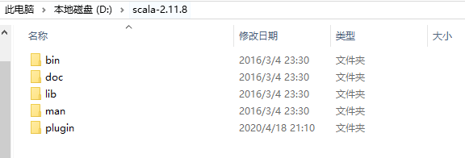
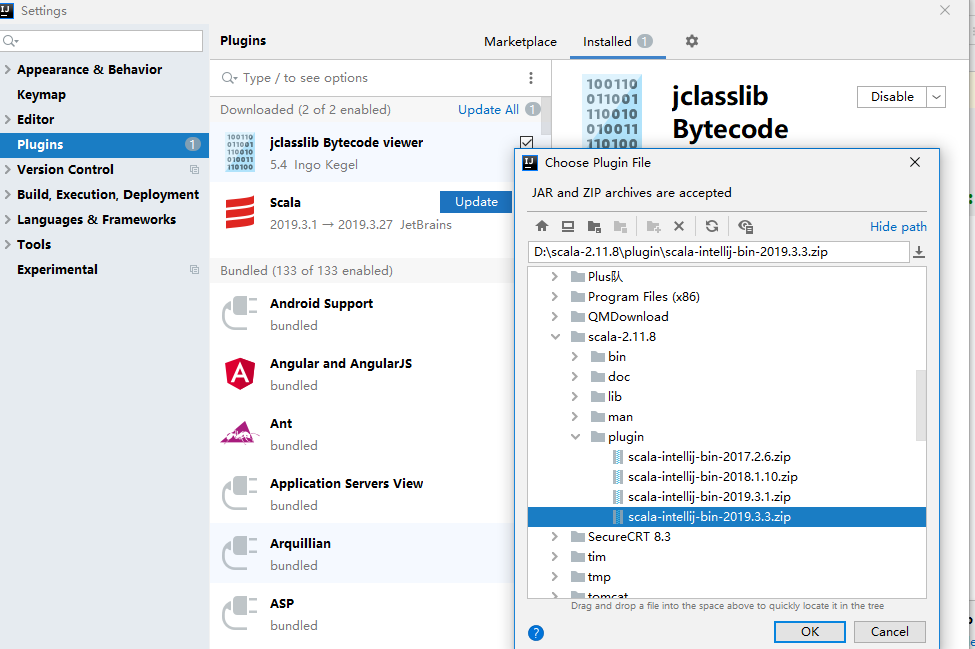
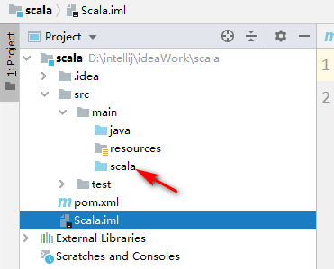
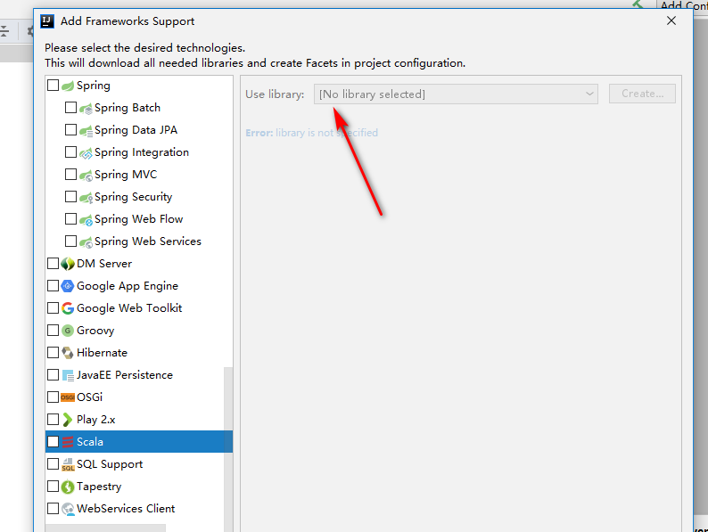

# Scala环境搭建

## `WINDOWS`上面搭建`Scala`环境

#### 1，下载对应的`scala`安装包

在这里使用的是`2.11.8`版本，根据需要可以自行下载。

#### 2，解压安装包到其他的目录

我把`scala`解压到`d`盘下，注意解压的路径上尽量不要有中文。然后可以在解压包下面新建一个目录，马上用于安装`idea`的插件。比如`plugin`目录。

#### 3，配置环境变量

配置好环境变量以后，就可以在控制台输入`scala`命令检查我们的`scala`是否安装好没有，出现以下信息标示我们的`scala`已经安装完毕。

#### 4，运行第一个`scala`程序

1. 新建一个文本文件，修改后缀名为`scala`，在文件中添加如下代码：

~~~ java
object HelloScala{
	def main(args:Array[String]):Unit={
	println("helloscale");
	}
}
~~~

2. 输入`scalac HelloScala.scala`命令进行编译操作,从这里看到，和`java`还是有点区别的，编译后生成了两个`.class`文件。

3. 最后我们输入`scalac HelloScala.scala`命名可以查看程序运行结果。

至此为止，我们的`scala`环境已经安装完毕，并且成功运行第一个`scala`程序，下面我们在`idea`集成环境中来安装插件运行我们的`scala`程序。

#### 5，查看自己的`idea`版本，然后去`scala`官网下载对应的插件。

~~~ java
//我的idea版本信息，去scala官网下载对应的版本，否则安装不上，我下载的是2019.3.3版本的插件
IntelliJ IDEA 2019.3.2 (Ultimate Edition)
Build #IU-193.6015.39, built on January 21, 2020
Licensed to https://zhile.io
Subscription is active until July 8, 2089
Runtime version: 11.0.5+10-b520.30 amd64
VM: OpenJDK 64-Bit Server VM by JetBrains s.r.o
Windows 10 10.0
GC: ParNew, ConcurrentMarkSweep
Memory: 976M
Cores: 4
Registry: 
Non-Bundled Plugins: jclasslib, org.intellij.scala
~~~

下载地址：`https://plugins.jetbrains.com/plugin/1347-scala/versions`

#### 6，把下载完的插件放到刚才`scala`安装目录下新建的文件夹中，也可以自己选择文件夹。

#### 7，打开`idea`编辑器，在`setting`里面找到`plugins`插件安装。

- 安装的时候一定要选择本地安装，然后找到自己下载插件的存放位置，最后点击确认安装，重启`idea`即可安装成功。

#### 8，第一个`helloword`程序

- 在`idea`集成环境中新建`maven`工程项目，然后在`main`目录下新建一个目录，作为`scala`工程的主工作目录即可，最后新建类输入以下代码即可完成第一个`scala`程序。

- 但是注意，第一次我们新建`scala`类的时候发现没有这一项，是应为我们没有添加`scala`框架到项目中，所以我们要添加`scala`框架，现在项目上面右击选择`add framwork support`选项，并且可以看到没有选择库。点击`creat`找到`scala`的安装目录即可。

- 最后在`idea`库的选项中可以看到`scala`的库已经添加进来了。

- 然后在新建类的时候发现出现了`scala class`项，此时就可以新建`scala`类。
- 注意，在这里我们要选择`Object`而不是`class`。

- 输入代码，完成第一个`scala`项目。

~~~java
class HelloWord {
  def main(args: Array[String]): Unit = {
    println("helloword");
  }
}
~~~

