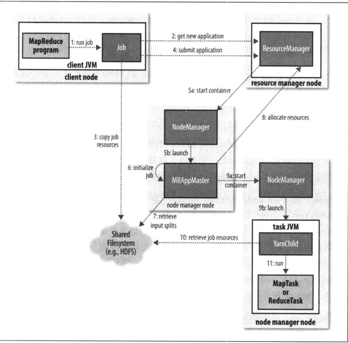
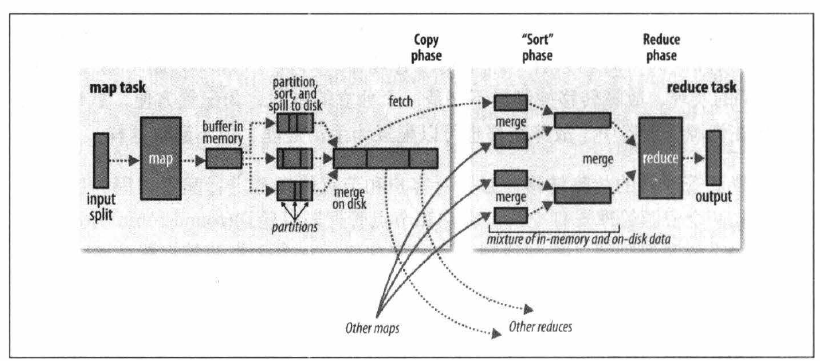
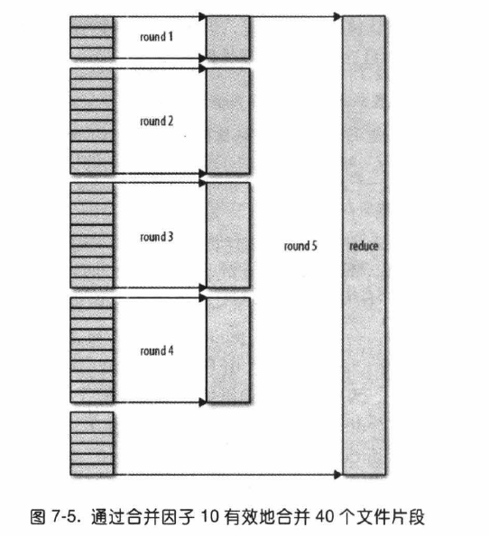
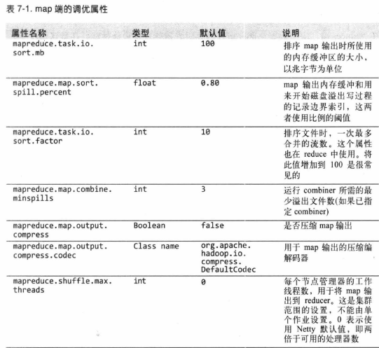
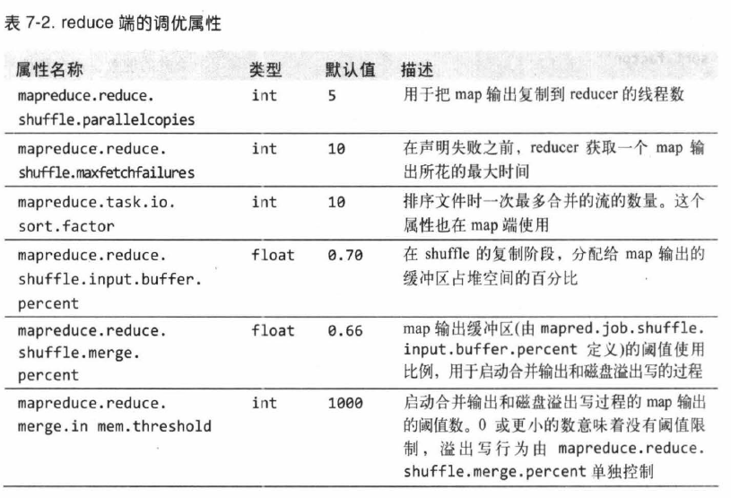
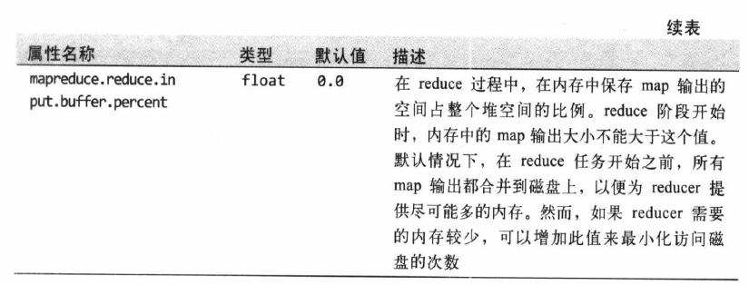

# mapreducer运行机制解密

## 一，五个独立的实体

1. 客户端，提交客户的`mapreducer`作业
2. yarn资源管理器（`resource manager`）,负责协调计算机集群上计算机资源的管理。
3. yarn节点管理器（`nodemanager`），负责启动和监事集群中机器上的计算机容器（`container`）.
4. `MapReducer`的`application master`,负责协调`mapreducer`作业任务，`application master`和`MapReducer`任务都在容器中运行，这些容器由资源管理器（`resourceManager`）分配，并且由节点管理器(`nodemanager`)进行管理。

### 二，作业提交

submit所实现作业提交过程：

1. 向`resourceManager`请求一个新应用的ID，用于`mapreducer`作业的ID，步骤2是实现请求的过程。
2. 检查作业的输出说明，如果没有指定作业的输出目录或者输出目录已经存在，作业就不进行提交，抛出错误给`mapreducer`程序。
3. 计算作业的输入分片，如果无法分片，例如输入路径不存在，那么就向`mapreducer`程序报告错误，不提交作业。
4. 将运行作业所需要的资源（例如jar包文件，配置文件和作业的分片信息）复制到一个以作业ID命名的共享目录中（例如复制到hdfs文件系统上面，参见步骤3），作业`jar`的副本较多，默认为10，因此在运行作业任务时候，集群中有很多副本可以供`nodemanager`来选择访问。
5. 通过调用资源管理器的`submitapplication()`方法来提交作业。

### 三，作业的初始化

1. `resourcemanager`收到调用他的`submitapplication()`方法后，便将这一个请求传递给`YARN`调度器，`yarn`调度器分配一个容器，然后`resourcemanager`在`nodemanager`的管理下在容器中启动`application master`进程，在图中的步骤就是`5a`和`5b`。
2. `mapreducer`作业的`application master`是一个`java`程序，它的主类是`MrAppMaster`，由于将接受来自任务的进度和完成报告(步骤6) ，因此`application master` 对作业的初始化是通过创建多个簿记对象以保持对业进度的跟踪来完成的。接下来，它接受来自共享文件系统的、在客户端计算的输入分片( 步骤7) 。然后对每一个分片创建一个`map `任务对象以及由`mapeduce.job.reduces `属性(通过作业`setNumReduceTasks()` 方法设置)确定的多个`reduce `任务对象。任务D 在此时分配。
3. `application master` 必须决定如何运行构成`MapReduce `作业的各个任务。如果作业很小，就选择和自己在同一个`JVM`上运行任务。与在一个节点上顺序运行这些任务相比，当`application master` 判断在新的容器中分配和运行任务的开销大于并行运行它们的开销时，就会发生这一情况。这样的作业称为`uberized `， 或者作为`uber` 任务运行.
4. 哪些作业是小作业?默认情况下，小作业就是少于10 个`mapper` 且只有1 个`reducer` 且输入大小小于一个`HDFS `块的作业(通过设置`mapreduce.job.ubertask.maxmaps 、map陀duce. job • uber、task.maxr创uces 和mapreduce.job.ubertask.maxbytes` 可以改变这几个值)。必须明确启用`Uber `任务(对于单个作业，或者是整个集群)，具体方怯是将`mapreduce.job.ubertask.enable `设置为`true`。最后，在任何任务运行之前`application master `调用`setupJob() `方法设置`outputcommitter`.`fileoutputcommitter`为默认值，表示将建立作业的最终输出目录及任务输出的临时工作空间。

### 四，任务的分配

1. 如果作业不适合作为`uber` 任务运行，那么`application master` 就会为该作业中的所有`map `任务和`reduce `任务向资源管理器请求容器(步骤8)。首先为`Map `任务发出请求，该请求优先级要高于`reduce` 任务的请求，这是因为所有的`map `任务必须在`reduce `的排序阶段能够启动前完成。直到有5 %的`map` 任务已经完成时，**为`reduce` 任务的请求才会发出。**
2. `reduce` 任务能够在集群中任意位置运行，但是`map` 任务的请求有着数据本地化局限，这也是调度器所关注的。在理想的情况下，任务是数据本地化`(data local)`的，意味着任务在分片驻留的同一节点上运行。可选的情况是，任务可能是机架本地化`(rack local)` 的， 即和分片在同一机架而非同一节点上运行。有一些任务既不是数据本地化， 也不是机架本地化，它们会从别的机架，而不是运行所在的机架上获取自己的数据。对于一个特定的作业运行，可以通过查看作业的计数器来确定在每个本地化层次上运行的任务的数量。
3. 请求也为任务指定了内存需求和`CPU `数。在默认情况下，每个`map` 任务和`reduce`任务都分配到1024 MB 的内存和一个虚拟的内核，这些值可以在每个作业的基础上进行配置(遵从于10.3.3 节描述的最大值和最小值) ，分别通过4 个属性来设置`mapreduce.map.memory.mb` 、`mapreduce.reduce.memory.mb` 、`mapreduce.map.cpu.vcoes` 和`mapreduce.reduce.cpu.vcoesp.memoy.mb`。

### 五，任务的执行（即新增加一个容器执行）

一旦资源管理器的调度器为任务分配了一个特定节点上的容器，`app1ication master`就通过与节点管理器通信启动容器(步骤`9a` 和`9b`) 。该任务由主类为`YarnChild`的一个`Java `应用程序执行。在它运行任务之前，首先将任务需要的资源本地化，包括作业的配置、`JAR` 文件和所有来自分布式缓存的文件(步骤10 ，参见9 .4.2节)。最后，运行`map `任务或`reduce `任务(步骤11) 。`YarnChild` 在指定的`JVM` 中运行，因此用户定义的`map` 或`reduce` 函数(甚至是`YarnChild`) 中的任何缺陷不会影响到`namenode`，例如导致其崩溃或挂起。每个任务都能够执行搭建(setup)和提交`(commit)`动作，它们和任务本身在同一个`JVM `中运行，并由作业的`OutputCommitter `确定(参见7.1.4 节) 。对于基于文件的作业，提交动作将任务输出由临时位置搬移到最终位置。提交协议确保当推测执行(speculative execution)被启用时(参见7.4.2 节)，只有一个任务副本被提交，其他的都被取消。

### 六，作业的完成

当`application master` 收到作业最后一个任务已完成的通知后，便把作业的状态设置为" 成功" 。然后，在Job 轮询状态时，便知道任务已成功完成，于是`Job `打印一条消息告知用户，然后从`waitForCompletion() `方法返回Job 的统计信息和计数值也在这个时候输出到控制台。如果`application master `有相应的设置，也会发送一个`HTTP `作业通知。希望收到回调指令的客户端可以通过`mapreduce.job.end-notification.ur`属性来进行这项设置。最后，作业完成时， `application master` 和任务容器清理其工作状态(这样中间输出将被删除)， `OutputCommitter `的`commitJob()` 方法会被调用。作业信息由作业历史服务器存档，以便日后用户需要时可以查询。

### 七，失败

在现实情况中，用户代码错误不断，进程崩溃，机器故障，如此种种。使用`Hadoop` 最主要的好处之一是它能处理此类故障并让你能够成功完成作业。我们需要考虑以下实体的失败:任务、`application master`、节点管理器和资源管理器。

#### 7.1，任务失败

​	首先考虑任务失败的情况。最常见的情况是`map` 任务或`reduce `任务中的用户代码抛出运行异常。如果发生这种情况，任务`JVM `会在退出之前向其父`application master `发送错误报告。错误报告最后被记入用户日志。`application master `将此次任务任务尝试标记为`failed(失败)` ，并释放容器以便资源可以为其他任务使用。对于`Streaming 任务，如果`Streaming` `进程以非零退出代码退出，则被标记为失败。这种行为由`stream.non.zero.exit.is.failure `属性(默认值为`true`)来控制。

​	另一种失败模式是任务`JVM `突然退出，可能由于`JVM` 软件缺陷而导致`MapReduce`用户代码由于某些特殊原因造成`JVM `退出。在这种情况下，节点管理器会注意到进程已经退出，并通知`application master `将此次任务尝试标记为失败。任务挂起的处理方式则有不同。一旦`application master` 注意到已经有一段时间没有收到进度的更新， 便会将任务标记为失败。在此之后，任务`JVM `进程将被自动杀死。①任务被认为失败的超时间隔通常为1 0 分钟，可以以作业为基础(或以集群为基础)进行设置，==对应的属性为`mapreduce.task.timeout` ，单位为毫秒。==

==此处算一个小优化==

​	超时`(timeout)`设置为0 将关闭超时判定，所以长时间运行的任务永远不会被标记为失败。在这种情况下，被挂起的任务永远不会释放它的容器并随着时间的推移最终降低整个集群的效率。因此， 尽量避免这种设置，同时充分确保每个任务能够定期汇报其进度。参见7. 1.5 节的补充材料`"MapReduce `中进度的组成" 。

​	`application master` 被告知一个任务尝试失败后，将重新调度该任务的执行。`application master` 会试图避免在以前失败过的节点管理器上重新调度该任务。此外，如果一个任务失败过4 次，将不会再重试。这个值是可以设置的: 对于`map` 任务，运行任务的最多尝试次数由`mapreduce.map.maxattempts `属性控制; 而对于`reduce` 任务， 则由`mapreducereduce.maxattempts` 属性控制。在默认情况下， 如果任何任务失败次数大于4(或最多尝试次数被配置为的，整个作业都会失败。

​	对于一些应用程序， 我们不希望一旦有少数几个任务失败就中止运行整个作业，因为即使有任务失败，作业的一些结果可能还是可用的。在这种情况下，可以为作业设置在不触发作业失败的情况下允许任务失败的最大百分比。针对`map` 任务和`reduce `任务的设置可以通过`mapreduce. map.failures.maxpecent `和`mapreduce. reduce.failues . maxpecent` 这两个属性来完成。

​	任务尝试`(task attempt)`也是可以中止的`(killed)` ，这与失败不同。任务尝试可以被中止是因为它是一个推测副本或因为它所处的节点管理器失败， 导致`application master`` 将它上面运行的所有任务尝试标记为killed` ,被中止的任务尝试不会被计入任务运行尝试次数`(mapreduce.map.maxattempts` 和`mapreduce. educe.maxattempts` 设置) ，因为尝试被中止并不是任务的过错。

#### 7.2，application master 运行失败

​	`YARN`中的应用程序在运行失败的时候有几次尝试机会，就像`MapReduce` 任务在遇到硬件或网络故障时要进行几次尝试一样。运行`MapReduce application master`的最多尝试次数由`mapreduce.am.max-attempts` 属性控制。默认值是2 ，即如果`MapReduce application master `失败两次，便不会再进行尝试，作业将失败。

​	YARN 对集群上运行的`YARN application master` 的最大尝试次数加以了限制，单个的应用程序不可以超过这个限制。该限制由`yarn.esoucemanager. am.maxattempts`属性设置，默认值是2 ，这样如果你想增加`MapReduce applicationmaster` 的尝试次数，你也必须增加集群上`YARN` 的设置。

​	恢复的过程如下。`application master` 向资源管理器发送周期性的心跳，当`application master` 失败时，资源管理器将检测到该失败并在一个新的容器(由节点管理器管理)中开始一个新的`maste`r 实例。对于`Mapreduce application master` ，它将使用作业历史来恢复失败的应用程序所运行任务的状态，使其不必重新运行。默认情况下恢复功能是开启的，但可以通过设置`yarn.app.mapreduce.am.job.recovey.enable `为`false `来关闭这个功能。

​	`Mapreduce `客户端向`application master` 轮询进度报告，但是如果它的`applicationmaster` 运行失败，客户端就需要定位新的实例。在作业初始化期间，客户端向资源管理器询问并缓存`application master `的地址，使其每次需要向`application master`查询时不必重载资源管理器。但是，如果`application master `运行失败，客户端就会在发出状态更新请求时经历超时，这时客户端会折回向资源管理器请求新的`application master` 的地址。这个过程对用户是透明的。

#### 7.3，节点管理器运行失败

​	如果节点管理器由于崩溃或运行非常缓慢而失败，就会停止向资源管理器发送心跳信息(或发送频率很低) 。如果10 分钟内(可以通过属性`yarn.resourcemanager.nm.liveness-monitor.expiryinterval-ms `设置，以毫秒为单位)没有收到一条心跳信息，资源管理器将会通知停止发送心跳信息的节点管理器，并且将其从自己的节点池中移除以调度启用容器。

在失败的节点管理器上运行的所有任务或`application master` 都用前两节描述的机制进行恢复。另外，对于那些曾经在失败的节点管理器上运行且成功完成的`map`任务，如果属于未完成的作业，那么`application master` 会安排它们重新运行。这是由于这些任务的中间输出驻留在失败的节点管理器的本地文件系统中， 可能无法被`reduce `任务访问的缘故。

如果应用程序的运行失败次数过高，那么节点管理器可能会被拉黑， 即使节点管理自己并没有失败过。由`application master `管理黑名单，对于`MapReduce` ，如果一个节点管理器上有超过三个任务失败， `application master `就会尽量将任务调度到不同的节点上。用户可以通过作业属性`mapreduce.job.maxtaskfailures.per.tracke `设置该阀值。

#### 7.4，资源管理器运行失败

资源管理器失败是非常严重的问题，没有资源管理器，作业和任务容器将无怯启动。在默认的配置中，资源管理器是个单点故障，这是由于在机器失败的情况下(尽管不太可能发生)，所有运行的作业都失败且不能被恢复。

为获得高可用性(HA) ，在双机热备配置下，**运行一对资源管理器是必要的**。如果主资源管理器失败了，那么备份资源管理器能够接替，且客户端不会感到明显的中断。

关于所有运行中的应用程序的信息存储在一个高可用的状态存储区中(由`ZooKeeper `或`HDFS `备份) ，这样备机可以恢复出失败的主资源管理器的关键状态。节点管理器信息没有存储在状态存储区中，因为当节点管理器发送它们的第一个心跳信息时，节点管理器的信息能以相当快的速度被新的资源管理器重构。(同样要注意，由于任务是由`application master` 管理的，因此任务不是资源管理器的状态的一部分。这样，要存储的状态量比`MapReduce 1 `中`jobtracker `要存储的状态量更好管理。)

当新资源管理器启动后，它从状态存储区中读取应用程序的信息，然后为集群中运行的所有应用程序重启`application master` 。这个行为不被计为失败的应用程序尝试(所以不会计入`yarn. resourcemanager.am.max-attempts ) `，这是因为应用程序并不是因为程序代码错误而失败，而是被系统强行中止的。实际情况中，
`application master `重启不是`MapReduce `应用程序的问题，因为它们是恢复已完成
的任务的工作(详见7 .2.2 节) 。
资源管理器从备机到主机的切换是由故障转移控制器`(failover controller)`处理的。默认的故障转移控制器是自动工作的，使用`ZooKeeper` 的`leader` 选举机制`(leaderelection) `以确保同一时刻只有一个主资源管理器。不同于`HDFS` 高可用性(详见3.2.5 节)的实现， 故障转移控制器不必是一个独立的进程，为配置方便，默认情况下嵌入在资源管理器中。故障转移也可以配置为手动处理，但不建议这样。
为应对资源管理器的故障转移，必须对客户和节点管理器进行配置，因为他们可能是在和两个资源管理器打交道。客户和节点管理器以轮询(round-robin)方式试图连接每一个资源管理器，直到找到主资源管理器。如果主资源管理器故障， 他们将再次尝试直到备份资源管理器变成主机。

### 7.5，shuffle和排序

- `shuftle` 是`MapReduce `的"心脏"是奇迹发生的地方。

#### 7.51，map端

​	`map` 函数开始产生输出时，并不是简单地将它写到磁盘。这个过程更复杂，它利用缓冲的方式写到内存并出于效率的考虑进行预排序。

​	每个`map` 任务都有一个环形内存缓冲区用于存储任务输出。在默认情况下，缓冲区的大小为`100m`，这个值可以通过`mapreduce.task.io.sort.mb `属性来调整。一旦缓冲内容达到阀值(`mapreduce.map.sort.spill.percent `，默认为0.80 ，或80%) ， 一个后台线程便开始把内容隘出`(spill)`到磁盘。在溢出写到磁盘过程中，` map `输出继续写到缓冲区，但如果在此期间缓冲区被填满，` map `会被阻塞直到写磁盘过程完成。溢出写过程按轮询方式将缓冲区中的内容写到`mapreduce.clu5ter.local.dir`属性在作业特定子目录下指定的目录中。

​	在写磁盘之前，线程首先根据数据最终要传的`reducer` 把数据划分成相应的分区`(partition) `。在每个分区中，后台线程按键进行内存中==排序==，如果有一个`combiner`函数，==它就在排序后的输出上运行==。运行`combiner` 函数使得`map `输出结果更紧凑，因此减少写到磁盘的数据和传递给`reducer `的数据。

​	每次内存缓冲区达到溢出阀值， 就会新建一个溢出文件`(spill file) `，因此在`map `任务写完其最后一个输出记录之后，会有几个溢出文件。在任务完成之前，涵出文件被合并成一个己分区且已排序的输出文件。配置属性`mapreduce.ta5k.io.sort.factor` 控制着一次最多能合并多少流，默认值是10 。

​	如果至少存在3 个溢出文件(通过`mapreduce.map.combine.minspil1s` 属性设置)时，则`combiner `就会在输出文件写到磁盘之前再次运行。前面曾讲过，`combiner` 可以在输入上反复运行，但并不影响最终结果。如果只有1 或2 个溢出文件，那么由于`map `输出规模减少，因而不值得调用`combiner `带来的开销， 因此不会为该`map `输出再次运行`combiner` 。

​	在将压缩`map `输出写到磁盘的过程中对它进行压缩往往是个很好的主意，因为这样会写磁盘的速度更快，节约磁盘空间，并且减少传给`reducer `的数据量。在默认情况下，输出是不压缩的，但只要将`mapreduce.map.output. compess` 设置为`true` ，就可以轻松启用此功能。使用的压缩库由`mapreduce.map.output.compess.codec` 指定，要想进一步了解压缩格式.

​	`reducer` 通过`HTTP `得到输出文件的分区。用于文件分区的工作线程的数量由任务的`mapreduce.shuffle.max.threads `属性控制，此设置针对的是每一个节点管理器，而不是针对每个`map` 任务。默认值0 将最大线程数设置为机器中处理器数量的两倍。

#### 7.52，reduce 端

​	现在转到处理过程的`reduce `部分。`map `输出文件位于运行`map` 任务的`tasktracker`的本地磁盘(注意，尽管`map` 输出经常写到`map tasktracker `的本地磁盘， 但`reduce`输出并不这样) ，现在,`tasktracker `需要为分区文件运行`reduce `任务。并且,`reduce` 任务需要集群上若干个`map` 任务的`map `输出作为其特殊的分区文件。每个`map `任务的完成时间可能不同，因此在每个任务完成时，` reduce` 任务就开始复制其输出。这就是`reduce` 任务的复制阶段。`reduce `任务有少量复制线程， 因此能够并行取得`map` 输出。默认值是5 个线程，但这个默认值可以修改设置`mapreduce.reduce. shuffle. parallelcopies `属性即可。

​	`reducer` 如何知道要从哪台机器取得map 输出呢?
​	`map` 任务成功完成后，它们会使用心跳机制通知它们的`application master` 。因此，对于指定作业， `application master `知道`map `输出和主机位置之间的映射关系。`reducer` 中的一个线程定期询问`master` 以便获取`map `输出主机的位置， 直到获得所有输出位置。由于第一个`reducer `可能失败，因此主机并没有在第一个`reducer `检索到`map `输出时就立即从磁盘上删除它们。相反，主机会等待，直到`application master` 告知它删除`map` 输出，这是作业完成后执行的。

​	如果`map` 输出相当小，会被复制到`reduce` 任务`JVM` 的内存(缓冲区大小由`mapred uce.reduce.shule.input.buffer.pecent `属性控制，指定用于此用途的堆空间的百分比) ，否则，`map `输出被复制到磁盘。一旦内存缓冲区达到阀值大小`(由mapreduce.reduce.shuffle.merge.pe cent 决定)`或达到`map` 输出阎值(由`mapreduce.reduce.merge.inmem.threshold `控制) ，则合并后溢出写到磁盘中。如果指定`combiner`，则在合并期间运行它以降低写入硬盘的数据量。

​	随着磁盘上副本增多，后台线程会将它们合并为更大的、排好序的文件。这会为后面的合并节省一些时间。注意，为了合并，压缩的`map` 输出(通过`map `任务)都必须在内存中被解压缩。

​	复制完所有`map` 输出后，` reduce `任务进入排序阶段(更恰当的说怯是==合并阶段==，因为排序是在`map` 端进行的)，这个阶段将合并`map` 输出，维持其顺序排序。这是循环进行的。比如，如果有50 个map 输出，而合并因子是10(10 为默认设置，由`mapreduce.task.io.sort. factor`属性设置， 与`map `的合并类似），合并将进行5 趟。每趟将10 个文件合并成一个文件，因此最后有5 个中间文件。

​	在最后阶段，即`reduce `阶段，直接把数据输入`reduce `函数，从而省略了一次磁盘往返行程，并没有将这5 个文件合并成一个已排序的文件作为最后一趟。最后的合并可以来自内存和磁盘片段。

​	每趟合并的文件数实际上比示例中展示有所不同。目标是合并最小数量的文件以便满足最后一趟的合并系数。因此如果有40 个文件，我们不会在四趟中每趟合并10 个文件从而得到4 个文件。相反，第一趟只合并4 个文件，随后的三趟合并完整的10 个文件。在最后一趟中， 4 个已合井的文件和余下的6 个(未合并的)文件合计10 个文件。该过程如图7-5 所述。

注意，这并没有改变合并次数，它只是一个优化措施，目的是尽量减少写到磁盘的数据量，因为最后一趟总是直接合并到`reduce`.

​	在`reduce `阶段，对已排序输出中的每个键调用`reduce `函数。此阶段的输出直接写到输出文件系统， 一般为`HDFS` 。如果采用`HDFS` ，由于节点管理器也运行数据节点， 所以第一个块复本将被写到本地磁盘。

### 7.6，配置调优

​	现在我们已经有比较好的基础来理解如何调优`shuffle` 过程来提高`MapReduce `性能。表7-1 和表7 -2 总结了相关设置和默认值，这些设置以作业为单位(除非有特别说明)，默认值适用于常规作业。

​	总的原则是给`shuffle` **过程尽量多提供内存空间**。然而，有一个平衡问题，也就是要确保`map` 函数和`reduce` 函数能得到足够的内存来运行。这就是为什么写`map` 函数和`reduce` 函数时尽量少用内存的原因，它们不应该无限使用内存(例如， 应避免在`map` 中堆积数据)。

​	运行`map `任务和`reduce `任务的`JVM` ，其内存大小由`mapred.child. java.opts`属性设置。任务节点上的内存应该尽可能设置的大些，

​	在`map` 端，可以通过避免多次溢出写磁盘来获得最佳性能: 一次是最佳的情况。如果能估算`map `输出大小，就可以合理地设置`mapreduce.task. io.sort. * `属性来尽可能减少溢出写的次数。具体而言，如果可以，就要增加`mapreduce.task.io.sort.mb `的值。`MapReduce` 计数器计算在作业运行整个阶段中溢出写磁盘的记录数，这对于调优很有帮助。注意，这个计数器包括`map `和`reduce` 两端的溢出写。

​	在`reduce` 端，中间数据全部驻留在内存时，就能获得最佳性能。在默认情况下，这是不可能发生的，因为所有内存一般都预留给`reduce` 函数。但如果`reduce` 函数的内存需求不大，把`mapreduce.reduce.merge. inmem.threshold `设置为8 ，把`mapreduce.reduce.input.buffer. percent` 设置为1.8(或一个更低的值，详见表7-2)就可以提升性能。

