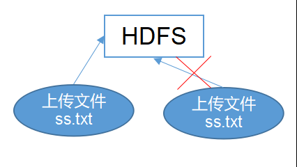
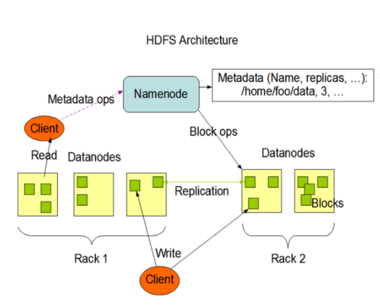
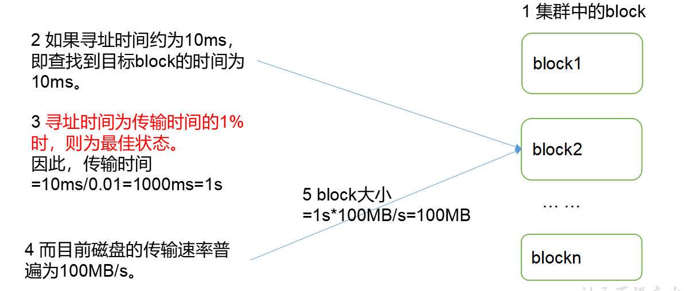
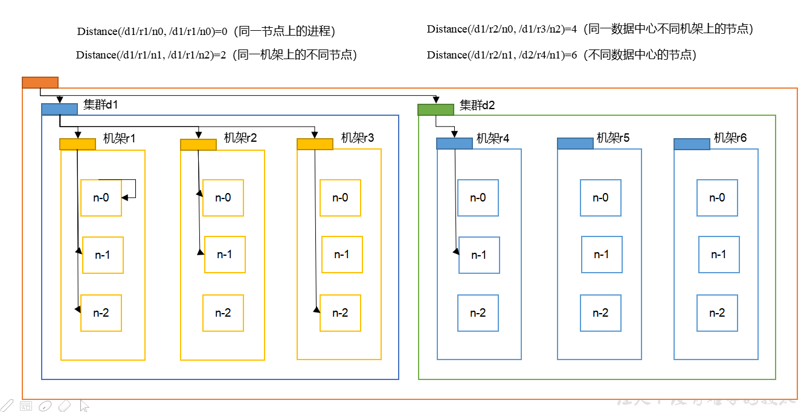
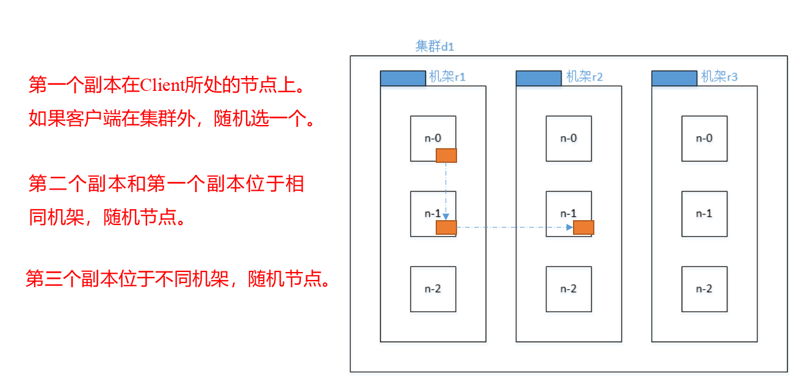
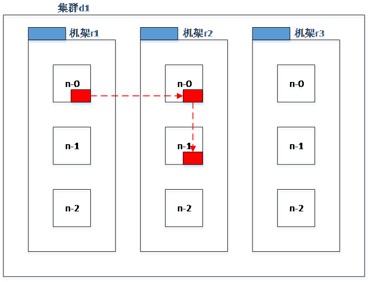
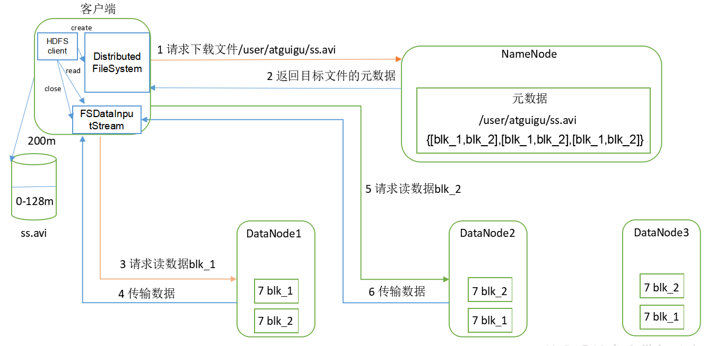
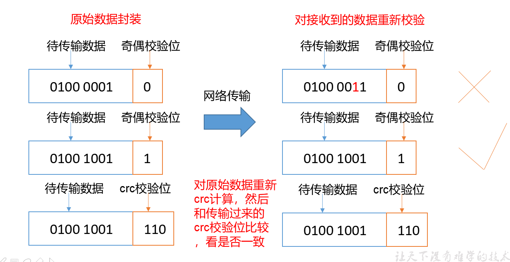
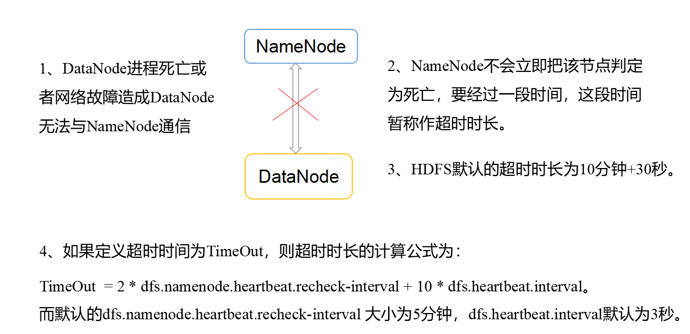
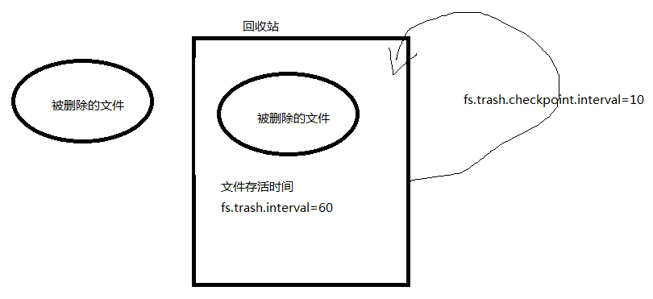

# 分布式文件存储系统Hdfs

## 第一章，Hdfs文件系统的介绍

### 1.1，HDFS产出背景及定义

​	随着数据量越来越大，在一个操作系统存不下所有的数据，那么就分配到更多的操作系统管理的磁盘中，但是不方便管理和维护，迫切需要一种系统来管理多台机器上的文件，这就是分布式文件管理系统。HDFS只是分布式文件管理系统中的一种。

### 1.2，HDFS定义

​	HDFS（Hadoop Distributed File System），它是一个文件系统，用于存储文件，通过目录树来定位文件；其次，它是分布式的，由很多服务器联合起来实现其功能，集群中的服务器有各自的角色。

​	HDFS的使用场景：适合一次写入，多次读出的场景，且不支持文件的修改。适合用来做数据分析，并不适合用来做网盘应用。

### 1.3，HDFS优缺点

1. 高容错性

   数据自动保存多个副本。它通过增加副本的形式，提高容错性。

   某一个副本丢失以后，它可以自动恢复。

2. 适合处理大数据

   （1）数据规模：能够处理数据规模达到GB、TB、甚至PB级别的数据；

   （2）文件规模：能够处理百万规模以上的文件数量，数量相当之大。

3. 可构建在廉价机器上，通过多副本机制，提高可靠性。

### 1.4，缺点

​	1）不适合低延时数据访问，比如毫秒级的存储数据，是做不到的。

​	2）无法高效的对大量小文件进行存储。

​		（1）存储大量小文件的话，它会占用NameNode大量的内存来存储文件目录和块信息。这样是不可取的，因为NameNode的内存总是有限的；

​		（2）小文件存储的寻址时间会超过读取时间，它违反了HDFS的设计目标。

​	3）不支持并发写入、文件随机修改。

​		（1）一个文件只能有一个写，不允许多个线程同时写；

​		（2）仅支持数据append（追加），不支持文件的随机修改。

### 1.5，hdfs文件系统架构

1. NameNode（nn）：就是Master，它是一个主管、管理者。

   （1）管理HDFS的名称空间.

   （2）配置副本策略；

   （3）管理数据块（Block）映射信息；

   （4）处理客户端读写请求。

2. DataNode：就是Slave。NameNode下达命令，DataNode执行实际的操作。

   （1）存储实际的数据块；

   （2）执行数据块的读/写操作。

3. Client：就是客户端。

   （1）文件切分。文件上传HDFS的时候，Client将文件切分成一个一个的Block，然后进行上传；

   （2）与NameNode交互，获取文件的位置信息；

   （3）与DataNode交互，读取或者写入数据；

   （4）Client提供一些命令来管理HDFS，比如NameNode格式化；

   （5）Client可以通过一些命令来访问HDFS，比如对HDFS增删查改操作；

4. Secondary NameNode：并非NameNode的热备。当NameNode挂掉的时候，它并不能马上替换NameNode并提供服务。

   （1）辅助NameNode，分担其工作量，比如定期合并Fsimage和Edits，并推送给NameNode ；

   （2）在紧急情况下，可辅助恢复NameNode。

### 1.5， ==HDFS文件块大小（面试重点）==

- HDFS中的文件在物理上是分块存储（Block），块的大小可以通过配置参数( dfs.blocksize)来规定，默认大小在Hadoop2.x版本中是128M，老版本中是64M。

- 思考：为什么块的大小不能设置太小，也不能设置太大？

  (1）HDFS的块设置太小，会增加寻址时间，程序一直在找块的开始位置；

  （2）如果块设置的太大，从磁盘传输数据的时间会明显大于定位这个块开始位置所需的时间。导致程序在处理这块数据时，会非常慢。

  总结：HDFS块的大小设置主要取决于磁盘传输速率。

## 第二章，==HDFS的Shell操作（开发重点）==

1. 基本语法

~~~ java
bin/hadoop fs 具体命令   OR  bin/hdfs dfs 具体命令
//dfs是fs的实现类。
~~~

2. 命令大全

~~~ java
 bin/hadoop fs

[-appendToFile <localsrc> ... <dst>]
        [-cat [-ignoreCrc] <src> ...]
        [-checksum <src> ...]
        [-chgrp [-R] GROUP PATH...]
        [-chmod [-R] <MODE[,MODE]... | OCTALMODE> PATH...]
        [-chown [-R] [OWNER][:[GROUP]] PATH...]
        [-copyFromLocal [-f] [-p] <localsrc> ... <dst>]
        [-copyToLocal [-p] [-ignoreCrc] [-crc] <src> ... <localdst>]
        [-count [-q] <path> ...]
        [-cp [-f] [-p] <src> ... <dst>]
        [-createSnapshot <snapshotDir> [<snapshotName>]]
        [-deleteSnapshot <snapshotDir> <snapshotName>]
        [-df [-h] [<path> ...]]
        [-du [-s] [-h] <path> ...]
        [-expunge]
        [-get [-p] [-ignoreCrc] [-crc] <src> ... <localdst>]
        [-getfacl [-R] <path>]
        [-getmerge [-nl] <src> <localdst>]
        [-help [cmd ...]]
        [-ls [-d] [-h] [-R] [<path> ...]]
        [-mkdir [-p] <path> ...]
        [-moveFromLocal <localsrc> ... <dst>]
        [-moveToLocal <src> <localdst>]
        [-mv <src> ... <dst>]
        [-put [-f] [-p] <localsrc> ... <dst>]
        [-renameSnapshot <snapshotDir> <oldName> <newName>]
        [-rm [-f] [-r|-R] [-skipTrash] <src> ...]
        [-rmdir [--ignore-fail-on-non-empty] <dir> ...]
        [-setfacl [-R] [{-b|-k} {-m|-x <acl_spec>} <path>]|[--set <acl_spec> <path>]]
        [-setrep [-R] [-w] <rep> <path> ...]
        [-stat [format] <path> ...]
        [-tail [-f] <file>]
        [-test -[defsz] <path>]
        [-text [-ignoreCrc] <src> ...]
        [-touchz <path> ...]
        [-usage [cmd ...]]
~~~

3. 常用命令实操

~~~ java
//（0）启动Hadoop集群（方便后续的测试）
sbin/start-dfs.sh
sbin/start-yarn.sh
//（1）-help：输出这个命令参数
bin/hdfs dfs -help rm
//（2）-ls: 显示目录信息
hadoop fs -ls /
//（3）-mkdir：在hdfs上创建目录
hadoop fs  -mkdir  -p  /aaa/bbb/cc/dd
//（4）-moveFromLocal从本地剪切粘贴到hdfs
hadoop  fs  - moveFromLocal  /home/hadoop/a.txt  /aaa/bbb/cc/dd
//（5）-moveToLocal：从hdfs剪切粘贴到本地
hadoop  fs  - moveToLocal   /aaa/bbb/cc/dd  /home/hadoop/a.txt
//（6）--appendToFile  ：追加一个文件到已经存在的文件末尾
hadoop  fs  -appendToFile  ./hello.txt  /hello.txt
//（7）-cat ：显示文件内容
//（8）-tail：显示一个文件的末尾
hadoop  fs  -tail  /weblog/access_log.1
//（9）-text：以字符形式打印一个文件的内容
hadoop  fs  -text  /weblog/access_log.1
//（10）-chgrp 、-chmod、-chown：linux文件系统中的用法一样，修改文件所属权限
hadoop  fs  -chmod  666  /hello.txt
hadoop  fs  -chown  someuser:somegrp   /hello.txt
//（11）-copyFromLocal：从本地文件系统中拷贝文件到hdfs路径去
hadoop  fs  -copyFromLocal  ./jdk.tar.gz  /aaa/
//（12）-copyToLocal：从hdfs拷贝到本地
hadoop fs -copyToLocal /aaa/jdk.tar.gz
//（13）-cp ：从hdfs的一个路径拷贝到hdfs的另一个路径
hadoop  fs  -cp  /aaa/jdk.tar.gz  /bbb/jdk.tar.gz.2
//（14）-mv：在hdfs目录中移动文件
hadoop  fs  -mv  /aaa/jdk.tar.gz  /
//（15）-get：等同于copyToLocal，就是从hdfs下载文件到本地
hadoop fs -get  /aaa/jdk.tar.gz
//（16）-getmerge  ：合并下载多个文件，比如hdfs的目录 /aaa/下有多个文件:log.1, log.2,log.3,...
hadoop fs -getmerge /aaa/log.* ./log.sum
//（17）-put：等同于copyFromLocal
hadoop  fs  -put  /aaa/jdk.tar.gz  /bbb/jdk.tar.gz.2
//(18）-rm：删除文件或文件夹
hadoop fs -rm -r /aaa/bbb/
//（19）-rmdir：删除空目录
hadoop  fs  -rmdir   /aaa/bbb/ccc
//（20）-df ：统计文件系统的可用空间信息
hadoop  fs  -df  -h  /
//（21）-du统计文件夹的大小信息
hadoop  fs  -du  -s  -h /aaa/*
//（22）-count：统计一个指定目录下的文件节点数量
hadoop fs -count /aaa/
//（23）-setrep：设置hdfs中文件的副本数量
hadoop fs -setrep 3 /aaa/jdk.tar.gz
//这里设置的副本数只是记录在namenode的元数据中，是否真的会有这么多副本，还得看datanode的数量。因为目前只有3台设备，最多也就3个副本，只有节点数的增加到10台时，副本数才能达到10。
~~~

## 第三章，==**HDFS**客户端操作（开发重点）==

### 3.1，HDFS客户端环境准备

1. 根据自己电脑的操作系统拷贝对应的==编译后==的hadoop jar包到非中文路径（例如：D:\Develop\hadoop-2.7.2）。
2. 配置HADOOP_HOME环境变量。
3. 配置Path环境变量。
4. 创建一个Maven工程HdfsClientDemo。
5. 导入相应的依赖坐标+日志添加。

~~~ java
<dependencies>
		<dependency>
			<groupId>junit</groupId>
			<artifactId>junit</artifactId>
			<version>RELEASE</version>
		</dependency>
		<dependency>
			<groupId>org.apache.logging.log4j</groupId>
			<artifactId>log4j-core</artifactId>
			<version>2.8.2</version>
		</dependency>
		<dependency>
			<groupId>org.apache.hadoop</groupId>
			<artifactId>hadoop-common</artifactId>
			<version>2.7.2</version>
		</dependency>
		<dependency>
			<groupId>org.apache.hadoop</groupId>
			<artifactId>hadoop-client</artifactId>
			<version>2.7.2</version>
		</dependency>
		<dependency>
			<groupId>org.apache.hadoop</groupId>
			<artifactId>hadoop-hdfs</artifactId>
			<version>2.7.2</version>
		</dependency>
		<dependency>
			<groupId>jdk.tools</groupId>
			<artifactId>jdk.tools</artifactId>
			<version>1.8</version>
			<scope>system</scope>
			<systemPath>${JAVA_HOME}/lib/tools.jar</systemPath>
		</dependency>
</dependencies>
//注意：如果Eclipse/Idea打印不出日志，在控制台上只显示
1.log4j:WARN No appenders could be found for logger (org.apache.hadoop.util.Shell).  
2.log4j:WARN Please initialize the log4j system properly.  
3.log4j:WARN See http://logging.apache.org/log4j/1.2/faq.html#noconfig for more info.
//需要在项目的src/main/resources目录下，新建一个文件，命名为“log4j.properties”，在文件中填入
log4j.rootLogger=INFO, stdout
log4j.appender.stdout=org.apache.log4j.ConsoleAppender
log4j.appender.stdout.layout=org.apache.log4j.PatternLayout
log4j.appender.stdout.layout.ConversionPattern=%d %p [%c] - %m%n
log4j.appender.logfile=org.apache.log4j.FileAppender
log4j.appender.logfile.File=target/spring.log
log4j.appender.logfile.layout=org.apache.log4j.PatternLayout
log4j.appender.logfile.layout.ConversionPattern=%d %p [%c] - %m%n
~~~

6. 创建包名：com.rzf.hdfs.
7. 创建HdfsClient类.

~~~ java
public class HdfsClient{	
@Test
public void testMkdirs() throws IOException, InterruptedException, URISyntaxException{
		
		// 1 获取文件系统
		Configuration configuration = new Configuration();
		// 配置在集群上运行
		// configuration.set("fs.defaultFS", "hdfs://hadoop101:9000");
		// FileSystem fs = FileSystem.get(configuration);

		FileSystem fs = FileSystem.get(new URI("hdfs://hadoop101:9000"), configuration, "rzf");
		
		// 2 创建目录
		fs.mkdirs(new Path("/1108/daxian/banzhang"));
		
		// 3 关闭资源
		fs.close();
	}
}
~~~

8. 执行程序:运行时需要配置用户名称,也就是需要输入用户名才可以运行。

- 客户端去操作~HDFS时，是有一个用户身份的。默认情况下，~HDFS客户端~API会从~~JVM中获取一个参数来作为自己的用户身份：~-DHADOOP_USER_NAME=rzf，~rzf为用户名称。

### 3.2，其他api操作代码地址。

## 第四章，==HDFS的数据流（面试重点）==

### 4.1，HDFS写数据流程

1）客户端通过Distributed FileSystem模块向NameNode请求上传文件，NameNode检查目标文件是否已存在，==父目录是否存在。==

2）NameNode返回是否可以上传。

3）客户端请求第一个 Block上传到哪几个DataNode服务器上。

4）NameNode返回3个DataNode节点，分别为dn1、dn2、dn3。

5）客户端通过FSDataOutputStream模块请求dn1上传数据，dn1收到请求会继续调用dn2，然后dn2调用dn3，将这个通信管道建立完成。

6）dn1、dn2、dn3逐级应答客户端。

7）客户端开始往dn1上传第一个Block（先从磁盘读取数据放到一个本地内存缓存），以Packet为单位，dn1收到一个Packet就会传给dn2，dn2传给dn3；dn1每传一个packet会放入一个应答队列等待应答。

8）当一个Block传输完成之后，客户端再次请求NameNode上传第二个Block的服务器。（重复执行3-7步）。

### 4.2，网络拓扑-节点距离计算

- 问题引出：在HDFS写数据的过程中，NameNode会选择距离待上传数据最近距离的DataNode接收数据。那么这个最近距离怎么计算呢？

  节点距离：两个节点到达最近的共同祖先的距离总和。

假设有数据中心d1机架r1中的节点n1。该节点可以表示为/d1/r1/n1。利用这种标记，这里给出四种距离描述.

~~~ java
Distance(/d1/r1/n1, /d1/r1/n1)=0（同一节点上的进程）

Distance(/d1/r1/n1, /d1/r1/n2)=2（同一机架上的不同节点）

Distance(/d1/r1/n1, /d1/r3/n2)=4（同一数据中心不同机架上的节点）

Distance(/d1/r1/n1, /d2/r4/n2)=6（不同数据中心的节点）
~~~

- 机架感知（副本存储节点选择）
  - 官方ip地址:<http://hadoop.apache.org/docs/r2.7.2/hadoop-project-dist/hadoop-hdfs/HdfsDesign.html#Data_Replication>

~~~ java
For the common case, when the replication factor is three, HDFS’s placement policy is to put one replica on one node in the local rack, another on a different node in the local rack, and the last on a different node in a different rack.
~~~

- Hadoop2.7.2副本节点选择

- 低版本Hadoop副本节点选择

  第一个副本在client所处的节点上。如果客户端在集群外，随机选一个。

  第二个副本和第一个副本位于不相同机架的随机节点上。

  第三个副本和第二个副本位于相同机架，节点随机。

### 4.3，**HDFS读数据流程**

1）客户端通过Distributed FileSystem向NameNode请求下载文件，NameNode通过查询元数据，找到文件块所在的DataNode地址。

2）挑选一台DataNode（就近原则，然后随机）服务器，请求读取数据。

3）DataNode开始传输数据给客户端（从磁盘里面读取数据输入流，以Packet为单位来做校验）。

4）客户端以Packet为单位接收，先在本地缓存，然后写入目标文件。

## 第五章，==Namenode和SecondNameNode工作机制==（重点）

### 5.1，思考：NameNode中的元数据是存储在哪里的？

​	首先，我们做个假设，如果存储在NameNode节点的磁盘中，因为经常需要进行随机访问，还有响应客户请求，必然是效率过低。因此，元数据需要存放在内存中。但如果只存在内存中，一旦断电，元数据丢失，整个集群就无法工作了。因此产生在磁盘中备份元数据的FsImage。

​	这样又会带来新的问题，当在内存中的元数据更新时，如果同时更新FsImage，就会导致效率过低，但如果不更新，就会发生一致性问题，一旦NameNode节点断电，就会产生数据丢失。因此，引入Edits文件(只进行追加操作，效率很高)。每当元数据有更新或者添加元数据时，修改内存中的元数据并追加到Edits中。这样，一旦NameNode节点断电，可以通过FsImage和Edits的合并，合成元数据。

​	但是，如果长时间添加数据到Edits中，会导致该文件数据过大，效率降低，而且一旦断电，恢复元数据需要的时间过长。因此，需要定期进行FsImage和Edits的合并，如果这个操作由NameNode节点完成，又会效率过低。因此，引入一个新的节点SecondaryNamenode，专门用于FsImage和Edits的合并。

1. 第一阶段：NameNode启动

（1）第一次启动NameNode格式化后，创建Fsimage和Edits文件。如果不是第一次启动，直接加载编辑日志和镜像文件到内存。

（2）客户端对元数据进行增删改的请求。

（3）NameNode记录操作日志，更新滚动日志。

（4）NameNode在内存中对数据进行增删改。

2. 第二阶段：Secondary NameNode工作

​	（1）Secondary NameNode询问NameNode是否需要CheckPoint。直接带回NameNode是否检查结果。

​	（2）Secondary NameNode请求执行CheckPoint。

​	（3）NameNode滚动正在写的Edits日志。

​	（4）将滚动前的编辑日志和镜像文件拷贝到Secondary NameNode。

​	（5）Secondary NameNode加载编辑日志和镜像文件到内存，并合并。

​	（6）生成新的镜像文件fsimage.chkpoint。

​	（7）拷贝fsimage.chkpoint到NameNode。

​	（8）NameNode将fsimage.chkpoint重新命名成fsimage。

==NN和2NN工作机制详解==

~~~ java
//**NN和2NN工作机制详解：**Fsimage：NameNode内存中元数据序列化后形成的文件。Edits：记录客户端更新元数据信息的每一步操作（可通过Edits运算出元数据）。NameNode启动时，先滚动Edits并生成一个空的edits.inprogress，然后加载Edits和Fsimage到内存中，此时NameNode内存就持有最新的元数据信息。Client开始对NameNode发送元数据的增删改的请求，这些请求的操作首先会被记录到edits.inprogress中（查询元数据的操作不会被记录在Edits中，因为查询操作不会更改元数据信息），如果此时NameNode挂掉，重启后会从Edits中读取元数据的信息。然后，NameNode会在内存中执行元数据的增删改的操作。由于Edits中记录的操作会越来越多，Edits文件会越来越大，导致NameNode在启动加载Edits时会很慢，所以需要对Edits和Fsimage进行合并（所谓合并，就是将Edits和Fsimage加载到内存中，照着Edits中的操作一步步执行，最终形成新的Fsimage）。SecondaryNameNode的作用就是帮助NameNode进行Edits和Fsimage的合并工作。SecondaryNameNode首先会询问NameNode是否需要CheckPoint（触发CheckPoint需要满足两个条件中的任意一个，定时时间到和Edits中数据写满了）。直接带回NameNode是否检查结果。SecondaryNameNode执行CheckPoint操作，首先会让NameNode滚动Edits并生成一个空的edits.inprogress，滚动Edits的目的是给Edits打个标记，以后所有新的操作都写入edits.inprogress，其他未合并的Edits和Fsimage会拷贝到SecondaryNameNode的本地，然后将拷贝的Edits和Fsimage加载到内存中进行合并，生成fsimage.chkpoint，然后将fsimage.chkpoint拷贝给NameNode，重命名为Fsimage后替换掉原来的Fsimage。NameNode在启动时就只需要加载之前未合并的Edits和Fsimage即可，因为合并过的Edits中的元数据信息已经被记录在Fsimage中。
//web端访问SecondaryNameNode
浏览器中输入：http://hadoop102:50090/status.html
//chkpoint检查时间参数设置
//（1）通常情况下，SecondaryNameNode每隔一小时执行一次。
	[hdfs-default.xml]
<property>
  <name>dfs.namenode.checkpoint.period</name>
  <value>3600</value>
</property>
//（2）一分钟检查一次操作次数，当操作次数达到1百万时，SecondaryNameNode执行一次。
<property>
  <name>dfs.namenode.checkpoint.txns</name>
  <value>1000000</value>
<description>操作动作次数</description>
</property>
<property>
  <name>dfs.namenode.checkpoint.check.period</name>
  <value>60</value>
<description> 1分钟检查一次操作次数</description>
</property>
~~~

### 5.2，镜像文件和编辑日志文件

1. 概念

   ​	namenode被格式化之后，将在/opt/module/hadoop-2.7.2/data/tmp/dfs/name/current目录中产生如下文件

~~~ java
edits_0000000000000000000
fsimage_0000000000000000000.md5
seen_txid
VERSION
~~~

（1）Fsimage文件：~HDFS文件系统元数据的一个永久性的检查点，其中包含HDFS文件系统的所有目录和文件idnode的序列化信息。 

（2）Edits文件：存放~HDFS文件系统的所有更新操作的路径，文件系统客户端执行的所有写操作首先会被记录到edits文件中。 

（3）seen_txid文件保存的是一个数字，就是最后一个edits_的数字

（4）每次~Namenode启动的时候都会将~fsimage文件读入内存，并从00001开始到~seen_txid中记录的数字依次执行每个edits里面的更新操作，保证内存中的元数据信息是最新的、同步的，可以看成~Namenode启动的时候就将fsimage和edits文件进行了合并。

2. oiv查看fsimage文件

   （1）查看oiv和oev命令

~~~ java
hdfs
oiv                  apply the offline fsimage viewer to an fsimage
oev                  apply the offline edits viewer to an edits file
~~~

​	（2）基本语法：hdfs oiv -p 文件类型 -i镜像文件 -o 转换后文件输出路径

~~~ java
//案例：
/opt/module/hadoop-2.7.2/data/tmp/dfs/name/current
hdfs oiv -p XML -i fsimage_0000000000000000025 -o /opt/module/hadoop-2.7.2/fsimage.xml
cat /opt/module/hadoop-2.7.2/fsimage.xml
//将显示的xml文件内容拷贝到eclipse中创建的xml文件中，并格式化。
<inode>
	<id>16386</id>
	<type>DIRECTORY</type>
	<name>user</name>
	<mtime>1512722284477</mtime>
	<permission>atguigu:supergroup:rwxr-xr-x</permission>
	<nsquota>-1</nsquota>
	<dsquota>-1</dsquota>
</inode>
<inode>
	<id>16387</id>
	<type>DIRECTORY</type>
	<name>atguigu</name>
	<mtime>1512790549080</mtime>
	<permission>atguigu:supergroup:rwxr-xr-x</permission>
	<nsquota>-1</nsquota>
	<dsquota>-1</dsquota>
</inode>
<inode>
	<id>16389</id>
	<type>FILE</type>
	<name>wc.input</name>
	<replication>3</replication>
	<mtime>1512722322219</mtime>
	<atime>1512722321610</atime>
	<perferredBlockSize>134217728</perferredBlockSize>
	<permission>atguigu:supergroup:rw-r--r--</permission>
	<blocks>
		<block>
			<id>1073741825</id>
			<genstamp>1001</genstamp>
			<numBytes>59</numBytes>
		</block>
	</blocks>
</inode >
//思考：可以看出，Fsimage中没有记录块所对应DataNode，为什么？
//在集群启动后，要求DataNode上报数据块信息，并间隔一段时间后再次上报。
~~~

3. oev查看edits文件

   （1）基本语法:hdfs oev -p 文件类型 -i编辑日志 -o 转换后文件输出路径

~~~ java
//案例
hdfs oev -p XML -i edits_0000000000000000012-0000000000000000013 -o /opt/module/hadoop-2.7.2/edits.xml
cat /opt/module/hadoop-2.7.2/edits.xml
//将显示的xml文件内容拷贝到eclipse中创建的xml文件中，并格式化。
<?xml version="1.0" encoding="UTF-8"?>
<EDITS>
	<EDITS_VERSION>-63</EDITS_VERSION>
	<RECORD>
		<OPCODE>OP_START_LOG_SEGMENT</OPCODE>
		<DATA>
			<TXID>129</TXID>
		</DATA>
	</RECORD>
	<RECORD>
		<OPCODE>OP_ADD</OPCODE>
		<DATA>
			<TXID>130</TXID>
			<LENGTH>0</LENGTH>
			<INODEID>16407</INODEID>
			<PATH>/hello7.txt</PATH>
			<REPLICATION>2</REPLICATION>
			<MTIME>1512943607866</MTIME>
			<ATIME>1512943607866</ATIME>
			<BLOCKSIZE>134217728</BLOCKSIZE>
			<CLIENT_NAME>DFSClient_NONMAPREDUCE_-1544295051_1</CLIENT_NAME>
			<CLIENT_MACHINE>192.168.1.5</CLIENT_MACHINE>
			<OVERWRITE>true</OVERWRITE>
			<PERMISSION_STATUS>
				<USERNAME>atguigu</USERNAME>
				<GROUPNAME>supergroup</GROUPNAME>
				<MODE>420</MODE>
			</PERMISSION_STATUS>
			<RPC_CLIENTID>908eafd4-9aec-4288-96f1-e8011d181561</RPC_CLIENTID>
			<RPC_CALLID>0</RPC_CALLID>
		</DATA>
	</RECORD>
	<RECORD>
		<OPCODE>OP_ALLOCATE_BLOCK_ID</OPCODE>
		<DATA>
			<TXID>131</TXID>
			<BLOCK_ID>1073741839</BLOCK_ID>
		</DATA>
	</RECORD>
	<RECORD>
		<OPCODE>OP_SET_GENSTAMP_V2</OPCODE>
		<DATA>
			<TXID>132</TXID>
			<GENSTAMPV2>1016</GENSTAMPV2>
		</DATA>
	</RECORD>
	<RECORD>
		<OPCODE>OP_ADD_BLOCK</OPCODE>
		<DATA>
			<TXID>133</TXID>
			<PATH>/hello7.txt</PATH>
			<BLOCK>
				<BLOCK_ID>1073741839</BLOCK_ID>
				<NUM_BYTES>0</NUM_BYTES>
				<GENSTAMP>1016</GENSTAMP>
			</BLOCK>
			<RPC_CLIENTID></RPC_CLIENTID>
			<RPC_CALLID>-2</RPC_CALLID>
		</DATA>
	</RECORD>
	<RECORD>
~~~

### 5.3，**滚动编辑**日志

​	正常情况HDFS文件系统有更新操作时，就会滚动编辑日志。也可以用命令强制滚动编辑日志。

1）滚动编辑日志（前提必须启动集群）

~~~ java
 hdfs dfsadmin -rollEdits
~~~

2）镜像文件什么时候产生

​	Namenode启动时加载镜像文件和编辑日志

### 5.4，namenode版本号

1）查看namenode版本号

~~~ java
在/opt/module/hadoop-2.7.2/data/tmp/dfs/name/current这个目录下查看VERSION

namespaceID=1933630176

clusterID=CID-1f2bf8d1-5ad2-4202-af1c-6713ab381175

cTime=0

storageType=NAME_NODE

blockpoolID=BP-97847618-192.168.10.102-1493726072779

layoutVersion=-63
~~~

2）namenode版本号具体解释

（1）namespaceID在HDFS上，会有多个Namenode，所以不同Namenode的namespaceID是不同的，分别管理一组blockpoolID。

（2）clusterID集群id，全局唯一

（3）cTime属性标记了namenode存储系统的创建时间，对于刚刚格式化的存储系统，这个属性为0；但是在文件系统升级之后，该值会更新到新的时间戳。

（4）storageType属性说明该存储目录包含的是namenode的数据结构。

（5）blockpoolID：一个block pool id标识一个block pool，并且是跨集群的全局唯一。当一个新的Namespace被创建的时候(format过程的一部分)会创建并持久化一个唯一ID。在创建过程构建全局唯一的BlockPoolID比人为的配置更可靠一些。NN将BlockPoolID持久化到磁盘中，在后续的启动过程中，会再次load并使用。

（6）layoutVersion是一个负整数。通常只有HDFS增加新特性时才会更新这个版本号。

### 5.5,SecondaryNameNode目录结构

​	Secondary NameNode用来监控HDFS状态的辅助后台程序，每隔一段时间获取HDFS元数据的快照。

在/opt/module/hadoop-2.7.2/data/tmp/dfs/namesecondary/current这个目录中查看SecondaryNameNode目录结构。

~~~ java
edits_0000000000000000001-0000000000000000002
fsimage_0000000000000000002
fsimage_0000000000000000002.md5
VERSION
~~~

​	SecondaryNameNode的namesecondary/current目录和主namenode的current目录的布局相同。

好处：在主namenode发生故障时（假设没有及时备份数据），可以从SecondaryNameNode恢复数据。

方法一：将SecondaryNameNode中数据拷贝到namenode存储数据的目录；

方法二：使用-importCheckpoint选项启动namenode守护进程，从而将SecondaryNameNode用作新的主namenode。

- 案例一：

~~~java
//案例：模拟namenode故障，并采用方法一，恢复namenode数据
//（1）kill -9 namenode进程
//（2）删除namenode存储的数据（/opt/module/hadoop-2.7.2/data/tmp/dfs/name）
rm -rf /opt/module/hadoop-2.7.2/data/tmp/dfs/name/*
//（3）拷贝SecondaryNameNode中数据到原namenode存储数据目录
cp -R /opt/module/hadoop-2.7.2/data/tmp/dfs/namesecondary/* /opt/module/hadoop-2.7.2/data/tmp/dfs/name/
//（4）重新启动namenode
sbin/hadoop-daemon.sh start namenode
~~~

- 案例二：

~~~ java
//模拟namenode故障，并采用方法二，恢复namenode数据
//（0）修改hdfs-site.xml中的
<property>
  <name>dfs.namenode.checkpoint.period</name>
  <value>120</value>
</property>
<property>
  <name>dfs.namenode.name.dir</name>
  <value>/opt/module/hadoop-2.7.2/data/tmp/dfs/name</value>
</property>
~~~

(1）kill -9 namenode进程

（2）删除namenode存储的数据（/opt/module/hadoop-2.7.2/data/tmp/dfs/name）

~~~ java
rm -rf /opt/module/hadoop-2.7.2/data/tmp/dfs/name/*
~~~

（3）如果SecondaryNameNode不和Namenode在一个主机节点上，需要将SecondaryNameNode存储数据的目录拷贝到Namenode存储数据的平级目录。

~~~ java
[rzf@hadoop102 dfs]$ scp -r rzf@hadoop103:/opt/module/hadoop-2.7.2/data/tmp/dfs/namesecondary ./
[rzf@hadoop102 namesecondary]$ rm -rf in_use.lock
[rzf@hadoop102 dfs]$ pwd
/opt/module/hadoop-2.7.2/data/tmp/dfs
[rzf@hadoop102 dfs]$ ls
data  name  namesecondary
~~~

（4）导入检查点数据（等待一会ctrl+c结束掉）

~~~ java
bin/hdfs namenode -importCheckpoint
~~~

（5）启动namenode

~~~ java
sbin/hadoop-daemon.sh start namenode
~~~

（6）如果提示文件锁了，可以删除in_use.lock 

~~~ java
rm -rf /opt/module/hadoop-2.7.2/data/tmp/dfs/namesecondary/in_use.lock
~~~

### 5.6，集群的安全模式

1. 概述：

   Namenode启动时，首先将映像文件（fsimage）载入内存，并执行编辑日志（edits）中的各项操作。一旦在内存中成功建立文件系统元数据的映像，则创建一个新的fsimage文件和一个空的编辑日志。此时，namenode开始监听datanode请求。但是此刻，namenode运行在安全模式，即namenode的文件系统对于客户端来说是只读的。

   系统中的数据块的位置并不是由namenode维护的，而是以块列表的形式存储在datanode中。在系统的正常操作期间，namenode会在内存中保留所有块位置的映射信息。在安全模式下，各个datanode会向namenode发送最新的块列表信息，namenode了解到足够多的块位置信息之后，即可高效运行文件系统。

   如果满足“最小副本条件”，namenode会在30秒钟之后就退出安全模式。所谓的最小副本条件指的是在整个文件系统中99.9%的块满足最小副本级别（默认值：dfs.replication.min=1）。在启动一个刚刚格式化的HDFS集群时，因为系统中还没有任何块，所以namenode不会进入安全模式。

2. 基本语法

   集群处于安全模式，不能执行重要操作（写操作）。集群启动完成后，自动退出安全模式。

~~~  java
（1）bin/hdfs dfsadmin -safemode get		//（功能描述：查看安全模式状态）
（2）bin/hdfs dfsadmin -safemode enter  	//（功能描述：进入安全模式状态）
（3）bin/hdfs dfsadmin -safemode leave	//（功能描述：离开安全模式状态）
（4）bin/hdfs dfsadmin -safemode wait	//（功能描述：等待安全模式状态）
~~~

### 5.7，**Namenode多**目录配置

1）namenode的本地目录可以配置成多个，且每个目录存放内容相同，增加了可靠性。

2）具体配置如下：

~~~ java
//(1)hdfs-site.xml
<property>
    <name>dfs.namenode.name.dir</name>
<value>file:///${hadoop.tmp.dir}/dfs/name1,file:///${hadoop.tmp.dir}/dfs/name2</value>
</property>
//（2）停止集群，删除data和logs中所有数据。
rm -rf data/ logs/
//（3）格式化集群并启动。
bin/hdfs namenode –format
sbin/start-dfs.sh
//（4）查看结果
ll
[rzf@hadoop101 dfs]$ ll
总用量 12
 data
 name1
 name2
~~~

## 第六章，==DataNode（面试开发重点）==

### 6.1，DataNode工作机制

1）一个数据块在DataNode上以文件形式存储在磁盘上，包括两个文件，一个是数据本身，一个是元数据包括数据块的长度，块数据的校验和，以及时间戳。

2）DataNode启动后向NameNode注册，通过后，周期性（1小时）的向NameNode上报所有的块信息。

3）心跳是每3秒一次，心跳返回结果带有NameNode给该DataNode的命令如复制块数据到另一台机器，或删除某个数据块。如果超过10分钟没有收到某个DataNode的心跳，则认为该节点不可用。

4）集群运行中可以安全加入和退出一些机器。

### 6.2，**数据**完整性

- 思考：如果电脑磁盘里面存储的数据是控制高铁信号灯的红灯信号（1）和绿灯信号（0），但是存储该数据的磁盘坏了，一直显示是绿灯，是否很危险？同理DataNode节点上的数据损坏了，却没有发现，是否也很危险，那么如何解决呢？如下是DataNode节点保证数据完整性的方法。

  1）当DataNode读取Block的时候，它会计算CheckSum。

  2）如果计算后的CheckSum，与Block创建时值不一样，说明Block已经损坏。

  3）Client读取其他DataNode上的Block。

  4）DataNode在其文件创建后周期验证CheckSum，简单来说就是crc冗余校验。

### 6.3，**掉线时限参数设置**

需要注意的是hdfs-site.xml 配置文件中的heartbeat.recheck.interval的单位为毫秒，dfs.heartbeat.interval的单位为秒。

~~~ java
<property>
    <name>dfs.namenode.heartbeat.recheck-interval</name>
    <value>300000</value>
</property>

<property>
    <name>dfs.heartbeat.interval</name>
    <value>3</value>
</property>
~~~

### 6.4，**服役新数据**节点

- 随着公司业务的增长，数据量越来越大，原有的数据节点的容量已经不能满足存储数据的需求，需要在原有集群基础上动态添加新的数据节点。

  1.	环境准备

  ​	（1）在hadoop103主机上再克隆一台hadoop104主机

  ​	（2）修改IP地址和主机名称

  ​	（3）**删除原来HDFS**文件系统留存的文件（/opt/module/hadoop-2.7.2/data和log）

  ​	（4）source一下配置文件：source /etc/profile

  2. 服役新节点具体步骤

     （1）直接启动DataNode，即可关联到集群

~~~java
[rzf@hadoop104 hadoop-2.7.2]$ sbin/hadoop-daemon.sh start datanode
[rzf@hadoop104 hadoop-2.7.2]$ sbin/yarn-daemon.sh start nodemanager
~~~

​		（2）如果数据不均衡，可以用命令实现集群的再平衡

~~~ java
[rzf@hadoop101 sbin]$ ./start-balancer.sh
starting balancer, logging to /opt/module/hadoop-2.7.2/logs/hadoop-atguigu-balancer-hadoop101.out
Time Stamp               Iteration#  Bytes Already Moved  Bytes Left To Move  Bytes Being Moved
~~~

### 6.5，退役旧数据节点

1. 添加白名单：

   添加到白名单的主机节点，都允许访问NameNode，不在白名单的主机节点，都会被退出。

2. 配置白名单的具体步骤如下：

   （1）在NameNode的/opt/module/hadoop-2.7.2/etc/hadoop目录下创建dfs.hosts文件。

   （2）添加如下主机名称（不添加hadoop104）

~~~ java
hadoop101
hadoop102
hadoop103
~~~

​	（3）在NameNode的hdfs-site.xml配置文件中增加dfs.hosts属性

~~~ java
<property>
<name>dfs.hosts</name>
<value>/opt/module/hadoop-2.7.2/etc/hadoop/dfs.hosts</value>
</property>
~~~

​	（4）配置文件分发

~~~ java
xsync hdfs-site.xml
//刷新NameNode
hdfs dfsadmin -refreshNodes
~~~

​	(5) 更新ResourceManager节点

~~~ java
yarn rmadmin -refreshNodes
//6）在web浏览器上查看
~~~

​	(6) 如果数据不均衡，可以用命令实现集群的再平衡

~~~ java
[rf@hadoop101 sbin]$ ./start-balancer.sh
starting balancer, logging to /opt/module/hadoop-2.7.2/logs/hadoop-atguigu-balancer-hadoop101.out
Time Stamp               Iteration#  Bytes Already Moved  Bytes Left To Move  Bytes Being Moved
~~~

### 6.6，黑名单退役

- 在黑名单上面的主机都会被强制退出。

  1. 在NameNode的/opt/module/hadoop-2.7.2/etc/hadoop目录下创建dfs.hosts.exclude文件。

  2. 添加如下主机名称（要退役的节点）

~~~ java
hadoop105
~~~

​	2．在NameNode的hdfs-site.xml配置文件中增加dfs.hosts.exclude属性

~~~ java
<property>
<name>dfs.hosts.exclude</name>
      <value>/opt/module/hadoop-2.7.2/etc/hadoop/dfs.hosts.exclude</value>
</property>
~~~

​	3．刷新NameNode、刷新ResourceManager

~~~ java
[rzf@hadoop101 hadoop-2.7.2]$ hdfs dfsadmin -refreshNodes
Refresh nodes successful

[rzf@hadoop101 hadoop-2.7.2]$ yarn rmadmin -refreshNodes
17/06/24 14:55:56 INFO client.RMProxy: Connecting to ResourceManager at hadoop103/192.168.1.103:8033
~~~

 4. 检查Web浏览器，退役节点的状态为decommission in progress（退役中），

    说明数据节点正在复制块到其他节点

	5.		等待退役节点状态为decommissioned（所有块已经复制完成），停止该节点及节点资源管理器。注意：如果副本数是3，服役的节点小于等于3，是不能退役成功的，需要修改副本数后才能退役，

~~~ java
[rzf@hadoop104 hadoop-2.7.2]$ sbin/hadoop-daemon.sh stop datanode
stopping datanode
[rzf@hadoop104 hadoop-2.7.2]$ sbin/yarn-daemon.sh stop nodemanager
~~~

​	6.如果数据不均衡，可以用命令实现集群的再平衡

~~~ java
[rzf@hadoop101 hadoop-2.7.2]$ sbin/start-balancer.sh 
starting balancer, logging to /opt/module/hadoop-2.7.2/logs/hadoop-atguigu-balancer-hadoop101.out
Time Stamp               Iteration#  Bytes Already Moved  Bytes Left To Move  Bytes Being Moved
//注意：不允许白名单和黑名单中同时出现同一个主机名称。
~~~

### 6.7， Datanode多目录配置

1）datanode也可以配置成多个目录，每个目录存储的数据不一样。即：数据不是副本。

2）具体配置如下：hdfs-site.xml

~~~ java
<property>
        <name>dfs.datanode.data.dir</name>
    <value>file:///${hadoop.tmp.dir}/dfs/data1,file:///${hadoop.tmp.dir}/dfs/data2</value>
  </property>
~~~

## 第七章，**HDFS** **2.X新特性**

### 7.1，集群间数据拷贝

1. scp实现两个远程主机之间的文件复制

~~~ java
scp -r hello.txt root@hadoop103:/user/atguigu/hello.txt		// 推 push
scp -r root@hadoop103:/user/rzf/hello.txt  hello.txt		// 拉 pull
scp -r root@hadoop103:/user/rzf/hello.txt root@hadoop104:/user/rzf   //是通过本地主机中转实现两个远程主机的文件复制；如果在两个远程主机之间ssh没有配置的情况下可以使用该方式。
~~~

2. 采用distcp命令实现两个Hadoop集群之间的递归数据复制

~~~ java
[rzf@hadoop101 hadoop-2.7.2]$  bin/hadoop distcp
hdfs://haoop101:9000/user/rzf/hello.txt hdfs://hadoop102:9000/user/rzf/hello.txt
~~~

### 7.2.，**H**adoop存档

1）理论概述

每个文件均按块存储，每个块的元数据存储在namenode的内存中，因此hadoop存储小文件会非常低效。因为大量的小文件会耗尽namenode中的大部分内存。但注意，存储小文件所需要的磁盘容量和存储这些文件原始内容所需要的磁盘空间相比也不会增多。例如，一个1MB的文件以大小为128MB的块存储，使用的是1MB的磁盘空间，而不是128MB。

Hadoop存档文件或HAR文件，是一个更高效的文件存档工具，它将文件存入HDFS块，在减少namenode内存使用的同时，允许对文件进行透明的访问。具体说来，Hadoop存档文件可以用作MapReduce的输入。

2）案例实操

​	（1）需要启动yarn进程

~~~ java
start-yarn.sh
~~~

（2）归档文件

​	归档成一个叫做xxx.har的文件夹，该文件夹下有相应的数据文件。Xx.har目录是一个整体，该目录看成是一个归档文件即可。

把/user/rzf/input目录里面的所有文件归档成一个叫input.har的归档文件，并把归档后文件存储到/user/rzf/output路径下。

~~~ java
bin/hadoop archive -archiveName input.har –p  /user/rzf/input   /user/rzf/output
~~~

（3）查看归档

~~~ java
[rzf@hadoop101 hadoop-2.7.2]$ hadoop fs -lsr /user/rzf/output/input.har

[rzf@hadoop101 hadoop-2.7.2]$ hadoop fs -lsr har:///user/rzf/output/input.har
~~~

（4）解归档文件

~~~ java
hadoop fs -cp har:/// user/rzf/output/input.har/*    /user/rzf
~~~

### 7.3，**回收站**

- 开启回收站功能，可以将删除的文件在不超时的情况下，恢复原数据，起到防止误删除、备份等作用。

1）默认回收站

​	默认值fs.trash.interval=0，0表示禁用回收站，可以设置删除文件的存活时间。

​	默认值fs.trash.checkpoint.interval=0，检查回收站的间隔时间。

​	要求fs.trash.checkpoint.interval<=fs.trash.interval。

2）启用回收站

修改core-site.xml，配置垃圾回收时间为1分钟。

~~~ java
<property>
    <name>fs.trash.interval</name>
    <value>1</value>
</property>
~~~

3）查看回收站:回收站在集群中的；路径：/user/rzf/.Trash/….

4）修改访问垃圾回收站用户名称

​	进入垃圾回收站用户名称，默认是dr.who，修改为rzf用户

~~~ java
core-site.xml
<property>
  <name>hadoop.http.staticuser.user</name>
  <value>rzf</value>
</property>
~~~

5）通过程序删除的文件不会经过回收站，需要调用moveToTrash()才进入回收站

~~~ java
Trash trash = New Trash(conf);

trash.moveToTrash(path);
~~~

6）恢复回收站数据

~~~ hava
hadoop fs -mv /user/rzf/.Trash/Current/user/rzf/input    /user/rzf/input
~~~

7）清空回收站

~~~ java
hdfs dfs -expunge
~~~

### 7.4， 快照管理

- 快照相当于对目录做一个备份。并不会立即复制所有文件，而是指向同一个文件。当写入发生时，才会产生新文件。

1）基本语法

~~~ java
（1）hdfs dfsadmin -allowSnapshot 路径   （功能描述：开启指定目录的快照功能）

​	（2）hdfs dfsadmin -disallowSnapshot 路径 （功能描述：禁用指定目录的快照功能，默认是禁用）

​	（3）hdfs dfs -createSnapshot 路径        （功能描述：对目录创建快照）

​	（4）hdfs dfs -createSnapshot 路径 名称   （功能描述：指定名称创建快照）

​	（5）hdfs dfs -renameSnapshot 路径 旧名称 新名称 （功能描述：重命名快照）

​	（6）hdfs lsSnapshottableDir         （功能描述：列出当前用户所有可快照目录）

​	（7）hdfs snapshotDiff 路径1 路径2 （功能描述：比较两个快照目录的不同之处）

​	（8）hdfs dfs -deleteSnapshot <path> <snapshotName>  （功能描述：删除快照）
//案例
//（1）开启/禁用指定目录的快照功能
hdfs dfsadmin -allowSnapshot /user/rzf/input
hdfs dfsadmin -disallowSnapshot /user/rzf/input
//（2）对目录创建快照
hdfs dfs -createSnapshot /user/rzf/input
//通过web访问hdfs://hadoop101:50070/user/rzf/input/.snapshot/s…..// 快照和源文件使用相同数据
hdfs dfs -lsr /user/rzf/input/.snapshot/
//（3）指定名称创建快照
hdfs dfs -createSnapshot /user/rzf/input  miao170508
//（4）重命名快照
hdfs dfs -renameSnapshot /user/rzf/input/  miao170508 rzf170508
//（5）列出当前用户所有可快照目录
hdfs lsSnapshottableDir
//（6）比较两个快照目录的不同之处
hdfs snapshotDiff
 /user/rzf/input/  .  .snapshot/rzf170508	
 //（7）恢复快照
 hdfs dfs -cp
/user/rzf/input/.snapshot/s20170708-134303.027 /user
~~~

