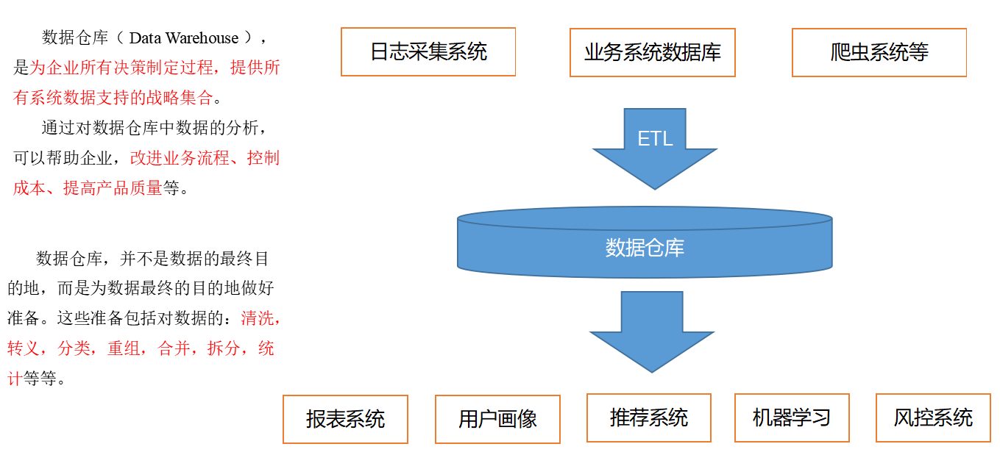
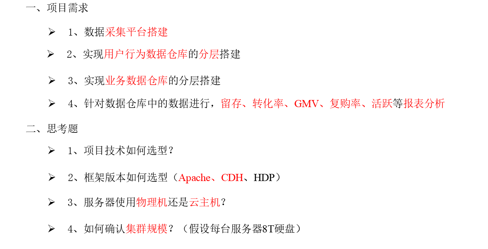
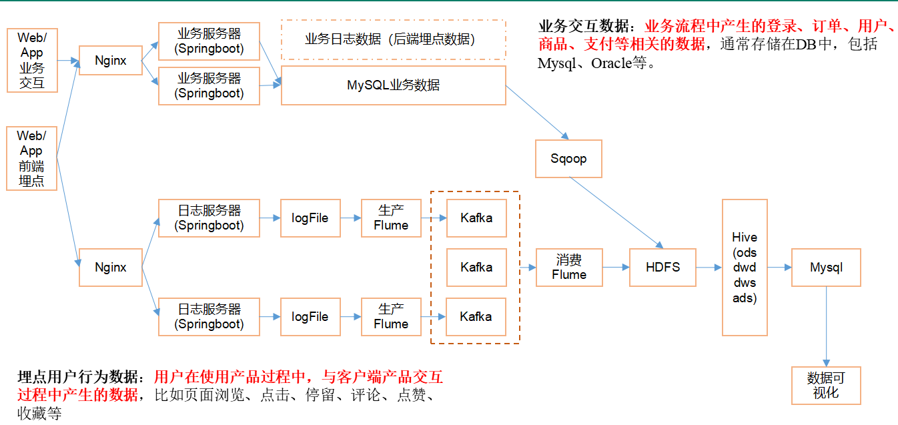
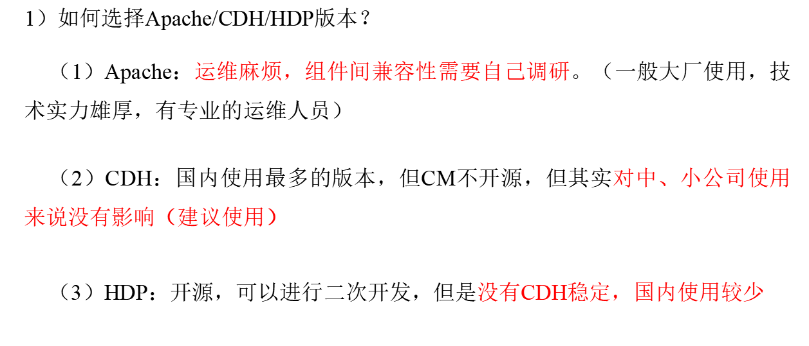
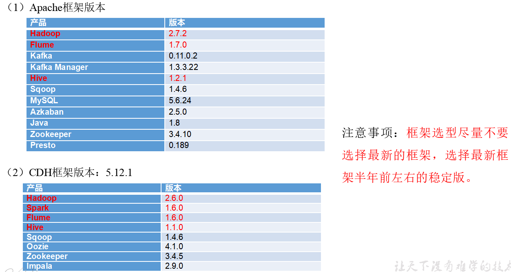
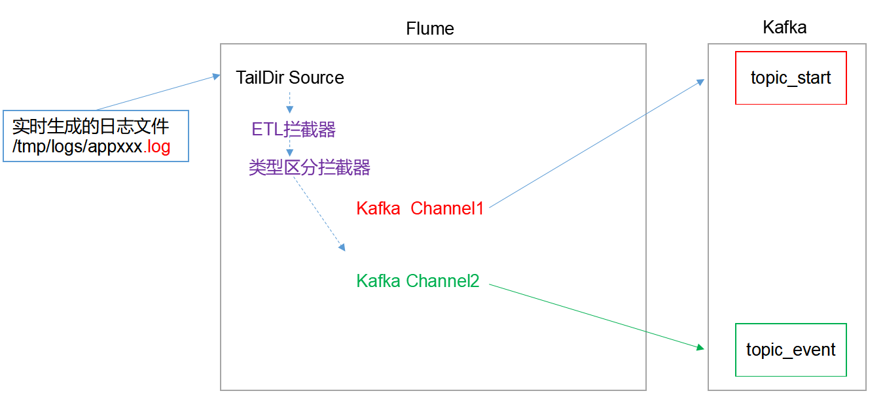
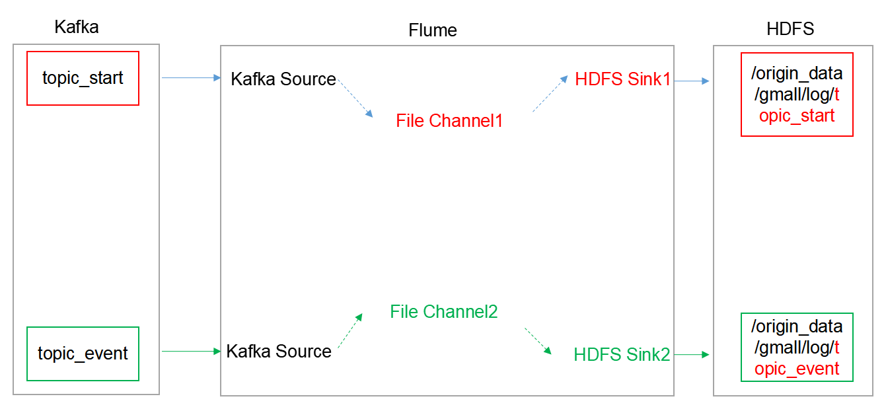

# 数据仓库项目

## 第一章，数仓概念及项目需求

### 1.1，什么是数仓？



### 1.2，数仓需求分析



- 接下来的几个章节内，会对上面提出的问题进行一一解答。

### 1.3，技术选型

- 数据采集传输：Flume,Kafka,Sqoop,Logstash,DataX
- 数据存储：Mysql,Hdfs,HBase,Redis,MongoDB
- 数据计算：Hive,Tez,Spark,Flink,Storm
  - Hive底层是基于mapreducer计算的框架，而mapreduce计算框架是基于磁盘的，Tez是基于内存运算，速度比mapreducer计算块。
- 数据查询：Presto,Druid,Impala,Kylin
  - Presto是一个开源的分布式SQL查询引擎，适用于交互式分析查询，数据量支持GB到PB字节。Presto支持在线数据查询，包括Hive, Cassandra, 关系数据库以及专有数据存储。一条Presto查询可以将多个数据源的数据进行合并，可以跨越整个组织进行分析。

### 1.4，系统数据流程设计



### 1.5，系统框架版本选择





### 1.6，集群规模计算(==重点==)


- 服务器集群规划：

| 服务名称           | 子服务                | 服务器hadoop102 | 服务器hadoop103 | 服务器hadoop104 |
| ------------------ | --------------------- | --------------- | --------------- | --------------- |
| HDFS               | NameNode              | √               |                 |                 |
|                    | DataNode              | √               | √               | √               |
|                    | SecondaryNameNode     |                 |                 | √               |
| Yarn               | NodeManager           | √               | √               | √               |
|                    | Resourcemanager       |                 | √               |                 |
| Zookeeper          | Zookeeper Server      | √               | √               | √               |
| Flume(采集日志)    | Flume                 | √               | √               |                 |
| Kafka              | Kafka                 | √               | √               | √               |
| Flume（消费Kafka） | Flume                 |                 |                 | √               |
| Hive               | Hive                  | √               |                 |                 |
| MySQL              | MySQL                 | √               |                 |                 |
| Sqoop              | Sqoop                 | √               |                 |                 |
| Presto             | Coordinator           | √               |                 |                 |
|                    | Worker                |                 | √               | √               |
| Azkaban            | AzkabanWebServer      | √               |                 |                 |
|                    | AzkabanExecutorServer | √               |                 |                 |
| Druid              | Druid                 | √               | √               | √               |
| 服务数总计         |                       | 13              | 8               | 9               |

## 第二章，数据生成模块

### 2.1，埋点数据的基本格式

- 公共字段：基本所有安卓手机都包含的字段

- 业务字段：埋点上报的字段，有具体的业务类型

~~~ java
//业务字段数据格式
{
"ap":"xxxxx",//项目数据来源 app pc
"cm": {  //公共字段
		"mid": "",  // (String) 设备唯一标识
        "uid": "",  // (String) 用户标识
        "vc": "1",  // (String) versionCode，程序版本号
        "vn": "1.0",  // (String) versionName，程序版本名
        "l": "zh",  // (String) 系统语言
        "sr": "",  // (String) 渠道号，应用从哪个渠道来的。
        "os": "7.1.1",  // (String) Android系统版本
        "ar": "CN",  // (String) 区域
        "md": "BBB100-1",  // (String) 手机型号
        "ba": "blackberry",  // (String) 手机品牌
        "sv": "V2.2.1",  // (String) sdkVersion
        "g": "",  // (String) gmail
        "hw": "1620x1080",  // (String) heightXwidth，屏幕宽高
        "t": "1506047606608",  // (String) 客户端日志产生时的时间
        "nw": "WIFI",  // (String) 网络模式
        "ln": 0,  // (double) lng经度
        "la": 0  // (double) lat 纬度
    },
"et":  [  //事件
            {
                "ett": "1506047605364",  //客户端事件产生时间
                "en": "display",  //事件名称
                "kv": {  //事件结果，以key-value形式自行定义
                    "goodsid": "236",
                    "action": "1",
                    "extend1": "1",
"place": "2",
"category": "75"
                }
            }
        ]
}
//示例日志（服务器时间戳 | 日志）：
1540934156385|{
    "ap": "gmall", 
    "cm": {
        "uid": "1234", 
        "vc": "2", 
        "vn": "1.0", 
        "la": "EN", 
        "sr": "", 
        "os": "7.1.1", 
        "ar": "CN", 
        "md": "BBB100-1", 
        "ba": "blackberry", 
        "sv": "V2.2.1", 
        "g": "abc@gmail.com", 
        "hw": "1620x1080", 
        "t": "1506047606608", 
        "nw": "WIFI", 
        "ln": 0
    }, 
        "et": [
            {
                "ett": "1506047605364",  //客户端事件产生时间
                "en": "display",  //事件名称
                "kv": {  //事件结果，以key-value形式自行定义
                    "goodsid": "236",
                    "action": "1",
                    "extend1": "1",
"place": "2",
"category": "75"
                }
            },{
		        "ett": "1552352626835",
		        "en": "active_background",
		        "kv": {
			         "active_source": "1"
		        }
	        }
        ]
    }
}
~~~

### 2.2，Json语法

1. 什么是Json?

- JSON 指的是 JavaScript 对象表示法（*J*ava*S*cript *O*bject *N*otation）
- JSON 是轻量级的文本数据交换格式
- JSON 独立于语言 *
- JSON 具有自我描述性，更易理解

2. Json语法？

   JSON 语法是 JavaScript 对象表示法语法的子集。

   - 数据在名称/值对中
   - 数据由逗号分隔
   - 花括号保存对象
   - 方括号保存数组

~~~ java
//1 json名称/值
//JSON 数据的书写格式是：名称/值对。名称/值对包括字段名称（在双引号中），后面写一个冒号，然后是值：
"firstName" : "John"
//2 json值
JSON 值可以是：

    数字（整数或浮点数）
    字符串（在双引号中）
    逻辑值（true 或 false）
    数组（在方括号中）
    对象（在花括号中）
    null
//3 JSON 对象在花括号中书写：
//对象可以包含多个名称/值对：
{ "firstName":"John" , "lastName":"Doe" }
//4 json数组
JSON 数组在方括号中书写：
数组可包含多个对象：
{
"employees": [
{ "firstName":"John" , "lastName":"Doe" },
{ "firstName":"Anna" , "lastName":"Smith" },
{ "firstName":"Peter" , "lastName":"Jones" }
]
}
// 5 json文件

    JSON 文件的文件类型是 ".json"
    JSON 文本的 MIME 类型是 "application/json"

~~~

### 2.3，事件日志数据

1. 商品列表项（事件名称：loading）
2. 商品点击（事件名称：display）
3. 商品详情页（事件标签：newsdetail）
4. 广告（事件名称：ad）
5. 消息通知（事件标签：notification）
6. 用户前台活跃（事件标签: active_foreground）
7. 用户后台活跃（事件标签: active_background）
8. 评论（评论表：comment)
9. 收藏（收藏:favorites)
10. 点赞（点赞表：praise)
11. 错误日志（AppErrorLog ）

### 2.4，启动日志数据

- 事件标签: start  action=1可以算成前台活跃

## 第三章，数据采集

### 3.1，Hadoop安装

1. 集群规划

|      | 服务器hadoop102  | 服务器hadoop103            | 服务器hadoop104           |
| ---- | ---------------- | -------------------------- | ------------------------- |
| HDFS | NameNodeDataNode | DataNode                   | DataNodeSecondaryNameNode |
| Yarn | NodeManager      | ResourcemanagerNodeManager | NodeManager               |

### 3.2，多目录配置

1. 项目经验之HDFS存储多目录（==重点==）

   在这里datanode和namenode都可以进行多目录配置：详情参考

   [多目录配置](https://blog.csdn.net/yljphp/article/details/88993221?depth_1-utm_source=distribute.pc_relevant.none-task-blog-BlogCommendFromMachineLearnPai2-2&utm_source=distribute.pc_relevant.none-task-blog-BlogCommendFromMachineLearnPai2-2)

   1. 确认HDFS的存储目录，保证存储在空间最大硬盘上
   2. 在hdfs-site.xml文件中配置多目录，最好提前配置好，否则更改目录需要重新启动集群

```java
<property>
    <name>dfs.datanode.data.dir</name>
<value>file:///${hadoop.tmp.dir}/dfs/data1,file:///hd2/dfs/data2,file:///hd3/dfs/data3,file:///hd4/dfs/data4</value>
</property>
```

### 3.,3，支持LZO的压缩配置

```java
//1,先下载lzo的jar项目
https://github.com/twitter/hadoop-lzo/archive/master.zip
//2,下载后的文件名是hadoop-lzo-master，它是一个zip格式的压缩包，先进行解压，然后用maven编译。生成hadoop-lzo-0.4.20.jar。
//3,将编译好后的hadoop-lzo-0.4.20.jar 放入hadoop-2.7.2/share/hadoop/common/
//4，同步hadoop-lzo-0.4.20.jar到hadoop102、hadoop103
//5,core-site.xml增加配置支持LZO压缩
<?xml version="1.0" encoding="UTF-8"?>
<?xml-stylesheet type="text/xsl" href="configuration.xsl"?>

<configuration>

<property>
<name>io.compression.codecs</name>
<value>
org.apache.hadoop.io.compress.GzipCodec,
org.apache.hadoop.io.compress.DefaultCodec,
org.apache.hadoop.io.compress.BZip2Codec,
org.apache.hadoop.io.compress.SnappyCodec,
com.hadoop.compression.lzo.LzoCodec,
com.hadoop.compression.lzo.LzopCodec
</value>
</property>

<property>
    <name>io.compression.codec.lzo.class</name>
    <value>com.hadoop.compression.lzo.LzoCodec</value>
</property>
</configuration>
//6, 同步core-site.xml到hadoop102、hadoop103
//7,启动及查看集群
//如果以上发生错误，可以进入hadoop-2.7.2/logs目录查看日志
```

### 3.4，基准测试

1. 测试HDFS写性能

   ​	测试内容：向HDFS集群写10个128M的文件

```java
hadoop jar /opt/module/hadoop-2.7.2/share/hadoop/mapreduce/hadoop-mapreduce-client-jobclient-2.7.2-tests.jar TestDFSIO -write -nrFiles 10 -fileSize 128MB
//重点参数
19/05/02 11:45:23 INFO fs.TestDFSIO: ----- TestDFSIO ----- : write
19/05/02 11:45:23 INFO fs.TestDFSIO:            Date & time: Thu May 02 11:45:23 CST 2019
19/05/02 11:45:23 INFO fs.TestDFSIO:        Number of files: 10
19/05/02 11:45:23 INFO fs.TestDFSIO: Total MBytes processed: 1280.0
19/05/02 11:45:23 INFO fs.TestDFSIO:      Throughput mb/sec: 10.69751115716984
19/05/02 11:45:23 INFO fs.TestDFSIO: Average IO rate mb/sec: 14.91699504852295
19/05/02 11:45:23 INFO fs.TestDFSIO:  IO rate std deviation: 11.160882132355928
19/05/02 11:45:23 INFO fs.TestDFSIO:     Test exec time sec: 52.315
```

2, 测试HDFS读性能

测试内容：读取HDFS集群10个128M的文件

```java
hadoop jar /opt/module/hadoop-2.7.2/share/hadoop/mapreduce/hadoop-mapreduce-client-jobclient-2.7.2-tests.jar TestDFSIO -read -nrFiles 10 -fileSize 128MB
//重点参数
19/05/02 11:56:36 INFO fs.TestDFSIO: ----- TestDFSIO ----- : read
19/05/02 11:56:36 INFO fs.TestDFSIO:            Date & time: Thu May 02 11:56:36 CST 2019
19/05/02 11:56:36 INFO fs.TestDFSIO:        Number of files: 10
19/05/02 11:56:36 INFO fs.TestDFSIO: Total MBytes processed: 1280.0
19/05/02 11:56:36 INFO fs.TestDFSIO:      Throughput mb/sec: 16.001000062503905
19/05/02 11:56:36 INFO fs.TestDFSIO: Average IO rate mb/sec: 17.202795028686523
19/05/02 11:56:36 INFO fs.TestDFSIO:  IO rate std deviation: 4.881590515873911
19/05/02 11:56:36 INFO fs.TestDFSIO:     Test exec time sec: 49.116
19/05/02 11:56:36 INFO fs.TestDFSIO:
```

3. 删除测试生成数据

```java
hadoop jar /opt/module/hadoop-2.7.2/share/hadoop/mapreduce/hadoop-mapreduce-client-jobclient-2.7.2-tests.jar TestDFSIO -clean
```

4. 使用Sort程序评测MapReduce

   （1）使用RandomWriter来产生随机数，每个节点运行10个Map任务，每个Map产生大约1G大小的二进制随机数

```java
hadoop jar /opt/module/hadoop-2.7.2/share/hadoop/mapreduce/hadoop-mapreduce-examples-2.7.2.jar randomwriter random-data
```

​	(2) 执行sort程序

```java
hadoop jar /opt/module/hadoop-2.7.2/share/hadoop/mapreduce/hadoop-mapreduce-examples-2.7.2.jar sort random-data sorted-data
```

​	(3) 验证数据是否真正排好序了

```java
hadoop jar /opt/module/hadoop-2.7.2/share/hadoop/mapreduce/hadoop-mapreduce-examples-2.7.2.jar testmapredsort -sortInput random-data -sortOutput sorted-data
```

### 3.5，Hadoop参数调优

1. HDFS参数调优hdfs-site.xml

   （1）dfs.namenode.handler.count=20 * log2(Cluster Size)，比如集群规模为8台时，此参数设置为60

```java
The number of Namenode RPC server threads that listen to requests from clients. If dfs.namenode.servicerpc-address is not configured then Namenode RPC server threads listen to requests from all nodes.
NameNode有一个工作线程池，用来处理不同DataNode的并发心跳以及客户端并发的元数据操作。对于大集群或者有大量客户端的集群来说，通常需要增大参数，dfs.namenode.handler.count的默认值10。设置该值的一般原则是将其设置为集群大小的自然对数乘以20，即20logN，N为集群大小。
```

​	（2）编辑日志存储路径dfs.namenode.edits.dir设置与镜像文件存储路径dfs.namenode.name.dir尽量分开，达到最低写入延迟

2. YARN参数调优yarn-site.xml

   （1）情景描述：总共7台机器，每天几亿条数据，数据源->Flume->Kafka->HDFS->Hive

   面临问题：数据统计主要用HiveSQL，没有数据倾斜，小文件已经做了合并处理，开启的JVM重用，而且IO没有阻塞，内存用了不到50%。但是还是跑的非常慢，而且数据量洪峰过来时，整个集群都会宕掉。基于这种情况有没有优化方案。

   （2）解决办法：

   内存利用率不够。这个一般是Yarn的2个配置造成的，单个任务可以申请的最大内存大小，和Hadoop单个节点可用内存大小。调节这两个参数能提高系统内存的利用率。

   （a）yarn.nodemanager.resource.memory-mb

   表示该节点上YARN可使用的物理内存总量，默认是8192（MB），注意，如果你的节点内存资源不够8GB，则需要调减小这个值，而YARN不会智能的探测节点的物理内存总量。

   （b）yarn.scheduler.maximum-allocation-mb

   单个任务可申请的最多物理内存量，默认是8192（MB）。

   3）Hadoop宕机

   （1）如果MR造成系统宕机。此时要控制Yarn同时运行的任务数，和每个任务申请的最大内存。调整参数：yarn.scheduler.maximum-allocation-mb（单个任务可申请的最多物理内存量，默认是8192MB）

   （2）如果写入文件过量造成NameNode宕机。那么调高Kafka的存储大小，控制从Kafka到HDFS的写入速度。高峰期的时候用Kafka进行缓存，高峰期过去数据同步会自动跟上。

## 第四章，zookeeper

### 4.1，集群规划

|           | 服务器hadoop102 | 服务器hadoop103 | 服务器hadoop104 |
| --------- | --------------- | --------------- | --------------- |
| Zookeeper | Zookeeper       | Zookeeper       | Zookeeper       |

- 安装zookeeper请参考另一篇文章
- zookeeper集群启动和停止脚本

```java
#! /bin/bash
case $1 in
"start"){
	for i in hadoop101 hadoop102 hadoop103
	do
		ssh $i "/opt/module/zookeeper-3.4.10/bin/zkServer.sh start"
	done
};;
"stop"){
	for i in hadoop101 hadoop102 hadoop103
	do
		ssh $i "/opt/module/zookeeper-3.4.10/bin/zkServer.sh stop"
	done
};;
"status"){
	for i in hadoop101 hadoop102 hadoop103
	do
		ssh $i "/opt/module/zookeeper-3.4.10/bin/zkServer.sh status"
	done
};;
esac
//增加执行的权限
chmod 777 zk.sh
```

### 4.2，linux环境变量

1）修改/etc/profile文件：用来设置系统环境参数，比如$PATH. 这里面的环境变量是对系统内所有用户生效。使用bash命令，需要source  /etc/profile一下。

2）修改~/.bashrc文件：针对某一个特定的用户，环境变量的设置只对该用户自己有效。使用bash命令，只要以该用户身份运行命令行就会读取该文件。

3）把/etc/profile里面的环境变量追加到~/.bashrc目录

~~~ java
//注意：在这里所有主机节点都要进行追加操作
cat /etc/profile >> ~/.bashrc
~~~

### 4.3，集群日志生成脚本

1）将生成的jar包log-collector-0.0.1-SNAPSHOT-jar-with-dependencies.jar拷贝到hadoop101、服务器上，并同步到hadoop102的/opt/module路径下，

2）在hadoop102上执行jar程序

~~~ java
java -classpath log-collector-1.0-SNAPSHOT-jar-with-dependencies.jar com.atguigu.appclient.AppMain  >/opt/module/test.log//这是日志生成的路径
//最后可以再此路径下面查看生成的日志
~~~

- 集群日志生成启动脚本

~~~ java
#! /bin/bash

	for i in hadoop101 hadoop102 
	do
		ssh $i "java -classpath /opt/module/log-collector-1.0-SNAPSHOT-jar-with-dependencies.jar com.atguigu.appclient.AppMain $1 $2 >/opt/module/test.log &"
	done
//升级权限
hmod 777 lg.sh
~~~

- 集群时间同步脚本

~~~ jabva
#!/bin/bash

log_date=$1 //获取输入的时间

for i in hadoop101 hadoop102 hadoop103
do
	ssh -t $i "sudo date -s $log_date"
done
~~~

在这里为什么要使用-t参数：需要登录线上的一台目标机器A,但是不能直接登录（没有登录权限），需要先登录B机器，然后从B机器跳转到A机器。需要增加-t -t参数来强制伪终端分配，即使标准输入不是终端

~~~ java
https://www.cnblogs.com/kevingrace/p/6110842.html//博文很详细
~~~

- 集群所有进程查看脚本

~~~ java
#!/bin/bash

for i in hadoop101 hadoop102 hadoop103
do
echo***********$i***********************
	ssh $i "$*"
done
~~~

## 第五章，日志采集之Flume

### 5.1，集群规划

|                 | 服务器hadoop102 | 服务器hadoop103 | 服务器hadoop104 |
| --------------- | --------------- | --------------- | --------------- |
| Flume(采集日志) | Flume           | Flume           |                 |

- Flume安装配置详见文章

### 5.2，项目经验之Flume组件（重要）

1. Source

   （1）Taildir Source相比Exec Source、Spooling Directory Source的优势

   ​	TailDir Source：断点续传、多目录。Flume1.6以前需要自己自定义Source记录每次读取文件位置，实现断点续传。

   ​	Exec Source可以实时搜集数据，但是在Flume不运行或者Shell命令出错的情况下，数据将会丢失。

   Spooling Directory Source监控目录，不支持断点续传。

   ​	（2）batchSize大小如何设置？

   答：Event 1K左右时，500-1000合适（默认为100）

   （2）Channel

   采用Kafka Channel，省去了Sink，提高了效率。

### 5.3，日志采集之Flume配置



Flume直接读log日志的数据，log日志的格式是app-yyyy-mm-dd.log。

1. flume具体配置

~~~ java
//（1）在/opt/module/flume/conf目录下创建file-flume-kafka.conf文件
a1.sources=r1 //一个source
a1.channels=c1 c2//两个channel
//配置sources
# configure source
//sources类型
a1.sources.r1.type = TAILDIR
a1.sources.r1.positionFile = /opt/module/flume/test/log_position.json//记录日志读取位置
a1.sources.r1.filegroups = f1
a1.sources.r1.filegroups.f1 = /tmp/logs/app.+  //日志读取位置
a1.sources.r1.fileHeader = true
a1.sources.r1.channels = c1 c2 //sources配置两个channel

//配置拦截器
#interceptor
a1.sources.r1.interceptors =  i1 i2
//配置拦截器类型
a1.sources.r1.interceptors.i1.type = com.atguigu.flume.interceptor.LogETLInterceptor$Builder//elt拦截器
a1.sources.r1.interceptors.i2.type = com.atguigu.flume.interceptor.LogTypeInterceptor$Builder//日志类型拦截器

//配置选择器
a1.sources.r1.selector.type = multiplexing
a1.sources.r1.selector.header = topic
a1.sources.r1.selector.mapping.topic_start = c1
a1.sources.r1.selector.mapping.topic_event = c2

//配置channel1
# configure channel
a1.channels.c1.type = org.apache.flume.channel.kafka.KafkaChannel
a1.channels.c1.kafka.bootstrap.servers = hadoop101:9092,hadoop102:9092,hadoop103:9092
a1.channels.c1.kafka.topic = topic_start//日志类型是start,数据发往c1
a1.channels.c1.parseAsFlumeEvent = false
a1.channels.c1.kafka.consumer.group.id = flume-consumer

a1.channels.c2.type = org.apache.flume.channel.kafka.KafkaChannel
a1.channels.c2.kafka.bootstrap.servers = hadoop101:9092,hadoop102:9092,hadoop103:9092
a1.channels.c2.kafka.topic = topic_event//日志类型是event,数据发往c2
a1.channels.c2.parseAsFlumeEvent = false
a1.channels.c2.kafka.consumer.group.id = flume-consumer
~~~

### 5.3，flume的elt拦截器和分类型拦截器

本项目中自定义了两个拦截器，分别是：ETL拦截器、日志类型区分拦截器。

ETL拦截器主要用于，过滤时间戳不合法和Json数据不完整的日志

日志类型区分拦截器主要用于，将启动日志和事件日志区分开来，方便发往Kafka的不同Topic。

1. 拦截器打包之后，只需要单独包，不需要将依赖的包上传。打包之后要放入Flume的lib文件夹下面。

   注意：为什么不需要依赖包？因为依赖包在flume的lib目录下面已经存在了。

2. 需要先将打好的包放入到hadoop101的/opt/module/flume/lib文件夹下面

3. 分发Flume到hadoop102、hadoop103

~~~ java
//启动flume，并且作为后台程序
bin/flume-ng agent --name a1 --conf-file conf/file-flume-kafka.conf &
~~~

4. flume启动停止脚本

~~~ java
#!/bin/bash

case $1 in
"start"){
for i in hadoop101 hadoop102 hadoop103
do 
echo**********$i启动*****************
    	ssh $i "nohup /opt/module/flume/bin/flume-ng agent --conf-file /opt/module/flume/conf/file-flume-kafka.conf --name a1 -Dflume.root.logger=INFO,LOGFILE >/dev/null 2>&1 &"
done    	
};;
"stop"){
for i in hadoop101 hadoop102 hadoop103
do 
echo " --------停止 $i 采集flume-------"
    	"ps -ef | grep file-flume-kafka | grep -v grep |awk '{print \$2}' | xargs kill"
done
};;
esac
/*说明1：nohup，该命令可以在你退出帐户/关闭终端之后继续运行相应的进程。nohup就是不挂起的意思，不挂断地运行命令。
说明2：/dev/null代表linux的空设备文件，所有往这个文件里面写入的内容都会丢失，俗称“黑洞”。
标准输入0：从键盘获得输入 /proc/self/fd/0 
标准输出1：输出到屏幕（即控制台） /proc/self/fd/1 
错误输出2：输出到屏幕（即控制台） /proc/self/fd/2*/
//升级权限
chmod 777 f1.sh
~~~

## 第六章，Kafka

### 6.1，集群规划

|       | 服务器hadoop102 | 服务器hadoop103 | 服务器hadoop104 |
| ----- | --------------- | --------------- | --------------- |
| Kafka | Kafka           | Kafka           | Kafka           |

[Kafka配置安装]()

### 6.2，Kafka集群启动停止脚本

~~~ java
#!/bin/bash

case $1 in
"stop"){
for i in hadoop101 hadoop102 hadoop103
do 
echo"************$i启动********************"
		ssh $i "export JMX_PORT=9988 && /opt/module/kafka/bin/kafka-server-start.sh -daemon /opt/module/kafka/config/server.properties "
};;
"stop"){
for i in hadoop101 hadoop102 hadoop103
do
echo"************kafka停止**************"
    	ssh $i "/opt/module/kafka/bin/kafka-server-stop.sh stop"
done
};;
esac
//说明：启动Kafka时要先开启JMX端口，是用于后续KafkaManager监控。
//增加脚本执行权限
chmod 777 kf.sh
//查看kafkatopic列表
bin/kafka-topics.sh --zookeeper hadoop101:2181 --list
~~~

### 6.3，创建Kafka的topic 

~~~ java
//创建启动日志主题,副本数是1，topic名字是：topic_start,分区个数也是1
bin/kafka-topics.sh --zookeeper hadoop101:2181,hadoop102:2181,hadoop103:2181  --create --replication-factor 1 --partitions 1 --topic topic_start
~~~

### 6.4，创建事件日志主题

~~~ java
//创建主题副本数是1，分区个数是1，主题名字是：topic_event
bin/kafka-topics.sh --zookeeper hadoop101:2181,hadoop102:2181,hadoop103:2181  --create --replication-factor 1 --partitions 1 --topic topic_event
~~~

### 6.5，删除kafka主题操作

~~~ java
bin/kafka-topics.sh --delete --zookeeper hadoop101:2181,hadoop102:2181,hadoop103:2181 --topic topic_start
~~~

### 6.6，Kafka生产消息

~~~ java
bin/kafka-console-producer.sh \ --broker-list hadoop101:9092 --topic topic_start
>hello world
~~~

### 6.7，Kafka消费消息

~~~ java
bin/kafka-console-consumer.sh \ --zookeeper hadoop101:2181 --from-beginning --topic topic_start
//--from-beginning：会把主题中以往所有的数据都读取出来。根据业务场景选择是否增加该配置。
~~~

### 6.8，查看Kafka的topic详情

~~~ java
bin/kafka-topics.sh --zookeeper hadoop101:2181 \ --describe --topic topic_start
~~~

### 6.9，Kafka Manager的安装

- Kafka Manager是yahoo的一个Kafka监控管理项目。

1）下载地址

~~~ java
https://github.com/yahoo/kafka-manager
~~~

下载之后编译源码，编译完成后，拷贝出：kafka-manager-1.3.3.22.zip

2）拷贝kafka-manager-1.3.3.22.zip到hadoop101的/opt/module目录

3）解压kafka-manager-1.3.3.22.zip到/opt/module目录

4）进入到/opt/module/kafka-manager-1.3.3.22/conf目录，在application.conf文件中修改kafka-manager.zkhosts

~~~ java
kafka-manager.zkhosts="hadoop101:2181,hadoop102:2181,hadoop103:2181"
~~~

5) 启动Kafka Manager

~~~ java
nohup bin/kafka-manager   -Dhttp.port=7456 >/opt/module/kafka-manager-1.3.3.22/start.log 2>&1 &
//在浏览器中打开
http://hadoop101:7456
//在Kafka的/opt/module/kafka-manager-1.3.3.22/application.home_IS_UNDEFINED 目录下面，可以看到Kafka-Manager的日志。
~~~

### 6.10，Kafka Manager启动停止脚本

~~~ java
#! /bin/bash

case $1 in
"start"){
        echo " -------- 启动 KafkaManager -------"
        nohup /opt/module/kafka-manager-1.3.3.22/bin/kafka-manager   -Dhttp.port=7456 >start.log 2>&1 &
};;
"stop"){
        echo " -------- 停止 KafkaManager -------"
        ps -ef | grep ProdServerStart | grep -v grep |awk '{print $2}' | xargs kill 
};;
esac
~~~

### 6.11，Kafka的压力测试

1）Kafka压测

用Kafka官方自带的脚本，对Kafka进行压测。Kafka压测时，可以查看到哪个地方出现了瓶颈（CPU，内存，网络IO）。一般都是网络IO达到瓶颈。 

kafka-consumer-perf-test.sh

kafka-producer-perf-test.sh

2）Kafka Producer压力测试

（1）在/opt/module/kafka/bin目录下面有这两个文件。我们来测试一下

~~~ java
bin/kafka-producer-perf-test.sh  --topic test --record-size 100 --num-records 100000 --throughput 1000 --producer-props bootstrap.servers=hadoop101:9092,hadoop102:9092,hadoop103:9092
//说明：record-size是一条信息有多大，单位是字节。num-records是总共发送多少条信息。throughput 是每秒多少条信息。
//消息打印
5000 records sent, 999.4 records/sec (0.10 MB/sec), 1.9 ms avg latency, 254.0 max latency.
5002 records sent, 1000.4 records/sec (0.10 MB/sec), 0.7 ms avg latency, 12.0 max latency.
5001 records sent, 1000.0 records/sec (0.10 MB/sec), 0.8 ms avg latency, 4.0 max latency.
5000 records sent, 1000.0 records/sec (0.10 MB/sec), 0.7 ms avg latency, 3.0 max latency.
5000 records sent, 1000.0 records/sec (0.10 MB/sec), 0.8 ms avg latency, 5.0 max latency.
//参数解析：本例中一共写入10w条消息，每秒向Kafka写入了0.10MB的数据，平均是1000条消息/秒，每次写入的平均延迟为0.8毫秒，最大的延迟为254毫秒。
~~~

3）Kafka Consumer压力测试

Consumer的测试，如果这四个指标（IO，CPU，内存，网络）都不能改变，考虑增加分区数来提升性能。

~~~ java
bin/kafka-consumer-perf-test.sh --zookeeper hadoop101:2181 --topic test --fetch-size 10000 --messages 10000000 --threads 1
~~~

参数说明：

--zookeeper 指定zookeeper的链接信息

--topic 指定topic的名称

--fetch-size 指定每次fetch的数据的大小

--messages 总共要消费的消息个数

测试结果：start.time, **end.time,** data.consumed.in.MB, **MB.sec,** data.consumed.in.nMsg**, nMsg.sec**

2019-02-19 20:29:07:566, **2019-02-19 20:29:12:170,** 9.5368, **2.0714,** 100010, **21722.4153**

**开始测试**时间，测试结束数据，最大吞吐率**9.5368MB/s，平均每秒消费**2.0714MB/s，最大每秒消费**100010条，平均每秒消费**21722.4153条。

### 6.12，kafka机器数量计算

Kafka机器数量（经验公式）=2*（峰值生产速度*副本数/100）+1

先要预估一天大概产生多少数据，然后用Kafka自带的生产压测（只测试Kafka的写入速度，保证数据不积压），计算出峰值生产速度。再根据设定的副本数，就能预估出需要部署Kafka的数量。

比如我们采用压力测试测出写入的速度是10M/s一台，峰值的业务数据的速度是50M/s。副本数为2。

Kafka机器数量=2（50*2/100）+ 1=3台

## 第七章，消费kafka数据的flume

### 7.1,集群配置

|                    | 服务器hadoop102 | 服务器hadoop103 | 服务器hadoop104 |
| ------------------ | --------------- | --------------- | --------------- |
| Flume（消费Kafka） |                 |                 | Flume           |



~~~ java
//配置文件
## 组件
a1.sources=r1 r2
a1.channels=c1 c2
a1.sinks=k1 k2

## source1
a1.sources.r1.type = org.apache.flume.source.kafka.KafkaSource//sources类型
a1.sources.r1.batchSize = 5000
a1.sources.r1.batchDurationMillis = 2000
a1.sources.r1.kafka.bootstrap.servers = hadoop101:9092,hadoop102:9092,hadoop103:9092
a1.sources.r1.kafka.topics=topic_start

## source2
a1.sources.r2.type = org.apache.flume.source.kafka.KafkaSource
a1.sources.r2.batchSize = 5000
a1.sources.r2.batchDurationMillis = 2000
a1.sources.r2.kafka.bootstrap.servers = hadoop101:9092,hadoop102:9092,hadoop103:9092
a1.sources.r2.kafka.topics=topic_event

## channel1
a1.channels.c1.type = file
a1.channels.c1.checkpointDir = /opt/module/flume/checkpoint/behavior1
a1.channels.c1.dataDirs = /opt/module/flume/data/behavior1/
a1.channels.c1.maxFileSize = 2146435071
a1.channels.c1.capacity = 1000000
a1.channels.c1.keep-alive = 6

## channel2
a1.channels.c2.type = file
a1.channels.c2.checkpointDir = /opt/module/flume/checkpoint/behavior2
a1.channels.c2.dataDirs = /opt/module/flume/data/behavior2/
a1.channels.c2.maxFileSize = 2146435071
a1.channels.c2.capacity = 1000000
a1.channels.c2.keep-alive = 6

## sink1
a1.sinks.k1.type = hdfs
a1.sinks.k1.hdfs.path = /origin_data/gmall/log/topic_start/%Y-%m-%d
a1.sinks.k1.hdfs.filePrefix = logstart-
a1.sinks.k1.hdfs.round = true
a1.sinks.k1.hdfs.roundValue = 10
a1.sinks.k1.hdfs.roundUnit = second

##sink2
a1.sinks.k2.type = hdfs
a1.sinks.k2.hdfs.path = /origin_data/gmall/log/topic_event/%Y-%m-%d
a1.sinks.k2.hdfs.filePrefix = logevent-
a1.sinks.k2.hdfs.round = true
a1.sinks.k2.hdfs.roundValue = 10
a1.sinks.k2.hdfs.roundUnit = second

## 不要产生大量小文件
a1.sinks.k1.hdfs.rollInterval = 10
a1.sinks.k1.hdfs.rollSize = 134217728
a1.sinks.k1.hdfs.rollCount = 0

a1.sinks.k2.hdfs.rollInterval = 10
a1.sinks.k2.hdfs.rollSize = 134217728
a1.sinks.k2.hdfs.rollCount = 0

## 控制输出文件是原生文件。
a1.sinks.k1.hdfs.fileType = CompressedStream 
a1.sinks.k2.hdfs.fileType = CompressedStream 

a1.sinks.k1.hdfs.codeC = lzop
a1.sinks.k2.hdfs.codeC = lzop

## 拼装
a1.sources.r1.channels = c1
a1.sinks.k1.channel= c1

a1.sources.r2.channels = c2
a1.sinks.k2.channel= c2
~~~

### 7.2，Flume内存优化

1）问题描述：如果启动消费Flume抛出如下异常

ERROR hdfs.HDFSEventSink: process failed

java.lang.OutOfMemoryError: GC overhead limit exceeded

2）解决方案步骤：

（1）在hadoop102服务器的/opt/module/flume/conf/flume-env.sh文件中增加如下配置

export JAVA_OPTS="-Xms100m -Xmx2000m -Dcom.sun.management.jmxremote"

（2）同步配置到hadoop103、hadoop104服务器

[atguigu@hadoop102 conf]$ xsync flume-env.sh

3）Flume内存参数设置及优化

JVM heap一般设置为4G或更高，部署在单独的服务器上（4核8线程16G内存）

-Xmx与-Xms最好设置一致，减少内存抖动带来的性能影响，如果设置不一致容易导致频繁fullgc。