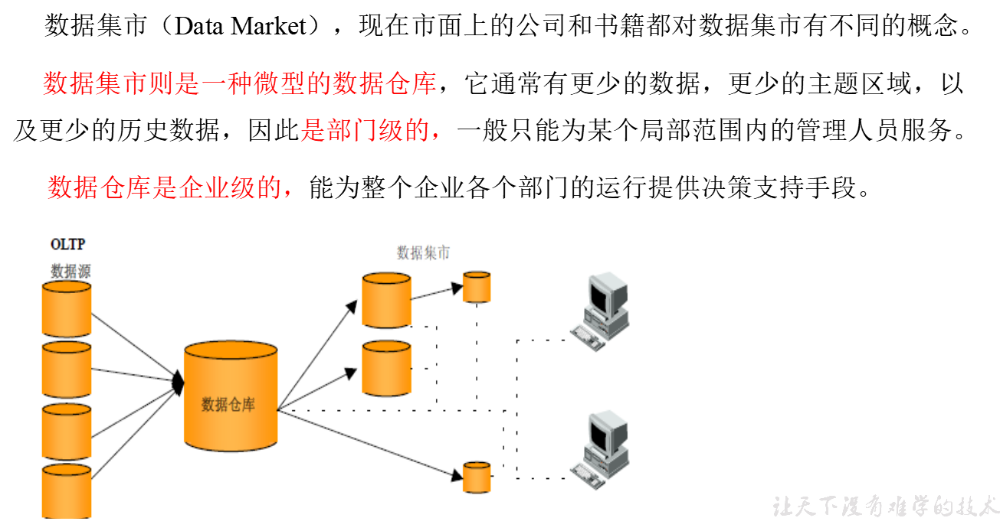
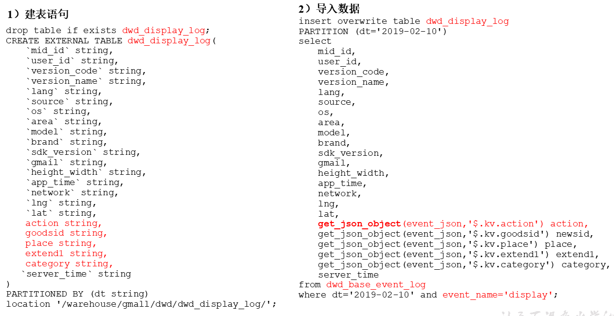

# 用户行为数据仓库

## 第一章，数仓分层的概念

### 1.1，数据仓库为什么要分层？

### 1.2，Ods层

### 1.3，dws

### 1.4，数据集市

 

### 1.5，数仓命名规范

每一层的前缀+主题名称

- ODS层命名为ods
-  DWD层命名为dwd
-  DWS层命名为dws
-  ADS层命名为ads
-  临时表数据库命名为xxx_tmp
-  备份数据数据库命名为xxx_bak

### 1.6，Hive和Mysql的安装

1. 集群规划

|       | 服务器hadoop102 | 服务器hadoop103 | 服务器hadoop104 |
| ----- | --------------- | --------------- | --------------- |
| Hive  | Hive            |                 |                 |
| MySQL | MySQL           |                 |                 |

2. 关闭Hive的元数据检查

~~~ java
//在hive-site.xml中添加
<property>
    <name>hive.metastore.schema.verification</name>
    <value>false</value>
</property>
~~~

### 1.7，Hive运行引擎

1. Tez是一个Hive的运行引擎，性能优于MR。为什么优于MR呢？看下图。

用Hive直接编写MR程序，假设有四个有依赖关系的MR作业，上图中，绿色是Reduce Task，云状表示写屏蔽（相当于写磁盘），需要将中间结果持久化写到HDFS。

Tez可以将多个有依赖的作业转换为一个作业，这样只需写一次HDFS，且中间节点较少，从而大大提升作业的计算性能。是hive优化的一种手段，基于内存计算，速度快。

2. 安装配置

~~~ java
//1 下载安装包
http://tez.apache.org
//配置tez到hive,进入到Hive的配置目录：/opt/module/hive/conf
//在hive-env.sh文件中添加tez环境变量配置和依赖包环境变量配置
# Set HADOOP_HOME to point to a specific hadoop install directory
export HADOOP_HOME=/opt/module/hadoop-2.7.2

# Hive Configuration Directory can be controlled by:
export HIVE_CONF_DIR=/opt/module/hive/conf

# Folder containing extra libraries required for hive compilation/execution can be controlled by:
export TEZ_HOME=/opt/module/tez-0.9.1    #是你的tez的解压目录
export TEZ_JARS=""
for jar in `ls $TEZ_HOME |grep jar`; do
    export TEZ_JARS=$TEZ_JARS:$TEZ_HOME/$jar
done
for jar in `ls $TEZ_HOME/lib`; do
    export TEZ_JARS=$TEZ_JARS:$TEZ_HOME/lib/$jar
done
拉直落压缩
export HIVE_AUX_JARS_PATH=/opt/module/hadoop-2.7.2/share/hadoop/common/hadoop-lzo-0.4.20.jar$TEZ_JARS
//在hive-site.xml文件中添加如下配置，更改hive计算引擎
<property>
    <name>hive.execution.engine</name>
    <value>tez</value>
</property>默认mr计算引擎
//配置tez,在Hive的/opt/module/hive/conf下面创建一个tez-site.xml文件
//添加如下内容
<?xml version="1.0" encoding="UTF-8"?>
<?xml-stylesheet type="text/xsl" href="configuration.xsl"?>
<configuration>
<property>
//未来要把tez上传到集群上面
	<name>tez.lib.uris</name>    <value>${fs.defaultFS}/tez/tez-0.9.1,${fs.defaultFS}/tez/tez-0.9.1/lib</value>
</property>
<property>
	<name>tez.lib.uris.classpath</name>    	<value>${fs.defaultFS}/tez/tez-0.9.1,${fs.defaultFS}/tez/tez-0.9.1/lib</value>
</property>
<property>
     <name>tez.use.cluster.hadoop-libs</name>
     <value>true</value>
</property>
<property>
     <name>tez.history.logging.service.class</name>        <value>org.apache.tez.dag.history.logging.ats.ATSHistoryLoggingService</value>
</property>
</configuration>
//上传tez到集群
//将/opt/module/tez-0.9.1上传到HDFS的/tez路径
hadoop fs -put /opt/module/tez-0.9.1/ /tez
//小结：运行Tez时检查到用过多内存而被NodeManager杀死进程问题：
Caused by: org.apache.tez.dag.api.SessionNotRunning: TezSession has already shutdown. Application application_1546781144082_0005 failed 2 times due to AM Container for appattempt_1546781144082_0005_000002 exited with  exitCode: -103
For more detailed output, check application tracking page:http://hadoop103:8088/cluster/app/application_1546781144082_0005Then, click on links to logs of each attempt.
Diagnostics: Container [pid=11116,containerID=container_1546781144082_0005_02_000001] is running beyond virtual memory limits. Current usage: 216.3 MB of 1 GB physical memory used; 2.6 GB of 2.1 GB virtual memory used. Killing container.
//这种问题是从机上运行的Container试图使用过多的内存，而被NodeManager kill掉了。
//方案一：或者是关掉虚拟内存检查。我们选这个，修改yarn-site.xml
<property>
<name>yarn.nodemanager.vmem-check-enabled</name>
<value>false</value>
</property>
//方案二：mapred-site.xml中设置Map和Reduce任务的内存配置如下：(value中实际配置的内存需要根据自己机器内存大小及应用情况进行修改)
<property>
　　<name>mapreduce.map.memory.mb</name>
　　<value>1536</value>
</property>
<property>
　　<name>mapreduce.map.java.opts</name>
　　<value>-Xmx1024M</value>
</property>
<property>
　　<name>mapreduce.reduce.memory.mb</name>
　　<value>3072</value>
</property>
<property>
　　<name>mapreduce.reduce.java.opts</name>
　　<value>-Xmx2560M</value>
</property>
~~~

## 第二章，数仓搭建之ODS层

### 2.1，单引号和双引号的区别

单引号是字符串，双引号是直接可以把里面的值取出来。双引号里面套上单引号，可以取出里面的值。单引号里面套双引号，中间全部当做字符串处理，谁在外面谁的权利大。``相当于直接就执行里面的命令。

~~~ java
//创建执行脚本
#!/bin/bash
do_date=$1

echo '$do_date'
echo "$do_date"
echo "'$do_date'"
echo '"$do_date"'
echo `date`
//结果命令：test.sh 2019-02-10
$do_date
2019-02-10
'2019-02-10'
"$do_date"
2019年 05月 02日 星期四 21:02:08 CST

~~~

（1）单引号不取变量值

（2）双引号取变量值

（3）反引号`，执行引号中命令

（4）双引号内部嵌套单引号，取出变量值

（5）单引号内部嵌套双引号，不取出变量值

### 2.2，ods原始数据层

原始数据层，存放原始数据，直接加载原始日志、数据，数据保持原貌不做处理。

1. 创建启动日志表分析

~~~ java
create external table if not exists ods_start_logs(line string)
partition by(dt string)
STORED AS INPUTFORMAT 'com.hadoop.mapred.DeprecatedLzoTextInputFormat'//以lzo格式压缩存储
outputformat 'org.apache.hadoop.hive.ql.io.HiveIgnoreKeyTextOutputFormat'//以text格式输出
LOCATION '/warehouse/gmall/ods/ods_start_log';//表的存储位置
~~~

2. 加载数据

~~~ java
load data inpath '/origin_data/gmall/log/topic_start/2019-02-10'//没有local，默认从hdfs上面家在数据
into table gmall.ods_start_logs partition(dt='2019-02-10');//加载到指定的分区并且以追加的方式加载
//注意：时间格式都配置成YYYY-MM-DD格式，这是Hive默认支持的时间格式
~~~

3. 创建事件日志表ods_event_log

~~~ java
create external table if not exists ods_event_log(line string)
partition by(dt string)
stored as input format  'com.hadoop.mapred.DeprecatedLzoTextInputFormat'//以lzo格式压缩存储
outputformat 'org.apache.hadoop.hive.ql.io.HiveIgnoreKeyTextOutputFormat'//以text格式输出
LOCATION '/warehouse/gmall/ods/ods_event_log';
~~~

4. 加载数据

~~~ java
load data inpath '/origin_data/gmall/log/topic_event/2019-02-10' into table gmall.ods_event_log partition(dt='2019-02-10');
~~~

5. 在ods层创建的只有两张表，并且每一张表中仅仅只有一个字段，而这一个字段的值就是没有解析过的字符串，和原始数据一样，不做任何处理。

### 2.3，ods层加载数据脚本

~~~ java
//脚本
#!/bin/bash

//定义变量方便修改
app=gmall//定义使用哪一个数据库
hive=/opt/module/hive/bin/hive  //定义hive执行命令路径
if [ -n "$1"]
then do_date-$1
else do_date=`date -d "-1 day" +%F`
fi
echo "===日志日期为 $do_date==="
sql=load data inpath '/origin_data/gmall/log/topic_start/$do_date' into table "$APP".ods_start_log partition(dt='$do_date');//加载原始启动日志到ods层表
load data inpath '/origin_data/gmall/log/topic_event/$do_date' into table "$APP".ods_event_log partition(dt='$do_date');
"
"$hive" -e "$sql"
//命令说明
说明1：
[ -n 变量值 ] 判断变量的值，是否为空
-- 变量的值，非空，返回true
-- 变量的值，为空，返回false
说明2：
查看date命令的使用，[atguigu@hadoop102 ~]$ date --help
//增加执行权限
chmod 777 ods_log.sh
~~~

## 第三章，数仓搭建之dwd层

- 对ODS层数据进行清洗（去除空值，脏数据，超过极限范围的数据，行式存储改为列存储，改压缩格式）

### 3.1，数据格式

~~~ java
//我们在ods层建立的两张表就是相当于把以下两个日志当做很长的字符串来存储，并不做任何改变，原样存储。
//事件表日志格式
1586316870393|
	{
		"cm"://代表公共字段
		{
			"ln":"-44.9",
			"sv":"V2.4.8",
			"os":"8.0.5",
			"g":"148YY9EO@gmail.com",
			"mid":"906",
			"nw":"3G",
			"l":"pt",
			"vc":"7",
			"hw":"750*1134",
			"ar":"MX",
			"uid":"906",
			"t":"1586292517543",
			"la":"-10.5",
			"md":"HTC-3",
			"vn":"1.2.4",
			"ba":"HTC",
			"sr":"H"
		},
		"ap":"app",//日志数据来源，app或者pc
		"et"://事件数组，可能有多个事件
		[
			{//第一个事件
				"ett":"1586297999286",////客户端事件产生时间
				"en":"display",// //事件名称
				"kv":
				{
					"goodsid":"210",//事件结果，以key-value形式自行定义
					"action":"1",
					"extend1":"2",
					"place":"5",
					"category":"30"
				}
			},
			{//第二个事件
				"ett":"1586310271165",
				"en":"ad",
				"kv":
				{
					"entry":"2",
					"show_style":"4",
					"action":"4",
					"detail":"102",
					"source":"1",
					"behavior":"2",
					"content":"1",
					"newstype":"5"
				}
			},
			{//第三个事件
				"ett":"1586226971490",
				"en":"notification",
				"kv":
				{
					"ap_time":"1586225915815",
					"action":"3",
					"type":"3",
					"content":""
				}
			},
			{//第四个事件
				"ett":"1586220564632",
				"en":"active_foreground",
				"kv":
				{
					"access":"",
					"push_id":"3"
				}
			},
			{//第五个事件
				"ett":"1586271793662",
				"en":"active_background",
				"kv":
				{
					"active_source":"1"
				}
			},
			{//第六个事件
				"ett":"1586225658096",
				"en":"comment",
				"kv":
				{
					"p_comment_id":0,
					"addtime":"1586248642340",
					"praise_count":955,
					"other_id":2,
					"comment_id":0,
					"reply_count":41,
					"userid":4,
					"content":"坝图毋济"
				}
			},
			{//第七个事件
				"ett":"1586310494787",
				"en":"favorites",
				"kv":
				{
					"course_id":1,
					"id":0,
					"add_time":"1586223969704",
					"userid":8
				}
			},
			{//第八个事件
				"ett":"1586289851308",
				"en":"praise",
				"kv":
				{
					"target_id":5,
					"id":4,"type":2,
					"add_time":"1586267187406",
					"userid":5
				}
	······	}
		]
	}
//启动表日志格式
{
	"action":"1",
	"ar":"MX",
	"ba":"HTC",
	"detail":"",
	"en":"start",
	"entry":"2",
	"extend1":"",
	"g":"N45Z1ON3@gmail.com",
	"hw":"640*960",
	"l":"es",
	"la":"-55.9",
	"ln":"-76.4",
	"loading_time":"10",
	"md":"HTC-14",
	"mid":"910",
	"nw":"WIFI",
	"open_ad_type":"2",
	"os":"8.2.1",
	"sr":"V",
	"sv":"V2.5.1",
	"t":"1586234757191",
	"uid":"910",
	"vc":"13",
	"vn":"1.2.7"
}
~~~

### 3.2，创建启动事件日志表

~~~ java
CREATE EXTERNAL TABLE if not exists dwd_start_log(
    `mid_id` string,
    `user_id` string, 
    `version_code` string, 
    `version_name` string, 
    `lang` string, 
    `source` string, 
    `os` string, 
    `area` string, 
    `model` string,
    `brand` string, 
    `sdk_version` string, 
    `gmail` string, 
    `height_width` string,  
    `app_time` string,
    `network` string, 
    `lng` string, 
    `lat` string, 
    `entry` string, 
    `open_ad_type` string, 
    `action` string, 
    `loading_time` string, 
    `detail` string, 
    `extend1` string
)
PARTITIONED BY (dt string)
location '/warehouse/gmall/dwd/dwd_start_log/';
~~~

### 3.3，向启动表中导入数据

~~~ java
insert overwrite table dwd_start_log
PARTITION (dt='2019-02-10')
select 
    get_json_object(line,'$.mid') mid_id,
    get_json_object(line,'$.uid') user_id,
    get_json_object(line,'$.vc') version_code,
    get_json_object(line,'$.vn') version_name,
    get_json_object(line,'$.l') lang,
    get_json_object(line,'$.sr') source,
    get_json_object(line,'$.os') os,
    get_json_object(line,'$.ar') area,
    get_json_object(line,'$.md') model,
    get_json_object(line,'$.ba') brand,
    get_json_object(line,'$.sv') sdk_version,
    get_json_object(line,'$.g') gmail,
    get_json_object(line,'$.hw') height_width,
    get_json_object(line,'$.t') app_time,
    get_json_object(line,'$.nw') network,
    get_json_object(line,'$.ln') lng,
    get_json_object(line,'$.la') lat,
    get_json_object(line,'$.entry') entry,
    get_json_object(line,'$.open_ad_type') open_ad_type,
    get_json_object(line,'$.action') action,
    get_json_object(line,'$.loading_time') loading_time,
    get_json_object(line,'$.detail') detail,
    get_json_object(line,'$.extend1') extend1
from ods_start_log 
where dt='2019-02-10';
~~~

### 3.4，启动日志脚本

~~~ java
#!/bin/bash
//定义变量，方便修改
APP=gmall   //定义使用的数据库
hive=/opt/module/hive/bin/hive
# 如果是输入的日期按照取输入日期；如果没输入日期取当前时间的前一天
if(-n "$1")
then
	do_date-$1
else
	do_date=`date -d "-1 day" +%F`  
fi
sql="
set hive.exec.dynamic.partition.mode=nonstrict;

insert overwrite table "$APP".dwd_start_log
PARTITION (dt='$do_date')
select 
    get_json_object(line,'$.mid') mid_id,
    get_json_object(line,'$.uid') user_id,
    get_json_object(line,'$.vc') version_code,
    get_json_object(line,'$.vn') version_name,
    get_json_object(line,'$.l') lang,
    get_json_object(line,'$.sr') source,
    get_json_object(line,'$.os') os,
    get_json_object(line,'$.ar') area,
    get_json_object(line,'$.md') model,
    get_json_object(line,'$.ba') brand,
    get_json_object(line,'$.sv') sdk_version,
    get_json_object(line,'$.g') gmail,
    get_json_object(line,'$.hw') height_width,
    get_json_object(line,'$.t') app_time,
    get_json_object(line,'$.nw') network,
    get_json_object(line,'$.ln') lng,
    get_json_object(line,'$.la') lat,
    get_json_object(line,'$.entry') entry,
    get_json_object(line,'$.open_ad_type') open_ad_type,
    get_json_object(line,'$.action') action,
    get_json_object(line,'$.loading_time') loading_time,
    get_json_object(line,'$.detail') detail,
    get_json_object(line,'$.extend1') extend1
from "$APP".ods_start_log 
where dt='$do_date';
"
$hive -e "$sql"//-e标示执行ql语句
//双引号标示里面的变量全部可以取出值。
~~~

- Notes：这里对get_json_object(string json_string, string path)方法进行说明
  第一个参数填写json对象变量，第二个参数使用$表示json变量标识，然后用 . 或 [] 读取对象或数组；如果输入的json字符串无效，那么返回NULL，每次只能返回一个数据项。

举例：
data 为 test表中的字段，数据结构如下：

~~~ java
data =
{
 "store":
        {
         "fruit":[{"weight":8,"type":"apple"}, {"weight":9,"type":"pear"}],  
         "bicycle":{"price":19.95,"color":"red"}
         }, 
 "email":"amy@only_for_json_udf_test.net", 
 "owner":"amy" 
}
~~~

1.get单层值

    hive> select  get_json_object(data, '$.owner') from test;
    结果：amy

2.get多层值.

    hive> select  get_json_object(data, '$.store.bicycle.price') from test;
    结果：19.95

3.get数组值[]

~~~ java
hive> select  get_json_object(data, '$.store.fruit[0]') from test;
结果：{"weight":8,"type":"apple"}
~~~

### 3.5，创建dwd层事件日志表

~~~ java
//事件日志的数据格式请看3.1
CREATE EXTERNAL TABLE if not exists dwd_base_event_log(
    `mid_id` string,
    `user_id` string, 
    `version_code` string, 
    `version_name` string, 
    `lang` string, 
    `source` string, 
    `os` string, 
    `area` string, 
    `model` string,
    `brand` string, 
    `sdk_version` string, 
    `gmail` string, 
    `height_width` string, 
    `app_time` string, 
    `network` string, 
    `lng` string, 
    `lat` string, 
    `event_name` string, 
    `event_json` string, 
    `server_time` string)
PARTITIONED BY (`dt` string)
stored as parquet
location '/warehouse/gmall/dwd/dwd_base_event_log/';
//说明：其中event_name和event_json用来对应事件名和整个事件。这个地方将原始日志1对多的形式拆分出来了。操作的时候我们需要将原始日志展平，需要用到UDF和UDTF。
~~~

这里对事件日志的解析稍微有些麻烦，应为事件日志里面有：服务器时间戳，公共字段，事件名称，事件详情字段，所以我们要对这些字段进行一一解析出来，因此在这里我们要进行自定义函数对字符串进行解析，方便我们进行调试工作。

### 3.6，自定义UDF函数解析事件日志字段（重点）

1. 解析思路

解析思路：

1. 我们传进来的line是ods层的一个事件日志log的字符串，字符串里面包含所有字段。
2. 传进来的key是公共字段的名称，以字符串形式传入，并且以,分割。
3. 然后我们对ods层的原始字符串进行切割，以“|”号切割，得到了一个服务器时间戳字段和一个json对象。
4. 根据公共字段的key值，我们得到公共字段的字符串，然后循环遍历得到公共字段
5. 至此，公共字段已经被我们解析完毕。

### 3.7，自定义UDTF函数解析具体的事件字段

解析思路：

1. 事件日志et是一个数组，首先我们先获取数组的长度，对应的也就是事件的个数。
2. 在这个事件数组中，每一个事件又是一个json对象，所以我们根据事件名称字段en获取事件名称，然后根据事件详情字段kv获取事件详情（事件详情以k-v键值形式存储），这里没有用到客户端产生事件的时间，所以时间字段暂时不用取出。
3. 至此，我们也解析完了时间日志字符串。

### 3.8，自定义函数关联HIVE

1. 打包自定义函数上传到/opt/module/hive/目录下面。这里不用上传有依赖的jar包。
2. 将jar包添加到Hive的classpath，添加临时函数

~~~ java
add jar /opt/module/hive/hivefunction-1.0-SNAPSHOT.jar;
~~~

3. **创建临时函数与开发好的java class关联**

~~~ java
//base_analizer是我们马上要用的临时函数名，必须要关联函数的全类名
create temporary function base_analizer as 'com.atguigu.udf.BaseFieldUDF';
create temporary function flat_analizer as 'com.atguigu.udtf.EventJsonUDTF';
//应为我们创建了两个函数，所以两个都要创建临时函数名
~~~

### 3.9，解析事件日志基础明细表（==有点小疑问==）

~~~ java
//这里的数据是导入3.5中创建的dwd_base_event_log表
set hive.exec.dynamic.partition.mode=nonstrict;

insert overwrite table dwd_base_event_log 
PARTITION (dt='2019-02-10')//用为事件日志表分区，所以我们这里也要分区
    select
    mid_id,
    user_id,
    version_code,
    version_name,
    lang,
    source,
    os,
    area,
    model,
    brand,
    sdk_version,
    gmail,
    height_width,
    app_time,
    network,
    lng,
    lat,
    event_name,//事件名称
    event_json,//事件详情
    server_time//服务器时间戳
from
(
select
    split(base_analizer(line,'mid,uid,vc,vn,l,sr,os,ar,md,ba,sv,g,hw,t,nw,ln,la'),'\t')[0]   as mid_id,
    split(base_analizer(line,'mid,uid,vc,vn,l,sr,os,ar,md,ba,sv,g,hw,t,nw,ln,la'),'\t')[1]   as user_id,
    split(base_analizer(line,'mid,uid,vc,vn,l,sr,os,ar,md,ba,sv,g,hw,t,nw,ln,la'),'\t')[2]   as version_code,
    split(base_analizer(line,'mid,uid,vc,vn,l,sr,os,ar,md,ba,sv,g,hw,t,nw,ln,la'),'\t')[3]   as version_name,
    split(base_analizer(line,'mid,uid,vc,vn,l,sr,os,ar,md,ba,sv,g,hw,t,nw,ln,la'),'\t')[4]   as lang,
    split(base_analizer(line,'mid,uid,vc,vn,l,sr,os,ar,md,ba,sv,g,hw,t,nw,ln,la'),'\t')[5]   as source,
    split(base_analizer(line,'mid,uid,vc,vn,l,sr,os,ar,md,ba,sv,g,hw,t,nw,ln,la'),'\t')[6]   as os,
    split(base_analizer(line,'mid,uid,vc,vn,l,sr,os,ar,md,ba,sv,g,hw,t,nw,ln,la'),'\t')[7]   as area,
    split(base_analizer(line,'mid,uid,vc,vn,l,sr,os,ar,md,ba,sv,g,hw,t,nw,ln,la'),'\t')[8]   as model,
    split(base_analizer(line,'mid,uid,vc,vn,l,sr,os,ar,md,ba,sv,g,hw,t,nw,ln,la'),'\t')[9]   as brand,
    split(base_analizer(line,'mid,uid,vc,vn,l,sr,os,ar,md,ba,sv,g,hw,t,nw,ln,la'),'\t')[10]   as sdk_version,
    split(base_analizer(line,'mid,uid,vc,vn,l,sr,os,ar,md,ba,sv,g,hw,t,nw,ln,la'),'\t')[11]  as gmail,
    split(base_analizer(line,'mid,uid,vc,vn,l,sr,os,ar,md,ba,sv,g,hw,t,nw,ln,la'),'\t')[12]  as height_width,
    split(base_analizer(line,'mid,uid,vc,vn,l,sr,os,ar,md,ba,sv,g,hw,t,nw,ln,la'),'\t')[13]  as app_time,
    split(base_analizer(line,'mid,uid,vc,vn,l,sr,os,ar,md,ba,sv,g,hw,t,nw,ln,la'),'\t')[14]  as network,
    split(base_analizer(line,'mid,uid,vc,vn,l,sr,os,ar,md,ba,sv,g,hw,t,nw,ln,la'),'\t')[15]  as lng,
    split(base_analizer(line,'mid,uid,vc,vn,l,sr,os,ar,md,ba,sv,g,hw,t,nw,ln,la'),'\t')[16]  as lat,
    split(base_analizer(line,'mid,uid,vc,vn,l,sr,os,ar,md,ba,sv,g,hw,t,nw,ln,la'),'\t')[17]  as ops,
    split(base_analizer(line,'mid,uid,vc,vn,l,sr,os,ar,md,ba,sv,g,hw,t,nw,ln,la'),'\t')[18]  as server_time//服务器时间戳
    from ods_event_log where dt='2019-02-10'  and base_analizer(line,'mid,uid,vc,vn,l,sr,os,ar,md,ba,sv,g,hw,t,nw,ln,la')<>'' 
) sdk_log lateral view flat_analizer(ops) tmp_k as event_name, event_json;
~~~

数据解析脚本

~~~ java
#!/bin/bash

# 定义变量方便修改
APP=gmall
hive=/opt/module/hive/bin/hive

# 如果是输入的日期按照取输入日期；如果没输入日期取当前时间的前一天
if [ -n "$1" ] ;then
	do_date=$1
else 
	do_date=`date -d "-1 day" +%F`  
fi 

sql="
	add jar /opt/module/hive/hivefunction-1.0-SNAPSHOT.jar;

	create temporary function base_analizer as 'com.atguigu.udf.BaseFieldUDF';
	create temporary function flat_analizer as 'com.atguigu.udtf.EventJsonUDTF';

 	set hive.exec.dynamic.partition.mode=nonstrict;

	insert overwrite table "$APP".dwd_base_event_log 
	PARTITION (dt='$do_date')
	select
	mid_id,
	user_id,
	version_code,
	version_name,
	lang,
	source ,
	os ,
	area ,
	model ,
	brand ,
	sdk_version ,
	gmail ,
	height_width ,
	network ,
	lng ,
	lat ,
	app_time ,
	event_name , 
	event_json , 
	server_time  
	from
	(
	select
	split(base_analizer(line,'mid,uid,vc,vn,l,sr,os,ar,md,ba,sv,g,hw,t,nw,ln,la'),'\t')[0]   as mid_id,
	split(base_analizer(line,'mid,uid,vc,vn,l,sr,os,ar,md,ba,sv,g,hw,t,nw,ln,la'),'\t')[1]   as user_id,
	split(base_analizer(line,'mid,uid,vc,vn,l,sr,os,ar,md,ba,sv,g,hw,t,nw,ln,la'),'\t')[2]   as version_code,
	split(base_analizer(line,'mid,uid,vc,vn,l,sr,os,ar,md,ba,sv,g,hw,t,nw,ln,la'),'\t')[3]   as version_name,
	split(base_analizer(line,'mid,uid,vc,vn,l,sr,os,ar,md,ba,sv,g,hw,t,nw,ln,la'),'\t')[4]   as lang,
	split(base_analizer(line,'mid,uid,vc,vn,l,sr,os,ar,md,ba,sv,g,hw,t,nw,ln,la'),'\t')[5]   as source,
	split(base_analizer(line,'mid,uid,vc,vn,l,sr,os,ar,md,ba,sv,g,hw,t,nw,ln,la'),'\t')[6]   as os,
	split(base_analizer(line,'mid,uid,vc,vn,l,sr,os,ar,md,ba,sv,g,hw,t,nw,ln,la'),'\t')[7]   as area,
	split(base_analizer(line,'mid,uid,vc,vn,l,sr,os,ar,md,ba,sv,g,hw,t,nw,ln,la'),'\t')[8]   as model,
	split(base_analizer(line,'mid,uid,vc,vn,l,sr,os,ar,md,ba,sv,g,hw,t,nw,ln,la'),'\t')[9]   as brand,
	split(base_analizer(line,'mid,uid,vc,vn,l,sr,os,ar,md,ba,sv,g,hw,t,nw,ln,la'),'\t')[10]   as sdk_version,
	split(base_analizer(line,'mid,uid,vc,vn,l,sr,os,ar,md,ba,sv,g,hw,t,nw,ln,la'),'\t')[11]  as gmail,
	split(base_analizer(line,'mid,uid,vc,vn,l,sr,os,ar,md,ba,sv,g,hw,t,nw,ln,la'),'\t')[12]  as height_width,
	split(base_analizer(line,'mid,uid,vc,vn,l,sr,os,ar,md,ba,sv,g,hw,t,nw,ln,la'),'\t')[13]  as app_time,
	split(base_analizer(line,'mid,uid,vc,vn,l,sr,os,ar,md,ba,sv,g,hw,t,nw,ln,la'),'\t')[14]  as network,
	split(base_analizer(line,'mid,uid,vc,vn,l,sr,os,ar,md,ba,sv,g,hw,t,nw,ln,la'),'\t')[15]  as lng,
	split(base_analizer(line,'mid,uid,vc,vn,l,sr,os,ar,md,ba,sv,g,hw,t,nw,ln,la'),'\t')[16]  as lat,
	split(base_analizer(line,'mid,uid,vc,vn,l,sr,os,ar,md,ba,sv,g,hw,t,nw,ln,la'),'\t')[17]  as ops,
	split(base_analizer(line,'mid,uid,vc,vn,l,sr,os,ar,md,ba,sv,g,hw,t,nw,ln,la'),'\t')[18]  as server_time
	from "$APP".ods_event_log where dt='$do_date'  and base_analizer(line,'mid,uid,vc,vn,l,sr,os,ar,md,ba,sv,g,hw,t,nw,ln,la')<>'' 
	) sdk_log lateral view flat_analizer(ops) tmp_k as event_name, event_json;
"

$hive -e "$sql"
~~~

### 3.10，dwd层事件表获取（解析基础明细表，以下每一张表均包含公共字段17个）

#### 3.11，商品点击表获取

- 商品点击表字段=公共字段+商品点击表字段+服务器时间戳

[商品点击表代码dwd_8]()

#### 3.12，商品详情页表

[商品详情页表dwd_9]()

#### 3.13，商品列表页表

[商品列表页表dwd_10]()

#### 3.14，广告表

[广告表dwd_11]()

#### 3.15，消息通知表

[消息通知表dwd_12]()

#### 3.16，用户前台或余额表

[用户前台活跃表dwd_13]()

#### 3.17，用户后台活跃表

[用户后台活跃表dwd_14]()

#### 3.18，评论表

[评论表dwd_15]()

#### 3.19，收藏表

[收藏表dwd_16]()

#### 3.20，点赞表

[点赞表dwd_17]()

#### 3.21，错误日志表

[错误日志表dwd_18]()

## 第四章，业务知识分析（非常重要）

### 4.1，业务术语介绍

1.  用户

   用户以设备为判断标准，在移动统计中，每个独立设备认为是一个独立用户。Android系统根据IMEI号，IOS系统根据OpenUDID来标识一个独立用户，每部手机一个用户。

2. 新增用户

   首次联网使用应用的用户。如果一个用户首次打开某APP，那这个用户定义为新增用户；卸载再安装的设备，不会被算作一次新增。新增用户包括日新增用户、周新增用户、月新增用户。

3. 活跃用户

   打开应用的用户即为活跃用户，不考虑用户的使用情况。每天一台设备打开多次会被计为一个活跃用户。

4. 周（月）活跃用户

   某个自然周（月）内启动过应用的用户，该周（月）内的多次启动只记一个活跃用户。

5. 月活跃率

   月活跃用户与截止到该月累计的用户总和之间的比例。

6. 沉默用户

   用户仅在安装当天（次日）启动一次，后续时间无再启动行为。该指标可以反映新增用户质量和用户与APP的匹配程度。

7. 版本分布

   不同版本的周内各天新增用户数，活跃用户数和启动次数。利于判断APP各个版本之间的优劣和用户行为习惯。

8. 本周回流用户

   上周未启动过应用，本周启动了应用的用户。

9. 连续n周活跃用户

   连续n周，每周至少启动一次。

10. 忠实用户

    连续活跃5周以上的用户

11. 连续活跃用户

    连续2周及以上活跃的用户

12. 近期流失用户

    连续n(2<= n <= 4)周没有启动应用的用户。（第n+1周没有启动过）

13. 留存用户

    某段时间内的新增用户，经过一段时间后，仍然使用应用的被认作是留存用户；这部分用户占当时新增用户的比例即是留存率。

    例如，5月份新增用户200，这200人在6月份启动过应用的有100人，7月份启动过应用的有80人，8月份启动过应用的有50人；则5月份新增用户一个月后的留存率是50%，二个月后的留存率是40%，三个月后的留存率是25%。

14. 用户新鲜度

    每天启动应用的新老用户比例，即新增用户数占活跃用户数的比例。

15. 单次使用时长

    每次启动使用的时间长度。

16. 日使用时长

    累计一天内的使用时间长度。

17. 启动次数计算标准

    IOS平台应用退到后台就算一次独立的启动；Android平台我们规定，两次启动之间的间隔小于30秒，被计算一次启动。用户在使用过程中，若因收发短信或接电话等退出应用30秒又再次返回应用中，那这两次行为应该是延续而非独立的，所以可以被算作一次使用行为，即一次启动。业内大多使用30秒这个标准，但用户还是可以自定义此时间间隔。

### 4.3，系统函数

1. collect_set函数

~~~ java
//创建表
drop table if exists stud;
create table stud (name string, area string, course string, score int);
//插入数据
insert into table stud values('zhang3','bj','math',88);
insert into table stud values('li4','bj','math',99);
insert into table stud values('wang5','sh','chinese',92);
insert into table stud values('zhao6','sh','chinese',54);
insert into table stud values('tian7','bj','chinese',91);
//查询
stud.name       stud.area       stud.course     stud.score
zhang3 bj      math    88
li4     bj      math    99
wang5   sh      chinese 92
zhao6   sh      chinese 54
tian7   bj      chinese 91
//按照course字段进行分组，然后把地区聚合起来，相同的地区只包含一个，最后计算平均分
//select course, collect_set(area), avg(score) from stud group by course;
chinese ["sh","bj"]     79.0
math    ["bj"]          93.5
//按照地区分组，把course聚合起来
select area,collect_set(course)from stud group by area;
OK
area    _c1
bj      ["chinese","math"]
sh      ["chinese"]
//当聚合起来某一个字段以后，形成一个集合，我们可以用下表方式取其中的一个值
select course, collect_set(area)[0], avg(score) from stud group by course;
chinese sh      79.0
math    bj      93.5
聚合后取出第一个值。
总结：collect_set函数就是把一个字段的所有取值全部集合起来，形成一个域。
~~~

2. 日期处理函数（date_format）
   - date_format函数（根据格式整理日期）计算月指标
   - 注意;hive系统默认的日期方式是：YYYY-MM-DD

~~~ java
hive (gmall)> select date_format('2019-02-10','yyyy-MM');
2019-02
相当于截取掉日，按照月统计
hive (gmall)> select date_format('2019-02-25','YYYY-MM');
OK
2019-02
~~~

3. date_add函数（加减日期）计算日的指标

~~~ java
hive (gmall)> select date_add('2019-02-10',-1);
2019-02-09
hive (gmall)> select date_add('2019-02-10',1);
2019-02-11
hive (gmall)> select date_add('2020-03-25',-1);
OK
_c0
2020-03-24
hive (gmall)>  select date_sub('2020-2-20',9);
OK
_c0
2020-02-11
~~~

4. next_day函数计算周的指标

~~~ java
//取当前天的下一个周一
hive (gmall)> select next_day('2019-02-12','MO')
2019-02-18
hive (gmall)> select next_day('2020-04-1','mon');
OK
_c0
2020-04-06
//计算本周的周一在那一天，先计算下一个周一在那一天，在减去7天即可，计算就用周一即可。
hive (gmall)> select date_add(next_day('2020-04-01','mon'),-7);
OK
_c0
2020-03-30
//说明：星期一到星期日的英文（Monday，Tuesday、Wednesday、Thursday、Friday、Saturday、Sunday）
~~~

5. last_day函数（求当月最后一天日期）

~~~java
hive (gmall)> select last_day('2019-02-10');
2019-02-28
hive (gmall)> select last_day('2020-4-1');
OK
_c0
2020-04-30
~~~

## 第五章，DWS层需求分析

### 5.1，用户活跃主题（dws层）

- 目标：统计当日、当周、当月活动的每个设备明细

#### 5.10，每日活跃设备分析

分析：“打开应用的用户即为活跃用户，不考虑用户的使用情况。每天一台设备打开多次会被计为一个活跃用户“。”所以我们直接根据启动日志来计算日活跃用户，应为启动表里面记录着每个用户启动应用的信息，只要用户打开应用，就认为是活跃用户。这里用到行转列函数concat_ws(),但是这里为什么要对除了设备id以外的字段做聚合和拼接操作，原因是应为我们把设备id看成一个用户是否活跃的唯一标准，而不去烤炉这个用户使用了各种型号手机或者程序版本号，比如某一台设备今天登陆了，但是我们并不考虑这台设备在哪里登录，网络模式等其他信息。

[每日活跃用户代码3_1]()

~~~ java
//日活跃设备数据，一条记录
10
10      
17|6    
1.3.6|1.2.5     
pt|es   
C|U     
8.2.2|8.0.8     
MX     
Huawei-0|sumsung-14      
Huawei|Sumsung  
V2.8.3|V2.8.7   
3IUQM9WF@gmail.com|DMMN0J01@gmail.com   
750*1134|640*960        
1549701334851|1549683819391     
3G|WIFI-68.3|-88.9      
15.7|-40.8      
2019-02-10
~~~

#### 5.11，每周活跃设备明细

分析：分析用户周活跃明细，我们是在日明细的基础上分析，每一个表都有很多分区，而我们的分区都是根据时间分区的，所以我们在天的明细表上在添加两个日期，周一和周期，而且周的明细表分区我们是按照时间区间进行划分的，即wk_dt字段进行划分。

[周设备活跃明细3_2]()

~~~ java
//周活跃设备数据，一条记录
10      
10      
17|6    
1.3.6|1.2.5     
pt|es   
C|U     
8.2.2|8.0.8     
MX     
Huawei-0|sumsung-14      
Huawei|Sumsung  
V2.8.3|V2.8.7   
3IUQM9WF@gmail.com|DMMN0J01@gmail.com   
750*1134|640*960        
1549701334851|1549683819391     
3G|WIFI-68.3|-88.9      
15.7|-40.8      
2019-02-04      
2019-02-10      
2019-02-04_2019-02-10
~~~

#### 5.12，每月活跃设备明细

[月活跃代码3_3]()

~~~ java
//月活跃设备数据,一条记录
10
10      
17|6|14 1.3.6|1.2.5|1.1.2       
pt|es|en        
C|U|S   
8.2.2|8.0.8|8.2.2       
MX      
Huawei-0|sumsung-14|HTC-7       
Huawei|Sumsung|HTC     
V2.8.3|V2.8.7|V2.5.6     
3IUQM9WF@gmail.com|DMMN0J01@gmail.com|807C7P23@gmail.co750*1134|640*960|750*1134        
1549701334851|1549683819391|1549720810981      
3G|WIFI|4G       
-68.3|-88.9|-61.5       
15.7|-40.8|8.4  2019-02
~~~

#### 5.13，当月，当周，当天活跃设备数

- 基于上面的当日，当周，当月设备活跃数分析，可以直接对上面三张表统计里面的元组个数，就可以计算出当月，当周，当天的活跃设备数。

### 5.3，新增用户数主题（DWS层）

- 首次联网使用应用的用户。如果一个用户首次打开某APP，那这个用户定义为新增用户；卸载再安装的设备，不会被算作一次新增。新增用户包括日新增用户、周新增用户、月新增用户。

分析：如何计算每日新增用户呢？刚开始新增用户表是空的，让每日活跃表和每日新增表进行左连接操作，这样连接后每日新增表中的用户id全部是null，说明活跃表中的用户全部是今天新增的，那么就把今天每日活跃表中的新增用户数据全部导入每日新增表，以后，每一次都让当天的用户活跃表和每日新增表进行左连接，这样，每一次连接后当天的每日新增表中都有用户id的值为null,说明这些用户是今天新增加的用户。notes:当天活跃用户包括以前的老用户和今天新增加的新用户）。

### 5.4，每日新增设备表

[每日新增设备3_8]()

### 5.5，用户留存主题（DWS层）

- 留存分析

#### 5.51，每日用户留存分析

分析：本例子是计算10日到11日的留存用户用户留存明细，用11日用户活跃设备明细表和11日的用户新增表进行连接诶，从连接表中选择在11日的活跃用户并且是在10日新增的用户，即为10-11日的留存用户，留存天数即为1。

#### 5.52，1,2,3，n天留存用户分析

[1,2,3留存用户9_3]()

#### 5.53，union和union all

区别：

​	（1）union会将联合的结果集去重，效率较union all差

​	（2）union all不会对结果集去重，所以效率高

#### 5.54，留存比率

分析：根据日留存用户表和新增设备表赛选出留存比率表。

### 5.6，数据准备

为了分析沉默用户、本周回流用户数、流失用户、最近连续3周活跃用户、最近七天内连续三天活跃用户数，需要准备2019-02-12、2019-02-20日的数据。

~~~ java
//2019-02-12数据准备
//1 修改日志时间
dt.sh 2019-02-12
//2 生成日志数据
lg.sh
// 3 将HDFS数据导入到ODS层
ods_log.sh 2019-02-12//在这里用的是脚本导入数据
//将ODS数据导入到DWD层
dwd_start_log.sh 2019-02-12//导入启动日志
dwd_base_log.sh 2019-02-12//导入公共字段数据
dwd_event_log.sh 2019-02-12//导入事件日志数据
//将DWD数据导入到DWS层
dws_uv_log.sh 2019-02-12
//验证导入是否正确
select * from dws_uv_detail_day where dt='2019-02-12' limit 2;
//以同样方法导入2019-02-20数据
~~~

### 5.7，沉默用户数

-  沉默用户：指的是只在安装当天启动过，且启动时间是在一周前
- 使用日活明细表dws_uv_detail_day作为DWS层数据

分析：以用户日活动基础明细表为基础，应为一个用户可能在不同的时间登陆，所以一用户id分组，并且时间是在一周前登陆过，最后在选择出登陆次数为1 的即可。

### 5.8，本周回流用户数(重点)

- 本周回流=本周活跃-本周新增-上周活跃
- 使用日活明细表dws_uv_detail_day作为DWS层数据

### 5.9，流失用户数

- 流失用户：最近7天未登录我们称之为流失用户
- 使用日活明细表dws_uv_detail_day作为DWS层数据

### 5.10，最近连续3周活跃用户（重点）

- 最近3周连续活跃的用户：通常是周一对前3周的数据做统计，该数据一周计算一次。
- 使用周活明细表dws_uv_detail_wk作为DWS层数据

### 5.11，最近七天内连续三天活跃的用户（重点）

- 说明：最近7天内连续3天活跃用户数
- 使用日活明细表dws_uv_detail_day作为DWS层数据

#### 5.12，数仓表整理

